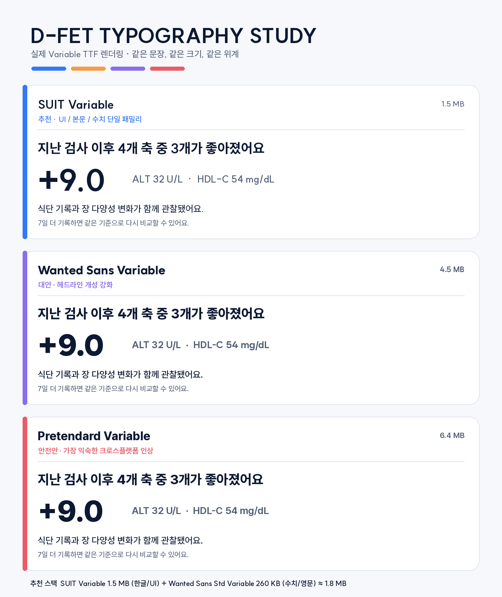

# D-FET 한글·데이터 폰트 조사

> 조사일: 2026-08-09  
> 대상: Flutter 회원 앱, 트레이너 iPad, Next.js 관리자 웹  
> 상태: 디자인 권고안 — 폰트 파일은 아직 제품에 번들하지 않음

## 1. 결론

추천 스택은 다음과 같다.

| 역할 | 글꼴 | 사용 범위 |
|---|---|---|
| Primary UI | **SUIT Variable** | 한글 제목·본문·버튼·탭·설명 |
| Data Display | **Wanted Sans Std Variable** | 큰 점수, 변화량, 영문 바이오마커, 단위 |
| Fallback | 시스템 sans-serif | 미지원 문자·특수문자 |

원본 TTF 기준 합계는 약 **1.8MB**다.

- SUIT Variable: 약 1.5MB
- Wanted Sans Std Variable: 약 260KB

앱 패키징 후 실제 증가량은 플랫폼 압축 방식에 따라 달라지므로 구현 시 IPA/APK 전후 크기를 다시 측정한다.

## 2. 현재 문제

현재 Material 테마는 `GoogleFonts.outfitTextTheme()`를 전역 적용하지만 프로젝트에 한글 폰트 파일은 번들하지 않는다.

- Outfit은 영문과 숫자에는 개성이 있다.
- 한글은 플랫폼 fallback에 의존해 iOS와 Android의 자형·글자 폭·행간이 달라질 수 있다.
- 같은 문장 안의 한글과 숫자가 서로 다른 조형으로 보일 수 있다.
- 네트워크가 제한된 환경에서는 Google Fonts 런타임 동작에 의존하지 않는 편이 안정적이다.

따라서 새 디자인에서는 한글 UI 글꼴을 앱 자산으로 고정하고, 데이터 숫자만 별도 라틴 글꼴로 분리한다.

## 3. 후보 비교

비교 이미지는 [`05_typography_comparison.png`](prototypes/ui_ux_redesign/05_typography_comparison.png)에서 확인할 수 있다.

| 후보 | 장점 | 단점 | 원본 Variable TTF | 판단 |
|---|---|---|---:|---|
| SUIT Variable | UI 본문 목적, 작은 한글 가독성, 비교적 작은 용량, 100–900 축 | 매우 강한 브랜드 개성보다는 정돈된 인상 | 약 1.5MB | **Primary 추천** |
| Wanted Sans Variable | 기하학적이면서 유연한 인상, 제목·숫자 개성, OpenType 기능 | 전체 한글 파일은 상대적으로 크고 작은 본문이 조금 강하게 보임 | 약 4.5MB | 전체 적용 대신 Std 사용 |
| Pretendard Variable | 익숙하고 안정적인 크로스플랫폼 UI, 9개 굵기 | D-FET 고유성이 약하고 세 후보 중 파일이 가장 큼 | 약 6.4MB | 안전한 대안 |

### 3.1 SUIT Variable

- 제작 의도 자체가 UI 본문용이다.
- 공식 저장소에서 Static과 Variable TTF/WOFF2를 제공한다.
- SIL Open Font License 1.1로 사용·수정·재배포할 수 있다.
- 로컬 OpenType 테이블 검사에서 `tnum`, `pnum`, `kern` 기능을 확인했다.
- 작은 설명, 긴 검사명, 한글–숫자 혼합 문장에서 가장 안정적이었다.

공식 배포: [sun-typeface/SUIT](https://github.com/sun-typeface/SUIT)

### 3.2 Wanted Sans Variable / Std

- 기하학적이지만 지나치게 차갑지 않은 제목·숫자 인상을 제공한다.
- 공식 설명상 7개 기본 굵기와 Variable Font를 제공한다.
- 한글 전체 파일 대신 라틴 전용 `Wanted Sans Std Variable`을 사용하면 약 260KB다.
- `tnum`, `zero`, 다양한 stylistic set을 지원해 큰 수치와 바이오마커에 적합하다.
- 한글 본문 전체에 적용하면 굵고 둥근 인상이 임상 설명보다 앞설 수 있다.

공식 배포: [wanteddev/wanted-sans](https://github.com/wanteddev/wanted-sans)

### 3.3 Pretendard Variable

- Inter와 Source Han Sans를 기반으로 한 크로스플랫폼 UI 글꼴이다.
- 공식 설명상 9개 굵기와 Variable Font를 제공한다.
- SIL Open Font License 1.1이다.
- 읽기 안정성은 높지만 널리 사용된 인상 때문에 이번 개편의 고유성 목표에는 덜 맞는다.

공식 배포: [orioncactus/pretendard](https://github.com/orioncactus/pretendard)

## 4. D-FET 타이포그래피 계약

### 4.1 스타일

| 토큰 | 글꼴 | 크기/굵기 | 용도 |
|---|---|---|---|
| `displayXL` | SUIT | 34–40 / 800 | 화면의 변화 문장 |
| `displayMetric` | Wanted Sans Std | 42–64 / 800 | 점수, 변화량, 검사 핵심값 |
| `headline` | SUIT | 24–28 / 800 | 화면 제목 |
| `title` | SUIT | 18–22 / 700 | 섹션 제목 |
| `body` | SUIT | 15–17 / 450–500 | 본문과 설명 |
| `label` | SUIT | 12–14 / 600 | 탭, 버튼, 상태 |
| `caption` | SUIT | 11–13 / 450–500 | 정책·동기화·보조 정보 |
| `biomarker` | Wanted Sans Std | 14–18 / 600–700 | ALT, HDL-C, mg/dL |

Flutter의 `FontWeight`는 가장 가까운 Variable 축 값으로 매핑하며, 시각 검수 후 50단위 미세 조정은 하지 않는다. 플랫폼 일관성을 위해 정해진 400/500/600/700/800 굵기를 우선 사용한다.

### 4.2 행간과 자간

- 큰 변화 문장: height `1.12–1.18`, letterSpacing `-0.6~-0.2`
- 제목: height `1.2–1.3`, letterSpacing `-0.3~0`
- 본문: height `1.45–1.6`, letterSpacing `0`
- 캡션: height `1.35–1.5`, letterSpacing `0`
- 큰 수치: height `0.95–1.05`, letterSpacing `-1.0~-0.4`
- 바이오마커 코드와 단위는 한글 자간 규칙을 공유하지 않는다.

음수 부호, 소수점, 단위 사이 간격을 화면별로 임의 조정하지 않고 `MetricValue` 컴포넌트가 관리한다.

### 4.3 숫자 규칙

- 시계열·비교표·점수에는 `FontFeature.tabularFigures()`를 사용한다.
- 큰 단일 숫자는 proportional figures도 비교 검수할 수 있다.
- `0`과 `O`, `1`과 `I`, `5`와 `S`가 함께 있는 바이오마커 표본으로 검수한다.
- 숫자와 단위를 같은 크기로 쓰지 않는다. 단위는 숫자의 40–55% 크기로 낮춘다.
- 범위 `12–35 U/L`에는 하이픈 대신 en dash를 사용한다.

## 5. 구현 제안

디자인 승인 후 다음 순서로 적용한다.

1. 공식 저장소의 고정 버전에서 파일과 OFL 라이선스를 가져온다.
2. `assets/fonts/`에 다음 파일을 둔다.
   - `SUIT-Variable.ttf`
   - `WantedSansStdVariable.ttf`
3. `pubspec.yaml`에 family와 weight 범위를 등록한다.
4. Material/Cupertino의 기본 TextTheme을 SUIT로 통일한다.
5. `MetricValue`, `ScoreGauge`, `BiomarkerRow`만 Wanted Sans Std를 사용한다.
6. `GoogleFonts.outfitTextTheme()` 전역 의존을 제거한다.
7. 라이트·다크, iOS·Android, 320px·글자 2.0 골든 테스트를 갱신한다.
8. IPA/APK 용량 전후를 기록한다.

## 6. 인수 기준

- iOS와 Android에서 같은 문장의 줄바꿈 차이가 핵심 화면 기준 1줄을 넘지 않는다.
- 320px 폭·글자 2.0에서 CTA와 수치가 잘리지 않는다.
- `ALT`, `AST`, `HDL-C`, `TBIL`, `mg/dL`, `μmol/L`, `+9.0`, `-12.5` 표본이 명확하다.
- 시계열 표의 숫자 열이 같은 자릿수에서 정렬된다.
- 앱이 오프라인이어도 폰트가 동일하게 렌더링된다.
- OFL 원문과 저작권 고지가 배포물에 포함된다.

## 7. 결정 사항

- **권고:** SUIT Variable + Wanted Sans Std Variable
- **보류:** Wanted Sans 한글 전체 적용
- **제외:** Outfit 전역 TextTheme 유지
- **대안:** 한 가족만 허용해야 하면 SUIT Variable 단독 사용
