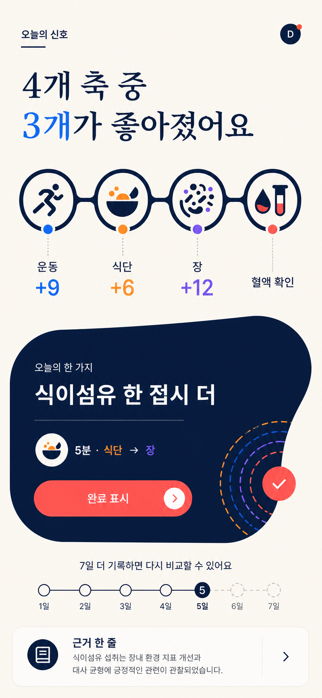
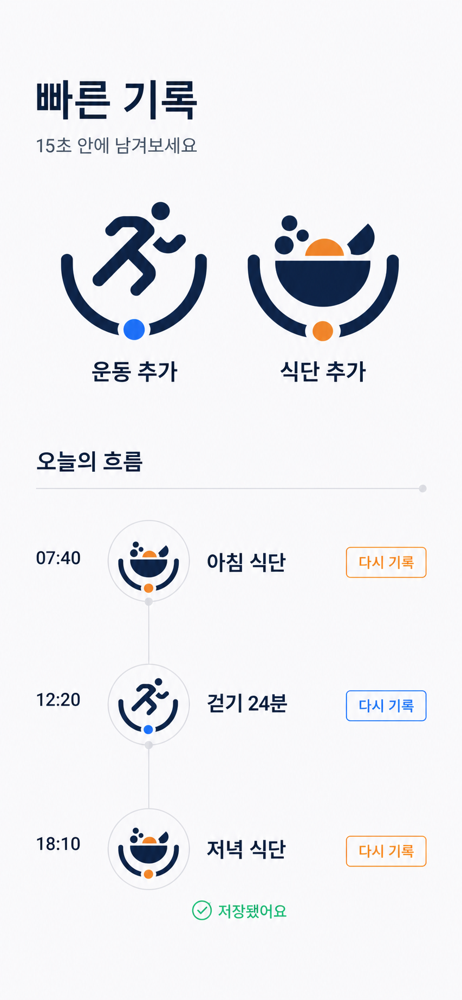
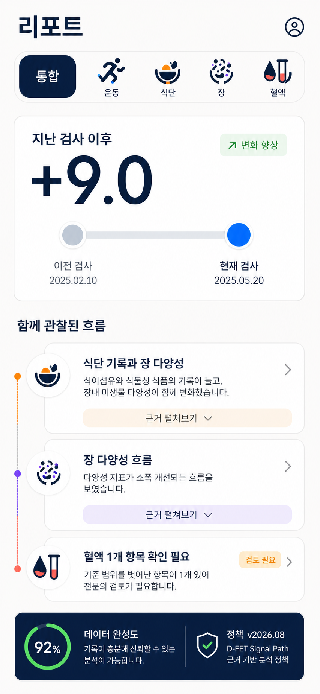
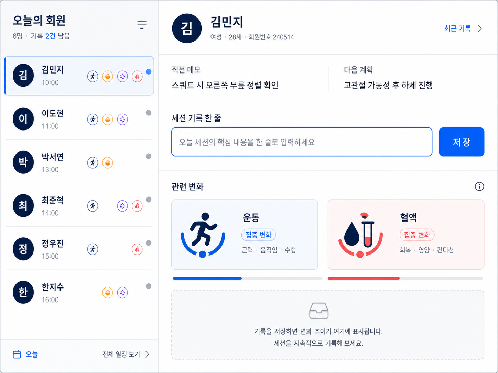

# D-FET Signal Path 이미지 프로토타입

이 폴더는 [`UI_UX_REDESIGN_PRD_2026.md`](../../UI_UX_REDESIGN_PRD_2026.md)의 방향 검토용 이미지 시안을 담는다.

## 선택본

### 1. Today Signal

- 변화 문장을 점수보다 먼저 표시
- 네 축을 하나의 연결된 Signal Rail로 표현
- `오늘의 한 가지`를 화면의 가장 강한 행동으로 배치
- 다음 비교 가능 시점을 시간 노드로 표시

### 2. Quick Capture

- 운동·식단 축의 U자 베이스를 빠른 추가 버튼의 형태로 확장
- 저장된 기록을 시간 노드로 연결
- 라이트 모드와 낮은 그림자, 명확한 대비를 우선

### 3. Evidence Report

- 통합·운동·식단·장·혈액을 같은 Axis Lens로 탐색
- 변화와 근거를 하나의 세로 흐름으로 연결
- 완성도와 정책 버전을 별도 Evidence Ribbon으로 분리

### 4. Session Focus iPad

- 담당 회원 목록과 세션 상세를 고정된 2열로 구성
- 직전 메모와 다음 계획을 입력보다 먼저 표시
- 한 줄 기록을 유일한 주 행동으로 설정
- 빈 상태에서도 콘텐츠 프레임의 높이와 위치를 유지

## 생성 방식

- 도구: Codex 내장 ImageGen
- 유형: `ui-mockup`
- 참조 자산:
  - `assets/images/axis_icons/axis_motion.png`
  - `assets/images/axis_icons/axis_nutrition.png`
  - `assets/images/axis_icons/axis_gut.png`
  - `assets/images/axis_icons/axis_blood.png`

## 최종 프롬프트 세트

모든 시안은 다음 공통 조건을 사용했다.

- D-FET 네 축 아이콘의 식별 가능한 실루엣과 축별 색상을 유지한다.
- 딥 네이비 `#0D1933`, 쿨 아이보리, Motion Blue, Nutrition Orange, Gut Violet, Blood Coral을 사용한다.
- 초록색은 완료 상태에만 제한한다.
- 반복되는 일반 카드 그리드, 이모지, 스톡 일러스트, 과도한 pill, glassmorphism을 피한다.
- 변화 문장, 연결 노드, 주 행동, 근거 리본의 위계를 만든다.
- Today Signal은 네 축 변화와 오늘 한 가지 행동을 한 화면에 구성한다.
- Quick Capture는 운동·식단 빠른 추가와 시간순 기록 노드를 구성한다.
- Evidence Report는 축 필터, 검사 전후 변화, 함께 관찰된 근거, 데이터 완성도와 정책 버전을 구성한다.
- Session Focus는 회원 목록, 직전 메모, 다음 계획, 한 줄 세션 기록을 iPad 2열에 구성한다.

## 구현 시 주의

이 이미지는 구조와 분위기를 검토하기 위한 생성형 시안이다. 이미지 안의 날짜, 수치, 임상 설명과 일부 글자 형태는 구현 사양이 아니다. 실제 Flutter/SwiftUI 구현에서는 다음을 다시 보장한다.

- PRD에 확정된 한국어 문구와 실제 데이터 사용
- 원본 축 아이콘 PNG 또는 코드 컴포넌트 사용
- WCAG 대비와 동적 글자 크기
- 비진단·비인과 콘텐츠 원칙
- 320·390·430px와 iPad split view 반응형 동작
