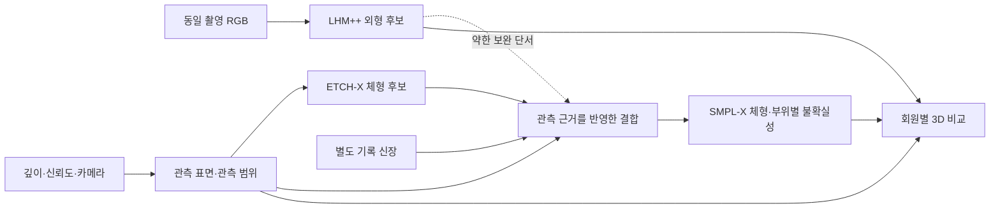

# LHM++ · ETCH/ETCH-X · iPhone RGB-D 체형 분석 연구 검토

작성일: 2026-09-28. 대상: DFET Coach의 회원별 3D 외형, 체형 분석, 반복 측정과 스포츠 기능 평가.

**문헌·공개 코드 조사와 연구 설계 제안이다. 이번 조사에서 모델 추론, 학습, 실제 치수 정확도 실험은 실행하지 않았다.** 아래에서 `확인`은 원문·코드에서 확인한 내용, `판단`은 그에 대한 해석, `제안`은 아직 검증하지 않은 연구 설계를 뜻한다. 기존 앱 기능과 새 연구의 예정 기능을 구분한다.

## 1. 결론과 연구 질문

**판단:** 세 기술은 상호 보완적이다. LHM++는 사람이 이해하기 좋은 외형을, ETCH 계열은 의복 아래 체형의 모델 추정을, iPhone RGB-D는 실제로 보인 외부 표면의 거리 단서를 제공한다. 그러나 결과를 순서대로 연결하는 것만으로 계측 정확도나 연구 독창성이 생기지는 않는다.

가장 먼저 비교할 구성은 **RGB → LHM++ 외형**, **RGB-D 관측 표면 → ETCH-X 체형**을 병렬로 만들고 같은 좌표에서 비교하는 것이다. 그 다음 연구는 **어느 부위가 실제 관측에 의해 지지되는지에 따라 두 추정의 영향력을 조절하는 결합**이다. LHM++가 만들어 낸 미관측 표면을 실제 스캔과 같은 증거로 사용하지 않는 것이 핵심이다.

주 연구 질문을 다음과 같이 제안한다.

> 일부만 보이고 옷의 영향을 받는 iPhone 촬영에서, 관측 범위를 고려한 LHM++·ETCH-X 결합이 RGB-D+ETCH-X 기준선보다 실제 치수 오차와 의복에 따른 변동을 줄이는가? 동시에 실제 체형 변화는 보존하고, 알 수 없는 부위는 적절히 보류하는가?

결과가 부정적이어도 의미가 있다. **LHM++가 시각화만 개선하고 치수 추정에는 도움이 되지 않는다면, 외형 뷰어에 유지하고 계측 계산에서는 제외하는 것이 타당하다.** 이 판단을 실험으로 할 수 있어야 한다.

## 2. 각 기술이 실제로 제공하는 것

| 기술 | 입력 → 출력 | 강점 | 계측에서 해결하지 못하는 것 |
|---|---|---|---|
| LHM++ | 동일인의 RGB 1장 이상 → 가동 가능한 Gaussian 아바타 | 적은 사진, 서로 다른 자세의 입력, 외관·의복·색 표현 | 보이지 않은 부위의 진실성, 옷 아래 피부 치수, 절대 척도 보장 |
| ETCH | 옷 입은 3D 표면 → tightness 벡터·마커 대응 → SMPL | 의복과 내부 체형을 구분해 추정하는 명시적 단계 | 가려진 체형의 유일한 복원, SMPL-X 직접 호환 |
| ETCH-X | 옷 입은 3D 표면 → tightness → 조밀한 대응 기반 SMPL-X 피팅 | 체형과 손 등 표현 확장, 부분 관측을 겨냥한 학습 | 실제 iPhone 관측 및 LHM++ 추출 표면에서의 정확도 보장 |
| iPhone ARKit sceneDepth | RGB와 LiDAR의 융합 → 미터 단위 깊이·신뢰도 등급 | 실세계 크기와 관측 표면의 근거 | 의복 아래 몸, 미관측 뒤쪽, 질량·근력·기능 |

위 표의 기술 계약은 다음 공식 자료를 근거로 요약했다. [LHM++ 논문](https://arxiv.org/html/2506.13766v2), [ETCH 논문](https://arxiv.org/abs/2503.10624), [ETCH-X 논문](https://arxiv.org/abs/2604.08548v3), [Apple ARKit 설명](https://developer.apple.com/videos/play/wwdc2020/10611/).

### 2.1 LHM++: 외형 재구성과 체형 계측의 차이

**확인:** LHM++는 SMPL-X 표면 앵커와 영상 특징을 결합해 canonical 공간의 Gaussian을 예측한다. 가동에는 스키닝을 사용한다. 여기서 canonical은 아바타의 기준 자세이며, 직접 측정한 피부 표면이라는 뜻은 아니다. 평가는 주로 PSNR·SSIM·LPIPS 등 렌더 영상 품질이다. [논문 §3–4](https://arxiv.org/html/2506.13766v2)

공개 코드에는 이미지에서 체형 파라미터 `betas`를 예측하는 ShapeHead와 적용 분기가 있다. 따라서 “모든 사람에게 같은 골격만 쓴다”는 설명도 부정확하다. 다만 설정·체크포인트에 따라 적용 여부가 달라지며, 개인별 β가 있다는 사실만으로 실측 체형이 검증되지는 않는다. [모델 코드](https://github.com/aigc3d/LHM-plusplus/blob/main/core/models/modeling_humana4o_lrm.py)

공식 구현의 신경 렌더러와 직접 Gaussian 렌더링은 다르다. PLY export 지원도 모델 종류에 따라 다르다. PLY만 남기면 원래 β, 포즈, 카메라, 척도와 스키닝 상태가 모두 보존된다고 볼 수 없다. 계측 재현에는 이들을 함께 저장해야 한다. [공식 모델·export 설명](https://github.com/aigc3d/LHM-plusplus), [PLY exporter](https://github.com/aigc3d/LHM-plusplus/blob/main/scripts/inference/to_gs_ply.py)

**판단:** 사용자가 지적한 대로 이미 만들어진 LHM++ 3D는 충분히 분석 대상이다. 다만 분석 대상을 구분해야 한다. 외부 의복의 폭·실루엣과 영상상 외관은 분석할 수 있지만, 그 표면에서 얻은 값을 곧바로 피부 둘레나 근육량으로 부르면 안 된다. 재구성 외형, 체형 모델, 실제 관측을 함께 보여 주는 것이 적절하다.

판본도 고정해야 한다. arXiv `2506.13766`의 v1은 PF-LHM, v2는 LHM++다. 동일 계보를 서로 독립적인 두 방법으로 세지 않는다. [v1](https://arxiv.org/abs/2506.13766v1), [v2](https://arxiv.org/abs/2506.13766v2)

### 2.2 ETCH와 ETCH-X: 의복 아래 체형의 추정

**확인:** ETCH의 tightness는 옷 표면에서 몸으로 향하는 변위를 추정하는 표현이다. 입력 회전에 따라 방향도 함께 회전하는 특징과 거리 크기를 나눠 다루고, 86개 희소 마커로 체형을 맞춘다. 이 중간 표현은 부위별 실패를 살피는 데 유용하다. [ETCH 방법 §3](https://arxiv.org/html/2503.10624v2)

공식 데모는 삼각형 메시에서 5,000점을 샘플링하고, 예측 벡터와 마커를 이용해 SMPL을 피팅한다. 중심 이동은 하지만 입력 단위를 신장에 맞춰 자동 변환하지 않는다. `smplx`라는 Python 패키지를 가져오더라도 실제 피팅 클래스는 `SMPL`이다. [inference_demo.py](https://github.com/boqian-li/ETCH/blob/main/src/inference_demo.py), [fit_SMPL.py](https://github.com/boqian-li/ETCH/blob/main/src/models/fit_SMPL.py)

ETCH-X는 tightness 단계와 조밀한 대응 기반 체형 피팅을 분리하고 SMPL-X로 확장한다. 의복 자료와 자세 자료를 서로 다른 단계에 활용할 수 있고, MANO 기반 손 보정은 선택 경로다. 우리 SMPL-X 기반 파이프라인과 연구 인터페이스가 더 잘 맞는 후보지만, 동일 모델 계열이라는 이유만으로 형상 파라미터를 복사할 수는 없다. [ETCH-X 공식 구조](https://github.com/XiaobenLi00/ETCH-X#-overview)

**판단:** 연구 주력 후보는 ETCH-X, 비교·재현 기준선은 ETCH가 적절하다. X가 복잡한 입력에서 유리한지 우리 관측 데이터로 확인해야 하며, 논문 순위만으로 채택을 확정할 단계는 아니다.

옷 아래 몸은 본질적으로 식별이 어려운 경우가 있다. 같은 헐렁한 옷 표면을 설명하는 여러 체형이 가능하다. 모델은 학습된 사람·옷의 분포로 그중 하나를 고른다. 따라서 “옷 제거”라는 표현보다 **의복 아래 체형 추정**이 정확하다. 관측이 부족할수록 하나의 확정 수치 대신 가능한 범위와 보류를 검토해야 한다.

### 2.3 LiDAR: 강한 거리 단서이지만 피부 정답은 아님

**확인:** Apple sceneDepth는 순수 원시 LiDAR 점군이 아니라 RGB와 LiDAR를 융합한 깊이 맵이다. confidence는 low/medium/high 등급이다. RGB 결과와 깊이 결과가 맞는다고 완전히 독립적인 두 센서 검증으로 해석하면 안 된다. high 등급을 임의로 ±몇 mm 또는 95% 정확도로 바꾸지도 않는다. [Apple WWDC20](https://developer.apple.com/videos/play/wwdc2020/10611/)

`camera.transform`은 카메라의 월드 위치·방향이다. 사람이 회전하거나 팔을 움직이는 변환까지 알려 주지 않는다. 화면 회전, 카메라 좌표, 깊이 해상도에 따른 intrinsics 변환도 별도로 맞춰야 한다. [Apple camera transform](https://developer.apple.com/documentation/arkit/arcamera/transform), [깊이 점군 예제](https://developer.apple.com/documentation/arkit/displaying-a-point-cloud-using-scene-depth)

**판단:** 의복 표면은 실제 관측이지만 피부 표면은 아니다. 깊이 손실을 몸 모델 전체에 직접 걸면 헐렁한 옷만큼 몸을 키우는 오류가 생길 수 있다. 피부 노출, 밀착 의복, 느슨한 의복, 관측 없음의 네 조건을 구분하는 설계가 필요하다. 이 분류 자체도 오차가 있으므로 정답으로 고정하지 않는다.

## 3. 연결 방식별 장단점

아래는 구현 완료 상태가 아닌 설계 비교다.

| 구성 | 기대 이득 | 주요 실패 방식 | 연구·제품 판단 |
|---|---|---|---|
| A. RGB→LHM++, RGB-D→ETCH-X 병렬 | 서로 다른 근거를 그대로 보존하고 오차 위치를 비교 가능 | 두 결과의 자세·척도 정렬이 틀리면 비교도 틀림 | 첫 구현과 필수 기준선. 그 자체의 신규성은 낮음 |
| B. LHM++→표면 메시 추출→ETCH/X | RGB만 있는 과거 촬영도 내부 체형 후보 생성 가능 | 생성된 뒤쪽·척도·메시 추출 오차를 실제 스캔처럼 학습 모델에 전달 | 유용한 비교군. 계측 주력으로 바로 채택하지 않음 |
| C. ETCH-X 체형→LHM++ 조건·변형 갱신 | 체형 모델과 외관이 일관된 아바타 | 옷이 몸을 관통하거나 질감·Gaussian 형태가 왜곡될 수 있음 | 체형이 검증된 뒤 외형 결합 연구로 진행 |
| D. 관측 범위를 반영한 RGB-D·ETCH-X·LHM++ 결합 | 실측 근거가 강한 영역과 생성 의존 영역을 다르게 처리 | 가중치가 잘못되면 센서 잡음 또는 모델 편향을 강화 | 주 연구 후보. A보다 독립 실측 오차가 줄어야 함 |
| E. 세션 내 다중 자세·다중 의복 공동 추정 | 같은 몸을 설명하는 관측을 늘려 우연한 오류를 줄임 | 과도한 공유 제약이 실제 날짜별 체형 변화를 지움 | D 이후. 세션 내부 공유와 날짜별 변화는 분리 |

### 3.1 B가 단순 파일 변환으로 끝나지 않는 이유

Gaussian 중심점은 삼각형 표면의 점 샘플과 다르다. 점의 크기·방향·불투명도도 렌더링에 관여하므로 중심 좌표만 ETCH에 넣는 것은 다른 입력 분포를 만드는 일이다. 표면 추출에도 임계값, 가림, floaters, 얇은 부분, 관측되지 않은 면의 문제가 남는다.

SuGaR는 표면 정렬과 메시 추출을 연구한 유력 참고 방법이다. 그러나 공개 과정에는 추가 최적화가 포함된다. 어떤 LHM++ PLY든 정확한 신체 메시로 바꿔 주는 범용 변환기로 간주하면 안 된다. 2DGS 역시 표면 지향 표현과 손실을 갖춘 별도 재구성 방법이며, 기존 3DGS 파일의 단순 포맷 변경이 아니다. [SuGaR 공식 구현](https://github.com/Anttwo/SuGaR), [2DGS 공식 프로젝트](https://surfsplatting.github.io/)

ETCH 원논문에는 생성 인체에 대한 정성 사례도 있다. 따라서 “생성 외형을 전혀 다뤄 본 적이 없다”는 주장은 피한다. 정확한 공백은 **LHM++ Gaussian에서 추출한 표면과 우리 iPhone 관측에서 계측 성능이 정량 검증되지 않았다**는 점이다. [ETCH 논문 Fig. 11](https://openaccess.thecvf.com/content/ICCV2025/papers/Li_ETCH_Generalizing_Body_Fitting_to_Clothed_Humans_via_Equivariant_Tightness_ICCV_2025_paper.pdf)

### 3.2 C는 β 교체만으로 되지 않는다

ETCH의 SMPL β와 LHM++의 SMPL-X β는 직접 호환되지 않는다. [공식 모델 변환 문서](https://github.com/vchoutas/smplx/blob/main/transfer_model/README.md) SMPL-X끼리도 템플릿, 형상 기저, 성별 설정, 파라미터 차원과 버전을 확인해야 한다. 필요하면 메시 대응을 통해 재피팅하고 원래 변환을 기록한다.

새 체형으로 Gaussian을 이동할 때는 중심뿐 아니라 방향·공분산, 스키닝 가중치와 옷의 여유 공간도 검토해야 한다. 기존 색을 보존했더라도 형태가 찌그러지면 성공이 아니다. 원래 외형을 그대로 보존한 뷰와 체형에 맞춰 갱신한 뷰를 구분해 평가한다.

### 3.3 세로 정렬의 정의

단순히 머리·발을 같은 화면 높이에 맞추는 것은 계측 정렬이 아니다. 다음을 각각 저장한다.

1. **척도:** 미터 기준 센서 좌표, 입력 신장을 사용했는지, 척도 추정의 불확실성.
2. **공간:** 카메라→월드→사람 좌표 변환과 좌표축·손잡이성. 바닥·중력 기준이 실제로 확보됐는지.
3. **자세:** 촬영 시점의 포즈와 canonical 포즈 사이의 변형. 단순 회전으로 팔 자세 차이를 해결하지 않는다.
4. **대응:** 비교하는 랜드마크·부위가 무엇인지. 의복 실루엣을 피부 랜드마크로 대체하지 않는다.

형상 비교는 동일 기준 자세에서, 자세 평가는 실제 촬영 자세에서 한다. 신장으로 크기를 맞춘 결과는 `신장 조건부`로 분리하며, 신장 일치를 다시 정확도 증거로 사용하지 않는다.

## 4. 새 비전 연구로 만들 때의 기여 범위

| 기존 연구 | 이미 다룬 핵심 | 우리 연구가 추가로 증명해야 할 것 |
|---|---|---|
| DoubleFusion | 깊이 기반 외부 표면과 내부 몸 모델의 이중 표현·추적 | 소비자 RGB-D와 생성 외형의 혼합에서 부위별 관측 근거를 유지하는 방법 |
| BUFF / 몸 아래 의복 연구 | 여러 자세의 옷 입은 관측을 이용한 체형 추정 | 실제 의복 변화에도 치수가 안정적이며 날짜별 실제 변화는 보존하는지 |
| ETCH / ETCH-X | tightness와 체형 대응·피팅 | 실제 깊이 결손·잡음과 생성 표면의 입력 차이에 대한 강건성 |
| SuGaR / 2DGS | Gaussian 계열에서의 표면 재구성 | 인간의 움직임·의복·부분 관측에서 표면 오류가 치수에 미치는 영향 |
| D3GA | 의복·몸 등 Gaussian 계층과 변형 | 보기 좋은 변형을 넘어 독립 실측 체형과 일치하는지 |

근거: [DoubleFusion](https://arxiv.org/abs/1804.06023), [BUFF 관련 원논문](https://arxiv.org/pdf/1703.04454), [ETCH-X](https://arxiv.org/abs/2604.08548v3), [SuGaR](https://github.com/Anttwo/SuGaR), [2DGS](https://surfsplatting.github.io/), [D3GA](https://arxiv.org/abs/2311.08581).

**판단:** “SMPL-X 위에 Gaussian을 입히고 옷을 분리했다”만으로는 신규 기여가 약하다. 문헌 검토 범위 안에서 유망한 기여 후보는 다음 세 가지다. 최초라고 확정하는 주장은 하지 않는다.

- **관측 근거에 따른 결합:** 센서가 지지하는 영역과 생성에 의존한 영역을 명시하고, 불확실한 보완이 계측을 지배하지 않도록 한다.
- **치수의 불확실성과 보류:** 예쁜 완성 모델을 항상 출력하는 대신, 부위별 치수 범위와 재촬영 필요성을 독립 자료로 보정한다.
- **시간에 따른 체형 추적:** 옷·자세로 생긴 가짜 변화는 줄이면서 실제 변화까지 평균화하지 않는다.

### 4.1 제안하는 최소 연구 모델

다음은 기존 논문에 있는 완성 알고리즘이 아니라 새 설계 초안이다.



변수는 세션 체형 `β`, 프레임별 자세 `θ_t`, 외부 의복 표면 `C_t`, Gaussian 외형 `G`로 분리한다. 첫 단계에서는 사전학습 모델을 고정하고 정렬·형상 피팅만 수행한다. 데이터와 개선 근거 없이 전체 모델 재학습부터 시작하지 않는다.

제안 목적함수의 역할은 다음과 같다.

| 항 | 비교 대상 | 설계 조건 |
|---|---|---|
| 관측 깊이 | 렌더링된 **외부 표면**과 실제 관측 깊이 | 유효·가시 영역만 사용. 몸을 모든 옷 표면에 직접 밀착시키지 않음 |
| 체형 안내 | ETCH-X가 제안한 내부 체형 대응 | 부위·의복·관측 조건에 따른 오차를 보정한 가중치 |
| RGB | 실제 사진의 실루엣·랜드마크·외관 | 생성한 뒷모습을 새 관측처럼 재투입하지 않음 |
| 신장 | 기록 신장과 모델 신장 | 자세·기록 오차를 포함한 부드러운 제약 |
| 형상·시간 사전분포 | 가능한 인체와 세션 내 일관성 | 개인의 특이 체형·실제 변화가 지워지는지 별도 평가 |
| LHM 보완 | 외형의 추가 단서 | 없어도 작동하도록 구성하고 추가효과를 절제 실험으로 증명 |

이 손실들의 합을 곧바로 확률 모델이나 검증된 신뢰구간이라고 부르지 않는다. LHM++·ETCH-X·sceneDepth가 공유 입력에서 파생될 수 있어 증거가 상관되기 때문이다. 여러 번 모델을 실행해 값이 안정적이라는 사실만으로 편향을 알 수도 없다.

관측 없는 부분에는 결과를 비우거나 넓은 범위를 반환할 수 있어야 한다. 부분 메시의 구멍을 임의로 막은 뒤 “몸은 반드시 이 안에 있다”는 제약을 주면 거짓 제약이 생길 수 있다. 밀착·느슨한 의복 분류와 가중치는 개발 자료에서 조정하고 별도 자료에서 검증한다.

### 4.2 반증 가능한 가설

| 가설 | 필요한 증거 | 기각·축소 조건 |
|---|---|---|
| H1. 관측 근거를 반영하면 단순 직렬 연결보다 정확하다 | 같은 사람·같은 입력·같은 척도 조건에서 독립 치수 오차와 큰 실패 감소 | 평균만 개선되고 특정 의복·체형에서 큰 오류가 증가 |
| H2. LHM++ 추가 단서가 RGB-D+ETCH-X보다 유용하다 | 추가 관측량을 맞춘 비교에서 부위별 실측 오차 개선 | 렌더 화질만 좋아지고 치수는 같거나 나빠짐 → 외형 용도로 제한 |
| H3. 세션 내 공동 추정은 옷에 덜 민감하다 | 의복 간 변동 감소와 독립 실측 정확도 유지 | 같은 평균 체형을 반복 출력해 실제 변화까지 지움 |
| H4. 보류가 실패를 선별한다 | 보류율에 따른 잔여 오차 곡선·독립 구간 포함률 | 자신 있다고 출력한 사례에 큰 오류가 집중 |

## 5. 논문 성능을 읽을 때의 주의와 재현성

LHM++ 논문 Table 2의 8뷰 결과는 PSNR 28.147, SSIM 0.971, LPIPS 0.017, 추론 2.09초다. 논문 측정은 NVIDIA A100-80G 환경이며, 이 수치를 iPhone 전체 처리시간이나 둘레 정확도로 바꿔 말할 수 없다. 공식 README의 릴리스별 속도표와도 조건이 다르다. [논문 §4·Table 2·Appendix D.4](https://arxiv.org/html/2506.13766v2), [공식 모델표](https://github.com/aigc3d/LHM-plusplus)

ETCH-X v3에서는 다음 재현성 항목을 먼저 확인해야 한다.

- BEDLAM OOD Table 2의 ETCH→ETCH-X는 V2V `12.209→3.429 cm`, MPJPE `15.031→4.033 cm`다. 원값으로 계산하면 각각 약 71.9%, 73.2% 감소다. 초록의 80.5%, 80.8%와 일치하지 않아 이 보고서는 표 원값을 따른다.
- Table 1의 비교 방법들도 SMPL-X로 다시 구현됐다. 원래 ETCH의 SMPL 실험과 수치를 직접 섞지 않는다.
- partial의 72.5% 개선은 실제 iPhone 실험이나 ETCH 대비 결과가 아니다. 단일 시점 raycast 부분 입력에서 X의 부분 입력 학습 유무를 비교한 결과다. 같은 설정에서 완전 스캔 V2V는 `1.897→2.135 cm`로 악화해 절충이 존재한다.

근거: [ETCH-X v3 원문](https://arxiv.org/html/2604.08548v3), [공식 가중치 카드](https://huggingface.co/XiaobenLi00/ETCH-X). 위 오차는 해당 데이터·지표의 수치이며 우리 회원의 허리둘레 오차가 아니다.

원래 ETCH의 Table 5에서는 옷 표면을 추가 Chamfer 손실로 맞췄을 때 V2V가 `1.939→3.474 cm`로 악화한다. 외부 의복에 몸을 직접 밀착시키는 목적함수의 위험을 보여 주는 사례다. [ETCH §4.2, Table 5](https://arxiv.org/html/2503.10624v2)

ETCH-X 공식 저장소는 2026-09-04 추론 코드·가중치 공개를 알리지만 학습 코드 항목은 미완료다. 공개 실행 경로에서는 논문의 피부 mask 적용 설정과의 대응도 확인 과제로 남는다. 읽은 `infer_stage1.py`와 네트워크 `forward`에서 별도 피부 mask 적용 경로를 확인하지 못했으므로, 기본 가중치가 해당 ablation을 재현한다고 단정하지 않는다. [공식 공개 목록](https://github.com/XiaobenLi00/ETCH-X#-release-checklist), [Stage 1](https://github.com/XiaobenLi00/ETCH-X/blob/main/infer_stage1.py), [forward 구현](https://github.com/XiaobenLi00/ETCH-X/blob/main/src/etchx/models/models_pointcloud.py)

또한 Stage 1은 미터 척도의 점들을 중심 이동하고 `scan_center`를 저장하지만 Stage 2 출력 경로에서 이를 원래 센서 위치로 복원하지 않는다. 겹쳐 보기에는 이 변환을 우리 어댑터가 보존·복원해야 한다. 출력이 중심 좌표라는 사실을 형상 실패와 혼동하지 않는다. [Stage 2](https://github.com/XiaobenLi00/ETCH-X/blob/main/infer_stage2.py)

실험 시작 전 고정할 재현성 항목은 소스 commit, 체크포인트 SHA256, 모델 설정, SMPL/SMPL-X 템플릿 버전·해시, 전처리, 좌표 변환, 단위, 샘플링 seed, 프레임 선택, 의복 조건과 장비다. 확인일의 공개 저장소 HEAD는 아래와 같다. 이 보고서는 가중치를 내려받거나 실행하지 않았으므로 체크포인트 해시는 아직 없다.

| 코드 | 2026-09-28 확인 HEAD |
|---|---|
| LHM-plusplus | `906b5d9fb967ab42efb92f6fa55bf22cac86b653` |
| ETCH | `dc743bcd01e8616987de09ed8f222eff64f0f55c` |
| ETCH-X | `3765f6f6e5bd9c8688598e323d3972714f6403ee` |

## 6. 비교 실험 계획

### 6.1 입력과 정답을 먼저 정의

| 자료 | 사용할 목적 | 정답으로 오해하면 안 되는 점 |
|---|---|---|
| BUFF | 같은 사람의 의복·자세 변화와 체형 비교 | 기준 체형도 최소 의복 스캔의 모델 피팅·평균을 포함 |
| 4D-DRESS | 실제 의복 표면·라벨·동작 조건 | 등록된 SMPL/SMPL-X가 피부를 직접 관측한 무오차 정답은 아님 |
| 합성 몸+의복 및 가상 깊이 | 형상·가림·잡음을 통제한 원인 분석 | 렌더 잡음이 실제 iPhone 특성을 충분히 재현한다고 보장할 수 없음 |
| 별도 실측·최소 의복 스캔 | 실제 치수·표면의 독립 평가 | 검사자·자세·호흡·스캐너 자체 오차를 함께 기록해야 함 |

근거: [BUFF 원논문 §5.2.1](https://arxiv.org/pdf/1703.04454), [4D-DRESS 데이터 설명](https://arxiv.org/html/2404.18630v1#S10.SS2), [인체 계측 오차 연구](https://www.jstage.jst.go.jp/article/asj/113/1/113_1_63/_article/-char/en).

초기 실험은 동의와 사용 조건을 갖춘 공개 자료·합성 자료로 시작한다. 개인 촬영은 연구 사용 범위가 확인된 자료만 사용한다. 기존 파일이 회원 기록에 있다는 이유만으로 모델 학습 데이터에 자동 편입하지 않는다.

사전학습에 사용된 데이터와 평가 데이터의 중복도 조사한다. 불명확한 중복은 불명확하다고 기록한다. 같은 사람의 다른 옷·날짜·프레임이 개발·보정·최종 평가 집합에 나뉘어 들어가면 안 된다. 사람 단위 분할을 기본으로 하고 처음 보는 의복·기기도 별도 평가한다.

**평가용 독립 실측·기준 스캔은 최종 평가 대상의 피팅, 하이퍼파라미터 조정, 결과를 유리하게 바꾸는 비강체 정렬에 사용하지 않는다.** 사전에 허용한 입력 신장은 예외 조건으로 명시한다. 형상 평가에 필요한 기준 자세·강체 정렬 절차도 미리 고정하고, 자유 변형으로 결과를 정답에 맞춘 뒤 정확도를 계산하지 않는다.

### 6.2 최소 비교 행렬

각 행은 동일한 최종 평가 대상에 적용한다. 결과가 없는 실패 사례도 분모에 포함한다.

| ID | 구성 | 확인하는 질문 |
|---|---|---|
| C0 | 동일 신장으로 맞춘 고정 평균 SMPL-X | 평균 몸만 반복해 얻은 가짜 안정성보다 나은가? |
| B0 | RGB-D + 단순 SMPL-X 표면 피팅 | 의복 아래 추정 없이 생기는 기본 편향은 얼마인가? |
| B1 | 관측 표면 → ETCH | 원래 방법이 소비자 깊이에 얼마나 민감한가? |
| B2 | 관측 표면 → ETCH-X | X의 실제 추가 이득은 있는가? |
| B3 | LHM++ 자체 β가 있는 설정 | 외형 모델의 체형 추정만으로 어느 정도 가능한가? |
| B4 | LHM++ → 표면 추출 → ETCH-X | 직렬 연결이 유리한가, 생성 오류가 전달되는가? |
| P1 | B2 + RGB 단서 + 관측 범위 가중치 | LHM 없이 제안 결합의 일부가 이미 충분한가? |
| P2 | P1 + LHM++ 보완 | LHM 자체의 추가효과는 무엇인가? |
| P3 | P2 + 세션 내 여러 관측 공동 추정 | 의복·재촬영 변동이 줄고 실제 변화는 보존되는가? |

모든 구성에 동일한 신장 조건을 적용한 주 비교와 신장 없는 비교를 따로 둔다. 한 구성만 추가 사진을 사용하면 모델 개선과 입력 증가 효과가 섞인다. B3는 β가 없는 저장 PLY에서 임의로 만들어 내지 않고 해당 설정을 새로 실행할 때만 포함한다.

ETCH의 SMPL과 X의 SMPL-X를 같은 번호의 정점으로 비교하지 않는다. 공통 정의의 치수·표면 거리로 평가하고, 모델 변환을 쓴다면 그 변환 오차도 분리한다. **B1→B2는 전체 시스템 비교이며 조밀한 대응 방식 하나의 효과로 해석하지 않는다.** 그 효과를 분리하려면 같은 SMPL-X 기반 비교 구현이 필요하다. 프레임 수뿐 아니라 선택한 시점과 전처리도 일치시켜 모델 간 비교를 공정하게 한다.

추가 절제 실험은 우선순위를 둔다: 관측 범위 가중치 유무, confidence 사용 유무, 시점 수, 표면 추출 방식, 형상 사전분포 강도, 실제 관측/생성 영역 구분 유무. 모든 조합을 무작정 실행하기보다 H1–H4를 구분할 수 있는 비교부터 한다.

### 6.3 평가 항목

| 축 | 주 지표 | 주의점 |
|---|---|---|
| 독립 치수 | cm 단위 MAE·편향·95% 일치한계와 신뢰구간 | 상관계수만으로 대체 가능성을 주장하지 않음 |
| 형상 | 같은 정의의 정점·표면 거리, 부위별 오차 | 서로 다른 토폴로지에는 같은 정점 번호를 대응시키지 않음 |
| 반복성 | 동일 조건 내 변동, 세션·촬영자 변경 시 변동 | 반복해서 같은 잘못된 체형을 내는 경우와 구분 |
| 의복 강건성 | 같은 사람의 옷 간 치수 변화와 실측 편향 | 평균 체형에 고정하는 방식의 가짜 안정성 확인 |
| 실제 변화 | 독립 측정 변화와 추정 변화의 일치 | 같은 사람의 날짜별 β를 강제로 같게 묶지 않음 |
| 불확실성 | 구간 포함률·폭, 보류율별 잔여 오차 | confidence 등급을 검증 없이 확률로 해석하지 않음 |
| 외관 | 미사용 실제 시점의 렌더 평가·이음새·관통 | 외관 점수는 체형 치수와 별도 보고 |
| 운영 | 전처리 포함 처리시간, 메모리, 실패·보류·재촬영률 | 성공 사례의 모델 추론시간만 보고하지 않음 |

일치한계와 반복성은 서로 다른 평가다. 사람별 반복자료를 독립 표본처럼 취급하지 않고, 사람 단위 bootstrap 또는 적절한 반복 측정 모형으로 불확실성을 계산한다. [Bland–Altman 원문](https://www-users.york.ac.uk/~mb55/meas/ba.htm)

미터 기준 성능을 주평가로 유지한다. 자유로운 스케일 정렬 후의 성능은 형상만 보는 보조 결과로 명시한다. 평균 거리만으로 배·허벅지·어깨의 국소 오류를 숨기지 않고 상위 오차와 부위별 실패도 제시한다.

보류가 많은 방법이 쉬운 사례만 남겨 좋은 평균을 얻지 않도록 **같은 출력률에서의 오차**를 비교한다. P1/P2의 채택 판단에는 실패·보류율과 오차를 함께 사용하고, 전체 대상과 출력된 대상의 수를 모두 공개한다.

예측구간은 개발 자료와 별도의 보정 자료로 맞추고 최종 자료에서 실제 포함률을 확인한다. Conformal 계열을 선택하더라도 분포·교환가능성 조건 아래의 주변적 보장이며 모든 개인·옷에 대한 보장은 아니다. [Conformalized Quantile Regression](https://papers.nips.cc/paper/8613-conformalized-quantile-regression.pdf)

### 6.4 실제 촬영 파일럿 제안

운영 가능성을 보는 시작 규모로 **12명 × 의복 3조건 × 세션 2회 × 완전 재촬영 3회 = 216회**를 제안한다. 이는 통계적 검정력으로 산정한 임상 검증 표본수가 아니다. 먼저 반복오차·처리실패·소요시간을 파악하고, 본 실험의 사람 수는 목표 오차 한계와 신뢰구간 정밀도에 따라 정한다.

이 두 세션 파일럿만으로 H3의 실제 체형 변화 보존이 검증되지는 않는다. 변화 추적에는 별도의 종단 실측 단계가 필요하다. 알려진 형상 변화의 합성 자료로 계산 오류를 먼저 점검할 수 있지만, 이를 실제 사람의 변화 검증으로 대체하지 않는다.

- 의복: 몸에 붙는 운동복, 일반 운동복, 헐렁한 상·하의. 같은 사람이 모든 조건을 수행하고 순서를 바꾼다.
- 반복: 위치를 벗어났다가 다시 서고 카메라·AR 세션을 새로 시작한다. 같은 영상의 프레임 증가를 재촬영으로 세지 않는다.
- 기록: 호흡 시점·발 간격·팔 위치·시간대·운동 전후·기기·촬영자. RGB, depth, confidence, timestamps, intrinsics, transforms, tracking state를 보존한다.
- 독립 측정: 정의한 랜드마크와 둘레를 훈련된 검사자가 반복 측정한다. 알고리즘 결과를 보기 전에 기록하며 가능하면 다른 검사자도 측정한다.
- 실패 조건: 몸 일부 잘림, 팔·몸 접촉, 추적 손실, 낮은 깊이 신뢰도, 검거나 반사되는 소재, 비대칭 자세, 의복 가림을 포함한다.

초기 주 결과는 허리·엉덩이·허벅지 등 **측정 위치를 재현할 수 있는 제한된 치수와 부위별 관측 상태**로 좁히는 편이 좋다. 모든 건강 지표를 한 번에 목표로 잡지 않는다. 허용 오차는 해당 사용 목적에 맞춰 실험 전에 정하고, 관찰된 결과에 맞춰 사후 변경하지 않는다.

## 7. 스포츠의학적 활용과 해석 범위

**제안:** 체형·자세·기능을 서로 연결하되 증거는 별도로 유지한다.

| 결과 | 적절한 활용 | 추가로 필요한 근거 |
|---|---|---|
| 몸 모델의 분절 비율·둘레 후보 | 체형 설명, 검증된 항목의 경과 관찰 | 랜드마크 정의·의복 편향·독립 실측 검증 |
| 촬영 당시 정렬 | 정적 자세를 설명하는 참고 | 실제 자세 재구성과 좌표 정렬 검증. canonical 모델로 대체 불가 |
| 표면 좌우 차이 | 더 확인할 위치를 표시 | 자세·가림·의복·통계 모델에 따른 차이를 먼저 배제 |
| 분절 질량 가정 기반 중심 | 가정에 따른 비교 연구 | 실제 질량 분포·동작 측정 검증. 메시 중심을 무게중심으로 명명하지 않음 |
| ROM·근력·통증·균형 | 기능 검사와 SOAP에 연결 | 별도 동작·검사자 측정·환자 보고 |

정적인 옷 입은 3D만으로 근력, 체지방, 내장지방, 통증 원인, 운동 손상 위험을 확정하지 않는다. 모델 관절 간 거리를 뼈 길이라고 부르거나, 통계적 평균 체형과의 거리를 건강 점수로 만들지 않는다. 모델의 형상 공간이 개인의 특이 체형이나 실제 비대칭을 지나치게 완화하는지도 실패 조건으로 평가한다.

화면에는 긴 설명을 기본으로 쌓기보다 `외형 / 체형 추정 / 관측` 전환, 동일 높이·시점 비교, 부위별 관측 표시를 둔다. 선택한 부위에만 수치·정의·범위를 보여 준다. SOAP에는 선택한 촬영과 결과 버전, 추정치·실측치의 구분을 함께 삽입하고 평가 문장은 작성자가 확정하도록 한다. 이는 UX 제안이며 이번 조사에서 새 화면을 구현한 것은 아니다.

## 8. 현재 코드에 적용할 때의 출발점

다음은 조사 시점의 로컬 작업 브랜치 `codex/bodypath-member-integration`(앱 코드 기준 `ae5545c`)에서 확인한 내용이다. 이 앱 구현은 이 문서 전용 PR에 포함되지 않으며 `main`에 구현 완료됐다는 뜻이 아니다. 아래 경로는 코드이며 개인 촬영 파일을 열어 평가한 결과가 아니다.

| 현재 상태 | 연구상 의미 |
|---|---|
| `BodyPathKit`의 오프라인 뷰어는 저장된 LHM Gaussian을 렌더링 | 기존 외형은 유지하고 같은 회원·촬영에 체형 결과를 추가하는 구조가 가능 |
| `SavedModelShapeAnalysis`는 비율·변형 provenance를 구분 | 표시용 비율 보정을 새로운 실측값으로 승격하지 않아야 함 |
| `shape-profile.js`의 Gaussian 외곽 프로파일 | 의복 포함 렌더 표현의 범위이며 피부 둘레의 정답으로 사용 불가 |
| `ArchivedModelLinks`의 촬영 ID·manifest hash·모델 hash 연결 | 새 ETCH 결과도 동일한 촬영 출처에 자동 결합하는 기반 |
| 기존 4개 보관 모델은 비율 정보만으로 개인별 β·전체 상태를 복원할 수 없음 | 없는 체형 메시를 생성 완료로 표시하지 않음. 과거 자료 재처리 경로 필요 |
| 연구 폴더의 `observed_mesh_export.py`는 관측 표면·원래 깊이 샘플·미터 단위 report를 내보냄 | B1/B2 입력 어댑터 후보. 표면 완전성·정렬 오차를 먼저 평가 |
| 해당 관측 표면 좌표는 첫 카메라 기준이며 프레임 간 사람 움직임 정렬은 추정 | 해부학적 세로축이나 정확한 중력 정렬로 간주하지 않음 |

로컬 작업 브랜치의 코드 위치:

- `trainer_app/Packages/BodyPathKit/README.md`
- `trainer_app/Packages/BodyPathKit/Sources/BodyPathKit/Offline/SavedModelShapeAnalysis.swift`
- `trainer_app/Packages/BodyPathKit/Sources/BodyPathKit/Offline/ArchivedModelLinks.swift`
- `trainer_app/Packages/BodyPathKit/Sources/BodyPathKit/Resources/OfflineViewer/shape-profile.js`

이 절의 코드 대조를 재현하려면 위 로컬 작업 브랜치가 필요하다. 이 문서 PR의 체크아웃만으로 해당 앱 구현을 재현할 수는 없다.

연구 코드: 인접 작업 폴더 `아이폰 어플/pipeline/observed_mesh_export.py`, `research/lhmpp/refine_export.py`, `research/lhmpp/calibrate.py`. 인접 폴더는 별도 작업 트리이며 이 보고서 작성에서 변경하지 않았다. `calibrate.py`의 평균 모델 쪽 비율 보정은 시각화 선택이며 독립 측정 검증이 아니다.

제안하는 결과 보존 계약은 다음과 같다. 스키마 구현 완료를 뜻하지 않는다.

```text
회원 / 촬영 ID
  원본 RGB-D manifest + SHA256             변경 없이 보존
  관측 표면 + frame/support 정보           센서 자료에서 파생
  LHM 원본 + beta/pose/스키닝/변환          모델·설정·hash 기록
  ETCH-X 체형 + 좌표 복원 변환              별도 결과 버전
  치수 + 정의 + 관측 상태 + 불확실성        계산 버전 기록
  독립 실측 + 기능 검사 + SOAP              작성자·측정 시점 기록
```

같은 사람이라는 이유만으로 다른 날 촬영에 결과를 붙이지 않는다. 같은 촬영의 변형 파일도 hash와 변환을 확인한다. 원본을 덮어쓰지 않고 재처리 결과를 추가하면 모델 교체 후에도 과거 판단을 재현할 수 있다.

## 9. 실행 순서와 자원 판단

| 단계 | 산출물 | 다음 단계로 넘어갈 조건 |
|---|---|---|
| 0. 재현 준비 | 버전·가중치·라이선스 목록, 단위·좌표 왕복 확인, 소규모 공개 입력 실행 | 공식 예제 재현과 SMPL-X 결과 좌표 확인 |
| 1. 병렬 기준선 | 같은 촬영의 LHM 외형·관측 표면·ETCH/X 체형 비교 | 독립 실측 기준과 평가 도구가 결과 생성 코드와 분리 |
| 2. 직렬·결합 비교 | B0–B4/P1/P2 결과와 부위별 실패 분석 | P2가 P1보다 도움이 되는지 판단 가능 |
| 3. 관측·불확실성 연구 | H1/H2/H4 절제 결과, 보류·구간 보정 | 평균뿐 아니라 큰 실패·의복별 결과도 개선 또는 비열화 |
| 4. 반복·경과 연구 | 실제 재촬영 파일럿, H3와 변화 보존 평가 | 목표 사용처가 정한 오차 기준 충족 |
| 5. 앱 적용 | 검증된 치수만 노출, 자동 촬영 연결, 필요한 재촬영 안내 | 표시 근거·모델 버전·보류 상태를 사용자가 이해 가능 |

ETCH 공개 환경에는 CUDA 확장과 의존성이 포함된다. Python에서 CPU fallback을 선언했다고 Mac에서 전체 경로가 바로 실행되는 것은 아니다. ETCH-X 공식 구현도 두 CUDA 환경으로 나뉘므로 그대로 iPhone이나 Apple Silicon에서 실행하는 구성은 아니다. LHM과 ETCH를 별도 환경·작업으로 분리하고 결과 파일로 연결하는 접근이 재현성에 유리하다. 정확한 VRAM·시간은 선택한 버전의 소규모 실행에서 측정해야 한다. [ETCH 환경](https://github.com/boqian-li/ETCH/blob/main/environment.yml), [pointops CUDA 빌드](https://github.com/boqian-li/ETCH/blob/main/external/pointops/setup.py), [ETCH-X 설치 설명](https://github.com/XiaobenLi00/ETCH-X#-installation)

무료 연구를 목표로 한다면 처음부터 대규모 재학습하지 않고, 사전학습 추론·캐시된 중간 결과·작은 실험 행렬로 가설을 먼저 확인한다. 클라우드 저장소와 GPU 추론 비용은 별개다. 로컬 서버를 켜는 것만으로 CUDA 연산 자원이 생기지는 않는다.

공식 ETCH는 MIT 코드와 비상업적 사전학습 가중치 조건을 구분한다. ETCH-X 저장소는 학술·비상업 연구용으로 명시하고, 가중치 카드도 별도 SMPL-X/MANO 자산 조건을 알린다. 무료 다운로드나 무료 앱이라는 사실만으로 배포 조건이 해결되지는 않으므로 사용할 정확한 자산별 조건을 기록해야 한다. [ETCH 공식 안내](https://github.com/boqian-li/ETCH), [ETCH-X 라이선스 안내](https://github.com/XiaobenLi00/ETCH-X#-license), [ETCH-X 가중치 카드](https://huggingface.co/XiaobenLi00/ETCH-X)

## 10. 의사결정

**진행할 연구:** ETCH-X를 후보 체형 추정기로 삼고, 실제 관측 표면을 기준으로 LHM++의 추가효과를 검증한다. 관측 지지 여부·의복 조건·불확실성·보류를 연구의 중심에 둔다.

**검증 후 선택할 부분:** LHM→메시→ETCH 직렬 연결, ETCH 체형에 맞춘 Gaussian 변형, 세션 간 체형 공유. 모두 비교군 또는 후속 연구로 남기며 실제 계측 개선이 확인된 것만 채택한다.

**이번 조사의 결과:** 문헌·공개 코드·현재 로컬 인터페이스를 대조한 연구 설계. 정확도 개선, ETCH 실행 성공, 새 모델 생성, 앱 적용 완료를 주장하는 결과는 아니다.
