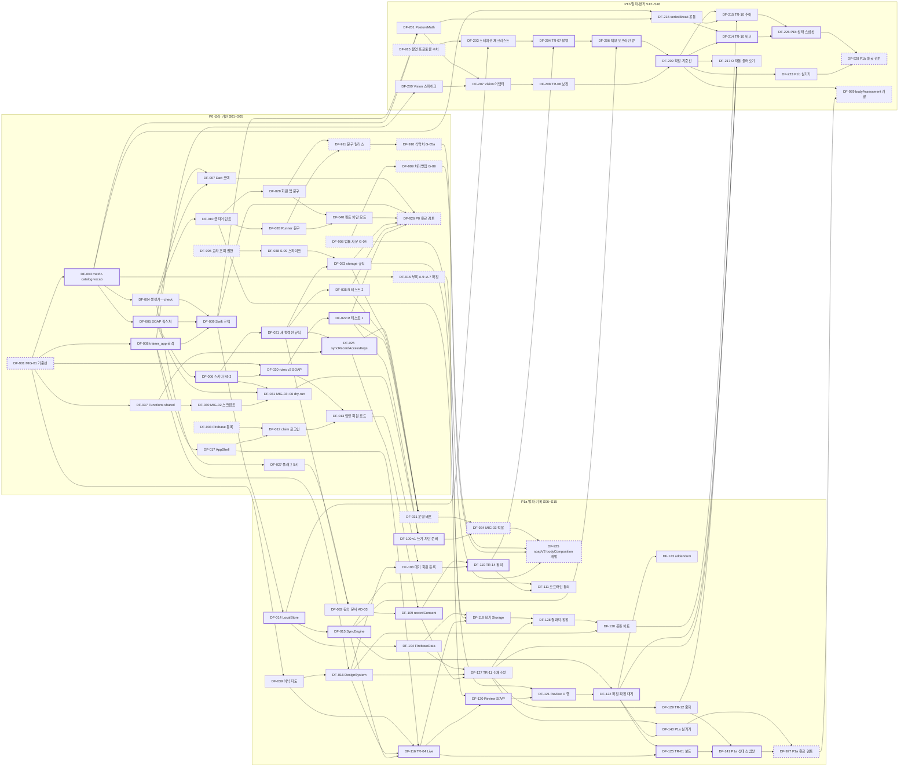

# 제품 백로그 총괄(에픽·추적성)

| 항목 | 내용 |
|---|---|
| 문서 ID | V1-02 |
| 버전 | v1.2 |
| 상태 | 개발 착수 기준(Ready) |
| 작성일 | 2026-09-24 |
| 소유자 | CJH |
| 근거 PRD 절 | §0.5 ID 체계, §5.3~§5.5, §6.0.1 기능 목록, §6.1~§6.7, §8.4·§8.6, §9.4 R-01~R-31, §9.5 S-01~S-09, §11 MIG-01~MIG-11, §12.1~§12.3, §12.7, §13 |
| 관련 에픽·스토리 | EP-00~EP-23, DF-001~DF-942 전체(색인, DF-043·DF-942는 DEC-19 리전 전환), 추가 제안 DF-041·042·143·144·227·333·335~338·391·506~508·940·941(§8.8, 채택 대기) |
| 변경 규칙 | [문서 변경](01_AGILE_WORKING_AGREEMENT.md#문서-변경) |

## 목차

- [1. 이 문서의 역할과 읽는 법](#1-이-문서의-역할과-읽는-법)
- [2. 키·ID 체계](#2-키id-체계)
- [3. 라벨 체계](#3-라벨-체계)
- [4. 우선순위·크기·용량 규칙](#4-우선순위크기용량-규칙)
- [5. 백로그 운영 규칙](#5-백로그-운영-규칙)
- [6. 에픽](#6-에픽)
- [7. 단계·마일스톤·스프린트 적재 요약](#7-단계마일스톤스프린트-적재-요약)
- [8. 전체 스토리 색인](#8-전체-스토리-색인)
- [9. PRD 추적 매트릭스](#9-prd-추적-매트릭스)
- [10. 의존 그래프(P0~P1b 임계 경로)](#10-의존-그래프p0p1b-임계-경로)
- [11. 가정(ASM)과 스파인 대조 결과](#11-가정asm과-스파인-대조-결과)
- [12. 변경 이력](#12-변경-이력)

## 1. 이 문서의 역할과 읽는 법

### 1.1 역할

이 문서는 D-FET Coach v1 백로그의 **색인**이다. 에픽 정의, 전체 스토리 한 줄 목록, PRD ID별 추적, 임계 경로를 한곳에 둔다. 스토리 본문(배경, 범위·비범위, 수용 기준 전문, 수정할 파일, 테스트)은 단계별 백로그 파일에 있다. 이 문서는 본문을 반복하지 않는다.

| 알고 싶은 것 | 볼 곳 |
|---|---|
| 스토리 카드 전문(P0, DF-001~099) | [backlog/P0.md](backlog/P0.md) |
| 스토리 카드 전문(P1a, DF-100~199) | [backlog/P1a.md](backlog/P1a.md) |
| 스토리 카드 전문(P1b, DF-200~299) | [backlog/P1b.md](backlog/P1b.md) |
| 스토리 카드 전문(P2·P3, DF-300~449) | [backlog/P2_P3.md](backlog/P2_P3.md) |
| 보류 항목(V2, DF-500~549) | [backlog/V2.md](backlog/V2.md) |
| 소유자 행동·외부 게이트(DF-900~999) | [backlog/OWNER_ACTIONS_AND_GATES.md](backlog/OWNER_ACTIONS_AND_GATES.md) |
| 스프린트 달력·게이트 타임라인·릴리스 열차 | [03_RELEASE_AND_SPRINT_PLAN.md](03_RELEASE_AND_SPRINT_PLAN.md), [sprints/SPRINT_01.md](sprints/SPRINT_01.md) |
| DoR·DoD, 브랜치·커밋·PR 규칙, 에이전트 규약 | [01_AGILE_WORKING_AGREEMENT.md](01_AGILE_WORKING_AGREEMENT.md) |
| 스토리 카드 양식 | [templates/STORY.md](templates/STORY.md)(V1-T01), 에이전트 지시서 [templates/AGENT_BRIEF.md](templates/AGENT_BRIEF.md)(V1-T08). 템플릿 전체 색인은 [01 템플릿 표](01_AGILE_WORKING_AGREEMENT.md) |
| GitHub 이슈 원본 데이터 | `tool/backlog/issues.json`(TL-05, 이 색인과 카드에서 `tool/backlog/build_issues.mjs`(TL-14)가 생성), 스키마 `tool/backlog/issue.schema.json`(TL-04), 생성 스크립트 `tool/backlog/create_github_issues.sh`(TL-11, 호환 진입점 `create_backlog.sh`). 사용법은 [tool/backlog/README.md](../../tool/backlog/README.md)(TL-01) |

### 1.2 정본 관계

1. `docs/PRD_V1.md`가 범위와 ID(F-, AC-, C-, NFR-, G-, M-, MIG-, TR-, MB-, AD-, R-, S-, T-)의 정본이다. 이 문서는 PRD ID를 인용만 하고 새로 만들지 않는다.
2. 스토리의 키·제목·에픽·단계·스프린트·점수·우선순위·의존은 **이 문서 §8 색인**이 정본이다. 단계별 카드 파일과 `tool/backlog/issues.json`은 이 색인과 1:1로 맞아야 하고, `tool/backlog/validate_backlog.mjs`(TL-12)가 CI(docs-and-backlog)에서 대조한다.
3. 수용 기준 전문은 스토리 카드가 정본이다. 카드의 AC는 PRD AC를 인용하고, 스토리 전용 기준만 `AC-DF-NNN.k`로 추가한다.
4. PRD와 이 문서가 어긋나면 PRD가 우선한다. 모호한 점은 §11의 ASM으로 기록하고 PRD Q-/AS-를 참조한다.

### 1.3 역할별 읽는 순서

| 독자 | 순서 |
|---|---|
| 소유자(PO) | §7 적재 요약 → §10 임계 경로 → §8 색인에서 이번 스프린트 행 → [OWNER_ACTIONS_AND_GATES](backlog/OWNER_ACTIONS_AND_GATES.md) |
| AI 코딩 에이전트(Claude·Codex) | 배정된 DF 키로 §8 색인 행을 찾는다 → 의존 스토리가 병합됐는지 확인한다 → 단계별 카드 전문 → 카드에 붙은 작업 지시서(V1-T08) → 지시서가 가리키는 04~13 문서 |
| 백엔드·규칙 담당 | §6의 EP-03·EP-04·EP-08 → §9.4 R/S 추적 → [05_DATA_MODEL_AND_RULES.md](05_DATA_MODEL_AND_RULES.md) |
| 회원 앱·관리자 담당 | §8의 area `member-app`·`admin-web` 행 → [08_MEMBER_APP_AND_ADMIN_SPEC.md](08_MEMBER_APP_AND_ADMIN_SPEC.md) |
| Windows/GPU 협업자 | EP-19(P2) 행과 [ADR-012](adr/ADR-012-bodypath-result-package.md). P0~P1b에는 배정 항목이 없다 |

### 1.4 규모 요약

- 전체 193건: story 131, chore 18, spike 4, owner-action 40. 합계 465점(V2 6건은 미추정 0점). DF-042는 2026-09-25 DEC-21로 채택해 포함했다.
- 이 수치에는 단계 파일이 올린 추가 제안 15건(19점, §8.8)이 들어 있지 않다. 채택 전까지 합계·용량 계산에서 뺀다(ASM-02-13). 모두 채택하면 208건·484점이다.
- 단계별 건수와 점수는 §7.1, 에픽별은 §6에 있다.
- P0~P1b에 걸린 PRD F-/AC- ID(공통 규칙 C-·AC-C-, AC-IA, AC-A11Y 포함)는 모두 한 개 이상의 스토리에 대응한다(§9.2). 이월·보류 ID는 사유와 대상 스토리를 함께 적었다(§9.3).

## 2. 키·ID 체계

### 2.1 스토리 키 대역

| 대역 | 단계 | 비고 |
|---|---|---|
| DF-001~099 | P0 정리·기반 | P0 키이지만 S06~S07에 배정한 8건은 마일스톤이 P1a다(§7.2, ASM-02-02) |
| DF-100~199 | P1a 알파-기록 | |
| DF-200~299 | P1b 알파-평가 | |
| DF-300~379 | P2 베타 | |
| DF-380~449 | P3 센터 출시 | |
| DF-500~549 | V2 보류 | 스프린트에 넣지 않는다 |
| DF-900~999 | 소유자 행동·게이트 증빙(EP-00) | 모든 항목에 `owner-action` 라벨 |

- 키는 세 자리 숫자(`DF-007`)다. 한 번 쓴 번호는 삭제·병합되어도 재사용하지 않는다.
- 대역 안의 빈 번호(예: DF-019, DF-036, DF-102·103·105·106, DF-202, DF-213, DF-222)는 결번이다. 스파인 설계에서 쓰지 않거나 다른 키로 합친 번호이며, 새 스토리는 해당 대역의 **가장 큰 번호 + 1**을 받는다. DF-019는 명시적으로 쓰지 않는다.
- 이슈 제목: `[DF-NNN] 동사형 제목`(예: `[DF-116] TR-04 Live를 구현한다`).
- 스토리 전용 수용 기준: `AC-DF-NNN.k`. PRD AC와 겹치는 내용은 새로 만들지 않고 PRD AC를 인용한다.
- 브랜치: `<type>/DF-NNN-<kebab-slug>`(type은 feat, fix, docs, chore, refactor, test, mig, spike). 에이전트는 `claude/DF-NNN-<slug>`, `codex/DF-NNN-<slug>`도 쓴다.
- 커밋 footer: `Refs: DF-NNN`과 `Trace: <PRD ID, ...>`(DEC-20 rebase 병합이라 모든 커밋에 붙인다). PR 제목은 `<type>(<scope>): <요약> (DF-NNN)`. 정본은 [01 커밋](01_AGILE_WORKING_AGREEMENT.md#커밋)이다.

### 2.2 에픽·기타 ID

| 종류 | 형식 | 예 | 정의 위치 |
|---|---|---|---|
| 에픽 | EP-00~EP-23 | EP-10 | 이 문서 §6 |
| 스토리 | DF-NNN | DF-116 | 이 문서 §8, 단계별 카드 |
| 스토리 전용 AC | AC-DF-NNN.k | AC-DF-116.1 | 스토리 카드 |
| 개발 가정·질문 | AS-DEV-NN, Q-DEV-NN | AS-DEV-09 | [00_README.md](00_README.md) |
| 이 문서의 가정 | ASM-02-NN | ASM-02-04 | 이 문서 §11 |
| 마일스톤 | MS-P0, MS-P1a, MS-P1b, MS-P2, MS-P3, MS-V2와 게이트 마일스톤 | MS-P1a | §7.2, [03_RELEASE_AND_SPRINT_PLAN.md](03_RELEASE_AND_SPRINT_PLAN.md) |

PRD로 올릴 가정·질문은 PRD §13.4에 따라 AS-34, Q-25부터 번호를 새로 받는다.

## 3. 라벨 체계

라벨 이름·색·설명의 정본은 `tool/backlog/labels.json`(TL-02)이다. 아래는 적용 규칙이다.

| 그룹 | 값 | 이슈당 개수 | 결정 기준 |
|---|---|---|---|
| `type/` | epic, story, task, bug, spike, chore, docs, test, migration | 정확히 1 | 색인의 '유형' 열. owner-action 항목은 `type/task`(ASM-02-01) |
| `area/` | trainer-app, member-app, admin-web, functions, rules, storage, contracts, bodypath, ci, design, privacy, analytics, docs | 1 이상 | 색인의 '영역' 열이 주 영역. 규칙과 함수를 함께 바꾸면 둘 다 |
| `phase/` | P0, P1a, P1b, P2, P3, V2 | 정확히 1 | 키 대역과 같다(마일스톤과 다를 수 있음, §7.2) |
| `prio/` | must, should, could, wont | 정확히 1 | §4.1 |
| `size/` | XS(1), S(2), M(3), L(5), XL(8) | 0 또는 1 | 0점 항목은 라벨 없음(ASM-02-03). XL은 계획 전에 나눈다 |
| `owner-action` | (단일) | 0 또는 1 | 소유자가 직접 하는 일: 법률, 식약처, IRB, 콘솔, 스토어, 배포, 이관 실행, 플래그 개방, 단계 종료 검토 |
| `gate/` | G-01, G-02, G-03, G-04, G-05a, G-05b, G-06, G-07a, G-07, G-08, G-09, G-10 | 0 이상 | 스토리가 해당 게이트의 증빙이거나 게이트에 막히는 경우 |
| `flag/` | soapV2, bodyComposition, bodyAssessment, memberShare, lidarBeta | 0 이상 | 산출물이 플래그 뒤에 숨는 경우(ADR-010) |
| `agent/` | claude, codex, human | 0 또는 1 | 스프린트 계획에서 배정. TrainerKit 타깃이 겹치지 않게 한다 |
| `status/` | ready, blocked, needs-decision | 0 또는 1 | ready는 DoR 충족. Projects Status 필드와 함께 쓴다 |
| `scope/` | mvp, carryover, deferred | 정확히 1(에픽 제외) | [DEC-22](00_README.md#결정-기록). `mvp`: 1인 알파 MVP 범위. 카드 Labels 줄에 적고 카드에 `### MVP 범위(DEC-22)` 절(지금 만들 것·미룰 것·기다리지 않는 의존)을 두며, 에이전트 스토리는 `agent/` 라벨이 있어야 한다. `carryover`: MVP 밖이지만 PR이 열려 있어 마치는 항목(DF-007·DF-010·DF-011). 카드 Labels 줄에 적는다. `deferred`: 둘 다 없는 항목에 생성기가 붙인다. 연기(DEC-22), MVP 뒤 재계획이며 `issues.json` 스프린트는 'MVP 뒤'(옛 계획 값은 `plannedSprint`)이고 `brief.mjs`가 지시서를 만들지 않는다([03 MVP 계획](03_RELEASE_AND_SPRINT_PLAN.md#mvp-계획dec-22)) |
| 위험 표시 | freeze-exception, regulatory, privacy-impact, schema-change, rules-change, needs-device-test | 0 이상 | 소유자가 diff를 직접 읽어야 병합할 수 있는 PR 표시 |

위험 표시를 반드시 붙이는 경우:

- `rules-change`: `firestore.rules`, `storage.rules`, `firestore.indexes.json` 변경(DF-020~024, DF-035, DF-101, DF-385 등)
- `schema-change`: `docs/firestore_schema.md`, `schemas/`, `contracts/` 스키마 변경(DF-003~006, DF-027, DF-033 등)
- `privacy-impact`: `functions/src/{access,consent,privacy,summaries}` 변경, 동의·삭제·감사·내보내기 스토리(EP-08 전체, DF-025, DF-309·310·314, DF-326)
- `regulatory`: 사용자 노출 문구·금지어 목록 변경(EP-06, DF-120, DF-210, DF-313, DF-316)
- `freeze-exception`: 동결 대상 `ios/Runner/AppDelegate.swift`·`trainer_ios/` 변경(DF-028, DF-142, DF-387)
- `needs-device-test`: 실기기 확인이 수용 기준에 있는 스토리(DF-116, DF-140, DF-200, DF-204~208, DF-223)

## 4. 우선순위·크기·용량 규칙

### 4.1 우선순위(MoSCoW)

| 라벨 | 뜻 | 이월 규칙 |
|---|---|---|
| `prio/must` | 해당 단계 종료 게이트나 PRD 수용 기준에 필요하다 | 이월하면 마일스톤도 함께 민다 |
| `prio/should` | 단계 목표에 기여하지만 종료 게이트는 아니다 | 속도가 부족하면 다음 단계 초로 이월할 수 있다 |
| `prio/could` | 있으면 좋은 측정·편의 항목(DF-224, DF-323, DF-327, V2 전부) | 속도가 2스프린트 연속 16점 미만이면 먼저 이월 |
| `prio/wont` | v1에서 하지 않는다(보류 결정 기록용) | 스프린트에 넣지 않는다 |

정렬 원칙:

1. **게이트 선행.** 단계 전환·실데이터·플래그 개방을 막는 게이트 증빙(EP-00)과 그 전제 스토리(예: DF-032 동의 문서, DF-100 v1 쓰기 차단)를 같은 단계의 기능보다 먼저 둔다.
2. **규제·개인정보 먼저.** 출시 앱의 규제 문구(DF-028·029), 금지어 린트(DF-010·040), 규칙 테스트(DF-022·035·023)는 기능 개발보다 앞선다.
3. **외부 게이트는 코딩을 막지 않는다.** 법률(G-04·G-09), 식약처(G-05a/b), IRB(G-06·G-07)는 단계 전환, 실데이터, 플래그 개방만 막는다. 해당 기능 코딩은 합성 데이터와 에뮬레이터로 계속한다.
4. **의존 먼저.** 같은 우선순위에서는 §10 임계 경로 위의 스토리를 먼저 둔다.

### 4.2 크기(포인트)

| 점수 | size 라벨 | 기준 |
|---|---|---|
| 0 | (없음) | 소유자의 짧은 행동(콘솔 설정, 결정 기록, 플래그 개방), V2 미추정 |
| 1 | XS | 에이전트 PR 하나를 소유자가 30분 안에 검토·통합. owner-action은 반나절 이상 걸리는 항목 |
| 2 | S | PR 하나, 검토 1시간 안팎 |
| 3 | M | PR 하나, 에뮬레이터·시뮬레이터 확인 포함 |
| 5 | L | PR 1~2개, 규칙·개인정보 diff 정독이나 실기기 확인 포함 |
| 8 | XL | 계획 전에 반드시 나눈다(현재 0건) |

- 점수는 **소유자의 검토·통합·실기기 확인 노력**이다. 에이전트의 코딩 시간이 아니다.
- 척도는 피보나치 1·2·3·5·8이다. 현재 백로그에 8점은 없다.
- 스파이크는 시간 상한을 스파이크 템플릿([templates/SPIKE_REPORT.md](templates/SPIKE_REPORT.md), V1-T02)에 적고 1~2점으로 잡는다.

### 4.3 용량과 보정

- 5작업일 스프린트 용량은 20점, 약속은 18점(90%)이다. 나머지 2점은 결함·리뷰 반려·게이트 대응 버퍼다(AS-DEV-09).
- 휴일이 있는 주는 작업일 수에 비례해 줄인다: S02(3일) 용량 12·약속 11, S13·S14(4일) 용량 16·약속 14·13.
- S02 종료 뒤 첫 작업일(10-12)에 S01~S02 실적으로 보정한다. 작업일당 완료점수 = 완료 점수 합 ÷ 8작업일(이월·미병합 PR은 0점). S03부터 용량 = round(작업일당 완료점수 × 5)이며 한 번에 ±25%(15~25점)까지만 바꾼다. S04부터는 직전 3개 스프린트 이동평균을 쓴다.
- 속도에는 owner-action 점수와 스파이크를 포함한다. 에이전트별 반려율은 회고([templates/RETRO.md](templates/RETRO.md), V1-T11)에 적는다. 스프린트 리뷰는 [templates/SPRINT_REVIEW.md](templates/SPRINT_REVIEW.md)(V1-T05)다.
- 자세한 달력과 게이트 타임라인은 [03_RELEASE_AND_SPRINT_PLAN.md](03_RELEASE_AND_SPRINT_PLAN.md)에 있다.

## 5. 백로그 운영 규칙

### 5.1 Ready(DoR) 요약

스토리는 다음을 모두 만족해야 `status/ready`를 받고 스프린트에 들어간다. 전문은 [01_AGILE_WORKING_AGREEMENT.md](01_AGILE_WORKING_AGREEMENT.md)의 DoR이다.

- PRD 추적 ID가 한 개 이상 있고 `docs/PRD_V1.md`에 실제로 존재한다.
- 의존 스토리가 병합됐거나 같은 스프린트 앞쪽에 있다(§8 '의존' 열).
- 수정 허용 경로, 실행할 테스트 명령, 수용 기준이 카드에 있다.
- 크기가 5점 이하다.
- 외부 게이트가 막는 것이 코딩이 아니라 개방·실데이터뿐임이 카드에 적혀 있다.

### 5.2 새 항목 추가·분할·이월

1. **추가.** 새 스토리는 대역의 다음 번호를 받는다. 이 문서 §8 색인과 단계별 카드를 **같은 PR**에서 고치고, `node tool/backlog/build_issues.mjs`로 `tool/backlog/issues.json`을 다시 만들어 함께 커밋한다. PRD에 없는 범위면 추가하지 않고 PRD 개정 제안(§12.7)으로 올린다.
2. **분할.** 5점을 넘거나 PR 400줄(생성물 제외)을 넘을 것 같으면 나눈다. 원래 키는 첫 조각에 남기고 나머지는 새 키를 받는다. 카드의 '의존'과 §10 그래프를 고친다.
3. **이월.** 스프린트 안에 병합되지 않으면 0점 처리하고 다음 스프린트 계획에서 다시 약속한다. 스프린트 열은 계획 시점 값이며, 이월하면 이 색인의 스프린트 열을 고친다.
4. **보류.** V2로 보내는 항목은 DF-5NN으로 새 키를 받지 않고 원 키에 `prio/wont`와 사유를 남긴다. V2 대역은 PRD가 V2로 지정한 범위만 쓴다.

### 5.3 GitHub Projects 필드 대응

| Projects 필드 | 값 출처 |
|---|---|
| Status | Backlog, Ready, In progress, In review, Done, Blocked. `status/ready`·`status/blocked`와 함께 움직인다 |
| Iteration | 1주(월~금). 색인의 '스프린트' 열(S19 이후는 2주 묶음이므로 계획 시 1주로 나눈다) |
| Phase | 색인의 '단계' 열 |
| Size | 색인의 '점' 열 |
| Area | 색인의 '영역' 열 |
| Agent | 스프린트 계획에서 배정(`agent/`) |
| Gate | `gate/` 라벨 |

### 5.4 이슈 JSON 필드 대응

`tool/backlog/issue.schema.json`(TL-04)의 필드는 이 색인에서 다음과 같이 채운다.

| JSON 키 | 색인 열·규칙 |
|---|---|
| `key` | 키 |
| `title` | `[DF-NNN] ` + 제목 |
| `type` | 유형(owner-action은 `task`) |
| `epic` | 에픽 |
| `phase` | 단계 |
| `prio` | 우선 |
| `size` | 점(0이면 null) |
| `labels` | §3 규칙으로 계산 |
| `milestone` | §7.2 대응표 |
| `trace` | 'PRD 추적' 열을 쉼표로 나눈 목록. 범위 표기(`R-01~R-13`)는 도구가 펼친다 |
| `acceptance` | 스토리 카드의 수용 기준 |
| `dependsOn` | 의존 |
| `ownerAction` | 유형이 owner-action이면 true |
| `body` | 스토리 카드 본문 |

## 6. 에픽

점수와 건수는 §8 색인에서 계산했다. 에픽 하위 스토리 목록은 §8 색인을 에픽 열로 거르면 된다.

| 에픽 | 이름 | 목표 | PRD 근거 | 단계 | 점수 | 건수 | 단계별 건수 |
|---|---|---|---|---|---|---|---|
| EP-00 | 소유자 행동·외부 게이트 트랙 | G-01~G-10 증빙, 법률·식약처·IRB 제출, 콘솔·스토어·배포·이관 실행, 플래그 개방, 단계 종료 검토를 병렬 트랙으로 운영한다(코딩 비차단) | §12.2 G-01~G-10, §12.3, §12.7, D13, MIG-01, MIG-02, Q-04, Q-05, Q-07, Q-08, Q-09, Q-10, Q-21, Q-22, Q-24 | P0~P3 | 15 | 40 | P0 16, P1a 9, P1b 3, P2 8, P3 4 |
| EP-01 | 저장소 기준선·CI·백로그 도구 | 문서군 병합, 백로그 도구, 정적 가드, 에뮬레이터 통합 CI, TestFlight 워크플로를 갖춘다 | §12.5, MIG-01, NFR-03, NFR-11, G-02 | P0~P1a | 11 | 7 | P0 5, P1a 2 |
| EP-02 | 계약·어휘 단일 원본 | contracts/(부록 A·B·C, §5.5, §9.7)와 생성기, SOAP v2 스키마·픽스처, Dart·Swift 코덱 교차 왕복을 완성한다 | F-SOAP-06, §9.3, 부록 A, 부록 B, §5.5, §9.7, AC-SOAP-06.1~06.3 | P0 | 16 | 7 | P0 7 |
| EP-03 | 보안 규칙·Storage·인덱스 | firestore.rules v2와 새 컬렉션 규칙, storage.rules, 인덱스를 R-01~R-31, S-01~S-09로 검증한다(G-03) | §9.4, §9.5, §9.6, G-03, M-G4, R-01~R-31, S-01~S-09 | P0 | 22 | 8 | P0 8 |
| EP-04 | 접근 키·식별 백엔드 | uid 담당 관계 단일 진실원, syncRecordAccessKeys, Functions 공통 구조, 관리자 claim 통일 | F-LINK-03, F-LINK-05.4, §10.6, §10.7, NFR-16, R-06, R-07, R-23, RISK-10 | P0~P1a | 11 | 4 | P0 3, P1a 1 |
| EP-05 | 트레이너 앱 기반 | trainer_app/ 골격, TrainerKit 타깃, claim 로그인, uid 회원 로드, AppShell, LocalStore, SyncEngine, FirebaseData, DesignSystem, TR-15 기초 | D2, §10.2, NFR-01~NFR-09, NFR-12, NFR-17, F-LINK-03.2, TR-02, TR-15, G-02 | P0~P1a | 32 | 10 | P0 9, P1a 1 |
| EP-06 | 출시 앱 규제 문구 정리·금지어 린트 | Runner·회원 앱의 규제 문구를 동결 예외로 고치고, 금지어 린트를 보고 모드에서 차단 모드로 전환한다 | F-PRIV-06, MIG-04, §3.4, 부록 C, C-06, AC-C-06.1, M-G1, G-05a | P0 | 7 | 4 | P0 4 |
| EP-07 | 기능 플래그·관리자 화면 | 플래그 5키(AD-07), 동의 문서 버전(AD-03), 지표 카탈로그(AD-05), bodyChange kind 검증 | §6.0.2, §12.3, AD-03, AD-05, AD-07, §10.7, AC-IA-02, F-PRIV-01.2 | P0~P1b | 12 | 4 | P0 2, P1b 2 |
| EP-08 | 동의·개인정보 핵심 | 동의 5종 기록·파생 상태, 현장·오프라인 동의, 철회 처리, 삭제 연쇄, 보유기간 파기, 감사 로그(최소), 권리 행사, 서버 주간 집계 | F-PRIV-01~F-PRIV-05, F-PRIV-07, §9.7, §5.3, AC-PRIV-01~07, G-04, G-09 | P1a | 37 | 11 | P1a 11 |
| EP-09 | 대기 회원 | TR-14 최소 등록(만 14세 확인), 대기 회원 목록·배지, 취소·만료 처리 | F-LINK-01, AC-LINK-01.1~01.6, TR-02, TR-14, R-05, R-18, R-19, R-30, R-31 | P1a | 5 | 2 | P1a 2 |
| EP-10 | SOAP Live·Review·확정 | TR-01·TR-04·TR-05: Live 기록, 필기 Storage, Review 구조화, 확정·확정 대기·addendum, 이어쓰기·기본 문구, 분석 이벤트 | F-SOAP-01, F-SOAP-02, F-SOAP-04, F-SOAP-07.1~07.3, F-VIZ-04(P1a), §6.4.4, M-01, M-02, M-11, AC-IA-03, AC-IA-05 | P1a | 36 | 11 | P1a 11 |
| EP-11 | 신체조성·줄자 둘레 | TR-11 신체조성 수기 입력·결과지·정정, TR-12 줄자 둘레 반복 입력 | F-BC-01~F-BC-03, F-ASM-06, AC-BC-*, AC-ASM-06.*, R-14, R-17, R-26, R-27, R-29 | P1a | 13 | 3 | P1a 3 |
| EP-12 | 타임라인·공통 시각화 | TR-03 통합 타임라인(목록), 출처 등급 칩·공통 차트 규칙(Swift·Flutter), 접근성·상태 매트릭스 스냅샷 | F-VIZ-05(P1a), F-VIZ-07, C-01~C-04, AC-IA-01, AC-A11Y-01~03, §8.4 | P1a | 14 | 6 | P1a 5, P1b 1 |
| EP-13 | 이관 | MIG-02 실사 스크립트, MIG-03~06 dry-run·적용 준비·롤백 리허설, MIG-07·08 전환, trainer_ios 정리 | §11, MIG-02~MIG-08, MIG-11, R-21 | P0~P1a | 17 | 6 | P0 2, P1a 3, P2 1 |
| EP-14 | 체형평가(정적 2D) | TR-07 촬영, TR-08 랜드마크 보정, PostureMath 산식, TR-09 결과·확정·기준선, 재검사 태깅, 실기기 검증 | F-ASM-01~F-ASM-04, F-ASM-05.1~05.3, 부록 A.3, NFR-15, M-04a, M-04b, Q-18 | P1b | 43 | 13 | P1b 13 |
| EP-15 | O 자동 불러오기·비교·추이 | SOAP O 스냅샷, TR-10 나란히·겹쳐 보기, seriesBreak 추이, 편위 표, NRS 추이, M-05 집계 | F-SOAP-03, F-VIZ-01~F-VIZ-03(P1b), F-VIZ-04.4, §7.4, M-05, AS-23 | P1b | 27 | 8 | P1b 8 |
| EP-16 | 초대 코드·uid 승격 | issue/redeemInviteCode, MB-05, AD-02 | F-LINK-02, F-PRIV-03.4, MB-05, AD-02 | P2 | 14 | 4 | P2 4 |
| EP-17 | 회원 공유·리포트 | createMemberSummary·revoke, TR-06, MB-01~MB-04, 공유 사진 서명 URL | F-SOAP-05, F-LINK-05, F-VIZ-06, F-PRIV-06.2, AC-IA-04 | P2 | 33 | 10 | P2 10 |
| EP-18 | 회원 앱 동의·권리와 전체 감사 | MB-06, 현장 동의 재확인, P2 감사 이벤트, AD-06 | F-PRIV-01.3, F-PRIV-03.8, F-PRIV-05(P2), F-PRIV-07.1, MB-06, AD-06 | P2 | 12 | 3 | P2 3 |
| EP-19 | LiDAR 베타·BodyPathCore | BodyPathResult·BodyPathCoreUI 패키지, 결과 패키지 내보내기, TR-13, linkMemberAlias, MIG-10 | F-LIDAR-01~03, F-LINK-04, §10.4, NFR-13, NFR-14, NFR-18, MIG-10, G-07a, G-07 | P2 | 33 | 9 | P2 9 |
| EP-20 | P2 확장 | verifyPostureConfirmed, 블라인드 보정·가명 내보내기, 맞춤 문구, 히트맵·SceneKit, 타임라인 확장, trainerWorkspaces 제거 | AC-ASM-04.1, F-ASM-05.4~05.6, F-SOAP-07.1(P2), F-VIZ-04(P2), F-VIZ-05(P2), MIG-08 | P2 | 19 | 6 | P2 6 |
| EP-21 | 판정 엔진·정책 운영 | evaluateChange 단일 구현(T01~T25), 스냅샷·요약 연동, MDC 밴드·배지, AD-04 | §7.3~§7.9, F-VIZ-01(P3), F-VIZ-03(P3), F-VIZ-06.3, AC-SOAP-03.5, AD-04, G-06, G-08 | P3 | 21 | 5 | P3 5 |
| EP-22 | 센터 출시·Runner 트레이너 제거 | 역할 claim 분리, App Check 강제, MIG-09 제거, 운영·사고 대응, 1.0 출시 | MIG-09, NFR-09, §6.7.0, §10.7, §12.1 P3, G-10 | P3 | 15 | 6 | P3 6 |
| EP-23 | V2 보류 | 재검토 조건만 기록하고 스프린트에 넣지 않는다 | F-BC-04, F-BC-05, F-SOAP-08, Q-14, G-07, Q-03, D4 | V2 | 0 | 6 | V2 6 |
| 합계 | | | | | 465 | 193 | |

에픽 완료 기준:

- 하위 스토리가 모두 Done이고, 에픽에 걸린 PRD 수용 기준(§9)이 모두 테스트 증빙을 가진다.
- 여러 단계에 걸친 에픽(EP-00, EP-01, EP-04, EP-05, EP-07, EP-13)은 단계별로 부분 완료를 기록하고, 마지막 단계 종료 검토([templates/PHASE_EXIT_REVIEW.md](templates/PHASE_EXIT_REVIEW.md), V1-T06)에서 닫는다.
- EP-23은 닫지 않는다. V2 PRD가 승인되면 새 백로그로 옮긴다.

## 7. 단계·마일스톤·스프린트 적재 요약

### 7.1 단계별 규모

| 단계(키 대역) | 건수 | 점수 | 그중 owner-action 건수·점수 | 카드 파일 |
|---|---|---|---|---|
| P0 | 56 | 107 | 16건 · 6점 | [backlog/P0.md](backlog/P0.md) |
| P1a | 48 | 124 | 9건 · 3점 | [backlog/P1a.md](backlog/P1a.md) |
| P1b | 27 | 79 | 3건 · 1점 | [backlog/P1b.md](backlog/P1b.md) |
| P2 | 41 | 116 | 8건 · 2점 | [backlog/P2_P3.md](backlog/P2_P3.md) |
| P3 | 15 | 39 | 4건 · 3점 | [backlog/P2_P3.md](backlog/P2_P3.md) |
| V2 | 6 | 0 | 0건 · 0점 | [backlog/V2.md](backlog/V2.md) |
| 합계 | 193 | 465 | 40건 · 15점 | |

owner-action 항목의 카드는 단계 파일이 아니라 [backlog/OWNER_ACTIONS_AND_GATES.md](backlog/OWNER_ACTIONS_AND_GATES.md)에 있다.

이 표와 §7.2·§7.3은 **채택된 항목만** 센다. 추가 제안 15건(DF-041, DF-143, DF-144, DF-227, DF-333, DF-335~DF-338, DF-391, DF-506~DF-508, DF-940, DF-941)은 채택 전이라 빠져 있다. DF-042는 2026-09-25 DEC-21로 채택해 포함했다. 채택했을 때의 단계·마일스톤·스프린트 합계는 [§8.8.2](#882-채택-시-적재-영향미리-계산)에 있다(ASM-02-13).

### 7.2 마일스톤 대응

마일스톤은 단계 종료 게이트 단위다. 목표일은 잠정이며 게이트가 달력보다 우선한다(PRD §12). 키 대역이 P0인데 S06~S07에 배정한 8건(DF-014, DF-015, DF-016, DF-018, DF-026, DF-032, DF-033, DF-039)은 P0 종료 게이트 대상이 아니고 P1a 진입 전제이므로 **마일스톤을 'P1a 알파-기록'으로 둔다**(ASM-02-02). `phase/P0` 라벨은 유지한다.

| 마일스톤 | GitHub 제목 | 목표(잠정) | 배정 건수 | 배정 점수 | 종료 기준 요지 |
|---|---|---|---|---|---|
| MS-P0 | P0 정리·기반 | S05, 2026-10-30 | 48 | 86 | G-01·G-02·G-03, SOAP v2 교차 왕복, copy-lint 차단 모드, MIG-02 보고서, MIG-03 dry-run 멱등, 플래그 5키 false, DF-926 |
| MS-P1a | P1a 알파-기록 | S15, 2027-01-08(기능 완성 S14 12-31) | 56 | 145 | M-01 텍스트 평균 10초 미만, 유실 0, 2주 이상 자체 사용, trainer_ios 삭제, DF-927 |
| MS-P1b | P1b 알파-평가 | S18, 2027-01-29 | 27 | 79 | TR-07~TR-10·O 자동 불러오기, M-04a/b·M-03·M-05 측정, M-G5 검토, DF-928 |
| MS-P2 | P2 베타 | S26, 2027-03-26 | 41 | 116 | G-05b, 공유·해제 E2E, M-06·07·09·10, trainerWorkspaces 0건, DF-936 |
| MS-P3 | P3 센터 출시 | S32, 2027-05-07 | 15 | 39 | G-06·G-08·G-10, T01~T25, Runner 트레이너 제거, DF-938 |
| MS-V2 | V2(보류) | 없음 | 6 | 0 | 별도 PRD 승인 |

게이트 마일스톤(MS-G04-G09, MS-G06, MS-G07a)은 이슈를 배정하지 않는 추적용 마일스톤이다. 정의는 [03_RELEASE_AND_SPRINT_PLAN.md](03_RELEASE_AND_SPRINT_PLAN.md)에 있다.

### 7.3 스프린트 적재

> **DEC-22(2026-09-25) 뒤 이 절의 표는 보존용이다.** 아래 표는 DEC-22 이전의 전체 v1 계획(P0~P3)이다. DEC-22로 `scope/mvp` 항목의 스프린트를 MVP 계획으로 옮겨 §8 색인의 스프린트 값과 다르고, DF-042 채택(S03 +1)도 반영하지 않았다. 지금 적재는 [§7.4](#74-mvp-적재dec-22)와 [03 MVP 계획](03_RELEASE_AND_SPRINT_PLAN.md#mvp-계획dec-22)이 정본이다. `scope/mvp`가 없는 항목의 스프린트 값은 이 표의 옛 계획이며, MVP 종료 검토 뒤 다시 계획한다.

약속 점수는 §8 색인에서 다시 계산해 스파인 계획과 일치함을 확인했다. 용량은 20점 × 작업일 ÷ 5로 계산했다. S19 이후는 여러 주를 묶은 잠정 계획이고 2027년 설 연휴는 정부 고시 확인 뒤 확정한다(ASM-02-12). P2·P3 묶음의 약속점이 용량보다 낮은 것은 아직 스토리를 세분하지 않았기 때문이며, 해당 단계 진입 전 스프린트 계획([templates/SPRINT_PLAN.md](templates/SPRINT_PLAN.md), V1-T04)에서 1주 단위로 다시 나누고 채운다. 추가 제안(§8.8)은 이 표에 넣지 않았다. 2026-09-25 소유자 결정(DEC-19 리전 전환, DF-908 보류)으로 S01은 DF-908 대신 DF-942(같은 1점), S02는 DF-043(+1), S03은 DF-908(+1)을 받아 S02·S03이 약속 한도를 1점씩 넘는다. 버퍼(10%)를 미리 배정하지 않는 [03 §10.1](03_RELEASE_AND_SPRINT_PLAN.md#101-스프린트-버퍼)의 예외이며, 소유자 확인과 되돌림 규칙(S02는 DF-043을 S03으로, S03은 DF-908을 S04~S05로)은 [V1-00 K-19](00_README.md#알려진-차이와-남은-일)에 있다. 모두 채택하면 S03 20, S04 19, S05 19, S14 14, S15 18, S16 18, S18 18, S19-S20 26, S21-S22 33, S23-S24 32, S25-S26 36, S27-S29 25, S30-S32 18이 된다(§8.8.2).

| 스프린트 | 기간 | 작업일 | 용량 | 약속점 | 항목 수 | 주 단계 | 목표 요지 |
|---|---|---|---|---|---|---|---|
| S01 | 2026-09-28 ~ 10-02 | 5 | 20 | 18 | 13 | P0 | 기준선(G-01)·계약 단일 원본·생성기·SOAP 픽스처·trainer_app 골격 CI |
| S02 | 10-05 ~ 10-09 | 3 | 12 | 12 | 7 | P0 | Dart·Swift 코덱 교차 왕복, 금지어 린트(보고 모드), 서울 버킷 명시(DF-043, DEC-19. 약속 한도 11 초과 1점은 §10.1 예외, K-19) |
| S03 | 10-12 ~ 10-16 | 5 | 20 | 19 | 9 | P0 | 규칙 v2·새 컬렉션 규칙 초안, Functions 공통 구조, AppShell, 법률 의뢰 발송(DF-908, 소유자 보류로 S01에서 이동. 초과 1점은 §10.1 예외, K-19) |
| S04 | 10-19 ~ 10-23 | 5 | 20 | 18 | 11 | P0 | R·S 규칙 테스트 통과, claim 로그인, 출시 앱 문구 정리 |
| S05 | 10-26 ~ 10-30 | 5 | 20 | 18 | 7 | P0 | P0 종료: 접근 키 재정렬, 담당 회원 로드, 플래그 8키, MIG-03 dry-run, 린트 차단 모드 |
| S06 | 11-02 ~ 11-06 | 5 | 20 | 18 | 9 | P1a | LocalStore·DesignSystem·FirebaseData, AD-03, 레지스트리, 이식 지도 |
| S07 | 11-09 ~ 11-13 | 5 | 20 | 18 | 5 | P1a | SyncEngine·에뮬레이터 통합 CI, 대기 회원 등록, recordConsent |
| S08 | 11-16 ~ 11-20 | 5 | 20 | 18 | 8 | P1a | TR-14 현장 동의, TR-04 Live, MIG-03 적용 준비, 운영 배포 |
| S09 | 11-23 ~ 11-27 | 5 | 20 | 18 | 8 | P1a | 오프라인 동의·필기 Storage·NRS·바디맵·Review 1차, MIG-03 적용, 플래그 개방 |
| S10 | 11-30 ~ 12-04 | 5 | 20 | 18 | 5 | P1a | Review O 행, 확정·확정 대기, addendum, 철회 처리 |
| S11 | 12-07 ~ 12-11 | 5 | 20 | 18 | 6 | P1a | TR-01, TR-11, TR-03, TestFlight 0.2 |
| S12 | 12-14 ~ 12-18 | 5 | 20 | 18 | 7 | P1a | TR-12, 공통 차트 규칙, 삭제 연쇄, Vision 스파이크 |
| S13 | 12-21 ~ 12-24 | 4 | 16 | 14 | 6 | P1a | 권리 요청·파기·열람 감사, P1a 실기기 검증 |
| S14 | 12-28 ~ 12-31 | 4 | 16 | 13 | 4 | P1a·P1b | P1a 기능 완성, PostureMath 착수 |
| S15 | 2027-01-04 ~ 01-08 | 5 | 20 | 17 | 6 | P1b | P1a 종료 검토, TR-07·Vision 어댑터·seriesBreak |
| S16 | 01-11 ~ 01-15 | 5 | 20 | 18 | 6 | P1b | EXIF·얼굴 가림, 체형 오프라인 큐, TR-08, 정책 kind 검증 |
| S17 | 01-18 ~ 01-22 | 5 | 20 | 18 | 6 | P1b | 확정·기준선, TR-09, TR-10 비교, 재검사 태깅 |
| S18 | 01-25 ~ 01-29 | 5 | 20 | 18 | 7 | P1b | P1b 종료: 추이, O 자동 불러오기, 실기기·성능 |
| S19-S20 | 02-01 ~ 02-12 | 8(설 추정, 03 ASM-03-08) | 32 | 24 | 8 | P2 | 초대·승격, soapNote 공유·해제, TR-06 |
| S21-S22 | 02-15 ~ 02-26 | 10 | 40 | 30 | 9 | P2 | MB-01~06, bodyReport, 공유 사진, AD-06 |
| S23-S24 | 03-02 ~ 03-12 | 9 | 36 | 28 | 9 | P2 | BodyPathCore(G-07a), 재검증 트리거, 히트맵, memberShare 개방 |
| S25-S26 | 03-15 ~ 03-26 | 10 | 40 | 34 | 15 | P2 | TR-13 LiDAR 베타, 연구 도구, 작업공간 제거, P2 종료 E2E |
| S27-S29 | 03-29 ~ 04-16 | 15 | 60 | 23 | 7 | P3 | 판정 엔진·밴드·배지, AD-04, G-08 |
| S30-S32 | 04-19 ~ 05-07 | 14(05-05 어린이날) | 56 | 16 | 8 | P3 | 역할 분리, App Check 강제, Runner 트레이너 제거, 1.0 |

### 7.4 MVP 적재(DEC-22)

[DEC-22](00_README.md#결정-기록)(2026-09-25)의 1인 알파 MVP 범위만 센다. `scope/mvp` 라벨 항목은 67건·191점이다: 완료 8건·18점(DF-001~005, DF-008, DF-037, DF-901), S01 소유자 대기 2건·2점(DF-903, DF-942), S02~S12의 남은 57건·171점. 2026-09-25 리뷰 반영으로 DF-111(S06)과 DF-203(S10)의 최소 조각을 더했고(카드 점수 그대로), DF-216은 S10에서 S11로 옮겼다. 상태는 2026-09-25 21:35 KST 기준이다(`gh pr list`·`gh issue list`). 정본 목록과 흐름별 설명은 [03 MVP 계획](03_RELEASE_AND_SPRINT_PLAN.md#mvp-계획dec-22)에 있다. 약속 한도는 [§4.3](#43-용량과-보정)과 같은 용량 × 0.9(S02는 K-19 예외 그대로)이고, 진행 중인 MVP 외 항목(DF-007·DF-010·DF-011)은 이미 PR이 열려 있어 마친다.

| 스프린트 | 기간 | 작업일 | 약속 한도 | 약속점(MVP + 진행 중 MVP 외) | MVP 항목 | 진행 중(MVP 외, 마친다) | 목표 |
|---|---|---|---|---|---|---|---|
| S02 | 10-05~10-09 | 3 | 11 | 7 + 5 | DF-006(진행 중 #117), DF-009, DF-034, DF-043, DF-905(소유자) | DF-007(#116), DF-010(#119) | 새 컬렉션 스키마, Swift SOAP v2 코덱, plist 비추적, 서울 버킷 명시 |
| S03 | 10-12~10-16 | 5 | 18 | 17 + 1 | DF-017(진행 중 #118), DF-020, DF-021, DF-037(완료 #114), DF-038, DF-042, DF-906(소유자) | DF-011(#115) | AppShell, 규칙 v2·새 컬렉션 규칙, Functions 공통 구조, 에뮬레이터 시드 |
| S04 | 10-19~10-23 | 5 | 18 | 16 | DF-012, DF-022, DF-023, DF-024, DF-027, DF-035 | - | claim 로그인, 규칙·Storage 규칙 테스트, 인덱스, 플래그 키 |
| S05 | 10-26~10-30 | 5 | 18 | 17 | DF-013, DF-014, DF-016, DF-039, DF-104, DF-108 | - | 회원 로드, LocalStore, DesignSystem, FirebaseData, 대기(테스트) 회원 등록 |
| S06 | 11-02~11-06 | 5 | 18 | 18 | DF-015, DF-018, DF-107, DF-109, DF-111(최소 조각) | - | SyncEngine, 설정 기초, 에뮬레이터 통합 CI, recordConsent(MVP 범위), 유효 동의 계산(①②③) |
| S07 | 11-09~11-13 | 5 | 18 | 16 | DF-110, DF-113, DF-116, DF-118, DF-925(소유자), DF-931(소유자) | - | 동의 기록(MVP 범위), 회원 목록, **흐름 1** Live·필기 업로드. 소유자: 서울 배포·플래그 |
| S08 | 11-16~11-20 | 5 | 18 | 18 | DF-114, DF-120, DF-121, DF-122, DF-200 | - | **흐름 1** Review·O 행·확정, **흐름 4** 타임라인, Vision 가능성 확인 |
| S09 | 11-23~11-27 | 5 | 18 | 16 | DF-123, DF-127, DF-128, DF-201 | - | **흐름 1** addendum, **흐름 2** 신체조성·결과지, **흐름 3** PostureMath |
| S10 | 11-30~12-04 | 5 | 18 | 16 | DF-129, DF-130, DF-203(최소 조각), DF-204 | - | **흐름 2** 줄자 둘레, **흐름 4** 차트 규칙, **흐름 3** 기본 스테이션·촬영 조건, 촬영 |
| S11 | 12-07~12-11 | 5 | 18 | 17 | DF-205, DF-206, DF-207, DF-208, DF-216, DF-929(소유자) | - | **흐름 3** EXIF 제거·업로드 큐·Vision 어댑터·랜드마크 보정, **흐름 4** seriesBreak. 소유자: bodyAssessment |
| S12 | 12-14~12-18 | 5 | 18 | 15 | DF-209, DF-210, DF-215, DF-225 | - | **흐름 3** 확정·결과, **흐름 4** 추이 차트·체형 타임라인 |
| S13 | 12-21~12-24 | 4 | 14 | 0 | - | - | MVP 종료: 데모 체크리스트(시뮬레이터 + 에뮬레이터 → 서울), 버퍼. 새 항목 없음 |

- 같은 스프린트 안 의존은 [§4.2](#42-크기포인트)대로 허용한다(예: S05 DF-108←DF-013, S12 DF-215←DF-209). MVP 항목이 MVP 밖 항목을 기다리지 않도록, 그런 의존은 카드의 'MVP에서 기다리지 않는 의존'에 적었다: DF-109←DF-025·DF-032, DF-121←DF-916, DF-203←DF-915, DF-931←DF-025, DF-925←DF-908·DF-909·DF-910·DF-924, DF-929←DF-927·DF-209(DF-929는 S11, DF-209는 S12. 체형 draft 업로드를 S11에 서울에서 확인하려면 플래그가 먼저 열려야 한다). 색인 순서와 반대로 MVP 스프린트를 둔 것: DF-111(S06, 최소 조각)←DF-110(S07). 조각은 서버 상태를 `ConsentStateSource` 프로토콜로 받고 DF-110이 S07에 연결한다(DF-111 MVP 절). 반대로 색인에 없지만 MVP에서 먼저 끝나야 하는 것: DF-931(MVP 배포에 `functions:recordConsent` 포함)←DF-109(S06), DF-113·DF-127·DF-128·DF-129·DF-204(동의 칩·가드)←DF-111(S06), DF-216(S11, 허용 범위 생성물)←DF-203(S10). 색인의 의존 값은 바꾸지 않았다(MVP 뒤 전체 계획의 정본).
- `scope/mvp`가 없는 채택 항목 126건 가운데 진행 중인 3건(DF-007·DF-010·DF-011, `scope/carryover`, 6점)은 마치고, 나머지 123건(268점)은 연기한다(`scope/deferred`). 색인과 카드의 스프린트 값은 §7.3의 옛 계획 그대로 두지만, `issues.json`에서는 스프린트가 'MVP 뒤'이고 옛 값은 `plannedSprint`로만 남는다. 그래서 `totals.bySprint`의 S02~S13은 MVP와 진행 중 항목만 센다. MVP 종료 검토 뒤 다시 계획한다.
- **MVP 공통 규칙(DEC-22)**: 분석 이벤트 AC는 MVP 뒤다(DF-126 AnalyticsSink·DebugSink·TrainerEvent, DF-033 이벤트 레지스트리). MVP 카드의 분석 이벤트 수용 기준(예: AC-DF-122.7, AC-DF-209.8, DF-210·DF-215의 `change_status_rendered`), `TrainerAnalyticsTests` 테스트, 이벤트 전송 코드는 만들지 않는다. 해당 카드의 MVP 절에 한 줄씩 적었다. 나머지 공통 규칙(체형 사진 파이프라인, 테스트 데이터, Vision 대비책)은 [03 MVP 공통 규칙](03_RELEASE_AND_SPRINT_PLAN.md#mvp-공통-규칙)에 있다.

## 8. 전체 스토리 색인

열 설명: **유형**은 story/chore/spike/owner-action, **점**은 §4.2, **우선**은 §4.1, **의존**은 먼저 병합(또는 완료)돼야 하는 키, **PRD 추적**은 커밋 `Trace:`와 이슈 `trace`에 넣는 ID다. 카드 전문은 단계 파일에 있다.

### 8.1 P0 정리·기반 (40건, 101점) — 카드: [backlog/P0.md](backlog/P0.md)

| 키 | 제목 | 유형 | 에픽 | 영역 | 단계 | 스프린트 | 점 | 우선 | 의존 | PRD 추적 |
|---|---|---|---|---|---|---|---|---|---|---|
| DF-001 | docs/v1 문서군을 병합하고 AGENTS.md·CLAUDE.md에 v1 절을 링크한다 | chore | EP-01 | docs | P0 | S01 | 1 | must | DF-901 | §0.3, §13.4 |
| DF-002 | 백로그 도구(labels·milestones·issue JSON·create_backlog.sh·validate_backlog.mjs)를 dry-run으로 검증한다 | chore | EP-01 | ci | P0 | S01 | 2 | must | DF-901 | §0.5, §12.1 |
| DF-003 | metric-catalog.v1.json과 vocab.v1.json을 부록 A·B에서 작성한다 | story | EP-02 | contracts | P0 | S01 | 2 | must | DF-901 | F-SOAP-06.1, 부록 A.1~A.7, 부록 B, AC-SOAP-02.2 |
| DF-004 | contracts 생성기와 --check CI를 만든다(Swift·Dart·Functions·admin_web) | story | EP-02 | contracts | P0 | S01 | 3 | must | DF-003 | F-SOAP-06.4, §9.3 변경 절차 |
| DF-005 | SOAP v2·레거시 교차 픽스처를 작성한다 | story | EP-02 | contracts | P0 | S01 | 2 | must | DF-003 | F-SOAP-06, AC-SOAP-06.1~06.3, MIG-03 |
| DF-006 | firestore_schema.md를 §9.3으로 개정하고 새 JSON Schema를 추가한다 | story | EP-02 | contracts | P0 | S02 | 2 | must | DF-005 | §9.2, §9.3, F-SOAP-06.4, F-BC-04.1, AC-BC-04.1 |
| DF-007 | Dart SoapNoteV2Codec과 교차 픽스처 테스트를 구현한다 | story | EP-02 | member-app | P0 | S02 | 2 | must | DF-004, DF-005 | F-SOAP-06.2, AC-SOAP-06.1, AC-SOAP-06.2, NFR-07 |
| DF-008 | trainer_app 골격(XcodeGen, TrainerKit 타깃, App Check)과 trainer-app CI를 만든다 | story | EP-05 | trainer-app | P0 | S01 | 5 | must | DF-901 | D2, NFR-01, NFR-03, NFR-09, NFR-14, §10.2.1 |
| DF-009 | Swift SOAP v2 코덱(TrainerDomain)과 교차 왕복 테스트를 구현한다 | story | EP-02 | trainer-app | P0 | S02 | 3 | must | DF-008, DF-005, DF-004 | F-SOAP-06.1~06.3, AC-SOAP-06.1~06.3, NFR-07 |
| DF-010 | prohibited-terms.v1.json과 copy-lint(보고 모드)를 도입한다 | story | EP-06 | ci | P0 | S02 | 3 | must | DF-004 | F-PRIV-06.3, 부록 C.1~C.3, C-06, AC-C-06.1 |
| DF-011 | static-guards.sh로 grep 불변식을 CI에 건다 | chore | EP-01 | ci | P0 | S03 | 1 | must | DF-008 | NFR-03, NFR-11, AC-SOAP-01.9, AC-SOAP-05.8, AC-VIZ-06.1, AC-LINK-03.3 |
| DF-012 | trainer claim 로그인과 claim 회수 잠금을 구현한다(FeatureAuth·AuthService) | story | EP-05 | trainer-app | P0 | S04 | 3 | must | DF-017, DF-903, DF-042 | NFR-02, NFR-08, G-02 |
| DF-013 | trainers/{uid} 리스너와 users 청크 조회로 담당 회원을 불러온다(TR-02 기초) | story | EP-05 | trainer-app | P0 | S05 | 3 | must | DF-012, DF-020 | F-LINK-03.2, TR-02, NFR-02, §9.6, G-02 |
| DF-014 | LocalStore SwiftData 스키마 v1과 파일 보호를 만든다 | story | EP-05 | trainer-app | P0 | S05 | 3 | must | DF-009 | §10.2.3, NFR-04, NFR-17, F-SOAP-01.5, AS-32 |
| DF-015 | SyncEngine Outbox 순서·백오프·syncState 계산을 구현한다 | story | EP-05 | trainer-app | P0 | S06 | 5 | must | DF-014 | NFR-05, NFR-06, C-05, AC-C-05.1, AC-SOAP-01.4, §6.0.3, M-G3 |
| DF-016 | DesignSystem 기초 토큰과 SyncStateBadge·SourceGradeChip·MetricRow·EmptyState를 만든다 | story | EP-05 | design | P0 | S05 | 3 | must | DF-008, DF-039 | §6.0.3, §8.5, F-VIZ-07.1, F-VIZ-07.7, C-01, Q-10 |
| DF-017 | AppShell(NavigationSplitView, TR 라우트, DI, --preview-*, 플래그 진입점 숨김)을 만든다 | story | EP-05 | trainer-app | P0 | S03 | 3 | must | DF-008 | §8.1, AC-IA-02, NFR-03, NFR-12 |
| DF-018 | TR-15 설정 기초(실제 로그아웃, 미동기 경고, 큐 상태·재시도, 버전)를 구현한다 | story | EP-05 | trainer-app | P0 | S06 | 2 | must | DF-015, DF-012 | TR-15, NFR-08, NFR-06 |
| DF-020 | firestore.rules v2 헬퍼(canWriteFor, hasConsent, featureOn)와 soap_notes v2 규칙을 작성한다 | story | EP-03 | rules | P0 | S03 | 5 | must | DF-006, DF-901 | §9.4, §9.3, F-PRIV-06.1, F-LINK-03.1, F-SOAP-04.3, R-01~R-04, R-08, R-09, R-13, R-21, R-24 |
| DF-021 | 새 컬렉션 규칙(체형·신체조성·둘레·bodyScans·대기 회원·동의·요약·권리·opsMetrics·정책)을 작성한다 | story | EP-03 | rules | P0 | S03 | 5 | must | DF-006 | §9.2, §9.4, F-LINK-01.2~01.3, F-LINK-01.7, F-ASM-04.3, F-BC-03.2, AC-ASM-04.2, AC-ASM-06.4 |
| DF-022 | 규칙 테스트 R-01~R-13, R-21, R-23, R-24(SOAP·담당 관계)를 작성한다 | story | EP-03 | rules | P0 | S04 | 3 | must | DF-020 | R-01~R-13, R-21, R-23, R-24, AC-LINK-03.1, AC-LINK-03.2, AC-SOAP-04.1~04.3, AC-PRIV-06.1, G-03 |
| DF-023 | storage.rules 새 경로(부모 문서 교차 조회, 크기·MIME)와 S-01~S-08 테스트를 작성한다 | story | EP-03 | storage | P0 | S04 | 3 | must | DF-021, DF-038 | §9.5, S-01~S-08, F-SOAP-01.7, D10, AC-LINK-03.1 |
| DF-024 | §9.6 복합 인덱스를 firestore.indexes.json에 추가한다 | chore | EP-03 | rules | P0 | S04 | 1 | must | DF-020, DF-021 | §9.6 |
| DF-025 | syncRecordAccessKeys와 assign/remove 수정(④ 인계, 감사 handover)을 구현한다 | story | EP-04 | functions | P0 | S05 | 5 | must | DF-037, DF-021 | F-LINK-03.4~03.6, F-LINK-05.4, F-LINK-01.6, §10.6, AD-01, RISK-10, R-06 |
| DF-026 | 관리자 판정 네 벌 현황을 확인하고 claim 통일 설계를 확정한다 | spike | EP-04 | functions | P0 | S06 | 1 | should | DF-907 | §9.4 isAdmin, §10.7, R-23, MIG-02 |
| DF-027 | 플래그 5키를 contracts·zod·example·Dart·Swift에 추가하고 AD-07 화면을 확장한다 | story | EP-07 | admin-web | P0 | S04 | 3 | must | DF-004 | §6.0.2, §12.3, AD-07, AC-IA-02, §10.7 |
| DF-028 | Runner 트레이너 규제 문구와 diagnosis 자동 채움을 동결 예외로 제거한다 | story | EP-06 | trainer-app | P0 | S04 | 2 | must | DF-010, DF-930 | MIG-04, §3.4-3, §3.4-4, F-PRIV-06.1, MIG-09 |
| DF-029 | 회원 앱 가이드·온보딩 등 4개 파일 문구를 교체한다 | story | EP-06 | member-app | P0 | S04 | 1 | must | DF-010 | MIG-04, §3.4-8, RISK-01 |
| DF-030 | MIG-02 읽기 전용 실사 스크립트를 작성한다 | story | EP-13 | functions | P0 | S04 | 2 | must | DF-037 | MIG-02, §11.3 |
| DF-031 | MIG-03~06 변환 스크립트 dry-run과 migrations CI를 만든다 | story | EP-13 | functions | P0 | S05 | 5 | must | DF-030, DF-005, DF-006 | MIG-03, MIG-04, MIG-05, MIG-06, §11.4~§11.7 |
| DF-032 | consentDocumentVersions와 AD-03(다섯 고지 항목·④ 수령자 검증)을 구현한다 | story | EP-07 | admin-web | P0 | S06 | 3 | must | DF-021, DF-027 | F-PRIV-01.2, F-PRIV-01.5, AD-03, AC-PRIV-01.3, AC-PRIV-01.4, G-04 |
| DF-033 | analytics-events·audit-actions 레지스트리를 contracts로 옮기고 린트에 연결한다 | story | EP-02 | analytics | P0 | S06 | 2 | must | DF-004, DF-010 | §5.5, §9.7 auditLogs, F-PRIV-06.3, AC-PRIV-06.3, NFR-10 |
| DF-034 | GoogleService-Info.plist 비추적과 CI 시크릿 주입을 설정한다 | chore | EP-01 | ci | P0 | S02 | 1 | must | DF-008, DF-903 | §10.2.4, NFR-02, G-02 |
| DF-035 | 규칙 테스트 R-14~R-20, R-22, R-25~R-31(측정·동의·대기 회원·플래그)을 작성한다 | story | EP-03 | rules | P0 | S04 | 3 | must | DF-021 | R-14~R-20, R-22, R-25~R-31, AC-BC-01.1, AC-BC-01.4, AC-PRIV-01.1, AC-PRIV-02.1, AC-LINK-01.1~01.3, AC-LINK-01.6, AC-ASM-06.4, AC-ASM-06.5, G-03 |
| DF-037 | Functions shared 구조(region, callable 어댑터 이전, errors, audit)를 만든다 | chore | EP-04 | functions | P0 | S03 | 2 | must | DF-901 | NFR-16, §10.6 |
| DF-038 | Storage 교차 서비스 firestore.get 규칙을 실환경에서 확인한다 | spike | EP-03 | storage | P0 | S03 | 1 | must | DF-906, DF-043 | §9.5 설계 근거, S-09, G-03 |
| DF-039 | AppDelegate.swift 이식 대상을 모듈별 줄 범위로 확정한다(보관 브랜치 tip 기준) | spike | EP-05 | trainer-app | P0 | S05 | 2 | must | DF-901 | §10.2.2, §6.4.5, §6.4.6, §10.3, RISK-03 |
| DF-040 | copy-lint를 차단 모드로 전환한다(출시 앱 문자열 포함) | chore | EP-06 | ci | P0 | S05 | 1 | must | DF-028, DF-029 | F-PRIV-06.3, AC-C-06.1, M-G1, §12.1 P0 종료 |
| DF-042 | 에뮬레이터 합성 데이터 시드 스크립트를 만든다(가상 트레이너·회원·동의 상태·플래그·claim) | chore | EP-01 | ci | P0 | S03 | 1 | must | DF-901 | G-02, §10.2.4, §12.5, NFR-02 |
| DF-043 | 서울 Storage 버킷과 Firestore 위치를 앱·admin_web·Functions·firebase.json에 명시한다(DEC-19) | chore | EP-03 | storage | P0 | S02 | 1 | must | DF-942 | Q-08, G-09, §9.5, §9.7, NFR-16 |

### 8.2 P1a 알파-기록 (39건, 121점) — 카드: [backlog/P1a.md](backlog/P1a.md)

| 키 | 제목 | 유형 | 에픽 | 영역 | 단계 | 스프린트 | 점 | 우선 | 의존 | PRD 추적 |
|---|---|---|---|---|---|---|---|---|---|---|
| DF-100 | MIG-03 적용 준비: v1 쓰기 영구 차단 규칙 PR과 롤백 리허설(MIG-11) | story | EP-13 | functions | P1a | S08 | 3 | must | DF-031, DF-022 | MIG-03, MIG-11, R-21, §11.12 |
| DF-101 | 관리자 판정을 custom claim admin으로 통일한다(규칙·Storage·callable·admin_web) | story | EP-04 | rules | P1a | S09 | 3 | must | DF-026 | §9.4 isAdmin 통일, §10.7, R-23, ADR-018 |
| DF-104 | FirebaseData RemoteWriter·BinaryUploader·CallableClient와 퍼시스턴스 설정을 구현한다 | story | EP-05 | trainer-app | P1a | S05 | 3 | must | DF-014 | §10.2.3, NFR-04, NFR-05, NFR-07, F-SOAP-04.8, ADR-007 |
| DF-107 | trainer-app-emulator-it CI와 오류 주입 하네스를 만든다 | story | EP-01 | ci | P1a | S06 | 3 | must | DF-015, DF-104 | §12.5, NFR-04~NFR-06, C-05, AC-C-05.1, ADR-013 |
| DF-108 | TR-14 대기 회원 최소 등록(만 14세 확인)을 구현한다 | story | EP-09 | trainer-app | P1a | S05 | 3 | must | DF-013, DF-016 | F-LINK-01.1, F-LINK-01.2, F-LINK-01.4, F-LINK-01.8, AC-LINK-01.2, AC-LINK-01.6, TR-14, AS-22 |
| DF-109 | recordConsent와 memberConsentStates 파생·서명 저장을 구현한다 | story | EP-08 | functions | P1a | S06 | 5 | must | DF-025, DF-032, DF-107 | F-PRIV-01.4, F-PRIV-02.1, F-PRIV-02.2, F-PRIV-03.2, F-PRIV-03.3, F-PRIV-03.6, AC-PRIV-02.1, AC-PRIV-03.1, R-28 |
| DF-110 | TR-14 동의 카드·유형별 선택·서명 패드를 구현한다(대기·가입 회원) | story | EP-08 | trainer-app | P1a | S07 | 5 | must | DF-108, DF-109 | F-PRIV-01.1~01.3, F-PRIV-03.1, F-PRIV-03.6, AC-PRIV-01.3, AC-PRIV-03.2, M-08, TR-14 |
| DF-111 | 오프라인 현장 동의를 Outbox 첫 항목으로 두고 awaitingConsent를 처리한다 | story | EP-08 | trainer-app | P1a | S06 | 3 | must | DF-110, DF-015 | F-PRIV-03.7, AC-PRIV-03.3, NFR-05, AS-32 |
| DF-112 | 동의 철회 즉시 처리와 현장 철회 UI를 구현한다 | story | EP-08 | functions | P1a | S10 | 3 | must | DF-109, DF-110 | F-PRIV-02.3, F-PRIV-03.3, 철회 처리표, NFR-17, AC-PRIV-02.2 |
| DF-113 | TR-02 회원 목록(대기 배지, 동의 칩, 검색, 대기 회원 추가)을 완성한다 | story | EP-09 | trainer-app | P1a | S07 | 2 | must | DF-108, DF-013 | TR-02, F-LINK-01.2, F-LINK-03.2, §8.4 |
| DF-114 | TR-03 회원 상세 헤더와 통합 타임라인 목록(종류 필터, 커서 페이지네이션)을 구현한다 | story | EP-12 | trainer-app | P1a | S08 | 3 | must | DF-016, DF-013, DF-113, DF-116 | F-VIZ-05.1, F-VIZ-05.2(P1a), F-VIZ-05.4, F-VIZ-05.6, F-VIZ-05.7, AC-VIZ-05.1, AC-VIZ-05.2, AC-VIZ-05.4, TR-03, F-SOAP-04.5 |
| DF-115 | logRecordAccess와 TR-03 진입 감사 기록을 구현한다 | story | EP-08 | functions | P1a | S11 | 2 | must | DF-114, DF-037 | F-PRIV-05.1, F-PRIV-05.3, AC-PRIV-05.2 |
| DF-116 | TR-04 Live(캔버스 60% 이상, 한 줄 입력, '기록 완료' 1탭, 이어쓰기·새 세션 선택)를 구현한다 | story | EP-10 | trainer-app | P1a | S07 | 5 | must | DF-015, DF-016, DF-017, DF-039, DF-113 | F-SOAP-01.1, F-SOAP-01.2, F-SOAP-01.5, F-SOAP-01.6, F-SOAP-01.8, F-SOAP-01.9, AC-SOAP-01.1~01.3, AC-SOAP-01.6, AC-SOAP-01.9, AC-IA-03, NFR-15 |
| DF-117 | NRS 빠른 입력과 2D 바디맵 칩을 이식한다(영문 regionCode, 빨강 제거) | story | EP-10 | trainer-app | P1a | S09 | 3 | must | DF-116, DF-916 | F-SOAP-01.3, F-SOAP-02.3, F-VIZ-04.1, F-VIZ-04.2, F-VIZ-04.5, AC-SOAP-01.7, AC-SOAP-02.7, AC-VIZ-04.1, AC-VIZ-04.4 |
| DF-118 | 필기 개정본을 Storage soapInk에 업로드하고 inkRevision을 기록한다 | story | EP-10 | trainer-app | P1a | S07 | 3 | must | DF-116, DF-023, DF-104 | F-SOAP-01.7, AC-SOAP-01.5, AC-SOAP-02.1, NFR-05, S-01~S-04 |
| DF-119 | Live 동의 게이트, 핵심 지표 3~5개, 빠른 추가 예약 칩을 구현한다 | story | EP-10 | trainer-app | P1a | S09 | 2 | must | DF-116, DF-110 | F-SOAP-01.4, F-SOAP-01.10, F-SOAP-01.11, AC-SOAP-01.8 |
| DF-120 | TR-05 Review S/A/P 카드, 회원에게 남길 한 줄, 금지어 인라인 경고를 구현한다 | story | EP-10 | trainer-app | P1a | S08 | 3 | must | DF-116, DF-010 | F-SOAP-02.1~02.3, F-SOAP-02.7, F-SOAP-02.8, F-SOAP-02.10, AC-SOAP-02.1, AC-SOAP-02.8, F-PRIV-06.1 |
| DF-121 | Review O typed 행(metricCode enum, AROM 기본, MMT, 미완성 행)을 구현한다 | story | EP-10 | trainer-app | P1a | S08 | 5 | must | DF-120, DF-916 | F-SOAP-02.4, F-SOAP-02.5, F-SOAP-02.6, AC-SOAP-02.2~02.6, Q-23 |
| DF-122 | 확정 최소 요건 체크리스트와 확정·확정 대기를 구현한다 | story | EP-10 | trainer-app | P1a | S08 | 5 | must | DF-121, DF-015 | F-SOAP-02.9, F-SOAP-04.1, F-SOAP-04.2, §6.4.4, AC-SOAP-04.5, M-11, AS-26 |
| DF-123 | addendum, draft 삭제, auditSoapFinalized 트리거를 구현한다 | story | EP-10 | trainer-app | P1a | S09 | 3 | must | DF-122 | F-SOAP-04.3~04.8, F-PRIV-07.3, AC-SOAP-04.1~04.4, AC-SOAP-04.6, R-08, R-09 |
| DF-124 | 이전 노트 이어쓰기와 기본 빠른 문구 칩을 구현한다 | story | EP-10 | trainer-app | P1a | S10 | 2 | should | DF-121 | F-SOAP-07.1(P1a), F-SOAP-07.2, F-SOAP-07.3, AC-SOAP-07.1, AC-SOAP-07.2 |
| DF-125 | TR-01 오늘 세션 보드(로컬 목록·이월, 동기화 대기, Review 미확정, 세션 수 보고)를 구현한다 | story | EP-10 | trainer-app | P1a | S11 | 3 | must | DF-116, DF-122 | TR-01, AC-IA-05, M-02, AS-21 |
| DF-126 | TrainerAnalytics 허용 목록 전송기와 M-01·M-02 이벤트를 구현한다(DebugSink) | story | EP-10 | analytics | P1a | S08 | 2 | must | DF-033, DF-116 | §5.5, NFR-10, F-SOAP-01.12, M-01, M-01b, M-02, AC-SOAP-01.10 |
| DF-127 | TR-11 신체조성 입력(값 폼, 필수 메타, 범위·교차 검증, BMI 파생)을 구현한다 | story | EP-11 | trainer-app | P1a | S09 | 5 | must | DF-109, DF-016, DF-104, DF-121, DF-114 | F-BC-01.1~01.4, F-BC-03.1~03.3, AC-BC-01.1~01.5, AC-BC-03.1, AC-BC-03.2, AC-BC-03.4, AC-PRIV-01.1, R-14, R-17, R-27 |
| DF-128 | 결과지 사진 첨부, '정정', 기기 변경 경고를 구현한다 | story | EP-11 | trainer-app | P1a | S09 | 3 | must | DF-127, DF-118 | F-BC-02.1, F-BC-02.3, F-BC-03.4, F-BC-03.5, AC-BC-03.3, AC-BC-03.5 |
| DF-129 | TR-12 줄자 둘레(기본 허리·엉덩이, 부위 추가, 반복 3회, side·landmarkNote 규칙)를 구현한다 | story | EP-11 | trainer-app | P1a | S10 | 5 | must | DF-127 | F-ASM-06.1~06.6, AC-ASM-06.1~06.5, R-26, R-29 |
| DF-130 | Swift 공통 차트 규칙(SeriesTrendChart, 출처 칩, '산정 준비 중', 보간 금지)과 TR-11 미니 추이를 구현한다 | story | EP-12 | design | P1a | S10 | 3 | must | DF-016, DF-128 | F-VIZ-07.1~07.9, C-01~C-04, AC-VIZ-07.1~07.5, AC-C-01.1, AC-C-02.1, AC-C-03.1, AC-C-03.2, AC-C-04.1, A-02, A-03 |
| DF-131 | Flutter source_grade_chip과 series_trend_chart 공통 규칙을 구현한다 | story | EP-12 | member-app | P1a | S12 | 2 | should | DF-004 | F-VIZ-07.1, F-VIZ-07.2, F-VIZ-07.6, AC-VIZ-07.1, AC-VIZ-07.3, §6.5.8 |
| DF-132 | deleteMemberCascade 통합 삭제 루틴으로 두 삭제 경로를 합친다 | story | EP-08 | functions | P1a | S12 | 5 | must | DF-037, DF-021 | F-PRIV-04.1~04.4, §9.7 삭제 범위표, AC-PRIV-04.1 |
| DF-133 | purgeExpiredRecords(철회 파기, 대기 회원 취소·만료, 보유기간 경과)를 구현한다 | story | EP-08 | functions | P1a | S13 | 3 | must | DF-132, DF-112 | §9.7 보존 정책, F-PRIV-02.3, F-LINK-01.5, AC-LINK-01.4, AC-LINK-01.5, AC-PRIV-02.2, AC-PRIV-02.3, Q-24 |
| DF-134 | alertOverdueObligations 구조화 로그를 구현한다 | chore | EP-08 | functions | P1a | S12 | 1 | should | DF-132 | F-PRIV-04.4, F-PRIV-07.4, F-LINK-03.5, AS-DEV-13 |
| DF-135 | submitRightsRequest와 exportMemberData(열람 내보내기)를 구현한다 | story | EP-08 | functions | P1a | S13 | 5 | must | DF-132 | F-PRIV-07.1, F-PRIV-07.2, F-PRIV-07.4, AC-PRIV-07.1, §9.5 rightsExports |
| DF-136 | admin_web 원 기록 열람 감사(recordHealthRead)와 감사 로그 내보내기 스크립트를 구현한다 | story | EP-08 | admin-web | P1a | S13 | 2 | must | DF-101 | F-PRIV-05.1, F-PRIV-05.2, F-PRIV-05.4, AC-PRIV-05.1 |
| DF-137 | aggregateOpsMetrics 주간 집계(M-03, M-05 자리, M-06·07·09·10 자리)를 구현한다 | story | EP-08 | analytics | P1a | S14 | 3 | should | DF-123 | §5.3, §9.2 opsMetrics, M-03 |
| DF-138 | trainerWorkspaces 신규 쓰기 중단과 1회용 '이전 작업공간 가져오기'를 구현한다 | story | EP-13 | trainer-app | P1a | S14 | 3 | should | DF-108 | MIG-08(1~3), F-LINK-03.3, MIG-07, Q-06 |
| DF-139 | trainer-testflight 수동 워크플로와 0.2 릴리스 체크리스트를 만든다 | chore | EP-01 | ci | P1a | S11 | 2 | must | DF-922 | §12.1, ADR-014, NFR-09 |
| DF-140 | P1a 실기기 수동 프로토콜(비행기 모드, 4방향, Split View, 프록시 도메인)과 NFR-15 측정을 수행한다 | chore | EP-12 | trainer-app | P1a | S13 | 2 | must | DF-122, DF-127 | NFR-04, NFR-11, NFR-12, NFR-15, M-G3 |
| DF-141 | P1a 화면 상태 매트릭스 스냅샷과 접근성 감사를 추가한다 | story | EP-12 | trainer-app | P1a | S14 | 2 | must | DF-125, DF-129 | AC-IA-01, AC-A11Y-01, AC-A11Y-02, AC-A11Y-03, §8.4, §8.6 |
| DF-142 | trainer_ios를 삭제하고 archive/trainer_ios-final 태그로 보존한다 | chore | EP-13 | trainer-app | P1a | S13 | 1 | should | DF-116, DF-013 | §10.2.1, ADR-001 |

### 8.3 P1b 알파-평가 (24건, 78점) — 카드: [backlog/P1b.md](backlog/P1b.md)

| 키 | 제목 | 유형 | 에픽 | 영역 | 단계 | 스프린트 | 점 | 우선 | 의존 | PRD 추적 |
|---|---|---|---|---|---|---|---|---|---|---|
| DF-200 | Apple Vision 2D 랜드마크를 대상 iPad에서 정확도·좌우 매핑·지연으로 확인한다 | spike | EP-14 | trainer-app | P1b | S08 | 2 | must | DF-008 | F-ASM-02.1, F-ASM-02.7, AC-ASM-02.3, Q-18, AS-12, NFR-15, RISK-02 |
| DF-201 | PostureMath 산식과 posture-metrics.v1 벡터를 구현한다 | story | EP-14 | trainer-app | P1b | S09 | 5 | must | DF-003, DF-009 | F-ASM-02.5, F-ASM-03.1~03.6, AC-ASM-02.4, AC-ASM-02.5, AC-ASM-03.1~03.4, AC-ASM-03.6, 부록 A.3 |
| DF-203 | 스테이션 프로필과 회차 체크리스트 4항목을 구현한다 | story | EP-14 | trainer-app | P1b | S10 | 3 | must | DF-014, DF-915 | F-ASM-01.2, F-ASM-01.3, AC-ASM-01.2, AC-ASM-01.3 |
| DF-204 | TR-07 촬영(정면·측면, roll·pitch 게이트, 인물·조명 검출, 동의 ②③ 게이트)을 구현한다 | story | EP-14 | trainer-app | P1b | S10 | 5 | must | DF-203, DF-110 | F-ASM-01.1, F-ASM-01.4, F-ASM-01.5, AC-ASM-01.1, AC-ASM-01.2, AC-ASM-01.3, AC-PRIV-01.2, M-04a |
| DF-205 | EXIF·GPS 제거, 얼굴 가림 썸네일, 재촬영 폐기, 앱 전용 저장을 구현한다 | story | EP-14 | trainer-app | P1b | S11 | 3 | must | DF-204 | F-ASM-01.6, F-ASM-01.7, F-ASM-01.10, AC-ASM-01.4, AC-ASM-01.6, NFR-17 |
| DF-206 | 체형 draft 오프라인 저장과 사진 업로드 큐·확정 대기 표시를 구현한다 | story | EP-14 | trainer-app | P1b | S11 | 3 | must | DF-204, DF-015 | F-ASM-01.8, AC-ASM-01.5, AC-ASM-04.5, NFR-05, S-01~S-04 |
| DF-207 | PostureVision LandmarkSuggester(Vision 2D) 어댑터와 엔진 기록을 구현한다 | story | EP-14 | trainer-app | P1b | S11 | 3 | must | DF-200, DF-201 | F-ASM-02.1, F-ASM-02.2, F-ASM-02.7, AC-ASM-02.3, NFR-15 |
| DF-208 | TR-08 랜드마크 보정(확대 핀, 1px 방향 버튼, auto/확정 모양, '지정 필요')을 구현한다 | story | EP-14 | trainer-app | P1b | S11 | 5 | must | DF-207 | F-ASM-02.3~02.6, F-VIZ-02.2, F-VIZ-02.8, AC-ASM-02.1, AC-ASM-02.2, AC-VIZ-02.1, AC-VIZ-02.2, A-04, M-04b |
| DF-209 | 체형 확정, 새 버전(supersedesId), voided, 기준선 규칙을 구현한다 | story | EP-14 | trainer-app | P1b | S12 | 5 | must | DF-208, DF-206 | F-ASM-04.1~04.4, F-ASM-04.6, AC-ASM-04.1~04.4, AS-33 |
| DF-210 | TR-09 결과 화면과 자세 편위 표를 구현한다('산정 준비 중') | story | EP-15 | trainer-app | P1b | S12 | 3 | must | DF-209, DF-130 | F-VIZ-01.1~01.6, F-ASM-03.7, AC-VIZ-01.1~01.5, AC-ASM-03.5, AC-C-03.1 |
| DF-211 | 회원 요청에 따른 사진 한 장 삭제(새 버전, 지표 유지)를 구현한다 | story | EP-14 | trainer-app | P1b | S16 | 2 | should | DF-206 | F-ASM-01.9, AC-ASM-01.7 |
| DF-212 | 재검사 모드 retestGroupId 태깅과 동의 ⑤·연구 동의서 게이트를 구현한다 | story | EP-14 | trainer-app | P1b | S17 | 3 | must | DF-209 | F-ASM-05.1~05.3, AC-ASM-05.1, AC-ASM-05.2, R-16, G-06 |
| DF-214 | TR-10 나란히·겹쳐 보기(표시 전용 정렬, 조건 불일치 배너, 동의 ③ 게이트)를 구현한다 | story | EP-15 | trainer-app | P1b | S17 | 5 | must | DF-209, DF-216 | F-VIZ-02.1, F-VIZ-02.3~02.7, AC-VIZ-02.3~02.5 |
| DF-215 | TR-10 추이 차트(seriesBreak, 날짜 척도, L/R, 툴팁, noComparison)를 구현한다 | story | EP-15 | trainer-app | P1b | S12 | 5 | must | DF-216, DF-130, DF-209 | F-VIZ-03.1~03.4, F-VIZ-03.7~03.10, F-ASM-04.6, AC-VIZ-03.1~03.3, AC-VIZ-03.5, AC-VIZ-03.6 |
| DF-216 | conditionKey 비교와 seriesBreak·seriesKey 분할을 Swift·Dart 공통 규칙으로 구현한다 | story | EP-15 | contracts | P1b | S11 | 3 | must | DF-201, DF-003 | §7.4, F-VIZ-03.3, F-BC-03.4, ADR-009 |
| DF-217 | Review O 자동 불러오기 후보 선택과 refs·snapshots(pendingPolicy) 저장을 구현한다 | story | EP-15 | trainer-app | P1b | S18 | 5 | must | DF-209, DF-127, DF-129, DF-122 | F-SOAP-03.1~03.5, F-SOAP-03.8, F-SOAP-03.9, F-ASM-04.5, AC-SOAP-03.1, AC-SOAP-03.2, AC-SOAP-03.4, AC-SOAP-03.6, AC-SOAP-03.7, AS-23 |
| DF-218 | 스냅샷 '원본 변경됨' 표시와 draft 재불러오기를 구현한다 | story | EP-15 | trainer-app | P1b | S18 | 2 | must | DF-217 | F-SOAP-03.6, F-SOAP-03.7, AC-SOAP-03.3 |
| DF-219 | 통증 NRS 추이(0~10 고정축, 배지 없음)를 구현한다 | story | EP-15 | trainer-app | P1b | S16 | 2 | should | DF-130, DF-117 | F-VIZ-04.4, AC-VIZ-04.3, §7.6 |
| DF-220 | AD-05 지표 카탈로그 조회 화면을 구현한다 | story | EP-07 | admin-web | P1b | S15 | 3 | should | DF-004 | AD-05, 부록 A |
| DF-221 | clinical config에 bodyChange kind 검증을 추가한다 | story | EP-07 | admin-web | P1b | S16 | 3 | must | DF-004 | §10.7 정책 kind, §7.3, R-25 |
| DF-223 | P1b 실기기 촬영 프로토콜 테스트와 Instruments 성능 측정을 수행한다 | chore | EP-14 | trainer-app | P1b | S18 | 2 | must | DF-209 | §12.5 iPad 실기기 촬영, NFR-12, NFR-15, M-04a, M-04b |
| DF-224 | M-05 재평가 판정 가능 비율(조건 사유)을 opsMetrics에 추가한다 | story | EP-15 | analytics | P1b | S18 | 2 | could | DF-137, DF-216 | M-05, §5.3 |
| DF-225 | TR-03 타임라인에 체형평가 이벤트(썸네일·기준선·주요 지표 2개)를 추가한다 | story | EP-12 | trainer-app | P1b | S12 | 2 | must | DF-114, DF-209 | F-VIZ-05.1, F-VIZ-05.4, AC-VIZ-05.2 |
| DF-226 | TR-07~TR-10 상태 매트릭스 스냅샷과 접근성 감사를 추가한다 | story | EP-14 | trainer-app | P1b | S18 | 2 | must | DF-214, DF-215 | AC-IA-01, AC-A11Y-01~03, §8.4 |

### 8.4 P2 베타 (33건, 114점) — 카드: [backlog/P2_P3.md](backlog/P2_P3.md)

| 키 | 제목 | 유형 | 에픽 | 영역 | 단계 | 스프린트 | 점 | 우선 | 의존 | PRD 추적 |
|---|---|---|---|---|---|---|---|---|---|---|
| DF-300 | BodyPath 저장소 루트 Package.swift와 BodyPathResult DTO·검증기를 만든다 | story | EP-19 | bodypath | P2 | S23-S24 | 5 | must | DF-923 | §10.4.1, §10.4.2, NFR-18, G-07a, AS-28 |
| DF-301 | BodyPath 앱에 결과 패키지 v1 내보내기와 RESULT_PACKAGE_V1 문서를 추가한다 | story | EP-19 | bodypath | P2 | S23-S24 | 5 | must | DF-300, DF-303 | F-LIDAR-01.1, §10.4.3, G-07a |
| DF-302 | MeasurementSectionPlot을 BodyPathCoreUI로 추출하고 bodypath-core CI를 건다 | story | EP-19 | bodypath | P2 | S23-S24 | 3 | must | DF-300 | F-LIDAR-02.1, F-LIDAR-02.3, §10.4.1, NFR-18 |
| DF-303 | BodyPath 로드맵 단계 1~2(측정 범위 고정, Subject·Scan.takenAt 연결)를 완료한다 | story | EP-19 | bodypath | P2 | S23-S24 | 5 | must | - | F-LIDAR-01.1, F-LIDAR-01.3, G-07a |
| DF-304 | issueInviteCode와 TR-14 초대 코드 발급 UI를 구현한다 | story | EP-16 | functions | P2 | S19-S20 | 3 | must | DF-108 | F-LINK-02.1~02.3, AC-LINK-02.2, TR-14 |
| DF-305 | redeemInviteCode 트랜잭션 승격과 중단 재개를 구현한다 | story | EP-16 | functions | P2 | S19-S20 | 5 | must | DF-304, DF-025 | F-LINK-02.4~02.8, F-PRIV-03.4, AC-LINK-02.1~02.5, AC-VIZ-05.3 |
| DF-306 | MB-05 초대 코드 입력(만 14세 확인)을 구현한다 | story | EP-16 | member-app | P2 | S19-S20 | 3 | must | DF-305 | MB-05, F-LINK-02.7, F-LINK-01.8 |
| DF-307 | MB-06 동의 5종 상태·철회·이력과 권리 요청을 구현한다 | story | EP-18 | member-app | P2 | S21-S22 | 5 | must | DF-109, DF-135 | MB-06, F-PRIV-01.1~01.3, F-PRIV-02, F-PRIV-07.1 |
| DF-308 | 현장 동의 30일 재확인 요청을 구현한다 | story | EP-18 | member-app | P2 | S21-S22 | 2 | must | DF-307 | F-PRIV-03.8 |
| DF-309 | createMemberSummary(soapNote) 서버 검사·highlights·제외 규칙을 구현한다 | story | EP-17 | functions | P2 | S19-S20 | 5 | must | DF-010, DF-021, DF-033, DF-037 | F-SOAP-05.1~05.7, F-SOAP-05.11~05.14, F-LINK-05.2, F-PRIV-06.2, AC-SOAP-05.1, AC-SOAP-05.4~05.6, AC-PRIV-06.2 |
| DF-310 | revokeMemberSummary와 ② 철회 시 요약 해제를 구현한다 | story | EP-17 | functions | P2 | S19-S20 | 2 | must | DF-309 | F-SOAP-05.8, F-SOAP-05.9, F-LINK-05.3, AC-SOAP-05.7, AC-LINK-05.3 |
| DF-311 | TR-06 soapNote 미리보기·공유·해제(온라인 필요)를 구현한다 | story | EP-17 | trainer-app | P2 | S19-S20 | 5 | must | DF-309 | TR-06, F-SOAP-05.3, F-SOAP-05.6, F-SOAP-05.10, AC-SOAP-05.2, AC-SOAP-05.3, AC-SOAP-07.3 |
| DF-312 | Review에 '확정 후 공유 미리보기' 단일 동작을 추가한다 | story | EP-17 | trainer-app | P2 | S19-S20 | 1 | should | DF-311 | F-SOAP-04.9 |
| DF-313 | bodyReport 생성(지표 3~5개 제안, 사진 토글, 제외 규칙)을 구현한다 | story | EP-17 | trainer-app | P2 | S21-S22 | 5 | must | DF-309, DF-210 | F-SOAP-05.15, F-BC-02.2, AC-BC-02.1, AC-SOAP-05.10~05.12, AC-LIDAR-01.5 |
| DF-314 | getSharedPhotoUrl(회원 전용, 15분 만료)을 구현한다 | story | EP-17 | functions | P2 | S21-S22 | 2 | must | DF-313 | F-LINK-05.6, F-VIZ-06.5 |
| DF-315 | MB-03·MB-04 트레이너 기록을 memberSummaries로 교체한다 | story | EP-17 | member-app | P2 | S21-S22 | 3 | must | DF-309, DF-331 | MB-03, MB-04, F-LINK-05.3, AC-SOAP-05.6, AC-IA-04, AC-VIZ-06.2 |
| DF-316 | MB-01·MB-02 체형·신체조성 리포트를 구현한다(4축과 분리) | story | EP-17 | member-app | P2 | S21-S22 | 5 | must | DF-313, DF-314, DF-131, DF-315 | F-VIZ-06.1, F-VIZ-06.2, F-VIZ-06.4~06.9, AC-VIZ-06.1~06.6 |
| DF-317 | P2 감사 이벤트와 AD-06 감사 로그·권리 요청 화면을 구현한다 | story | EP-18 | admin-web | P2 | S21-S22 | 5 | must | DF-136, DF-135 | F-PRIV-05.1(P2), F-PRIV-05.4, F-PRIV-07.4, AD-06 |
| DF-318 | AD-02 대기 회원·초대 현황 화면을 구현한다 | story | EP-16 | admin-web | P2 | S25-S26 | 3 | should | DF-305 | AD-02, F-LINK-02.6 |
| DF-319 | linkMemberAlias(bodypath)를 구현한다 | story | EP-19 | functions | P2 | S25-S26 | 3 | must | DF-037 | F-LINK-04.1~04.4, AC-LINK-04.1~04.3 |
| DF-320 | TR-13 결과 패키지 가져오기·검증·bodyScans·observedSection 기록을 구현한다 | story | EP-19 | trainer-app | P2 | S25-S26 | 5 | must | DF-300, DF-319, DF-917 | F-LIDAR-01.2~01.6, AC-LIDAR-01.1~01.4, NFR-13, R-22, AC-PRIV-02.4 |
| DF-321 | TR-13 2D 단면 윤곽·같은 부위 나란히 보기와 베타 라벨을 구현한다 | story | EP-19 | trainer-app | P2 | S25-S26 | 3 | must | DF-320, DF-302 | F-LIDAR-02.1, F-LIDAR-02.2, AC-LIDAR-02.1, AC-LIDAR-03.2, 베타 기간 금지 사항 |
| DF-322 | referenceTapeCm 대조 기록을 TR-12와 연결한다 | story | EP-19 | trainer-app | P2 | S25-S26 | 2 | should | DF-320, DF-129 | F-LIDAR-03.1, F-LIDAR-03.2, AC-LIDAR-03.1 |
| DF-323 | MIG-10 BodyPath 기존 기록을 결과 패키지 경로로 가져온다 | story | EP-19 | trainer-app | P2 | S25-S26 | 2 | could | DF-320 | MIG-10, §11.11 |
| DF-324 | verifyPostureConfirmed onWrite 재검증 트리거를 구현한다 | story | EP-20 | functions | P2 | S23-S24 | 3 | must | DF-209 | AC-ASM-04.1(P2), F-ASM-03.5, AS-30 |
| DF-325 | 블라인드 보정 UI를 구현한다 | story | EP-20 | trainer-app | P2 | S25-S26 | 3 | should | DF-212 | F-ASM-05.4, AC-ASM-05.4 |
| DF-326 | 가명 데이터셋 내보내기와 처리대장 기록을 구현한다 | story | EP-20 | functions | P2 | S25-S26 | 3 | should | DF-212, DF-317 | F-ASM-05.5, F-ASM-05.6, AC-ASM-05.3, §12.6 |
| DF-327 | 트레이너 맞춤 빠른 문구(금지어 검사)를 구현한다 | story | EP-20 | trainer-app | P2 | S23-S24 | 2 | could | DF-124 | F-SOAP-07.1(P2), AC-SOAP-07.4 |
| DF-328 | 기간 통증 히트맵과 SceneKit 보조 보기를 구현한다 | story | EP-20 | trainer-app | P2 | S23-S24 | 5 | should | DF-117, DF-114 | F-VIZ-04.1(P2), F-VIZ-04.3, AC-VIZ-04.2 |
| DF-329 | TR-03 밀도 띠·확장 필터·'앱 연결됨' 표식을 구현한다 | story | EP-20 | trainer-app | P2 | S25-S26 | 3 | should | DF-114, DF-305 | F-VIZ-05.2(P2), F-VIZ-05.3, F-VIZ-05.5, AC-VIZ-05.3 |
| DF-330 | MIG-08 trainerWorkspaces 문서·규칙·서비스 코드를 제거한다 | story | EP-13 | rules | P2 | S25-S26 | 3 | must | DF-138 | MIG-08(4), F-PRIV-04.3 |
| DF-331 | 회원 앱 플래그 노출 조건과 쿼리 오류 표시를 정리한다 | story | EP-17 | member-app | P2 | S21-S22 | 2 | must | DF-027 | F-VIZ-06.8, §10.5 쿼리 오류, AC-IA-02 |
| DF-332 | P2 종료 E2E(공유·해제, 담당 변경·④ 인계, 탈퇴 연쇄)를 작성한다 | story | EP-17 | functions | P2 | S25-S26 | 3 | must | DF-310, DF-305, DF-132 | §12.1 P2 종료, AC-LINK-05.1~05.5, AC-PRIV-04.1 |

### 8.5 P3 센터 출시 (11건, 36점) — 카드: [backlog/P2_P3.md](backlog/P2_P3.md)

| 키 | 제목 | 유형 | 에픽 | 영역 | 단계 | 스프린트 | 점 | 우선 | 의존 | PRD 추적 |
|---|---|---|---|---|---|---|---|---|---|---|
| DF-380 | evaluateChange 판정 엔진과 T01~T25 벡터를 구현한다 | story | EP-21 | functions | P3 | S27-S29 | 5 | must | DF-216, DF-221 | §7.5, §7.9, ADR-009, G-08 |
| DF-381 | 스냅샷·요약 생성에 판정 결과와 정책 버전을 연동한다 | story | EP-21 | functions | P3 | S27-S29 | 3 | must | DF-380, DF-309 | F-SOAP-03.4, AC-SOAP-03.5, F-VIZ-06.3, §7.6 |
| DF-382 | 트레이너 앱 MDC 밴드·4상태 배지·NRS 참고 밴드를 표시한다 | story | EP-21 | trainer-app | P3 | S27-S29 | 5 | must | DF-380, DF-215 | F-VIZ-01.2(P3), F-VIZ-03.5, F-VIZ-03.6, F-VIZ-04.4(P3), AC-VIZ-03.4, AC-VIZ-03.7, AC-VIZ-03.8 |
| DF-383 | 회원 앱 배지·'측정 오차 범위' 밴드를 inHouse 규칙으로 표시한다 | story | EP-21 | member-app | P3 | S27-S29 | 3 | must | DF-381, DF-316 | F-VIZ-06.3, F-VIZ-06.6, §7.6, 부록 B.8 |
| DF-384 | AD-04 bodyChange 정책 편집·승인·활성화·롤백을 구현한다 | story | EP-21 | admin-web | P3 | S27-S29 | 5 | must | DF-221 | AD-04, §7.6, §12.4, G-08, Q-13 |
| DF-385 | 운영자·센터 관리자 역할 claim을 분리한다 | story | EP-22 | rules | P3 | S30-S32 | 3 | must | DF-101 | §6.7.0, §10.7, AS-31 |
| DF-386 | callable App Check 강제를 켠다 | chore | EP-22 | functions | P3 | S30-S32 | 2 | must | DF-139 | NFR-09, ADR-017 |
| DF-387 | MIG-09 Runner 내장 트레이너와 Android·Web 폴백을 제거한다 | story | EP-22 | member-app | P3 | S30-S32 | 5 | must | DF-922 | MIG-09, §11.10, NFR-01 |
| DF-388 | 운영·사고 대응·감사 로그 월간 검토 절차를 문서화한다 | chore | EP-22 | docs | P3 | S30-S32 | 2 | must | DF-317 | §12.1 P3 진입, §12.4, F-PRIV-05.4 |
| DF-389 | P3 진입 시 lidarBeta를 끄고 G-07 결과로 유지 여부를 반영한다 | chore | EP-22 | admin-web | P3 | S30-S32 | 1 | should | DF-918 | §12.3, 베타 해제 조건 |
| DF-390 | 1.0 릴리스 회귀·성능 측정과 출시 체크리스트를 수행한다 | chore | EP-22 | trainer-app | P3 | S30-S32 | 2 | must | DF-387, DF-386 | §12.1 P3 종료, NFR-15, M-G4 |

### 8.6 V2 보류 (6건, 0점) — 카드: [backlog/V2.md](backlog/V2.md)

| 키 | 제목 | 유형 | 에픽 | 영역 | 단계 | 스프린트 | 점 | 우선 | 의존 | PRD 추적 |
|---|---|---|---|---|---|---|---|---|---|---|
| DF-500 | [보류] InBody LookinBody Web API 수집(bodycomp kind) | story | EP-23 | functions | V2 | V2-backlog | 0 | could | - | F-BC-04, RISK-08 |
| DF-501 | [보류] HealthKit 보조 읽기 | story | EP-23 | member-app | V2 | V2-backlog | 0 | could | - | F-BC-05 |
| DF-502 | [보류] AI 초안(확인 칩) | story | EP-23 | trainer-app | V2 | V2-backlog | 0 | could | - | F-SOAP-08, §3.6 |
| DF-503 | [보류] 임상 모드·특수검사 | story | EP-23 | trainer-app | V2 | V2-backlog | 0 | could | - | Q-14, §3.7 |
| DF-504 | [보류] LiDAR 정식화와 BodyPathCore 계산 코어 추출 | story | EP-23 | bodypath | V2 | V2-backlog | 0 | could | - | G-07, Q-03, §10.4.1 |
| DF-505 | [보류] 체형·신체조성 4축 편입과 방향 none 중립 상태 재검토 | story | EP-23 | docs | V2 | V2-backlog | 0 | could | - | D4, Q-16 |

### 8.7 소유자 행동·게이트 (EP-00, 40건, 15점) — 카드: [backlog/OWNER_ACTIONS_AND_GATES.md](backlog/OWNER_ACTIONS_AND_GATES.md)

외부 게이트는 단계 전환·실데이터·플래그 개방만 막는다. 아래 항목이 늦어도 합성 데이터 코딩은 계속한다.

| 키 | 제목 | 유형 | 에픽 | 영역 | 단계 | 스프린트 | 점 | 우선 | 의존 | PRD 추적 |
|---|---|---|---|---|---|---|---|---|---|---|
| DF-901 | MIG-01 미커밋 87개를 A·B·C로 분류해 A를 main에 병합하고 B를 보관한다(G-01) | owner-action | EP-00 | ci | P0 | S01 | 1 | must | - | MIG-01, D13, G-01, RISK-04 |
| DF-902 | 라벨·마일스톤·Projects·이슈 생성 스크립트를 실행한다 | owner-action | EP-00 | docs | P0 | S01 | 0 | must | DF-002 | §12.1 |
| DF-903 | kr.co.dfet.trainer를 dfetmanage에 등록하고 plist·App Attest를 설정한다(G-02) | owner-action | EP-00 | ci | P0 | S01 | 1 | must | - | §10.2.4, G-02, NFR-02, NFR-09 |
| DF-904 | App Store Connect 레코드와 iPhone 배포 이력을 확인한다(Q-22) | owner-action | EP-00 | docs | P0 | S01 | 0 | must | - | Q-22, NFR-01, AS-27 |
| DF-905 | claim 테스트 계정과 가상 회원 시드를 준비한다 | owner-action | EP-00 | ci | P0 | S02 | 0 | must | DF-903, DF-942 | G-02, §10.2.4 |
| DF-906 | Storage 서비스 계정에 Firestore 교차 조회 권한을 부여한다 | owner-action | EP-00 | storage | P0 | S03 | 0 | must | DF-942 | §9.5, S-09, G-03 |
| DF-907 | MIG-02 실사 스크립트를 운영에서 읽기 전용으로 실행한다 | owner-action | EP-00 | functions | P0 | S04 | 0 | must | DF-030 | MIG-02 |
| DF-908 | 법률 자문을 의뢰하고 G-04 의견을 받는다(Q-04, Q-05, Q-07, Q-21, Q-24) | owner-action | EP-00 | privacy | P0 | S03 | 1 | must | - | G-04, Q-04, Q-05, Q-07, Q-21, Q-24, AS-22, AS-31 |
| DF-909 | 처리방침을 게시하고 리전·위탁·국외이전을 확인한다(G-09) | owner-action | EP-00 | privacy | P0 | S03 | 1 | must | DF-908, DF-942 | G-09, Q-08, AS-19, §9.7 백업·리전 |
| DF-910 | 식약처 사전 확인 요청을 제출한다(G-05a) | owner-action | EP-00 | docs | P0 | S05 | 1 | must | DF-911 | G-05a, §3.1, MIG-04 |
| DF-911 | 출시 앱 문구 수정 릴리스를 스토어에 제출한다 | owner-action | EP-00 | member-app | P0 | S04 | 0 | must | DF-028, DF-029 | MIG-04, G-05a |
| DF-912 | 자세 재검사 연구 IRB를 신청한다(G-06 시작 조건) | owner-action | EP-00 | privacy | P1a | S06 | 1 | must | - | G-06, §12.6, Q-02, RISK-11 |
| DF-913 | Q-09(2026 과업지시서와의 관계)를 결정한다 | owner-action | EP-00 | docs | P0 | S01 | 0 | must | - | Q-09 |
| DF-914 | Q-10 트레이너 앱 디자인 토큰을 결정한다 | owner-action | EP-00 | design | P1a | S06 | 0 | should | - | Q-10, §8.5 |
| DF-915 | 촬영 프로토콜 v1 수치(높이·거리·허용 범위·발 간격)를 확정한다 | owner-action | EP-00 | docs | P1b | S13 | 1 | must | - | F-ASM-01.2, F-ASM-06.2 |
| DF-916 | 부록 A.5~A.7(관절·근육군·통증 부위 코드)을 확정한다 | owner-action | EP-00 | contracts | P0 | S04 | 0 | must | DF-003 | 부록 A.5, 부록 A.6, 부록 A.7 |
| DF-917 | G-07a 증빙(로드맵 1~2, 결과 패키지, 패키지 테스트)을 기록한다 | owner-action | EP-00 | bodypath | P2 | S25-S26 | 0 | must | DF-301, DF-302 | G-07a |
| DF-918 | LiDAR 줄자 대조 연구 IRB를 신청하고 G-07 예비 결과를 받는다 | owner-action | EP-00 | privacy | P2 | S21-S22 | 1 | should | - | G-07, F-LIDAR-03.3, §12.6 |
| DF-919 | 식약처 결과 또는 규제 자문 의견을 받는다(G-05b) | owner-action | EP-00 | docs | P2 | S19-S20 | 0 | must | DF-910 | G-05b, Q-01, Q-23 |
| DF-920 | 변화 판정 정책 승인 여부를 결정한다(G-08) | owner-action | EP-00 | admin-web | P3 | S27-S29 | 1 | must | DF-384, DF-939 | G-08, G-06, Q-13 |
| DF-921 | 표시·광고 문구 금지어를 수동 검수한다(G-10) | owner-action | EP-00 | docs | P3 | S30-S32 | 1 | must | - | G-10, 부록 C, Q-17 |
| DF-922 | TestFlight 내부 그룹과 App Store Connect 설정을 마친다 | owner-action | EP-00 | ci | P1a | S08 | 0 | must | DF-904 | §12.1, AS-DEV-08 |
| DF-923 | BodyPath 패키지 CI 읽기 자격을 설정한다 | owner-action | EP-00 | ci | P2 | S23-S24 | 0 | must | - | §10.4.2, AS-DEV-03 |
| DF-924 | MIG-03~06 적용과 MIG-07 기기 확인을 운영에서 실행한다 | owner-action | EP-00 | functions | P1a | S09 | 1 | must | DF-100, DF-907, DF-931 | MIG-03~MIG-07, MIG-11, R-21 |
| DF-925 | soapV2·bodyComposition 플래그를 연다(P1a 진입) | owner-action | EP-00 | admin-web | P1a | S07 | 0 | must | DF-908, DF-909, DF-910, DF-924, DF-038 | §12.3 순서 1, G-04, G-09, G-05a, G-03 |
| DF-926 | P0 단계 종료 검토를 한다 | owner-action | EP-00 | docs | P0 | S05 | 0 | must | DF-901, DF-903, DF-904, DF-905, DF-906, DF-907, DF-007, DF-009, DF-012, DF-013, DF-022, DF-023, DF-027, DF-031, DF-035, DF-038, DF-040 | §12.7, G-01, G-02, G-03 |
| DF-927 | P1a 단계 종료 검토를 한다 | owner-action | EP-00 | docs | P1a | S15 | 0 | must | DF-141, DF-140, DF-142, DF-107, DF-925 | §12.1 P1a 종료, M-01, M-02, M-08, M-11, M-G1, M-G3 |
| DF-928 | P1b 단계 종료 검토를 한다 | owner-action | EP-00 | docs | P1b | S18 | 0 | must | DF-223, DF-226 | §12.1 P1b 종료, M-03, M-04a, M-04b, M-05, M-G5 |
| DF-929 | bodyAssessment 플래그를 연다 | owner-action | EP-00 | admin-web | P1b | S11 | 0 | must | DF-927, DF-209 | §12.3 순서 2 |
| DF-930 | Runner 내장 트레이너 동결을 선언한다 | owner-action | EP-00 | docs | P0 | S01 | 0 | must | - | MIG-09, D2 |
| DF-931 | 규칙·Storage 규칙·인덱스·Functions를 태그 기준으로 운영에 배포한다 | owner-action | EP-00 | rules | P1a | S07 | 1 | must | DF-022, DF-035, DF-023, DF-024, DF-025, DF-043 | G-03, ADR-014 |
| DF-932 | Firestore·Storage Data Access 감사 로그를 켠다 | owner-action | EP-00 | privacy | P1a | S08 | 0 | must | - | F-PRIV-05.3, AC-PRIV-05.2 |
| DF-933 | 로그 기반 알림 정책(이메일)을 설정한다 | owner-action | EP-00 | functions | P1a | S12 | 0 | should | DF-134 | F-PRIV-04.4, F-PRIV-07.4, AS-DEV-13 |
| DF-934 | memberShare 플래그를 연다(P2) | owner-action | EP-00 | admin-web | P2 | S23-S24 | 0 | must | DF-919, DF-306, DF-307, DF-316 | §12.3 순서 3, G-05b |
| DF-935 | lidarBeta를 내부 트레이너 대상으로 연다 | owner-action | EP-00 | admin-web | P2 | S25-S26 | 0 | should | DF-917, DF-321 | §12.3 순서 4, G-07a, NFR-13 |
| DF-936 | P2 단계 종료 검토를 한다 | owner-action | EP-00 | docs | P2 | S25-S26 | 0 | must | DF-332 | §12.1 P2 종료, M-06, M-07, M-09, M-10 |
| DF-937 | 센터 위탁계약과 센터 명의 처리방침·동의 문서를 준비한다 | owner-action | EP-00 | privacy | P3 | S27-S29 | 1 | must | DF-908 | §6.7.0, AS-31, Q-21 |
| DF-938 | GA 검토를 하고 PRD v1.1을 발행한다 | owner-action | EP-00 | docs | P3 | S30-S32 | 0 | must | DF-390 | §12.1 P3 종료, §12.7 |
| DF-939 | G-06 재검사 연구 보고서 또는 '문헌값 유지' 결정 문서를 작성한다 | owner-action | EP-00 | privacy | P2 | S25-S26 | 1 | must | DF-912, DF-326 | G-06, §7.3.3, RISK-11 |
| DF-940 | (추가 제안·채택 대기) 회원 앱 P2 릴리스(MB-01~MB-06)를 스토어에 제출한다 | owner-action | EP-00 | member-app | P2 | S23-S24 | 1 | must | DF-306, DF-307, DF-315, DF-316 | §12.3 순서 3, §10.5, MB-05, MB-06 |
| DF-941 | (추가 제안·채택 대기) Functions 런타임 서비스 계정에 서명 URL 발급 권한을 부여한다 | owner-action | EP-00 | functions | P2 | S21-S22 | 0 | must | - | F-LINK-05.6, §9.5 |
| DF-942 | 운영 데이터를 서울(asia-northeast3)로 옮긴다: nam5 (default) 삭제·재생성, 서울 Storage 버킷 생성·연결, 앱 구성 재확인 | owner-action | EP-00 | privacy | P0 | S01 | 1 | must | - | G-09, Q-08, AS-19, §9.7 |

- DF-925·DF-926·DF-927의 의존은 §10.3 보강 권장을 반영해 단계 종료 기준(PRD §12.1·§12.2)과 맞췄다. 추가한 키는 모두 같은 스프린트나 앞 스프린트에 있어 달력은 바뀌지 않는다.
- DF-942(2026-09-25, DEC-19)는 채택 항목이다. 키가 DF-941 뒤라 표 끝에 둔다. DF-908은 소유자 보류(2026-09-25)로 S01에서 S03으로 옮겼다(최신 발송 10-30, [03 §5.2](03_RELEASE_AND_SPRINT_PLAN.md#52-트랙별-리드타임과-최신-착수일)).
- DF-940·DF-941은 [P2_P3 §2](backlog/P2_P3.md)의 추가 제안이다. 채택 전에는 위 절 제목의 39건·14점과 §7 합계에 넣지 않는다. 채택 여부와 영향은 §8.8에 적는다.

### 8.8 추가 제안(채택 대기) — 카드: 각 단계 파일

단계별 카드 작성자가 스파인과 PRD를 대조하다 찾은 빈틈을 다음 빈 키로 올린 항목이다. 이 절도 §8 색인의 일부이며 `tool/backlog/validate_backlog.mjs`가 카드·이슈 JSON과 대조한다.

**운영 규칙**

1. 채택 상태는 `채택 대기`, `채택`, `기각` 가운데 하나다. 모든 제안은 현재 `채택 대기`이며 이슈에는 `status/needs-decision` 라벨을 붙인다.
2. 소유자는 '결정 시점' 열의 스프린트 계획(월요일)에서 결정한다. 결정 결과는 이 표의 상태 열과 [변경 이력](#12-변경-이력)에 적는다.
3. **채택하면** 행을 해당 단계 절(§8.1~§8.7)로 옮기고, '채택 시 함께 바꿀 것' 열의 의존·재배치를 반영하고, §7 합계를 다시 계산한다.
4. **기각하면** 행은 이 표에 남기고 상태를 `기각`으로 바꾼다. 카드의 Priority는 `wont`로 바꾸고, 카드의 '채택하지 않을 때 대안'을 따른다.
5. 채택 전까지 §1.4, §7.1~§7.3의 건수·점수·약속점과 [03](03_RELEASE_AND_SPRINT_PLAN.md)의 적재량에는 제안을 넣지 않는다(ASM-02-13). 채택했을 때의 영향은 §8.8.2에 미리 계산해 두었다.
6. 우선순위가 must인 제안은 거의 모두 PRD 수용 기준이나 단계 종료 기준을 메운다. 따라서 기각할 때는 대안 경로가 그 기준을 대신 충족하는지 확인한다.

#### 8.8.1 제안 목록

| 키 | 제목 | 유형 | 에픽 | 영역 | 단계 | 제안 스프린트 | 점 | 우선 | 의존 | PRD 추적 | 상태 | 결정 시점 | 채택 시 함께 바꿀 것 | 카드 |
|---|---|---|---|---|---|---|---|---|---|---|---|---|---|---|
| DF-041 | copy-lint 보고 결과의 나머지 위반을 정리한다(회원 앱·Flutter 폴백 트레이너·admin_web) | story | EP-06 | member-app | P0 | S04 | 2 | must | DF-010 | F-PRIV-06.1, F-PRIV-06.3, §3.4-2, §3.4-8, 부록 C.1, 부록 C.3, AC-C-06.1, MIG-04 | 채택 대기 | S03 계획(10-12) | DF-040 의존에 DF-041 추가. S04가 20점이 되므로 DF-024(1)를 S05로 이월 | [P0](backlog/P0.md#df-041) |
| DF-143 | 로컬 보존 정리의 백그라운드 실행과 파기된 바이너리 재다운로드를 구현한다 | story | EP-05 | trainer-app | P1a | S15 | 1 | must | DF-118, DF-111 | NFR-17, §9.5 | 채택 대기 | S14 계획(12-28) | S15가 18점(약속 한도)이 됨 | [P1a](backlog/P1a.md) |
| DF-144 | 이관 문서(migratedFrom)의 읽기 전용 표시와 '레거시 원문 보기'를 구현한다 | story | EP-13 | trainer-app | P1a | S14 | 1 | must | DF-114, DF-123 | §9.3, MIG-03, MIG-04, F-SOAP-06.2, §3.4 | 채택 대기 | S14 계획(12-28). MIG-03 적용(DF-924, S09) 뒤 이관 문서가 보이므로 앞당겨 결정해도 됨 | S14가 14점(약속 한도)이 됨 | [P1a](backlog/P1a.md) |
| DF-227 | 체형평가 원격 조회 저장소와 사진 바이트 캐시를 구현한다(동의 ③ 게이트, 철회 시 로컬 삭제) | story | EP-14 | trainer-app | P1b | S16 | 2 | must | DF-206 | F-VIZ-02.7, AC-VIZ-02.5, NFR-17, F-PRIV-02.3, F-SOAP-03.9, §9.5, §9.6, C-05 | 채택 대기 | S15 계획(2027-01-04) | DF-211(should, 2)을 S16에서 S18로, DF-224(could, 2)를 S18에서 S19-S20으로 옮김. 기각 시 범위를 DF-214·DF-206에 나눔 | [P1b](backlog/P1b.md) |
| DF-333 | 동의 ③ 철회 처리를 bodyScans(윤곽·해시·썸네일)로 확장한다 | story | EP-19 | functions | P2 | S25-S26 | 2 | must | DF-133, DF-320 | AC-PRIV-02.4, F-PRIV-02.3, §9.7, NFR-17 | 채택 대기 | P2 진입 계획(S19) | §9.3의 AC-PRIV-02.4 대상 스토리를 DF-333으로 바꿈 | [P2_P3](backlog/P2_P3.md) |
| DF-335 | 회원 요약 열람 서버 기록과 opsMetrics P2 지표(M-06·M-07·M-09·M-10)를 산출한다 | story | EP-08 | analytics | P2 | S21-S22 | 3 | must | DF-137, DF-315, DF-305 | M-06, M-07, M-09, M-10, §5.3, §9.2, §12.1 | 채택 대기 | P2 진입 계획(S19) | DF-936 의존에 DF-335 추가(P2 종료 기준의 네 지표 측정) | [P2_P3](backlog/P2_P3.md) |
| DF-336 | TR-03 타임라인에 LiDAR 스캔(베타)·공유·해제 이벤트를 추가한다 | story | EP-20 | trainer-app | P2 | S23-S24 | 2 | must | DF-114, DF-309 | F-VIZ-05.1, F-VIZ-05.7, AC-VIZ-05.1, AC-LIDAR-01.1 | 채택 대기 | P2 진입 계획(S19) | 스캔 행은 DF-320(S25-S26) 병합 뒤 켠다. 공유·해제 행만 S23-S24 범위 | [P2_P3](backlog/P2_P3.md) |
| DF-337 | P2 베타 참가 트레이너 온보딩과 trainer-v0.4.0 배포 체크리스트를 만든다 | chore | EP-01 | docs | P2 | S23-S24 | 1 | must | DF-139, DF-922 | §12.1, §12.3, §6.7.0 | 채택 대기 | P2 진입 계획(S19) | 없음 | [P2_P3](backlog/P2_P3.md) |
| DF-338 | P2 화면(TR-06, TR-13, MB-01~MB-06) 상태 매트릭스 스냅샷·골든과 접근성 감사를 추가한다 | story | EP-12 | trainer-app | P2 | S25-S26 | 2 | must | DF-311, DF-313, DF-316, DF-307, DF-321 | AC-IA-01, AC-A11Y-01, AC-A11Y-02, AC-A11Y-03, §8.4 | 채택 대기 | P2 진입 계획(S19) | DF-936 의존에 DF-338 추가 | [P2_P3](backlog/P2_P3.md) |
| DF-391 | 레거시 호환 종료: memberId 병기·v1 SOAP 읽기 호환·memberAliases.userId 병기 제거를 준비한다 | chore | EP-22 | functions | P3 | S30-S32 | 2 | should | DF-387, DF-319 | §9.3, F-LINK-04.2, §11.12 | 채택 대기 | P3 진입 계획(S27) | 없음 | [P2_P3](backlog/P2_P3.md) |
| DF-506 | [보류·제안] 회원 신체조성 자가 입력 | story | EP-23 | member-app | V2 | V2-backlog | 0 | could | - (Q-12 결정) | Q-12, C-02, F-BC-05 | 채택 대기 | V2 계획 시 | 채택하면 `status/blocked`로 바꿈(V2 규칙) | [V2](backlog/V2.md) |
| DF-507 | [보류·제안] 회원 휴대폰 QR 동의 | story | EP-23 | member-app | V2 | V2-backlog | 0 | could | DF-307, DF-308 | F-PRIV-03.8, F-PRIV-03.1 | 채택 대기 | V2 계획 시 | 같음 | [V2](backlog/V2.md) |
| DF-508 | [보류·제안] 정규화 점수와 레이더(체형·신체조성) | story | EP-23 | member-app | V2 | V2-backlog | 0 | could | DF-505 | §8.6, F-VIZ-07.5, AC-VIZ-07.2 | 채택 대기 | V2 계획 시 | 같음 | [V2](backlog/V2.md) |

소유자 행동 제안 DF-940(S23-S24, 1점)과 DF-941(S21-S22, 0점)은 소유자 행동 대역이라 §8.7 표에 행이 있다(키 중복을 피하려고 이 표에는 다시 적지 않는다). 상태는 둘 다 `채택 대기`이고 결정 시점은 P2 진입 계획(S19)이다. 채택하면 다음을 함께 바꾼다.
- DF-940: DF-934 의존에 DF-940을 추가한다.
- DF-941: DF-314 의존에 DF-941을 추가한다. 운영 확인만 막히고 코딩은 가짜 서명기로 진행한다.

DF-042는 2026-09-25 [DEC-21](00_README.md#결정-기록)로 **채택**해 §8.1(S03, 1점)로 옮기고 DF-012 의존에 더했다(운영 규칙 3). 나머지 제안 15건은 [DEC-21](00_README.md#결정-기록)에 따라 MVP에 필요하지 않아 'MVP 뒤 결정'으로 둔다(상태 `채택 대기` 유지, 결정 시점은 MVP 종료 검토 뒤 각 단계 진입 계획).

DF-334는 P2_P3 작성자가 검토한 뒤 쓰지 않기로 한 키다. DF-019, DF-036과 같이 빈 키로 둔다.

#### 8.8.2 채택 시 적재 영향(미리 계산)

DEC-22 이전 전체 계획 기준 값이다(보존). DF-042는 채택됐고, 남은 제안 15건은 MVP 뒤 결정이다. 제안 16건(DF-042 포함)이 모두 채택되고 각 카드의 재배치 제안까지 따른다고 가정한 값이다. 한 건만 채택하면 해당 행만 바꾼다.

| 스프린트 | 현재 약속점 | 추가 | 재배치 뒤 | 약속 한도 | 재배치 제안 |
|---|---|---|---|---|---|
| S03 | 19(DF-908 이동 포함) | DF-042(1) | 20 | 18 | 약속 한도를 2점 넘는다. DF-012(S04)가 DF-042에 의존하므로 DF-042를 뒤로 미루지 않고, 대신 DF-908 발송을 S04~S05(최신 10-30)로 옮겨 19로 맞춘다(K-19 되돌림 ②). DF-909는 리전 기록만 S03에 하고 게시는 DF-908 회신을 따른다 |
| S04 | 18 | DF-041(2) | 19 | 18 | DF-024(1)를 S05로 이월한다(P0 카드 권장). 남은 1점 초과는 버퍼로 흡수한다 |
| S05 | 18 | DF-024(1, S04에서) | 19 | 18 | 버퍼 사용. P0 종료 검토(DF-926)를 1주 늦출지 S05 계획에서 판단한다 |
| S14 | 13 | DF-144(1) | 14 | 14 | 없음 |
| S15 | 17 | DF-143(1) | 18 | 18 | 없음 |
| S16 | 18 | DF-227(2) | 18 | 18 | DF-211(2)을 S18로 |
| S18 | 18 | DF-211(2, S16에서) | 18 | 18 | DF-224(2)를 S19-S20으로 |
| S19-S20 | 24 | DF-224(2, S18에서) | 26 | 28 | 없음 |
| S21-S22 | 30 | DF-335(3), DF-941(0) | 33 | 36 | 없음 |
| S23-S24 | 28 | DF-336(2), DF-337(1), DF-940(1) | 32 | 32 | 없음 |
| S25-S26 | 34 | DF-333(2), DF-338(2) | 36 | 36 | DF-323(could, 2)을 S27-S29로 |
| S27-S29 | 23 | DF-323(2, S25-S26에서) | 25 | 54 | 없음 |
| S30-S32 | 16 | DF-391(2) | 18 | 50 | 없음 |

P2·P3 묶음의 약속 한도는 묶음 용량의 90%로 계산했다(§7.3 용량 × 0.9).

| 단계 | 현재 건수·점수 | 채택 시 | 마일스톤 | 현재 → 채택 시 |
|---|---|---|---|---|
| P0 | 56건 · 107점(DF-042 채택 반영) | 57건 · 109점 | MS-P0 | 48건 86점 → 49건 88점 |
| P1a | 48건 · 124점 | 50건 · 126점 | MS-P1a | 56건 145점 → 58건 147점 |
| P1b | 27건 · 79점 | 28건 · 81점 | MS-P1b | 27건 79점 → 28건 81점 |
| P2 | 41건 · 116점 | 48건 · 127점 | MS-P2 | 41건 116점 → 48건 127점 |
| P3 | 15건 · 39점 | 16건 · 41점 | MS-P3 | 15건 39점 → 16건 41점 |
| V2 | 6건 · 0점 | 9건 · 0점 | MS-V2 | 6건 → 9건 |
| 합계 | 193건 · 465점 | 208건 · 484점 | | owner-action 40건 15점 → 42건 16점 |

- DF-041·DF-042는 MS-P0, DF-143·DF-144는 MS-P1a, DF-227은 MS-P1b, DF-333·335~338·940·941은 MS-P2, DF-391은 MS-P3, DF-506~508은 MS-V2에 배정한다.
- 이동 항목(DF-024, DF-211, DF-224, DF-323)은 마일스톤이 바뀌지 않는다. 단, DF-224는 S19-S20으로 가도 키 대역 P1b와 마일스톤 MS-P1b를 유지하고, P1b 종료 검토(DF-928)에서 이월로 기록한다.

## 9. PRD 추적 매트릭스

### 9.1 읽는 법

- **범위.** PRD에 정의된 F-XXX-NN.k 요구사항과 AC-XXX-NN.k 수용 기준 전부(451개)와 공통 규칙 C-01~C-06을 나열했다. P0~P1b ID는 반드시 스토리가 있다. P2 이후 ID는 '(이월)' 또는 '(보류)'와 대상 스토리를 적었다.
- **PRD 단계 열**은 요구사항 단위 단계다(PRD §6.0.4: 요구사항 단계가 기능 단계보다 우선). 스토리가 다른 단계에 배치된 경우 비고에 적었다.
- **스토리 열**의 첫 키가 주 구현 스토리다. 뒤의 키는 규칙 테스트(R-/S-), 공통 컴포넌트, 선행 가드처럼 같은 기준을 함께 증명하는 스토리다.
- 이 표는 `validate_backlog.mjs`(TL-12)가 PRD 대조에 쓴다. ID를 추가·삭제하면 PRD 개정과 같은 PR에서 고친다.

### 9.2 F-/AC- → 스토리

#### 9.2.1 공통 규칙(C-, AC-C-)

| PRD ID | PRD 단계 | 스토리 | 비고 |
|---|---|---|---|
| C-01 | P1a | DF-016, DF-130, DF-131 | 값·단위·출처·측정 시각 4요소 컴포넌트 |
| AC-C-01.1 | P1a | DF-016, DF-130, DF-131 | sourceGrade 없는 행·점 미렌더(두 플랫폼 단위 테스트) |
| AC-C-01.2 | P1a | DF-114, DF-127, DF-130 | 측정 시각 기준 정렬·x축 |
| AC-C-01.3 | P1a | DF-130, DF-141 | VoiceOver 템플릿(A-03) |
| C-02 | P1a | DF-130, DF-216, DF-215 | sourceGrade별 시리즈 분리 |
| AC-C-02.1 | P1a | DF-130, DF-215 | tape·observedSection 한 선 금지(P2 데이터로 재확인 DF-321) |
| C-03 | P1a | DF-016, DF-130 | §6.0.3 문구만 |
| AC-C-03.1 | P1a | DF-130, DF-210 | '산정 준비 중' |
| AC-C-03.2 | P1a | DF-130 | 사유 없는 판정 불가는 테스트 실패 |
| C-04 | P1a | DF-130, DF-215 | 보간·0 채우기 금지 |
| AC-C-04.1 | P1a | DF-130, DF-215 |  |
| C-05 | P0 | DF-015, DF-107, DF-016 | syncState 정직 표시 |
| AC-C-05.1 | P0 | DF-015, DF-107 | 오류 주입 시 syncFailed |
| C-06 | P0 | DF-010, DF-040, DF-028, DF-029 |  |
| AC-C-06.1 | P0 | DF-010, DF-040 |  |

#### 9.2.2 체형평가·줄자(F-ASM, AC-ASM)

| PRD ID | PRD 단계 | 스토리 | 비고 |
|---|---|---|---|
| F-ASM-01.1 | P1b | DF-204 |  |
| F-ASM-01.2 | P1b | DF-203, DF-915 | 수치는 소유자 행동 DF-915 |
| F-ASM-01.3 | P1b | DF-203 |  |
| F-ASM-01.4 | P1b | DF-204 |  |
| F-ASM-01.5 | P1b | DF-204, DF-021 |  |
| F-ASM-01.6 | P1b | DF-205 |  |
| F-ASM-01.7 | P1b | DF-205 |  |
| F-ASM-01.8 | P1b | DF-206 |  |
| F-ASM-01.9 | P1b | DF-211 |  |
| F-ASM-01.10 | P1b | DF-205 | 회원 공유 썸네일 사용은 P2 DF-313 |
| AC-ASM-01.1 | P1b | DF-204 |  |
| AC-ASM-01.2 | P1b | DF-203, DF-204 |  |
| AC-ASM-01.3 | P1b | DF-203, DF-204, DF-207 | landmarkEngine은 DF-207 |
| AC-ASM-01.4 | P1b | DF-205 |  |
| AC-ASM-01.5 | P1b | DF-206 |  |
| AC-ASM-01.6 | P1b | DF-205 |  |
| AC-ASM-01.7 | P1b | DF-211 |  |
| F-ASM-02.1 | P1b | DF-200, DF-207 |  |
| F-ASM-02.2 | P1b | DF-207, DF-201 | photoAuto 판정은 DF-201 |
| F-ASM-02.3 | P1b | DF-208 |  |
| F-ASM-02.4 | P1b | DF-208 |  |
| F-ASM-02.5 | P1b | DF-201, DF-208 |  |
| F-ASM-02.6 | P1b | DF-208 |  |
| F-ASM-02.7 | P1b | DF-200, DF-207 |  |
| AC-ASM-02.1 | P1b | DF-208 |  |
| AC-ASM-02.2 | P1b | DF-208 |  |
| AC-ASM-02.3 | P1b | DF-207, DF-200 |  |
| AC-ASM-02.4 | P1b | DF-201 |  |
| AC-ASM-02.5 | P1b | DF-201 |  |
| F-ASM-03.1 | P1b | DF-201 |  |
| F-ASM-03.2 | P1b | DF-201 |  |
| F-ASM-03.3 | P1b | DF-201 |  |
| F-ASM-03.4 | P1b | DF-201 |  |
| F-ASM-03.5 | P1b | DF-201 | 서버 재검증은 P2 DF-324 |
| F-ASM-03.6 | P1b | DF-201 |  |
| F-ASM-03.7 | P1b | DF-210 |  |
| AC-ASM-03.1 | P1b | DF-201 |  |
| AC-ASM-03.2 | P1b | DF-201 |  |
| AC-ASM-03.3 | P1b | DF-201 |  |
| AC-ASM-03.4 | P1b | DF-201 |  |
| AC-ASM-03.5 | P1b | DF-210, DF-040 |  |
| AC-ASM-03.6 | P1b | DF-201 |  |
| F-ASM-04.1 | P1b | DF-209 |  |
| F-ASM-04.2 | P1b | DF-209 |  |
| F-ASM-04.3 | P1b | DF-209, DF-021 |  |
| F-ASM-04.4 | P1b | DF-209 |  |
| F-ASM-04.5 | P1b | DF-217 |  |
| F-ASM-04.6 | P1b | DF-209, DF-215 |  |
| AC-ASM-04.1 | P1b | DF-209 | P2 onWrite 재검증 DF-324 |
| AC-ASM-04.2 | P1b | DF-021, DF-209 |  |
| AC-ASM-04.3 | P1b | DF-209 |  |
| AC-ASM-04.4 | P1b | DF-209, DF-217 |  |
| AC-ASM-04.5 | P1b | DF-206 |  |
| F-ASM-05.1 | P1b | DF-212 |  |
| F-ASM-05.2 | P1b | DF-212, DF-035 | R-16 |
| F-ASM-05.3 | P1b | DF-212 |  |
| F-ASM-05.4 | P2 | DF-325 | (이월) PRD 단계 P2 |
| F-ASM-05.5 | P2 | DF-326 | (이월) PRD가 허용한 'P1b 소유자 스크립트'는 쓰지 않음. ASM-02-08 |
| F-ASM-05.6 | P2 | DF-326 | (이월) F-ASM-05.5와 같은 산출물 |
| AC-ASM-05.1 | P1b | DF-212, DF-035 |  |
| AC-ASM-05.2 | P1b | DF-212 |  |
| AC-ASM-05.3 | P2 | DF-326 | (이월) 가명 내보내기와 함께 |
| AC-ASM-05.4 | P2 | DF-325 | (이월) PRD 단계 P2 |
| F-ASM-06.1 | P1a | DF-129 |  |
| F-ASM-06.2 | P1a | DF-129, DF-915 | custom 기준점 문구는 DF-915 |
| F-ASM-06.3 | P1a | DF-129 |  |
| F-ASM-06.4 | P1a | DF-129 |  |
| F-ASM-06.5 | P1a | DF-129 |  |
| F-ASM-06.6 | P1a | DF-129, DF-215 |  |
| AC-ASM-06.1 | P1a | DF-129 |  |
| AC-ASM-06.2 | P1a | DF-129 |  |
| AC-ASM-06.3 | P1a | DF-129 |  |
| AC-ASM-06.4 | P1a | DF-129, DF-035 | R-26 |
| AC-ASM-06.5 | P1a | DF-035, DF-017, DF-129 | R-29, 진입점 숨김 |

#### 9.2.3 신체조성(F-BC, AC-BC)

| PRD ID | PRD 단계 | 스토리 | 비고 |
|---|---|---|---|
| F-BC-01.1 | P1a | DF-127 |  |
| F-BC-01.2 | P1a | DF-127 |  |
| F-BC-01.3 | P1a | DF-127 |  |
| F-BC-01.4 | P1a | DF-127 |  |
| F-BC-02.1 | P1a | DF-128 |  |
| F-BC-02.2 | P2 | DF-313 | (이월) 공유가 P2에 생김 |
| F-BC-02.3 | P1a | DF-128 | 비범위 확인(OCR 없음). ASM-02-06 |
| F-BC-03.1 | P1a | DF-127 |  |
| F-BC-03.2 | P1a | DF-127, DF-021, DF-035 | R-17, R-27 |
| F-BC-03.3 | P1a | DF-127 |  |
| F-BC-03.4 | P1a | DF-128, DF-216 | 추이 끊김 공통 규칙은 P1b DF-216 |
| F-BC-03.5 | P1a | DF-128 |  |
| F-BC-04.1 | P0 | DF-006, DF-021 | v1은 수용 필드만 |
| F-BC-04.2 | V2 | DF-500 | (보류) V2 |
| F-BC-04.3 | V2 | DF-500 | (보류) V2 |
| F-BC-05.1 | V2 | DF-501 | (보류) V2 |
| AC-BC-01.1 | P1a | DF-127, DF-035 | R-17 |
| AC-BC-01.2 | P1a | DF-127 |  |
| AC-BC-01.3 | P1a | DF-127 |  |
| AC-BC-01.4 | P1a | DF-127, DF-035 | R-14 |
| AC-BC-01.5 | P1a | DF-127 |  |
| AC-BC-02.1 | P2 | DF-313 | (이월) 공유가 P2에 생김 |
| AC-BC-03.1 | P1a | DF-127 |  |
| AC-BC-03.2 | P1a | DF-127 |  |
| AC-BC-03.3 | P1a | DF-128, DF-215 | P3 판정 부분은 DF-381 |
| AC-BC-03.4 | P1a | DF-127 |  |
| AC-BC-03.5 | P1a | DF-128 |  |
| AC-BC-04.1 | P0 | DF-006 | v1은 필드 존재만. 멱등 쓰기는 V2 DF-500 |

#### 9.2.4 SOAP(F-SOAP, AC-SOAP)

| PRD ID | PRD 단계 | 스토리 | 비고 |
|---|---|---|---|
| F-SOAP-01.1 | P1a | DF-116 |  |
| F-SOAP-01.2 | P1a | DF-116 |  |
| F-SOAP-01.3 | P1a | DF-117 |  |
| F-SOAP-01.4 | P1a | DF-119 |  |
| F-SOAP-01.5 | P1a | DF-116, DF-014, DF-015 |  |
| F-SOAP-01.6 | P1a | DF-116, DF-015, DF-016 |  |
| F-SOAP-01.7 | P1a | DF-118 |  |
| F-SOAP-01.8 | P1a | DF-116 |  |
| F-SOAP-01.9 | P1a | DF-116, DF-011 |  |
| F-SOAP-01.10 | P1a | DF-119, DF-111 |  |
| F-SOAP-01.11 | P1a | DF-119 |  |
| F-SOAP-01.12 | P1a | DF-126 |  |
| AC-SOAP-01.1 | P1a | DF-116 |  |
| AC-SOAP-01.2 | P1a | DF-116 |  |
| AC-SOAP-01.3 | P1a | DF-116, DF-107 |  |
| AC-SOAP-01.4 | P1a | DF-015, DF-107 |  |
| AC-SOAP-01.5 | P1a | DF-118 |  |
| AC-SOAP-01.6 | P1a | DF-116 |  |
| AC-SOAP-01.7 | P1a | DF-117 |  |
| AC-SOAP-01.8 | P1a | DF-119, DF-022 | R-01 전제 |
| AC-SOAP-01.9 | P1a | DF-116, DF-011 |  |
| AC-SOAP-01.10 | P1a | DF-126, DF-927 | M-01 측정은 단계 종료 검토에서 판정 |
| F-SOAP-02.1 | P1a | DF-120 |  |
| F-SOAP-02.2 | P1a | DF-120 |  |
| F-SOAP-02.3 | P1a | DF-120, DF-117 | SceneKit 보조 보기는 P2 DF-328 |
| F-SOAP-02.4 | P1a | DF-121 |  |
| F-SOAP-02.5 | P1a | DF-121 |  |
| F-SOAP-02.6 | P1a | DF-121 |  |
| F-SOAP-02.7 | P1a | DF-120 |  |
| F-SOAP-02.8 | P1a | DF-120 |  |
| F-SOAP-02.9 | P1a | DF-122 |  |
| F-SOAP-02.10 | P1a | DF-120 |  |
| AC-SOAP-02.1 | P1a | DF-120, DF-118 |  |
| AC-SOAP-02.2 | P1a | DF-121, DF-003 |  |
| AC-SOAP-02.3 | P1a | DF-121 |  |
| AC-SOAP-02.4 | P1a | DF-121 |  |
| AC-SOAP-02.5 | P1a | DF-121, DF-020, DF-028 |  |
| AC-SOAP-02.6 | P1a | DF-121 |  |
| AC-SOAP-02.7 | P1a | DF-117 |  |
| AC-SOAP-02.8 | P1a | DF-120 |  |
| F-SOAP-03.1 | P1b | DF-217 | bodyScans 후보는 P2 DF-320 이후 |
| F-SOAP-03.2 | P1b | DF-217 |  |
| F-SOAP-03.3 | P1b | DF-217 |  |
| F-SOAP-03.4 | P1b | DF-217 | P3 판정 저장은 DF-381 |
| F-SOAP-03.5 | P1b | DF-217 |  |
| F-SOAP-03.6 | P1b | DF-218 |  |
| F-SOAP-03.7 | P1b | DF-218 |  |
| F-SOAP-03.8 | P1b | DF-217 |  |
| F-SOAP-03.9 | P1b | DF-217 |  |
| AC-SOAP-03.1 | P1b | DF-217 |  |
| AC-SOAP-03.2 | P1b | DF-217 |  |
| AC-SOAP-03.3 | P1b | DF-218 |  |
| AC-SOAP-03.4 | P1b | DF-217 |  |
| AC-SOAP-03.5 | P3 | DF-381 | (이월) 판정 엔진이 P3 |
| AC-SOAP-03.6 | P1b | DF-217 |  |
| AC-SOAP-03.7 | P1b | DF-217 |  |
| F-SOAP-04.1 | P1a | DF-122 |  |
| F-SOAP-04.2 | P1a | DF-122 |  |
| F-SOAP-04.3 | P1a | DF-123, DF-020 |  |
| F-SOAP-04.4 | P1a | DF-123 |  |
| F-SOAP-04.5 | P1a | DF-123, DF-114 |  |
| F-SOAP-04.6 | P1a | DF-123 |  |
| F-SOAP-04.7 | P1a | DF-123 |  |
| F-SOAP-04.8 | P1a | DF-104, DF-123 |  |
| F-SOAP-04.9 | P2 | DF-312 | (이월) PRD 단계 P2 |
| AC-SOAP-04.1 | P1a | DF-123, DF-022 | R-08 |
| AC-SOAP-04.2 | P1a | DF-123, DF-022 | R-09 |
| AC-SOAP-04.3 | P1a | DF-123, DF-020 |  |
| AC-SOAP-04.4 | P1a | DF-123 |  |
| AC-SOAP-04.5 | P1a | DF-122 |  |
| AC-SOAP-04.6 | P1a | DF-104, DF-123 |  |
| F-SOAP-05.1 | P2 | DF-309 | (이월) memberShare |
| F-SOAP-05.2 | P2 | DF-309 | (이월) |
| F-SOAP-05.3 | P2 | DF-309, DF-311 | (이월) |
| F-SOAP-05.4 | P2 | DF-309 | (이월) |
| F-SOAP-05.5 | P2 | DF-309 | (이월) |
| F-SOAP-05.6 | P2 | DF-309, DF-311 | (이월) |
| F-SOAP-05.7 | P2 | DF-309 | (이월) |
| F-SOAP-05.8 | P2 | DF-310 | (이월) |
| F-SOAP-05.9 | P2 | DF-310 | (이월) |
| F-SOAP-05.10 | P2 | DF-311 | (이월) |
| F-SOAP-05.11 | P2 | DF-309 | (이월) |
| F-SOAP-05.12 | P2 | DF-309 | (이월) |
| F-SOAP-05.13 | P2 | DF-309 | (이월) |
| F-SOAP-05.14 | P2 | DF-309 | (이월) |
| F-SOAP-05.15 | P2 | DF-313 | (이월) |
| AC-SOAP-05.1 | P2 | DF-309 | (이월) |
| AC-SOAP-05.2 | P2 | DF-311 | (이월) |
| AC-SOAP-05.3 | P2 | DF-311 | (이월) |
| AC-SOAP-05.4 | P2 | DF-309 | (이월) |
| AC-SOAP-05.5 | P2 | DF-309, DF-311 | (이월) 금지어 서버 거부 |
| AC-SOAP-05.6 | P2 | DF-309, DF-315 | (이월) 규칙 R-10은 P0 DF-022에서 선검증 |
| AC-SOAP-05.7 | P2 | DF-310 | (이월) |
| AC-SOAP-05.8 | P0 | DF-011 | 반례 금지 grep은 P0부터 static-guards로 강제 |
| AC-SOAP-05.9 | P2 | DF-309, DF-316 | (이월) 스파인 미배정 → 배정. ASM-02-05 |
| AC-SOAP-05.10 | P2 | DF-313 | (이월) |
| AC-SOAP-05.11 | P2 | DF-313 | (이월) |
| AC-SOAP-05.12 | P2 | DF-313 | (이월) |
| F-SOAP-06.1 | P0 | DF-003, DF-006, DF-007, DF-009 |  |
| F-SOAP-06.2 | P0 | DF-007, DF-009 |  |
| F-SOAP-06.3 | P0 | DF-009 |  |
| F-SOAP-06.4 | P0 | DF-004, DF-006 |  |
| AC-SOAP-06.1 | P0 | DF-005, DF-007, DF-009 |  |
| AC-SOAP-06.2 | P0 | DF-005, DF-007, DF-009 |  |
| AC-SOAP-06.3 | P0 | DF-005, DF-009 |  |
| F-SOAP-07.1 | P1a | DF-124 | 맞춤 문구(P2)는 DF-327 |
| F-SOAP-07.2 | P1a | DF-124 |  |
| F-SOAP-07.3 | P1a | DF-124, DF-010 | 회원 요약 차단은 P2 DF-311 |
| F-SOAP-07.4 | P1a | - | v1 비범위(주간 요약 노트). 구현 없음. ASM-02-06 |
| AC-SOAP-07.1 | P1a | DF-124 |  |
| AC-SOAP-07.2 | P1a | DF-124 |  |
| AC-SOAP-07.3 | P2 | DF-311 | (이월) 회원용 요약이 P2 |
| AC-SOAP-07.4 | P2 | DF-327 | (이월) 맞춤 문구가 P2 |
| F-SOAP-08.1 | V2 | DF-502 | (보류) |
| F-SOAP-08.2 | V2 | DF-502 | (보류) |
| F-SOAP-08.3 | V2 | DF-502 | (보류) |
| F-SOAP-08.4 | V2 | DF-502 | (보류) |

#### 9.2.5 시각화(F-VIZ, AC-VIZ)

| PRD ID | PRD 단계 | 스토리 | 비고 |
|---|---|---|---|
| F-VIZ-01.1 | P1b | DF-210 |  |
| F-VIZ-01.2 | P1b | DF-210 | MDC 열은 P3 DF-382 |
| F-VIZ-01.3 | P1b | DF-210 | 서버 판정 표시는 P3 DF-382 |
| F-VIZ-01.4 | P1b | DF-210 |  |
| F-VIZ-01.5 | P1b | DF-210, DF-215 |  |
| F-VIZ-01.6 | P1b | DF-210 |  |
| AC-VIZ-01.1 | P1b | DF-210 |  |
| AC-VIZ-01.2 | P1b | DF-210 |  |
| AC-VIZ-01.3 | P1b | DF-210 |  |
| AC-VIZ-01.4 | P1b | DF-210 |  |
| AC-VIZ-01.5 | P1b | DF-210, DF-040 |  |
| F-VIZ-02.1 | P1b | DF-214 |  |
| F-VIZ-02.2 | P1b | DF-208 |  |
| F-VIZ-02.3 | P1b | DF-214 |  |
| F-VIZ-02.4 | P1b | DF-214 |  |
| F-VIZ-02.5 | P1b | DF-214 |  |
| F-VIZ-02.6 | P1b | DF-214 |  |
| F-VIZ-02.7 | P1b | DF-214 |  |
| F-VIZ-02.8 | P1b | DF-208 |  |
| AC-VIZ-02.1 | P1b | DF-208 |  |
| AC-VIZ-02.2 | P1b | DF-208 |  |
| AC-VIZ-02.3 | P1b | DF-214 |  |
| AC-VIZ-02.4 | P1b | DF-214 |  |
| AC-VIZ-02.5 | P1b | DF-214 |  |
| F-VIZ-03.1 | P1b | DF-215 |  |
| F-VIZ-03.2 | P1b | DF-215 |  |
| F-VIZ-03.3 | P1b | DF-215, DF-216 |  |
| F-VIZ-03.4 | P1b | DF-215 |  |
| F-VIZ-03.5 | P3 | DF-382 | (이월) 밴드는 P3 |
| F-VIZ-03.6 | P1b | DF-215, DF-382 | P1b는 '밴드 없음'만 보장, 조건별 판단은 P3 |
| F-VIZ-03.7 | P1b | DF-215 |  |
| F-VIZ-03.8 | P1b | DF-215 |  |
| F-VIZ-03.9 | P1b | DF-215 | Δ·변화 상태는 P3 DF-382 |
| F-VIZ-03.10 | P1b | DF-215 |  |
| AC-VIZ-03.1 | P1b | DF-215, DF-131 | Swift Charts·fl_chart 스냅샷 |
| AC-VIZ-03.2 | P1b | DF-215 |  |
| AC-VIZ-03.3 | P1b | DF-215 |  |
| AC-VIZ-03.4 | P3 | DF-382 | (이월) P3 |
| AC-VIZ-03.5 | P1b | DF-215 |  |
| AC-VIZ-03.6 | P1b | DF-215 |  |
| AC-VIZ-03.7 | P3 | DF-382 | (이월) P3 |
| AC-VIZ-03.8 | P3 | DF-382 | (이월) P3 |
| F-VIZ-04.1 | P1a | DF-117 | SceneKit(P2)은 DF-328 |
| F-VIZ-04.2 | P1a | DF-117 |  |
| F-VIZ-04.3 | P2 | DF-328 | (이월) 히트맵 P2 |
| F-VIZ-04.4 | P1a | DF-219 | P1b(S16)로 배치. ASM-02-04. P3 밴드는 DF-382 |
| F-VIZ-04.5 | P1a | DF-117 |  |
| AC-VIZ-04.1 | P1a | DF-117 |  |
| AC-VIZ-04.2 | P2 | DF-328 | (이월) |
| AC-VIZ-04.3 | P1a | DF-219 | P1b(S16)로 배치. ASM-02-04 |
| AC-VIZ-04.4 | P1a | DF-117 |  |
| F-VIZ-05.1 | P1a | DF-114, DF-225 | 체형 이벤트는 P1b DF-225 |
| F-VIZ-05.2 | P1a | DF-114 | 확장 필터(P2)는 DF-329 |
| F-VIZ-05.3 | P2 | DF-329 | (이월) |
| F-VIZ-05.4 | P1a | DF-114, DF-225 |  |
| F-VIZ-05.5 | P2 | DF-329, DF-305 | (이월) 승격이 P2 |
| F-VIZ-05.6 | P1a | DF-114 |  |
| F-VIZ-05.7 | P1a | DF-114 |  |
| AC-VIZ-05.1 | P1a | DF-114 |  |
| AC-VIZ-05.2 | P1a | DF-225, DF-114 | 체형평가가 P1b에 생겨 최종 확인은 DF-225 |
| AC-VIZ-05.3 | P2 | DF-305, DF-329 | (이월) |
| AC-VIZ-05.4 | P1a | DF-114 |  |
| F-VIZ-06.1 | P2 | DF-316 | (이월) |
| F-VIZ-06.2 | P2 | DF-316 | (이월) |
| F-VIZ-06.3 | P2 | DF-316, DF-383 | (이월) 배지는 P3 |
| F-VIZ-06.4 | P2 | DF-316 | (이월) |
| F-VIZ-06.5 | P2 | DF-314, DF-316 | (이월) |
| F-VIZ-06.6 | P2 | DF-316, DF-383 | (이월) |
| F-VIZ-06.7 | P2 | DF-316 | (이월) |
| F-VIZ-06.8 | P2 | DF-331, DF-316 | (이월) |
| F-VIZ-06.9 | P2 | DF-316 | (이월) |
| AC-VIZ-06.1 | P2 | DF-011, DF-316 | grep 가드는 P0 DF-011부터 |
| AC-VIZ-06.2 | P2 | DF-315 | (이월) |
| AC-VIZ-06.3 | P2 | DF-316, DF-383 | (이월) |
| AC-VIZ-06.4 | P2 | DF-316 | (이월) |
| AC-VIZ-06.5 | P2 | DF-316 | (이월) |
| AC-VIZ-06.6 | P2 | DF-316 | (이월) |
| F-VIZ-07.1 | P1a | DF-130, DF-131, DF-016 |  |
| F-VIZ-07.2 | P1a | DF-130, DF-131 |  |
| F-VIZ-07.3 | P1a | DF-130 |  |
| F-VIZ-07.4 | P1a | DF-130, DF-016 |  |
| F-VIZ-07.5 | P1a | DF-130 |  |
| F-VIZ-07.6 | P1a | DF-130, DF-131 |  |
| F-VIZ-07.7 | P1a | DF-016, DF-131, DF-914 |  |
| F-VIZ-07.8 | P1a | DF-130 |  |
| F-VIZ-07.9 | P1a | DF-130 |  |
| AC-VIZ-07.1 | P1a | DF-130, DF-131, DF-016 |  |
| AC-VIZ-07.2 | P1a | DF-130 |  |
| AC-VIZ-07.3 | P1a | DF-131, DF-130 |  |
| AC-VIZ-07.4 | P1a | DF-130 |  |
| AC-VIZ-07.5 | P1a | DF-130, DF-141 |  |

#### 9.2.6 회원 연결(F-LINK, AC-LINK)

| PRD ID | PRD 단계 | 스토리 | 비고 |
|---|---|---|---|
| F-LINK-01.1 | P1a | DF-108, DF-110 |  |
| F-LINK-01.2 | P1a | DF-108, DF-021 |  |
| F-LINK-01.3 | P1a | DF-021, DF-035, DF-119 |  |
| F-LINK-01.4 | P1a | DF-108 |  |
| F-LINK-01.5 | P1a | DF-133 |  |
| F-LINK-01.6 | P1a | DF-025, DF-110 |  |
| F-LINK-01.7 | P1a | DF-021 |  |
| F-LINK-01.8 | P1a | DF-108 | MB-05 부분은 P2 DF-306 |
| AC-LINK-01.1 | P1a | DF-022, DF-021 | R-05(스파인은 DF-035로 적었으나 R-05는 DF-022 범위) |
| AC-LINK-01.2 | P1a | DF-035, DF-108 | R-30 |
| AC-LINK-01.3 | P1a | DF-035, DF-119 | R-18 |
| AC-LINK-01.4 | P1a | DF-133 |  |
| AC-LINK-01.5 | P1a | DF-133 |  |
| AC-LINK-01.6 | P1a | DF-035, DF-108 | R-31 |
| F-LINK-02.1 | P2 | DF-304 | (이월) |
| F-LINK-02.2 | P2 | DF-304 | (이월) |
| F-LINK-02.3 | P2 | DF-304 | (이월) |
| F-LINK-02.4 | P2 | DF-305 | (이월) |
| F-LINK-02.5 | P2 | DF-305 | (이월) |
| F-LINK-02.6 | P2 | DF-305, DF-318 | (이월) |
| F-LINK-02.7 | P2 | DF-305, DF-306 | (이월) |
| F-LINK-02.8 | P2 | DF-305 | (이월) |
| AC-LINK-02.1 | P2 | DF-305 | (이월) |
| AC-LINK-02.2 | P2 | DF-304, DF-305 | (이월) |
| AC-LINK-02.3 | P2 | DF-305 | (이월) |
| AC-LINK-02.4 | P2 | DF-305 | (이월) |
| AC-LINK-02.5 | P2 | DF-305 | (이월) |
| F-LINK-03.1 | P0 | DF-020, DF-022 |  |
| F-LINK-03.2 | P0 | DF-013 |  |
| F-LINK-03.3 | P0 | DF-011, DF-138 |  |
| F-LINK-03.4 | P0 | DF-025 |  |
| F-LINK-03.5 | P0 | DF-025, DF-134 |  |
| F-LINK-03.6 | P0 | DF-025, DF-031 |  |
| AC-LINK-03.1 | P0 | DF-022, DF-023, DF-025 | R-06, S-06 |
| AC-LINK-03.2 | P0 | DF-022 | R-02 |
| AC-LINK-03.3 | P0 | DF-011 |  |
| F-LINK-04.1 | P2 | DF-319 | (이월) |
| F-LINK-04.2 | P2 | DF-319 | (이월) |
| F-LINK-04.3 | P2 | DF-319 | (이월) |
| F-LINK-04.4 | P2 | DF-319 | (이월) |
| AC-LINK-04.1 | P2 | DF-319 | (이월) |
| AC-LINK-04.2 | P2 | DF-319 | (이월) |
| AC-LINK-04.3 | P2 | DF-319 | (이월) |
| F-LINK-05.1 | P2 | DF-022, DF-332 | 규칙(R-10)은 P0에 선반영 |
| F-LINK-05.2 | P2 | DF-309 | (이월) |
| F-LINK-05.3 | P2 | DF-310, DF-315 | (이월) |
| F-LINK-05.4 | P2 | DF-025, DF-332 | 인계 로직은 P0 DF-025에 선반영 |
| F-LINK-05.5 | P2 | DF-315 | (이월) |
| F-LINK-05.6 | P2 | DF-314 | (이월) |
| AC-LINK-05.1 | P2 | DF-022, DF-332 | R-10 |
| AC-LINK-05.2 | P2 | DF-022, DF-315 | R-11, R-12 |
| AC-LINK-05.3 | P2 | DF-310, DF-314 | (이월) |
| AC-LINK-05.4 | P2 | DF-025, DF-332 |  |
| AC-LINK-05.5 | P2 | DF-022, DF-332 |  |

#### 9.2.7 동의·개인정보(F-PRIV, AC-PRIV)

| PRD ID | PRD 단계 | 스토리 | 비고 |
|---|---|---|---|
| F-PRIV-01.1 | P1a | DF-110 | 회원 앱 MB-06은 P2 DF-307 |
| F-PRIV-01.2 | P1a | DF-032, DF-110 |  |
| F-PRIV-01.3 | P1a | DF-110 | 회원 앱 재동의는 P2 DF-307 |
| F-PRIV-01.4 | P1a | DF-109, DF-020 |  |
| F-PRIV-01.5 | P1a | DF-032 |  |
| F-PRIV-02.1 | P1a | DF-109 |  |
| F-PRIV-02.2 | P1a | DF-109 |  |
| F-PRIV-02.3 | P1a | DF-112, DF-133 | 요약 해제는 P2 DF-310 |
| F-PRIV-03.1 | P1a | DF-110 |  |
| F-PRIV-03.2 | P1a | DF-109, DF-110 |  |
| F-PRIV-03.3 | P1a | DF-109, DF-112 |  |
| F-PRIV-03.4 | P2 | DF-305 | (이월) 승격이 P2 |
| F-PRIV-03.5 | P1a | DF-110 | 제약(레거시 PoC 재사용 안 함). ASM-02-09 |
| F-PRIV-03.6 | P1a | DF-109, DF-110 |  |
| F-PRIV-03.7 | P1a | DF-111 |  |
| F-PRIV-03.8 | P2 | DF-308 | (이월) MB-06이 P2 |
| F-PRIV-04.1 | P1a | DF-132 |  |
| F-PRIV-04.2 | P1a | DF-132 |  |
| F-PRIV-04.3 | P1a | DF-132 | trainerWorkspaces는 DF-138(P1a)·DF-330(P2) |
| F-PRIV-04.4 | P1a | DF-132, DF-134, DF-933 |  |
| F-PRIV-05.1 | P1a | DF-115, DF-136, DF-123, DF-109, DF-132, DF-135 | P2 이벤트는 DF-317 |
| F-PRIV-05.2 | P1a | DF-136, DF-022 | R-23 |
| F-PRIV-05.3 | P1a | DF-115, DF-932 |  |
| F-PRIV-05.4 | P1a | DF-136 | AD-06 검토는 P2 DF-317 |
| F-PRIV-06.1 | P0 | DF-020, DF-028, DF-120, DF-121 |  |
| F-PRIV-06.2 | P0 | DF-120, DF-309 | 트레이너 인라인 경고는 P1a DF-120, 서버 거부는 P2 DF-309(요약 함수가 P2) |
| F-PRIV-06.3 | P0 | DF-010, DF-033, DF-040 |  |
| F-PRIV-07.1 | P1a | DF-135 | 회원 직접 요청은 P2 DF-307 |
| F-PRIV-07.2 | P1a | DF-135 |  |
| F-PRIV-07.3 | P1a | DF-123 |  |
| F-PRIV-07.4 | P1a | DF-135, DF-134 |  |
| AC-PRIV-01.1 | P1a | DF-127, DF-035 | R-14 |
| AC-PRIV-01.2 | P1b | DF-204, DF-035, DF-023 | R-15, S-03 |
| AC-PRIV-01.3 | P1a | DF-032, DF-110 |  |
| AC-PRIV-01.4 | P1a | DF-032 |  |
| AC-PRIV-02.1 | P1a | DF-109, DF-035 | R-20 |
| AC-PRIV-02.2 | P1a | DF-112, DF-133 | 회원 요약 소멸 부분은 P2 DF-310 |
| AC-PRIV-02.3 | P1a | DF-133 |  |
| AC-PRIV-02.4 | P2 | DF-320, DF-133 | (이월) bodyScans가 P2에 생김. DF-320이 DF-133 파기 루틴을 확장 |
| AC-PRIV-03.1 | P1a | DF-109 | subjectUid 채움은 P2 DF-305 |
| AC-PRIV-03.2 | P1a | DF-110, DF-022 | R-01 |
| AC-PRIV-03.3 | P1a | DF-111 |  |
| AC-PRIV-04.1 | P1a | DF-132 | P2 E2E 재확인 DF-332 |
| AC-PRIV-05.1 | P1a | DF-136 |  |
| AC-PRIV-05.2 | P1a | DF-115, DF-932 | 체형평가 열람 확인은 P1b DF-225와 함께. ASM-02-10 |
| AC-PRIV-06.1 | P0 | DF-022, DF-020 | R-04 |
| AC-PRIV-06.2 | P2 | DF-309 | (이월) 요약 함수가 P2 |
| AC-PRIV-06.3 | P0 | DF-033, DF-040 |  |
| AC-PRIV-07.1 | P1a | DF-135 |  |

#### 9.2.8 화면·접근성(AC-IA, AC-A11Y)

| PRD ID | PRD 단계 | 스토리 | 비고 |
|---|---|---|---|
| AC-IA-01 | P1a | DF-141, DF-226 | 회원 앱 화면은 P2 DF-316 |
| AC-IA-02 | P0 | DF-017, DF-027 | 회원 앱은 P2 DF-331 |
| AC-IA-03 | P1a | DF-116 |  |
| AC-IA-04 | P2 | DF-315 | (이월) MB-03·04 교체가 P2 |
| AC-IA-05 | P1a | DF-125 |  |
| AC-A11Y-01 | P1a | DF-141, DF-226 |  |
| AC-A11Y-02 | P1a | DF-141, DF-226 | MB-02는 P2 DF-316 |
| AC-A11Y-03 | P1a | DF-130, DF-208, DF-226 |  |

#### 9.2.9 LiDAR 베타(F-LIDAR, AC-LIDAR) — 전부 P2

| PRD ID | PRD 단계 | 스토리 | 비고 |
|---|---|---|---|
| F-LIDAR-01.1 | P2 | DF-303, DF-301, DF-917 | (이월) G-07a |
| F-LIDAR-01.2 | P2 | DF-320, DF-319 | (이월) |
| F-LIDAR-01.3 | P2 | DF-303, DF-320 | (이월) |
| F-LIDAR-01.4 | P2 | DF-320 | (이월) |
| F-LIDAR-01.5 | P2 | DF-320 | (이월) |
| F-LIDAR-01.6 | P2 | DF-320 | (이월) |
| F-LIDAR-02.1 | P2 | DF-321, DF-302 | (이월) |
| F-LIDAR-02.2 | P2 | DF-321 | (이월) |
| F-LIDAR-02.3 | P2 | DF-302, DF-321 | (이월) |
| F-LIDAR-03.1 | P2 | DF-322 | (이월) |
| F-LIDAR-03.2 | P2 | DF-322 | (이월) |
| F-LIDAR-03.3 | P2 | DF-918 | (이월) 연구 설계 = 소유자 행동 |
| F-LIDAR-03.4 | P2 | DF-321, DF-504 | (이월) 문헌값 참고 정보. 구현 없음, 판정 없음. ASM-02-07 |
| AC-LIDAR-01.1 | P2 | DF-320, DF-321 | (이월) |
| AC-LIDAR-01.2 | P2 | DF-320 | (이월) |
| AC-LIDAR-01.3 | P2 | DF-320 | (이월) |
| AC-LIDAR-01.4 | P2 | DF-320 | (이월) |
| AC-LIDAR-01.5 | P2 | DF-313 | (이월) |
| AC-LIDAR-02.1 | P2 | DF-321 | (이월) |
| AC-LIDAR-03.1 | P2 | DF-322 | (이월) |
| AC-LIDAR-03.2 | P2 | DF-321 | (이월) |

### 9.3 이월·보류 ID 요약

P0~P1b 밖으로 둔 ID와 사유다. 모두 §9.2에 대상 스토리가 있다.

| 묶음 | ID | 대상 단계·스토리 | 사유 |
|---|---|---|---|
| 체형 연구 도구 | F-ASM-05.4~05.6, AC-ASM-05.3, AC-ASM-05.4 | P2 DF-325, DF-326 | PRD 단계 P2. PRD가 허용한 'P1b 소유자 Admin SDK 스크립트'는 IRB 승인이 S14 이후로 예상돼 쓰지 않는다(ASM-02-08) |
| 결과지 공유 제외 | F-BC-02.2, AC-BC-02.1 | P2 DF-313 | 회원 공유가 P2에 생긴다 |
| InBody·HealthKit | F-BC-04.2, F-BC-04.3, F-BC-05.1 | V2 DF-500, DF-501 | PRD V2. v1은 수용 필드(F-BC-04.1, AC-BC-04.1 v1 부분)만 P0 DF-006 |
| 회원 공유 | F-SOAP-05.1~05.15, AC-SOAP-05.1~05.7, 05.9~05.12, F-SOAP-04.9, AC-SOAP-07.3 | P2 DF-309~313, DF-315, DF-316 | memberShare(P2). AC-SOAP-05.8은 반례 금지 grep이라 P0 DF-011에서 먼저 강제 |
| 맞춤 문구 | F-SOAP-07.1(P2 부분), AC-SOAP-07.4 | P2 DF-327 | PRD 단계 P2 |
| AI 초안 | F-SOAP-08.1~08.4 | V2 DF-502 | PRD V2 |
| 판정 엔진 | AC-SOAP-03.5, F-VIZ-03.5, AC-VIZ-03.4, AC-VIZ-03.7, AC-VIZ-03.8, (P3 부분) F-VIZ-01.2·01.3, F-VIZ-03.6·03.9, F-VIZ-04.4 | P3 DF-381, DF-382 | 판정 엔진·밴드·배지는 P3(ADR-009, G-08) |
| 히트맵·SceneKit | F-VIZ-04.3, AC-VIZ-04.2, (P2 부분) F-VIZ-04.1, F-SOAP-02.3 | P2 DF-328 | PRD 단계 P2 |
| 타임라인 확장 | F-VIZ-05.3, F-VIZ-05.5, AC-VIZ-05.3, (P2 부분) F-VIZ-05.2 | P2 DF-329, DF-305 | 승격·확장 필터가 P2 |
| 회원 리포트 | F-VIZ-06.1~06.9, AC-VIZ-06.2~06.6 | P2 DF-314~316, DF-331, P3 DF-383 | PRD 단계 P2. AC-VIZ-06.1 grep은 P0 DF-011에서 먼저 강제 |
| 초대·승격 | F-LINK-02.1~02.8, AC-LINK-02.1~02.5, F-PRIV-03.4, AC-PRIV-03.1(subjectUid 부분) | P2 DF-304~306 | PRD 단계 P2 |
| 외부 ID | F-LINK-04.1~04.4, AC-LINK-04.1~04.3 | P2 DF-319 | PRD 단계 P2(bodypath), V2(inbody) |
| 공유 정책 | F-LINK-05.1~05.6, AC-LINK-05.1~05.5 | P2 DF-309·310·314·315·332 | PRD 단계 P2. 다만 규칙(R-10~R-12, P0 DF-022)과 ④ 인계 로직(P0 DF-025)은 먼저 구현한다 |
| 회원 앱 동의·권리 | F-PRIV-03.8, (P2 부분) F-PRIV-01.1·01.3, F-PRIV-07.1 | P2 DF-307, DF-308 | MB-06이 P2 |
| bodyScans 철회 | AC-PRIV-02.4 | P2 DF-320(DF-133 루틴 확장) | bodyScans가 P2에 생긴다 |
| 요약 서버 거부 | AC-PRIV-06.2, (P2 부분) F-PRIV-06.2 | P2 DF-309 | 요약 함수가 P2. 트레이너 인라인 경고는 P1a DF-120 |
| 회원 앱 화면 기준 | AC-IA-04, (P2 부분) AC-IA-01·AC-IA-02·AC-A11Y-02 | P2 DF-315, DF-316, DF-331 | 회원 화면이 P2 |
| LiDAR 베타 | F-LIDAR-01.1~03.4, AC-LIDAR-01.1~03.2 | P2 DF-301~303, DF-320~322, DF-918, V2 DF-504 | G-07a 뒤 베타. F-LIDAR-03.4는 참고 정보(ASM-02-07) |
| 비범위 확인 | F-SOAP-07.4, F-BC-02.3 | 구현 없음(DF-124, DF-128 검토에서 확인) | PRD가 v1 범위 밖으로 명시(ASM-02-06) |

### 9.4 기타 PRD ID → 스토리

| 종류 | ID | 스토리 |
|---|---|---|
| NFR | NFR-01 | DF-008, DF-904(Q-22), P3 DF-387 |
| NFR | NFR-02 | DF-012, DF-013, DF-034, DF-903 |
| NFR | NFR-03 | DF-008, DF-011, DF-017 |
| NFR | NFR-04 | DF-014, DF-015, DF-104, DF-107, DF-140 |
| NFR | NFR-05 | DF-015, DF-104, DF-111, DF-118, DF-206 |
| NFR | NFR-06 | DF-015, DF-016, DF-018, DF-107 |
| NFR | NFR-07 | DF-007, DF-009, DF-104, DF-123 |
| NFR | NFR-08 | DF-012, DF-018 |
| NFR | NFR-09 | DF-008, DF-139, DF-903, P3 DF-386 |
| NFR | NFR-10 | DF-033, DF-126 |
| NFR | NFR-11 | DF-011, DF-113, DF-140 |
| NFR | NFR-12 | DF-017, DF-140, DF-223 |
| NFR | NFR-13 | P2 DF-320, DF-935 |
| NFR | NFR-14 | DF-008(App Group 미사용), P2 DF-300 |
| NFR | NFR-15 | DF-116, DF-140, DF-200, DF-207, DF-223, P3 DF-390 |
| NFR | NFR-16 | DF-037, DF-043(트리거·버킷 리전 asia-northeast3, DEC-19) |
| NFR | NFR-17 | DF-014, DF-112, DF-205 |
| NFR | NFR-18 | P2 DF-300, DF-302 |
| R | R-01~R-13, R-21, R-23, R-24 | DF-022(규칙 작성 DF-020·021) |
| R | R-14~R-20, R-22, R-25~R-31 | DF-035(규칙 작성 DF-021) |
| R | R-21 적용 | DF-100, DF-924 |
| R | R-23 통일 후 재확인 | DF-101 |
| S | S-01~S-08 | DF-023 |
| S | S-09 | DF-038, DF-906 |
| MIG | MIG-01 | DF-901 |
| MIG | MIG-02 | DF-030, DF-907 |
| MIG | MIG-03, MIG-05, MIG-06 | DF-031, DF-100, DF-924 |
| MIG | MIG-04 | DF-028, DF-029, DF-031, DF-911 |
| MIG | MIG-07 | DF-924, DF-138 |
| MIG | MIG-08 | DF-138(P1a 신규 쓰기 중단), P2 DF-330(제거) |
| MIG | MIG-09 | DF-930(동결), P3 DF-387(제거) |
| MIG | MIG-10 | P2 DF-323 |
| MIG | MIG-11 | DF-100 |
| G | G-01 | DF-901 |
| G | G-02 | DF-903, DF-904, DF-905, DF-034, DF-012, DF-013 |
| G | G-03 | DF-022, DF-035, DF-023, DF-038, DF-906, DF-931(배포 대상 서울 버킷: DF-043) |
| G | G-04 | DF-908, DF-032 |
| G | G-05a / G-05b | DF-910, DF-911 / DF-919 |
| G | G-06 | DF-912, DF-212, DF-939 |
| G | G-07a / G-07 | DF-917(DF-300~303) / DF-918 |
| G | G-08 | DF-920 |
| G | G-09 | DF-909, DF-942(리전 서울, DEC-19), DF-043 |
| G | G-10 | DF-921 |
| TR | TR-01 | DF-125 |
| TR | TR-02 | DF-013, DF-113 |
| TR | TR-03 | DF-114, DF-115, DF-225, P2 DF-329 |
| TR | TR-04 | DF-116, DF-117, DF-118, DF-119, DF-126 |
| TR | TR-05 | DF-120~DF-124, DF-217, DF-218 |
| TR | TR-06 | P2 DF-311, DF-312, DF-313 |
| TR | TR-07 | DF-203, DF-204, DF-205, DF-206 |
| TR | TR-08 | DF-207, DF-208 |
| TR | TR-09 | DF-209, DF-210, DF-212 |
| TR | TR-10 | DF-214, DF-215, DF-219 |
| TR | TR-11 | DF-127, DF-128, DF-130 |
| TR | TR-12 | DF-129, P2 DF-322 |
| TR | TR-13 | P2 DF-320, DF-321 |
| TR | TR-14 | DF-108, DF-110, DF-111, DF-112, P2 DF-304 |
| TR | TR-15 | DF-018, DF-017 |
| MB | MB-01, MB-02 | P2 DF-316, P3 DF-383 |
| MB | MB-03, MB-04 | P2 DF-315 |
| MB | MB-05 | P2 DF-306 |
| MB | MB-06 | P2 DF-307, DF-308 |
| AD | AD-01 | DF-025(handover 감사) |
| AD | AD-02 | P2 DF-318 |
| AD | AD-03 | DF-032 |
| AD | AD-04 | P3 DF-384 |
| AD | AD-05 | DF-220 |
| AD | AD-06 | P2 DF-317 |
| AD | AD-07 | DF-027 |
| M | M-01, M-01b | DF-126(이벤트), DF-927(판정) |
| M | M-02 | DF-125, DF-126 |
| M | M-03 | DF-137 |
| M | M-04a, M-04b | DF-204, DF-208, DF-223 |
| M | M-05 | DF-224 |
| M | M-06, M-07, M-09, M-10 | DF-137(집계 자리), P2 DF-936(판정) |
| M | M-08 | DF-110 |
| M | M-11 | DF-122 |
| M-G | M-G1 | DF-040, DF-927 |
| M-G | M-G2 | DF-035(R-14·R-15), DF-109 |
| M-G | M-G3 | DF-015, DF-107, DF-140 |
| M-G | M-G4 | DF-022, DF-035, DF-023, P3 DF-390 |
| M-G | M-G5 | DF-928 |
| T | T01~T25 | P3 DF-380 |

## 10. 의존 그래프(P0~P1b 임계 경로)

### 10.1 임계 경로

§8 색인의 의존만으로 계산한 가장 긴 경로(점수 합 기준, 0점 항목은 0.5로 계산)는 다음과 같다. 소유자는 이 경로 위의 스토리를 먼저 검토하고, 지연되면 같은 스프린트의 could·should 항목을 먼저 뺀다.

| 목적지 | 경로 | 의미 |
|---|---|---|
| P0 종료(DF-926) | DF-901 → DF-003 → DF-005 → DF-006 → DF-020 → DF-022 → DF-926 | 기준선 → 어휘 → 픽스처 → 스키마 → 규칙 → 규칙 테스트. S03 규칙 PR이 늦으면 G-03이 밀린다 |
| P1a 플래그 개방(DF-925) | DF-901 → DF-003 → DF-005 → DF-006 → DF-020 → DF-022 → DF-100 → DF-924 → DF-925 | MIG-03 적용과 v1 쓰기 차단이 개방의 기술 전제. 외부 게이트(DF-908·909·910)와 합류한다 |
| P1a 종료(DF-927) | DF-901 → DF-008 → DF-009 → DF-014 → DF-015 → DF-116 → DF-120 → DF-121 → DF-122 → DF-125 → DF-141 → DF-927 | 트레이너 앱 골격 → 로컬 저장 → Outbox → Live → Review → 확정 → 보드 → 상태 스냅샷. P1a의 주 경로 |
| P1b 종료(DF-928) | DF-901 → DF-003 → DF-005 → DF-006 → DF-021 → DF-025 → DF-109 → DF-110 → DF-204 → DF-206 → DF-209 → DF-214 → DF-226 → DF-928 | 동의 서버(recordConsent)와 현장 동의 UI가 촬영 게이트의 전제다. 동의가 늦으면 체형평가 전체가 밀린다 |
| P1b 종료(달력 기준) | DF-915(S13) → DF-203 → DF-204 … / DF-201(S14) → DF-207 → DF-208 → DF-209 → DF-215·DF-217 → DF-226 → DF-928 | 촬영 프로토콜 수치(소유자 행동 DF-915)와 PostureMath가 P1b 달력의 병목이다 |

### 10.2 그래프

굵은 테두리(`crit`)는 §10.1 임계 경로, 점선 상자(`gate`)는 소유자 행동이다. 화살표는 '먼저 끝나야 함'을 뜻한다. 가독성을 위해 임계 경로와 단계 종료에 직접 닿는 스토리만 그렸고, 전체 의존은 §8 색인이 정본이다.

### 10.3 의존 보강 권장

스파인의 의존만으로는 표현되지 않는 전제가 있다. 스토리 카드를 쓸 때 아래를 '의존'에 추가하거나 카드의 '전제' 절에 적는다. 색인(§8)은 스파인 값에 카드가 더한 의존 중 같은/앞선 스프린트인 것을 더했다(ASM-02-15). 스프린트가 역전되는 카드 의존은 카드에 참고(soft)로만 둔다. 단, 단계 종료·플래그 개방 소유자 행동(DF-925, DF-926, DF-927)은 종료 기준과 맞추려고 §8.7 의존에 직접 반영했다.

| 스토리 | 추가 권장 의존 | 이유 |
|---|---|---|
| DF-926 P0 종료 검토 | (§8.7에 반영) DF-901, DF-012, DF-013, DF-903, DF-904, DF-905, DF-038, DF-906, DF-907, DF-031, DF-027 | P0 종료 기준(G-01, G-02 claim 로그인·memberIds 로드, S-09, MIG-02 보고서, MIG-03 dry-run, 플래그 5키)을 의존으로 표현한다. MIG-02 보고서는 DF-030이 아니라 운영 실행 DF-907(DF-030에 의존)로 확인한다 |
| DF-927 P1a 종료 검토 | (§8.7에 반영) DF-142, DF-107, DF-925 | P1a 종료 기준(trainer_ios 삭제, trainer-app-emulator-it 초록, 플래그 개방 뒤 2주 이상 자체 사용) |
| DF-925 P1a 플래그 개방 | (§8.7에 반영) DF-038 | G-03의 S-09(Storage 교차 서비스 실환경 확인)가 개방 전제다 |
| DF-013 담당 회원 로드 | DF-905 | 가상 회원이 채워진 claim 계정이 있어야 G-02 증빙을 남길 수 있다 |
| DF-110 TR-14 동의 | DF-908 | 동의 문서 원문(보유기간 N, ④ 수령자)은 G-04 결과다. 코딩은 합성 문서로 진행하고 개방만 막힌다 |
| DF-121 Review O 행 | DF-003 | O 행 metricCode 선택지가 metric-catalog에서 생성된다(DF-004 경유로 이미 간접 의존) |
| DF-204 TR-07 촬영 | DF-021, DF-023 | postureAssessments create 규칙(R-15)과 사진 업로드 규칙(S-01~S-04)이 에뮬레이터 통합 테스트의 전제다 |
| DF-217 O 자동 불러오기 | DF-024 | 후보 쿼리의 복합 인덱스(§9.6) |

## 11. 가정(ASM)과 스파인 대조 결과

### 11.1 이 문서의 가정

번호는 문서 범위(ASM-02-NN)다. PRD로 올릴 때는 PRD §13.4에 따라 AS-34부터 새 번호를 받는다.

| ID | 가정 | 근거·관련 PRD | 확인 방법 |
|---|---|---|---|
| ASM-02-01 | owner-action 항목의 `type/` 라벨은 `type/task`이고 `owner-action` 라벨로 구분한다 | 라벨 체계에 `type/owner-action`이 없음(TL-02) | TL-02 작성자와 대조 |
| ASM-02-02 | P0 키이지만 S06~S07에 배정한 8건(DF-014, DF-015, DF-016, DF-018, DF-026, DF-032, DF-033, DF-039)은 마일스톤을 'P1a 알파-기록'으로 둔다 | PRD §12.1 P0 종료 게이트에 해당 항목 없음. DF-032는 G-04 증빙(P1a 진입) | DF-926 검토에서 확정 |
| ASM-02-03 | 0점 항목은 `size/` 라벨을 붙이지 않는다 | size 라벨이 XS(1)부터 시작 | TL-02 |
| ASM-02-04 | F-VIZ-04.4·AC-VIZ-04.3(통증 NRS 추이)은 PRD 기능 단계가 P1a지만 F-VIZ-03 추이 규칙(P1b)을 따르므로 P1b(DF-219, S16)에 배치한다. P1a에는 NRS 입력(DF-117)만 있다 | PRD §6.5 F-VIZ-04 'P1a(2D)', §12.1 P1a '2D 바디맵·NRS(F-VIZ-04)'. 관련 Q 없음 | 소유자 확인. P1a 필수로 판단되면 DF-219를 S12로 당긴다(DF-130 뒤 가능) |
| ASM-02-05 | AC-SOAP-05.9(정책 미승인 요약 highlight 배지 없음)는 스파인에 배정 스토리가 없어 DF-309(서버 스탬프)와 DF-316(렌더)에 배정한다 | PRD §6.4 F-SOAP-05, §7.6 | P2 카드 작성 시 AC 목록에 추가 |
| ASM-02-06 | F-SOAP-07.4(주간 요약 노트 비범위), F-BC-02.3(OCR 없음)은 금지·비범위 요구라 별도 스토리 없이 DF-124·DF-128 검토에서 확인한다 | PRD §6.4, §6.2 | 해당 카드 DoD |
| ASM-02-07 | F-LIDAR-03.4(Styku 문헌 MDC)는 참고 정보로 보고 구현하지 않는다. 베타 값에 판정·밴드를 두지 않는 것(DF-321)으로 충족하고 정식화 재검토는 DF-504 | PRD §6.3, G-07, Q-03 | G-07 예비 결과 |
| ASM-02-08 | F-ASM-05.5의 'P1b 소유자 Admin SDK 스크립트' 선택지는 쓰지 않고 P2 DF-326으로 구현한다. P1b에 내보내기가 필요해지면 AS-DEV를 등록하고 DF-326을 앞당긴다 | PRD §6.1 F-ASM-05.5, §12.1 G-06 행, Q-02 | DF-912 IRB 승인 시점 |
| ASM-02-09 | F-PRIV-03.5(레거시 전자서명 PoC 재사용 안 함)는 DF-110의 제약으로만 추적한다 | PRD §6.7 F-PRIV-03.5 | DF-110 카드 비범위 |
| ASM-02-10 | AC-PRIV-05.2는 체형평가 열람을 예로 들지만 postureAssessments는 P1b에 생긴다. P1a에는 SOAP·신체조성 열람으로 DF-115를 검증하고, 체형평가 열람은 DF-225(P1b)에서 다시 확인한다 | PRD §6.7, F-PRIV-05.3 | DF-225 카드 AC |
| ASM-02-11 | V2 항목(DF-500~505)의 우선순위는 스파인대로 `prio/could`이고 점수는 0(미추정)이다 | PRD §12.1 V2 | V2 PRD 승인 시 재추정 |
| ASM-02-12 | S19 이후 스프린트 기간·작업일은 잠정이다. 2027 설 연휴(추정 02-05와 대체공휴일 02-08. 02-09는 평일, 03 D-6·ASM-03-08)는 정부 고시 확인 뒤 확정한다 | AS-DEV-01 | 03 문서 갱신 |
| ASM-02-13 | 추가 제안(§8.8)은 소유자가 채택하기 전까지 §1.4·§7 합계, 스프린트 약속점, 03 적재량에 넣지 않는다. 이슈 JSON에는 넣되 `status/needs-decision` 라벨을 붙인다(R9 결정 2026-09-24) | PRD §0.5 ID 체계(백로그는 파생 문서), 스파인 '계획 단계에서 약속 한도 18점' | 각 제안의 결정 시점 스프린트 계획 |
| ASM-02-14 | owner-action·스파이크 점수는 약속과 속도에 포함한다(01 ASM-01-16, SPRINT_01 18 = 15 + 3). 소유자 시간은 V1-T05에 따로 적는다(R1) | §4.3, 백로그 스파인 velocity, R1 결정 2026-09-24 | S03 보정(§4.3) |
| ASM-02-15 | 색인(§8)은 스파인 값에 카드가 더한 의존 중 같은/앞선 스프린트인 것을 더했다(DF-109, DF-114, DF-116, DF-127, DF-309, DF-316). 스프린트가 역전되는 카드 의존(예: DF-336←DF-320)은 카드에 참고(soft)로만 둔다. 제안 의존(DF-012←DF-042, DF-040←DF-041, DF-314←DF-941)은 채택 시 더한다(§8.8.1)(R3) | §10.3, R3 결정 2026-09-24 | 카드·issues.json 의존 대조 |

### 11.2 스파인과 대조한 결과

| # | 항목 | 내용 | 처리 |
|---|---|---|---|
| 1 | 스프린트 약속점 | 24개 스프린트 모두 색인 합계와 스파인 값이 일치한다. 2026-09-25 소유자 결정 뒤로는 S02(12)·S03(19)이 스파인보다 1점씩 많다(§7.3) | 확인 |
| 2 | 의존 순서 | 모든 의존이 같은 스프린트나 앞 스프린트에 있다(역순 0건). 참조하는 키도 모두 존재한다 | 확인 |
| 3 | 단계 적재량 | 스파인 속도 절은 'P0 85점, P1a 125점, P1b 81점'이라 적었으나, 색인 합계(마일스톤 기준, owner-action 포함)는 P0 83점, P1a 145점, P1b 79점이다. 키 대역 기준(owner-action 제외)은 P0 99점, P1a 121점, P1b 78점이다 | 스프린트 배정은 색인 값과 일치하므로 달력 영향 없음. 03 문서는 색인 값을 쓴다 |
| 4 | AC-LINK-01.1 | 스파인 커버리지는 DF-021·035로 적었으나 해당 규칙 테스트 R-05는 DF-022 범위다 | §9.2에서 DF-022로 대응 |
| 5 | AC-SOAP-05.9 | 스파인에 배정 없음 | ASM-02-05 |
| 6 | F-VIZ-04.4 | PRD는 P1a 기능인데 P1b 스토리(DF-219)에 배정 | ASM-02-04 |
| 7 | MS-P0 종료 기준 '플래그 5키 false 배포' | 규칙·Functions 운영 배포(DF-931)는 S08이다. P0 종료 시점에는 `appConfig/features` 문서값과 AD-07 코드(DF-027)만 있고 운영 규칙에는 `featureOn`이 아직 없다 | P0 종료 기준을 '플래그 5키 코드·문서값 false'로 읽고, 규칙 반영은 DF-931에서 확인한다(03 문서와 맞출 것) |
| 8 | S02 보정일 | 스파인 속도 절은 'S02 종료 금요일(10-09)'에 보정한다고 했으나 10-09는 한글날이다. 스프린트 메모는 10-12로 적었다 | 10-12(월)로 통일(§4.3) |
| 9 | DF-926 의존 | P0 종료 기준 일부(G-02, S-09, MIG-02·03, 플래그)가 의존에 없다 | §8.7에 반영(DF-925·DF-927도 함께) |
| 10 | 추가 제안 키 | 단계 파일이 스파인에 없는 키 16건(DF-041·042·143·144·227·333·335~338·391·506~508·940·941)을 올렸다 | §8.8에 채택 대기로 색인. 채택 전 합계 제외(ASM-02-13) |
| 11 | 카드가 더한 의존 | 단계 카드가 스파인에 없는 의존을 더했다(DF-109←107, DF-114←113·116, DF-116←113, DF-127←121·114, DF-309←033·037, DF-316←315) | 같은/앞선 스프린트이므로 §8 색인에 반영(ASM-02-15). 스프린트가 역전되는 DF-336←DF-320은 카드에 참고(soft)로만 둔다 |

## 12. 변경 이력

| 버전 | 날짜 | 변경 | 작성 |
|---|---|---|---|
| v1.0 | 2026-09-24 | 최초 작성. 에픽 24개, 스토리·행동 190건 색인, PRD F-/AC- 451개와 C-01~C-06 추적, P0~P1b 임계 경로 | CJH(AI 에이전트 초안) |
| v1.0(검토 반영) | 2026-09-24 | §8.8 추가 제안 16건 색인(채택 대기)과 적재 영향 계산, DF-940·DF-941을 §8.7에 추가, DF-925·926·927 의존 보강, 템플릿 링크를 실제 파일명으로 수정(회고는 V1-T11), 헤더 라벨 통일, ASM-02-13 | CJH(AI 에이전트 초안) |
| v1.0(릴리스 편집) | 2026-09-24 | 이슈 데이터를 단일 `issues.json`(TL-05, `build_issues.mjs` TL-14 생성)으로 바꾸고 §1.1·§5.2 참조 갱신. 카드 정본 [OWNER_ACTIONS_AND_GATES](backlog/OWNER_ACTIONS_AND_GATES.md) 작성. 색인 값은 바꾸지 않음(190건·462점, 제안 16건·20점 재계산 일치) | CJH(AI 에이전트, 릴리스 편집) |
| v1.0(정합 패스 2) | 2026-09-24 | 카드가 더한 의존 6건을 §8 색인에 반영(R3), ASM-02-14(R1)·ASM-02-15(R3) 추가, 설 연휴 추정 정정 | CJH(AI 에이전트) |
| v1.0.1 | 2026-09-24 | 교차 정합성 조정: R1·R3·R9 결정 반영(속도에 owner-action·스파이크 포함, 카드 의존 색인 반영, 제안 합계 제외 확정), 설 연휴 추정 03과 일치 | CJH(AI 에이전트) |
| v1.1 | 2026-09-25 | 소유자 결정 2026-09-25 반영: DEC-19 서울 리전 전환 항목 DF-043(chore, S02, 1점)·DF-942(owner-action, S01, 1점) 추가, 의존 추가(DF-038←DF-043, DF-905·DF-906·DF-909←DF-942, DF-931←DF-043), DF-908을 S01에서 S03으로(보류). 합계 192건·464점, §6·§7·§8.8.2·§9.4 재계산 | CJH(AI 에이전트) |
| v1.2 | 2026-09-25 | DEC-21·DEC-22(MVP 범위, 소유자 확인 필요: PR #113 소유자 병합 시 발효): DF-042 채택(§8.1 S03, DF-012 의존 추가, 193건·465점, 제안 15건·19점), 라벨 `scope/mvp`(§3), MVP 항목 스프린트 재배치(색인 스프린트 열), §7.3을 DEC-22 이전 계획으로 보존 표시, §7.4 MVP 적재 추가, §8.8 나머지 제안은 MVP 뒤 결정. 리뷰 반영: 라벨 `scope/carryover`·`scope/deferred`(§3, 정확히 1), 연기 항목은 `issues.json` 스프린트 'MVP 뒤'·`plannedSprint`, §7.4에 연기 125건·진행 중 3건, DF-929←DF-209 면제와 DF-931←DF-109 선행, MVP 공통 규칙(분석 이벤트 AC는 MVP 뒤). 리뷰 반영 3: DF-111(S06)·DF-203(S10) 최소 조각을 `scope/mvp`로(67건·191점), DF-216 S10→S11, §7.4 상태를 2026-09-25 21:35 KST 기준으로(DF-037 완료, DF-020·DF-021 착수 전), 기다리지 않는 의존 DF-204←DF-203 삭제·DF-203←DF-915 추가, 연기 123건·268점 | CJH(AI 에이전트) |
