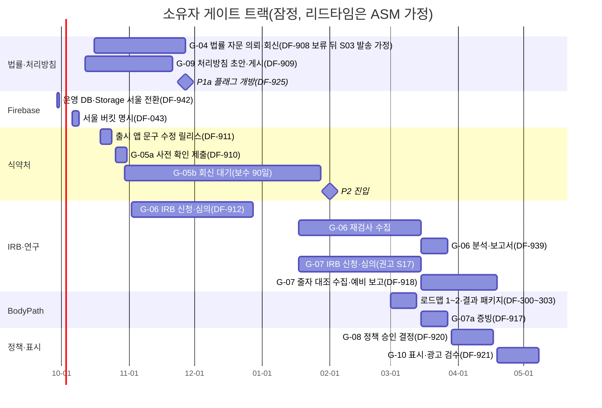
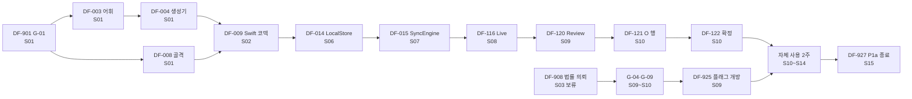

# 릴리스·스프린트 계획

| 항목 | 값 |
|---|---|
| 문서 ID | V1-03 |
| 버전 | v1.2 |
| 상태 | 개발 착수 기준(Ready) |
| 작성일 | 2026-09-24 |
| 소유자 | CJH |
| 근거 PRD 절 | §1.6, §5.3–§5.4, §11.1, §12.1–§12.7, §13.1–§13.3 |
| 관련 에픽·스토리 | EP-00(DF-901~DF-939, DF-942) 전체, EP-01~EP-22의 스프린트 배정(DF-001~DF-390), EP-23은 배정 없음 |
| 변경 규칙 | [문서 변경](01_AGILE_WORKING_AGREEMENT.md#문서-변경) |

## 목차

- [MVP 계획(DEC-22)](#mvp-계획dec-22) — 지금 적용되는 계획

1. [이 문서의 위치와 읽는 법](#1-이-문서의-위치와-읽는-법)
2. [계획 원칙](#2-계획-원칙)
3. [달력: 휴일과 스프린트 용량](#3-달력-휴일과-스프린트-용량)
4. [릴리스 로드맵(P0~P3, V2)](#4-릴리스-로드맵p0p3-v2)
5. [게이트 타임라인과 소유자 병렬 트랙](#5-게이트-타임라인과-소유자-병렬-트랙)
6. [스프린트별 계획표](#6-스프린트별-계획표)
7. [주경로(critical path)](#7-주경로critical-path)
8. [기능 플래그 개방 일정](#8-기능-플래그-개방-일정)
9. [릴리스 열차: 앱·규칙·함수·이관](#9-릴리스-열차-앱규칙함수이관)
10. [버퍼 정책](#10-버퍼-정책)
11. [재계획 트리거](#11-재계획-트리거)
12. [단계 종료 검토](#12-단계-종료-검토)
13. [롤백 기준 요약](#13-롤백-기준-요약)
14. [가정(ASM)과 스파인·PRD와의 차이](#14-가정asm과-스파인prd와의-차이)
15. [변경 이력](#15-변경-이력)

---

## MVP 계획(DEC-22)

> **지금 적용되는 계획이다.** 2026-09-25 [DEC-22](00_README.md#결정-기록)(소유자 확정 2026-09-25)로 범위를 '1인 알파 MVP'로 줄였다. 아래 §4~§9의 P0~P3 계획은 MVP 뒤 계획으로 **연기**하며 내용은 지우지 않는다.

### 왜 줄였나

- 이전 계획은 채택 193건·465점을 S01~S32(2027-05-07 1.0 출시)에 걸쳐 만든다. 회원 앱 공유·초대, 동의 5종 전체와 권리 행사·파기·감사, 레거시 이관, Runner 문구·린트, 판정 엔진, LiDAR 베타, 센터 출시가 모두 들어 있다. 대부분은 **실회원**이 생겨야 의미가 있거나 외부 게이트(법률·식약처·IRB)에 묶여 있다.
- 지금 필요한 것은 소유자(트레이너) 한 명이 **테스트 회원**으로 네 흐름을 끝까지 쓰는 것이다. 그래서 `scope/mvp` 67건·191점만 남긴다: 완료 8건·18점, S01 소유자 대기 2건·2점, S02~S12의 남은 57건·171점(상태는 아래 항목 목록의 기준 시각). S13(12-21~12-24)은 MVP 종료 확인과 버퍼다.
- `scope/mvp`가 없는 126건 가운데 PR이 이미 열린 3건(DF-007·DF-010·DF-011, `scope/carryover`)은 마치고, 나머지 123건은 연기한다(`scope/deferred`). 색인·카드의 스프린트 값은 옛 계획 그대로 두되 `issues.json`에서는 스프린트가 'MVP 뒤'(옛 값은 `plannedSprint`)라 MVP 스프린트 번호와 섞이지 않고, `brief.mjs`는 연기 항목의 작업 지시서를 만들지 않는다(`--allow-deferred`로 검토용만). MVP 종료 검토 뒤 실회원 투입 순서에 맞춰 다시 계획한다.

### 네 흐름과 필요한 항목

| 흐름 | 화면·기능 | 항목(MVP) |
|---|---|---|
| 공통 기반 | 로그인, 셸(첫 화면 TR-02), 로컬 저장, 동기화, 디자인, 테스트 회원, 동의 ①②③ 기록과 유효 동의 계산, 규칙·인덱스·Storage, 시드·통합 CI, 서울 리전 | DF-006, DF-009, DF-012, DF-013, DF-014, DF-015, DF-016, DF-017, DF-018, DF-020, DF-021, DF-022, DF-023, DF-024, DF-027, DF-034, DF-035, DF-037, DF-038, DF-039, DF-042, DF-043, DF-104, DF-107, DF-108, DF-109, DF-110, DF-111(최소 조각), DF-113 |
| ① SOAP | Live(Pencil·한 줄·'기록 완료') → Review S/A/P·O 행 → 확정·확정 대기 → addendum, 필기 Storage | DF-116, DF-118, DF-120~DF-123 |
| ② 신체조성·줄자 | 수기 입력, 결과지 사진·정정, 줄자 둘레 반복 | DF-127~DF-129 |
| ③ 체형 | 기본 스테이션·촬영 조건(복장 선택), 정면·측면 촬영(시뮬레이터는 사진 가져오기), EXIF 제거, Vision 랜드마크 + 수동 보정, 산식(CVA·어깨 높이 차 강조), 확정·결과 | DF-200, DF-201, DF-203(최소 조각), DF-204~DF-210 |
| ④ 타임라인·추이 | 회원 상세 타임라인, 체형 이벤트, 출처 등급 칩, 추이 끊김(seriesBreak), '산정 준비 중' | DF-114, DF-130, DF-215, DF-216, DF-225 |

각 카드의 `### MVP 범위(DEC-22)` 절에 지금 만들 것, 미룰 것, MVP에서 기다리지 않는 의존이 있다.

### MVP 공통 규칙

모든 MVP 카드에 적용한다. 카드의 MVP 절이 더 좁게 정하면 카드를 따른다. `brief.mjs`가 MVP 스토리의 작업 지시서 §4에 1번과 6번을 넣는다.

1. **분석 이벤트는 MVP 뒤다(DF-126·DF-033).** `AnalyticsSink`·`DebugSink`·`TrainerEvent`와 이벤트 레지스트리가 연기돼 있으므로, MVP 카드의 분석 이벤트 수용 기준(AC-DF-110.7, AC-DF-122.7, AC-DF-123.8, AC-DF-127.10, AC-DF-204.7, AC-DF-206.4의 `save_failure_shown`, AC-DF-208.7, AC-DF-209.8, DF-210·DF-215의 `change_status_rendered`)과 `TrainerAnalyticsTests` 테스트, 이벤트 전송 코드는 만들지 않는다. 각 카드 MVP 절에도 한 줄씩 적었다.
2. **체형 사진은 뷰마다 두 파일이다.** 원본 `{view}.jpg`와 일반 썸네일 `{view}_thumb.jpg`(DF-205 `PhotoSanitizer`·`Thumbnailer`). 얼굴 가림본(`FaceMasker`, `{view}_masked_thumb.jpg`)은 MVP 뒤이고 실회원 전에는 필수다. 문서의 `maskedThumbPath`는 `null`(V1-05 §4.6 `str|null`)이고, 확정 전환(DF-206 Outbox #5)은 가림본을 기다리지 않는다. 사진은 기기 로컬 파일만 읽는다: 새 버전 사진(DF-209 `PhotoRebaser`)과 타임라인 썸네일(DF-225)은 원격에서 받지 않으며 `PhotoAccessGate`·`StoragePhotoFetcher`(DF-227·DF-214)는 만들지 않는다.
3. **테스트 회원 데이터 규칙.** 서울(운영) 프로젝트와 에뮬레이터의 테스트 회원에는 합성 데이터, 출처·라이선스를 기록한 합성·공개 샘플 이미지(DF-200 ASM-P1b-39와 같은 기준), 또는 소유자 본인 데이터만 넣는다. 직원·지인·회원 등 제3자의 사진·신체·동의 데이터는 G-04·G-09 증빙 전에는 넣지 않는다. 이것은 개발 데이터 취급 규칙이며 법률 판단이 아니다(법률 검토는 G-04·G-09, MVP 뒤).
4. **기기.** 트레이너 앱은 iPad 전용이라 iPad 시뮬레이터로 확인한다(iPad 실기기가 연결되면 다시 확인). 연결된 iPhone 15 Pro Max는 회원 앱·BodyPath 확인과 DF-200 Vision 스파이크 하네스(`trainer_app/Spikes/VisionPoseSpike/`, 트레이너 앱 아님)에만 쓴다.
5. **Vision 대비책.** 시뮬레이터나 CI 러너에서 `VNDetectHumanBodyPoseRequest`가 결과를 내지 않으면, Vision 동작은 iPhone 하네스 기록(DF-200)으로 확인하고, DF-207 자동 테스트는 매퍼 단위 테스트와 기록한 관절 픽스처로 돌린다. 데모의 체형 흐름은 DF-208 '지정 필요' 수동 지정으로 한다(DF-200·DF-207 MVP 절).
6. **연기 항목에 기대지 않는다.** MVP 카드는 `scope/deferred` 항목의 코드·API를 호출하거나 먼저 만들지 않는다. 필요하면 카드의 MVP 절에 대체 방법을 적는다.
7. **시작 화면은 TR-02 회원 목록이다.** TR-01 '오늘'(DF-125 세션 보드)은 MVP 뒤라 사이드바에서 숨긴다. 사이드바는 회원·설정 두 항목이고, 세션은 TR-03 헤더의 '세션 시작'으로 연다(DF-017·DF-013·DF-113 MVP 절).
8. **동의 판단은 한 곳에서 읽는다.** 동의 칩과 화면 가드는 DF-111 최소 조각의 `EffectiveConsent`(①②③)만 읽는다. ④⑤, 거부 뒤 '다시 받기', 철회·재동의 UX는 MVP 뒤다(DF-111 MVP 절).
9. **체형 촬영 조건은 기본 스테이션 하나로 기록한다.** DF-203 최소 조각이 기본 프로필(`stationProfileId = "default-v1"`, 프로토콜 v1 초안 범위의 가운데 값)을 자동으로 만들고, 트레이너는 회차마다 복장만 고른다. 체크리스트의 나머지 세 불리언은 확인하지 않았으므로 `false`로 쓰고, 센서가 없는 시뮬레이터 경로에서는 수평 값을 쓰지 않는다. 스테이션 편집 UI와 체크리스트 전체는 MVP 뒤이며 실회원 전에는 필요하다(DF-203·DF-204 MVP 절).

### MVP 스프린트(1주)

| 스프린트 | 기간 | 작업일 | 약속 한도 | 약속점(MVP + 진행 중 MVP 외) | MVP 항목 | 진행 중(MVP 외, 마친다) | 목표 |
|---|---|---|---|---|---|---|---|
| S02 | 10-05~10-09 | 3 | 11 | 7 + 5 | DF-006(진행 중 #117), DF-009, DF-034, DF-043, DF-905(소유자) | DF-007(#116), DF-010(#119) | 새 컬렉션 스키마, Swift SOAP v2 코덱, plist 비추적, 서울 버킷 명시 |
| S03 | 10-12~10-16 | 5 | 18 | 17 + 1 | DF-017(진행 중 #118), DF-020, DF-021, DF-037(완료 #114), DF-038, DF-042, DF-906(소유자) | DF-011(#115) | AppShell, 규칙 v2·새 컬렉션 규칙, Functions 공통 구조, 에뮬레이터 시드 |
| S04 | 10-19~10-23 | 5 | 18 | 16 | DF-012, DF-022, DF-023, DF-024, DF-027, DF-035 | - | claim 로그인, 규칙·Storage 규칙 테스트, 인덱스, 플래그 키 |
| S05 | 10-26~10-30 | 5 | 18 | 17 | DF-013, DF-014, DF-016, DF-039, DF-104, DF-108 | - | 회원 로드, LocalStore, DesignSystem, FirebaseData, 대기(테스트) 회원 등록 |
| S06 | 11-02~11-06 | 5 | 18 | 18 | DF-015, DF-018, DF-107, DF-109, DF-111(최소 조각) | - | SyncEngine, 설정 기초, 에뮬레이터 통합 CI, recordConsent(MVP 범위), 유효 동의 계산(①②③) |
| S07 | 11-09~11-13 | 5 | 18 | 16 | DF-110, DF-113, DF-116, DF-118, DF-925(소유자), DF-931(소유자) | - | 동의 기록(MVP 범위), 회원 목록, **흐름 1** Live·필기 업로드. 소유자: 서울 배포·플래그 |
| S08 | 11-16~11-20 | 5 | 18 | 18 | DF-114, DF-120, DF-121, DF-122, DF-200 | - | **흐름 1** Review·O 행·확정, **흐름 4** 타임라인, Vision 가능성 확인 |
| S09 | 11-23~11-27 | 5 | 18 | 16 | DF-123, DF-127, DF-128, DF-201 | - | **흐름 1** addendum, **흐름 2** 신체조성·결과지, **흐름 3** PostureMath |
| S10 | 11-30~12-04 | 5 | 18 | 16 | DF-129, DF-130, DF-203(최소 조각), DF-204 | - | **흐름 2** 줄자 둘레, **흐름 4** 차트 규칙, **흐름 3** 기본 스테이션·촬영 조건, 촬영 |
| S11 | 12-07~12-11 | 5 | 18 | 17 | DF-205, DF-206, DF-207, DF-208, DF-216, DF-929(소유자) | - | **흐름 3** EXIF 제거·업로드 큐·Vision 어댑터·랜드마크 보정, **흐름 4** seriesBreak. 소유자: bodyAssessment |
| S12 | 12-14~12-18 | 5 | 18 | 15 | DF-209, DF-210, DF-215, DF-225 | - | **흐름 3** 확정·결과, **흐름 4** 추이 차트·체형 타임라인 |
| S13 | 12-21~12-24 | 4 | 14 | 0 | - | - | MVP 종료: 데모 체크리스트(시뮬레이터 + 에뮬레이터 → 서울), 버퍼. 새 항목 없음 |

- 약속 한도는 §3.2 용량 × 0.9다. S02는 K-19 예외(12/11)를 그대로 둔다. 같은 스프린트 안 의존은 허용한다(02 §4.2). S03 약속점에는 이미 병합된 DF-037(2점)이 들어 있다.
- 2026-09-25 리뷰 반영: DF-111 최소 조각(3점)을 S06(15→18)에, DF-203 최소 조각(3점)을 S10에 넣고 DF-216(3점)을 S10에서 S11(14→17)로 옮겼다. DF-111은 색인 의존 DF-110(S07)보다 먼저지만 서버 상태를 프로토콜로 받아 기다리지 않는다(카드 MVP 절). DF-216은 허용 범위 생성물(DF-203) 뒤가 된다.
- 진행 중인 MVP 외 항목(DF-007 회원 앱 코덱 #116, DF-010 금지어 보고 모드 #119, DF-011 static-guards #115)은 PR이 열려 있어 마친다. DF-120의 금지어 인라인 경고가 DF-010 목록을 쓴다.
- 소유자 작업(DF-942, DF-903, DF-905, DF-906, DF-931, DF-925, DF-929)은 [00 소유자 대기 목록](00_README.md#소유자-대기-목록)에 명령과 함께 있다. 늦어도 에뮬레이터 개발은 막히지 않고, 서울 확인만 밀린다.
- 재계획: 한 스프린트에서 약속점의 70% 미만을 병합하면 다음 스프린트 첫날 §11 트리거와 같은 방식으로 뒤 스프린트를 밀고, 흐름 ③(체형)의 촬영 품질 기능(DF-205 나머지 등)부터 줄인다. 흐름 ①·④와 동기화는 줄이지 않는다.

### MVP 항목 목록

상태: 완료 = main 병합, 진행 중 = PR 열림(다른 워크플로), 할 일, 소유자 대기. **기준 시각 2026-09-25 21:35 KST**(`gh pr list`·`gh issue list`): 병합 #114(DF-037), 열림 #115(DF-011)·#116(DF-007)·#117(DF-006)·#118(DF-017)·#119(DF-010). DF-020·DF-021은 PR·브랜치가 아직 없다. 'MVP 범위'가 '일부'인 카드는 카드의 MVP 절에 미루는 부분이 있다.

| 키 | 제목 | 상태 | MVP 스프린트 | 점 | 왜 필요한가 | MVP 범위 |
|---|---|---|---|---|---|---|
| DF-901 | MIG-01 미커밋 87개를 A·B·C로 분류해 A를 main에 병합하고 B를 보관한다(G-01) | 완료 | S01 | 1 | 모든 작업의 기준선 | 완료 |
| DF-001 | docs/v1 문서군을 병합하고 AGENTS.md·CLAUDE.md에 v1 절을 링크한다 | 완료 | S01 | 1 | 문서·헤더 린트 기준 | 완료 |
| DF-002 | 백로그 도구(labels·milestones·issue JSON·create_backlog.sh·validate_backlog.mjs)를 dry-run으로 검증한다 | 완료 | S01 | 2 | 이슈·작업 지시서 생성 | 완료 |
| DF-003 | metric-catalog.v1.json과 vocab.v1.json을 부록 A·B에서 작성한다 | 완료 | S01 | 2 | 지표 코드·출처 등급·단위의 단일 원본 | 완료 |
| DF-004 | contracts 생성기와 --check CI를 만든다(Swift·Dart·Functions·admin_web) | 완료 | S01 | 3 | Swift 생성 코드(지표·어휘·플래그) | 완료 |
| DF-005 | SOAP v2·레거시 교차 픽스처를 작성한다 | 완료 | S01 | 2 | DF-009 Swift 코덱 테스트 입력 | 완료 |
| DF-008 | trainer_app 골격(XcodeGen, TrainerKit 타깃, App Check)과 trainer-app CI를 만든다 | 완료 | S01 | 5 | iPad 트레이너 앱 자체 | 완료 |
| DF-006 | firestore_schema.md를 §9.3으로 개정하고 새 JSON Schema를 추가한다 | 진행 중(#117) | S02 | 2 | 새 컬렉션(대기 회원·신체조성·둘레·체형·동의 상태) 스키마. 규칙과 코덱의 기준 | 전체 |
| DF-009 | Swift SOAP v2 코덱(TrainerDomain)과 교차 왕복 테스트를 구현한다 | 할 일 | S02 | 3 | 트레이너 앱이 SOAP v2 문서를 읽고 쓰는 유일한 코덱(DEC-21: Claude 담당, Codex 브랜치는 대체) | 전체 |
| DF-034 | GoogleService-Info.plist 비추적과 CI 시크릿 주입을 설정한다 | 할 일 | S02 | 1 | 실제 Firebase(서울) 연결에 필요한 GoogleService-Info.plist 비추적·CI 주입 | 전체 |
| DF-043 | 서울 Storage 버킷과 Firestore 위치를 앱·admin_web·Functions·firebase.json에 명시한다(DEC-19) | 할 일 | S02 | 1 | 서울 버킷·Firestore 위치를 코드에 명시(DEC-19): Functions·admin_web·회원 앱·`firebase.json` 버킷. 트레이너 앱은 DF-104 | 전체 |
| DF-017 | AppShell(NavigationSplitView, TR 라우트, DI, --preview-*, 플래그 진입점 숨김)을 만든다 | 진행 중(#118) | S03 | 3 | AppShell·라우트·DI. 모든 화면의 진입점. MVP 첫 화면은 TR-02, TR-01 '오늘' 숨김(공통 규칙 7) | 전체 + MVP 시작 라우트(카드 MVP 절) |
| DF-020 | firestore.rules v2 헬퍼(canWriteFor, hasConsent, featureOn)와 soap_notes v2 규칙을 작성한다 | 할 일 | S03 | 5 | firestore.rules v2 헬퍼와 soap_notes 규칙. SOAP 동기화의 서버 쪽 조건 | 전체 |
| DF-021 | 새 컬렉션 규칙(체형·신체조성·둘레·bodyScans·대기 회원·동의·요약·권리·opsMetrics·정책)을 작성한다 | 할 일 | S03 | 5 | 대기 회원·신체조성·둘레·체형·동의 상태·appConfig 규칙 | 일부(카드 MVP 절) |
| DF-037 | Functions shared 구조(region, callable 어댑터 이전, errors, audit)를 만든다 | 완료(#114) | S03 | 2 | Functions 공통 구조(region=asia-northeast3, 오류, 인증). recordConsent가 이 위에 선다 | 전체 |
| DF-038 | Storage 교차 서비스 firestore.get 규칙을 실환경에서 확인한다 | 할 일 | S03 | 1 | Storage 규칙이 Firestore를 교차 조회(firestore.get)하는지 확인. 사진·필기 경로 규칙의 전제 | 일부(카드 MVP 절) |
| DF-042 | 에뮬레이터 합성 데이터 시드 스크립트를 만든다(가상 트레이너·회원·동의 상태·플래그·claim) | 할 일 | S03 | 1 | 에뮬레이터 합성 시드(가상 트레이너·claim·플래그·동의 상태). 로그인·동기화 확인을 실데이터 없이 반복(DEC-21 채택) | 전체 |
| DF-012 | trainer claim 로그인과 claim 회수 잠금을 구현한다(FeatureAuth·AuthService) | 할 일 | S04 | 3 | trainer claim 로그인과 claim 회수 잠금. 트레이너 한 명(소유자)의 로그인 | 전체 |
| DF-022 | 규칙 테스트 R-01~R-13, R-21, R-23, R-24(SOAP·담당 관계)를 작성한다 | 할 일 | S04 | 3 | SOAP·담당 관계 규칙 테스트. 실제 Firebase에 규칙을 올리기 전 검증 | 전체 |
| DF-023 | storage.rules 새 경로(부모 문서 교차 조회, 크기·MIME)와 S-01~S-08 테스트를 작성한다 | 할 일 | S04 | 3 | storage.rules 새 경로(필기 soapInk, 체형 사진, 결과지 사진)와 S-01~S-08 테스트 | 일부(카드 MVP 절) |
| DF-024 | §9.6 복합 인덱스를 firestore.indexes.json에 추가한다 | 할 일 | S04 | 1 | 타임라인·추이 조회에 필요한 복합 인덱스 | 전체 |
| DF-027 | 플래그 5키를 contracts·zod·example·Dart·Swift에 추가하고 AD-07 화면을 확장한다 | 할 일 | S04 | 3 | 플래그 키를 contracts·Swift에 추가. 규칙 featureOn()과 앱의 진입점 숨김이 같은 키를 본다 | 일부(카드 MVP 절) |
| DF-035 | 규칙 테스트 R-14~R-20, R-22, R-25~R-31(측정·동의·대기 회원·플래그)을 작성한다 | 할 일 | S04 | 3 | 측정·동의·대기 회원·플래그 규칙 테스트(R-14~R-31) | 전체 |
| DF-013 | trainers/{uid} 리스너와 users 청크 조회로 담당 회원을 불러온다(TR-02 기초) | 할 일 | S05 | 3 | trainers/{uid} 리스너와 회원 로드. TR-02 회원 목록의 기초 | 전체 |
| DF-014 | LocalStore SwiftData 스키마 v1과 파일 보호를 만든다 | 할 일 | S05 | 3 | LocalStore(SwiftData)와 파일 보호. local-first의 저장소 | 전체 |
| DF-016 | DesignSystem 기초 토큰과 SyncStateBadge·SourceGradeChip·MetricRow·EmptyState를 만든다 | 할 일 | S05 | 3 | DesignSystem 토큰과 SyncStateBadge·SourceGradeChip·MetricRow·EmptyState | 전체 |
| DF-039 | AppDelegate.swift 이식 대상을 모듈별 줄 범위로 확정한다(보관 브랜치 tip 기준) | 할 일 | S05 | 2 | AppDelegate 이식 대상 줄 범위. Live 캔버스·체형 화면 이식의 지도 | 전체 |
| DF-104 | FirebaseData RemoteWriter·BinaryUploader·CallableClient와 퍼시스턴스 설정을 구현한다 | 할 일 | S05 | 3 | FirebaseData RemoteWriter·BinaryUploader·CallableClient. 동기화의 원격 쪽. 트레이너 앱의 서울 버킷 명시(사진·필기 업로드 대상, DEC-19) | 전체 |
| DF-108 | TR-14 대기 회원 최소 등록(만 14세 확인)을 구현한다 | 할 일 | S05 | 3 | TR-14 대기 회원 최소 등록(만 14세 확인). MVP의 테스트 회원 생성 경로 | 전체 |
| DF-015 | SyncEngine Outbox 순서·백오프·syncState 계산을 구현한다 | 할 일 | S06 | 5 | SyncEngine Outbox·백오프·syncState. 로컬 기록을 Firebase로 보내는 엔진 | 전체 |
| DF-018 | TR-15 설정 기초(실제 로그아웃, 미동기 경고, 큐 상태·재시도, 버전)를 구현한다 | 할 일 | S06 | 2 | TR-15 설정 기초(로그아웃, 미동기 경고, 큐 상태·재시도) | 전체 |
| DF-107 | trainer-app-emulator-it CI와 오류 주입 하네스를 만든다 | 할 일 | S06 | 3 | trainer-app 에뮬레이터 통합 CI. '에뮬레이터로 동기화' 증빙 | 전체 |
| DF-109 | recordConsent와 memberConsentStates 파생·서명 저장을 구현한다 | 할 일 | S06 | 5 | recordConsent와 memberConsentStates 파생. 규칙 hasConsent()가 이 문서를 보므로, 없으면 테스트 회원의 SOAP·측정·사진 쓰기가 모두 거부된다 | 일부(카드 MVP 절) |
| DF-111 | 오프라인 현장 동의를 Outbox 첫 항목으로 두고 awaitingConsent를 처리한다 | 할 일 | S06 | 3 | 유효 동의 타입과 계산기(`EffectiveConsent`, ①②③). TR-02 동의 칩과 MVP 카드의 동의 가드(DF-110·113·127·128·129·204)가 이것만 읽는다 | 일부(최소 조각, 카드 MVP 절) |
| DF-110 | TR-14 동의 카드·유형별 선택·서명 패드를 구현한다(대기·가입 회원) | 할 일 | S07 | 5 | 테스트 회원 등록 때 동의 ①②③을 기록하는 화면 | 일부(카드 MVP 절) |
| DF-113 | TR-02 회원 목록(대기 배지, 동의 칩, 검색, 대기 회원 추가)을 완성한다 | 할 일 | S07 | 2 | TR-02 회원 목록(대기 배지, 동의 칩, 검색, 대기 회원 추가) | 일부(카드 MVP 절) |
| DF-116 | TR-04 Live(캔버스 60% 이상, 한 줄 입력, '기록 완료' 1탭, 이어쓰기·새 세션 선택)를 구현한다 | 할 일 | S07 | 5 | SOAP 흐름 1: TR-04 Live(Pencil 캔버스, 한 줄 입력, '기록 완료') | 전체 + Live 동의 ② 가드(DF-119 AC-DF-119.1 부분 집합, 카드 MVP 절) |
| DF-118 | 필기 개정본을 Storage soapInk에 업로드하고 inkRevision을 기록한다 | 할 일 | S07 | 3 | 필기 개정본을 Storage soapInk에 올리고 inkRevision 기록 | 전체 |
| DF-114 | TR-03 회원 상세 헤더와 통합 타임라인 목록(종류 필터, 커서 페이지네이션)을 구현한다 | 할 일 | S08 | 3 | 흐름 4: TR-03 회원 상세 헤더와 통합 타임라인 | 전체 |
| DF-120 | TR-05 Review S/A/P 카드, 회원에게 남길 한 줄, 금지어 인라인 경고를 구현한다 | 할 일 | S08 | 3 | SOAP 흐름 1: TR-05 Review S/A/P 카드 | 일부(카드 MVP 절) |
| DF-121 | Review O typed 행(metricCode enum, AROM 기본, MMT, 미완성 행)을 구현한다 | 할 일 | S08 | 5 | SOAP 흐름 1: Review O typed 행(AROM 기본, MMT) | 일부(카드 MVP 절) |
| DF-122 | 확정 최소 요건 체크리스트와 확정·확정 대기를 구현한다 | 할 일 | S08 | 5 | SOAP 흐름 1: 확정 최소 요건과 확정·확정 대기 | 전체 |
| DF-200 | Apple Vision 2D 랜드마크를 대상 iPad에서 정확도·좌우 매핑·지연으로 확인한다 | 할 일 | S08 | 2 | Apple Vision 2D 랜드마크 가능성 확인. 체형 흐름의 자동 랜드마크 전제 | 일부(카드 MVP 절) |
| DF-123 | addendum, draft 삭제, auditSoapFinalized 트리거를 구현한다 | 할 일 | S09 | 3 | SOAP 흐름 1: addendum과 draft 삭제 | 일부(카드 MVP 절) |
| DF-127 | TR-11 신체조성 입력(값 폼, 필수 메타, 범위·교차 검증, BMI 파생)을 구현한다 | 할 일 | S09 | 5 | 흐름 2: TR-11 신체조성 수기 입력 | 전체 |
| DF-128 | 결과지 사진 첨부, '정정', 기기 변경 경고를 구현한다 | 할 일 | S09 | 3 | 흐름 2: 결과지 사진 첨부·정정·기기 변경 경고 | 전체 |
| DF-201 | PostureMath 산식과 posture-metrics.v1 벡터를 구현한다 | 할 일 | S09 | 5 | 흐름 3: PostureMath 산식(CVA, 어깨 높이 차 등) | 일부(카드 MVP 절) |
| DF-129 | TR-12 줄자 둘레(기본 허리·엉덩이, 부위 추가, 반복 3회, side·landmarkNote 규칙)를 구현한다 | 할 일 | S10 | 5 | 흐름 2: TR-12 줄자 둘레 반복 입력 | 전체 |
| DF-130 | Swift 공통 차트 규칙(SeriesTrendChart, 출처 칩, '산정 준비 중', 보간 금지)과 TR-11 미니 추이를 구현한다 | 할 일 | S10 | 3 | 흐름 4: Swift 공통 차트 규칙(출처 칩, '산정 준비 중', 보간 금지)과 TR-11 신체조성 미니 추이(둘레 추이는 DF-215 TR-10) | 전체 |
| DF-203 | 스테이션 프로필과 회차 체크리스트 4항목을 구현한다 | 할 일 | S10 | 3 | 체형 문서 필수 필드(`protocolVersion`·`stationProfileId`·`captureConditions`, V1-05 §4.6·규칙): 기본 스테이션 `default-v1` 자동 생성, 복장 선택, 프로토콜 v1 초안 생성물 | 일부(최소 조각, 카드 MVP 절) |
| DF-204 | TR-07 촬영(정면·측면, roll·pitch 게이트, 인물·조명 검출, 동의 ②③ 게이트)을 구현한다 | 할 일 | S10 | 5 | 흐름 3: TR-07 정면·측면 촬영 | 일부(카드 MVP 절) |
| DF-205 | EXIF·GPS 제거, 얼굴 가림 썸네일, 재촬영 폐기, 앱 전용 저장을 구현한다 | 할 일 | S11 | 3 | 흐름 3: EXIF·GPS 제거, 재촬영 폐기, 앱 전용 저장 | 일부(카드 MVP 절) |
| DF-206 | 체형 draft 오프라인 저장과 사진 업로드 큐·확정 대기 표시를 구현한다 | 할 일 | S11 | 3 | 흐름 3: 체형 draft 오프라인 저장과 사진 업로드 큐 | 전체 |
| DF-207 | PostureVision LandmarkSuggester(Vision 2D) 어댑터와 엔진 기록을 구현한다 | 할 일 | S11 | 3 | 흐름 3: Vision 2D 랜드마크 어댑터 | 전체 |
| DF-208 | TR-08 랜드마크 보정(확대 핀, 1px 방향 버튼, auto/확정 모양, '지정 필요')을 구현한다 | 할 일 | S11 | 5 | 흐름 3: TR-08 랜드마크 수동 보정 | 전체 |
| DF-216 | conditionKey 비교와 seriesBreak·seriesKey 분할을 Swift·Dart 공통 규칙으로 구현한다 | 할 일 | S11 | 3 | 흐름 4: conditionKey 비교와 seriesBreak 분할(추이 차트의 끊김 규칙) | 일부(카드 MVP 절) |
| DF-209 | 체형 확정, 새 버전(supersedesId), voided, 기준선 규칙을 구현한다 | 할 일 | S12 | 5 | 흐름 3: 체형 확정·새 버전·기준선 | 일부(카드 MVP 절) |
| DF-210 | TR-09 결과 화면과 자세 편위 표를 구현한다('산정 준비 중') | 할 일 | S12 | 3 | 흐름 3: TR-09 결과 화면과 편위 표('산정 준비 중') | 일부(카드 MVP 절) |
| DF-215 | TR-10 추이 차트(seriesBreak, 날짜 척도, L/R, 툴팁, noComparison)를 구현한다 | 할 일 | S12 | 5 | 흐름 4: TR-10 추이 차트(seriesBreak, 날짜 척도, L/R) | 전체 |
| DF-225 | TR-03 타임라인에 체형평가 이벤트(썸네일·기준선·주요 지표 2개)를 추가한다 | 할 일 | S12 | 2 | 흐름 4: 타임라인에 체형평가 이벤트 | 전체 |
| DF-942 | 운영 데이터를 서울(asia-northeast3)로 옮긴다: nam5 (default) 삭제·재생성, 서울 Storage 버킷 생성·연결, 앱 구성 재확인 | 소유자 대기 | S01 | 1 | 운영 Firestore `(default)`를 서울로 재생성, 서울 Storage 버킷 생성·연결(DEC-19) | 전체 |
| DF-903 | kr.co.dfet.trainer를 dfetmanage에 등록하고 plist·App Attest를 설정한다(G-02) | 소유자 대기 | S01 | 1 | kr.co.dfet.trainer 앱 등록과 plist(실제 Firebase 연결) | 전체 |
| DF-905 | claim 테스트 계정과 가상 회원 시드를 준비한다 | 소유자 대기 | S02 | 0 | 소유자 계정에 trainer claim 부여 | 일부(카드 MVP 절) |
| DF-906 | Storage 서비스 계정에 Firestore 교차 조회 권한을 부여한다 | 소유자 대기 | S03 | 0 | Storage 서비스 계정의 Firestore 교차 조회 권한(Storage 규칙이 firestore.get을 쓰므로 MVP에 포함) | 전체 |
| DF-931 | 규칙·Storage 규칙·인덱스·Functions를 태그 기준으로 운영에 배포한다 | 소유자 대기 | S07 | 1 | 규칙·Storage 규칙·인덱스·Functions(recordConsent)를 서울에 배포 | 일부(카드 MVP 절) |
| DF-925 | soapV2·bodyComposition 플래그를 연다(P1a 진입) | 소유자 대기 | S07 | 0 | 서울 `appConfig/features`의 soapV2·bodyComposition을 켜야 규칙 featureOn()이 쓰기를 허용한다 | 일부(카드 MVP 절) |
| DF-929 | bodyAssessment 플래그를 연다 | 소유자 대기 | S11 | 0 | 서울 `appConfig/features`의 bodyAssessment(체형 쓰기 규칙 조건) | 일부(카드 MVP 절) |

### MVP에서 미루는 것(요약)

- 회원 앱 기능과 공유·초대·`memberSummaries`(P2), 회원 앱 코덱 이후 작업
- 동의 5종 전체, 서명 패드·서명 저장, 철회·재동의·재확인, 오프라인 동의 처리(DF-111의 나머지: 거부 뒤 '다시 받기', 활성화 시 파기, `AwaitingConsentIT`), 권리 행사, 보유기간 파기, 감사 로그, `opsMetrics`. MVP는 대기 회원의 ①②③ 동의 기록과 유효 동의 계산(DF-111 최소 조각)만 한다
- 규제 게이트: 법률 G-04·G-09(DF-908·DF-909), 식약처 G-05(DF-910·DF-911·DF-919), IRB G-06·G-07(DF-912·DF-918)
- Runner 문구 수정과 copy-lint 차단 모드(DF-028·DF-029·DF-040·DF-041)
- 레거시 이관 MIG-02~MIG-08(DF-030·DF-031·DF-100·DF-138·DF-142·DF-907·DF-924). 운영 DB를 서울에 새로 만들어 레거시 데이터가 없다
- 트레이너 앱에 꼭 필요한 것 밖의 admin_web 화면(AD-03 DF-032, AD-05 DF-220, AD-07 확장, 관리자 claim 통일 DF-026·DF-101)
- 분석 이벤트·레지스트리(DF-033·DF-126), 오늘 세션 보드(DF-125, TR-01은 사이드바에서 숨김), NRS·바디맵(DF-117·DF-219), 이어쓰기(DF-124), O 자동 불러오기·나란히 보기(DF-214·DF-217·DF-218), 재검사 모드(DF-212), 체형 사진 한 장 삭제(DF-211), 스테이션 편집·선택 UI와 회차 체크리스트 나머지(DF-203의 최소 조각 밖), 실기기 프로토콜·접근성 감사(DF-140·DF-141·DF-223·DF-226), TestFlight(DF-139)
- LiDAR 베타, 판정 엔진·배지, P3 전체, V2
- 단계 종료 검토(DF-926~DF-928)와 플래그의 실회원 개방. 실회원 데이터는 원래 게이트 뒤에만 넣는다(§2 원칙 6)

### MVP 종료·데모 체크리스트

**A. iPad 시뮬레이터 + Firebase 에뮬레이터(S12 끝, 늦어도 S13)**

- [ ] `firebase emulators:start --only auth,firestore,storage,functions --project demo-dfet`와 DF-042 시드로 시작하고, 합성 트레이너로 로그인한다(claim 없는 계정은 잠금)
- [ ] 로그인 뒤 첫 화면이 TR-02 회원 목록이고 사이드바에 '오늘'이 없다(회원·설정 두 항목)
- [ ] 테스트 회원(대기 회원)을 만들고 ①②③ 동의를 기록한다. 회원 목록에 대기 배지와 동의 칩이 보인다(비행기 모드에서 기록하면 칩이 '동의 확인 대기', 복구 뒤 '동의 ①②③')
- [ ] ① Live에서 Pencil 필기와 한 줄 메모 → '기록 완료' → Review S/A/P와 O 행(AROM·MMT) → 확정. 확정 뒤 addendum을 단다. 필기 개정본이 Storage에 올라간다
- [ ] ② 신체조성 수기 입력(범위 검증, BMI 파생)과 결과지 사진, 정정 1회. 줄자 허리·엉덩이 3회 반복 입력
- [ ] ③ TR-07에 기본 스테이션 한 줄(높이·거리)이 보이고, 복장을 고르기 전에는 셔터가 비활성이다. 정면·측면 사진(합성·공개 샘플, 공통 규칙 3)을 가져와(시뮬레이터) Vision 랜드마크 제안(시뮬레이터에서 Vision이 돌지 않으면 '지정 필요' 수동 지정, 공통 규칙 5) → 수동 보정 → CVA·어깨 높이 차 확인(나머지는 '참고') → 확정·기준선. 업로드 사진에 EXIF·GPS가 없다
- [ ] ④ 회원 상세 타임라인에 SOAP·신체조성·둘레·체형 이벤트가 보이고, 추이 차트에 출처 등급 칩과 추이 끊김이 있고, 변화 판정 자리는 '산정 준비 중'이다
- [ ] 비행기 모드(네트워크 차단)에서 기록 → 복구 뒤 동기화, 유실 0(syncState 배지, TR-15 큐). DF-107 통합 CI가 초록이다
- [ ] 에뮬레이터 Firestore·Storage에 기대한 문서·파일이 있고, 규칙 테스트(DF-022·DF-035·DF-023)가 초록이다

**B. 실제 Firebase(서울, 소유자 대기 목록 1~12 뒤)**

- [ ] 먼저 소유자 대기 목록 12(DF-931 MVP 재배포)를 한다: MVP 종료 규칙·Functions 태그에서 `firebase deploy --project dfetmanage --only firestore:rules,firestore:indexes,storage,functions:recordConsent`를 다시 실행하고(S07 뒤 DF-114 인덱스 2개, DF-206·DF-209 규칙 보강), 콘솔에서 인덱스 빌드가 모두 끝난 것을 확인한다. 빠지면 타임라인·추이 쿼리가 `FAILED_PRECONDITION`으로 실패한다
- [ ] 서울 `(default)`와 서울 버킷이 쓰이고 있다(G-09.md 리전 절). DF-038 S-09 확인을 서울에서 다시 한다
- [ ] 소유자 계정(claim)으로 시뮬레이터 앱에서 A의 네 흐름을 한 번 더 하고, 콘솔에서 문서·파일을 확인한다. 테스트 회원만 쓰고, 넣는 데이터는 공통 규칙 3(합성·공개 샘플 또는 소유자 본인, 제3자 없음)을 따른다. 체형 문서는 `maskedThumbPath=null`, `stationProfileId="default-v1"`, `captureConditions`의 체크리스트 세 불리언은 `false`, Storage에는 뷰마다 두 파일이다
- [ ] 연결된 iPhone은 회원 앱·BodyPath 확인과 DF-200 Vision 하네스에만 쓴다(공통 규칙 4). iPad 실기기가 연결되면 체형 촬영(roll·pitch 게이트, 카메라)을 실기기로 다시 확인한다
- [ ] 결과를 MVP 종료 기록(`docs/v1/reviews/`, V1-T06 형식)에 남기고, 연기 항목을 다시 계획한다

## 1. 이 문서의 위치와 읽는 법

- 정본은 [PRD_V1](../PRD_V1.md) §12다. 이 문서는 PRD의 단계·게이트를 **1주 스프린트 달력**에 배치한 파생 문서다. 둘이 충돌하면 PRD가 우선한다.
- 스토리 내용은 [02_PRODUCT_BACKLOG](02_PRODUCT_BACKLOG.md)와 단계별 백로그([P0](backlog/P0.md), [P1a](backlog/P1a.md), [P1b](backlog/P1b.md), [P2·P3](backlog/P2_P3.md), [V2](backlog/V2.md), [소유자 행동·게이트](backlog/OWNER_ACTIONS_AND_GATES.md))가 정본이다. 이 문서는 **언제**와 **순서**만 정한다.
- 이번 주 실행 계획은 [sprints/SPRINT_01.md](sprints/SPRINT_01.md)를 본다. 다음 스프린트 문서는 [스프린트 계획 템플릿](templates/SPRINT_PLAN.md)(V1-T04)으로 매주 월요일 계획 회의 전에 만든다.
- 운영 방식(의식, DoR·DoD, WIP, 브랜치·PR 규칙, 에이전트 규약)은 [01_AGILE_WORKING_AGREEMENT](01_AGILE_WORKING_AGREEMENT.md)를 따른다.
- 이 문서의 가정은 문서 접두 번호 ASM-03-NN(현재 ASM-03-01~ASM-03-15)을 쓴다(다른 문서와 번호가 겹치지 않도록 정한 대역이며, [00_README](00_README.md)의 통합 가정 목록에 옮겨 적는다).

| 독자 | 먼저 볼 절 |
|---|---|
| 소유자(PO·개발·게이트 책임) | §5 게이트 트랙, §7 주경로, §11 재계획 트리거 |
| AI 코딩 에이전트 | §6 스프린트표(자기 스토리가 어느 주인지), §8 플래그 |
| Windows/GPU 협업자 | §4 로드맵, §5의 G-06·G-07 연구 트랙 |
| 디자이너·엔지니어(향후 합류) | §4, §6, §12 |

## 2. 계획 원칙

1. **게이트가 달력보다 우선한다**(PRD §12 머리말). 이 문서의 날짜는 모두 잠정 목표이며, 게이트 미충족이면 날짜가 밀린다.
2. **외부 게이트는 코딩을 막지 않는다.** 법률(G-04·G-09), 식약처(G-05a/b), IRB(G-06·G-07), BodyPath 선행(G-07a)은 **단계 전환·실데이터 투입·플래그 개방**만 막는다. 합성 데이터와 에뮬레이터로 하는 개발은 게이트와 무관하게 계속한다(ADR-011, ADR-013).
3. **1인 소유자의 검토 용량이 병목이다.** 1점은 에이전트 PR 하나를 소유자가 30분 안에 검토·통합하는 규모다. 에이전트의 코딩 시간은 점수에 넣지 않는다(백로그 스파인 속도 규칙).
4. **소유자 행동 트랙은 코딩 트랙과 같은 스프린트 용량을 나눠 쓴다.** owner-action은 0~1점이며, 1점은 반나절 이상의 소유자 작업이다. 외부 기관 대기 시간은 점수에 넣지 않는다.
5. **미완성 기능은 플래그 false로 main에 병합한다**(ADR-010, ADR-014). 스프린트가 끝났다고 기능을 켜지 않는다. 플래그 개방은 §8 표와 게이트 증빙으로만 한다.
6. **실데이터는 G-04와 G-09 뒤에만** 들어간다. 그 전까지 모든 데모·테스트·자체 확인은 가상 회원 합성 데이터로 한다.

## 3. 달력: 휴일과 스프린트 용량

### 3.1 휴일

| 날짜 | 휴일 | 영향 스프린트 | 근거 |
|---|---|---|---|
| 2026-09-24(목)~09-26(토) | 추석 연휴 | 스프린트 0 없음. S01은 09-28(월) 시작 | 소유자 결정(2026-09-24) |
| 2026-10-05(월) | 개천절(10-03 토) 대체공휴일 | S02 | AS-DEV-01 |
| 2026-10-09(금) | 한글날 | S02 | — |
| 2026-12-25(금) | 성탄절 | S13 | — |
| 2027-01-01(금) | 신정 | S14 | — |
| 2027-02-05(금)~02-07(일), 대체공휴일 02-08(월) | 설 연휴(추정). 평일 휴일은 02-05·02-08 이틀 | S19–S20(작업일 8일) | ASM-03-08. 정부 고시(관보) 확인 후 확정 |
| 2027-03-01(월) | 삼일절 | S23–S24 | — |
| 2027-05-05(수) | 어린이날 | S30–S32 | — |

### 3.2 용량 공식

- 5작업일 스프린트의 용량은 20점, 약속 한도는 용량의 90%인 18점이다(AS-DEV-09). 나머지 10%는 결함·리뷰 반려·게이트 대응 버퍼다(§10).
- 휴일이 있으면 `용량 = 20 × 작업일 / 5`, `약속 한도 = floor(용량 × 0.9)`로 줄인다.
- **첫 보정**: S02의 마지막 작업일(10-08 목)까지의 실적을 S03 계획(10-12 월)에서 계산한다. `작업일당 완료점수 = (S01+S02 완료 점수 합) / 8`. 이월·미병합 PR은 0점이다.
- **S03부터**: `용량 = round(작업일당 완료점수 × 작업일)`. 한 번에 ±25%(5작업일 기준 15~25점)까지만 바꾼다. S04부터는 직전 3개 스프린트 이동평균을 쓴다.
- 점수 합에는 owner-action과 스파이크를 포함한다. 에이전트별 반려율은 회고 템플릿([V1-T11](templates/RETRO.md))에 적고, 완료·이월 점수는 스프린트 리뷰 템플릿([V1-T05](templates/SPRINT_REVIEW.md))에 적는다.

## 4. 릴리스 로드맵(P0~P3, V2)

> **DEC-22로 연기(보존).** 이 절은 MVP 뒤 계획이다. 지금 계획은 [MVP 계획](#mvp-계획dec-22)이다.

### 4.1 단계 요약

| 단계 | 스프린트(잠정) | 기간 | 마일스톤 목표일 | 트레이너 앱 버전 | 진입 게이트 | 종료 게이트(요지) | 단계 종료 검토 |
|---|---|---|---|---|---|---|---|
| P0 정리·기반 | S01–S05 | 09-28 ~ 10-30 | **2026-10-30(금)** | 0.1 (태그만, 배포 없음) | PRD v1.0-draft 소유자 검토 완료 | G-01, G-02, G-03, SOAP v2 교차 왕복, copy-lint 차단 모드 | DF-926 (S05) |
| P0 이월(P1a 기반) | S06–S07 | 11-02 ~ 11-13 | — | — | — | LocalStore·SyncEngine·DesignSystem·동의 문서(AD-03) 완료 | — |
| P1a 알파-기록 | S06–S14(기능 완성), S15(검토) | 11-02 ~ 2027-01-08 | 기능 완성 **12-31**, 종료 검토 **2027-01-08(금)** | 0.2 (TestFlight 내부) | P0 종료, **G-04 + G-09**, G-05a 제출 | M-01 평균 10초 미만, 유실 0, 금지어 노출 0, 2주 이상 자체 사용 | DF-927 (S15) |
| P1b 알파-평가 | S14–S18 | 12-28 ~ 2027-01-29 | **2027-01-29(금)** | 0.3 | P1a 종료 | M-04a/b·M-03·M-05 측정, M-G5 검토, 유실 0 | DF-928 (S18) |
| G-06 연구 트랙 | S17–S26(수집·분석) | 01-18 ~ 03-26 | 보고서 또는 결정 문서 **03-26** | — | IRB 승인·면제, 연구참여 동의서, 처리대장 | ICC·SEM·MDC95 보고서 또는 '문헌값 유지' 결정(DF-939) | P3 진입 전 |
| P2 베타 | S19–S26 | 02-01 ~ 03-26 | **2027-03-26(금)** (잠정) | 0.4 | P1b 종료, **G-05b**, MB-05·MB-06 배포, (lidarBeta만) G-07a | 공유·해제 E2E, 담당 변경·탈퇴 연쇄, M-06·07·09·10, G-07 예비 결과 | DF-936 (S25–S26) |
| P3 센터 출시 | S27–S32 | 03-29 ~ 05-07 | 1.0 출시 **2027-05-07(금)** (잠정) | 1.0 | P2 종료, G-06 완료·결정, **G-08**, **G-10**, 운영 절차 | T01~T25, Runner 트레이너 제거, 규칙 테스트 100%, 사고 0 | DF-938 (S32) |
| v1 GA 판정 | 출시 후 4주 | ~ 2027-06-04 | GA 판정 **2027-06-04(금)** (ASM-03-10) | 1.0.x | 1.0 출시 | 가설 목표 4주 유지, 중대 개인정보 사고 0, PRD v1.1 발행 | DF-938 후속 |
| V2 | 배정 없음 | — | — | — | P3 종료, 별도 PRD 승인 | 별도 PRD | — |

- 스파인의 잠정 배치(P0 S01–S04, P1a S05–S10, P1b S11–S16, P2 목표 03-12, P3 목표 04-23)보다 P0는 1주, P1a·P1b·P2·P3는 각각 약 2주 늦다. 근거는 속도 가정(약속 18점/주)에 따른 적재량이다(§14.2).
- P2·P3의 2~3주 묶음 창(S19–S20 등)은 **범위 계획**이다. S18 종료 검토(DF-928) 때 주 단위 스프린트로 다시 나눈다(ASM-03-12).

### 4.2 단계별 적재량(점수)

| 구간 | 스프린트 | 개발 스토리 점수 | 소유자 행동 점수 | 약속 한도 합 | 여유 |
|---|---|---|---|---|---|
| P0 | S01–S05 | 79 | 6 | 83 (18+11+18+18+18) | −2(§10.1 예외, 아래) |
| P0 이월 + P1a 착수 | S06–S07 | 35 | 1 | 36 | 0 |
| P1a 본체 | S08–S13 | 101 | 3 | 104 (18×5+14) | 0 |
| P1a 마감 + P1b 착수 | S14 | 13 | 0 | 14 | 1 |
| P1b 본체 | S15–S18 | 71 | 0 | 72 | 1 |
| P2 | S19–S26 | 114 | 2 | 약 132 (28+36+32+36, 8+10+9+10 작업일 기준) | 약 16 |
| P3 | S27–S32 | 36 | 3 | 약 104 (15+14 작업일) | 약 65 |

- P0~P1b는 여유가 거의 없다. 버퍼는 스프린트당 10%(§10.1)와 강등 순서(§10.3)로만 흡수한다.
- 2026-09-25 소유자 결정으로 P0가 2점 늘었다: 서울 리전 전환(DEC-19)의 DF-942(S01, DF-908 자리)와 DF-043(S02, +1), 보류한 법률 의뢰 DF-908(S03, +1). S02·S03은 약속 한도를 1점씩 넘는다. §10.1은 버퍼를 미리 배정하지 않으므로 이 배치는 §10.1의 **예외**이고 소유자 확인 대상이다([V1-00 K-19](00_README.md#알려진-차이와-남은-일)). 되돌림: S02가 밀리거나 DF-942가 S01에 끝나지 않으면 DF-043을 S03 첫날로 옮겨 DF-038과 함께 처리하고, S03 보정 용량이 18 미만이거나 DF-043이 들어오면 DF-908 발송을 S04~S05(최신 10-30)로 옮긴다.
- P3의 큰 여유는 의도한 것이다. G-06·G-08 결과에 따라 판정 엔진 범위가 바뀌고, 1.0 출시 전 회귀·운영 준비와 P2 이월분을 흡수한다.
- 소유자 행동 점수와 스파이크는 약속·속도에 포함한다([02 §4.3](02_PRODUCT_BACKLOG.md#43-용량과-보정), ASM-03-14).
- 추가 제안(02 §8.8, `status/needs-decision`)은 채택 전까지 이 표와 스프린트 약속에 넣지 않는다. 채택 시 적재 영향은 [02 §8.8.2](02_PRODUCT_BACKLOG.md#882-채택-시-적재-영향미리-계산)를 따른다(ASM-02-13). (ASM-03-15)

## 5. 게이트 타임라인과 소유자 병렬 트랙

> **DEC-22로 연기(보존).** 이 절은 MVP 뒤 계획이다. 지금 계획은 [MVP 계획](#mvp-계획dec-22)이다.

### 5.1 트랙 개요

외부 게이트는 모두 [소유자 행동·게이트 백로그](backlog/OWNER_ACTIONS_AND_GATES.md)의 DF-9xx 항목으로 관리하고, 증빙은 [게이트 증빙 템플릿](templates/GATE_EVIDENCE.md)(V1-T07)으로 `docs/v1/evidence/<게이트 ID>.md`에 남긴다(ASM-03-11). 매주 수요일 15분 게이트 점검에서 아래 표의 '최신 착수일'과 '여유'를 갱신한다.



### 5.2 트랙별 리드타임과 최신 착수일

'필요 시점'은 그 게이트가 막는 가장 이른 사건이다. '최신 착수일'은 리드타임 가정으로 거꾸로 계산한 날짜로, 이날을 넘기면 해당 사건이 밀린다.

| 트랙 | 게이트·항목 | 막는 대상 | 필요 시점 | 리드타임 가정 | 계획 착수 | 최신 착수일 | 여유 | 늦을 때 대안 |
|---|---|---|---|---|---|---|---|---|
| 법률 | G-04 법률 의견(DF-908: Q-04, Q-05, Q-07, Q-21, Q-24) | 실데이터 투입, soapV2·bodyComposition 개방(DF-925) | 목표 11-27(S09), 한계 12-18(S12) | 회신 6주 + 동의 문서 반영 1주(ASM-03-01, ASM-03-02) | **소유자 보류(2026-09-25)**. S03(10-12~16) 발송 계획(원래 10-02) | 목표 기준 10-08(목, 보류로 넘길 가능성 큼), **한계 기준 10-30(금)** | S03 금 발송이면 개방 12-04 무렵: 목표 대비 약 −1주, 한계 대비 2주. 10-30을 넘기면 P1a 플래그 개방이 한계 12-18 뒤로 밀린다 | 합성 데이터 개발 계속. 12-18까지 개방 못 하면 P1a 자체 사용이 밀리므로 P1a 종료 검토를 주 단위로 연기(§11) |
| 법률 | Q-24 보유기간 N | G-04 통과 자체 | 법률 회신과 같음 | 법률 회신에 포함 | 의뢰서(S03 계획)에 명시 | 10-30 | 위와 같음 | 없음. N이 없으면 G-04 미통과(PRD Q-24). DF-133은 N 설정값 비활성 기본으로 개발만 진행 |
| 처리방침 | G-09 처리방침·리전(DF-909, Q-08) | 위와 같음(G-04와 묶음) | 11-27 / 12-18 | 초안 1주, 법률 검토는 G-04와 동시, 게시 1일(ASM-03-02) | S03 초안 | **11-13(금)** 초안 확정 | 약 2주 | 리전(Q-08)은 DEC-19로 서울 `asia-northeast3`. DF-942(S01)가 G-09.md에 기록한 결과를 확인한다. Auth·분석 SDK 국외 처리 고지(AS-19)는 그대로 필요 |
| 식약처 | 출시 앱 문구 수정 릴리스(DF-911) | G-05a 제출 | S05 초 | 스토어 심사 1~3일(ASM-03-04) | S04 제출 | 10-26(월) | 0~3일 | 심사 반려 시 즉시 재제출. G-05a 제출은 '배포 완료'가 전제이므로 같이 밀린다 |
| 식약처 | G-05a 사전 확인 요청 제출(DF-910) | P1a 개방 | 11-27 / 12-18 | 제출 준비 반나절, 접수 즉시(전자 민원 가정, ASM-03-03) | S05 | 목표 **11-26(목)**, 한계 12-17(목) | 약 4주 | 없음(제출만 필요) |
| 식약처 | G-05b 회신 또는 규제 자문 의견(DF-919) | P2 진입, memberShare 개방(DF-934) | 2027-02-01(S19) | 회신 기본 60일, 보수 90일(ASM-03-03) | 10-26~10-30 제출 | 60일 기준 12-01, **90일 기준 10-30(금)** | 보수 가정에서 **0일** | 12-18까지 회신이 없으면 S12에 규제 자문을 병행 의뢰(G-05b는 자문 의견으로도 충족). 02-01까지 없으면 P2 코딩은 계속하고 DF-934·DF-306 배포만 연기 |
| IRB | G-06 자세 재검사 IRB(DF-912) | 재검사 수집 시작 | 2027-01-18(S17, DF-212 재검사 태깅 완료 주) | 심의 8주(ASM-03-05) | 11-02(S06) 신청 | **11-23(월)** | 3주 | 신청이 늦으면 수집 창이 줄어든다. 수집이 03-12까지 20명×2회에 못 미치면 '문헌값 유지·회원 배지 없음' 결정(DF-939). P3는 막히지 않는다(PRD §12.6) |
| 연구 | G-06 수집·분석 | G-08(P3 진입) | 03-26(S26) | 수집 8주 + 분석 2주(ASM-03-06) | 01-18 | **01-18(월)** | **0일** | 위와 같음 |
| IRB | G-07 LiDAR 줄자 대조 IRB | G-07 수집 | lidarBeta 개방(S25) | 심의 8주(ASM-03-05) | **권고 S17(01-18)** 신청. 스파인은 S21–S22 | 01-18(월) | 0일 | 스파인 배치(S21–S22)로는 P2 종료(03-26)까지 예비 결과가 나올 수 없다(§14.2 차이 D-3). P2 종료 검토에서 'G-07 진행 중'을 우회 결정으로 기록하고, P3 진입 시 lidarBeta를 false로 되돌린다(PRD §12.3) |
| 연구 | G-07 수집·예비 보고(DF-918) | P2 종료 | 03-26 | 수집 4주 + 분석 1주(ASM-03-07) | 03-15(lidarBeta 개방 뒤) | 02-19 | **음수(약 3.5주 부족)** | 위와 같음 |
| BodyPath | G-07a(DF-303 → DF-300~302 → DF-917) | lidarBeta 개방(DF-935) | S25–S26 | 18점 개발(에이전트) + 소유자 검토 | S23–S24 | S23(03-01) | 0일 | 미충족이면 lidarBeta를 P3 이후로 연기(PRD §12.3 순서 4). DF-320~323, DF-935를 V2 대기열로 이동 |
| 정책 | G-08 정책 승인(DF-920) | P3 진입 | S27–S29 | 결정 1주 | S27 | 04-12(S29 월) | 1주 | '미승인 출시' 결정 문서로 진행. 판정 표시는 '산정 준비 중' 유지 |
| 표시 | G-10 표시·광고 검수(DF-921) | P3 진입(1.0 출시) | 05-07 | 반나절 | S30 | 05-03(S32 월) | 2주 | 없음(수동 체크리스트). 특허 공개 범위(Q-17)를 먼저 확인 |
| Apple | Q-22 배포 이력(DF-904) | TARGETED_DEVICE_FAMILY 확정 | DF-008(S01) | 30분 | S01 | 10-01(목) | 1일 | 결과 전까지 "2"(iPad 전용)로 진행하고, Universal이면 S02에 project.yml 한 줄 수정 PR |
| Apple | TestFlight·ASC 설정(DF-922) | DF-139 TestFlight 워크플로(S11) | 12-07 | 반나절 + 인증서 발급 대기 1일 | S08 | 11-30(S10) | 2주 | 늦으면 0.2를 Xcode 직접 설치로 대체(ASM-03-09) |
| Firebase | 앱 등록·plist·App Attest(DF-903) | DF-012 claim 로그인(S04), DF-034(S02) | 10-06 | 1시간 | S01 | 10-02 | 0일 | 없음. 늦으면 DF-034·DF-012가 같이 밀림 |
| Firebase | 운영 DB·Storage 서울 전환(DF-942, DEC-19) + 버킷 명시(DF-043) | DF-905(S02), DF-906·DF-038(S03), DF-931 첫 규칙 배포(S08), 모든 실데이터 | 10-06(S02, DF-043 착수) | 콘솔 반나절 + 1점 PR | S01 화(09-29) | 10-02 | 0일 | 늦으면 DF-043·DF-905가 같이 밀린다. 실데이터가 들어간 뒤에는 DB 위치를 바꿀 수 없으므로 DF-038 프로브 전에 반드시 끝낸다 |
| Firebase | Storage 교차 조회 권한(DF-906) | DF-038(S03), DF-023(S04) | 10-12 | 30분 | S03 첫날 | 10-12 | 0일 | S-09 실패 시 ADR-007 대안 결정(DF-038). 대상은 서울 버킷(DF-942) |
| 이관 | MIG-02 실사 실행(DF-907) | DF-026(S06), DF-924(S09) | 11-02 | 반나절 | S04 | 10-30 | 1주 | — |
| 이관 | MIG-03~07 적용(DF-924) | P1a 개방 | 11-27 | 반나절 + 백업 | S09 | 11-26 | 0일 | 적용이 밀리면 DF-925도 밀린다(§8) |

### 5.3 게이트 판정 일정(단계 종료와 연결)

| 게이트 | 판정 스프린트 | 판정 증빙 위치 | 판정 결과가 여는 것 |
|---|---|---|---|
| G-01 | S01(DF-901) | `docs/v1/evidence/G-01.md` | 모든 에이전트 브랜치의 기준선 |
| G-02 | S05(DF-903·904·905 + DF-012·013 결과) | `docs/v1/evidence/G-02.md` | P0 종료 |
| G-03 | S05(DF-022·035·023 CI 100% + DF-038·906) | `docs/v1/evidence/G-03.md` | P0 종료, 이후 매 PR |
| G-04 + G-09 | S08 목표(수령), S09 판정 | `docs/v1/evidence/G-04.md`, `G-09.md` | 실데이터, DF-925 |
| G-05a | S05 제출 | `docs/v1/evidence/G-05a.md` | DF-925 |
| G-05b | S19 판정 | `docs/v1/evidence/G-05b.md` | P2 진입, DF-934 |
| G-06 | S26 | `docs/v1/evidence/G-06.md` | G-08 |
| G-07a | S25–S26 | `docs/v1/evidence/G-07a.md` | DF-935 |
| G-07 | S27 이후(차이 D-3) | `docs/v1/evidence/G-07.md` | 베타 유지·해제 결정 |
| G-08 | S27–S29 | `docs/v1/evidence/G-08.md` | P3 진입, 판정 표시 |
| G-10 | S30–S32 | `docs/v1/evidence/G-10.md` | 1.0 출시 |

## 6. 스프린트별 계획표

> **DEC-22로 연기(보존).** 이 절은 MVP 뒤 계획이다. 지금 계획은 [MVP 계획](#mvp-계획dec-22)이다.

- 점수는 백로그 스파인의 스토리 점수 합이다(개발 / 소유자 행동). '약속 한도'는 §3.2 공식이다. 소유자 행동·스파이크 점수도 약속에 들어간다(ASM-03-14).
- 추가 제안(02 §8.8, `status/needs-decision`)은 채택 전까지 이 표와 스프린트 약속에 넣지 않는다. 채택 시 적재 영향은 [02 §8.8.2](02_PRODUCT_BACKLOG.md#882-채택-시-적재-영향미리-계산)를 따른다(ASM-02-13). (ASM-03-15)
- 스토리 세부는 단계별 백로그 파일을, 매주 실행 계획은 `docs/v1/sprints/SPRINT_NN.md`를 본다. 이 표는 착수 전 기준선이며, 보정 결과는 각 스프린트 문서에 기록하고 이 표는 단계 종료 검토 때만 고친다.

### 6.1 P0~P1b (주 단위)

| 스프린트 | 기간(작업일) | 용량 / 약속 한도 | 계획(개발/소유자) | 단계 | 목표 | 스토리 | 주요 위험 |
|---|---|---|---|---|---|---|---|
| S01 | 09-28~10-02 (5) | 20 / 18 | 18 (15/3) | P0 | 기준선(G-01) 확정, 계약 단일 원본·생성기·SOAP 픽스처·trainer_app 골격 CI 초록, 운영 DB·Storage 서울 전환(DEC-19) | DF-901, 902, 903, 904, 913, 930, 942, 001, 002, 003, 004, 005, 008 | DF-901 지연 시 전체 착수 지연. 상세는 [SPRINT_01](sprints/SPRINT_01.md) |
| S02 | 10-05~10-09 (3: 10-06~08) | 12 / 11 | 12 (12/0) | P0 | Dart·Swift 코덱 교차 왕복, 금지어 린트 보고 모드, 서울 버킷 명시 | DF-006, 007, 009, 010, 034, 043, 905 | 작업일 3일. 약속 한도 11을 DF-043(DEC-19)으로 1점 넘는다(§10.1 예외, K-19). 넘치면 DF-043을 S03 첫날로 옮겨 DF-038과 함께 처리한다(DF-942가 10-02까지 끝나지 않을 때도 같다). DF-043은 `firebase.json`, Functions 버킷 호출부와 `functions/src/shared/storage.js`, admin_web 버킷 설정, `lib/firebase_options.dart`·`lib/config/`만 고치므로 다른 S02 스토리와 파일이 겹치지 않는다. DF-009가 DF-008·004·005 병합에 의존. 계획 회의는 10-06(화). **쓰기 경로 분리**(V1-01 동시 작업 규칙): `tool/contracts/generate.mjs`는 DF-010만, `schemas/contracts-meta.schema.json`은 DF-006만 고친다. DF-009는 생성기에 `fixtures` emitter를 추가하지 않고, Swift 테스트가 `#filePath`로 저장소 루트의 `contracts/fixtures/`를 직접 읽는다(ASM-03-13). DF-010이 메타 스키마 정의를 더해야 하면 DF-006 병합 뒤 rebase해 마지막 커밋으로 넣는다 |
| S03 | 10-12~10-16 (5) | 보정값 / 90% | 19 (17/2) | P0 | 규칙 v2·새 컬렉션 규칙 초안, Functions 공통 구조, AppShell, 법률 의뢰 발송 | DF-037, 020, 021, 017, 011, 908, 909, 906, 038 | 첫 속도 보정 주. DF-908(보류, S01에서 이동)로 한도를 1점 넘는다(§10.1 예외, K-19). 보정 용량이 18 미만이거나 S02에서 DF-043이 넘어오면 DF-908 발송을 S04~S05(최신 10-30)로 옮긴다. 이때 DF-909는 리전 기록(DF-942 결과 확인)만 S03에 하고, 처리방침 확정·게시는 DF-908 회신을 따른다. **DF-020 → DF-021 직렬 레인**: 둘 다 `firestore.rules`를 고치는 5점 `rules-change` PR이므로 동시에 열지 않는다(V1-01 'rules-change PR 동시 1개'). DF-020을 수요일까지 병합하고, DF-021은 그 위에 rebase해 목·금에 검토·병합한다. 그동안 DF-021은 새 컬렉션 `match` 블록 초안과 규칙 테스트 설계만 로컬에서 준비한다. 위험: 한 주에 규칙 diff 약 10점을 소유자가 정독해야 하므로, DF-021이 금요일에 병합되지 못하면 S04 첫날로 넘기고 DF-035(S04) 착수를 반나절 늦춘다 |
| S04 | 10-19~10-23 (5) | 보정값 | 18 (18/0) | P0 | R·S 규칙 테스트 전부 통과, claim 로그인, 출시 앱 문구 정리 | DF-022, 035, 023, 024, 012, 028, 029, 030, 911, 916, 907 | DF-028은 동결 예외 PR. DF-911 심사 지연 시 G-05a 제출 지연 |
| S05 | 10-26~10-30 (5) | 보정값 | 18 (17/1) | **P0 종료** | syncRecordAccessKeys, 담당 회원 로드(G-02), 플래그 8키·AD-07, MIG-03 dry-run, 린트 차단 모드 | DF-025, 013, 027, 031, 040, 910, 926 | P0 종료 게이트 3개(G-01·02·03)가 한 주에 모인다. G-05b 보수 가정의 최신 제출일(10-30) |
| S06 | 11-02~11-06 (5) | 보정값 | 18 (17/1) | P0 이월·P1a | LocalStore·DesignSystem·FirebaseData, 동의 문서 AD-03, 레지스트리, 이식 지도 | DF-032, 033, 039, 026, 014, 016, 104, 912, 914 | DF-039(이식 지도)가 늦으면 DF-116·117 이식 품질 저하. IRB 신청 |
| S07 | 11-09~11-13 (5) | 보정값 | 18 (18/0) | P1a | SyncEngine·에뮬레이터 통합 CI, 대기 회원 등록, recordConsent | DF-015, 018, 107, 108, 109 | **주경로**: DF-015(5점)가 DF-116을 막는다. 법률 회신 목표일(11-13) |
| S08 | 11-16~11-20 (5) | 보정값 | 18 (17/1) | P1a | TR-14 현장 동의, TR-04 Live 첫 동작, MIG-03 적용 준비, 운영 배포 | DF-110, 100, 113, 116, 126, 931, 922, 932 | 첫 운영 규칙 배포(DF-931). G-04·G-09 수령 목표 주. DF-100 스위치 PR에 MIG-08 ① `trainerWorkspaces` 쓰기 차단 포함([11 §1.4](11_MIGRATION_RUNBOOK.md#14-일정-요약)) |
| S09 | 11-23~11-27 (5) | 보정값 | 18 (17/1) | P1a | 오프라인 동의·필기 Storage·NRS·바디맵·Review 1차, MIG-03 적용, P1a 플래그 개방 | DF-111, 117, 118, 119, 120, 101, 924, 925 | DF-925는 G-04·G-09·G-05a·G-03·MIG-03 모두 충족 시에만. 미충족이면 연기(§8). DF-924 규칙 배포에 MIG-08 ① 포함 |
| S10 | 11-30~12-04 (5) | 보정값 | 18 (18/0) | P1a | Review O 행, 확정·확정 대기, addendum, 철회 처리, 이어쓰기 | DF-121, 122, 123, 112, 124 | **주경로**: DF-121→DF-122(각 5점) 직렬. 자체 사용 시작 주(ASM-03-09) |
| S11 | 12-07~12-11 (5) | 보정값 | 18 (18/0) | P1a | TR-01 보드, TR-11 신체조성, TR-03 타임라인, TestFlight 0.2 | DF-125, 127, 128, 114, 115, 139 | TestFlight 인증서·API 키 미비 시 0.2 배포 지연 |
| S12 | 12-14~12-18 (5) | 보정값 | 18 (18/0) | P1a | TR-12 줄자, 공통 차트 규칙(두 플랫폼), 삭제 연쇄, Vision 스파이크 | DF-129, 130, 131, 132, 134, 200, 933 | P1a 플래그 개방 한계일(12-18). DF-200 스파이크 결과가 P1b 경로를 정한다 |
| S13 | 12-21~12-24 (4) | 16 / 14 | 14 (13/1) | P1a | 권리 요청·파기 스케줄·관리자 열람 감사, P1a 실기기 검증 | DF-135, 133, 136, 140, 142, 915 | 연말. 게이트 트랙은 점검만. 촬영 프로토콜 수치(DF-915)가 DF-203을 막는다 |
| S14 | 12-28~12-31 (4) | 16 / 14 | 13 (13/0) | P1a 마감·P1b | P1a 기능 완성과 PostureMath 착수 | DF-137, 138, 141, 201 | 약속 13점(연말 버퍼 1점 추가). G-06 IRB 승인 목표. DF-138은 MIG-08 ②~③(1회용 가져오기)만 맡는다(①은 S08 PR·S09 배포에서 완료) |
| S15 | 01-04~01-08 (5) | 보정값 | 17 (17/0) | **P1a 종료**·P1b | P1a 종료 검토, 촬영 스테이션·TR-07, Vision 어댑터, seriesBreak 공통 규칙 | DF-203, 207, 216, 204, 220, 927 | 2주 이상 자체 사용 증빙이 없으면 DF-927 연기 |
| S16 | 01-11~01-15 (5) | 보정값 | 18 (18/0) | P1b | EXIF·얼굴 가림, 체형 오프라인 큐, TR-08 보정, 정책 kind 검증 | DF-205, 206, 208, 221, 211, 219 | needs-device-test 항목은 실기기 확인 뒤 병합 |
| S17 | 01-18~01-22 (5) | 보정값 | 18 (18/0) | P1b | 확정·새 버전·기준선, TR-09 편위 표, TR-10 나란히·겹쳐 보기, 재검사 태깅, bodyAssessment 개방 | DF-209, 210, 214, 212, 225, 929 | **주경로**: DF-209가 DF-214·215·217을 막는다. G-06 수집 시작일 |
| S18 | 01-25~01-29 (5) | 보정값 | 18 (18/0) | **P1b 종료** | 추이, O 자동 불러오기, 실기기·성능 측정, 상태 스냅샷 | DF-215, 217, 218, 223, 224, 226, 928 | 여유 0. DF-224(could)를 먼저 이월 |

### 6.2 P2·P3 (잠정 범위 창)

| 창 | 기간(작업일) | 용량 / 약속 한도 | 계획(개발/소유자) | 단계 | 목표 | 스토리 | 주요 위험 |
|---|---|---|---|---|---|---|---|
| S19–S20 | 02-01~02-12 (8, ASM-03-08) | 32 / 28 | 24 (24/0) | P2 | 초대 코드·승격, soapNote 요약 공유·해제, TR-06 | DF-304, 305, 306, 309, 310, 311, 312, 919 | G-05b 미수령 시 P2 진입 판정 보류(코딩은 계속). 설 연휴 확정 필요 |
| S21–S22 | 02-15~02-26 (10) | 40 / 36 | 30 (29/1) | P2 | MB-01~06, bodyReport, 공유 사진, 감사 로그 AD-06 | DF-307, 308, 313, 314, 315, 316, 317, 331, 918 | 회원 앱 스토어 심사(ASM-03-04). DF-918 IRB는 S17 앞당김 권고(차이 D-3) |
| S23–S24 | 03-02~03-12 (9) | 36 / 32 | 28 (28/0) | P2 | BodyPathCore·결과 패키지(G-07a), 재검증 트리거, 히트맵, memberShare 개방 | DF-300, 301, 302, 303, 324, 327, 328, 923, 934 | BodyPath 저장소 CI 읽기 자격(DF-923). G-07a 여유 0 |
| S25–S26 | 03-15~03-26 (10) | 40 / 36 | 34 (33/1) | **P2 종료** | TR-13 LiDAR 베타, 연구 도구, 타임라인 확장, 작업공간 제거, P2 종료 E2E | DF-319, 320, 321, 322, 323, 325, 326, 329, 330, 318, 332, 917, 935, 936, 939 | G-07a 미충족이면 DF-320~323·DF-935를 P3 이후로. G-06 보고서 마감 |
| S27–S29 | 03-29~04-16 (15) | 60 / 54 | 23 (21/2) | P3 | 판정 엔진·밴드·배지, AD-04 정책 운영, G-08 | DF-380, 381, 382, 383, 384, 920, 937 | G-06 미달 시 '문헌값 유지·회원 배지 없음'으로 진행 |
| S30–S32 | 04-19~05-07 (14) | 56 / 50 | 16 (15/1) | **P3 종료(1.0)** | 역할 분리, App Check 강제, Runner 트레이너 제거, 1.0 출시 | DF-385, 386, 387, 388, 389, 390, 921, 938 | 회원 앱 릴리스(MIG-09)의 스토어 심사. GA 판정은 4주 뒤(ASM-03-10) |

## 7. 주경로(critical path)

> **DEC-22로 연기(보존).** 이 절은 MVP 뒤 계획이다. 지금 계획은 [MVP 계획](#mvp-계획dec-22)이다.

### 7.1 P1a 종료까지



| 경로 | 항목(스프린트) | 여유 | 비고 |
|---|---|---|---|
| 엔지니어링(주경로) | DF-901(S01) → DF-003·004(S01) → DF-009(S02) → DF-014(S06) → DF-015(S07) → DF-116(S08) → DF-120(S09) → DF-121·122(S10) → 자체 사용 → DF-927(S15) | 0 | DF-014가 S06에 있는 것은 P0 종료 게이트 대상이 아니라서다. P0 안에서 앞당길 여유가 없다 |
| 게이트(준주경로) | DF-908(S03, 소유자 보류 2026-09-25) → 법률 회신(S09 무렵) → DF-909·DF-032 게시 → DF-925(S09 목표, S10 예상) → 자체 사용 | 목표 기준 약 −1주, 한계 기준 2주(최신 발송 10-30) | 법률 회신이 12-11을 넘기면 P1a 종료가 밀린다 |
| 동의 흐름 | DF-037(S03) → DF-025(S05) → DF-109(S07) → DF-110(S08) → DF-111(S09) | 1주 | DF-110이 늦으면 DF-119(동의 게이트)와 자체 사용이 밀린다 |
| 로그인·회원 | DF-008(S01) → DF-017(S03) → DF-012(S04, DF-903 필요) → DF-013(S05) → DF-108(S07) | 1주 | G-02 판정의 코드 측 증빙 |
| 이관 | DF-030(S04) → DF-907(S04) → DF-031(S05) → DF-100(S08) → DF-931(S08) → DF-924(S09) | 0 | DF-924가 DF-925의 전제 |

### 7.2 P1b 종료까지

| 경로 | 항목(스프린트) | 여유 |
|---|---|---|
| 체형(주경로) | DF-200(S12) → DF-201(S14) → DF-207(S15) → DF-208(S16) → DF-209(S17) → DF-215·217(S18) → DF-226(S18) → DF-928(S18) | 0 |
| 촬영 | DF-915(S13) → DF-203(S15) → DF-204(S15) → DF-205·206(S16) → DF-209(S17) | 0 |
| 연구 | DF-912(S06) → IRB 승인(S14 목표) → DF-212(S17) → G-06 수집(S17~S24) | IRB 3주, 수집 0 |

### 7.3 주경로 관리 규칙

- 주경로 스토리에는 `status/ready` 전에 [에이전트 작업 지시서](templates/AGENT_BRIEF.md)(V1-T08)를 붙이고, 그 주 월요일 오전에 가장 먼저 에이전트 브랜치를 연다.
- 주경로 스토리의 PR은 그날 검토한다(다음 날로 넘기지 않는다).
- 주경로 스토리가 한 번 이월되면 다음 스프린트 계획에서 **비주경로 should/could 항목을 먼저 빼서** 그 자리를 만든다(§10.3). 두 번 이월되면 §11 재계획 트리거 T-03이다.

## 8. 기능 플래그 개방 일정

> **DEC-22로 연기(보존).** 이 절은 MVP 뒤 계획이다. 지금 계획은 [MVP 계획](#mvp-계획dec-22)이다.

PRD §12.3의 순서를 스프린트에 배치한 것이다. 개방은 소유자가 AD-07에서 직접 하고, 개방 전 체크리스트를 `docs/v1/evidence/flags-<키>.md`에 남긴다(ASM-03-11). 규칙과 클라이언트 모두 기본 false이며(ADR-010), 이미 저장된 기록의 트레이너 열람은 끄더라도 유지된다(AS-18).

| 순서 | 플래그 | 목표 스프린트(항목) | 전제(모두 충족) | 미충족 시 |
|---|---|---|---|---|
| 0 | 전체 false 배포 | S05(DF-027 병합 후 admin_web 배포), S08(DF-931 규칙 배포) | — | — |
| — | v1 SOAP 쓰기 영구 차단(플래그 아님) | S09(DF-924, MIG-03 적용) | DF-100 롤백 리허설, DF-931, DF-907, 관리형 백업 | DF-925도 연기 |
| 1 | soapV2, bodyComposition | S09(DF-925), 한계 S12(12-18) | G-04, G-09, G-05a 제출, MIG-03 적용, G-03 | 합성 데이터 개발 계속, 자체 사용 시작일과 P1a 종료 검토를 같은 폭만큼 연기 |
| 2 | bodyAssessment | S17(DF-929) | P1a 종료(DF-927), TR-07~09 동작(DF-209) | P1b 기능은 DEBUG 오버라이드로만 검증 |
| 3 | memberShare | S23–S24(DF-934) | G-05b, MB-05·MB-06 배포(DF-306, DF-307), DF-316 | 공유 기능 병합은 계속, 개방만 연기 |
| 4 | lidarBeta(내부 트레이너만) | S25–S26(DF-935) | G-07a(DF-917), 기기 능력 확인(NFR-13), 동의 ②③ | P3 이후로 연기 |
| 4′ | lidarBeta 복귀 | S30–S32(DF-389) | P3 진입 | — |

## 9. 릴리스 열차: 앱·규칙·함수·이관

모든 배포는 소유자가 태그와 체크리스트를 확인한 뒤 수동으로 한다. CI는 배포하지 않는다(ADR-014). 태그 규칙은 `trainer-vX.Y.Z`, `member-vX.Y.Z`, `rules-YYYYMMDD-N`, `functions-YYYYMMDD-N`, `mig03-apply-YYYYMMDD`다.

### 9.1 트레이너 앱(D-FET Trainer)

| 버전 | 스프린트 | 채널 | 포함 | 비고 |
|---|---|---|---|---|
| 0.1.0 | S05 | 태그만(배포 없음) | 골격, claim 로그인, 담당 회원 로드 | G-02 증빙용 시뮬레이터·실기기 기록 |
| 0.2.0-dev | S09~S10 | Xcode 직접 설치(개발 서명) | Live·Review 1차, 현장 동의 | P1a 자체 사용 시작용(ASM-03-09). 실데이터는 DF-925 이후에만 |
| 0.2.0 | S11 | TestFlight 내부 그룹(DF-139) | P1a 기능 대부분 | trainer-testflight 워크플로(workflow_dispatch) |
| 0.2.x | S12~S14 | TestFlight 내부 | P1a 기능 완성 | 주 1회 이하 |
| 0.3.0 | S18 | TestFlight 내부 | P1b | NFR-15 측정 결과 첨부 |
| 0.4.0 | S26 | TestFlight 내부(동료 2~3명) | P2 | 동료 트레이너 추가는 소유자 |
| 1.0.0 | S32 | 배포 채널은 Q-DEV-02(AS-DEV-08) | P3 | App Check 강제(DF-386) 뒤 |

### 9.2 회원 앱(Runner, Flutter)

| 릴리스 | 스프린트 | 포함 | 비고 |
|---|---|---|---|
| member 문구 수정 | S04 제출(DF-911) | DF-028(Runner 트레이너 규제 문구, 동결 예외), DF-029(회원 앱 4개 파일) | G-05a 제출의 전제. 심사 1~3일(ASM-03-04) |
| member P2 | S21–S22 제출 | MB-01~06(플래그 false 상태로 배포), 플래그 5키 인식 | DF-934 개방 전 스토어 반영 완료 필요 |
| member P3 | S30–S32 제출 | 배지·밴드(DF-383), Runner 트레이너 제거(DF-387) | 트레이너 로그인 시 새 앱 안내 |

### 9.3 규칙·인덱스·Functions·admin_web

| 배포 | 스프린트 | 내용 | 체크리스트 |
|---|---|---|---|
| admin_web(AD-07) | S05 | 플래그 8키 zod, 기본 false | [10_TEST_PLAN](10_TEST_PLAN.md) admin-web job 통과 |
| rules·storage·indexes·functions 1차(DF-931) | S08 | 규칙 v2, 새 컬렉션, Storage 새 경로, 인덱스, syncRecordAccessKeys, recordConsent | `rules-` / `functions-` 태그, R·S 100%, v1 차단 스위치는 **아직 끔** |
| v1 쓰기 영구 차단 + MIG-03~06 적용(DF-924) | S09 | 차단 규칙 배포(MIG-08 ① `trainerWorkspaces` 쓰기 차단 포함), 이관 실행, `mig03-apply-YYYYMMDD` 태그 | [11_MIGRATION_RUNBOOK](11_MIGRATION_RUNBOOK.md) MIG-03·MIG-08(1)·MIG-11 |
| P1a 서버 추가분 | S10~S14 | 철회, 삭제 연쇄, 파기, 권리 요청, opsMetrics | 배포 주마다 태그 |
| P2 서버 | S19~S26 | 초대·요약·서명 URL·별칭·재검증 | memberShare false 상태로 먼저 배포 |
| P3 서버 | S27~S32 | evaluateChange, 역할 claim, App Check 강제 | T01~T25 통과 |

배포 명령의 형식은 다음과 같다. 프로젝트 ID는 `dfetmanage`이며, 명령은 소유자만 실행한다.

```bash
# 규칙·인덱스·Storage (태그 체크아웃 상태에서)
git switch --detach rules-20261118-1
firebase deploy --project dfetmanage --only firestore:rules,firestore:indexes,storage

# 함수는 이름을 지정해 배포(기존 callable 이름·리전 불변, NFR-16)
git switch --detach functions-20261118-1
firebase deploy --project dfetmanage --only functions:syncRecordAccessKeys,functions:recordConsent
```

## 10. 버퍼 정책

### 10.1 스프린트 버퍼

- 약속은 용량의 90%까지만 한다. 남는 10%(5작업일 기준 2점)는 미리 배정하지 않는다.
- 버퍼를 쓰는 순서: ① 주경로 결함·반려 수정 ② 규칙·개인정보 경로의 추가 검토 ③ 게이트 대응(법률 질의 답변, 제출 보완) ④ 다음 스프린트의 ready 항목 당기기.
- 버퍼가 남아도 '당기기'는 금요일 데모 뒤가 아니라 **목요일 오전까지만** 한다(검토 여유 확보).

### 10.2 게이트 버퍼

- §5.2의 '여유' 열이 게이트 버퍼다. 여유가 1주 미만인 트랙(G-05b 보수 가정, G-06 수집, G-07, G-07a)은 매주 수요일 점검에서 상태를 '초록/노랑/빨강'으로 기록한다.
- 빨강이 되면 §5.2의 '늦을 때 대안'을 그 주 안에 실행하거나 결정 문서로 남긴다(PRD §12.7: 우회 결정은 사유와 함께 문서화).

### 10.3 범위 강등 순서

속도가 부족하면 아래 순서로 다음 스프린트 이후로 넘긴다. 규제·개인정보·규칙·유실 방지 항목(`privacy-impact`, `regulatory`, `rules-change`, NFR-04~06 관련)은 강등하지 않는다.

| 순서 | 대상 | 우선순위 | 넘길 곳 |
|---|---|---|---|
| 1 | DF-224(M-05 집계), DF-327(맞춤 문구), DF-323(MIG-10) | could | 다음 단계 또는 V2 |
| 2 | DF-137의 P2 지표 자리(M-06·07·09·10) | should 일부 | P2 |
| 3 | DF-219, DF-211, DF-220 | should | P1b 내 뒤 스프린트 또는 P2 |
| 4 | DF-124, DF-131, DF-134, DF-138, DF-142 | should | P1a 뒤 스프린트(단, DF-142는 P1a 종료 검토 전) |
| 5 | DF-318, DF-322, DF-325, DF-326, DF-328, DF-329 | should | P3 창 |

### 10.4 단계 버퍼

- P0~P1b는 단계 버퍼가 없다. 이월이 누적되면 마일스톤을 **1주 단위로** 민다(§11 T-01).
- P2 창에는 약 13점, P3 창에는 약 65점의 여유가 있다. 이 여유는 P1b 이월, G-07a·G-06 대응, 1.0 회귀 강화에 쓰고, 새 범위를 넣는 데 쓰지 않는다(PRD 밖 범위 금지).

## 11. 재계획 트리거

| ID | 트리거 | 감지 시점 | 조치 | 기록 |
|---|---|---|---|---|
| T-01 | 완료 점수가 2스프린트 연속 16점 미만(5작업일 환산) | 금요일 리뷰 | 다음 계획에서 §10.3 순서 1부터 강등. 그래도 부족하면 해당 마일스톤을 1주 연기 | 스프린트 문서, 단계 종료 검토에 연기 사유 |
| T-02 | 게이트 트랙이 '빨강'(최신 착수일 경과 또는 여유 음수) | 수요일 게이트 점검 | §5.2 '늦을 때 대안' 실행, 해당 플래그 개방 일자 재설정 | `docs/v1/evidence/<게이트>.md` |
| T-03 | 주경로 스토리가 2회 이월 | 월요일 계획 | 스토리 분할 또는 스파이크 전환, 담당 에이전트 교체 또는 소유자 직접 작업 | 스토리 이슈 코멘트 |
| T-04 | main CI가 1작업일 이상 빨강 | 매일 | 신규 병합 중단(stop-the-line), 원인 PR 되돌리기 | 회고 |
| T-05 | 에이전트 PR 반려율 30% 초과(스프린트 기준) | 금요일 회고 | 작업 지시서 보강(컨텍스트 팩, 금지 경로), 동시 브랜치 3개 → 2개 | V1-T11 |
| T-06 | P0 종료 게이트(G-01·02·03, 교차 왕복, 차단 모드) 중 하나라도 S05 금요일에 미충족 | S05 금요일 | P0 종료 검토(DF-926)를 1주 연기하고 S06 범위 중 P0 이월 항목만 유지 | V1-T06 |
| T-07 | Q-22 결과가 Universal(iPhone 배포 이력 있음) | S01 | project.yml `TARGETED_DEVICE_FAMILY "1,2"`, compact 제한 기능 목록 스토리 추가, P1a UI 스토리 재추정 | ADR-001 갱신 |
| T-08 | S-09(Storage 교차 조회) 실환경 실패 | S03 DF-038 | ADR-007 대안 결정, DF-023·118·205 재추정 | ADR-007 |
| T-09 | DF-200 Vision 스파이크 결론이 '부적합' | S12 | ADR-008 재검토, DF-207 범위 변경(수동 지정 전용) | ADR-008 |
| T-10 | M-G5(구조화 부담) 초과 또는 M-01 목표 미달 | P1a·P1b 종료 검토 | PRD §6.4.4 축소 절차 먼저 검토, 필요 시 PRD 개정 | PRD 변경 이력 |
| T-11 | 동결 앱(Runner) 긴급 수정이 스프린트당 1건 초과 | 금요일 리뷰 | 동결 예외 사유 검토, 해당 기능의 새 앱 이식 우선순위 상향 | freeze-exception 라벨 이슈 |
| T-12 | 2027 설 연휴 고시가 ASM-03-08과 다름 | 고시 확인 즉시 | S19–S20 용량 재계산 | 이 문서 §3.1 |

재계획은 월요일 계획 회의에서만 확정한다. 마일스톤 날짜를 바꾸면 `tool/backlog/milestones.json`과 GitHub 마일스톤 목표일을 같은 PR·같은 주에 고친다.

## 12. 단계 종료 검토

> **DEC-22로 연기(보존).** 이 절은 MVP 뒤 계획이다. 지금 계획은 [MVP 계획](#mvp-계획dec-22)이다.

PRD §12.7에 따라 단계마다 [단계 종료 검토 템플릿](templates/PHASE_EXIT_REVIEW.md)(V1-T06)으로 검토하고 결과를 `docs/v1/reviews/PHASE_<단계>_EXIT.md`에 남긴다(ASM-03-11과 같은 규칙).

| 단계 | 검토 항목 | 일시(목표) | 입력 | 통과 기준(요지) | 실패 시 |
|---|---|---|---|---|---|
| P0 | DF-926 | S05 금요일 10-30 | G-01·G-02·G-03 증빙, 교차 왕복 CI, copy-lint 차단 모드, MIG-02 보고서, MIG-03 dry-run 멱등, 플래그 5키 false | PRD §12.1 P0 종료 | T-06 |
| P1a | DF-927 | S15 금요일 2027-01-08 | M-01(텍스트 평균 10초 미만, 30초 초과 비율), M-02·M-08·M-11, 유실 0, 알리지 않은 저장 실패 0, 금지어 노출 0, 자체 사용 ≥ 2주, emulator-it CI, NFR-15(P1a), trainer_ios 삭제 | PRD §12.1 P1a 종료 | M-01 미달이면 T-10. 자체 사용 부족이면 1주 연기 |
| P1b | DF-928 | S18 금요일 2027-01-29 | M-04a/b, M-03, M-05(조건 사유), M-G5, 실기기 촬영 기록(V1-T09), 유실 0 | PRD §12.1 P1b 종료 | M-G5 초과 시 §6.4.4 축소 절차 |
| P2 | DF-936 | S26 금요일 2027-03-26 | 공유·해제 E2E, 담당 변경·④ 인계·탈퇴 연쇄, M-06·07·09·10, trainerWorkspaces 0건, G-07 상태, 베타 유지·해제 판단 | PRD §12.1 P2 종료 | G-07 미완은 우회 결정 문서(차이 D-3) |
| P3 | DF-938 | S32 금요일 2027-05-07 (1.0), GA 판정 2027-06-04 | T01~T25, Runner 트레이너 제거, 규칙 테스트 100%, 중대 사고 0, 가설 목표 4주 유지 | PRD §12.1 P3 종료, PRD v1.1 발행 | GA 판정 연기 |

모든 검토에서 공통으로 확인한다.
- M-01~M-11, M-G1~M-G5, NFR-15 측정값과 가설 목표 재설정
- 열린 질문(Q-01~Q-24, Q-DEV-*) 상태와 기한 도래 항목
- 결정(D1~D14) 변경 여부. D1~D4 변경은 소유자 재확정, PRD 개정
- 다음 단계 스프린트 배치 재조정(이 문서 §6 개정)

## 13. 롤백 기준 요약

정본은 PRD §12.4와 [11_MIGRATION_RUNBOOK](11_MIGRATION_RUNBOOK.md)의 MIG-11이다. 계획상 알아야 할 점만 적는다.

| 조건 | 즉시 조치 | 계획 영향 |
|---|---|---|
| 비인가 열람·공유 노출 | memberShare off, 요약 revoked, 세션 폐기 | 그 주 스프린트를 중단하고 사고 대응을 최우선으로 둔다 |
| 판정 오류(P3) | 이전 bodyChange 버전 활성화 또는 비활성 | DF-384 운영 절차로 처리 |
| 저장 실패·유실 신고 | 트레이너 앱 배포 중지 | NFR-04·05 관련 수정은 강등 불가, 버퍼 우선 사용 |
| 금지어 노출 | 문자열 핫픽스, 노출 요약 revoked | 동결 앱이면 freeze-exception |
| LiDAR 오해·실패율 급증 | lidarBeta off | G-07 재평가 |
| 이관 오류 | 해당 플래그 off, MIG-11 | v1 쓰기 차단 규칙은 되돌리지 않는다(ADR-014) |
| 크래시 급증 | 영향 플래그 off, 배포 중지 | 수정 빌드 |

## 14. 가정(ASM)과 스파인·PRD와의 차이

### 14.1 가정

| ID | 가정 | 관련 PRD | 검증 시점·방법 |
|---|---|---|---|
| ASM-03-01 | 외부 법률 자문 회신은 의뢰 후 6주가 걸린다 | G-04, Q-04, Q-05, Q-07, Q-21, Q-24, AS-08, AS-22, AS-31 | S01 의뢰 시 자문사에 예상 회신일을 받아 교체 |
| ASM-03-02 | 법률 회신 뒤 동의 문서 5종 게시(AD-03)와 처리방침 게시에 1주가 걸린다 | G-09, Q-08, AS-19, F-PRIV-01.2 | DF-032 완료 시 확인 |
| ASM-03-03 | 식약처 사전 확인 요청은 전자 민원으로 즉시 접수되고, 회신은 기본 60일, 보수 90일이다. 공식 처리기한은 확인 전이다 | G-05a, G-05b, Q-01, AS-11 | DF-910 제출 시 접수증의 처리기한으로 교체 |
| ASM-03-04 | 스토어 심사는 1~3일이고, TestFlight 내부 그룹 배포는 심사가 없다 | MIG-04, G-05a, AS-DEV-08 | DF-911 제출 결과 |
| ASM-03-05 | IRB 심의(면제 확인 포함)는 신청 후 8주가 걸린다 | G-06, G-07, Q-02, RISK-11 | DF-912 신청 시 기관 안내로 교체 |
| ASM-03-06 | G-06 수집(권고 20명×2회)은 8주, 분석·보고서는 2주다 | G-06, Q-02, §7.3.3, §12.6 | 모집 1주차 실적 |
| ASM-03-07 | G-07 수집(예비안 10~20명×3회)은 4주, 예비 보고는 1주다 | G-07, §12.6 | IRB 승인 시 |
| ASM-03-08 | 2027 설 연휴는 02-05(금)~02-07(일)이고, 설 다음 날(02-07)이 일요일과 겹쳐 02-08(월)이 대체공휴일이다(음력 설 02-06 토 기준. 설·추석은 토요일 겹침에는 대체공휴일이 없다). 따라서 S19–S20의 평일 휴일은 02-05·02-08 이틀이고 작업일은 8일, 용량 32·약속 한도 28이다 | AS-DEV-01 확장 | 정부 고시(관보) 확인(T-12). 다르면 §3.1·§6.2를 같은 PR에서 고친다 |
| ASM-03-09 | P1a 자체 사용은 TestFlight 0.2(S11) 전인 S09~S10에 Xcode 직접 설치 빌드로 시작할 수 있다 | §12.1 P1a, AS-DEV-08 | DF-922 완료 여부 |
| ASM-03-10 | v1 GA 판정은 1.0 출시(05-07) 후 가설 목표 4주 유지를 확인한 2027-06-04에 한다 | §12.1 P3 종료 | DF-938 |
| ASM-03-11 | 게이트 증빙은 `docs/v1/evidence/<게이트 ID>.md`, 플래그 개방 체크리스트는 `docs/v1/evidence/flags-<키>.md`, 단계 종료 검토는 `docs/v1/reviews/PHASE_<단계>_EXIT.md`에 둔다. 모두 헤더 표준을 따르고 실데이터 값은 적지 않는다 | §12.2, §12.7 | DF-001 병합 시 00_README 경로표에 반영 |
| ASM-03-12 | P2·P3의 2~3주 묶음 창은 S18 종료 검토에서 주 단위 스프린트로 다시 나눈다 | §12.1 | DF-928 |
| ASM-03-13 | Swift 교차 픽스처 테스트(DF-009, 이후 DF-201)는 생성기가 만든 사본이 아니라 저장소 루트의 `contracts/fixtures/`·`contracts/vectors/`를 `#filePath` 기준 상대 경로로 직접 읽는다. macOS `swift test`와 iPad 시뮬레이터 모두 체크아웃된 저장소 경로를 읽을 수 있다. 그래서 S02에 `generate.mjs`를 고치는 스토리는 DF-010 하나뿐이다. [P0 ASM-P0-32](backlog/P0.md#5-가정-목록asm-p0)(생성기 `fixtures` emitter로 `Tests/*/Fixtures`에 복사)와 [V1-04 §17](04_ARCHITECTURE.md#17-contracts-단일-원본-파이프라인)의 '픽스처 복사' 화살표는 이 가정에 맞춰 개정을 제안한다 | F-SOAP-06.4, §9.3 변경 절차, ADR-005 | DF-009 PR에서 CI(macOS·시뮬레이터) 통과로 확인. 실패하면 DF-010 병합 뒤 DF-009가 emitter를 추가(S03으로 반나절 이월) |
| ASM-03-14 | 점수 합(약속·속도)에는 owner-action과 스파이크를 포함한다(R1, [02 §4.3](02_PRODUCT_BACKLOG.md#43-용량과-보정)). §4.2·§6의 약속 합과 [SPRINT_01](sprints/SPRINT_01.md)의 18점(개발 15 + 소유자 3)이 이 기준이다 | AS-DEV-09 | 매 스프린트 리뷰(V1-T05)에서 완료 점수에 소유자 행동을 함께 센다 |
| ASM-03-15 | 추가 제안은 채택 전까지 적재량·약속에서 뺀다(R9). 채택 시 [02 §8.8.2](02_PRODUCT_BACKLOG.md#882-채택-시-적재-영향미리-계산)의 스프린트별 합계로 §4.2·§6을 같은 PR에서 고친다(ASM-02-13) | §12.1 | 각 제안의 채택 결정 시점 스프린트 계획 |

### 14.2 스파인·PRD와의 차이

| ID | 차이 | 이 문서의 처리 | 후속 |
|---|---|---|---|
| D-1 | 기술 스파인의 마일스톤 목표일(P0 10-23, P1a 12-04, P1b 01-15, P2 03-12, P3 04-23)과 백로그 스파인의 속도 기반 일정(P0 10-30, P1a 01-08, P1b 01-29, P2 03-26, P3 05-07)이 다르다 | 백로그 스파인(속도 근거)을 따른다 | `tool/backlog/milestones.json`의 목표일을 이 문서 §4.1과 맞춘다(DF-002) |
| D-2 | 기술 스파인 docFiles의 S01 범위에는 DF-010(금지어 린트)이 있으나 백로그 스파인은 S02에 배정했다 | S02를 따른다. S01에서 DF-008이 일찍 끝나도 DF-010(3점)은 버퍼(2점)를 넘으므로 당기지 않는다 | — |
| D-3 | DF-918(G-07 IRB 신청·예비 결과)이 S21–S22에 있어, IRB 8주·수집 4주 가정에서는 P2 종료(03-26)까지 G-07 예비 결과가 나올 수 없다. PRD §12.1은 P2 종료 게이트에 G-07 예비 결과를 둔다 | IRB 신청을 S17로 앞당길 것을 권고한다(소유자 결정 필요). 그래도 수집이 lidarBeta 개방(S25) 뒤에만 가능해 P2 종료 전 완료는 어렵다. P2 종료 검토에서 우회 결정 문서로 처리하고 P3 진입 시 lidarBeta를 false로 되돌린다(PRD §12.3) | 소유자: DF-918을 'IRB 신청(S17)'과 '수집·예비 보고(S25~)'로 나눌지 결정 |
| D-4 | 백로그 스파인은 DF-901을 '1일차 오전 완료'로 두었으나, 87개 파일 분류·hunk 분리·CI 통과·병합을 반나절에 끝내기는 어렵다 | S01 문서에서 1.5일로 계획하고, 기존 미커밋 파일과 겹치지 않는 새 경로 작업만 병행 착수한다([SPRINT_01 ASM-S01-01](sprints/SPRINT_01.md#13-가정asm)) | S01 회고에서 실측 |
| D-5 | 백로그 스파인 속도 절의 단계별 약속량(P0 85, P1a 125, P1b 81점)과 스토리 점수 합(P0 키 99점, P1a 키 121점, P1b 키 78점)이 다르다. P0 키 일부(DF-014·015·016·018 등)가 S06~S07로 옮겨진 결과로 보인다 | 이 문서 §4.2는 스프린트 창 기준 실제 스토리 점수 합을 쓴다 | 02_PRODUCT_BACKLOG 작성자가 표기를 맞춘다 |
| D-6 | 백로그 스파인은 설 연휴를 '02-05·02-08~02-09 추정'으로 적었다. 음력 설(02-06 토) 기준으로는 02-07(일) 겹침에 따른 대체공휴일 하루(02-08)만 생긴다. 02-09(화)는 휴일이 아니다 | 평일 휴일 2일(02-05·02-08), 작업일 8일로 계획한다(ASM-03-08). §4.2 P2 적재량의 '8 작업일'과 일치 | 고시 확인 후 T-12 |
| D-7 | PRD §12.1 G-06 트랙은 '블라인드 보정·가명 내보내기는 소유자 스크립트 또는 P2 도구'를 허용한다. 백로그 스파인은 P2 도구(DF-325·326, S25–S26)만 쓴다 | 스파인을 따른다. G-06 분석(S25–S26)과 DF-326이 같은 창이어서, 분석 착수 전 DF-326을 창 앞쪽에 둔다 | 필요 시 AS-DEV 등록 후 DF-326 앞당김 |

## 15. 변경 이력

| 버전 | 날짜 | 변경 요지 | PR | PRD 영향 |
|---|---|---|---|---|
| v1.0 | 2026-09-24 | 최초 작성 | — | 없음 |
| v1.0(검토 반영) | 2026-09-24 | S02 쓰기 경로 분리·DF-020→DF-021 직렬 레인(ASM-03-13), 설 연휴 02-05·02-08 재계산(D-6), 템플릿 링크 정정, ASM-31~42 → ASM-03-01~13 | — | 없음 |
| v1.0(정합 패스 2) | 2026-09-24 | 추가 제안 제외 규칙(R9), 배포 명령 순서(R7), MIG-08 ① 시점(S08·S09), ASM-03-14·15 | — | 없음 |
| v1.0.1 | 2026-09-24 | 교차 정합성 조정: 약속·속도에 소유자 행동·스파이크 포함(R1), 추가 제안 제외(R9), `firebase deploy --project dfetmanage --only …` 형식(R7), MIG-08 ①을 S08 PR·S09 배포로, DF-138은 ②~③(§6.1·§9.3), 헤더 버전 v1.0.1 | — | 없음 |
| v1.1 | 2026-09-25 | 소유자 결정 2026-09-25 반영: DEC-19 서울 리전 전환(DF-942 S01, DF-043 S02) 게이트 트랙·간트·§6.1 추가, DF-908 법률 의뢰 보류(S03 발송 계획, 최신 10-30)와 G-04 여유 재계산, §4.2 P0 적재 79/6(한도 −2, §10.1 예외 K-19와 되돌림 규칙), G-09 리전 행 | claude/docs-dec-2026-09-25 | 없음(Q-08 답의 PRD 반영은 소유자) |
| v1.2 | 2026-09-25 | DEC-22 'MVP 계획' 절 추가(1인 알파 MVP, `scope/mvp` 65건·185점, MVP 스프린트 S02~S13, 네 흐름별 항목, 미루는 것, 종료·데모 체크리스트). §4~§8·§12는 MVP 뒤 계획으로 연기 표시(내용 보존). 리뷰 반영: 'MVP 공통 규칙' 절(분석 이벤트 AC는 MVP 뒤, 체형 사진 두 파일·가림본 없음·로컬 사진만, 테스트 회원 데이터 규칙, 기기, Vision 대비책, 연기 항목 비의존), 연기 125건·진행 중 3건과 `scope/deferred` 처리, 데모 체크리스트 ③·B 보강 리뷰 반영 2: 데모 체크리스트 B 첫 항목에 DF-931 MVP 재배포(소유자 대기 목록 12), MVP 항목 표 DF-043·DF-104·DF-130 '왜 필요한가', brief가 공통 규칙 1·6을 넣음. 리뷰 반영 3: DF-111 최소 조각(S06, 유효 동의 ①②③)·DF-203 최소 조각(S10, 기본 스테이션 `default-v1`과 복장 선택)을 MVP에 넣고 DF-216을 S11로(67건·191점, S06 18, S11 17), 공통 규칙 7~9(첫 화면 TR-02·TR-01 숨김, 동의 판단 한 곳, 체형 촬영 조건), 미루는 것에 DF-211·DF-212·DF-203 나머지, 데모 체크리스트 보강, 상태를 2026-09-25 21:35 KST 기준으로 갱신(DF-037 완료 #114, DF-020·DF-021 착수 전, 열린 PR 번호). 리뷰 반영 4: MVP 항목 표 DF-116 범위에 Live 동의 ② 가드. | #113 | 없음(PRD 수정 없음. MVP 범위는 PRD §12 단계 안의 부분 집합) |
