# 시스템 아키텍처

| 항목 | 내용 |
|---|---|
| 문서 ID | V1-04 |
| 버전 | v1.0 |
| 상태 | 개발 착수 기준(Ready) |
| 작성일 | 2026-09-24 |
| 소유자 | CJH |
| 근거 PRD 절 | §6.0.2~§6.0.3, §9.1~§9.7, §10.1~§10.8(NFR-01~NFR-18), §12.3~§12.5, D2·D6·D7·D9·D10·D12·D14 |
| 관련 에픽·스토리 | EP-01, EP-02, EP-03, EP-04, EP-05, EP-19 / DF-004, DF-008, DF-011, DF-012, DF-013, DF-014, DF-015, DF-016, DF-017, DF-018, DF-034, DF-037, DF-104, DF-107, DF-139, DF-300, DF-302 |
| 변경 규칙 | [문서 변경](01_AGILE_WORKING_AGREEMENT.md#문서-변경) |

## 목차

1. [이 문서의 범위와 읽는 법](#1-이-문서의-범위와-읽는-법)
2. [아키텍처 원칙](#2-아키텍처-원칙)
3. [시스템 컨텍스트](#3-시스템-컨텍스트)
4. [컨테이너 구성](#4-컨테이너-구성)
5. [저장소 배치](#5-저장소-배치)
6. [트레이너 앱 계층 구조](#6-트레이너-앱-계층-구조)
7. [모듈 의존 규칙](#7-모듈-의존-규칙)
8. [조립 지점과 의존성 주입](#8-조립-지점과-의존성-주입)
9. [로컬 우선 저장 SwiftData](#9-로컬-우선-저장-swiftdata)
10. [동기화 엔진과 Outbox](#10-동기화-엔진과-outbox)
11. [syncState 상태 기계](#11-syncstate-상태-기계)
12. [인증과 권한](#12-인증과-권한)
13. [바이너리 흐름](#13-바이너리-흐름)
14. [회원 앱 Flutter 변경](#14-회원-앱-flutter-변경)
15. [Functions 구조](#15-functions-구조)
16. [admin_web 변경](#16-admin_web-변경)
17. [contracts 단일 원본 파이프라인](#17-contracts-단일-원본-파이프라인)
18. [BodyPathResult 패키지 경계](#18-bodypathresult-패키지-경계)
19. [구성과 환경](#19-구성과-환경)
20. [관측 가능성과 로깅](#20-관측-가능성과-로깅)
21. [보안 아키텍처](#21-보안-아키텍처)
22. [성능 예산](#22-성능-예산)
23. [NFR 대응표](#23-nfr-대응표)
24. [ADR 색인](#24-adr-색인)
25. [가정과 스파인 차이](#25-가정과-스파인-차이)
26. [변경 이력](#26-변경-이력)

---

## 1 이 문서의 범위와 읽는 법

- **정본 관계.** [PRD](../PRD_V1.md)가 정본이다. 이 문서는 PRD §10(시스템 구성·앱 경계)과 §9(데이터·보안)의 구조 결정을 구현 단위(폴더, 타깃, 프로토콜, 순서, 상태 기계, 환경)로 옮긴다. PRD와 충돌하면 PRD가 우선하고, 모호한 부분은 [§25](#25-가정과-스파인-차이)의 `ASM-04-NN`으로 기록했다.
- **다른 문서와의 경계.**
  - 필드·규칙 코드·인덱스·SwiftData 필드 정본: [V1-05 데이터 모델·보안 규칙](05_DATA_MODEL_AND_RULES.md). 이 문서의 §9는 엔티티 책임과 저장 방식만 정한다.
  - callable 요청·응답·오류, Domain 프로토콜 전체 시그니처: [V1-06 API 명세](06_API_SPEC.md). 이 문서는 경계와 대표 시그니처만 보인다.
  - 화면(TR-01~TR-15) 동작: [V1-07 트레이너 앱 명세](07_TRAINER_APP_SPEC.md). 회원 앱·관리자 화면: [V1-08](08_MEMBER_APP_AND_ADMIN_SPEC.md).
  - 산식·판정: [V1-09 알고리즘](09_ALGORITHMS_SPEC.md). 테스트 층·케이스: [V1-10 테스트 계획](10_TEST_PLAN.md). 금지어·분석 이벤트: [V1-12](12_COPY_ANALYTICS_AND_LINT.md). 로컬 환경 명령: [V1-13](13_DEV_ENVIRONMENT_AND_AGENT_PLAYBOOK.md).
  - 결정의 근거와 대안: [adr/](adr/) ADR-001~ADR-019([§24](#24-adr-색인)).
- **코드 근거 표기.** `dfet:경로:줄`, `bodypath:경로:줄`. 줄 번호는 2026-09-24 작업 트리 기준이며 이 문서 작성 시 파일을 직접 열어 확인했다. `dfet:ios/Runner/AppDelegate.swift`는 작업 트리 9,657줄 기준이고, MIG-01 뒤에는 보관 브랜치 tip 해시(이식 기준선)를 따른다(PRD §0.2).
- **AI 에이전트가 읽는 법.** 스토리 하나를 맡으면 ① [§7 모듈 의존 규칙](#7-모듈-의존-규칙)에서 수정 허용 타깃을 확인하고 ② 해당 절(§9~§18)의 경로·시그니처를 따르며 ③ [§23 NFR 대응표](#23-nfr-대응표)의 검증 방법을 PR 증빙에 붙인다.

---

## 2 아키텍처 원칙

| ID | 원칙 | 근거 | 강제 수단 |
|---|---|---|---|
| AP-01 | **편집 원본은 기기 로컬(SwiftData)이고 Firestore는 투영이다.** 저장 결과는 실제 상태 그대로만 표시한다 | §10.2.3, NFR-04~06, C-05 | SyncEngine 단위 테스트, 에뮬레이터 통합 테스트(DF-107) |
| AP-02 | **권한은 규칙과 서버가 판정한다.** 클라이언트 검증은 UX용이며 신뢰 경계가 아니다 | §9.4, §10.1 원칙 1 | R-01~R-31, S-01~S-09(G-03) |
| AP-03 | **Firebase 의존은 한 타깃에 가둔다.** Feature·Domain은 Firebase를 모른다 | NFR-03 | SPM 타깃 의존(컴파일 오류), static-guards(DF-011) |
| AP-04 | **어휘는 한 곳(contracts/)에서 생성한다.** 손으로 enum을 복제하지 않는다 | F-SOAP-06, §2.2 | `generate.mjs --check`(DF-004) |
| AP-05 | **회원은 원 기록을 읽지 않는다.** 회원 노출은 서버가 만든 소비자본(memberSummaries)뿐이다 | D9, §10.1 원칙 2 | R-10~R-12, static-guards(AC-VIZ-06.1) |
| AP-06 | **판정은 서버 한 곳(P3)에서만 한다.** 앱은 표시만 한다 | D14, §7.5, ADR-009 | static-guards(MDC 상수·판정 함수 0건), T01~T25 |
| AP-07 | **민감값은 로그·분석·경로에 남기지 않는다** | NFR-10, NFR-11, §5.5 | 허용 목록 이벤트 테스트, Logger privacy 규칙 |
| AP-08 | **정정은 덮어쓰지 않는다**(addendum, supersedesId, voided) | §9.1 공통 필드 규약, NFR-07 | 규칙(R-08·R-09), 도메인 테스트 |
| AP-09 | **바이너리는 문서 밖(Storage)에, LiDAR 원본은 기기 밖으로 나가지 않는다** | D10, NFR-05 | S-08, static-guards(base64·Bytes 0건) |
| AP-10 | **외부 게이트는 코딩을 막지 않는다.** 미완성 기능은 플래그 false로 main에 병합하고 개발은 합성 데이터로만 한다 | §12.3, ADR-010, ADR-013 | 플래그 규칙 featureOn, 합성 시드 |

---

## 3 시스템 컨텍스트

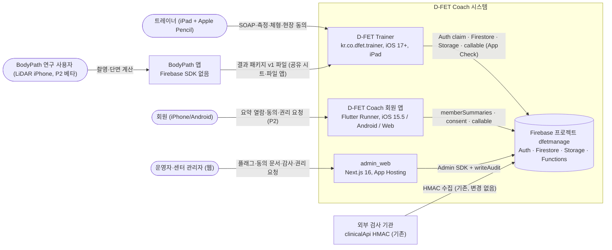

- 네 가지 데이터 흐름 원칙은 PRD §10.1을 그대로 따른다: ① 트레이너 앱은 Firestore·Storage에 직접 쓰고 규칙이 판정, 서버 전용 처리는 Functions ② 회원 앱은 memberSummaries만 ③ admin_web은 Admin SDK와 감사 ④ BodyPath 결과는 트레이너 앱을 거쳐 올라가고 LiDAR 원본은 업로드하지 않는다.
- v1에서 빠지는 외부 요소: LHM++ LAN 복원 서버, Windows CUDA GPU 경로, 오프라인 Gaussian 뷰어(PRD §10.1). v1 런타임은 GPU 협업 환경에 의존하지 않는다.

---

## 4 컨테이너 구성

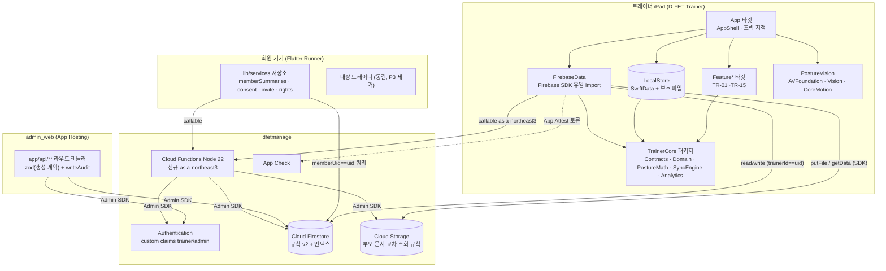

| 컨테이너 | 기술 | 배포 단위 | v1 책임 | 상세 |
|---|---|---|---|---|
| D-FET Trainer | SwiftUI, SwiftData, Swift Charts, PencilKit, Vision, Firebase iOS SDK | TestFlight 내부 그룹(P1a~P2), App Store(P3, Q-DEV-02) | TR-01~TR-15 | §6~§13, [V1-07](07_TRAINER_APP_SPEC.md) |
| 회원 앱 | Flutter(riverpod, go_router, fl_chart 0.69), iOS 15.5 | 스토어 릴리스(member-vX.Y.Z) | MB-01~MB-06, 내장 트레이너 동결 | §14, [V1-08](08_MEMBER_APP_AND_ADMIN_SPEC.md) |
| admin_web | Next.js 16.2.12, React 19.2.8, zod 4.4.3(dfet:admin_web/package.json:19-23) | App Hosting | AD-01~AD-07 | §16 |
| Cloud Functions | Node 22, CommonJS, v2(dfet:firebase.json:30-36) | `firebase deploy --project dfetmanage --only functions:<name>`(소유자 수동. `.firebaserc`가 없으므로 `--project` 필수, [RELEASE_CHECKLIST](templates/RELEASE_CHECKLIST.md)) | 동의·삭제·접근 키·요약·판정 등 | §15, [ADR-017](adr/ADR-017-functions-structure.md) |
| Firestore·Storage 규칙 | rules_version 2 | `firebase deploy --project dfetmanage --only firestore:rules,firestore:indexes,storage` | 권한 판정 | [V1-05](05_DATA_MODEL_AND_RULES.md) |
| BodyPath + BodyPathCore | SwiftUI, SwiftData, iOS 17, iPhone 전용(bodypath:ios/BodyScan/project.yml:4-5, :54) | BodyPath 저장소 태그 `bodypathcore-vX.Y.Z` | 결과 패키지 v1 내보내기(P2) | §18, [ADR-012](adr/ADR-012-bodypath-result-package.md) |

---

## 5 저장소 배치

기술 스파인의 저장소 배치를 따르되, 트레이너 앱 패키지는 **두 개로 나눈다**(ASM-04-01, 근거는 §6.2). 루트 `TEhyeok/DFET_Coach`, 기본 브랜치 `main`.

```
dfet_coach/
├─ trainer_app/                         # [신규] 정본 D-FET Trainer (ADR-001)
│  ├─ project.yml                       # XcodeGen 사양 (§6.3)
│  ├─ .xcodegen-version                 # 생성기 버전 고정 (ASM-04-12)
│  ├─ DFETTrainer.xcodeproj/            # 생성물. 커밋, CI에서 재생성 diff 검증
│  ├─ App/                              # 조립 지점만
│  │  ├─ DFETTrainerApp.swift           # @main, 환경 판정, AppEnvironment 생성
│  │  ├─ AppDelegate.swift              # FirebaseBootstrap.configure 호출
│  │  ├─ AppShell/                      # NavigationSplitView, TrainerRoute, 세션 흐름 전체 화면
│  │  ├─ Composition/                   # AppEnvironmentFactory, LaunchConfiguration
│  │  └─ Resources/ Info.plist, DFETTrainer.entitlements, Assets.xcassets, Localizable.xcstrings
│  ├─ Config/ Debug.xcconfig, Release.xcconfig    # GoogleService-Info.plist는 비추적(ADR-019)
│  ├─ Packages/
│  │  ├─ TrainerCore/                   # 순수 Swift. iOS 17 + macOS 14. `swift test` 대상
│  │  │  ├─ Package.swift
│  │  │  ├─ Sources/TrainerContracts/Generated/   # contracts/*.json 생성물
│  │  │  ├─ Sources/TrainerDomain/      # 엔티티, 코덱, 규칙, 프로토콜
│  │  │  ├─ Sources/PostureMath/        # 자세 산식
│  │  │  ├─ Sources/SyncEngine/         # Outbox 처리기
│  │  │  ├─ Sources/TrainerAnalytics/   # 허용 목록 이벤트, elapsed_band
│  │  │  └─ Tests/<Target>Tests/        # 픽스처는 #filePath로 저장소 루트 contracts/를 직접 읽는다(복사 없음)
│  │  └─ TrainerKit/                    # iOS 17 전용. 시뮬레이터 xcodebuild test 대상
│  │     ├─ Package.swift
│  │     ├─ Sources/LocalStore/  FirebaseData/  PostureVision/  DesignSystem/
│  │     ├─ Sources/FeatureAuth/ FeatureToday/ FeatureMembers/ FeatureSOAP/ FeatureConsent/
│  │     │         FeatureBodyComposition/ FeatureAssessment/ FeatureInsights/ FeatureShare/
│  │     │         FeatureLidarBeta/ FeatureSettings/
│  │     └─ Tests/<Target>Tests/        # 스냅샷은 swift-snapshot-testing(테스트 전용)
│  ├─ IntegrationTests/                 # 시뮬레이터 + Firebase 에뮬레이터
│  ├─ UITests/                          # XCUITest, --preview-*, 접근성 감사
│  └─ README.md
├─ trainer_ios/                         # [동결] 이식 원본. P1a 종료 PR(DF-142)에서 삭제, 태그 archive/trainer_ios-final
├─ ios/Runner/AppDelegate.swift         # [동결] 규제·크래시 수정만(MIG-04, MIG-09)
├─ lib/                                 # Flutter 회원 앱 (§14)
├─ functions/                           # Node 22 CommonJS (§15)
├─ admin_web/                           # Next.js 16 (§16)
├─ contracts/                           # [신규] 교차 클라이언트 단일 원본 (§17)
├─ schemas/                             # JSON Schema (기존 확장)
├─ tool/contracts/ tool/lint/ tool/backlog/
├─ docs/PRD_V1.md, docs/firestore_schema.md, docs/v1/
└─ .github/workflows/ci.yml, trainer-app.yml, trainer-testflight.yml
```

- 이름을 `trainer_app/`으로 한 이유, XcodeGen 생성물 커밋 이유는 [ADR-001](adr/ADR-001-independent-trainer-app.md). XcodeGen 사용 근거: dfet:trainer_ios/project.yml:1-5, dfet:trainer_ios/README.md:18(`xcodegen generate`), BodyPath CI의 생성물 일치 검사(bodypath:.github/workflows/detail-capture.yml:37-47).
- BodyPath 저장소 쪽 배치(P2 준비): 루트 `Package.swift`, `packages/BodyPathCore/Sources/{BodyPathResult, BodyPathCoreUI}`, `packages/BodyPathCore/Tests/`, `docs/RESULT_PACKAGE_V1.md`. 현재 BodyPath 저장소 루트에는 `Package.swift`와 `packages/`가 없다(확인함). §18 참조.

---

## 6 트레이너 앱 계층 구조

### 6.1 계층 모델

과제에서 요구한 계층(App / Features / Domain / Data / Sync / Capture / DesignSystem)을 타깃에 다음과 같이 대응시킨다.

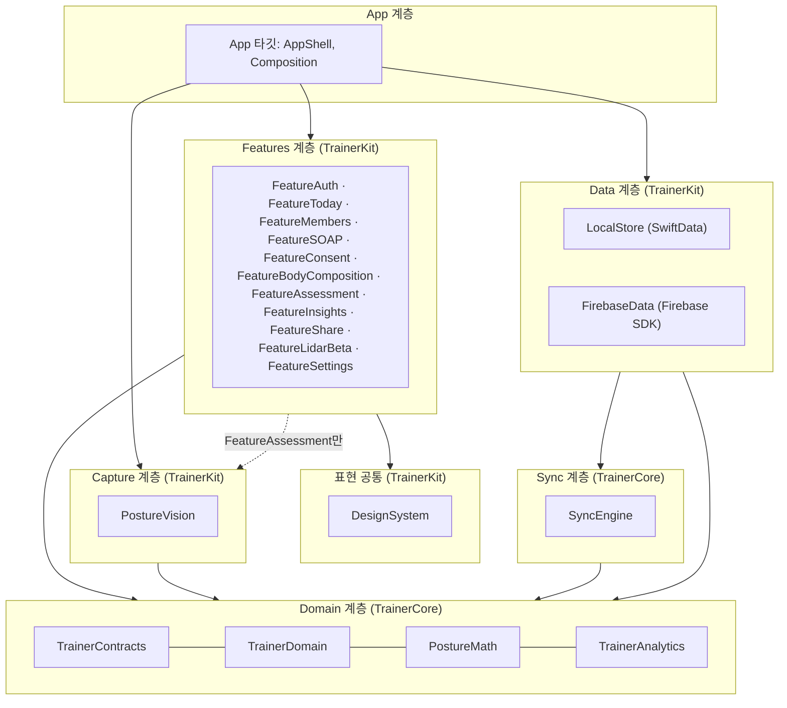

| 계층 | 타깃 | 패키지 | 책임 요약 | 단계 | 금지 |
|---|---|---|---|---|---|
| App | App 타깃(AppShell, Composition) | Xcode 앱 | 라우트 TR-01~TR-15, 의존성 조립, 환경 판정, 플래그로 진입점 숨김(AC-IA-02) | P0 | 비즈니스 규칙, Firebase import(ASM-04-03) |
| Features | Feature* 11개 | TrainerKit | 화면과 뷰 모델(@Observable). Domain 프로토콜로만 데이터 접근 | P0~P2 | Firebase·SwiftData·SyncEngine 직접 참조 |
| DesignSystem | DesignSystem | TrainerKit | 토큰, SyncStateBadge, SourceGradeChip, MetricRow, ChangeBadge, SeriesTrendChart, PencilCanvas, PainScale, BodyMap, EmptyState, 한글 조합 안전 입력 | P0~P1a | 데이터 접근, 판정 |
| Capture | PostureVision | TrainerKit | 카메라 세션, roll·pitch 게이트, Vision 2D 제안, EXIF·GPS 제거, 얼굴 가림 썸네일 | P1b | 저장·업로드(LocalStore·SyncEngine 경유) |
| Domain | TrainerContracts, TrainerDomain, PostureMath, TrainerAnalytics | TrainerCore | 생성 어휘, 엔티티·코덱·검증·확정 요건·seriesBreak, 자세 산식, 이벤트 허용 목록 | P0~P1b | UIKit, SwiftUI, SwiftData, Firebase import |
| Sync | SyncEngine | TrainerCore | Outbox 순서·백오프·재조정·syncState 계산 | P0~P1a | 저장 구현 직접 참조(프로토콜만) |
| Data | LocalStore, FirebaseData | TrainerKit | SwiftData 편집 원본과 Store 구현 / 원격 읽기·쓰기·업로드·callable 구현 | P0~P2 | UI |

각 타깃의 책임과 이식 원본 줄 범위는 기술 스파인 `trainerModules`를 정본으로 하며, 대표 대응은 §6.4에 요약했다.

### 6.2 패키지 두 개로 나누는 이유

- 순수 로직(SOAP v2 코덱, 확정 요건, 자세 산식, Outbox 순서)은 시뮬레이터 없이 macOS `swift test`로 돌려야 에이전트 작업과 CI가 빠르다(ADR-001, ADR-013).
- 2026-09-24 로컬 검증: 한 패키지 안에 `import UIKit` 타깃이 하나라도 있으면 `swift test`는 macOS에서 그 타깃까지 빌드하다 `no such module 'UIKit'`으로 실패했다. `swift build --target <Tests>`로 우회해도 테스트 번들이 만들어지지 않았다(Swift 6.2 툴체인, 합성 프로브 패키지로 확인).
- 따라서 macOS에서도 빌드되는 타깃만 `TrainerCore`에 두고, iOS 전용 타깃은 `TrainerKit`에 둔다. 타깃 이름은 스파인과 같고 **경로만** `Packages/TrainerCore/Sources/<Target>`로 바뀐다(ASM-04-01).

### 6.3 패키지·프로젝트 사양

**`trainer_app/Packages/TrainerCore/Package.swift`**

```swift
// swift-tools-version: 5.10
import PackageDescription

let strict: [SwiftSetting] = [.enableExperimentalFeature("StrictConcurrency")]

let package = Package(
  name: "TrainerCore",
  platforms: [.iOS(.v17), .macOS(.v14)],
  products: [
    .library(name: "TrainerContracts", targets: ["TrainerContracts"]),
    .library(name: "TrainerDomain", targets: ["TrainerDomain"]),
    .library(name: "PostureMath", targets: ["PostureMath"]),
    .library(name: "SyncEngine", targets: ["SyncEngine"]),
    .library(name: "TrainerAnalytics", targets: ["TrainerAnalytics"]),
  ],
  targets: [
    .target(name: "TrainerContracts", swiftSettings: strict),
    .target(name: "TrainerDomain", dependencies: ["TrainerContracts"], swiftSettings: strict),
    .target(name: "PostureMath", dependencies: ["TrainerContracts", "TrainerDomain"], swiftSettings: strict),
    .target(name: "SyncEngine", dependencies: ["TrainerDomain"], swiftSettings: strict),
    .target(name: "TrainerAnalytics", dependencies: ["TrainerContracts"], swiftSettings: strict),
    .testTarget(name: "TrainerContractsTests", dependencies: ["TrainerContracts"]),
    .testTarget(name: "TrainerDomainTests", dependencies: ["TrainerDomain"]),
    .testTarget(name: "PostureMathTests", dependencies: ["PostureMath"]),
    .testTarget(name: "SyncEngineTests", dependencies: ["SyncEngine"]),
    .testTarget(name: "TrainerAnalyticsTests", dependencies: ["TrainerAnalytics"]),
  ],
  swiftLanguageVersions: [.v5]
)
```

- 픽스처·벡터는 테스트가 `URL(fileURLWithPath: #filePath)`로 저장소 루트를 찾아 `contracts/fixtures/`·`contracts/vectors/`를 직접 읽는다. 로더는 `trainer_app/Packages/TrainerCore/Tests/TrainerDomainTests/Support/FixtureLoader.swift`(V1-10 §6.1).

**`trainer_app/Packages/TrainerKit/Package.swift`(요지)**

```swift
// swift-tools-version: 5.10
import PackageDescription

let core: [Target.Dependency] = [
  .product(name: "TrainerContracts", package: "TrainerCore"),
  .product(name: "TrainerDomain", package: "TrainerCore"),
]
let featureDeps: [Target.Dependency] = core + [
  "DesignSystem", .product(name: "TrainerAnalytics", package: "TrainerCore"),
]

let package = Package(
  name: "TrainerKit",
  platforms: [.iOS(.v17)],
  products: [ /* LocalStore, FirebaseData, PostureVision, DesignSystem, Feature* 각각 .library */ ],
  dependencies: [
    .package(path: "../TrainerCore"),
    .package(url: "https://github.com/firebase/firebase-ios-sdk", from: "11.0.0"),       // ASM-04-11
    .package(url: "https://github.com/pointfreeco/swift-snapshot-testing", from: "1.17.0"), // 테스트 전용
  ],
  targets: [
    .target(name: "LocalStore", dependencies: core + [.product(name: "SyncEngine", package: "TrainerCore")]),
    .target(name: "FirebaseData", dependencies: core + [
      .product(name: "SyncEngine", package: "TrainerCore"),
      .product(name: "FirebaseAuth", package: "firebase-ios-sdk"),
      .product(name: "FirebaseFirestore", package: "firebase-ios-sdk"),
      .product(name: "FirebaseStorage", package: "firebase-ios-sdk"),
      .product(name: "FirebaseFunctions", package: "firebase-ios-sdk"),
      .product(name: "FirebaseAppCheck", package: "firebase-ios-sdk"),
      // FirebaseAnalytics는 G-09 전 링크하지 않는다(ADR-015, ASM-04-11)
    ]),
    .target(name: "PostureVision", dependencies: core + [.product(name: "PostureMath", package: "TrainerCore")]),
    .target(name: "DesignSystem", dependencies: core),
    .target(name: "FeatureAuth", dependencies: featureDeps),
    .target(name: "FeatureToday", dependencies: featureDeps),
    .target(name: "FeatureMembers", dependencies: featureDeps),
    .target(name: "FeatureSOAP", dependencies: featureDeps),
    .target(name: "FeatureConsent", dependencies: featureDeps),
    .target(name: "FeatureBodyComposition", dependencies: featureDeps),
    .target(name: "FeatureAssessment", dependencies: featureDeps + [
      "PostureVision", .product(name: "PostureMath", package: "TrainerCore")]),
    .target(name: "FeatureInsights", dependencies: featureDeps + [.product(name: "PostureMath", package: "TrainerCore")]),
    .target(name: "FeatureShare", dependencies: featureDeps),
    .target(name: "FeatureLidarBeta", dependencies: featureDeps),   // P2에 BodyPathResult·BodyPathCoreUI 추가
    .target(name: "FeatureSettings", dependencies: featureDeps),
    // .testTarget(...) 타깃별. 스냅샷 테스트만 SnapshotTesting 의존
  ],
  swiftLanguageVersions: [.v5]
)
```

**`trainer_app/project.yml`(요지)**

```yaml
name: DFETTrainer
options:
  minimumXcodeGenVersion: 2.40.0
  deploymentTarget: { iOS: "17.0" }
  createIntermediateGroups: true
settings:
  base:
    SWIFT_VERSION: "5.0"
    DEVELOPMENT_TEAM: MT27Z7369H
    MARKETING_VERSION: 0.1.0          # 0.1(P0) → 0.2(P1a) → 0.3(P1b) → 0.4(P2) → 1.0(P3), ADR-014
    CURRENT_PROJECT_VERSION: 1        # CI는 github.run_number로 덮어씀(trainer-testflight)
packages:
  TrainerCore: { path: Packages/TrainerCore }
  TrainerKit:  { path: Packages/TrainerKit }
targets:
  DFETTrainer:
    type: application
    platform: iOS
    configFiles: { Debug: Config/Debug.xcconfig, Release: Config/Release.xcconfig }
    sources:
      - path: App            # GoogleService-Info.plist는 소스로 참조하지 않는다(비추적, ADR-019, ASM-04-21)
    dependencies:
      - package: TrainerKit     # 모든 Feature*, LocalStore, FirebaseData, PostureVision, DesignSystem
      - package: TrainerCore
    postBuildScripts:
      - name: Copy Firebase config if present   # plist가 없으면 preview 전용 빌드(ADR-019)
        basedOnDependencyAnalysis: false
        script: |
          [ -f "$SRCROOT/Config/GoogleService-Info.plist" ] && cp "$SRCROOT/Config/GoogleService-Info.plist" "$TARGET_BUILD_DIR/$UNLOCALIZED_RESOURCES_FOLDER_PATH/" || true
    settings:
      base:
        PRODUCT_BUNDLE_IDENTIFIER: kr.co.dfet.trainer   # 재사용(dfet:trainer_ios/project.yml:34)
        PRODUCT_NAME: D-FET Trainer
        TARGETED_DEVICE_FAMILY: "2"                     # Q-22가 Universal이면 "1,2"(DF-904)
        INFOPLIST_FILE: App/Resources/Info.plist
        CODE_SIGN_ENTITLEMENTS: App/Resources/DFETTrainer.entitlements
        OTHER_LDFLAGS: ["$(inherited)", "-ObjC"]        # Firebase SPM 권장 설정
        ENABLE_USER_SCRIPT_SANDBOXING: NO               # 위 스크립트가 선언하지 않은 파일을 읽는다. 값은 출력하지 않는다(P0 DF-008, ASM-S01-12)
  DFETTrainerIntegrationTests:
    type: bundle.unit-test
    platform: iOS
    sources: [IntegrationTests]
    dependencies: [{ target: DFETTrainer }]
  DFETTrainerUITests:
    type: bundle.ui-testing
    platform: iOS
    sources: [UITests]
    dependencies: [{ target: DFETTrainer }]
schemes:
  DFETTrainer:
    build: { targets: { DFETTrainer: all } }
    test: { targets: [DFETTrainerIntegrationTests, DFETTrainerUITests] }
```

- 현재 trainer_ios는 iOS 16.0, `TARGETED_DEVICE_FAMILY "1,2"`, 위젯 확장을 포함한다(dfet:trainer_ios/project.yml:5, :22-23, :39). 새 앱은 iOS 17.0, iPad 전용(기본), 위젯 없음(AS-DEV-05)이다.
- 엔타이틀먼트: `com.apple.developer.default-data-protection = NSFileProtectionComplete`(ASM-04-04), `com.apple.developer.devicecheck.appattest-environment`(Debug development, Release production). App Group은 넣지 않는다. 현재 trainer_ios의 `group.kr.co.dfet.trainer`(dfet:trainer_ios/DFETTrainer/DFETTrainer.entitlements:5-7)는 위젯 전용이었으므로 v1에서 제거한다(NFR-14, ASM-04-04).
- Info.plist: 4방향(`UISupportedInterfaceOrientations~ipad` 4종), `UIRequiresFullScreen=false`(NFR-12 멀티태스킹), `NSCameraUsageDescription`(P1b). 카메라 롤에 저장하지 않으므로 `NSPhotoLibraryAddUsageDescription`은 넣지 않는다(F-ASM-01.10).

### 6.4 이식 대응 요약

기술 스파인 `trainerModules.portedFrom`이 정본이다. 에이전트가 원본을 열 때의 진입점만 요약한다(보관 브랜치 tip 기준으로 줄 번호가 바뀌면 DF-039 이식표를 따른다).

| 대상 타깃 | 가져올 원본(확인한 시작 줄) | 가져오지 않을 반례(확인함) |
|---|---|---|
| AppShell | `NativeTrainerRoute` dfet:ios/Runner/AppDelegate.swift:7876-7885, `NativeTrainerHomeView` :371, NavigationSplitView 골격 dfet:trainer_ios/DFETTrainer/App/TrainerRootView.swift | schedule·program·alerts 라우트(:7880, :7882, :7884; AS-21) |
| FeatureAuth·FirebaseData | claim 로그인 dfet:trainer_ios/DFETTrainer/Features/Login/LoginView.swift:226-249, memberIds → users 10개 청크 dfet:trainer_ios/DFETTrainer/Data/FirebaseTrainerRepository.swift:158-220, App Check dfet:trainer_ios/DFETTrainer/App/DFETTrainerApp.swift:43-53 | `isSharedWithMember: true`(FirebaseTrainerRepository.swift:94), createdAt 덮어쓰기(:95), print만 하는 오류(:104, :163, :183, :215), 알 수 없는 metric 버림(:263-266) |
| TrainerDomain | 저장소 경계 개념 dfet:trainer_ios/DFETTrainer/Domain/TrainerRepository.swift:4-15(동기 → async 재정의) | 한글 rawValue(SoapModels.swift:4-8), 데모 문장 교체(TrainerStore.swift:263-266) |
| FeatureSOAP·DesignSystem | `NativeSoapWorkspaceView` :8325, `NativeTrainerSoapDetail` :3529, Pencil :5765, NRS :5126, 바디맵 :5203, 한글 입력 :3130·:3219 | `syncPayload` :3835-3860 전체(:3838 `native_` ID, :3839 로컬 UUID, :3844 diagnosis, :3858 base64), UserDefaults 초안 :3368-3528 |
| FeatureMembers | `NativeTrainerMembersDetail` :2040, 잔디 뷰 :6883(P2) | `NativeTrainerMember` :7923, `member-UUID` :8117 |
| FeatureSettings | `NativeTrainerSettingsDetail` :5049 | Firebase signOut 미호출 dfet:trainer_ios/DFETTrainer/Domain/TrainerStore.swift:160-165 |
| AppShell 저장소 기본값 | — | `init(repository: TrainerRepository = PreviewTrainerRepository())` TrainerStore.swift:37 |
| DesignSystem 차트 | 축 분리 패턴 dfet:trainer_ios/DFETTrainer/DesignSystem/ChartsAndPencil.swift:28 이하 | 하드코딩 x축 :20-26 |
| (전체) | — | tapback.co 아바타 dfet:trainer_ios/DFETTrainer/Domain/TrainerMember.swift:43-49, MethodChannel 저장 dfet:ios/Runner/AppDelegate.swift:164-197 |

---

## 7 모듈 의존 규칙

### 7.1 허용 의존 행렬

행이 열을 import할 수 있으면 ●. 빈칸은 금지. 이 행렬이 `Package.swift`의 `dependencies`와 같아야 한다.

| from \ to | Contracts | Domain | PostureMath | Analytics | SyncEngine | LocalStore | FirebaseData | PostureVision | DesignSystem | Feature* | Firebase SDK | SwiftData | UIKit/SwiftUI |
|---|---|---|---|---|---|---|---|---|---|---|---|---|---|
| TrainerContracts | | | | | | | | | | | | | |
| TrainerDomain | ● | | | | | | | | | | | | |
| PostureMath | ● | ● | | | | | | | | | | | |
| TrainerAnalytics | ● | | | | | | | | | | | | |
| SyncEngine | | ● | | | | | | | | | | | |
| LocalStore | ● | ● | | | ● | | | | | | | ● | |
| FirebaseData | ● | ● | | ● | ● | | | | | | ● | | |
| PostureVision | ● | ● | ● | | | | | | | | | | ● |
| DesignSystem | ● | ● | | | | | | | | | | | ● |
| Feature*(공통) | ● | ● | | ● | | | | | ● | | | | ● |
| FeatureAssessment 추가 | | | ● | | | | | ● | | | | | |
| FeatureInsights 추가 | | | ● | | | | | | | | | | |
| FeatureLidarBeta 추가(P2) | BodyPathResult, BodyPathCoreUI | | | | | | | | | | | | |
| App 타깃 | ● | ● | | ● | ● | ● | ● | ● | ● | ● | | | ● |

규칙
1. **Feature 사이 import 금지.** 화면 간 이동은 App의 `TrainerRoute`로만 한다. 공유가 필요한 뷰는 DesignSystem으로 올린다.
2. **Firebase import는 FirebaseData 한 곳.** App 타깃도 Firebase를 import하지 않고 `FirebaseBootstrap.configure(_:)`(FirebaseData 공개 API)를 호출한다(ASM-04-03). PRD NFR-03의 수용 기준(Feature에 `import FirebaseFirestore`·`FirebaseStorage` 0건)보다 강하다.
3. **SyncEngine은 저장 구현을 모른다.** `OutboxStore`, `RemoteWriter`, `BinaryUploader`, `CallableClient`, `ConsentGate`, `NetworkMonitor` 프로토콜(TrainerDomain)만 쓴다. SwiftData 구현은 LocalStore, 원격 구현은 FirebaseData가 제공한다(ASM-04-02).
4. **판정 금지.** 어떤 트레이너 앱 타깃에도 MDC 상수·`judge()`·changeStatus 계산이 없다(ADR-009). `seriesBreak`(conditionKey 비교)는 표시 규칙이라 TrainerDomain에 둔다.
5. **Preview 저장소는 DEBUG 전용.** `Preview*` 구현은 App 타깃의 `#if DEBUG` 블록 안 `Composition/Preview/`에만 둔다(NFR-03, 반례 dfet:trainer_ios/DFETTrainer/Domain/TrainerStore.swift:37).

### 7.2 의존 그래프

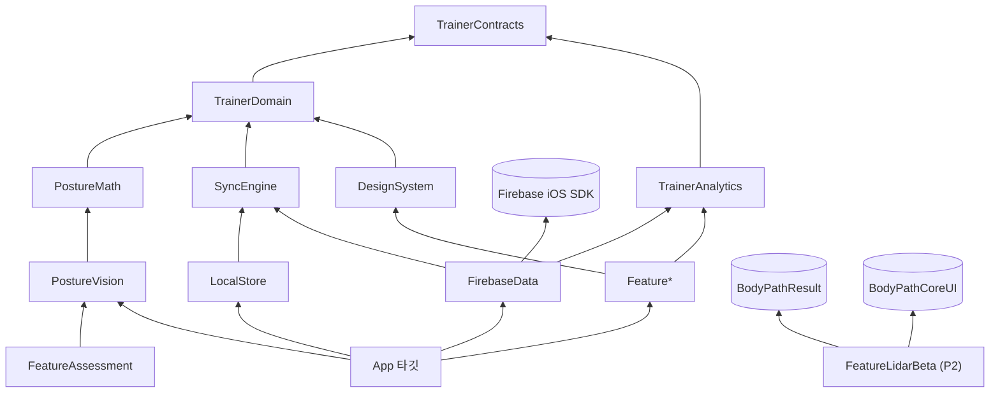

### 7.3 강제 수단

| 규칙 | 1차 강제 | 2차 강제 | 스토리 |
|---|---|---|---|
| 타깃 의존 방향 | SPM `dependencies`(미선언 import는 컴파일 오류) | PR 템플릿 '의존 변경' 체크 | DF-008 |
| Firebase import 위치 | 컴파일(Feature에 Firebase 제품 미링크) | `tool/lint/static-guards.sh`: `trainer_app/` 안 `import Firebase` 매치가 `Packages/TrainerKit/Sources/FirebaseData/` 밖이면 실패 | DF-011 |
| `getDownloadURL` 금지 | static-guards 전 저장소 | S-01~S-08 | DF-011, DF-023 |
| 반례 패턴 0건 | static-guards: `"member-" +`/`member-\(UUID`, `native_`, `inkDataBase64`, `nativeInkDataBase64`, `drawingData`, `isSharedWithMember: true`, `tapback.co`, FirebaseData의 `print(` | 코드 리뷰 | DF-011 |
| 판정 로직 부재 | static-guards: `mdcValue`, `judge(`, `meaningfulImprovement` 대입이 `trainer_app/`·`lib/`에 없음(표시용 enum 참조는 허용) | T01~T25는 functions만 | DF-216, DF-380 |

---

## 8 조립 지점과 의존성 주입

### 8.1 환경 판정

```swift
// App/Composition/LaunchConfiguration.swift
enum LaunchMode: Equatable {
  case production                         // Release 기본. dfetmanage
  case emulator(host: String)             // DEBUG + --use-emulator
  case preview(scenario: String)          // DEBUG + --preview-<scenario>. Firebase 미구성
  case misconfigured(reason: String)      // Release인데 plist 없음 → 차단 화면(Preview로 떨어지지 않음)
}
struct LaunchConfiguration {
  let mode: LaunchMode
  static func resolve(arguments: [String], bundle: Bundle) -> LaunchConfiguration
}
```

- Release 빌드는 `--preview-*`와 `--use-emulator`를 무시한다(`#if DEBUG` 밖에서 파싱하지 않음).
- `--preview-*` 규칙은 기존 앱과 같다: 인자가 있으면 Firebase 구성을 건너뛴다(dfet:trainer_ios/DFETTrainer/App/DFETTrainerApp.swift:34-36, :43).

### 8.2 AppEnvironment

```swift
// App/Composition/AppEnvironment.swift
@MainActor
struct AppEnvironment {
  let auth: AuthService                 // FeatureAuth, FeatureSettings
  let members: MemberDirectory          // TR-02, TR-03, TR-14
  let records: RecordReader             // TR-03 타임라인, TR-10 추이 (원격 + 로컬 병합)
  let soap: SoapNoteStore               // TR-04, TR-05
  let measurements: MeasurementStore    // TR-11, TR-12
  let assessments: AssessmentStore      // TR-07~TR-09 (P1b)
  let consent: ConsentService           // TR-14
  let flags: FeatureFlagReader          // appConfig/features
  let policies: PolicyReader            // bodyChange 활성 정책 (P3 전 nil)
  let sync: SyncStatusProvider          // 전역 '동기화 대기 n건', 항목별 syncState
  let analytics: AnalyticsClient        // DebugSink(G-09 전)
  let today: TodayListStore             // TR-01 로컬 목록
  let settings: LocalSettingsStore      // 스테이션 프로필, 빠른 문구, 필터
}

enum AppEnvironmentFactory {
  static func make(_ launch: LaunchConfiguration) throws -> AppEnvironment
  // production/emulator: FirebaseBootstrap → FirebaseData 구현 + LocalStore 구현 + SyncEngine 시작
  // preview: Composition/Preview/ 인메모리 구현 + 합성 시나리오 (DEBUG만)
}
```

- 프로토콜 전체 시그니처는 [V1-06](06_API_SPEC.md)이 정본이다. 스파인 `clientContracts`의 이름(AuthService, MemberDirectory, SoapNoteStore, MeasurementStore, AssessmentStore, ConsentService, FeatureFlags·PolicyReader, AnalyticsClient)을 그대로 쓰고, 이 문서가 더한 것은 `RecordReader`, `SyncStatusProvider`, `TodayListStore`, `LocalSettingsStore`, `OutboxStore`, `ConsentGate`, `NetworkMonitor`다(모두 TrainerDomain 프로토콜).
- 구현 위치
  - `SoapNoteStore`, `MeasurementStore`, `AssessmentStore`, `ConsentService`(쓰기), `TodayListStore`, `LocalSettingsStore`, `OutboxStore`: **LocalStore**(SwiftData 저장 → `SyncEngine.enqueue`).
  - `AuthService`, `MemberDirectory`, `RecordReader`(원격 부분), `FeatureFlagReader`, `PolicyReader`, `RemoteWriter`, `BinaryUploader`, `CallableClient`, `NetworkMonitor`: **FirebaseData**.
  - 로컬 미동기 항목과 원격 목록 병합은 TrainerDomain의 순수 함수 `TimelineMerger.merge(local:remote:)`로 하고, 조립은 App이 `CompositeRecordReader`로 한다.

### 8.3 상태 관리 패턴

- 뷰 모델은 `@Observable final class`(iOS 17)이며 이니셜라이저 주입만 쓴다. 신규 코드에 Combine과 `ObservableObject` 단일 스토어(반례 dfet:trainer_ios/DFETTrainer/Domain/TrainerStore.swift, `@MainActor final class TrainerStore: ObservableObject`)를 쓰지 않는다.
- 원격 구독은 `AsyncThrowingStream`, 쓰기는 `async throws`. 오류는 삼키지 않고 뷰 모델의 `loadState: .failed(UserFacingError)`로 올려 '불러오기 실패, 다시 시도'를 보인다(§9.6 쿼리 오류 원칙).
- 라우트: `enum TrainerRoute: Hashable { case today, members, member(MemberKey), live(NoteID), review(NoteID), share(ShareTarget) /*P2*/, capture(AssessmentID), landmarks(AssessmentID), result(AssessmentID), compare(MemberKey), bodyComposition(MemberKey), circumference(MemberKey), lidar(MemberKey) /*P2*/, consent(MemberKey?), settings }`. 각 case의 문서 주석에 TR ID를 적는다(`/// TR-04`). 플래그가 false인 진입점은 라우트 생성 전에 숨긴다(AC-IA-02).

---

## 9 로컬 우선 저장 SwiftData

필드 단위 정본은 [V1-05 §12](05_DATA_MODEL_AND_RULES.md#12-트레이너-앱-로컬-swiftdata-스키마)다. 여기서는 엔티티 책임, 파일 배치, 보호, 수명만 정한다([ADR-002](adr/ADR-002-local-first-swiftdata-outbox.md)).

### 9.1 엔티티 책임

| @Model | 책임 | 서버 투영 | 주요 상태 |
|---|---|---|---|
| `LocalSoapDraft` | Live·Review 편집 원본(quickNote, NRS, painRegions, S/O/A/P, memberNote, 필기 파일 참조, inkRevision) | `soap_notes/{noteId}` | `draft` → `pendingFinalize`(확정 대기) → `finalized` |
| `LocalMeasurementDraft` | 신체조성 1회분, 줄자 행(trialIndex별) | `bodyCompositionRecords`, `circumferenceMeasurements` | `active`/`voided` |
| `LocalAssessmentDraft` | 체형 세션(views, landmarks, metrics, captureConditions, 사진 파일 참조) | `postureAssessments` | `draft`/`confirmed`/`voided` |
| `LocalPendingMemberDraft` | 오프라인 대기 회원 최소 등록 | `pendingMembers` | Outbox 0단계(ASM-04-05) |
| `LocalConsentCapture` | 현장 동의 선택, 문서 버전, 서명 PNG 참조 | callable `recordConsent` | `captureState`: `pending`/`confirmed`/`failed` |
| `OutboxItem`(@Model) | 서버 반영 작업 1건(§10.2) | — | `queued`/`inFlight`/`acked`/`failed`/`blocked`(`blockedReason = awaitingConsent`) |
| `LocalBinary` | 로컬 바이너리 메타(relativePath, contentType, byteSize, sha256, md5Base64, remotePath, uploadedAt, verifiedAt, purgeAfter) | Storage 객체 | 업로드 전/후 |
| `TodayListEntry` | TR-01 로컬 '오늘' 목록(memberKey, dayKey, order, addedAt, carriedOverFromDayKey) | 없음(서버 예약 엔터티 없음, AS-21) | 다음 날 이월 |
| `StationProfile`, `QuickPhrase`, `FilterPreference` | 설정성 로컬 데이터 | 없음 | — |

엔티티·속성·허용 값의 정본은 [V1-05 §12.2](05_DATA_MODEL_AND_RULES.md)다. 이 표는 책임 요약이다(ASM-04-22).

- 문서 ID는 저장 시점에 TrainerDomain `DocumentID.make()`가 만든다(Firestore 자동 ID와 같은 20자 `[A-Za-z0-9]`). 오프라인에서도 확정되고 재시도가 멱등이다(§10.2 규칙). 밑줄이 없으므로 `native_` 접두가 생길 수 없다(R-24).
- 회원 키는 `MemberKey`(`.uid(String)` | `.pending(String)`)이며 저장 시 `"uid:<id>"`/`"pending:<id>"` 문자열로 직렬화한다. 로컬 UUID 회원 키는 없다(ADR-003).
- 도메인 ↔ Firestore 필드 변환 값 타입은 `JSONValue`(TrainerDomain)다: `null, bool, int(Int64), double, string, timestamp(Date), serverTimestamp, array, object`. FirebaseData만 이를 `Timestamp`·`FieldValue.serverTimestamp()`로 바꾼다.

### 9.2 파일 배치와 보호

```
Application Support/TrainerKit/<trainerKey>/        # trainerKey = SHA-256(uid) 앞 16 hex (uid 원문을 경로에 쓰지 않음, NFR-10)
├─ LocalStore.store (+ -wal, -shm)
├─ Binaries/
│  ├─ ink/<noteId>/<inkRevision>.drawing | .png
│  ├─ posture/<assessmentId>/<view>.jpg | <view>_thumb.jpg | <view>_masked_thumb.jpg
│  ├─ bodycomp/<recordId>/report.jpg
│  └─ signatures/<captureId>.png
└─ Quarantine/                                       # 열 수 없는 저장소 격리 (9.3)
Caches/TrainerKit/<trainerKey>/Downloads/<sha256(storagePath)>   # SDK 바이트 다운로드 캐시
```

- 보호: 앱 기본 데이터 보호 `NSFileProtectionComplete`(엔타이틀먼트, ASM-04-04)에 더해 LocalStore가 디렉터리 생성 시 `FileProtectionType.complete`를 명시하고 `URLResourceValues.isExcludedFromBackup = true`를 설정한다. 두 속성은 생성 코드 단위 테스트로 확인한다(NFR-17 수용 기준).
- 결과: 기기가 잠겨 있으면 SwiftData와 Firestore 캐시를 열 수 없다. SyncEngine은 포그라운드에서만 돌고 `UIApplication.protectedDataWillBecomeUnavailableNotification`에서 멈춘다(ASM-04-04).
- 기기 암호가 없으면 파일 보호가 무의미하므로 `LAContext().canEvaluatePolicy(.deviceOwnerAuthentication, error:)`가 false이면 TR-15와 로그인 화면에 경고 배너를 띄운다(차단은 하지 않음, ASM-04-17).
- 다운로드 캐시는 LRU 500MB 상한(ASM-04-13), 같은 보호·백업 제외 속성.

### 9.3 스키마 버전과 열기 실패

- `enum LocalSchemaV1: VersionedSchema`와 `LocalStoreMigrationPlan: SchemaMigrationPlan`을 P0부터 둔다. 필드를 바꾸는 PR은 새 `VersionedSchema`와 이관 단계를 함께 추가한다.
- 저장소를 열지 못해도 `fatalError`로 종료하지 않는다(반례 bodypath:ios/BodyScan/BodyScan/App/BodyScanApp.swift:32-33). 파일을 `Quarantine/<timestamp>/`로 옮기고(삭제하지 않음) 복구 안내 화면을 띄우며 `save_failure_shown(entity_type: localStore)`를 기록한다. 격리본은 소유자 지원 절차로만 복구한다.

### 9.4 로컬 보존과 파기

`LocalRetentionJob`이 포그라운드 진입마다 실행한다.

| 대상 | 조건 | 처리 | 근거 |
|---|---|---|---|
| 업로드 확인된 바이너리 원본 | `uploadedAt + 7일 < now` | 파일 삭제, `LocalBinary` 메타 유지(필요 시 SDK 재다운로드) | NFR-17 |
| `awaitingConsent` draft | 캡처 후 7일 동안 동의 미확인 | draft·바이너리·Outbox 항목 파기, 트레이너에게 알림 | AS-32, F-PRIV-03.7 |
| 동의 ③ 철회 회원 | `memberConsentStates.bodyImaging.granted == false` 관측 | 다음 동기화 때 해당 회원의 로컬 사진·썸네일 삭제 | NFR-17 |
| 로그아웃 | 사용자 확인 후 | 파티션 `<trainerKey>/` 전체와 다운로드 캐시 삭제 | NFR-08, ASM-04-14 |

---

## 10 동기화 엔진과 Outbox

### 10.1 원칙

- 모든 서버 반영은 `OutboxItem`으로 먼저 로컬에 기록한다. 화면은 Outbox 결과를 기다리지 않는다(NFR-15 업로드 비차단).
- **회원 단위 순서 보장**(NFR-05): ⓪ 회원 키 생성(대기 회원 create, ASM-04-05) → ① 현장 동의(`recordConsent`) → ② 부모 문서 create/update(서버 커밋 확인) → ③ Storage 업로드(크기·해시 대조) → ④ 문서에 경로 기록 → ⑤ 확정 전환.
- 동의가 서버에서 확인되기 전 그 회원의 ②~⑤는 `blocked(awaitingConsent)`로 멈춘다. 동의 항목이 실패하면 그 회원의 기록 업로드는 시작하지 않는다.
- SDK 오프라인 큐에 쓰기를 쌓지 않는다. SyncEngine은 `NetworkMonitor.isReachable == true`일 때만 원격 호출을 보내고, 문서 하나에 동시에 한 건만 전송 중이게 한다(ASM-04-19).

### 10.2 OutboxItem

```swift
// TrainerDomain/Sync/OutboxItem.swift
public struct OutboxItem: Sendable, Codable, Identifiable, Equatable {
  public let id: UUID
  public let requestId: UUID   // 서버 멱등 키. 생성 시 id와 같고, 동의 항목은 LocalConsentCapture.captureId(V1-05 §12.2)
  public let memberKey: MemberKey
  public let entityRef: LocalEntityRef      // syncState를 모으는 로컬 항목 키(V1-05 §12.2)
  public let sequence: Int64                // 회원 단위 단조 증가
  public let stage: OutboxStage             // 0 memberKey, 1 consent, 2 document, 3 upload, 4 pathRecord, 5 finalize
  public let kind: OutboxKind
  public let target: RemoteTarget           // collection + documentId, 또는 storagePath, 또는 callable 이름
  public var payload: [String: JSONValue]   // create·update 필드(서버 시각은 .serverTimestamp)
  public var binary: LocalBinaryRef?        // upload 전용
  public var dependsOn: [UUID]
  public var attempts: Int
  public var nextAttemptAt: Date
  public var state: OutboxItemState         // .queued, .inFlight, .acked, .failed(SyncFailure), .blocked(.awaitingConsent)
  public let createdAt: Date
}
public enum OutboxKind: String, Codable, Sendable {
  case createDocument, updateDocument, deleteDocument, uploadBinary, deleteBinary, recordBinaryPath, finalize, callConsent, callFunction
}
```

규칙
1. **create와 update를 나눈다.** create는 새 문서 `setData(fields)`(merge 없음), update는 `updateData(changedFields)`. 전체 `set` 덮어쓰기와 `setData(merge:true)`를 쓰지 않는다(PRD §9.3 문서 ID 규칙, 반례 dfet:trainer_ios/DFETTrainer/Data/FirebaseTrainerRepository.swift:99-101).
2. **create 페이로드**에 `createdAt`, `updatedAt` = `.serverTimestamp`를 넣는다. update 페이로드에는 `updatedAt`만 넣고 `createdAt`은 절대 넣지 않는다(NFR-07).
3. **합치기(coalescing).** 아직 `queued`인 같은 문서의 update는 하나로 합친다(키별 최신값). `inFlight` 중인 항목은 건드리지 않고 다음 update를 새로 만든다.
4. **확정(finalize)** 항목은 `{status: 'finalized', finalizedAt: .serverTimestamp, updatedAt: .serverTimestamp}`만 보내며, 같은 노트의 앞선 ②~④가 모두 `acked`여야 시작한다.
5. **callable**은 멱등 키를 페이로드에 넣는다: 일반 callable은 `requestId = OutboxItem.requestId`, `recordConsent`는 `clientCaptureId = LocalConsentCapture.captureId`(= `OutboxItem.requestId`, V1-06 §3.7). 서버가 같은 키를 두 번 받으면 첫 결과를 돌려준다([V1-06](06_API_SPEC.md) 계약).

### 10.3 순서도

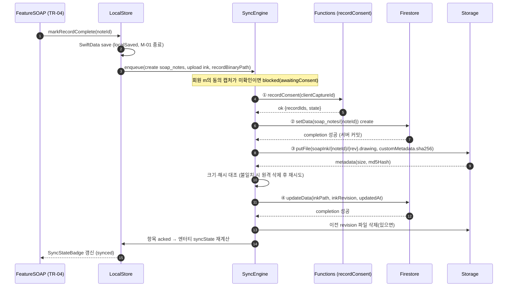

### 10.4 재시도와 오류 분류

| 분류 | 예 | 처리 |
|---|---|---|
| 일시 오류 | `unavailable`, `deadline-exceeded`, 네트워크 끊김, Storage `retryLimitExceeded` | 지수 백오프: 2초 × 2^n, 최대 5분, ±20% 지터. **연속 5회 실패**면 엔터티를 `syncFailed`로 표시하되 최대 간격으로 자동 재시도를 계속한다(ASM-04-06) |
| 영구 오류 | `permission-denied`, `invalid-argument`, `failed-precondition`, `not-found`(부모 없음) | 먼저 **재조정**(10.5). 재조정으로 해소되지 않으면 즉시 `syncFailed`, 자동 재시도 없음. 사유와 '다시 시도' 버튼 표시. 로컬 원본은 지우지 않는다(NFR-06) |
| 로컬 오류 | 파일 없음, 디스크 부족 | `syncFailed(localIO)`, 트레이너에게 안내 |

- 전역 동기화 대기 건수(`pendingCount()`)는 `acked`가 아닌 항목을 가진 엔터티 수다(M-G3). TR-01과 TR-15 상단에 항상 보인다.
- 모든 실패 표시는 분석 이벤트 `save_failure_shown(entity_type, retry_result)` 하나로만 남긴다(§5.5).

### 10.5 멱등과 재조정

Firestore iOS SDK의 쓰기 completion은 서버가 커밋했을 때 성공으로 호출된다. 앱이 전송 중에 종료되면 결과를 모르는 `inFlight` 항목이 남는다(ASM-04-19).

1. 앱 시작 시 `inFlight` 항목이 있으면 `Firestore.waitForPendingWrites()`(30초 상한)를 기다린 뒤 대상 문서를 `getDocument(source: .server)`로 읽는다.
2. create: 문서가 있으면 `acked`(자동 ID는 이 기기만 알므로 다른 작성자가 없다). 없으면 다시 보낸다.
3. update: 서버 값이 페이로드와 같으면 `acked`, 다르면 다시 보낸다(같은 값 재전송은 규칙상 무해).
4. finalize: 서버 `status == 'finalized'`면 `acked`. 규칙이 finalized 문서 수정을 거부하므로(R-08) 재전송 거부를 오류로 보지 않는다.
5. upload: `getMetadata`로 크기·해시가 맞으면 `acked`, 아니면 다시 올린다(경로가 revision 단위라 덮어써도 멱등).
6. `permission-denied`를 받으면 1~5와 같은 재조정을 한 번 한 뒤에만 `syncFailed`로 넘긴다.

### 10.6 동시성

- `SyncEngine`은 `actor`다. 회원 단위 직렬, 회원 간 최대 2개 병렬(ASM-04-18).
- 트리거: 앱 포그라운드 진입, `NetworkMonitor` 복구, enqueue, 수동 '다시 시도', 1분 주기 틱(포그라운드 동안). 백그라운드 작업(BGTask)은 v1에서 쓰지 않는다(ASM-04-04).

### 10.7 Firestore 퍼시스턴스 설정

NFR-04 수용 기준에 따라 기본값에 의존하지 않고 코드로 지정한다(ASM-04-13).

```swift
// FirebaseData/FirebaseBootstrap.swift
public enum FirebaseBootstrap {
  public static func configure(_ env: FirebaseEnvironment) {
    #if DEBUG
    AppCheck.setAppCheckProviderFactory(AppCheckDebugProviderFactory())
    #else
    AppCheck.setAppCheckProviderFactory(AppAttestProviderFactory())
    #endif
    FirebaseApp.configure()
    let settings = FirestoreSettings()
    settings.cacheSettings = PersistentCacheSettings(sizeBytes: NSNumber(value: 100 * 1024 * 1024))
    if case let .emulator(host) = env {
      settings.host = "\(host):18080"; settings.isSSLEnabled = false
      Auth.auth().useEmulator(withHost: host, port: 19099)
      Storage.storage().useEmulator(withHost: host, port: 19199)
      Functions.functions(region: "asia-northeast3").useEmulator(withHost: host, port: 5001)
    }
    Firestore.firestore().settings = settings
  }
}
```

- 포트 18080·19199는 dfet:firebase.json:37-45와 같다. Auth·Functions 에뮬레이터 포트는 firebase.json에 아직 없으므로 DF-107에서 추가한다(ASM-04-09).
- 캐시는 읽기 가속(콜드 스타트 NFR-15)용이며 편집 원본이 아니다. 규칙이 거부한 대기 쓰기는 캐시에서 되돌려지지만 SwiftData 원본은 남는다(PRD §9.6).

### 10.8 오프라인 시나리오

| 시나리오 | 기대 동작 | 검증 |
|---|---|---|
| 비행기 모드에서 Live 한 줄·필기 → 강제 종료 → 재실행 | draft 그대로, 배지 '기기에 저장됨' | NFR-04, DF-140 |
| 복구 | 동의 → 문서 → 필기 → 경로 순서로 한 번만 반영, '동기화됨' | NFR-05, DF-107 |
| 오프라인 확정 | 노트 라벨 '확정 대기' + 로컬 잠금. 복구 시 finalize 항목 전송, `finalizedAt` = 서버 시각 | F-SOAP-04.2, DF-122 |
| 확정 대기 중 규칙 거부 | `syncFailed`, 잠금 해제(편집 가능), 사유 표시 | DF-122 |
| 대기 회원 등록 + 현장 동의 오프라인 | ⓪ pendingMembers create → ① recordConsent → ② 기록. 그 전 기록은 '동의 확인 대기' | F-PRIV-03.7, DF-111 |
| 오프라인에서 사진 촬영 | 동의 ②③이 **서버에서 확인된** 회원만 촬영 가능(로컬 캡처만으로는 불가) | F-PRIV-03.7, DF-206 |
| 오프라인에서 공유(P2) | '온라인 필요', Outbox에 넣지 않음 | ADR-006 |

---

## 11 syncState 상태 기계

정의와 문구는 PRD §6.0.3이 정본이다(`localSaved` '기기에 저장됨', `syncing` '동기화 중', `synced` '동기화됨', `syncFailed` '동기화 실패', `awaitingConsent` '동의 확인 대기'). '저장됨' 단독 문구는 쓰지 않는다.

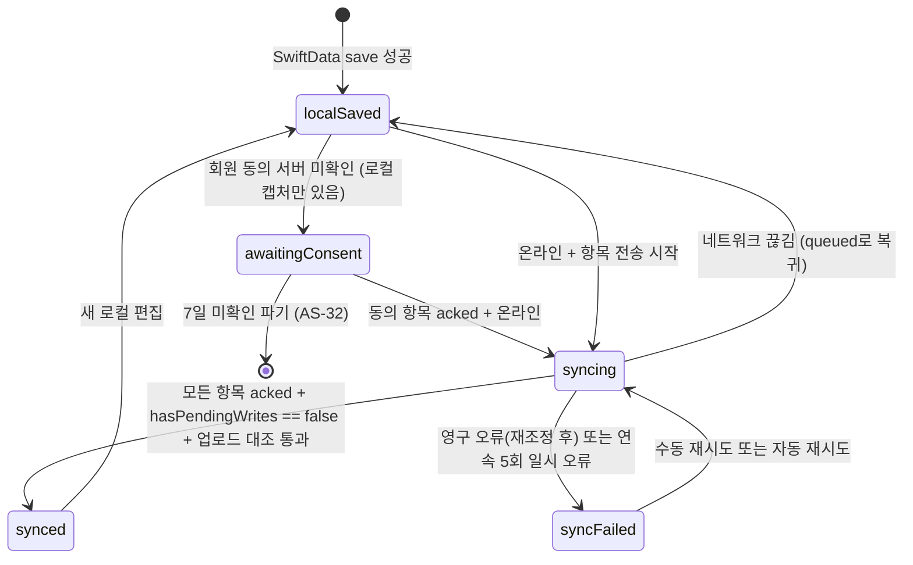

**엔터티 상태 계산 규칙**(`SyncStateCalculator`, TrainerDomain 순수 함수, 우선순위 순)

| 우선 | 조건(엔터티의 미완료 Outbox 항목 기준) | 결과 |
|---|---|---|
| 1 | SwiftData 저장 전 | 배지 없음(저장 중 표시는 쓰지 않음) |
| 2 | 하나라도 `failed` | `syncFailed` + 사유 |
| 3 | 하나라도 `blocked(awaitingConsent)` | `awaitingConsent` |
| 4 | 하나라도 `queued`/`inFlight`이고 **온라인** | `syncing` |
| 5 | 하나라도 `queued`이고 **오프라인** | `localSaved`(ASM-04-07) |
| 6 | 모두 `acked`이고, 문서 리스너 스냅샷 `metadata.hasPendingWrites == false`, 관련 `LocalBinary` 업로드 대조 통과 | `synced` |

- `WriteAck.serverCommitted`는 completion 성공으로 설정한다. 리스너가 없는 문서는 completion 성공과 업로드 대조로 6을 판정한다.
- SOAP의 '확정 대기'는 노트 상태 라벨이며 syncState와 **함께** 표시한다(PRD §6.0.3).
- 반례: 결과와 무관하게 450ms 뒤 '저장됨'(dfet:trainer_ios/DFETTrainer/Domain/TrainerStore.swift:177-191). 새 앱의 `SyncStateBadge`는 `SyncStatusProvider.syncState(for:)` 스트림만 렌더한다.

---

## 12 인증과 권한

### 12.1 클레임 모델

| 주체 | 판정 | 부여 | 비고 |
|---|---|---|---|
| 트레이너 | ID 토큰 `trainer == true` | 기존 `setTrainerClaim` callable(dfet:functions/index.js:528) | 앱 로그인 조건(NFR-02) |
| 관리자 | `admin == true` 하나로 통일(ADR-018) | 기존 `setAdminClaim`(:96) | 현재 네 벌 판정: dfet:firestore.rules:5-20, dfet:functions/index.js:79, dfet:admin_web/lib/auth.ts:18-23, dfet:storage.rules:4-9 |
| 회원 | 인증 사용자, uid | — | memberSummaries·동의·권리 요청만 |
| 담당 관계 | `trainers/{uid}.memberIds` ↔ `users/{uid}.trainerId` | Functions·admin_web 서버만 | ADR-003 |
| 기록 접근 | 원 기록 `trainerId == request.auth.uid`(파생 접근 키) | `syncRecordAccessKeys` | 읽기 규칙에 `get()` 없음 → 목록 쿼리 증명 가능 |

### 12.2 로그인·잠금·로그아웃

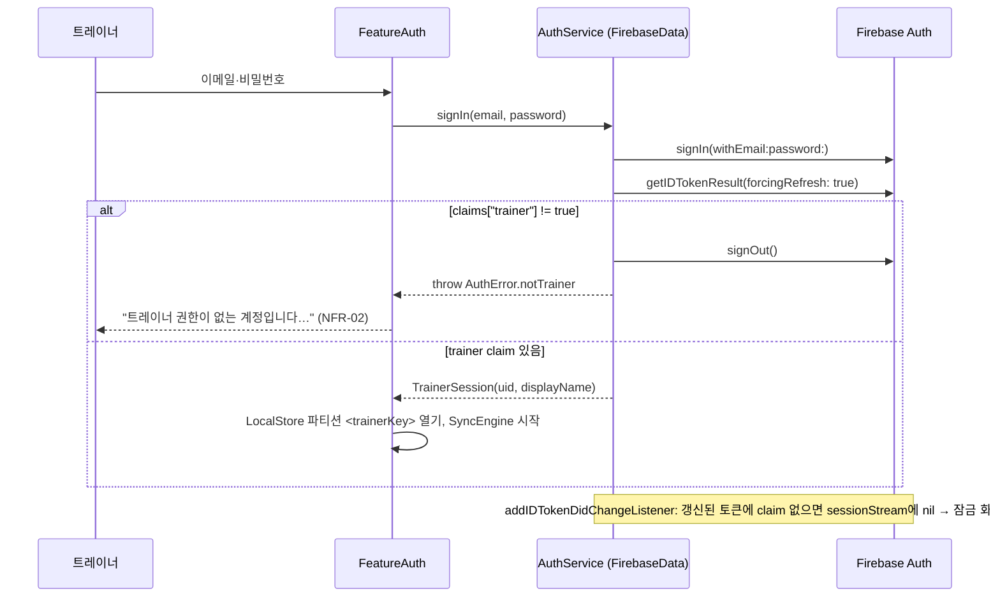

- 흐름은 dfet:trainer_ios/DFETTrainer/Features/Login/LoginView.swift:226-249와 같다(claim 없으면 즉시 signOut과 오류, :236-241).
- **claim 회수 잠금**(NFR-08): 토큰 갱신에서 claim이 사라지면 세션을 `nil`로 보내고 잠금 화면을 띄운다. 로컬 파티션은 지우지 않는다(같은 uid 재로그인 시 재개). 규칙도 `isTrainer()`를 확인하므로 서버 쓰기는 거부된다.
- **로그아웃**(NFR-08, DF-018): ① 미동기 n건이면 경고('동기화 후 로그아웃' / '취소' / '미동기 n건 삭제하고 로그아웃') ② 모든 리스너 해제 ③ `Firestore.terminate()` → `clearPersistence()` ④ `Auth.auth().signOut()` ⑤ LocalStore 파티션과 다운로드 캐시 삭제 ⑥ `AppEnvironment` 재생성. 수용 기준: `Auth.auth().currentUser == nil`(반례 dfet:trainer_ios/DFETTrainer/Domain/TrainerStore.swift:160-165).
- **공용 iPad**: LocalStore는 트레이너별 파티션이라 다른 트레이너가 로그인해도 이전 트레이너의 draft가 보이지 않는다(ASM-04-14).

### 12.3 규칙 계층과 App Check

- 규칙 헬퍼(`isAccessTrainer`, `isAssignedTrainer`, `isPendingOwner`, `canWriteFor`, `hasConsent`, `featureOn`)와 컬렉션별 규칙은 PRD §9.4, 코드는 [V1-05 §7](05_DATA_MODEL_AND_RULES.md#7-firestore-보안-규칙-초안).
- 쓰기 한 건의 `get()`은 최대 4건(trainers, pendingMembers 또는 memberConsentStates, appConfig/features)으로 한도 10 안이다(PRD §9.4).
- App Check: Debug provider(DEBUG), App Attest(Release). 기존 초기화(dfet:trainer_ios/DFETTrainer/App/DFETTrainerApp.swift:45-51)를 FirebaseBootstrap으로 옮긴다. callable `enforceAppCheck`는 P3 진입 체크리스트(DF-386, NFR-09).

---

## 13 바이너리 흐름

[ADR-007](adr/ADR-007-storage-binaries-lidar-local.md). 경로·크기·MIME 정본은 PRD §9.5.

### 13.1 업로드 파이프라인

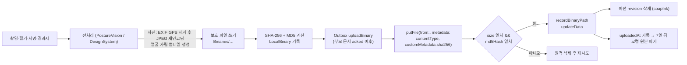

- **해시 대조**(NFR-05 '크기와 SHA-256 대조'): 클라이언트가 계산한 SHA-256을 `customMetadata.sha256`에 넣고, 서버가 계산한 `md5Hash`를 로컬 MD5와 비교해 전송 무결성을 실제로 검증한다(ASM-04-08).
- **사진 형식**: v1은 JPEG(품질 0.85)만 만든다. 규칙은 PRD대로 `image/heic`도 허용한다(ASM-04-10).
- **EXIF·GPS 제거**: `CGImageSource` → `CGImageDestination`으로 재인코딩하며 `kCGImagePropertyGPSDictionary`, `kCGImagePropertyExifDictionary`의 식별 항목, `kCGImagePropertyTIFFDictionary`를 쓰지 않는다. 방향은 픽셀에 적용한 뒤 Orientation=1로 저장한다(좌표 규약은 EXIF 적용 원본 기준, PRD §9.2). 수용: 업로드 파일 GPS 태그 0(AC-ASM-01.4).
- **다운로드**: `StorageReference.getData(maxSize:)` 후 `Caches/.../Downloads/`에 보호 저장. `getDownloadURL()`은 어떤 앱도 쓰지 않는다(static guard). 회원은 `getSharedPhotoUrl`(15분 만료)만 쓴다(P2).
- **LiDAR 원본**: 업로드 경로가 없다. `bodyScans/{scanId}/mesh.ply` 업로드는 규칙이 거부한다(S-08).

### 13.2 Storage 규칙 전제

- Storage 규칙은 `firestore.get()`으로 부모 문서를 한 번 조회해 `trainerId`와 상태를 판정한다. 그래서 부모 문서가 서버에 커밋된 뒤에만 업로드한다(Outbox 단계 ② → ③).
- 교차 서비스 조회 권한은 소유자가 부여하고(DF-906) 실환경에서 확인한다(DF-038, S-09). 확인이 실패하면 대안을 ADR-007에 기록한다.

---

## 14 회원 앱 Flutter 변경

정본: PRD §10.5, 화면은 [V1-08](08_MEMBER_APP_AND_ADMIN_SPEC.md). 구조는 기존 규칙(lib/models·services·state·screens)을 따른다.

| 영역 | 새 파일 | 역할 | 단계 |
|---|---|---|---|
| 계약 | `lib/contracts/generated/{metric_catalog,vocab,feature_flags}.g.dart` | 생성 상수(§17). 손 수정 금지 | P0 |
| 모델 | `lib/models/{member_summary,consent,rights_request,soap_note_v2}.dart` | `soap_note_v2.dart`는 교차 픽스처·레거시 읽기용 코덱 `SoapNoteV2Codec` | P0(코덱), P2 |
| 저장소 | `lib/services/{member_summary_repository,consent_repository,invite_repository,rights_request_repository}.dart` | Firestore·callable 접근 | P2 |
| 상태 | `lib/state/{member_summary_state,consent_state}.dart` | riverpod Provider/StreamProvider. 기존 패턴 dfet:lib/state/clinical_state.dart:6-11 | P2 |
| 화면 | `lib/screens/body_report/`(MB-01·02), `trainer_records/`(MB-03·04), `invite_code_screen.dart`(MB-05), `consent/`(MB-06) | 4탭 유지 | P2 |
| 위젯 | `lib/widgets/clinical/{source_grade_chip,series_trend_chart}.dart` | 공통 차트 규칙(F-VIZ-07), DF-131 | P1a |
| 플래그 | `lib/services/clinical_repository.dart`의 `AppFeatureFlags` 5키 확장 | 문서·키 없으면 false(기존 `fromMap` 패턴 dfet:lib/services/clinical_repository.dart:3-32, 구독 :41-45) | P0(DF-027) |

- **쿼리**: `memberSummaries where memberUid == uid orderBy sharedAt desc` 하나만(ADR-006). 오류는 빈 목록으로 삼키지 않는다(반례 dfet:lib/services/firestore_service.dart:588-591, :650-653).
- **callable 리전**: 새 callable은 `FirebaseFunctions.instanceFor(region: 'asia-northeast3')`. 기존 `deleteOwnAccount`·`toggleCommunityLike` 호출(기본 리전)은 그대로 둔다. `cloud_functions 6.0.2`가 이미 의존성에 있다(dfet:pubspec.yaml:54).
- **제거**: 회원 SOAP 직접 조회(dfet:lib/services/firestore_service.dart:598-654)는 MB-03 교체(DF-315)에서 제거한다. 회원 코드에 원 기록 컬렉션 경로 문자열이 없음을 static guard로 확인한다(AC-VIZ-06.1).
- **변경하지 않는 것**: iOS 15.5(dfet:ios/Podfile:2), 4축 인사이트(D4), BodyPathCore·TrainerKit 미링크(NFR-01). Runner 내장 트레이너는 동결(규제·크래시 수정만, MIG-09, `freeze-exception` 라벨).

---

## 15 Functions 구조

[ADR-017](adr/ADR-017-functions-structure.md). 함수 목록·계약은 스파인 `functions`와 [V1-06](06_API_SPEC.md).

```
functions/
├─ index.js                      # export만. 기존 callable 이름·리전 유지(NFR-16)
├─ src/clinical/                 # 기존 (변경 없음, V2에 bodycomp kind)
├─ src/shared/
│  ├─ region.js                  # REGION = 'asia-northeast3', regionalCallable(), scheduled()
│  ├─ callable.js                # 기존 어댑터 이전 (dfet:functions/index.js:32-48)
│  ├─ errors.js                  # fail(code, message, details) → HttpsError. 코드 6종 고정
│  ├─ auth.js                    # requireTrainer, requireAdmin(admin claim), isAssignedTrainer, isPendingOwner
│  ├─ audit.js                   # writeAuditLog(txOrBatch, {...}) — audit-actions 화이트리스트 검사
│  ├─ idempotency.js             # requestId·clientCaptureId 기반 멱등 확인 (callable 재시도 멱등)
│  └─ generated/                 # contracts 복사본 (§17)
├─ src/access/syncRecordAccessKeys.js
├─ src/consent/recordConsent.js
├─ src/members/{issueInviteCode,redeemInviteCode,linkMemberAlias}.js
├─ src/privacy/{deleteMemberCascade,submitRightsRequest,exportMemberData,purgeExpiredRecords,logRecordAccess,alertOverdueObligations}.js
├─ src/summaries/{createMemberSummary,revokeMemberSummary,getSharedPhotoUrl,prohibitedTerms}.js
├─ src/posture/verifyPostureConfirmed.js
├─ src/soap/auditSoapFinalized.js
├─ src/change/evaluateChange.js  # P3, 판정 단일 구현(ADR-009)
├─ src/ops/aggregateOpsMetrics.js
├─ scripts/migrations/           # MIG-02~08. 기본 dry-run, 소유자만 실행
└─ test/ firestore-rules.test.js(기존), rules/, unit/, e2e/, migrations/
```

- 각 모듈은 `handler`(Firebase 등록)와 테스트 가능한 순수 `core`를 export한다.
- 오류 코드: `invalid-argument`, `permission-denied`, `failed-precondition`, `not-found`, `already-exists`, `resource-exhausted`. 응답은 `{ok: true, ...}`.
- 쓰기는 트랜잭션·배치로 하고 같은 트랜잭션에서 감사 기록을 남긴다.
- **리전**: callable과 스케줄은 `asia-northeast3`(NFR-16). **Firestore 트리거**(`syncRecordAccessKeys` 트리거부, `auditSoapFinalized`, `verifyPostureConfirmed`)는 Eventarc 제약상 Firestore 데이터베이스 위치와 같은 리전에 둬야 한다. DB 위치는 아직 미확인(Q-08)이므로 G-09에서 확인한 위치를 `FIRESTORE_TRIGGER_REGION` 상수로 둔다(ASM-04-15).
- 스케줄은 `timeZone: 'Asia/Seoul'`. `purgeExpiredRecords` 매일 03:00, `alertOverdueObligations` 매일 09:00, `aggregateOpsMetrics` 월요일 04:00(ASM-04-16).
- 기존 기본 리전 callable(`setAdminClaim` 등, dfet:functions/index.js:96-745)과 `clinicalApi`(asia-northeast3, dfet:firebase.json:18-22)는 옮기지 않는다.
- 삭제 루틴 통합 대상의 현재 결함: `soap_notes`는 `memberId`로만 삭제(:399), posts는 `.jpg`만(:429). DF-132에서 해소.

---

## 16 admin_web 변경

정본: PRD §10.7. 화면은 [V1-08](08_MEMBER_APP_AND_ADMIN_SPEC.md).

| 변경 | 위치 | 현재(확인함) | 목표 | 단계 |
|---|---|---|---|---|
| 플래그 8키 | `app/api/admin/feature-flags/route.ts`, `app/(console)/settings/feature-flags/` | zod 3키(route.ts:10) | `lib/generated/contracts.ts`의 키로 zod 생성, 없으면 false | P0 (DF-027) |
| 동의 문서 | `app/api/admin/consent-documents/`, `app/(console)/consent-documents/` | 없음 | draft·publish·retire, 다섯 고지 항목·④ 수령자 검증 | P0~P1a 진입 전 (DF-032) |
| 정책 kind | `app/api/clinical/config/route.ts` | `policyKind` gut·blood·integrated(route.ts:10-24) | `bodyChange` 검증 | P1b (DF-221) |
| 지표 카탈로그 | `app/(console)/metric-catalog/` | 없음 | 생성 계약 읽기 전용 | P1b (DF-220) |
| 열람 감사 | `lib/audit.ts` `recordHealthRead()` | `writeAudit`만(audit.ts:6-21) | 원 기록 열람마다 `healthRecordRead` | P1a (DF-136) |
| 역할 판정 | `lib/auth.ts` `readRole` | `admin === true` 또는 `role === 'admin'`(auth.ts:18-23) | claim만(ADR-018) | P1a (DF-101) |
| 권리 요청·감사 | `app/(console)/rights-requests/`, `audit/` 확장 | audit 목록만 | AD-06 | P2 |
| 대기 회원 | `app/(console)/pending-members/` | 없음 | AD-02 | P2 |

- 모든 POST는 기존 패턴(`assertSameOrigin` → `getConsoleUser` 역할 확인 → zod → Admin SDK → `writeAudit`, dfet:admin_web/app/api/admin/feature-flags/route.ts:12-26)을 따른다.
- 기존 `writeAudit`는 `createdAt`, `actorEmail`, `target` 맵을 쓴다(audit.ts:12-19). PRD §9.2는 읽을 때 `createdAt`을 `at`으로 간주한다. 새 이벤트는 `at`, `targetCollection`, `targetId`, `memberUid`를 쓰고 기존 점 표기 action(`app.feature_flags.update`, route.ts:25)은 audit-actions 레지스트리의 `legacy` 항목으로 둔다(ASM-04-20).

---

## 17 contracts 단일 원본 파이프라인

[ADR-005](adr/ADR-005-soap-schema-v2-contracts.md), [ADR-016](adr/ADR-016-regulatory-copy-lint.md).

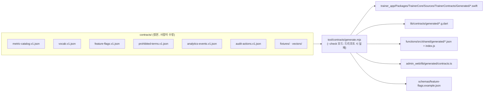

- 소비자마다 **복사·생성해 커밋**한다. functions 배포 번들, admin_web 빌드 루트, SPM 패키지 루트는 저장소 루트 밖 파일을 포함하지 못하기 때문이다(스파인 repoLayout 근거 4). Flutter 테스트는 저장소 루트에서 실행되므로 `contracts/fixtures/`를 직접 읽는다. 픽스처는 생성·복사 대상이 아니다(테스트가 #filePath로 읽는다).
- 생성물 첫 줄: `// GENERATED by tool/contracts/generate.mjs from contracts/<file> (sha256:<앞 12자>) — DO NOT EDIT`.
- CI `contracts` job: ajv로 `schemas/contracts-meta.schema.json` 검증 → `node tool/contracts/generate.mjs --check`. 형식 정본은 [V1-05 §13](05_DATA_MODEL_AND_RULES.md#13-contracts-json-형식).

---

## 18 BodyPathResult 패키지 경계

[ADR-012](adr/ADR-012-bodypath-result-package.md). v1 기본 경로는 BodyPath iPhone 촬영·계산 → 결과 패키지 수동 가져오기다(AS-14, AS-29).

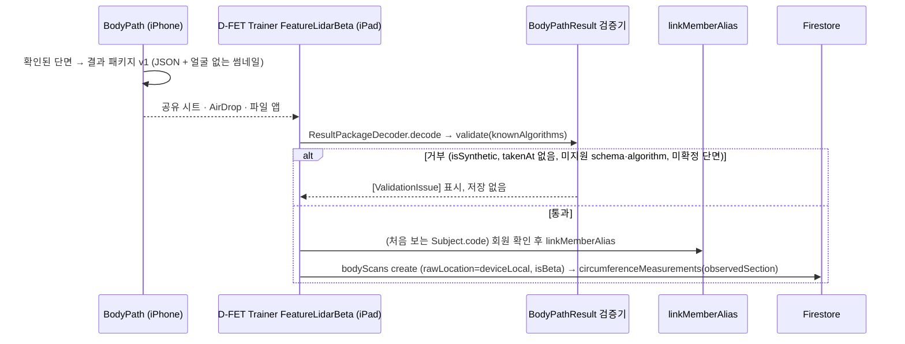

| 경계 항목 | 결정 |
|---|---|
| 패키지 위치 | BodyPath 저장소 루트 `Package.swift`, 소스 `packages/BodyPathCore/Sources/{BodyPathResult, BodyPathCoreUI}` |
| 의존 허용 | BodyPathResult: Foundation만. BodyPathCoreUI: SwiftUI만. ARKit·SwiftData·UIKit import 0(NFR-18) |
| 공개 API | `ResultPackageV1`(Codable), `ResultPackageDecoder.decode(_:)`, `ResultPackageValidator.validate(_:knownAlgorithms:) -> [ValidationIssue]`, `MeasurementSectionPlot(contours:bounds:selection:closedColor:openColor:onSelect:)` |
| 원본 | 스키마 청사진 bodypath:ios/BodyScan/BodyScan/Storage/MeasurementRecord.swift:28-47(`meshSHA256`, `meshAlgorithm`, `isSynthetic`, `landmarkNote`, `referenceCircumferenceCM` 등), `Scan.takenAt` bodypath:ios/BodyScan/BodyScan/Models/Models.swift:32-47, 플롯 bodypath:ios/BodyScan/BodyScan/Views/BodyMeasurementView.swift:322-357(private, `Theme.accent`·`.orange` 하드코딩 :342 → 색 주입) |
| 버전 고정 | 트레이너 앱은 git 태그 `bodypathcore-vX.Y.Z`로 고정. P2(G-07a) 전에는 의존하지 않는다 |
| 좌표 변환 | 원본 플롯은 미터 단위 `pointsM`의 x·z를 그린다(:337-338). 결과 패키지는 `contour2dMm`(mm, x·y 교대 평탄화, ≤1024, PRD §9.2)을 쓰고 CoreUI 입력 타입 `SectionContour(pointsMm: [CGPoint], isClosed: Bool)`로 변환한다 |
| 파일 형식 | `.zip` 컨테이너(`result.json` + `thumb.jpg`), 최대 5MB. 최종 형식은 DF-301의 `docs/RESULT_PACKAGE_V1.md`가 정본(ASM-04-09) |
| 채택하지 않음 | BodyPath의 Firebase 직결, App Group 전달(서로 다른 기기, NFR-14) |

---

## 19 구성과 환경

### 19.1 환경

| 환경 | 빌드 | Firebase | 데이터 | 누가 쓰나 | 비고 |
|---|---|---|---|---|---|
| preview | Debug + `--preview-<scenario>` | 구성하지 않음 | 인메모리 합성 시나리오 | 에이전트, XCUITest, 스냅샷 | plist 불필요 |
| emulator(로컬·CI) | Debug + `--use-emulator` | 에뮬레이터 프로젝트 `demo-dfet`(트레이너 IT), `dfet-rules-test`, `dfet-e2e`(기존, dfet:.github/workflows/ci.yml:53, :55) | 시드 스크립트 합성 회원 | 에이전트, CI | ASM-04-09 |
| production `dfetmanage` | Release(TestFlight·App Store) | dfetmanage(dfet:firebase.json:55-75) | 게이트 전: 가상 회원만. G-04·G-09 뒤 실데이터 | 소유자, P2 동료 | 스테이징 없음(AS-DEV-02) |

- 에뮬레이터 포트: firestore 18080, storage 19199(기존), auth 19099, functions 5001(P0 시드 스토리가 firebase.json에 추가: DF-042 채택 시 DF-042, 아니면 DF-012. DF-025·DF-107은 없을 때만 추가, ASM-04-09). `demo-` 접두 프로젝트는 실제 리소스에 닿지 않는다. 시드는 `node functions/scripts/dev/seed-emulator.js --seed functions/test/fixtures/emulator-seed.v1.json`(V1-10 §5.4)
- 개발·테스트 데이터는 합성 가상 회원만 쓴다. `output/`, `tmp/`, 운영 데이터는 열람하지 않는다(ADR-013).

### 19.2 빌드 구성과 실행 인자

| 키 | Debug | Release |
|---|---|---|
| App Check provider | Debug provider | App Attest |
| `--preview-*` | 허용 | 무시 |
| `--use-emulator`, `--emulator-host=<ip>` | 허용(기본 127.0.0.1) | 무시 |
| `--reset-local-store` | 허용(UITest 초기화) | 무시 |
| 플래그 로컬 오버라이드 | TR-15 DEBUG 메뉴 | 무효(ADR-010) |
| plist 없음 | preview만 동작, 그 외 모드는 구성 오류 화면 | 구성 오류 화면(`misconfigured`), Preview로 대체하지 않음 |
| `os.Logger` 디버그 레벨 | 기록 | 기록하지 않음 |

- `Config/Debug.xcconfig`, `Config/Release.xcconfig`에는 비밀을 넣지 않는다. 버전·번들 ID·Swift 설정만 둔다.

### 19.3 비밀과 구성 파일

[ADR-019](adr/ADR-019-config-and-secrets.md)(Proposed, G-02에서 확정).

| 항목 | 위치 | 주입 |
|---|---|---|
| `trainer_app/Config/GoogleService-Info.plist` | 비추적(`.gitignore`) | 로컬: 소유자 배치. CI: 시크릿 `TRAINER_GOOGLE_SERVICE_INFO_PLIST_B64` → 디코딩. 없으면 preview 빌드 |
| 서명 인증서·App Store Connect API 키 | GitHub Secrets | trainer-testflight(workflow_dispatch) |
| `INGEST_HMAC_KEYS`, 초대 코드 HMAC 키 | Secret Manager(`defineSecret`, 기존 dfet:functions/index.js:29) | Functions 런타임 |
| BodyPath 패키지 읽기 토큰(TEhyeok/BodyPath 비공개 확인됨) | GitHub Secrets | P2, S23 전(AS-DEV-03 확인됨, DF-923) |
| `functions/.secret.local`, `.env*` | 비추적(dfet:.gitignore:50, :56-58) | 로컬·CI 에뮬레이터 전용 |

- 에이전트는 비밀 파일을 열거나 출력하지 않는다. CI 로그에 plist 값을 출력하지 않는다(DF-034).

---

## 20 관측 가능성과 로깅

원칙: **건강 수치, 판정 결과, 동의 유형, 이름·이메일, 자유 메모, 필기, 사진·Storage 경로, 초대 코드 원문, 회원 uid 원문은 어떤 로그·이벤트·크래시 보고에도 남기지 않는다**(NFR-10).

### 20.1 트레이너 앱

```swift
// TrainerDomain/Logging/Log.swift (os는 Apple 공통 프레임워크라 순수 타깃에서도 사용)
import os
public enum Log {
  public static let app     = Logger(subsystem: "kr.co.dfet.trainer", category: "app")
  public static let auth    = Logger(subsystem: "kr.co.dfet.trainer", category: "auth")
  public static let sync    = Logger(subsystem: "kr.co.dfet.trainer", category: "sync")
  public static let storage = Logger(subsystem: "kr.co.dfet.trainer", category: "storage")
  public static let capture = Logger(subsystem: "kr.co.dfet.trainer", category: "capture")
}
// 사용 예
Log.sync.error("outbox failed kind=\(item.kind.rawValue, privacy: .public) code=\(code, privacy: .public) doc=\(item.target.documentId, privacy: .private(mask: .hash))")
```

| 보내도 되는 것(`.public`) | 반드시 `.private`이거나 금지 |
|---|---|
| 오류 코드, Outbox kind·stage, 컬렉션 이름, 시도 횟수, 소요 시간 구간, 앱·OS 버전 | 문서 ID(`.private(mask: .hash)`), uid·memberKey(금지), 값·메모·경로(금지) |

- 성능 측정은 `OSSignposter`(카테고리 `perf`)의 구간 이름으로 한다: `recordComplete`, `coldStart`, `landmarkSuggest`, `timelineFirstPage`, `uploadBinary`(§22).
- 분석 이벤트는 `TrainerAnalytics`의 생성 enum만 전송하고 목록 밖 속성은 단위 테스트에서 실패한다. G-09 공개 전 싱크는 `DebugSink`(os.Logger 디버그 레벨)이며 네트워크 전송이 없다(ADR-015, AS-DEV-07). 크래시 SDK 도입은 G-09와 함께 결정한다.
- 동의 변경은 분석 이벤트로 보내지 않고 auditLogs `consentChanged`에만 남긴다(PRD §5.5).

### 20.2 서버

- Functions: `logger.info/warn/error({fn, code, count, durationMs})` 구조화 로그. 식별자는 무작위 문서 ID(요청 ID)까지만, 회원 uid·이메일·값은 넣지 않는다.
- 의무 기한 초과(권리 요청, 삭제 실패, 재정렬 실패)는 `alertOverdueObligations`가 `severity: 'ERROR', obligation: '<type>', count` 로그를 남기고, 로그 기반 알림 정책이 소유자에게 이메일을 보낸다(AS-DEV-13, DF-933).
- 접근 증빙: 1차는 Firestore·Storage Data Access 감사 로그(DF-932), 2차는 앱 수준 auditLogs(PRD §9.7).
- 주간 운영 지표는 `opsMetrics/{isoWeek}` 서버 집계(건수·비율만)로 본다(§5.3).

---

## 21 보안 아키텍처

### 21.1 신뢰 경계

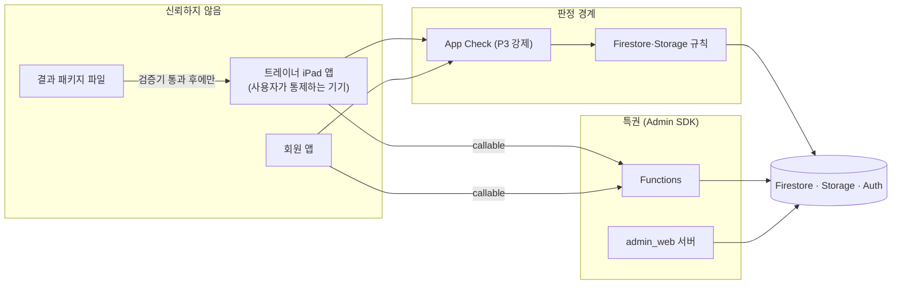

### 21.2 위협과 통제

| # | 위협 | 통제 | 검증 |
|---|---|---|---|
| SEC-01 | 비담당·해제된 트레이너의 기록 열람 | 파생 접근 키 `trainerId==uid` 읽기 규칙, 쓰기 `canWriteFor` 이중 확인, 재정렬 | R-05~R-07, S-05~S-06 |
| SEC-02 | 회원의 원 기록 열람 | 회원 읽기 조항 제거, memberSummaries만 | R-10~R-12 |
| SEC-03 | 동의 없는 수집·촬영 | 규칙 `hasConsent`, 앱 게이트, 사진은 서버 확인 동의만 | R-14~R-16, AC-PRIV-01.2 |
| SEC-04 | claim 회수 후 잔존 세션 | 토큰 갱신 잠금, 규칙 `isTrainer()` | NFR-08 |
| SEC-05 | 기기 분실·공용 iPad | 데이터 보호 Complete, 백업 제외, 트레이너별 파티션, 로그아웃 시 캐시 삭제, 암호 미설정 경고 | NFR-17, ASM-04-14, ASM-04-17 |
| SEC-06 | 공개·영구 링크로 사진 유출 | `getDownloadURL` 금지, 회원은 15분 서명 URL, 얼굴 가림 기본 | static guard, S-05 |
| SEC-07 | 위조 클라이언트·스크립트 호출 | App Check(Release App Attest), callable 권한 재검증, P3 enforce | DF-386 |
| SEC-08 | 관리자 과다 권한·판정 불일치 | admin claim 통일, 원 기록은 서버 경유 + `healthRecordRead` | R-23, DF-101, DF-136 |
| SEC-09 | 결과 패키지 위조·과대 입력 | 검증기(isSynthetic·takenAt·스키마·알고리즘·미확정), 크기 상한, JSON만(실행 코드 없음) | DF-300, DF-320 |
| SEC-10 | 규제 문구 노출 | 금지어 CI 린트 + 서버 요약 검사 | M-G1, ADR-016 |
| SEC-11 | 로그·분석을 통한 개인정보 유출 | 허용 목록 이벤트, Logger privacy, 서버 로그 식별자 금지 | NFR-10 |
| SEC-12 | 비밀 유출 | plist 비추적, Secret Manager, 에이전트 금지 규칙 | ADR-019, DF-034 |
| SEC-13 | 외부 도메인 전송 | 로컬 이니셜 아바타, 외부 SDK 없음 | NFR-11, DF-140 프록시 관찰 |
| SEC-14 | 레거시 v1 쓰기 경로 재개방 | v1 create/update 영구 false(플래그와 분리) | R-21 |

---

## 22 성능 예산

NFR-15의 수치는 모두 가설 목표이며 P1a·P1b 측정 후 §12.7에서 다시 정한다.

| 예산 | 목표(NFR-15) | 측정 지점(signpost) | 설계 수단 | 자동 회귀 | 실기기 측정 |
|---|---|---|---|---|---|
| '기록 완료' → `localSaved` | p95 ≤ 300ms | `recordComplete`: 탭 → SwiftData 커밋 → 배지 갱신 | 필기는 2초 디바운스 자동 저장으로 미리 직렬화하고, 탭 시에는 상태·한 줄만 저장. 저장은 `@ModelActor` 백그라운드 컨텍스트 | 시뮬레이터 XCTest `measure`(상한 300ms 초과 시 실패) | DF-140 |
| 콜드 스타트 → TR-01(캐시) | ≤ 2초 | `coldStart`: 프로세스 시작 → TR-01 첫 프레임 | TR-01은 로컬 `TodayListEntry`만으로 렌더, 리스너는 첫 프레임 뒤 연결 | XCUITest launch metric | DF-140 |
| 자동 랜드마크 제안 | ≤ 2초/장 | `landmarkSuggest` | Vision 요청은 백그라운드 큐, 입력은 긴 변 1600px로 축소(산식 회귀 벡터 1600×1200과 같은 크기) | — | DF-200, DF-223 |
| 타임라인 첫 화면(12개월) | 캐시 ≤ 1.5초, 네트워크 ≤ 3초 | `timelineFirstPage` | 25건 커서, `source: .cache` 먼저 렌더 후 서버 갱신 | 에뮬레이터 IT(상한 3초) | DF-140 |
| 사진 업로드 | 백그라운드, 입력 비차단 | `uploadBinary` | SyncEngine actor, UI는 업로드를 await하지 않음 | UI 테스트: 업로드 중 입력 가능 | DF-223 |

---

## 23 NFR 대응표

| NFR | 설계 수단(이 문서 절) | 검증 | 스토리 |
|---|---|---|---|
| NFR-01 앱 경계·배포 타깃 | iOS 17.0, `TARGETED_DEVICE_FAMILY "2"`(§6.3), Runner 15.5 유지(§14) | CI trainer-app, ios-no-codesign 의존성 검사 | DF-008, DF-904 |
| NFR-02 Firebase 연결 | claim 로그인(§12.2), plist 주입(§19.3) | 에뮬레이터 claim 계정 로그인 | DF-012, DF-013, DF-903 |
| NFR-03 저장소 경계 | Firebase는 FirebaseData만(§7), Preview는 DEBUG만(§8) | 컴파일 + static guard | DF-008, DF-011, DF-017 |
| NFR-04 오프라인 기록 | SwiftData 원본(§9), 퍼시스턴스 명시(§10.7) | IT 오프라인 시나리오, 실기기 비행기 모드 | DF-014, DF-107, DF-140 |
| NFR-05 업로드 큐·순서 | Outbox 단계 ⓪~⑤(§10), 해시 대조(§13) | SyncEngine 단위 + IT | DF-015, DF-118 |
| NFR-06 정직 표시 | 상태 기계(§11), 오류 삼킴 금지 | 규칙 거부 주입 IT | DF-015, DF-016, DF-107 |
| NFR-07 기록 무결성 | create/update 분리, createdAt 1회(§10.2), 자동 ID(§9.1) | 교차 픽스처 왕복 | DF-009, DF-104 |
| NFR-08 세션 종료 | 로그아웃 6단계, claim 회수 잠금(§12.2) | UI 테스트 `currentUser == nil` | DF-012, DF-018 |
| NFR-09 App Check | FirebaseBootstrap(§10.7), P3 enforce | 릴리스 빌드 설정 확인 | DF-008, DF-386 |
| NFR-10 로깅·분석 금지 항목 | §20 | 이벤트 허용 목록 테스트, 로그 리뷰 | DF-033, DF-126 |
| NFR-11 외부 전송 금지 | 이니셜 아바타, 외부 SDK 없음 | 프록시 관찰 | DF-011, DF-140 |
| NFR-12 방향·멀티태스킹 | Info.plist(§6.3), 폭 기준 compact(dfet:trainer_ios/design.md:23-32) | 실기기 4방향·1/3 Split View | DF-017, DF-140 |
| NFR-13 LiDAR 노출 | lidarBeta 진입점 숨김(§8.3), v1 촬영 진입점 없음 | UI 테스트 | DF-320, DF-321 |
| NFR-14 App Group | 엔타이틀먼트에 App Group 없음(§6.3) | 엔타이틀먼트 검사 | DF-008 |
| NFR-15 성능 | §22 | signpost + Instruments | DF-116, DF-140, DF-200, DF-223 |
| NFR-16 Functions 리전 | `src/shared/region.js`(§15), 트리거는 DB 위치(ASM-04-15) | 단위 테스트: 신규 export마다 region 명시 | DF-037 |
| NFR-17 로컬 데이터 보호 | §9.2, §9.4 | 파일 속성 단위 테스트, 철회 시뮬레이션 | DF-014, DF-112, DF-205 |
| NFR-18 BodyPathCore 품질 | §18 | 패키지 `swift test`, import 검사 | DF-300, DF-302 |

---

## 24 ADR 색인

| ADR | 제목 | 상태 | 주요 PRD 근거 |
|---|---|---|---|
| [ADR-001](adr/ADR-001-independent-trainer-app.md) | 독립 트레이너 앱: trainer_app/ + XcodeGen + TrainerCore·TrainerKit 로컬 패키지 | Accepted | D2, NFR-01, NFR-03 |
| [ADR-002](adr/ADR-002-local-first-swiftdata-outbox.md) | 로컬 우선 저장: SwiftData 편집 원본 + Outbox + Firestore 투영 | Accepted | §10.2.3, NFR-04~07 |
| [ADR-003](adr/ADR-003-uid-identity-pending-members.md) | uid 단일 진실원·대기 회원·파생 접근 키 | Accepted | D6, F-LINK-01~03 |
| [ADR-004](adr/ADR-004-root-collections-snapshots.md) | 루트 컬렉션 + ID 참조 + 스냅샷 | Accepted | D7, §9.1 |
| [ADR-005](adr/ADR-005-soap-schema-v2-contracts.md) | SOAP 스키마 v2와 contracts 단일 원본 | Accepted | F-SOAP-06, §9.3 |
| [ADR-006](adr/ADR-006-member-summaries.md) | 서버 생성 소비자본 memberSummaries | Accepted | D9, F-SOAP-05 |
| [ADR-007](adr/ADR-007-storage-binaries-lidar-local.md) | Storage 바이너리·부모 문서 권한·LiDAR 원본 로컬 | Accepted | D10, §9.5 |
| [ADR-008](adr/ADR-008-apple-vision-landmarks.md) | Apple Vision 2D 랜드마크 엔진 | Accepted | Q-18, AS-12 |
| [ADR-009](adr/ADR-009-server-only-change-evaluation.md) | 변화 판정 서버 단일 구현 | Accepted | D14, §7.5 |
| [ADR-010](adr/ADR-010-feature-flags.md) | 기능 플래그 5키 | Accepted | §6.0.2, §12.3 |
| [ADR-011](adr/ADR-011-consent-model.md) | 동의 모델 | Accepted | D12, F-PRIV-01~03 |
| [ADR-012](adr/ADR-012-bodypath-result-package.md) | BodyPathCore 단계적 패키지 | Accepted | D2, §10.4 |
| [ADR-013](adr/ADR-013-testing-strategy.md) | 테스트 전략·에뮬레이터·합성 데이터 | Accepted | §12.5 |
| [ADR-014](adr/ADR-014-branching-release.md) | 브랜칭·릴리스·배포 | Accepted | §12.1, MIG-01 |
| [ADR-015](adr/ADR-015-analytics-privacy.md) | 분석·로깅 개인정보 | Accepted(제공자 선택은 G-09 확인) | §5.5, NFR-10 |
| [ADR-016](adr/ADR-016-regulatory-copy-lint.md) | 금지어 단일 원본·CI 린트·서버 거부 | Accepted | F-PRIV-06, 부록 C |
| [ADR-017](adr/ADR-017-functions-structure.md) | Functions 구조·리전·런타임 | Accepted | §10.6, NFR-16 |
| [ADR-018](adr/ADR-018-admin-claim-unification.md) | 관리자 판정 통일 | Accepted | §9.4, §10.7 |
| [ADR-019](adr/ADR-019-config-and-secrets.md) | Firebase 구성 파일·비밀 관리 | Proposed(G-02에서 확정) | §10.2.4 |

---

## 25 가정과 스파인 차이

### 25.1 가정(ASM-04-NN)

이 문서 범위의 가정이다. V1-00의 AS-DEV 목록에 통합할 후보이며, PRD로 올릴 때는 PRD §13.4에 따라 AS-34부터 새 번호를 받는다.

| ID | 가정 | 관련 PRD·개발 가정 | 틀리면 |
|---|---|---|---|
| ASM-04-01 | 트레이너 앱 로컬 패키지를 `TrainerCore`(순수, iOS+macOS)와 `TrainerKit`(iOS 전용) 둘로 나눈다. 한 패키지에 UIKit 타깃이 있으면 macOS `swift test`가 실패함을 확인했다(§6.2) | ADR-001, ADR-013, AS-DEV-06 | 순수 타깃 테스트를 시뮬레이터 xcodebuild로만 돌린다(느림) |
| ASM-04-02 | SyncEngine은 LocalStore에 의존하지 않고 TrainerDomain의 `OutboxStore` 등 프로토콜에만 의존한다(스파인은 SyncEngine → LocalStore) | ADR-002 | SyncEngine을 TrainerKit으로 옮기고 macOS 테스트를 포기 |
| ASM-04-03 | App 타깃도 Firebase를 import하지 않고 `FirebaseBootstrap.configure`를 호출한다(스파인은 App 타깃 import 허용) | NFR-03 | static guard 허용 경로에 `trainer_app/App/AppDelegate.swift` 추가 |
| ASM-04-04 | 앱 기본 데이터 보호를 `NSFileProtectionComplete`로 두어 Firestore 캐시까지 보호한다. 그 결과 잠금 상태 백그라운드 동기화는 하지 않고 App Group도 두지 않는다 | NFR-14, NFR-17, AS-DEV-05 | 백그라운드 동기화가 필요하면 `completeUntilFirstUserAuthentication`으로 낮추는 ADR 개정 |
| ASM-04-05 | Outbox에 0단계(대기 회원 create)를 둔다. `recordConsent`가 `isPendingOwner`로 pendingMembers 문서를 확인하므로 동의보다 앞서야 한다 | NFR-05, F-LINK-01, F-PRIV-03.7 | 대기 회원 등록을 온라인 전용으로 제한 |
| ASM-04-06 | 백오프: 2초 × 2^n, 최대 5분, ±20% 지터, 연속 5회 일시 오류면 `syncFailed` 표시 후 최대 간격 자동 재시도 유지. 영구 오류는 재조정 후 즉시 실패 | NFR-05('기준' 미정) | P1a 측정(DF-140) 뒤 수치 조정 |
| ASM-04-07 | 오프라인에서 대기 중인 항목은 `localSaved`, 온라인에서 대기·전송 중이면 `syncing`으로 표시한다 | §6.0.3 | 오프라인도 `syncing`으로 표시(문구 혼동 위험) |
| ASM-04-08 | NFR-05의 해시 대조는 `customMetadata.sha256` 기록 + 서버 계산 `md5Hash`와 로컬 MD5 비교로 구현한다(Storage는 서버 측 SHA-256을 제공하지 않음) | NFR-05 | 업로드 후 다운로드해 SHA-256 재계산(비용 큼) |
| ASM-04-09 | firebase.json에 auth(19099)·functions(5001) 에뮬레이터 포트를 추가하고 트레이너 통합 테스트는 `demo-dfet` 프로젝트 ID를 쓴다. 결과 패키지 컨테이너는 zip(`result.json`+`thumb.jpg`, ≤5MB)으로 가정하고 DF-301 문서가 정본이다 | ADR-013, AS-29 | 포트·형식만 바꿈 |
| ASM-04-10 | 사진은 v1에서 JPEG(품질 0.85)만 생성한다. 규칙은 HEIC도 허용(PRD §9.5) | §9.5 | HEIC 생성 추가 시 해시·썸네일 경로 확장 |
| ASM-04-11 | Firebase iOS SDK는 `from: 11.0.0`(trainer_ios와 같음, dfet:trainer_ios/project.yml:11-13)으로 두고 Package.resolved로 고정한다. FirebaseAnalytics 제품은 G-09 전 링크하지 않는다 | AS-DEV-07, ADR-015 | 12.x 상향은 별도 PR |
| ASM-04-12 | 생성 프로젝트 diff 검사를 안정시키려고 xcodegen 버전을 `trainer_app/.xcodegen-version`에 고정하고 CI가 같은 버전을 설치한다(로컬 Xcode 26 / CI Xcode 16 혼재) | AS-DEV-06 | diff 검사가 흔들리면 CI 생성본만 정본으로 |
| ASM-04-13 | Firestore 퍼시스턴스 캐시 100MB, 다운로드 캐시 500MB LRU | NFR-04, NFR-15 | 측정 후 조정 |
| ASM-04-14 | LocalStore와 캐시는 트레이너 uid별 파티션(SHA-256 앞 16 hex)이다. claim 회수 잠금 시 유지, 로그아웃 확인 시 삭제 | NFR-08, Q-22 | 단일 파티션 + 로그인 전환 시 강제 삭제 |
| ASM-04-15 | Firestore 트리거 함수는 Firestore DB 위치와 같은 리전에 둔다(Eventarc 제약). NFR-16 '신규 asia-northeast3'은 callable·스케줄에 적용하고, 트리거 리전은 G-09(Q-08) 확인값을 쓴다 | NFR-16, Q-08 | DB가 asia-northeast3이면 차이 없음 |
| ASM-04-16 | 스케줄 시각: `purgeExpiredRecords` 매일 03:00, `alertOverdueObligations` 매일 09:00, `aggregateOpsMetrics` 월요일 04:00(Asia/Seoul) | §9.7, §5.3 | 시각만 조정 |
| ASM-04-17 | 기기 암호 미설정이면 경고 배너만 띄우고 차단하지 않는다(MDM 없음) | NFR-17 | G-04 법률 의견이 차단을 요구하면 로그인 차단 |
| ASM-04-18 | SyncEngine은 회원 단위 직렬, 회원 간 최대 2개 병렬 | NFR-05 | 1개로 낮춤 |
| ASM-04-19 | Firestore 쓰기 completion 성공 = 서버 커밋으로 보고, 재시작 시 `waitForPendingWrites` + 서버 읽기로 재조정한다. 온라인일 때만 전송해 SDK 오프라인 큐와 이중 큐가 생기지 않게 한다 | §10.2.3, NFR-04 | 재조정 규칙 추가 |
| ASM-04-20 | 기존 admin_web `writeAudit`의 점 표기 action과 `actorEmail`(직원 이메일)은 레거시로 유지하고, 새 이벤트는 PRD §9.2 필드(`at`, `targetCollection`, `targetId`, 이메일 없음)를 쓴다. 직원 이메일 보관의 적정성은 G-04에서 확인 | §9.2, §9.7, Q-07 | 레거시 필드 정리 PR |
| ASM-04-21 | TrainerCore(순수)·TrainerKit(iOS 전용) 두 패키지, 픽스처 #filePath 직접 읽기, plist는 project.yml에 참조하지 않고 postBuildScripts로 복사(R4) | ADR-001, ADR-013, ADR-019, ASM-S01-12 | 픽스처 복사 단계와 `resources: [.copy]` 재도입 |
| ASM-04-22 | 로컬 엔티티·Outbox 상태·TodayListEntry는 V1-05 §12가 정본(R5). 도메인 `OutboxItem`에 requestId·entityRef를 둔다 | ADR-002, NFR-05, F-PRIV-03.7 | V1-05 §12와 이 문서 §9.1·§10.2를 함께 정정 |

### 25.2 기술 스파인과 다르게 정한 것

1. 패키지 2분할(ASM-04-01). 다른 문서·작업 지시서의 경로 `trainer_app/Packages/TrainerKit/Sources/{TrainerContracts,TrainerDomain,PostureMath,SyncEngine}`은 `trainer_app/Packages/TrainerCore/Sources/...`로 읽는다. `TrainerAnalytics`도 순수 로직이라 TrainerCore에 둔다.
2. SyncEngine 의존 역전(ASM-04-02), App 타깃 Firebase 비import(ASM-04-03).
3. Outbox 0단계 추가(ASM-04-05).
4. Firestore 트리거 리전(ASM-04-15)은 NFR-16 문구와 부분 충돌한다. PRD 개정 제안 후보다.
5. 기존 CI는 push 트리거가 `main`과 `feature/**`다(dfet:.github/workflows/ci.yml:3-6). 스파인의 'push(main)'과 다르며, `feature/integrated-care-2026` 정리(DF-901) 뒤 `main`만 남긴다.
6. 마일스톤 날짜는 이 문서에서 쓰지 않는다. 날짜 정본은 [V1-03](03_RELEASE_AND_SPRINT_PLAN.md)(백로그 스파인 기준)이다.

### 25.3 열린 질문

| ID | 질문 | 결정 전 기본값 | 관련 |
|---|---|---|---|
| Q-DEV-04-01 | Firestore DB 위치가 asia-northeast3이 아니면 트리거 리전을 어디로 둘 것인가(데이터 위치와 처리방침 문구 영향) | DB 위치와 같은 리전 | Q-08, G-09, ASM-04-15 |
| Q-DEV-04-02 | 공용 iPad에서 여러 트레이너가 한 기기를 쓰는가 | 트레이너별 파티션으로 대비 | ASM-04-14 |

---

## 26 변경 이력

| 버전 | 날짜 | 변경 요지 | PR | PRD 영향 |
|---|---|---|---|---|
| v1.0 | 2026-09-24 | 최초 작성 | — | ASM-04-15(NFR-16 문구)는 PRD 개정 후보 |
| v1.0(정합 패스 2) | 2026-09-24 | project.yml `optional: true` 제거·postBuildScripts, 픽스처 복사 제거(R4), §9.1·§10.2를 V1-05 §12에 맞춤, clientRequestId → requestId/clientCaptureId(R5), 시드·포트 담당(R2) | — | 없음 |
| v1.0.1 | 2026-09-24 | 교차 정합성 조정: R2·R4·R5 반영, ASM-04-21·ASM-04-22 추가 | — | 없음 |
