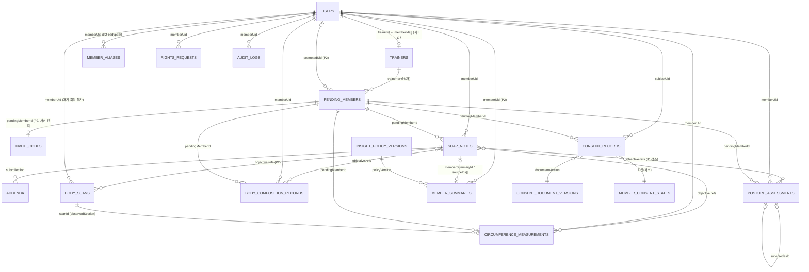

# 데이터 모델·보안 규칙·Storage·인덱스

| 항목 | 내용 |
|---|---|
| 문서 ID | V1-05 |
| 버전 | v1.0.2 |
| 상태 | 개발 착수 기준(Ready) |
| 작성일 | 2026-09-24 |
| 소유자 | CJH |
| 근거 PRD 절 | §9.1~§9.7(정본), §6.0.2~§6.0.3, §6.2(F-BC), §6.6(F-LINK), §6.7(F-PRIV), §7.1~§7.8, §11.4~§11.12(MIG-03~MIG-11), 부록 A·B |
| 관련 에픽·스토리 | EP-02, EP-03, EP-04, EP-08, EP-09, EP-11, EP-13 / DF-003, DF-004, DF-005, DF-006, DF-014, DF-015, DF-020, DF-021, DF-022, DF-023, DF-024, DF-025, DF-030, DF-031, DF-035, DF-038, DF-100, DF-101, DF-108, DF-109, DF-114, DF-119, DF-125, DF-132, DF-133, DF-135, DF-138, DF-309, DF-330, DF-335 |
| 변경 규칙 | [문서 변경](01_AGILE_WORKING_AGREEMENT.md#문서-변경) |

## 목차

1. [이 문서의 범위와 읽는 법](#1-이-문서의-범위와-읽는-법)
2. [데이터 분류(민감 등급)](#2-데이터-분류민감-등급)
3. [엔티티 관계와 공통 규약](#3-엔티티-관계와-공통-규약)
4. [컬렉션 명세](#4-컬렉션-명세)
5. [SOAP 스키마 v2](#5-soap-스키마-v2)
6. [공통 어휘(enum)](#6-공통-어휘enum)
7. [Firestore 보안 규칙 초안](#7-firestore-보안-규칙-초안)
8. [Storage 경로·규칙 초안](#8-storage-경로규칙-초안)
9. [규칙 테스트 매트릭스(R-01~R-31, S-01~S-09)](#9-규칙-테스트-매트릭스r-01r-31-s-01s-09)
10. [인덱스와 쿼리-규칙 정합](#10-인덱스와-쿼리-규칙-정합)
11. [보존·삭제·접근 키 재정렬·감사](#11-보존삭제접근-키-재정렬감사)
12. [트레이너 앱 로컬 SwiftData 스키마](#12-트레이너-앱-로컬-swiftdata-스키마)
13. [contracts JSON 형식](#13-contracts-json-형식)
14. [변경 절차(같은 PR 동시 갱신)](#14-변경-절차같은-pr-동시-갱신)
15. [가정(ASM-05-NN)·PRD 충돌·열린 질문](#15-가정asm-05-nnprd-충돌열린-질문)
16. [부록: 에뮬레이터 합성 시드](#16-부록-에뮬레이터-합성-시드)
17. [변경 이력](#17-변경-이력)

---

## 1 이 문서의 범위와 읽는 법

### 1.1 정본 관계

- **PRD가 정본이다.** 컬렉션·필드·규칙 요구는 [PRD §9](../PRD_V1.md)에서 왔다. 이 문서는 PRD를 **구현 가능한 수준**(필드 타입·검증식·규칙 코드·테스트 입력·인덱스 JSON)으로 옮긴다. 충돌하면 PRD가 우선하며, 이 문서에서 발견한 충돌은 [§15](#15-가정asm-05-nnprd-충돌열린-질문)에 적었다.
- 저장소 안의 정본 반영 위치
  - Firestore 스키마 서술: `docs/firestore_schema.md`(DF-006에서 이 문서 §4·§5로 개정)
  - JSON Schema: `schemas/*.schema.json`(DF-006)
  - 어휘: `contracts/metric-catalog.v1.json`, `contracts/vocab.v1.json`(DF-003, [§13](#13-contracts-json-형식))
  - 규칙: `firestore.rules`, `storage.rules`(DF-020, DF-021, DF-023), 인덱스: `firestore.indexes.json`(DF-024)
  - 규칙 테스트: `functions/test/rules/<collection>.rules.test.js`(DF-022, DF-035), Storage: `functions/test/rules/storage.rules.test.js`(DF-023)
- API 계약(callable 요청·응답)은 [06_API_SPEC.md](06_API_SPEC.md), 계산 규칙(conditionKey·seriesKey·판정)은 [09_ALGORITHMS_SPEC.md](09_ALGORITHMS_SPEC.md), 이관 절차는 [11_MIGRATION_RUNBOOK.md](11_MIGRATION_RUNBOOK.md), 테스트 운영은 [10_TEST_PLAN.md](10_TEST_PLAN.md)에 있다. 여기서는 되풀이하지 않고 링크한다.

### 1.2 표기

| 표기 | 뜻 |
|---|---|
| 타입 | `str`, `num`(정수·실수), `int`(정수만), `bool`, `ts`(Firestore Timestamp), `map`, `arr<T>`, `null` |
| 필수 | ● 필수, ○ 선택, S 서버만 씀(클라이언트 create·update 화이트리스트에 없음), C 조건부 필수(조건은 검증 칸) |
| 등급 | [§2](#2-데이터-분류민감-등급)의 C1~C4 |
| 예시 | 모두 **합성 값**이다. 문서 ID는 `SYNTH…` 접두, uid는 `synth…` 접두. ts는 가독성을 위해 ISO 8601(KST)로 적고, 서버 시각은 `<serverTimestamp>`로 적는다 |
| 크기 상한 | PRD가 '제안값'이라 적은 수치는 그대로 제안값이다. 바꾸려면 [§14](#14-변경-절차같은-pr-동시-갱신) 절차를 따른다 |

### 1.3 코드 근거 기준선

- `dfet:` 인용은 2026-09-24 작업 트리(브랜치 `feature/integrated-care-2026`, 미커밋 포함) 기준이며 파일을 직접 열어 확인했다.
- `firestore.rules`는 미커밋 변경이 있다. `trainerWorkspaces` 블록(dfet:firestore.rules:112-135)은 MIG-01 B분류(PRD §11.2 #3·#4)라 DF-901 뒤 main에서는 **soap_notes 이후 줄 번호가 25줄 당겨질 수 있다.** 규칙 PR(DF-020) 작성자는 main 기준 줄 번호로 다시 확인한다(ASM-05-01).

---

## 2 데이터 분류(민감 등급)

### 2.1 등급 정의

| 등급 | 이름 | 정의 | 대표 필드 |
|---|---|---|---|
| **C4** | 민감(건강·신체) | 개인정보보호법 제23조 건강정보와 신체 이미지·그 파생물. 동의 ②(`healthData`) 또는 ③(`bodyImaging`) 없이는 생성할 수 없다 | 신체조성 `values`, SOAP 본문(`quickNote`, `subjective`, `objective`, `exerciseAssessment`, `plan`, `memberNote`), 자세 `metrics`·`landmarks`, 둘레 `valueCm`, 체형 사진·썸네일, 필기, 결과지 사진, 스캔 `sections`·`meshSHA256`·썸네일, `pendingMembers.heightCm`, 요약 `body`·`highlights` |
| **C3** | 식별·증빙 | 사람을 직접 알아볼 수 있거나 법적 증빙인 값 | `displayName`, `memberSummaries.sharedByDisplayName`, `sex`, `birthYear`, 서명 PNG, `memberAliases.externalId`, 이메일(기존 `users`), 초대 코드 원문(저장 금지) |
| **C2** | 가명 식별자·운영 메타 | 단독으로는 사람을 알 수 없지만 결합하면 연결되는 값 | uid(`memberUid`, `trainerId`, `authorUid`), 문서 ID, Storage 경로, 측정·저장 시각, `deviceModel`, `status`, `consentType`, `documentVersion`, `protocolVersion` |
| **C1** | 비식별 설정·집계 | 개인과 연결되지 않는 값 | `appConfig/features`, 지표 카탈로그, `opsMetrics` 건수·비율, 정책 MDC 상수 |

- 등급은 **필드 단위**다. 문서 등급은 그 문서에서 가장 높은 필드 등급을 따른다.
- 판정 결과(`changeStatus`, `reasonCode`)는 건강정보에서 나온 값이라 C4로 본다(PRD §5.5 '판정 결과를 보내지 않음'과 일치).

### 2.2 등급별 처리 규칙

| 처리 | C4 | C3 | C2 | C1 |
|---|---|---|---|---|
| Firestore·Storage 저장 | 동의 게이트 규칙 통과 시만 | 허용(화이트리스트 키) | 허용 | 허용 |
| 트레이너 기기 로컬 | SwiftData·파일 `NSFileProtectionComplete`, 백업 제외(NFR-17) | 같음 | 같음 | 제한 없음 |
| 클라이언트 로그(`os.Logger`) | 금지 | 금지 | `privacy: .private` | 허용 |
| 서버 로그(Cloud Logging) | 금지 | 금지 | 오류 코드·건수만. uid·문서 ID는 넣지 않는다(PRD F-PRIV-04.4, alertOverdueObligations) | 허용 |
| 분석 이벤트 | 금지 | 금지 | 금지(무작위 `session_id`만) | 허용 목록만(PRD §5.5) |
| `auditLogs` | 금지 | 금지(행위자 이메일 예외는 ASM-05-14) | 정해진 필드(`actorUid`, `memberUid`, `targetId`)와 `metadata` 화이트리스트만 | 허용 |
| 회원 공유(`memberSummaries`) | 서버가 제외 규칙 적용 뒤만(PRD F-SOAP-05, §7.6) | `displayName` 불포함 | `sourceIds`만 | — |
| 열람 내보내기(`rightsExports`) | 포함(정보주체 본인분) | 포함 | 포함 | — |
| 픽스처·테스트 | 합성만(ADR-013) | 합성만 | 합성만 | 합성 |

---

## 3 엔티티 관계와 공통 규약

### 3.1 ER 다이어그램



그 밖에 독립 문서: `appConfig/features`(플래그), `opsMetrics/{isoWeek}`(집계), `admins/{uid}`(기존), `trainerWorkspaces/{trainerId}`(폐기 대상, MIG-08).

### 3.2 소유·작성·열람

PRD §9.1 '소유·작성·열람 매트릭스'가 정본이다. 요약하면 다음과 같다.

- 원 기록(`soap_notes`+`addenda`, `postureAssessments`, `bodyCompositionRecords`, `circumferenceMeasurements`, `bodyScans`)은 **`trainerId == 본인`인 트레이너만** 클라이언트에서 읽는다. 회원과 관리자 클라이언트는 읽지 못한다(R-10, R-23). 관리자는 admin_web 서버(Admin SDK)로 열고 `healthRecordRead`를 남긴다(F-PRIV-05.2).
- 회원이 읽는 SOAP·체형 문서는 `memberSummaries` 하나뿐이다(D9, ADR-006).
- 서버 전용 작성: `trainers`, `inviteCodes`, `memberAliases`, `memberSummaries`, `consentRecords`, `memberConsentStates`, `rightsRequests`, `opsMetrics`, `auditLogs`, `appConfig`, `consentDocumentVersions`, `insightPolicyVersions`.

### 3.3 공통 필드 규약(원 기록 컬렉션)

PRD §9.1 '공통 필드 규약'을 필드·규칙식으로 옮긴 표다. 규칙 헬퍼는 [§7.2](#72-헬퍼)에 있다.

| 필드 | 타입 | 규약 | 규칙에서 확인하는 식 |
|---|---|---|---|
| `schemaVersion` | int | 새 컬렉션 `1`, `soap_notes` `2` | create: `incoming().schemaVersion == 1`(또는 2) |
| `memberUid` | str\|null | 검증된 Firebase uid. 대기 기록은 null(또는 키 없음) | create: `exactlyOneMemberKey(incoming())` |
| `pendingMemberId` | str\|null | 대기 회원 문서 ID. 승격 뒤에도 남는다 | 같음 |
| `trainerId` | str\|null | **파생 접근 키.** create 때 자기 uid, 이후 서버만 변경. 담당 해제 시 null | create: `== request.auth.uid`, update: `affectedKeys`에 없음 |
| `authorUid` | str | 불변 작성자(신체조성은 `enteredBy`) | create: `== request.auth.uid`, update: 불변 |
| `legalNature` | str | `coachingRecord` 고정 | create: `== 'coachingRecord'` |
| 측정 시각 | ts | `capturedAt`(체형), `measuredAt`(신체조성·둘레), `takenAt`(스캔), `sessionDate`(SOAP). `request.time + 5분` 이하(제안값) | `notFuture(ts)` |
| `createdAt` | ts | `serverTimestamp()` | create: `== request.time`, update: 불변 |
| `updatedAt` | ts | `serverTimestamp()` | create·update: `== request.time` |
| `sourceGrade` | str | 수치를 담는 모든 항목에 필수 | 컬렉션별 enum 검사 |
| 정정 | — | 덮어쓰기 금지: SOAP `addenda`, 체형 `supersedesId`, 신체조성·둘레 `voided` | 컬렉션별 update 화이트리스트 |
| 키 표기 | — | 영문 camelCase. 한글·단위 섞인 키 금지 | `keys().hasOnly([...])` |
| 바이너리 | — | 문서 인라인 금지(base64, Bytes). Storage 경로 문자열만 | 화이트리스트에 인라인 필드 없음 |

- **회원 키 결정식:** `memberKey = memberUid ?? pendingMemberId`. 동의 상태 조회(`memberConsentStates/{memberKey}`)와 서버 삭제 루틴이 같은 식을 쓴다. 승격 후 기록은 두 키를 모두 가지며 `memberKey`는 `memberUid`가 된다(동의 상태는 승격 시 uid 문서로 병합, F-PRIV-03.4).
- **문서 ID:** 모든 원 기록은 클라이언트 자동 ID(20자)다. 트레이너 앱은 오프라인에서 ID를 먼저 정하고(ADR-002) 재시도해도 같은 ID로 create한다. `native_`로 시작하는 ID는 SOAP 규칙이 거부한다(R-24).
- **저장 방식:** 클라이언트는 `create`와 필드 단위 `update`만 쓴다. 전체 `set` 덮어쓰기(기존 dfet:lib/services/firestore_service.dart:659의 `doc(note.id).set(...)` 패턴)는 쓰지 않는다. `set(merge:false)`는 규칙상 create 또는 update로 평가되므로 화이트리스트에 걸린다.

---

## 4 컬렉션 명세

각 절은 **경로·단계·작성자 → 필드 표 → JSON 예시 → 규칙 요약(코드는 §7)** 순서다. SOAP는 분량이 많아 [§5](#5-soap-스키마-v2)로 뺐다.

### 4.1 `users/{uid}` (기존, v1 관련 필드만)

| 필드 | 타입 | 필수 | 검증·비고 | 등급 |
|---|---|---|---|---|
| `trainerId` | str | S | 담당 트레이너 uid. `assignMemberToTrainer`가 설정(dfet:functions/index.js:680-684), `removeMemberFromTrainer`가 삭제(:727-731) | C2 |
| `assignedTrainerId` | str | S | `trainerId`와 같은 값(기존 호환) | C2 |
| `trainerAssignedAt`, `trainerUnassignedAt` | ts | S | 기존 | C2 |
| `height`, `weight` | num | ○ | **회원이 직접 편집**(dfet:firestore.rules:84-91). v1 추이·BMI에 쓰지 않는다(F-BC-01.3, AC-BC-01.3) | C4 |

- 규칙은 기존 그대로다(dfet:firestore.rules:74-101). `syncRecordAccessKeys`는 이 문서의 `trainerId` 변경을 트리거로 쓴다([§11.4](#114-접근-키-재정렬syncrecordaccesskeys)).

### 4.2 `trainers/{uid}` (기존)

| 필드 | 타입 | 필수 | 검증·비고 | 등급 |
|---|---|---|---|---|
| `trainerId` | str | S | 문서 ID와 같다(dfet:functions/index.js:553) | C2 |
| `memberIds` | arr<str> | S | 담당 회원 uid. **담당 관계의 단일 진실원**(F-LINK-03.1). `isAssignedTrainer`가 읽는다 | C2 |
| `approvalStatus`, `displayName`, `email`, `specialty`, `createdAt`, `grantedBy`, `updatedAt` | — | S | 기존(dfet:functions/index.js:551-562) | C2~C3 |

- 클라이언트 쓰기 금지(dfet:firestore.rules:105-110). 트레이너 앱은 이 문서를 리스너로 읽고 `users`를 10개 청크로 조회한다(F-LINK-03.2, DF-013).

### 4.3 `pendingMembers/{pendingMemberId}` (신규, P1a, EP-09)

작성자: 생성 트레이너(create, 제한 update), Functions(승격·만료·파기). 읽기: 생성 트레이너. 관리자는 admin_web 서버 경유.

| 필드 | 타입 | 필수 | enum·검증 | 예시 | 등급 |
|---|---|---|---|---|---|
| `trainerId` | str | ● | `== request.auth.uid`, 불변 | `"synthTrainerA"` | C2 |
| `displayName` | str | ● | 1~40자 | `"가상회원 가"` | C3 |
| `sex` | str | ● | `female` \| `male` \| `unspecified` | `"female"` | C3 |
| `birthYear` | int | ● | `1900 ≤ birthYear ≤ request.time.year() − 14`(R-31, ASM-05-02) | `1990` | C3 |
| `ageConfirmed14` | bool | ● | `true`만 | `true` | C3 |
| `heightCm` | num | ○ | 100~250. **동의 ② 이후에만** 쓸 수 있음(R-30). create 화이트리스트에 없음 | `165.0` | C4 |
| `heightMeasuredAt` | ts | C | `heightCm`과 함께. `notFuture` | | C2 |
| `status` | str | ● | `pending` \| `promoted` \| `cancelled` \| `expired`. create는 `pending`만, 클라이언트 전환은 `pending→cancelled`만 | `"pending"` | C2 |
| `inviteCodeId` | str\|null | S | 현재 active 코드 해시(P2) | | C2 |
| `promotedUid`, `promotedAt` | str, ts | S | 승격 결과(P2) | | C2 |
| `cancelledAt`, `expiredAt` | ts | S | 파기 기한 계산용(ASM-05-03) | | C2 |
| `schemaVersion` | int | ● | `1` | `1` | C1 |
| `createdAt`, `updatedAt` | ts | ● | `== request.time` | | C2 |

금지 키: `phone`, `email`, 주소 등 연락처(F-LINK-01.4, AC-LINK-01.2). 화이트리스트 밖이라 규칙이 거부한다.

```json
{
  "trainerId": "synthTrainerA",
  "displayName": "가상회원 가",
  "sex": "female",
  "birthYear": 1990,
  "ageConfirmed14": true,
  "status": "pending",
  "schemaVersion": 1,
  "createdAt": "<serverTimestamp>",
  "updatedAt": "<serverTimestamp>"
}
```

### 4.4 `inviteCodes/{codeHash}` (신규, P2, 서버 전용)

| 필드 | 타입 | 필수 | enum·검증 | 등급 |
|---|---|---|---|---|
| (문서 ID) | str | ● | `HMAC-SHA256(secret, code)` 16진수 64자. 원문 코드는 어디에도 저장하지 않는다(AC-LINK-02.2) | C2 |
| `codeHash` | str | S | 문서 ID와 같음 | C2 |
| `pendingMemberId`, `trainerId` | str | S | 발급 대상과 발급자 | C2 |
| `status` | str | S | `active` \| `redeemed` \| `expired` \| `revoked` | C2 |
| `expiresAt` | ts | S | 발급 +7일(제안값, F-LINK-02.2) | C2 |
| `redeemedByUid`, `redeemedAt` | str, ts | S | | C2 |
| `schemaVersion`, `createdAt` | | S | | C1~C2 |

- 규칙: 모든 클라이언트 접근 거부(R-20). 실패 횟수(uid당 1시간 5회)는 이 문서가 아니라 서버 내부 카운터에 둔다(F-LINK-02.7, 저장 위치는 [06_API_SPEC.md](06_API_SPEC.md)).

### 4.5 `memberAliases/{sha256(system:externalId)}` (기존 확장, P2)

| 필드 | 타입 | 필수 | enum·검증 | 등급 |
|---|---|---|---|---|
| `memberUid` | str | S | 정본 회원 uid | C2 |
| `userId` | str | S | **레거시 호환.** `resolveMemberId`가 `userId`를 읽으므로(dfet:functions/src/clinical/ingestion.js:95-101) 같은 값을 병기(F-LINK-04.2) | C2 |
| `system` | str | S | `bodypath` \| `inbody` \| `clinicalLab` | C1 |
| `externalId` | str | S | bodypath는 `Subject.code`, inbody는 `{계정}:{UserID}`. 전화번호 금지(F-LINK-04.3) | C3 |
| `createdBy`, `createdAt` | str, ts | S | | C2 |

- (`system`, `externalId`)는 문서 ID로 유일하다. 다른 `memberUid`로 재연결 시 `linkMemberAlias`가 `already-exists`를 돌려준다(AC-LINK-04.1). 규칙은 기존 유지(관리자 읽기, 쓰기 금지; dfet:firestore.rules:279-282).

### 4.6 `postureAssessments/{assessmentId}` (신규, 규칙·테스트 P0, 사용 P1b, EP-14)

| 필드 | 타입 | 필수 | enum·검증 | 예시 | 등급 |
|---|---|---|---|---|---|
| `memberUid` / `pendingMemberId` | str\|null | ● 하나 | [§3.3](#33-공통-필드-규약원-기록-컬렉션) | | C2 |
| `trainerId`, `authorUid` | str | ● | create 시 둘 다 본인 uid | | C2 |
| `capturedAt` | ts | ● | 셔터 시각, `notFuture` | | C2 |
| `protocolVersion` | str | ● | 1~32자 | `"posture-v1"` | C2 |
| `stationProfileId` | str | ● | 로컬 스테이션 프로필 ID(1~64자, [§12](#12-트레이너-앱-로컬-swiftdata-스키마)) | `"SYNTHstation0001"` | C2 |
| `landmarkEngine` | map | ● | `{name: 'appleVision2D', version: str}`(ADR-008) | `{"name":"appleVision2D","version":"iOS17.4"}` | C2 |
| `device` | map | ● | `{model: str, osVersion: str}` | `{"model":"iPad14,5","osVersion":"17.4"}` | C2 |
| `captureConditions` | map | ● | 키: `clothing`(`fitted`\|`regular`\|`unknown`, ASM-05-04), `barefoot` bool, `markersPlaced` bool, `verbalConsentCheck` bool, `cameraHeightCm` num, `cameraDistanceM` num, `levelDeg` num, `pitchDeg` num | 아래 예시 | C2 |
| `views` | arr<map>(≤3) | ● | 원소: `{view, photoPath, thumbPath, maskedThumbPath, imageRotationDeg, landmarks}` | | C4 |
| `metrics` | arr<map>(≤30) | ○/C | draft ○, confirmed는 1개 이상. 원소 `{metricCode, value:num, unit:'deg', side, sourceGrade}` | | C4 |
| `status` | str | ● | `draft` → `confirmed` → `voided`(한 방향) | `"draft"` | C2 |
| `isBaseline` | bool | ● | 회원 × 측면 방향당 하나(앱·서버 보장, F-ASM-04.4) | `false` | C2 |
| `supersedesId` | str\|null | ○ | 새 버전이 대체하는 이전 평가 ID | | C2 |
| `retestGroupId` | str\|null | ○ | 있으면 동의 ⑤ 필요(R-16) | | C2 |
| `legalNature` | str | ● | `coachingRecord` | | C1 |
| `schemaVersion` | int | ● | `1` | | C1 |
| `createdAt`, `updatedAt` | ts | ● | 서버 시각 | | C2 |

`views[]` 원소

| 키 | 타입 | 검증 | 등급 |
|---|---|---|---|
| `view` | str | `front` \| `sagittalLeft` \| `sagittalRight` | C2 |
| `photoPath` | str\|null | `postureAssessments/{assessmentId}/{view}.(jpg\|heic)`. ③ 철회 시 null | C2 |
| `thumbPath` | str\|null | `…/{view}_thumb.jpg` | C2 |
| `maskedThumbPath` | str\|null | `…/{view}_masked_thumb.jpg`(ASM-05-05: PRD §9.2 `views[]`에 이름이 없어 추가 제안) | C2 |
| `imageRotationDeg` | num | 수평 보정 회전각(반시계 양수). 원 좌표는 보정 전 값 | C2 |
| `landmarks` | arr<map>(≤32) | `{code, x, y, origin: 'auto'\|'manual', confirmed: bool, suggested?: {x, y, confidence}}`. `x`, `y`는 EXIF 방향 적용 원본 기준 0~1 정규화, 원점 왼쪽 위. 코드는 부록 A.3([§6.4](#64-랜드마크-코드부록-a3)) | C4 |

`metrics[]` 원소: `metricCode`는 `craniovertebralAngle`, `headTiltFrontal`, `shoulderTiltAngle`, `pelvicTiltFrontal` 중 하나. `sourceGrade`는 `photoManual`(필수 랜드마크 모두 confirmed) 또는 `photoAuto`. `side` 규칙은 [§6.2](#62-metriccode-카탈로그부록-a1a2). 값은 0.1° 반올림(PRD §7.5). 산식은 [09_ALGORITHMS_SPEC.md](09_ALGORITHMS_SPEC.md).

```json
{
  "memberUid": "synthMember0001",
  "pendingMemberId": null,
  "trainerId": "synthTrainerA",
  "authorUid": "synthTrainerA",
  "capturedAt": "2027-01-18T10:05:12+09:00",
  "protocolVersion": "posture-v1",
  "stationProfileId": "SYNTHstation0001",
  "landmarkEngine": {"name": "appleVision2D", "version": "iOS17.4"},
  "device": {"model": "iPad14,5", "osVersion": "17.4"},
  "captureConditions": {
    "clothing": "fitted", "barefoot": true, "markersPlaced": true, "verbalConsentCheck": true,
    "cameraHeightCm": 100, "cameraDistanceM": 3, "levelDeg": 0.4, "pitchDeg": -0.8
  },
  "views": [
    {
      "view": "sagittalLeft",
      "photoPath": "postureAssessments/SYNTHposture00000001/sagittalLeft.jpg",
      "thumbPath": "postureAssessments/SYNTHposture00000001/sagittalLeft_thumb.jpg",
      "maskedThumbPath": "postureAssessments/SYNTHposture00000001/sagittalLeft_masked_thumb.jpg",
      "imageRotationDeg": 0.4,
      "landmarks": [
        {"code": "tragusLeft", "x": 0.512, "y": 0.231, "origin": "manual", "confirmed": true,
         "suggested": {"x": 0.505, "y": 0.236, "confidence": 0.71}},
        {"code": "c7", "x": 0.468, "y": 0.302, "origin": "manual", "confirmed": true}
      ]
    }
  ],
  "metrics": [
    {"metricCode": "craniovertebralAngle", "value": 48.2, "unit": "deg", "side": "none", "sourceGrade": "photoManual"}
  ],
  "status": "confirmed",
  "isBaseline": true,
  "supersedesId": null,
  "retestGroupId": null,
  "legalNature": "coachingRecord",
  "schemaVersion": 1,
  "createdAt": "<serverTimestamp>",
  "updatedAt": "<serverTimestamp>"
}
```

상태 전이와 수정 가능 필드

| 현재 status | 허용 전이 | 수정 가능 키 | 필요 조건 |
|---|---|---|---|
| (없음) | create → `draft` | 전체 화이트리스트 | ②·③, `retestGroupId`가 있으면 ⑤, `featureOn('bodyAssessment')` |
| `draft` | `draft`, `confirmed` | `capturedAt`, `protocolVersion`, `stationProfileId`, `landmarkEngine`, `device`, `captureConditions`, `views`, `metrics`, `status`, `isBaseline`, `supersedesId`, `retestGroupId`, `updatedAt` | `canWriteFor`, ②·③. confirmed 전환 시 `metrics.size() ≥ 1`. 새 `retestGroupId`는 ⑤ |
| `confirmed` | `confirmed`, `voided` | `status`, `isBaseline`, `updatedAt` | `canWriteFor` |
| `voided` | 없음 | 없음 | — |

- confirmed 문서의 `metrics`·`views`(랜드마크) 수정은 규칙이 거부한다(DF-021 AC). 원소 단위 검증(확정 랜드마크 여부, sourceGrade 일관성)은 규칙이 할 수 없으므로 도메인 단위 테스트(DF-209)와 P2 `verifyPostureConfirmed`(DF-324)가 맡는다.
- 수정은 새 draft(`supersedesId=이전 ID`)로 한다. 새 버전이 confirmed 되면 앱이 이전 문서를 `voided`로 바꾼다(F-ASM-04, DF-209).

### 4.7 `bodyCompositionRecords/{recordId}` (신규, P1a, EP-11)

| 필드 | 타입 | 필수 | enum·검증 | 예시 | 등급 |
|---|---|---|---|---|---|
| `memberUid` / `pendingMemberId` | str\|null | ● 하나 | | | C2 |
| `trainerId` | str | ● | create 시 본인 | | C2 |
| `enteredBy` | str | ● | `== request.auth.uid`, 불변 | | C2 |
| `source` | str | ● | `manualEntry` \| `inbodyApi` \| `healthKit`. **클라이언트는 `manualEntry`만** | `"manualEntry"` | C1 |
| `sourceGrade` | str | ● | `device` 고정 | `"device"` | C1 |
| `deviceModel` | str | ● | 1~64자 | `"InBody 570"` | C2 |
| `measuredAt` | ts | ● | `notFuture` | | C2 |
| `fasting` | str | ● | `yes` \| `no` \| `unknown` | `"yes"` | C4 |
| `timeOfDayBand` | str | ● | `morning` \| `midday` \| `evening`(경계는 [09_ALGORITHMS_SPEC.md](09_ALGORITHMS_SPEC.md)) | `"morning"` | C2 |
| `values` | map | ● | 아래 키 표. **측정하지 않은 키는 두지 않는다(0 금지), 1개 이상** | `{"weightKg":62.4,"bodyFatPercent":24.1}` | C4 |
| `derived` | map\|null | ○ | `{bmi:num, heightCmUsed:num(100~250), heightMeasuredAt:ts, sourceGrade:'derived'}`. 트레이너 입력 키가 있을 때만 | | C4 |
| `reportPhotoPath` | str\|null | ○ | `bodyCompositionRecords/{recordId}/report.(jpg\|heic)`. create 때 null, 이후 한 번만 설정 | | C2 |
| `externalId`, `idempotencyKey`, `rawPath` | str\|null | S(V2) | InBody 수집 전용(F-BC-04.1). 클라이언트 화이트리스트에 없음 | | C2 |
| `status` | str | ● | `active` \| `voided` | `"active"` | C2 |
| `voidedAt` | ts | C | voided 전환 시 `== request.time` | | C2 |
| `voidReason` | str | C | voided 전환 시 1~200자 | `"전사 오류"` | C4 |
| `legalNature`, `schemaVersion` | | ● | `coachingRecord`, `1` | | C1 |
| `createdAt`, `updatedAt` | ts | ● | 서버 시각(`updatedAt`은 ASM-05-06) | | C2 |

`values` 키(부록 A.1). 범위의 앱 값은 UI 검증, 규칙 값은 규칙 검증이다. 앱 범위 중 PRD에 없는 것은 **제안값**이다.

| 키 | 단위 | 앱 범위 | 규칙 범위 | 근거 |
|---|---|---|---|---|
| `weightKg` | kg | 0.1~600 | `> 0 && ≤ 600` | F-BC-03.2 |
| `bodyFatPercent` | % | 0~100 | `≥ 0 && ≤ 100`(0 허용, R-27) | F-BC-03.2 |
| `skeletalMuscleMassKg` | kg | 0.1~300 | `> 0 && ≤ 300` | F-BC-03.2 |
| `bodyFatMassKg` | kg | 0.1~600(제안) | `> 0 && ≤ 600` | ASM-05-07 |
| `visceralFatLevel` | level | 1~100(제안) | `> 0 && ≤ 100` | ASM-05-07 |
| `totalBodyWaterL` | L | 0.1~300(제안) | `> 0 && ≤ 300` | ASM-05-07 |

`bmi`는 `values`에 두지 않는다. `segmentalLeanMassKg`, `phaseAngleDeg`는 V2(`source=inbodyApi`)만.

```json
{
  "memberUid": null,
  "pendingMemberId": "SYNTHpending00000001",
  "trainerId": "synthTrainerA",
  "enteredBy": "synthTrainerA",
  "source": "manualEntry",
  "sourceGrade": "device",
  "deviceModel": "InBody 570",
  "measuredAt": "2026-12-07T08:40:00+09:00",
  "fasting": "yes",
  "timeOfDayBand": "morning",
  "values": {"weightKg": 62.4, "bodyFatPercent": 24.1, "skeletalMuscleMassKg": 25.3},
  "derived": {"bmi": 22.9, "heightCmUsed": 165.0, "heightMeasuredAt": "2026-11-23T10:00:00+09:00", "sourceGrade": "derived"},
  "reportPhotoPath": null,
  "status": "active",
  "legalNature": "coachingRecord",
  "schemaVersion": 1,
  "createdAt": "<serverTimestamp>",
  "updatedAt": "<serverTimestamp>"
}
```

수정 규칙: active일 때만 `reportPhotoPath`(null→값, 한 번), `status`(→`voided`), `voidedAt`, `voidReason`, `updatedAt`. 값 변경은 불가하며 '정정'은 voided + 새 문서(F-BC-03.5). delete는 클라이언트 거부.

### 4.8 `circumferenceMeasurements/{measurementId}` (신규, tape P1a·observedSection P2)

한 문서 = 부위 1개 × 반복 1회(`trialIndex`). 한 행에서 2~3개 값을 입력하면 문서 2~3개가 생긴다(F-ASM-06.4).

| 필드 | 타입 | 필수 | enum·검증 | 예시 | 등급 |
|---|---|---|---|---|---|
| `memberUid` / `pendingMemberId` | str\|null | ● 하나 | observedSection은 `memberUid` 필수 | | C2 |
| `trainerId`, `authorUid` | str | ● | create 시 본인 | | C2 |
| `metricCode` | str | ● | `waistCircumference`, `hipCircumference`, `thighCircumference`, `upperArmCircumference`, `calfCircumference`, `chestCircumference` | `"waistCircumference"` | C2 |
| `side` | str | ● | 허리·엉덩이·가슴 `none`, 허벅지·상완·종아리 `left`\|`right`(AC-ASM-06.1) | `"none"` | C2 |
| `valueCm` | num | ● | 1~400, 0.1 단위(F-ASM-06.5) | `78.4` | C4 |
| `sourceGrade` | str | ● | `tape` \| `observedSection` | `"tape"` | C1 |
| `protocolId` | str | ● | `waistMidpoint`(허리) \| `hipMaximum`(엉덩이) \| `custom`(가슴·사지) | `"waistMidpoint"` | C2 |
| `protocolVersion` | str | ● | 1~32자 | `"circ-v1"` | C2 |
| `landmarkNote` | str\|null | C | `protocolId=='custom'`이면 1~500자(R-26) | | C4 |
| `conditionsNote` | str\|null | ○ | ≤500자 | | C4 |
| `measuredAt` | ts | ● | `notFuture`. observedSection은 스캔 `takenAt` | | C2 |
| `trialIndex` | int | ● | 1~3 | `1` | C2 |
| `scanId` | str\|null | C | observedSection이면 필수 | | C2 |
| `referenceTapeCm` | num\|null | ○ | 1~400. **비교 전용, 보정 금지** | | C4 |
| `validationStatus` | str | ● | `unvalidated` \| `validated`. observedSection은 G-07 전 `unvalidated`만, tape는 `validated`(ASM-05-08) | `"validated"` | C1 |
| `isBeta` | bool | ● | observedSection이면 `true`, tape이면 `false` | `false` | C1 |
| `status` | str | ● | `active` \| `voided` | | C2 |
| `voidedAt`, `voidReason` | ts, str | C | voided 전환 시 | | C2, C4 |
| `legalNature`, `schemaVersion` | | ● | | | C1 |
| `createdAt`, `updatedAt` | ts | ● | 서버 시각 | | C2 |

```json
{
  "memberUid": "synthMember0001",
  "pendingMemberId": null,
  "trainerId": "synthTrainerA",
  "authorUid": "synthTrainerA",
  "metricCode": "thighCircumference",
  "side": "left",
  "valueCm": 54.2,
  "sourceGrade": "tape",
  "protocolId": "custom",
  "protocolVersion": "circ-v1",
  "landmarkNote": "슬개골 상연 위 15cm",
  "conditionsNote": null,
  "measuredAt": "2026-12-14T11:10:00+09:00",
  "trialIndex": 2,
  "scanId": null,
  "referenceTapeCm": null,
  "validationStatus": "validated",
  "isBeta": false,
  "status": "active",
  "legalNature": "coachingRecord",
  "schemaVersion": 1,
  "createdAt": "<serverTimestamp>",
  "updatedAt": "<serverTimestamp>"
}
```

### 4.9 `bodyScans/{scanId}` (신규, P2, lidarBeta, EP-19)

| 필드 | 타입 | 필수 | enum·검증 | 등급 |
|---|---|---|---|---|
| `memberUid` | str | ● | 대기 회원 불가(F-LINK-01.7). `pendingMemberId` 키 없음 | C2 |
| `trainerId`, `authorUid` | str | ● | create 시 본인 | C2 |
| `takenAt` | ts | ● | BodyPath `Scan.takenAt`, `notFuture` | C2 |
| `sourceApp` | str | ● | `bodypath` \| `trainerApp` | C1 |
| `device` | map | ● | `{model: str, hasLiDAR: bool}` | C2 |
| `captureMode` | str | ● | `cameraOrbit` | C1 |
| `algorithmVersion`, `meshAlgorithm` | str | ● | 1~64자. 조건 키(§7.4) | C2 |
| `meshSHA256` | str\|null | ● | `^[0-9a-f]{64}$` 또는 null(③ 철회 뒤) | C4 |
| `quality` | map | ● | `{integratedFrames: int, flags: arr<str>(≤20)}` | C2 |
| `thumbnailPath` | str\|null | ○ | create 때 null. 이후 `bodyScans/{scanId}/thumb.jpg`로 한 번 | C2 |
| `rawLocation` | str | ● | `deviceLocal` 고정 | C1 |
| `sections` | arr<map>(≤20) | ● | `{metricCode, perimeterMm: num, contour2dMm: arr<num>(≤1024)\|null, confirmed: bool}`. 윤곽은 `[x0,y0,x1,y1,…]` 평탄화 | C4 |
| `isBeta` | bool | ● | `true` | C1 |
| `legalNature`, `schemaVersion` | | ● | | C1 |
| `createdAt`, `updatedAt` | ts | ● | | C2 |

수정: `thumbnailPath`(null→값), `sections`(confirmed 토글), `updatedAt`만. ③ 철회 파기(`contour2dMm=null`, `meshSHA256=null`, `thumbnailPath=null`)는 서버만 한다.

### 4.10 `memberSummaries/{summaryId}` (신규, P2, 서버 작성, EP-17)

| 필드 | 타입 | enum·검증 | 등급 |
|---|---|---|---|
| `memberUid` | str | 회원 쿼리 키(`where memberUid == uid`) | C2 |
| `trainerId` | str\|null | 현재 접근 키. 재정렬 대상([§11.4](#114-접근-키-재정렬syncrecordaccesskeys)) | C2 |
| `sharedByUid` | str | **S, 불변.** 공유를 실행한 트레이너 uid(작성자). `trainerId`와 달리 재정렬하지 않는다. ④ 인계 판단·감사에 쓴다(ASM-05-34, 06 ASM-06-07) | C2 |
| `sharedByDisplayName` | str(≤40)\|null | **S.** 공유 시점 트레이너 표시명 스냅샷. 회원은 `users`·`trainers` 문서를 읽을 수 없으므로 MB-03이 이 값을 쓴다. 없으면 '담당 트레이너'(ASM-05-35, 08 ASM-08-07) | C3 |
| `sourceType` | str | `soapNote` \| `bodyReport` | C1 |
| `sourceIds` | arr<str>(≤20) | 원 기록 ID | C2 |
| `title` | str(≤100) | 금지어 검사 통과 | C4 |
| `body` | str(≤8,000) | 금지어·약어 검사 통과, 쉬운 한국어 | C4 |
| `highlights` | arr<map>(≤10) | 아래 | C4 |
| `sharedPhotoPaths` | arr<str>(≤6) | bodyReport이고 ③과 트레이너 토글일 때만. 얼굴 가림 썸네일 경로(`…_masked_thumb.jpg`)만(ASM-05-09) | C2 |
| `nextPlan` | str(≤1,000) | | C4 |
| `policyVersion` | str\|null | 활성 bodyChange 정책 버전. null이면 회원 앱은 배지 없이 하단 한 줄 | C1 |
| `status` | str | `shared` \| `revoked` | C2 |
| `sharedAt` | ts | | C2 |
| `revokedAt` | ts\|null | | C2 |
| `firstViewedAt` | ts\|null | **S.** 회원이 요약을 처음 연 서버 시각. create 때 `null`, `markSummaryViewed`만 한 번 채운다(M-06·M-07, ASM-05-36) | C2 |
| `schemaVersion` | int | `1` | C1 |

`highlights[]` 원소(PRD §7.8, §9.2)

| 키 | 타입 | 비고 |
|---|---|---|
| `refId` | str | 원 기록 ID |
| `metricCode`, `value`, `unit`, `side`, `sourceGrade` | | 원 기록 저장값 |
| `measuredAt` | ts | 측정 시각 |
| `changeStatus` | str\|null | 회원 배지 비대상이면 null(§7.6: `mdcSource=inHouse`만 대상) |
| `reasonCode` | str\|null | indeterminate일 때 |
| `mdcSource` | str\|null | `literature` \| `inHouse` |
| `mdc` | map\|null | `{value: num, source: str, reference: str}` |
| `seriesKey` | str | `metricCode+sourceGrade+side+conditionKey` 해시(산식은 [09_ALGORITHMS_SPEC.md](09_ALGORITHMS_SPEC.md)) |
| `comparedTo` | map\|null | `{refId, measuredAt, value}` |

제외 규칙(서버가 강제): `painNrs`, `photoAuto`, `observedSection`, 결과지 사진, 필기, A(`exerciseAssessment`) 원문(F-SOAP-05, F-BC-02.2).

```json
{
  "memberUid": "synthMember0001",
  "trainerId": "synthTrainerA",
  "sharedByUid": "synthTrainerA",
  "sharedByDisplayName": "가상 트레이너 A",
  "sourceType": "bodyReport",
  "sourceIds": ["SYNTHposture00000001", "SYNTHbodycomp0000001"],
  "title": "1월 체형 확인 결과",
  "body": "옆모습 목 각도를 사진으로 확인했어요.",
  "highlights": [
    {
      "refId": "SYNTHposture00000001", "metricCode": "craniovertebralAngle", "value": 48.2,
      "unit": "deg", "side": "none", "sourceGrade": "photoManual",
      "measuredAt": "2027-01-18T10:05:12+09:00",
      "changeStatus": null, "reasonCode": null, "mdcSource": null, "mdc": null,
      "seriesKey": "sk_3f9a…", "comparedTo": null
    }
  ],
  "sharedPhotoPaths": ["postureAssessments/SYNTHposture00000001/sagittalLeft_masked_thumb.jpg"],
  "nextPlan": "다음 주에 같은 조건으로 다시 확인해요.",
  "policyVersion": null,
  "status": "shared",
  "sharedAt": "<serverTimestamp>",
  "revokedAt": null,
  "firstViewedAt": null,
  "schemaVersion": 1
}
```

해제(묘비) 문서: `status='revoked'`, `revokedAt`, 그리고 `title`, `body`, `highlights=[]`, `sharedPhotoPaths=[]`, `nextPlan=''`로 비운다(F-LINK-05.3). `title`도 비운다(ASM-05-10). `sharedByDisplayName`도 `null`로 비운다(ASM-05-35). `memberUid`, `trainerId`, `sharedByUid`, `sourceType`, `sourceIds`, `sharedAt`, `firstViewedAt`은 남긴다.

서버 전용 필드 쓰기 규칙
- 이 컬렉션의 모든 쓰기는 Functions(Admin SDK)만 한다. 클라이언트 쓰기는 규칙이 전부 거부한다([§7.9](#79-서버-전용읽기-전용-컬렉션), R-20). 그래서 `sharedByUid`, `sharedByDisplayName`, `firstViewedAt`에 별도 규칙 조항이 필요 없다.
- `createMemberSummary`(DF-309, DF-313)가 `sharedByUid = auth.uid`, `sharedByDisplayName = trainers/{auth.uid}.displayName`(없으면 `null`), `firstViewedAt = null`을 쓴다. 재정렬(`syncRecordAccessKeys`)은 `trainerId`만 바꾸고 `sharedByUid`는 건드리지 않는다.
- `markSummaryViewed({summaryId})`(callable, asia-northeast3, 소유 스토리 **DF-335**, 계약은 [06_API_SPEC.md §6.16](06_API_SPEC.md#616-marksummaryviewed)): 호출자가 `memberUid`이고 `status == 'shared'`이며 `firstViewedAt == null`일 때만 `firstViewedAt = serverTimestamp()`. 이미 있으면 쓰지 않고 `{ok: true, replayed: true}`. 호출자는 회원 앱 MB-02·MB-04 첫 렌더 1회(08). 이 callable 이름은 `markSummaryViewed` 하나만 쓴다(`markMemberSummaryViewed`는 옛 표기).
- `aggregateOpsMetrics`는 `firstViewedAt − sharedAt ≤ 7일` 비율로 M-06을 계산한다([§4.16](#416-opsmetricsisoweek-신규-p1a-서버-전용)).

### 4.11 `consentRecords/{recordId}` (신규, P1a, append-only, 서버 작성, EP-08)

| 필드 | 타입 | enum·검증 | 등급 |
|---|---|---|---|
| `subjectUid` | str\|null | 가입 회원이면 처음부터. 대기 회원은 승격 시 서버가 한 번 채움 | C2 |
| `pendingMemberId` | str\|null | 대기 회원 | C2 |
| `consentType` | str | `required` \| `healthData` \| `bodyImaging` \| `sharing` \| `research` | C2 |
| `action` | str | `grant` \| `withdraw` | C2 |
| `documentVersion` | str | `consentDocumentVersions` 문서 ID(published) | C2 |
| `channel` | str | `memberApp` \| `trainerDeviceInPerson` | C1 |
| `recordedAt` | ts | 서버 시각 | C2 |
| `recordedBy` | str | 호출자 uid(현장 동의는 트레이너) | C2 |
| `capturedAt` | ts\|null | 오프라인 현장 캡처 시각(클라이언트 값, V10: now−7일~now+5분). 회원 앱 호출은 null | C2 |
| `signaturePath` | str\|null | `consentSignatures/{recordId}.png` | C2 |
| `reconfirmedAt` | ts\|null | 재확인 레코드일 때 | C2 |
| `reconfirmOf` | str\|null | 재확인 대상 원 레코드 ID(ASM-05-11) | C2 |
| `clientCaptureId` | str\|null | 오프라인 현장 동의 재시도 멱등 키(ASM-05-12) | C2 |
| `schemaVersion` | int | `1` | C1 |

- 한 번의 현장 서명에 유형 N개를 선택하면 레코드 N개가 생기고 같은 `signaturePath`를 가리킨다(ASM-05-13).
- 레코드는 수정하지 않는다. 예외는 승격 시 `subjectUid` 채움 하나(F-PRIV-02.1).

```json
{
  "subjectUid": null,
  "pendingMemberId": "SYNTHpending00000001",
  "consentType": "healthData",
  "action": "grant",
  "documentVersion": "healthData--1.0",
  "channel": "trainerDeviceInPerson",
  "recordedAt": "<serverTimestamp>",
  "recordedBy": "synthTrainerA",
  "capturedAt": "<ts>",
  "signaturePath": "consentSignatures/SYNTHconsentRec00001.png",
  "reconfirmedAt": null,
  "reconfirmOf": null,
  "clientCaptureId": "cap_SYNTH_0001",
  "schemaVersion": 1
}
```

### 4.12 `memberConsentStates/{memberKey}` (신규, P1a, 서버 파생)

문서 ID는 `memberUid` 또는 `pendingMemberId`다. 파생 규칙: 유형별 `recordedAt` 최신 레코드, 같은 시각이면 `withdraw` 우선(F-PRIV-02.2). 없는 유형은 미동의.

| 필드 | 타입 | 비고 | 등급 |
|---|---|---|---|
| `required`, `healthData`, `bodyImaging`, `sharing`, `research` | map\|없음 | `{granted: bool, documentVersion: str, updatedAt: ts, recordId: str}` | C2 |
| `updatedAt` | ts | | C2 |
| `schemaVersion` | int | `1` | C1 |

```json
{
  "required":    {"granted": true,  "documentVersion": "required--1.0",    "updatedAt": "2026-11-16T10:02:00+09:00", "recordId": "SYNTHconsentRec00000"},
  "healthData":  {"granted": true,  "documentVersion": "healthData--1.0",  "updatedAt": "2026-11-16T10:02:00+09:00", "recordId": "SYNTHconsentRec00001"},
  "bodyImaging": {"granted": false, "documentVersion": "bodyImaging--1.0", "updatedAt": "2026-11-16T10:02:00+09:00", "recordId": "SYNTHconsentRec00002"},
  "updatedAt": "<serverTimestamp>",
  "schemaVersion": 1
}
```

- 규칙 `hasConsent(key, type)`는 이 문서를 get한다. 문서가 없으면 get 오류로 거부된다(의도된 동작).
- 승격 시 서버가 `{pendingMemberId}` 문서를 `{uid}` 문서로 병합하고 원 문서를 지운다(F-PRIV-03.4).

### 4.13 `consentDocumentVersions/{versionId}` (신규, P1a 진입 전, 관리자 서버 작성, AD-03)

문서 ID: `{consentType}--{version}`(기존 `kind--version` 관례, dfet:docs/deliverables/04_DATA_AND_SECURITY.md의 `referenceRangeVersions` 행; ASM-05-15).

| 필드 | 타입 | 검증 | 등급 |
|---|---|---|---|
| `consentType` | str | 5종 | C1 |
| `version` | str | 예 `"1.0"` | C1 |
| `title` | str | 1~100자 | C1 |
| `purpose` | str | **필수**(비면 게시 거부) | C1 |
| `items` | arr<str> | **1개 이상** | C1 |
| `retention` | str | **구체 기간 필수**(예 '마지막 세션 후 N개월', Q-24) | C1 |
| `recipient` | str\|null | `sharing`이면 **필수**(F-PRIV-01.5) | C1 |
| `refusalNotice` | str | **필수**(거부권과 거부 시 불이익) | C1 |
| `privacyPolicyVersion` | str | 게시된 처리방침 버전(G-09) | C1 |
| `status` | str | `draft` \| `published` \| `retired`. published는 불변 | C1 |
| `publishedAt` | ts\|null | | C1 |
| `schemaVersion` | int | `1` | C1 |

- 다섯 고지 항목(목적·항목·보유기간·거부권·불이익)은 `purpose`, `items`, `retention`, `refusalNotice`(거부권과 불이익 두 항목을 함께 담음)로 표현한다. 서버 검증 규칙은 [06_API_SPEC.md](06_API_SPEC.md) AD-03 라우트.

### 4.14 `insightPolicyVersions/{versionId}` (기존 확장, kind=bodyChange)

| 필드 | 타입 | 검증(AD-04·DF-221) | 등급 |
|---|---|---|---|
| `kind` | str | `bodyChange`(기존 `integrated` 등과 공존) | C1 |
| `version` | str | | C1 |
| `status` | str | `draft` \| `approved`. 승인본 불변 | C1 |
| `active` | bool | kind별 하나 | C1 |
| `approvedBy`, `publishedAt` | str, ts | | C2 |
| `metrics` | map | 키=부록 A `metricCode`. 값 `{mdcValue: num>0, mdcSource: 'literature'\|'inHouse', mdcReference: str, protocolVersion: str, improvementDirection: enum, conditionKeys: arr<str>(≥1)}` | C1 |

문서 ID: `bodyChange--{version}`(기존 `integrated--version` 관례).

### 4.15 `rightsRequests/{requestId}` (신규, P1a, 서버 작성)

| 필드 | 타입 | enum·검증 | 등급 |
|---|---|---|---|
| `memberUid` | str | | C2 |
| `type` | str | `access` \| `rectification` \| `erasure` \| `suspension` | C2 |
| `channel` | str | `memberApp` \| `trainer` \| `admin` | C1 |
| `status` | str | `received` \| `inProgress` \| `completed` \| `rejected` | C2 |
| `receivedAt`, `dueAt`, `completedAt` | ts | `dueAt = receivedAt + 10일`(법률 검토) | C2 |
| `handledBy` | str\|null | 처리 관리자 uid | C2 |
| `exportPath` | str\|null | `rightsExports/{requestId}.zip`(만료 서명 URL로만 제공) | C2 |
| `schemaVersion` | int | `1` | C1 |

자유 텍스트 사유 필드는 두지 않는다(PRD §9.2).

### 4.16 `opsMetrics/{isoWeek}` (신규, P1a, 서버 전용)

문서 ID `YYYY-Www`(ISO 주, KST 기준). 건수와 비율만 담는다. 아래 형태는 제안이다(ASM-05-16).

```json
{
  "isoWeek": "2026-W50",
  "computedAt": "<serverTimestamp>",
  "schemaVersion": 1,
  "m03": {"denominator": 42, "numerator": 30, "rate": 0.714},
  "m05": {"pairs": 0, "determinable": 0, "excludedPolicyReasons": 0,
          "byReason": {"conditionMismatch": 0, "deviceChanged": 0, "protocolChanged": 0, "noComparison": 0}},
  "m06": null, "m07": null, "m09": null, "m10": null
}
```

- 트레이너·회원 식별자, 건강 값, 부위 코드는 넣지 않는다. P2 지표(M-06·07·09·10)는 P2 전까지 null이다(DF-137).

### 4.17 `appConfig/features` (기존 확장, P0)

| 키 | 타입 | 기본 | 비고 |
|---|---|---|---|
| `gut`, `blood`, `insights` | bool | 기존 값 | 변경 없음(D4) |
| `bodyAssessment`, `bodyComposition`, `soapV2`, `memberShare`, `lidarBeta` | bool | `false` | 문서나 키가 없으면 false로 본다 |
| `updatedAt`, `updatedBy` | ts, str | — | admin_web이 씀(dfet:admin_web/app/api/admin/feature-flags/route.ts:20-24) |

- 주의: 현행 라우트는 `set()`(merge 없음)으로 문서를 통째로 바꾼다(dfet:admin_web/app/api/admin/feature-flags/route.ts:20). zod 스키마가 3키뿐이면(:10) 저장할 때마다 새 5키가 지워진다. DF-027은 zod를 8키 필수로 바꾸고, 배포 순서를 '플래그 문서 8키 시드 → 라우트 배포'로 한다.
- `schemas/feature-flags.example.json`(현재 3키)을 8키로 늘린다(DF-006).

### 4.18 `auditLogs/{logId}` (기존 확장)

| 필드 | 타입 | 비고 | 등급 |
|---|---|---|---|
| `action` | str | [§11.5](#115-auditlogs-이벤트와-metadata-화이트리스트) 목록. 기존 admin 이벤트는 점 표기(`member.assignment.update` 등, dfet:admin_web/app/api/admin/assignments/route.ts:62) 유지 | C1 |
| `actorUid` | str\|null | 시스템 작업은 null | C2 |
| `actorRole` | str | `member` \| `trainer` \| `admin` \| `system` \| `integration`(기존) | C1 |
| `targetCollection`, `targetId` | str\|null | 새 이벤트 필수. 기존 이벤트는 `target` 맵(dfet:admin_web/lib/audit.ts:12-19) | C2 |
| `memberUid` | str\|null | 회원 단위 필터(AD-06) | C2 |
| `at` | ts | 새 이벤트 필수. 기존 문서는 `createdAt`을 `at`으로 간주(PRD §9.2) | C2 |
| `metadata` | map | action별 화이트리스트 키만 | C1~C2 |
| `schemaVersion` | int | 새 이벤트 `1` | C1 |

- 건강 수치, 회원 이름, 회원 이메일, 자유 메모, 사진 경로, 동의 유형 외 상세는 넣지 않는다.
- 보존 최소 2년(F-PRIV-05.4). 규칙은 기존(관리자 읽기, 쓰기 금지; dfet:firestore.rules:288-291).

### 4.19 `admins/{uid}` (기존)

규칙·필드 변경 없음(dfet:firestore.rules:54-71). 판정 통일(DF-101) 뒤에는 승인 메타데이터로만 쓰고 권한 판정에 쓰지 않는다([§7.10](#710-관리자-판정-통일df-101)).

### 4.20 `trainerWorkspaces/{trainerId}` (폐기 대상, MIG-08)

| 단계 | 규칙 | 스토리 |
|---|---|---|
| P0~P1a 전환 전 | 기존 블록 유지(배포 상태에 있으면, PRD §11.2 #4) | DF-901 |
| P1a 전환(MIG-08 ①, S09 MIG-03 스위치와 같은 배포) | create·update·delete `false`. 본인·관리자 read만 남김 | DF-100 → DF-924 |
| P1a('이전 작업공간 가져오기' 1회용, MIG-08 ②~③) | 규칙 변경 없음(본인 read 사용) | DF-138 |
| P2 종료 전 | 백업 후 문서·규칙 블록·서비스 코드 제거 | DF-330 |

가져오기는 `membersJson`의 표시명만 후보로 쓰고 건강정보와 `scheduleItemsJson`은 읽지 않는다(PRD §11.9).

### 4.21 문서 크기와 배열 상한

| 대상 | 상한(제안값) | 규칙 검사 | 원소 검증 담당 |
|---|---|---|---|
| `soap_notes.objective.metrics` | 60 | `size() <= 60` | Swift·Dart 코덱(DF-009, DF-007), 교차 픽스처 |
| `soap_notes.objective.snapshots` | 60 | 같음 | 같음 |
| `soap_notes.objective.refs.*Ids` | 각 20 | 같음 | 같음 |
| `soap_notes.subjective.painRegions` | 64 | 같음 | contracts `regionCode` enum |
| `postureAssessments.views` / `.metrics` / `views[].landmarks` | 3 / 30 / 32 | views·metrics만 | 도메인 테스트, P2 onWrite 재검증 |
| `bodyScans.sections` / `contour2dMm` | 20 / 1024 | sections만 | BodyPathResult 검증기 |
| `memberSummaries.highlights` / `sharedPhotoPaths` / `sourceIds` | 10 / 6 / 20 | 서버 작성 | 서버 |

문서 한도는 1MiB다. `bodyScans`는 상한 기준 약 200KB(추정, PRD §9.2).

---

## 5 SOAP 스키마 v2

`soap_notes`의 v2 정본(PRD §9.3)을 구현 형태로 옮긴다. 의미와 화면 흐름은 PRD §6.4와 [07_TRAINER_APP_SPEC.md](07_TRAINER_APP_SPEC.md), 이관은 [11_MIGRATION_RUNBOOK.md](11_MIGRATION_RUNBOOK.md) MIG-03~06. 관련 스토리: DF-005(픽스처), DF-006(문서·schema), DF-007(Dart 코덱), DF-009(Swift 코덱), DF-020·DF-022(규칙·테스트), DF-031(이관 dry-run).

### 5.1 `soap_notes/{noteId}` 필드 정본

| 필드 | 타입 | 필수 | 쓰기 가능 시점 | enum·검증 | 등급 |
|---|---|---|---|---|---|
| `schemaVersion` | int | ● | create | `2` | C1 |
| `trainerId` | str\|null | ● | create(본인), 이후 서버 | 파생 접근 키 | C2 |
| `authorUid` | str | ● | create | `== request.auth.uid`, 불변 | C2 |
| `memberUid` / `pendingMemberId` | str\|null | ● 하나 | create, 승격 때 서버 | 정확히 하나(create) | C2 |
| `sessionDate` | ts | ● | draft | `notFuture`. 하루 여러 건 허용 | C2 |
| `status` | str | ● | draft→finalized(한 방향) | `draft` \| `finalized` | C2 |
| `quickNote` | str | ○ | draft | ≤1,000자. Live 한 줄 | C4 |
| `inkPath` | str\|null | ○ | draft | `soapInk/{noteId}/{inkRevision}.drawing` | C2 |
| `inkRevision` | int | ○ | draft | ≥1 | C2 |
| `subjective` | map | ○ | draft | [§5.2](#52-중첩-맵-정의) | C4 |
| `objective` | map | ○ | draft | [§5.2](#52-중첩-맵-정의) | C4 |
| `exerciseAssessment` | map | ○ | draft | `{summary: str(≤4,000), observations: arr<str>(≤20)}`. 진단명·KCD·원인 단정 금지 | C4 |
| `plan` | map | C | draft | `{nextSession: str(≤2,000), homeExercise: str(≤2,000)}`. **finalized 전환 시 `nextSession` 필수** | C4 |
| `memberNote` | str | ○ | draft | ≤200자(F-SOAP-02.10) | C4 |
| `legalNature` | str | ● | create | `coachingRecord` | C1 |
| `memberSummaryId` | str\|null | S | 서버 | P2 역참조 | C2 |
| `finalizedAt` | ts | C | draft→finalized 전환 | `== request.time`(오프라인 확정도 동기화 시점 서버 시각) | C2 |
| `createdAt`, `updatedAt` | ts | ● | 서버 시각 | | C2 |
| `migratedFrom` | map | S | 이관 스크립트 | `{runId: str, schemaVersion: int}` | C2 |
| `legacy` | map | S | 이관 스크립트(읽기 전용) | `{metricsRaw: arr<map>, diagnosisRaw?: str, originalIsShared?: bool, completedCategories?: arr<str>}` | C4 |
| `memberId` (레거시) | str | ○ | create | 있으면 `== memberUid`. 대기 기록에는 없음. 호환 기간 P0~P3 | C2 |
| `isSharedWithMember` (레거시) | bool | ○ | create | 있으면 `false`만(D9) | C2 |
| 그 밖의 레거시 필드(`diagnosis`, 평탄 필드, `structured`, `drawingData`, `trainerName`, `memberName`, `memberEmail`, `date`, `visitType`, `setting`) | — | ✕ | 쓰기 금지 | 화이트리스트 밖 | — |

### 5.2 중첩 맵 정의

`subjective`

| 키 | 타입 | 검증 |
|---|---|---|
| `chiefComplaint` | str | ≤2,000자. Review의 S. quickNote는 원문 유지(F-SOAP-02.1) |
| `painNrs` | int\|null | 0~10 정수. 미입력은 null(0과 구분, AC-SOAP-01.7) |
| `painRegions` | arr<str>(≤64) | 부록 A.7 `regionCode`만([§6.5](#65-관절운동근육군통증-부위-코드부록-a5a7-초안)) |

`objective`

| 키 | 타입 | 검증 |
|---|---|---|
| `metrics` | arr<map>(≤60) | 트레이너 관찰 행. 아래 |
| `refs` | map | `{postureAssessmentIds[], bodyCompositionRecordIds[], circumferenceMeasurementIds[], bodyScanIds[]}` 각 ≤20. P1b 자동 불러오기(F-SOAP-03) |
| `snapshots` | arr<map>(≤60) | 참조 기록 값의 불변 사본(PRD §7.8). 아래 |

`objective.metrics[]` 원소

| 키 | 타입 | 필수 | 검증 |
|---|---|---|---|
| `metricCode` | str | ● | 부록 A enum. SOAP O에서 쓰는 코드는 `romDeg`, `mmtGrade`(P1a). `specialTestResult` 금지(Q-14). `painNrs`는 O가 아니라 `subjective.painNrs` |
| `value` | num | ● | 숫자만. `mmtGrade`는 0~5 정수. 숫자가 아닌 관찰은 `exerciseAssessment.observations` 또는 `note` |
| `unit` | str | ● | `romDeg`→`deg`, `mmtGrade`→`grade` |
| `side` | str | ● | `none` \| `left` \| `right` \| `bilateral`. `romDeg`·`mmtGrade`는 `left`\|`right`\|`bilateral` |
| `sourceGrade` | str | ● | `trainerObserved` |
| `joint` | str | C | `romDeg`이면 필수(부록 A.5) |
| `motion` | str | C | `romDeg`이면 필수(부록 A.5) |
| `activeOrPassive` | str | C | `romDeg`이면 필수. `active`(UI 'AROM', 기본) \| `passive`(UI 'PROM', Q-23 전 UI 숨김) |
| `muscleGroup` | str | C | `mmtGrade`이면 필수(부록 A.6) |
| `note` | str | ○ | ≤500자 |

필수 부가 필드가 빠진 행은 앱이 '미완성'으로 표시하고 확정 시 저장하지 않는다(F-SOAP-02.6, §6.4.4 #6). 규칙은 배열 원소를 검사하지 않으므로 이 검증은 코덱 테스트(DF-007, DF-009)가 보장한다.

`objective.snapshots[]` 원소(PRD §7.8)

| 키 | 타입 | 필수 | 비고 |
|---|---|---|---|
| `refId` | str | ● | 원 기록 ID |
| `metricCode`, `value`, `unit`, `side`, `sourceGrade` | | ● | 원 기록 저장값(반올림 정밀도 유지) |
| `changeStatus` | str | ● | P3 전에는 항상 `pendingPolicy`(ADR-009) |
| `reasonCode` | str\|null | ● | indeterminate일 때만 값 |
| `policyVersion` | str\|null | ● | |
| `mdcSource` | str\|null | ● | `literature` \| `inHouse` |
| `measuredAt` | ts | ● | 자세 `capturedAt`, 신체조성·줄자 `measuredAt`, LiDAR `takenAt` |

- 스냅샷은 원본이 바뀌어도 고치지 않는다. '원본 변경됨' 표시는 앱이 원본의 `status`·`updatedAt`·`supersedesId`를 비교해 계산한다(F-SOAP-03.6, DF-218).

### 5.3 `soap_notes/{noteId}/addenda/{addendumId}`

| 필드 | 타입 | 필수 | 검증 | 등급 |
|---|---|---|---|---|
| `authorUid` | str | ● | `== request.auth.uid` | C2 |
| `createdAt` | ts | ● | `== request.time` | C2 |
| `reason` | str | ● | 1~500자. 선택지 '정보주체 정정 요구' 포함(F-PRIV-07.3) | C4 |
| `text` | str | ● | ≤4,000자 | C4 |
| `changedFields` | arr<str>(≤20) | ○ | 정정 대상 필드 경로(예 `plan.nextSession`) | C2 |
| `previousValues` | map | ○ | 정정 전 값 사본(키는 `changedFields`와 같은 경로) | C4 |

부모가 `finalized`일 때만 create. update·delete 금지. 필기 정정도 addendum 텍스트로 한다.

### 5.4 상태 전이와 쓰기 가능 키

| 현재 | 동작 | 허용 조건 | 변경 가능 키 |
|---|---|---|---|
| (없음) | create | `status=='draft'`, [§7.3](#73-soap_notes와-addenda) create 조건 전부 | 화이트리스트 전체(서버 전용 제외) |
| `draft` | update(draft 유지) | `isAccessTrainer && canWriteFor`, ② | `sessionDate`, `quickNote`, `inkPath`, `inkRevision`, `subjective`, `objective`, `exerciseAssessment`, `plan`, `memberNote`, `updatedAt` |
| `draft` | finalize | 위 + `finalizedAt==request.time` + 확정 최소 요건(ASM-05-17) | 위 + `status`, `finalizedAt` |
| `draft` | delete | `isAccessTrainer && canWriteFor` | — |
| `finalized` | update·delete | **항상 거부**(R-08) | 없음. 정정은 `addenda` |
| v1(레거시, `schemaVersion` 없음) | create·update | MIG-03 적용 시점부터 **영구 거부**(R-21) | 없음 |

확정 최소 요건(PRD §6.4.4 #1~#4)을 규칙으로도 확인한다.

| # | 요건 | 규칙 식 |
|---|---|---|
| 1 | 회원 식별 | create 때 이미 확인(`exactlyOneMemberKey`) |
| 2 | 세션 날짜 | `sessionDate is timestamp` |
| 3 | 오늘 기록 | `nonBlank(quickNote)` 또는 `nonBlank(subjective.chiefComplaint)` |
| 4 | 다음 계획 | `nonBlank(plan.nextSession)` |

### 5.5 JSON 예시

Live 직후 draft(대기 회원, 필기 포함)

```json
{
  "schemaVersion": 2,
  "trainerId": "synthTrainerA",
  "authorUid": "synthTrainerA",
  "memberUid": null,
  "pendingMemberId": "SYNTHpending00000001",
  "sessionDate": "2026-11-23T14:00:00+09:00",
  "status": "draft",
  "quickNote": "오른쪽 어깨 들 때 불편하다고 함",
  "inkPath": "soapInk/SYNTHnote000000000001/1.drawing",
  "inkRevision": 1,
  "subjective": {"painNrs": 4, "painRegions": ["shoulderRight"]},
  "legalNature": "coachingRecord",
  "createdAt": "<serverTimestamp>",
  "updatedAt": "<serverTimestamp>"
}
```

확정 문서(가입 회원, O 행과 P1b 스냅샷)

```json
{
  "schemaVersion": 2,
  "trainerId": "synthTrainerA",
  "authorUid": "synthTrainerA",
  "memberUid": "synthMember0001",
  "pendingMemberId": null,
  "memberId": "synthMember0001",
  "isSharedWithMember": false,
  "sessionDate": "2027-01-18T10:00:00+09:00",
  "status": "finalized",
  "quickNote": "스쿼트 깊이 조금 늘어남",
  "subjective": {"chiefComplaint": "허리 뻐근함은 줄었다고 함", "painNrs": 2, "painRegions": ["lowerBack"]},
  "objective": {
    "metrics": [
      {"metricCode": "romDeg", "value": 110, "unit": "deg", "side": "right", "sourceGrade": "trainerObserved",
       "joint": "hip", "motion": "flexion", "activeOrPassive": "active"},
      {"metricCode": "mmtGrade", "value": 4, "unit": "grade", "side": "bilateral", "sourceGrade": "trainerObserved",
       "muscleGroup": "hipAbductors"}
    ],
    "refs": {"postureAssessmentIds": ["SYNTHposture00000001"], "bodyCompositionRecordIds": [],
             "circumferenceMeasurementIds": [], "bodyScanIds": []},
    "snapshots": [
      {"refId": "SYNTHposture00000001", "metricCode": "craniovertebralAngle", "value": 48.2, "unit": "deg",
       "side": "none", "sourceGrade": "photoManual", "changeStatus": "pendingPolicy", "reasonCode": null,
       "policyVersion": null, "mdcSource": null, "measuredAt": "2027-01-18T10:05:12+09:00"}
    ]
  },
  "exerciseAssessment": {"summary": "고관절 굴곡 가동 범위가 지난 세션과 비슷하게 관찰됨", "observations": []},
  "plan": {"nextSession": "힙힌지 패턴 2세트 추가", "homeExercise": "브릿지 10회 2세트"},
  "memberNote": "다음 주에는 힙힌지를 연습해요.",
  "legalNature": "coachingRecord",
  "finalizedAt": "<serverTimestamp>",
  "createdAt": "<serverTimestamp>",
  "updatedAt": "<serverTimestamp>"
}
```

addendum

```json
{
  "authorUid": "synthTrainerA",
  "createdAt": "<serverTimestamp>",
  "reason": "정보주체 정정 요구",
  "text": "통증 부위를 허리가 아니라 오른쪽 엉덩이로 정정",
  "changedFields": ["subjective.painRegions"],
  "previousValues": {"subjective.painRegions": ["lowerBack"]}
}
```

MIG-03 이관 문서(레거시 원문 보존)

```json
{
  "schemaVersion": 2,
  "trainerId": "synthTrainerA",
  "authorUid": "synthTrainerA",
  "memberUid": "synthMember0001",
  "memberId": "synthMember0001",
  "isSharedWithMember": false,
  "sessionDate": "2026-08-02T00:00:00+09:00",
  "status": "finalized",
  "finalizedAt": "2026-08-02T18:30:00+09:00",
  "subjective": {"chiefComplaint": "목 뒤가 당김", "painNrs": 5},
  "plan": {"nextSession": "", "homeExercise": "턱 당기기 10회\n[레거시 exercise] 벽 천사 10회"},
  "legalNature": "coachingRecord",
  "migratedFrom": {"runId": "mig03-SYNTH-001", "schemaVersion": 1},
  "legacy": {
    "metricsRaw": [
      {"type": "ROM", "label": "경추 굴곡", "side": "양측", "value": "40-45", "unit": "도"},
      {"type": "특수검사", "label": "(원문 보존)", "value": "양성"}
    ],
    "diagnosisRaw": "(원문 보존, 표시 금지 영역)",
    "originalIsShared": true,
    "completedCategories": ["subjective", "objective"]
  },
  "createdAt": "2026-08-02T18:00:00+09:00",
  "updatedAt": "<serverTimestamp>"
}
```

- 이관된 finalized 문서는 `plan.nextSession`이 비어 있을 수 있다. 확정 최소 요건은 전환(update) 시점 규칙이므로 이관 문서에는 적용되지 않는다(Admin SDK 작성).

### 5.6 v1→v2 매핑 요약

정본 매핑표와 수용 기준은 PRD §11.4이고 실행 절차는 [11_MIGRATION_RUNBOOK.md](11_MIGRATION_RUNBOOK.md)다. 코덱·스크립트가 공유하는 규칙만 여기 적는다.

| 레거시 | v2 | 규칙 |
|---|---|---|
| metric `type` ∈ {`rom`, `ROM`} | `romDeg` 후보 | joint·motion이 없으므로 파싱에 성공해도 `legacy.metricsRaw`에만 보존 |
| {`mmt`, `MMT`} | `mmtGrade` 후보 | `0~5` 정수·`n/5`만 파싱. muscleGroup 없음 → `legacy.metricsRaw` |
| {`pain`, `통증`} | `subjective.painNrs` | 레거시 `painNow`가 비고 값이 0~10 숫자 하나일 때만. 그 밖에는 `legacy.metricsRaw` |
| {`test`, `specialTest`, `특수검사`, `functional`, `기능검사`, `general`, 빈 값} | 없음 | `legacy.metricsRaw` |
| `exercise` | `plan.homeExercise` 뒤에 덧붙임 | 원문은 `legacy.metricsRaw` |
| side 좌/우/양측/해당 없음·빈 값 | `left`/`right`/`bilateral`/`none` | |
| unit deg·도·° / grade | `deg` / `grade` | 그 밖은 원문 보존 |
| value 문자열 | num | 공백·단위 제거 후 파싱. 범위('110-120')·복수 값·기호('4+')는 실패. **0으로 채우지 않음** |
| status `draft`·`작성 중`·없음 | `draft` | |
| status `complete`·`완료` | `finalized`, `finalizedAt=레거시 updatedAt` | |
| status `shared`·`공유됨` | `finalized`(비공유) | 요약 자동 생성 없음(MIG-05) |
| `completedCategories` `S`·`O`·`A`·`P` | `legacy.completedCategories`(`subjective`… 로 정규화) | |
| `trainerId` | `trainerId`, `authorUid=trainerId` | F-LINK-03.6 |
| `memberId` | `memberUid` | `users`에 있고 문서 `trainerId`가 담당하는 uid일 때만. `member-` seed는 채우지 않고 보고(MIG-07). 이메일 매칭 금지 |
| `date`(ms) | `sessionDate` | |
| `diagnosis` | `legacy.diagnosisRaw` | 어떤 v2 필드에도 복사 금지(MIG-04) |
| `isSharedWithMember: true` | `false` + `legacy.originalIsShared=true` | MIG-05 |
| `drawingData`(Bytes), `structured.subjective.nativeInkDataBase64` | `inkPath`, `inkRevision` | 업로드·해시 대조 뒤에만 인라인 제거(MIG-06) |

레거시 읽기(코덱 공통): `schemaVersion`이 없으면 v1로 읽고 `metrics`를 버리지 않는다. 파싱 실패 값은 '레거시(해석 불가)'로 표시한다(반례 dfet:trainer_ios/DFETTrainer/Data/FirebaseTrainerRepository.swift:263-266). 알 수 없는 v2 `metricCode`도 원문을 보존한다(AC-SOAP-06.3).

### 5.7 문서 ID·저장 규칙

- 자동 ID만 쓴다. `native_<seed>_<date>`(dfet:ios/Runner/AppDelegate.swift:3838)는 폐기하고 규칙이 거부한다(R-24).
- `memberId`에 로컬 seed(dfet:ios/Runner/AppDelegate.swift:3839)를 넣는 경로는 새 앱에 없다(AC-LINK-03.3, static-guards DF-011).
- `diagnosis` 자동 채움(dfet:ios/Runner/AppDelegate.swift:3844)과 필기 base64 인라인(:3858)은 v2 화이트리스트 밖이라 규칙이 거부한다.

---

## 6 공통 어휘(enum)

정본은 PRD 부록 A·B이고, 코드용 단일 원본은 `contracts/vocab.v1.json`·`contracts/metric-catalog.v1.json`이다([§13](#13-contracts-json-형식)). 규칙 코드의 enum 리터럴은 생성기가 아니라 손으로 쓰므로, DF-004의 `--check`에 '규칙 enum ⊂ contracts' 검사를 넣는다(ASM-05-18).

### 6.1 출처·판정 어휘

| enum | 값 | 쓰는 곳 |
|---|---|---|
| `sourceGrade` | `tape`, `device`, `photoManual`, `photoAuto`, `observedSection`, `modelEstimate`, `aiAppearance`, `selfReport`, `trainerObserved`, `derived` | 모든 수치. v1 저장 대상은 `modelEstimate`·`aiAppearance` 제외 |
| `reliabilityTier` | `tier1`, `reference`, `beta` (그 밖은 '미지정' = 키 없음) | 카탈로그 |
| `changeStatus` | `meaningfulImprovement`, `withinError`, `meaningfulDecline`, `indeterminate`, `pendingPolicy` | 스냅샷, highlight |
| `reasonCode` | `conditionMismatch`, `deviceChanged`, `protocolChanged`, `noMdc`, `noComparison`, `referenceMetric`, `betaMetric` | 스냅샷, highlight, opsMetrics M-05 |
| `mdcSource` | `literature`, `inHouse` | 정책, 스냅샷, highlight |
| `improvementDirection` | `higherIsBetter`, `lowerIsBetter`, `towardZero`, `none` | 카탈로그, 정책 |
| `side` | `none`, `left`, `right`, `bilateral` | 수치 |
| `syncState`(로컬 전용) | `localSaved`, `syncing`, `synced`, `syncFailed`, `awaitingConsent` | SwiftData만. **Firestore에 저장하지 않는다** |

### 6.2 metricCode 카탈로그(부록 A.1·A.2)

단위 칸은 문서·contracts에 저장하는 ASCII 단위 코드다(표시 라벨은 vocab `unit.labelsKo`, ASM-05-41). 카탈로그 필드 전체(family, decimals, conditionKeys 등)는 [§13.1](#131-contractsmetric-catalogv1json)이 정본이다.

| metricCode | 단위 코드 | 허용 sourceGrade | side 규칙 | 저장 위치 | 단계 |
|---|---|---|---|---|---|
| `craniovertebralAngle` | deg | photoManual, photoAuto | `none` | postureAssessments.metrics | P1b |
| `headTiltFrontal` | deg | photoManual, photoAuto | `magnitudeWithLowerSide`: 크기 + `left`\|`right`(낮은 쪽), 0이면 `none`(ASM-05-19) | 같음 | P1b(참고) |
| `shoulderTiltAngle` | deg | photoManual, photoAuto | `magnitudeWithHigherSide`: 크기 + `left`\|`right`(높은 쪽), 0이면 `none` | 같음 | P1b |
| `pelvicTiltFrontal` | deg | photoManual, photoAuto | `magnitudeWithHigherSide`: 크기 + `left`\|`right`(높은 쪽), 0이면 `none` | 같음 | P1b(참고, 기본 꺼짐) |
| `weightKg` | kg | device | `none` | bodyCompositionRecords.values | P1a |
| `bodyFatPercent` | percent | device | `none` | 같음 | P1a |
| `skeletalMuscleMassKg` | kg | device | `none` | 같음 | P1a |
| `bodyFatMassKg` | kg | device | `none` | 같음 | P1a |
| `bmi` | kgPerM2 | derived | `none` | bodyCompositionRecords.derived | P1a |
| `visceralFatLevel` | level | device | `none` | values | P1a(선택) |
| `totalBodyWaterL` | liter | device | `none` | values | P1a(선택) |
| `segmentalLeanMassKg` | kg | device(inbodyApi) | `undefinedV2`(V2에서 정의) | values | V2 |
| `phaseAngleDeg` | deg | device(inbodyApi) | `none` | values | V2 |
| `waistCircumference` | cm | tape, observedSection | `none` | circumferenceMeasurements, bodyScans.sections | P1a / P2 베타 |
| `hipCircumference` | cm | tape, observedSection | `none` | 같음 | P1a / P2 베타 |
| `thighCircumference` | cm | tape | `leftRight`: `left`\|`right` | circumferenceMeasurements | P1a |
| `upperArmCircumference` | cm | tape | `leftRight`: `left`\|`right` | 같음 | P1a |
| `calfCircumference` | cm | tape | `leftRight`: `left`\|`right` | 같음 | P1a |
| `chestCircumference` | cm | tape | `none` | 같음 | P1a |
| `painNrs` | point(0~10) | selfReport | `none` | soap_notes.subjective.painNrs | P1a |
| `romDeg` | deg | trainerObserved | `leftRightBilateral`: `left`\|`right`\|`bilateral` | soap_notes.objective.metrics | P1a |
| `mmtGrade` | grade | trainerObserved | `leftRightBilateral`: `left`\|`right`\|`bilateral` | 같음 | P1a |

예약·제외(저장 금지): `kneeFppaSingleLegSquat`, `headForwardDistance`, `specialTestResult`(부록 A.4). 판정 메타(tier, MDC, 방향, conditionKey)는 부록 A.2가 정본이며 `metric-catalog.v1.json`에 옮긴다.

### 6.3 컬렉션별 상태 값

| 컬렉션 | 필드 | 값 |
|---|---|---|
| soap_notes | `status` | `draft`, `finalized` |
| postureAssessments | `status` | `draft`, `confirmed`, `voided` |
| bodyCompositionRecords, circumferenceMeasurements | `status` | `active`, `voided` |
| pendingMembers | `status` | `pending`, `promoted`, `cancelled`, `expired` |
| inviteCodes | `status` | `active`, `redeemed`, `expired`, `revoked` |
| memberSummaries | `status` | `shared`, `revoked` |
| consentDocumentVersions | `status` | `draft`, `published`, `retired` |
| insightPolicyVersions(bodyChange) | `status` | `draft`, `approved` |
| rightsRequests | `status` | `received`, `inProgress`, `completed`, `rejected` |
| consentRecords | `consentType` / `action` / `channel` | 5종 / `grant`, `withdraw` / `memberApp`, `trainerDeviceInPerson` |

### 6.4 랜드마크 코드(부록 A.3)

| code | 뷰 | 자동 제안 | manualRequired | 쓰는 지표 |
|---|---|---|---|---|
| `tragusLeft`, `tragusRight` | 측면(보이는 쪽) | 귀 관절점 | 아니요(확정 필수) | CVA |
| `c7` | 측면 | 없음 | 예 | CVA |
| `earLeft`, `earRight` | 정면 | 귀 관절점 | 아니요(확정 필수) | headTiltFrontal |
| `acromionLeft`, `acromionRight` | 정면 | 어깨 관절점(초기 위치만) | 예 | shoulderTiltAngle |
| `asisLeft`, `asisRight` | 정면 | 없음 | 예 | pelvicTiltFrontal |

좌우는 피검자 해부학 기준. 코드를 바꾸면 `protocolVersion`을 올린다.

### 6.5 관절·운동·근육군·통증 부위 코드(부록 A.5~A.7, 초안)

**DF-916(소유자)이 확정하기 전까지 초안이다.** contracts에는 enum마다 `"status": "draft"`, `"confirmBy": "DF-916"`으로 표시하고, 확정 PR에서 `"confirmed"`로 바꾼다([§13.2](#132-contractsvocabv1json)).

- `joint`: `cervicalSpine`, `thoracicSpine`, `lumbarSpine`, `shoulder`, `elbow`, `wrist`, `hip`, `knee`, `ankle`
- `motion`: `flexion`, `extension`, `abduction`, `adduction`, `horizontalAbduction`, `horizontalAdduction`, `internalRotation`, `externalRotation`, `lateralFlexion`, `rotation`, `dorsiflexion`, `plantarflexion`, `inversion`, `eversion`
- `activeOrPassive`: `active`, `passive`
- `muscleGroup`: `neckFlexors`, `neckExtensors`, `shoulderFlexors`, `shoulderAbductors`, `shoulderInternalRotators`, `shoulderExternalRotators`, `elbowFlexors`, `elbowExtensors`, `trunkFlexors`, `trunkExtensors`, `hipFlexors`, `hipExtensors`, `hipAbductors`, `hipAdductors`, `kneeExtensors`, `kneeFlexors`, `ankleDorsiflexors`, `anklePlantarflexors`
- `regionCode`: `head`, `neck`, `shoulderLeft`, `shoulderRight`, `upperBack`, `lowerBack`, `chest`, `abdomen`, `elbowLeft`, `elbowRight`, `wristHandLeft`, `wristHandRight`, `hipLeft`, `hipRight`, `thighLeft`, `thighRight`, `kneeLeft`, `kneeRight`, `calfLeft`, `calfRight`, `ankleFootLeft`, `ankleFootRight`
- 허용 조합(joint × motion)은 확정 시 `vocab.v1.json`의 `jointMotionPairs.pairs`에 넣는다. 확정 전 코덱은 조합을 검사하지 않는다.

---

## 7 Firestore 보안 규칙 초안

아래 코드는 `firestore.rules`에 넣을 **초안**이다. PRD §9.4의 헬퍼 의사코드와 컬렉션별 규칙 표를 실제 문법으로 옮겼다. 규칙 PR은 반드시 [§9](#9-규칙-테스트-매트릭스r-01r-31-s-01s-09) 테스트와 같은 PR에서 에뮬레이터로 검증한다(라벨 `rules-change`, 소유자가 diff를 직접 읽음).

### 7.1 변경 개요와 배포 순서

| 순서 | PR(스토리) | 내용 | 배포 |
|---|---|---|---|
| 1 | DF-020 | 헬퍼 추가, `soap_notes` v2 규칙(레거시 분기 `legacyV1WritesOpen()==true` 유지), 회원·관리자 soap 읽기 제거 | 태그 `rules-YYYYMMDD-N`, DF-931(S08) |
| 2 | DF-021 | 새 컬렉션 규칙 | 같은 배포 |
| 3 | DF-100 → DF-924 | `legacyV1WritesOpen()`을 `false`로 바꾸는 **MIG-03 스위치 PR**. MIG-03 적용과 같은 날 배포하고 되돌리지 않는다(MIG-11) | 태그 `mig03-apply-YYYYMMDD` |
| 4 | DF-100 → DF-924 | `trainerWorkspaces` create·update·delete `false`(MIG-08 ①, 본인·관리자 read 유지) | MIG-03 스위치와 같은 배포(S09) |
| 5 | DF-101 | `isAdmin()` claim 통일 | P1a(S09) |
| 6 | DF-330 | `trainerWorkspaces` 블록 삭제 | P2 종료 전 |

기존 규칙에서 바뀌는 점(PRD §9.4 '현행과 달라지는 점')

- `soap_notes` 읽기에서 회원 조항(dfet:firestore.rules:142-143)과 `isAdmin()`(:144)을 뺀다. 회원 대체 경로는 P2 `memberSummaries`, 관리자는 admin_web 서버다(R-10, R-23).
- `soap_notes` update의 필드 무제한·`memberId` 변경 가능(:151-155)을 화이트리스트와 식별 키 불변으로 바꾼다.
- 관리자의 `soap_notes` update·delete(:151, :157)를 뺀다. 관리자 수정은 Admin SDK(이관 스크립트, 삭제 루틴)만 한다.

### 7.2 헬퍼

기존 헬퍼 `isAdmin`(:5-20), `isAuth`(:23-25), `isOwner`(:28-30), `isTrainer`(:33-36), `isLabOperator`(:38-43), `isAssignedTrainer`(:47-51)는 이름과 의미를 유지한다. 아래를 `match /databases/{database}/documents {` 바로 아래, 기존 헬퍼 뒤에 추가한다.

```
    // ===== D-FET v1 공통 헬퍼 (V1-05 §7.2, DF-020) =====

    function incoming() { return request.resource.data; }
    function existing() { return resource.data; }

    // 읽기: 파생 접근 키. get()을 쓰지 않아 where trainerId == uid 목록 쿼리를 증명할 수 있다.
    function isAccessTrainer(data) {
      return isTrainer() && data.get('trainerId', null) == request.auth.uid;
    }

    // 대기 회원 생성자이고 status == 'pending'
    function isPendingOwner(pendingMemberId) {
      let path = /databases/$(database)/documents/pendingMembers/$(pendingMemberId);
      return isTrainer() && exists(path)
        && get(path).data.trainerId == request.auth.uid
        && get(path).data.status == 'pending';
    }

    function memberKeyOf(data) {
      return data.get('memberUid', null) != null ? data.memberUid : data.pendingMemberId;
    }

    // create 전용: 회원 키가 정확히 하나
    function exactlyOneMemberKey(data) {
      let hasUid = data.get('memberUid', null) is string;
      let hasPending = data.get('pendingMemberId', null) is string;
      return (hasUid && !hasPending) || (!hasUid && hasPending);
    }

    // 쓰기: 현재 담당(uid) 또는 대기 회원 생성자
    function canWriteFor(data) {
      return data.get('memberUid', null) != null
        ? isAssignedTrainer(data.memberUid)
        : isPendingOwner(data.pendingMemberId);
    }

    // 상태 문서가 없으면 get 오류 → 거부(의도)
    function hasConsent(memberKey, type) {
      return get(/databases/$(database)/documents/memberConsentStates/$(memberKey))
        .data.get(type, {}).get('granted', false) == true;
    }

    function featureOn(key) {
      return get(/databases/$(database)/documents/appConfig/features).data.get(key, false) == true;
    }

    function isServerTime(field) { return request.resource.data[field] == request.time; }

    // 측정 시각 상한: request.time + 5분(제안값, PRD §9.1)
    function notFuture(ts) {
      return ts is timestamp && ts <= request.time + duration.value(5, 'm');
    }

    function strMax(v, n) { return v is string && v.size() <= n; }
    function strRange(v, lo, hi) { return v is string && v.size() >= lo && v.size() <= hi; }
    function optStrMax(m, key, n) { return m.get(key, null) == null || strMax(m[key], n); }
    function optListMax(m, key, n) { return m.get(key, null) == null || (m[key] is list && m[key].size() <= n); }
    function numIn(v, lo, hi) { return v is number && v >= lo && v <= hi; }
    function numPosMax(v, hi) { return v is number && v > 0 && v <= hi; }

    // create 이후 바꿀 수 없는 식별·출처 키
    function identityUnchanged() {
      return !request.resource.data.diff(resource.data).affectedKeys().hasAny([
        'trainerId', 'authorUid', 'enteredBy', 'memberUid', 'pendingMemberId',
        'schemaVersion', 'legalNature', 'createdAt', 'source', 'sourceGrade'
      ]);
    }
    function changed() { return request.resource.data.diff(resource.data).affectedKeys(); }

    // create 공통: 원 기록 컬렉션
    function rawRecordCreateBase(schemaVersion) {
      return isTrainer()
        && incoming().schemaVersion == schemaVersion
        && incoming().trainerId == request.auth.uid
        && incoming().legalNature == 'coachingRecord'
        && exactlyOneMemberKey(incoming())
        && isServerTime('createdAt')
        && isServerTime('updatedAt');
    }
```

주의
- `isAssignedTrainer`(기존)는 `exists()`와 `get()`으로 같은 `trainers/{uid}` 문서를 두 번 읽는다. 같은 요청 안에서 같은 문서 접근은 한 번으로 계산된다는 전제다(ASM-05-20, DF-022에서 한도 초과 여부를 에뮬레이터로 확인).
- 규칙의 삼항 연산자(`? :`)와 `let`, `string.trim()`을 쓴다. 에뮬레이터(firebase-tools 최신)와 운영 규칙 엔진 모두 지원한다(DF-020에서 `firebase deploy --project dfetmanage --only firestore:rules --dry-run`으로 컴파일 확인).

### 7.3 `soap_notes`와 `addenda`

```
    // --- SOAP Notes (v2, V1-05 §5, DF-020) ---
    match /soap_notes/{noteId} {

      // MIG-03 스위치(DF-100). MIG-03 적용 PR에서 false로 바꾸고 되돌리지 않는다(R-21, MIG-11).
      function legacyV1WritesOpen() { return true; }

      function isV2(data) { return data.get('schemaVersion', 1) == 2; }

      function soapCreateKeys() {
        return ['schemaVersion', 'trainerId', 'authorUid', 'memberUid', 'pendingMemberId',
                'memberId', 'isSharedWithMember', 'sessionDate', 'status', 'quickNote',
                'inkPath', 'inkRevision', 'subjective', 'objective', 'exerciseAssessment',
                'plan', 'memberNote', 'legalNature', 'createdAt', 'updatedAt'];
      }
      function soapEditableKeys() {
        return ['sessionDate', 'quickNote', 'inkPath', 'inkRevision', 'subjective',
                'objective', 'exerciseAssessment', 'plan', 'memberNote',
                'status', 'finalizedAt', 'updatedAt'];
      }

      function validSubjective(s) {
        return s is map
          && s.keys().hasOnly(['chiefComplaint', 'painNrs', 'painRegions'])
          && optStrMax(s, 'chiefComplaint', 2000)
          && (s.get('painNrs', null) == null
              || (s.painNrs is int && s.painNrs >= 0 && s.painNrs <= 10))
          && optListMax(s, 'painRegions', 64);
      }
      function validRefs(r) {
        return r is map
          && r.keys().hasOnly(['postureAssessmentIds', 'bodyCompositionRecordIds',
                               'circumferenceMeasurementIds', 'bodyScanIds'])
          && optListMax(r, 'postureAssessmentIds', 20)
          && optListMax(r, 'bodyCompositionRecordIds', 20)
          && optListMax(r, 'circumferenceMeasurementIds', 20)
          && optListMax(r, 'bodyScanIds', 20);
      }
      function validObjective(o) {
        return o is map
          && o.keys().hasOnly(['metrics', 'refs', 'snapshots'])
          && optListMax(o, 'metrics', 60)
          && optListMax(o, 'snapshots', 60)
          && (o.get('refs', null) == null || validRefs(o.refs));
      }
      function validAssessment(a) {
        return a is map
          && a.keys().hasOnly(['summary', 'observations'])
          && optStrMax(a, 'summary', 4000)
          && optListMax(a, 'observations', 20);
      }
      function validPlan(p) {
        return p is map
          && p.keys().hasOnly(['nextSession', 'homeExercise'])
          && optStrMax(p, 'nextSession', 2000)
          && optStrMax(p, 'homeExercise', 2000);
      }
      function validInk(d) {
        return d.get('inkPath', null) == null
          || (d.inkPath is string
              && d.inkPath.matches('soapInk/' + noteId + '/[0-9]+[.]drawing')
              && d.get('inkRevision', null) is int
              && d.inkRevision >= 1);
      }
      function validSoapContent(d) {
        return notFuture(d.sessionDate)
          && d.status in ['draft', 'finalized']
          && optStrMax(d, 'quickNote', 1000)
          && optStrMax(d, 'memberNote', 200)
          && validInk(d)
          && (d.get('subjective', null) == null || validSubjective(d.subjective))
          && (d.get('objective', null) == null || validObjective(d.objective))
          && (d.get('exerciseAssessment', null) == null || validAssessment(d.exerciseAssessment))
          && (d.get('plan', null) == null || validPlan(d.plan));
      }
      // PRD §6.4.4 #2~#4 (ASM-05-17)
      function nonBlank(v) { return v is string && v.trim().size() > 0; }
      function meetsFinalizeMinimum(d) {
        return d.sessionDate is timestamp
          && (nonBlank(d.get('quickNote', null))
              || (d.get('subjective', null) is map
                  && nonBlank(d.subjective.get('chiefComplaint', null))))
          && d.get('plan', null) is map
          && nonBlank(d.plan.get('nextSession', null));
      }

      // 읽기: 파생 접근 키만. 회원·관리자 클라이언트 읽기 없음(R-10, R-23)
      allow read: if isAccessTrainer(resource.data);

      allow create: if (
          // v2
          rawRecordCreateBase(2)
          && !noteId.matches('native_.*')                                   // R-24
          && incoming().keys().hasOnly(soapCreateKeys())                    // diagnosis 등 거부(R-04)
          && incoming().keys().hasAll(['schemaVersion', 'trainerId', 'authorUid', 'sessionDate',
                                       'status', 'legalNature', 'createdAt', 'updatedAt'])
          && incoming().authorUid == request.auth.uid
          && incoming().status == 'draft'
          && incoming().get('isSharedWithMember', false) == false
          && (incoming().get('memberId', null) == null
              || incoming().memberId == incoming().get('memberUid', null))
          && validSoapContent(incoming())
          && canWriteFor(incoming())                                        // R-02, R-07, R-18, R-19
          && hasConsent(memberKeyOf(incoming()), 'healthData')              // AC-LINK-01.3
          && featureOn('soapV2')
        ) || (
          // v1 레거시(MIG-03 적용 전까지만, 기존 :147-149 의미 유지)
          legacyV1WritesOpen()
          && !('schemaVersion' in incoming())
          && isTrainer()
          && incoming().trainerId == request.auth.uid
          && isAssignedTrainer(incoming().memberId)
        );

      allow update: if (
          isV2(resource.data)
          && isAccessTrainer(resource.data)
          && canWriteFor(resource.data)                                     // R-07
          && resource.data.status == 'draft'                                // R-08
          && changed().hasOnly(soapEditableKeys())                          // R-03
          && isServerTime('updatedAt')
          && validSoapContent(incoming())
          && (incoming().status == 'draft'
              ? !('finalizedAt' in changed())
              : (isServerTime('finalizedAt') && meetsFinalizeMinimum(incoming())))
          && hasConsent(memberKeyOf(resource.data), 'healthData')
        ) || (
          legacyV1WritesOpen()
          && !isV2(resource.data)
          && !('schemaVersion' in incoming())
          && isTrainer()
          && resource.data.trainerId == request.auth.uid
          && request.resource.data.trainerId == resource.data.trainerId
        );

      allow delete: if isV2(resource.data)
        && isAccessTrainer(resource.data)
        && canWriteFor(resource.data)
        && resource.data.status == 'draft';

      // --- addenda (확정 후 추가·정정) ---
      match /addenda/{addendumId} {
        function parent() {
          return get(/databases/$(database)/documents/soap_notes/$(noteId)).data;
        }
        allow read: if isAccessTrainer(parent());
        allow create: if isTrainer()
          && parent().get('schemaVersion', 1) == 2
          && parent().status == 'finalized'
          && isAccessTrainer(parent())
          && canWriteFor(parent())
          && incoming().keys().hasOnly(['authorUid', 'createdAt', 'reason', 'text',
                                        'changedFields', 'previousValues'])
          && incoming().keys().hasAll(['authorUid', 'createdAt', 'reason', 'text'])
          && incoming().authorUid == request.auth.uid
          && isServerTime('createdAt')
          && strRange(incoming().reason, 1, 500)
          && strMax(incoming().text, 4000)
          && optListMax(incoming(), 'changedFields', 20)
          && (incoming().get('previousValues', null) == null || incoming().previousValues is map);
        allow update, delete: if false;                                    // R-09
      }
    }
```

- 레거시 update 분기는 기존 규칙(dfet:firestore.rules:151-155)에서 관리자 경로만 뺀 것이다. MIG-03 스위치 뒤에는 v1 문서가 이관돼 모두 v2가 되고, 남은 v1 문서(`member-` seed 등, MIG-07)는 쓰기 불가 상태로 남는다.
- 이관 스크립트는 Admin SDK라 규칙을 거치지 않는다.
- `featureOn('soapV2')`는 create에만 건다. 플래그를 꺼도 이미 저장된 draft의 편집·확정은 막지 않는다(PRD §6.0.2 '이미 저장된 기록의 트레이너 열람은 막지 않는다'를 draft 완결까지 확장, ASM-05-21).
- **null과 키 생략(DF-020).** 클라이언트는 값이 없는 선택 키를 null로 보내지 말고 **키를 생략하는 것을 원칙으로 한다.** 규칙에서 `.size()`·`.trim()` 같은 메서드를 null에 부르면 평가 오류로 거부되기 때문이다. 다만 이미 병합된 코덱과 교차 픽스처(`contracts/fixtures/soap_v2`)는 `memberUid`·`pendingMemberId`·`subjective.painNrs`에 null을 쓰므로, 규칙은 선택 키의 null을 '없음'과 같이 취급한다(`optStrMax`·`optListMax`·`m.get(k, null) == null` 분기). 새 규칙을 쓸 때도 null에 메서드를 바로 부르지 않고 이 헬퍼를 거친다. `painNrs`의 null은 '미입력'이라는 뜻이 있으므로(AC-SOAP-01.7) 생략과 null 모두 허용한다.
- **DF-020 구현과 이 초안의 차이.** `firestore.rules`가 정본이다.
  - `legacyV1WritesOpen()`은 `soap_notes` 블록 안이 아니라 최상위 헬퍼 자리에 **한 줄**(`function legacyV1WritesOpen() { return true; } // @mig03-switch …`)로 둔다. V1-11 §13.2 롤백 `sed`와 DF-022 스위치 사본 테스트가 이 줄을 그대로 찾는다.
  - 측정 시각 헬퍼 이름은 카드 AC-DF-020.1의 `measuredAtOk(ts)`다. 이 문서의 `notFuture(ts)`는 같은 뜻이며, DF-021은 `measuredAtOk`를 쓴다.
  - v1 레거시 **delete** 분기(`legacyV1WritesOpen() && !isV2(resource.data) && isTrainer() && resource.data.trainerId == request.auth.uid`)를 유지한다(ASM-P0-18: MIG-03 전까지 v1 create·update·delete 현행 의미 유지. 동결 앱이 `deleteSoapNote`를 호출한다).
  - §7.2의 `existing()`·`numIn`·`numPosMax`·`identityUnchanged`는 아직 쓰는 규칙이 없어(컴파일러 '미사용 함수' 경고) DF-020에 넣지 않았다. 처음 쓰는 스토리(DF-021)가 추가한다.
  - 쓰기 1건의 문서 조회 수는 create 최대 3건(`trainers` 또는 `pendingMembers`, `memberConsentStates`, `appConfig/features`), update 최대 2건, addendum create 최대 2건(부모 `soap_notes`, `trainers` 또는 `pendingMembers`)이다.

### 7.4 `pendingMembers`

```
    // --- Pending Members (P1a, DF-021) ---
    match /pendingMembers/{pendingMemberId} {
      function validPendingProfile(d) {
        return strRange(d.displayName, 1, 40)
          && d.sex in ['female', 'male', 'unspecified']
          && d.birthYear is int
          && d.birthYear >= 1900
          && d.birthYear <= request.time.year() - 14;                       // R-31, ASM-05-02
      }

      allow read: if isTrainer() && resource.data.trainerId == request.auth.uid;   // R-05

      allow create: if isTrainer()
        && incoming().keys().hasOnly(['trainerId', 'displayName', 'sex', 'birthYear',
                                      'ageConfirmed14', 'status', 'schemaVersion',
                                      'createdAt', 'updatedAt'])           // heightCm·연락처 불가(AC-LINK-01.2)
        && incoming().keys().hasAll(['trainerId', 'displayName', 'sex', 'birthYear',
                                     'ageConfirmed14', 'status', 'schemaVersion',
                                     'createdAt', 'updatedAt'])
        && incoming().trainerId == request.auth.uid
        && incoming().ageConfirmed14 == true
        && incoming().status == 'pending'
        && incoming().schemaVersion == 1
        && isServerTime('createdAt') && isServerTime('updatedAt')
        && validPendingProfile(incoming());

      allow update: if isTrainer()
        && resource.data.trainerId == request.auth.uid
        && resource.data.status == 'pending'
        && changed().hasOnly(['displayName', 'sex', 'birthYear', 'heightCm',
                              'heightMeasuredAt', 'status', 'updatedAt'])
        && incoming().status in ['pending', 'cancelled']
        && isServerTime('updatedAt')
        && validPendingProfile(incoming())
        && (!changed().hasAny(['heightCm', 'heightMeasuredAt'])
            || (hasConsent(pendingMemberId, 'healthData')                   // R-30
                && numIn(incoming().heightCm, 100, 250)
                && notFuture(incoming().heightMeasuredAt)));

      allow delete: if false;                                               // 파기는 서버
    }
```

### 7.5 `postureAssessments`

```
    // --- Posture Assessments (규칙 P0, 사용 P1b, DF-021) ---
    match /postureAssessments/{assessmentId} {
      function postureKeys() {
        return ['memberUid', 'pendingMemberId', 'trainerId', 'authorUid', 'capturedAt',
                'protocolVersion', 'stationProfileId', 'landmarkEngine', 'device',
                'captureConditions', 'views', 'metrics', 'status', 'isBaseline',
                'supersedesId', 'retestGroupId', 'legalNature', 'schemaVersion',
                'createdAt', 'updatedAt'];
      }
      function postureDraftEditable() {
        return ['capturedAt', 'protocolVersion', 'stationProfileId', 'landmarkEngine',
                'device', 'captureConditions', 'views', 'metrics', 'status',
                'isBaseline', 'supersedesId', 'retestGroupId', 'updatedAt'];
      }
      function validPostureBody(d) {
        return notFuture(d.capturedAt)
          && strRange(d.protocolVersion, 1, 32)
          && strRange(d.stationProfileId, 1, 64)
          && d.landmarkEngine is map && d.landmarkEngine.keys().hasOnly(['name', 'version'])
          && d.landmarkEngine.name == 'appleVision2D'
          && d.device is map && d.device.keys().hasOnly(['model', 'osVersion'])
          && d.captureConditions is map
          && d.captureConditions.keys().hasOnly(['clothing', 'barefoot', 'markersPlaced',
               'verbalConsentCheck', 'cameraHeightCm', 'cameraDistanceM', 'levelDeg', 'pitchDeg'])
          && d.views is list && d.views.size() <= 3
          && optListMax(d, 'metrics', 30)
          && d.isBaseline is bool;
      }
      function needsResearch(d) { return d.get('retestGroupId', null) != null; }

      allow read: if isAccessTrainer(resource.data);

      allow create: if rawRecordCreateBase(1)
        && incoming().keys().hasOnly(postureKeys())
        && incoming().authorUid == request.auth.uid
        && incoming().status == 'draft'
        && validPostureBody(incoming())
        && canWriteFor(incoming())
        && hasConsent(memberKeyOf(incoming()), 'healthData')               // R-15
        && hasConsent(memberKeyOf(incoming()), 'bodyImaging')              // R-15
        && (!needsResearch(incoming())
            || hasConsent(memberKeyOf(incoming()), 'research'))            // R-16
        && featureOn('bodyAssessment');

      allow update: if isAccessTrainer(resource.data)
        && canWriteFor(resource.data)
        && identityUnchanged()
        && isServerTime('updatedAt')
        && (
          // draft: 측정 필드 편집, draft→confirmed
          (resource.data.status == 'draft'
            && changed().hasOnly(postureDraftEditable())
            && incoming().status in ['draft', 'confirmed']
            && validPostureBody(incoming())
            && (incoming().status == 'draft'
                || (incoming().get('metrics', []).size() >= 1))
            && hasConsent(memberKeyOf(resource.data), 'healthData')
            && hasConsent(memberKeyOf(resource.data), 'bodyImaging')
            && (!('retestGroupId' in changed()) || !needsResearch(incoming())
                || hasConsent(memberKeyOf(resource.data), 'research')))
          ||
          // confirmed: voided 전환, 기준선 토글만(측정값·랜드마크 불변)
          (resource.data.status == 'confirmed'
            && changed().hasOnly(['status', 'isBaseline', 'updatedAt'])
            && incoming().status in ['confirmed', 'voided']
            && incoming().isBaseline is bool)
        );                                                                  // voided: 모두 거부

      allow delete: if isAccessTrainer(resource.data)
        && canWriteFor(resource.data)
        && resource.data.status == 'draft';
    }
```

### 7.6 `bodyCompositionRecords`

```
    // --- Body Composition Records (P1a, DF-021) ---
    match /bodyCompositionRecords/{recordId} {
      function bcKeys() {
        return ['memberUid', 'pendingMemberId', 'trainerId', 'enteredBy', 'source',
                'sourceGrade', 'deviceModel', 'measuredAt', 'fasting', 'timeOfDayBand',
                'values', 'derived', 'reportPhotoPath', 'status', 'legalNature',
                'schemaVersion', 'createdAt', 'updatedAt'];
      }
      function validValues(v) {
        return v is map && v.size() >= 1                                    // 빈 values 거부(R-17)
          && v.keys().hasOnly(['weightKg', 'bodyFatPercent', 'bodyFatMassKg',
                               'skeletalMuscleMassKg', 'visceralFatLevel', 'totalBodyWaterL'])
          && (!('weightKg' in v) || numPosMax(v.weightKg, 600))              // 0 거부(R-17)
          && (!('bodyFatPercent' in v) || numIn(v.bodyFatPercent, 0, 100))    // 0 허용(R-27)
          && (!('bodyFatMassKg' in v) || numPosMax(v.bodyFatMassKg, 600))
          && (!('skeletalMuscleMassKg' in v) || numPosMax(v.skeletalMuscleMassKg, 300))
          && (!('visceralFatLevel' in v) || numPosMax(v.visceralFatLevel, 100))
          && (!('totalBodyWaterL' in v) || numPosMax(v.totalBodyWaterL, 300));
      }
      function validDerived(d) {
        return d.get('derived', null) == null
          || (d.derived is map
              && d.derived.keys().hasOnly(['bmi', 'heightCmUsed', 'heightMeasuredAt', 'sourceGrade'])
              && d.derived.sourceGrade == 'derived'
              && numPosMax(d.derived.bmi, 200)
              && numIn(d.derived.heightCmUsed, 100, 250)
              && d.derived.heightMeasuredAt is timestamp);
      }
      function validReportPath(p) {
        return p is string && p.matches('bodyCompositionRecords/' + recordId + '/report[.](jpg|heic)');
      }

      allow read: if isAccessTrainer(resource.data);

      allow create: if rawRecordCreateBase(1)
        && incoming().keys().hasOnly(bcKeys())
        && incoming().keys().hasAll(['enteredBy', 'source', 'sourceGrade', 'deviceModel',
                                     'measuredAt', 'fasting', 'timeOfDayBand', 'values',
                                     'status'])                             // AC-BC-01.1
        && incoming().enteredBy == request.auth.uid
        && incoming().source == 'manualEntry'
        && incoming().sourceGrade == 'device'
        && strRange(incoming().deviceModel, 1, 64)                         // R-17
        && notFuture(incoming().measuredAt)
        && incoming().fasting in ['yes', 'no', 'unknown']
        && incoming().timeOfDayBand in ['morning', 'midday', 'evening']
        && validValues(incoming().values)
        && validDerived(incoming())
        && incoming().get('reportPhotoPath', null) == null
        && incoming().status == 'active'
        && canWriteFor(incoming())
        && hasConsent(memberKeyOf(incoming()), 'healthData')               // R-14
        && featureOn('bodyComposition');

      allow update: if isAccessTrainer(resource.data)
        && canWriteFor(resource.data)
        && resource.data.status == 'active'
        && changed().hasOnly(['reportPhotoPath', 'status', 'voidedAt', 'voidReason', 'updatedAt'])
        && isServerTime('updatedAt')
        && (!('reportPhotoPath' in changed())
            || (resource.data.get('reportPhotoPath', null) == null
                && validReportPath(incoming().reportPhotoPath)
                && hasConsent(memberKeyOf(resource.data), 'healthData')))
        && (!('status' in changed())
            || (incoming().status == 'voided'
                && isServerTime('voidedAt')
                && strRange(incoming().voidReason, 1, 200)));

      allow delete: if false;
    }
```

### 7.7 `circumferenceMeasurements`

```
    // --- Circumference Measurements (tape P1a, observedSection P2, DF-021) ---
    match /circumferenceMeasurements/{measurementId} {
      function circKeys() {
        return ['memberUid', 'pendingMemberId', 'trainerId', 'authorUid', 'metricCode', 'side',
                'valueCm', 'sourceGrade', 'protocolId', 'protocolVersion', 'landmarkNote',
                'conditionsNote', 'measuredAt', 'trialIndex', 'scanId', 'referenceTapeCm',
                'validationStatus', 'isBeta', 'status', 'legalNature', 'schemaVersion',
                'createdAt', 'updatedAt'];
      }
      function validSide(d) {
        return (d.metricCode in ['waistCircumference', 'hipCircumference', 'chestCircumference']
                  && d.side == 'none')
          || (d.metricCode in ['thighCircumference', 'upperArmCircumference', 'calfCircumference']
                  && d.side in ['left', 'right']);                          // AC-ASM-06.1
      }
      function validCircBody(d) {
        return validSide(d)
          && numIn(d.valueCm, 1, 400)
          && d.protocolId in ['waistMidpoint', 'hipMaximum', 'custom']
          && strRange(d.protocolVersion, 1, 32)
          && (d.protocolId != 'custom' || strRange(d.get('landmarkNote', null), 1, 500))   // R-26
          && (d.get('landmarkNote', null) == null || strRange(d.landmarkNote, 1, 500))
          && optStrMax(d, 'conditionsNote', 500)
          && notFuture(d.measuredAt)
          && d.trialIndex is int && d.trialIndex >= 1 && d.trialIndex <= 3
          && (d.get('referenceTapeCm', null) == null || numIn(d.referenceTapeCm, 1, 400))
          && d.status == 'active';
      }
      function tapeRules(d) {
        return d.sourceGrade == 'tape'
          && d.isBeta == false
          && d.validationStatus == 'validated'                              // ASM-05-08
          && d.get('scanId', null) == null
          && featureOn('bodyComposition');                                  // R-29
      }
      function observedSectionRules(d) {
        return d.sourceGrade == 'observedSection'
          && d.isBeta == true
          && d.validationStatus == 'unvalidated'
          && d.get('scanId', null) is string
          && d.get('memberUid', null) is string                             // 대기 회원 불가(F-LINK-01.7)
          && hasConsent(memberKeyOf(d), 'bodyImaging')
          && featureOn('lidarBeta');                                        // R-22
      }

      allow read: if isAccessTrainer(resource.data);

      allow create: if rawRecordCreateBase(1)
        && incoming().keys().hasOnly(circKeys())
        && incoming().authorUid == request.auth.uid
        && validCircBody(incoming())
        && (tapeRules(incoming()) || observedSectionRules(incoming()))
        && canWriteFor(incoming())
        && hasConsent(memberKeyOf(incoming()), 'healthData');

      allow update: if isAccessTrainer(resource.data)
        && canWriteFor(resource.data)
        && resource.data.status == 'active'
        && changed().hasOnly(['status', 'voidedAt', 'voidReason', 'updatedAt'])
        && incoming().status == 'voided'
        && isServerTime('voidedAt') && isServerTime('updatedAt')
        && strRange(incoming().voidReason, 1, 200);

      allow delete: if false;
    }
```

### 7.8 `bodyScans`

```
    // --- Body Scans (P2, lidarBeta, DF-021) ---
    match /bodyScans/{scanId} {
      function scanKeys() {
        return ['memberUid', 'trainerId', 'authorUid', 'takenAt', 'sourceApp', 'device',
                'captureMode', 'algorithmVersion', 'meshAlgorithm', 'meshSHA256', 'quality',
                'thumbnailPath', 'rawLocation', 'sections', 'isBeta', 'legalNature',
                'schemaVersion', 'createdAt', 'updatedAt'];
      }

      allow read: if isAccessTrainer(resource.data);

      allow create: if rawRecordCreateBase(1)
        && incoming().keys().hasOnly(scanKeys())                            // pendingMemberId 키 없음
        && incoming().memberUid is string
        && incoming().authorUid == request.auth.uid
        && notFuture(incoming().takenAt)
        && incoming().sourceApp in ['bodypath', 'trainerApp']
        && incoming().captureMode == 'cameraOrbit'
        && strRange(incoming().algorithmVersion, 1, 64)
        && strRange(incoming().meshAlgorithm, 1, 64)
        && (incoming().meshSHA256 == null || incoming().meshSHA256.matches('[0-9a-f]{64}'))
        && incoming().rawLocation == 'deviceLocal'
        && incoming().sections is list && incoming().sections.size() <= 20
        && incoming().isBeta == true
        && incoming().get('thumbnailPath', null) == null
        && isAssignedTrainer(incoming().memberUid)
        && hasConsent(incoming().memberUid, 'healthData')
        && hasConsent(incoming().memberUid, 'bodyImaging')
        && featureOn('lidarBeta');                                          // R-22

      allow update: if isAccessTrainer(resource.data)
        && isAssignedTrainer(resource.data.memberUid)
        && changed().hasOnly(['thumbnailPath', 'sections', 'updatedAt'])
        && isServerTime('updatedAt')
        && (!('thumbnailPath' in changed())
            || (resource.data.get('thumbnailPath', null) == null
                && incoming().thumbnailPath == 'bodyScans/' + scanId + '/thumb.jpg'))
        && (!('sections' in changed())
            || (incoming().sections is list
                && incoming().sections.size() == resource.data.sections.size()));

      allow delete: if false;
    }
```

`sections` 원소의 `confirmed` 외 변경 금지는 규칙이 검사할 수 없으므로 FeatureLidarBeta 저장소 테스트(DF-320)가 보장한다.

### 7.9 서버 전용·읽기 전용 컬렉션

```
    // --- Consumer summaries (P2, 서버 작성) ---
    match /memberSummaries/{summaryId} {
      allow read: if isAuth() && (
        resource.data.memberUid == request.auth.uid                         // R-11, R-12
        || isAccessTrainer(resource.data));
      allow write: if false;                                                // R-20
    }

    // --- Consent (P1a, 서버 작성) ---
    match /consentRecords/{recordId} {
      allow read: if isAuth() && (
        resource.data.get('subjectUid', null) == request.auth.uid
        || (resource.data.get('subjectUid', null) != null
            && isAssignedTrainer(resource.data.subjectUid))                 // R-28
        || isAdmin()
        || (resource.data.get('pendingMemberId', null) != null
            && isPendingOwner(resource.data.pendingMemberId)));
      allow write: if false;
    }

    match /memberConsentStates/{memberKey} {
      allow read: if isAuth() && (
        memberKey == request.auth.uid
        || isAssignedTrainer(memberKey)
        || isAdmin()
        || isPendingOwner(memberKey));
      allow write: if false;
    }

    match /consentDocumentVersions/{versionId} {
      allow read: if isAuth() && (resource.data.status == 'published' || isAdmin());
      allow write: if false;
    }

    // --- Invite codes (P2, 서버 전용) ---
    match /inviteCodes/{codeHash} {
      allow read, write: if false;
    }

    // --- Rights requests / ops metrics (P1a, 서버 작성) ---
    match /rightsRequests/{requestId} {
      allow read: if isAuth() && (resource.data.memberUid == request.auth.uid || isAdmin());
      allow write: if false;
    }
    match /opsMetrics/{isoWeek} {
      allow read: if isAdmin();
      allow write: if false;
    }
```

기존 블록 변경

```
    // 기존(dfet:firestore.rules:274-277) 교체: 트레이너는 승인·활성 bodyChange만(R-25)
    match /insightPolicyVersions/{versionId} {
      allow read: if isAdmin() || (
        isTrainer()
        && resource.data.kind == 'bodyChange'
        && resource.data.status == 'approved'
        && resource.data.active == true);
      allow write: if false;
    }

    // 기존(dfet:firestore.rules:114-135) 교체: MIG-08 신규 쓰기 중단(DF-100, V1-11 §10.1)
    match /trainerWorkspaces/{trainerId} {
      allow read: if (isTrainer() && isOwner(trainerId)) || isAdmin();
      allow create, update, delete: if false;
    }
```

- 트레이너의 `insightPolicyVersions` 목록 쿼리는 `where kind == 'bodyChange' && status == 'approved' && active == true`를 모두 넣어야 규칙이 증명한다. 기존 인덱스(dfet:firestore.indexes.json:53-62)를 재사용한다.
- 회원의 `consentDocumentVersions` 목록 쿼리는 `where status == 'published'`를 넣는다.
- `appConfig`, `auditLogs`, `admins`, `users`, `trainers`, 임상 컬렉션은 기존 유지.

### 7.10 관리자 판정 통일(DF-101)

현재 네 벌(PRD §9.4 'isAdmin 통일 과제'): Firestore(dfet:firestore.rules:5-20), callable(dfet:functions/index.js:79 `callerToken.admin`), admin_web(dfet:admin_web/lib/auth.ts:19 `claims.admin === true || claims.role === 'admin'`), Storage(dfet:storage.rules:4-9). 목표 규칙:

```
    // DF-101 적용 후. 선행: MIG-02 보고서로 운영 관리자 전원의 admin claim 보유 확인(DF-026, DF-907)
    function isAdmin() {
      return request.auth != null && request.auth.token.get('admin', false) == true;
    }
```

- `super_admin` claim 보유자는 제거 전에 `admin` claim을 함께 받게 한다(DF-026 설계 스파이크에서 수량 확인).
- `admins` 컬렉션과 `users.role=='admin'` 대체 경로는 판정에서 빠진다. `admins/{uid}` 문서는 승인 메타데이터로 남는다.
- 원 기록 컬렉션은 `isAdmin()`을 읽기 조건에 넣지 않으므로 통일 전후 모두 관리자 클라이언트 get은 거부된다(R-23).

### 7.11 규칙 문서 접근 수(요청당 한도 10)

| 동작 | 조회 문서 | 수 |
|---|---|---|
| soap create(uid 회원) | `trainers/{uid}`(isAssignedTrainer), `memberConsentStates/{key}`, `appConfig/features` | 3 |
| soap create(대기 회원) | `pendingMembers/{p}`, `memberConsentStates/{p}`, `appConfig/features` | 3 |
| soap update | `trainers` 또는 `pendingMembers`, `memberConsentStates` | 2 |
| addendum create | `soap_notes/{noteId}`, `trainers` 또는 `pendingMembers` | 2 |
| posture create | 담당 문서, 동의 상태(②③⑤ 같은 문서), `appConfig/features` | 3 |
| bodyScans create | `trainers`, 동의 상태, `appConfig/features` | 3 |
| 목록 읽기(원 기록) | 없음(`isAccessTrainer`) | 0 |

같은 문서를 여러 번 조회해도 한 번으로 계산된다는 전제다(ASM-05-20).

---

## 8 Storage 경로·규칙 초안

버킷은 서울 버킷을 명시한다(DEC-19, 트레이너 앱은 DF-104). 회원 앱·admin_web·Functions·`firebase.json`의 명시는 DF-043이 한다(회원 앱은 `lib/config/storage_bucket.dart`의 `appStorage()`, Functions는 `functions/src/shared/storage.js`의 `appBucket()`이고 에뮬레이터에서는 기본 버킷). 계정 삭제는 DF-043 전 업로드가 남은 기존 기본 버킷도 지운다(`deleteAccountMedia()`).

### 8.1 경로 표

| 경로 | 부모 문서 | contentType | 크기 상한(제안) | 클라이언트 쓰기 | 클라이언트 읽기 | 삭제 | 단계 | 등급 |
|---|---|---|---|---|---|---|---|---|
| `postureAssessments/{assessmentId}/{view}.jpg` \| `.heic` | postureAssessments | image/jpeg, image/heic | 10MB | 부모 `trainerId==uid`, 부모 draft, 동의 ③ | 부모 `trainerId==uid` | 트레이너(부모 draft, 재촬영), 서버 | P1b | C4 |
| `postureAssessments/{assessmentId}/{view}_thumb.jpg`, `{view}_masked_thumb.jpg` | 같음 | image/jpeg | 512KB | 같음 | 같음 | 같음 | P1b | C4 |
| `soapInk/{noteId}/{inkRevision}.drawing` | soap_notes | application/octet-stream | 5MB | 부모 `trainerId==uid`, 부모 draft | 부모 `trainerId==uid` | 트레이너(부모 draft, 이전 revision), 서버 | P1a | C4 |
| `soapInk/{noteId}/{inkRevision}.png` | soap_notes | image/png | 5MB | 같음 | 같음 | 같음 | P1a | C4 |
| `bodyCompositionRecords/{recordId}/report.jpg` \| `.heic` | bodyCompositionRecords | image/jpeg, image/heic | 10MB | 부모 `trainerId==uid`, active, `reportPhotoPath==null` | 부모 `trainerId==uid` | 서버만 | P1a | C4 |
| `bodyScans/{scanId}/thumb.jpg` | bodyScans | image/jpeg | 512KB | 부모 `trainerId==uid`, `thumbnailPath==null`, 동의 ③ | 부모 `trainerId==uid` | 서버만 | P2 | C4 |
| `consentSignatures/{recordId}.png` | consentRecords | image/png | 1MB | 거부(Functions) | 거부(관리자는 서버 경유) | 서버 | P1a | C3 |
| `rightsExports/{requestId}.zip` | rightsRequests | application/zip | — | 거부 | 거부(만료 서명 URL만) | 서버 | P1a | C4 |
| `clinical-ingest/**` | — | 기존 | 기존 | 거부 | 관리자 | 서버 | 기존 | C4 |
| `requests/{uid}/{file}` | — | 기존 | 기존 | 본인 | 본인·관리자 | 서버(삭제 연쇄) | 기존 | C4 |
| `posts/{file}_{uid}.(jpg\|jpeg\|png\|webp)` | — | 기존 | 기존 | 본인 | 인증 사용자 | 서버(확장자 4종 삭제) | 기존 | C3 |
| LiDAR 깊이·프레임·메시·manifest(예 `bodyScans/{id}/mesh.ply`) | — | — | — | **경로 없음 → 거부(S-08)** | 거부 | — | 전 단계 | — |
| 그 밖의 경로 | — | — | — | 거부(dfet:storage.rules:31-33) | 거부 | — | — | — |

공통 업로드 요건
- **부모 문서가 서버에 먼저 반영돼야 한다.** 규칙이 `firestore.get`으로 부모를 읽으므로 부모가 없으면 거부된다(S-03). SyncEngine 순서 ②→③(ADR-002).
- 업로드 메타데이터에 `customMetadata.sha256`(소문자 16진수 64자)를 넣는다. 규칙이 형식을 확인하고, SyncEngine이 업로드 뒤 `size`·`sha256`을 대조해 `synced`를 판정한다(ASM-05-22).
- 확장자는 contentType과 일치해야 한다.
- 공개 URL·`getDownloadURL()` 토큰 URL은 어느 앱도 쓰지 않는다(static-guards DF-011). 트레이너는 SDK 바이트 다운로드, 회원은 `getSharedPhotoUrl`(P2).

### 8.2 `storage.rules` 초안

```
rules_version = '2';
service firebase.storage {
  match /b/{bucket}/o {

    // 기존 헬퍼(dfet:storage.rules:4-13). isAdmin은 DF-101에서 admin claim만 남긴다.
    function isAdmin() {
      return request.auth != null && (
        ('admin' in request.auth.token && request.auth.token.admin == true) ||
        ('super_admin' in request.auth.token && request.auth.token.super_admin == true)
      );
    }
    function isOwner(userId) {
      return request.auth != null && request.auth.uid == userId;
    }

    // ===== D-FET v1 (V1-05 §8, DF-023) =====
    function isTrainer() {
      return request.auth != null && request.auth.token.get('trainer', false) == true;
    }
    function isParentTrainer(p) {
      return isTrainer() && p.get('trainerId', null) == request.auth.uid;
    }
    function memberKeyOf(p) {
      return p.get('memberUid', null) != null ? p.memberUid : p.pendingMemberId;
    }
    // firestore.get 두 번째 호출(부모 다음). 교차 서비스 호출 한도는 DF-038에서 확인(ASM-05-23)
    function granted(p, type) {
      return firestore.get(/databases/(default)/documents/memberConsentStates/$(memberKeyOf(p)))
        .data.get(type, {}).get('granted', false) == true;
    }
    function hasSha256() {
      return request.resource.metadata != null
        && request.resource.metadata.get('sha256', '').matches('[0-9a-f]{64}');
    }
    function isFile(ct, maxBytes) {
      return request.resource.contentType == ct && request.resource.size <= maxBytes;
    }

    function postureParent(id) {
      return firestore.get(/databases/(default)/documents/postureAssessments/$(id)).data;
    }
    function soapParent(id) {
      return firestore.get(/databases/(default)/documents/soap_notes/$(id)).data;
    }
    function bodyCompParent(id) {
      return firestore.get(/databases/(default)/documents/bodyCompositionRecords/$(id)).data;
    }
    function bodyScanParent(id) {
      return firestore.get(/databases/(default)/documents/bodyScans/$(id)).data;
    }

    // --- 체형 사진·썸네일 (P1b) ---
    match /postureAssessments/{assessmentId}/{fileName} {
      function validPostureFile() {
        return (fileName.matches('(front|sagittalLeft|sagittalRight)[.]jpg')
                  && isFile('image/jpeg', 10 * 1024 * 1024))
          || (fileName.matches('(front|sagittalLeft|sagittalRight)[.]heic')
                  && isFile('image/heic', 10 * 1024 * 1024))
          || (fileName.matches('(front|sagittalLeft|sagittalRight)_(thumb|masked_thumb)[.]jpg')
                  && isFile('image/jpeg', 512 * 1024));
      }
      function canWrite() {
        let p = postureParent(assessmentId);
        return isParentTrainer(p) && p.status == 'draft' && granted(p, 'bodyImaging');
      }
      allow read: if isParentTrainer(postureParent(assessmentId));            // S-05, S-06
      allow create, update: if canWrite() && validPostureFile() && hasSha256();   // S-01~S-04
      allow delete: if isParentTrainer(postureParent(assessmentId))
        && postureParent(assessmentId).status == 'draft';                     // 재촬영 폐기
    }

    // --- SOAP 필기 (P1a) ---
    match /soapInk/{noteId}/{fileName} {
      function validInkFile() {
        return (fileName.matches('[0-9]+[.]drawing')
                  && isFile('application/octet-stream', 5 * 1024 * 1024))
          || (fileName.matches('[0-9]+[.]png') && isFile('image/png', 5 * 1024 * 1024));
      }
      function canWrite() {
        let p = soapParent(noteId);
        return isParentTrainer(p) && p.get('schemaVersion', 1) == 2 && p.status == 'draft';
      }
      allow read: if isParentTrainer(soapParent(noteId));
      allow create, update: if canWrite() && validInkFile() && hasSha256();
      allow delete: if canWrite();                                            // 이전 revision 정리
    }

    // --- 신체조성 결과지 (P1a) ---
    match /bodyCompositionRecords/{recordId}/{fileName} {
      function validReport() {
        return (fileName == 'report.jpg' && isFile('image/jpeg', 10 * 1024 * 1024))
          || (fileName == 'report.heic' && isFile('image/heic', 10 * 1024 * 1024));
      }
      function canWrite() {
        let p = bodyCompParent(recordId);
        return isParentTrainer(p) && p.status == 'active'
          && p.get('reportPhotoPath', null) == null;
      }
      allow read: if isParentTrainer(bodyCompParent(recordId));
      allow create, update: if canWrite() && validReport() && hasSha256();
      allow delete: if false;
    }

    // --- LiDAR 썸네일 (P2). 그 밖의 파일명(mesh.ply 등)은 매치되지만 조건에서 거부(S-08) ---
    match /bodyScans/{scanId}/{fileName} {
      function canWrite() {
        let p = bodyScanParent(scanId);
        return fileName == 'thumb.jpg'
          && isParentTrainer(p)
          && p.get('thumbnailPath', null) == null
          && granted(p, 'bodyImaging');
      }
      allow read: if fileName == 'thumb.jpg' && isParentTrainer(bodyScanParent(scanId));
      allow create, update: if canWrite() && isFile('image/jpeg', 512 * 1024) && hasSha256();
      allow delete: if false;
    }

    // --- 서버 전용 (S-07) ---
    match /consentSignatures/{fileName} {
      allow read, write: if false;
    }
    match /rightsExports/{fileName} {
      allow read, write: if false;
    }

    // --- 기존 유지 ---
    match /clinical-ingest/{allPaths=**} {
      allow read: if isAdmin();
      allow write: if false;
    }
    match /requests/{userId}/{fileName} {
      allow read: if isOwner(userId) || isAdmin();
      allow write: if isOwner(userId);
    }
    match /posts/{fileName} {
      allow read: if request.auth != null;
      allow write: if request.auth != null &&
        fileName.matches('.*_' + request.auth.uid + '\\.(jpg|jpeg|png|webp)');
    }

    match /{allPaths=**} {
      allow read, write: if false;
    }
  }
}
```

- `requests/{uid}`의 크기·MIME 제한은 PRD §9.5가 '권고'로만 적었다. v1 스토리에 넣지 않고 기존 규칙을 유지한다(ASM-05-24).
- 삭제 요청에서는 `request.resource`가 없으므로 `delete` 조건에 `isFile`·`hasSha256`을 쓰지 않는다.
- Storage 서비스 계정의 Firestore 교차 조회 권한 부여는 소유자 행동(DF-906)이고, 실환경 확인은 DF-038(S-09)이다. 실패하면 대안을 ADR-007에 기록한다.

---

## 9 규칙 테스트 매트릭스(R-01~R-31, S-01~S-09)

PRD §9.4·§9.5의 표를 **입력(Given)·동작(When)·기대(Expect)** 로 풀었다. 모두 통과가 G-03(M-G4 100%)이다. 기존 `dfet:functions/test/firestore-rules.test.js`에는 `soap_notes` 케이스가 없다(describe 블록 :67, :105, :151, :209, :226).

### 9.1 파일 배치와 실행

| 파일 | 담당 케이스 | 스토리 |
|---|---|---|
| `functions/test/rules/_harness.js` | 공통 시드·인증 컨텍스트·합성 문서 생성기([§16](#16-부록-에뮬레이터-합성-시드)) | DF-022(DF-035가 생성기 추가) |
| `functions/test/rules/soap_notes.rules.test.js` | R-01~R-04, R-08, R-09, R-13, R-24 | DF-022 |
| `functions/test/rules/assignment.rules.test.js` | R-05~R-07 | DF-022 |
| `functions/test/rules/member_access.rules.test.js` | R-10~R-12, R-23 | DF-022 |
| `functions/test/rules/legacy_switch.rules.test.js` | R-21 | DF-022 |
| `functions/test/rules/body_composition.rules.test.js` | R-14, R-17, R-27 | DF-035 |
| `functions/test/rules/posture.rules.test.js` | R-15, R-16 | DF-035 |
| `functions/test/rules/pending_members.rules.test.js` | R-18, R-19, R-30, R-31 | DF-035 |
| `functions/test/rules/server_only.rules.test.js` | R-20 | DF-035 |
| `functions/test/rules/flags.rules.test.js` | R-22, R-29 | DF-035 |
| `functions/test/rules/policies.rules.test.js` | R-25 | DF-035 |
| `functions/test/rules/circumference.rules.test.js` | R-26 | DF-035 |
| `functions/test/rules/consent_read.rules.test.js` | R-28 | DF-035 |
| `functions/test/rules/storage.rules.test.js` | S-01~S-08 | DF-023 |

파일 배치 정본은 P0 DF-022·DF-035 카드와 V1-10 §7.2다.

- `functions/package.json`의 `test:rules`(현재 `node --test test/firestore-rules.test.js`, :9)를 `node --test test/firestore-rules.test.js test/rules/`로 바꾼다.
- 시드는 `env.withSecurityRulesDisabled`로 넣는다(기존 패턴, dfet:functions/test/firestore-rules.test.js:29-40).
- 인증 컨텍스트: `trainerA`=`{trainer:true}`, `trainerB`=`{trainer:true}`, `member1`=`{}`, `member2`=`{}`, `adminX`=`{admin:true}`.
- 모든 케이스는 이름 앞에 ID를 붙인다(예 `test('R-01 담당 트레이너 v2 draft create 허용', …)`). docs-and-backlog CI가 ID 누락을 검사하지 않으므로 리뷰 체크리스트로 확인한다.

### 9.2 Firestore 규칙(R-01~R-31)

기본 시드 S0(자세한 값은 [§16](#16-부록-에뮬레이터-합성-시드)): `trainers/trainerA.memberIds=['member1']`, `trainers/trainerB.memberIds=['member2']`, `memberConsentStates/member1`(①②③ granted, ⑤ 없음), `pendingMembers/pendA`(trainerA, pending), `memberConsentStates/pendA`(①② granted), `appConfig/features`(5키 true, `lidarBeta` false).

| ID | Given | When | Expect | 연결 |
|---|---|---|---|---|
| R-01 | S0 | trainerA가 `soap_notes/N1` create: v2 draft, `memberUid=member1`, `trainerId=authorUid=trainerA`, 서버 시각 | 허용 | AC-LINK-03.2, AC-PRIV-03.2 |
| R-02 | S0 | trainerA가 `memberUid=member2`(memberIds에 없음), `trainerId=trainerA`로 create | 거부 | AC-LINK-03.2 |
| R-03 | S0 + N1(draft) | trainerA가 N1 update로 `memberUid='member2'` / `trainerId='trainerB'` 변경(각각) | 둘 다 거부 | §9.3 |
| R-04 | S0 | trainerA가 create에 `diagnosis:'x'` 포함 / N1 update로 `diagnosis` 추가 | 둘 다 거부 | AC-PRIV-06.1 |
| R-05 | S0 + trainerA의 N1, 체형 P1, 신체조성 B1, `pendingMembers/pendA` | trainerB가 각 문서 get, 그리고 `where trainerId=='trainerA'` list | 모두 거부 | AC-LINK-01.1 |
| R-06 | S0 + N1, 담당 해제 후 재정렬 완료 상태(`trainers/trainerA.memberIds=[]`, N1 `trainerId=null`) | trainerA가 N1 get, update, delete / `where trainerId=='trainerA'` list | get·update·delete 거부 / list는 허용되지만 결과 0건 | AC-LINK-03.1 |
| R-07 | S0 + N1(draft, `trainerId=trainerA`), `memberIds=[]`(재정렬 전) | trainerA가 N1 update / `memberUid=member1`로 새 create | 둘 다 거부(`canWriteFor`) | F-LINK-03.5 |
| R-08 | S0 + N2(finalized) | trainerA가 N2의 `quickNote` update / `status→draft` | 둘 다 거부 | F-SOAP-04 |
| R-09 | S0 + N2(finalized) | trainerA가 `soap_notes/N2/addenda/A1` create(reason 있음) / A1 update | 허용 / 거부 | §9.3 |
| R-10 | S0 + N1, P1, B1, 둘레 C1(모두 `memberUid=member1`) | member1이 각 문서 get, `where memberUid=='member1'` list | 모두 거부 | AC-LINK-05.1 |
| R-11 | S0 + `memberSummaries/M1`(`memberUid=member1`, shared) | member1이 `where memberUid=='member1' orderBy sharedAt desc` | 허용 | AC-LINK-05.2 |
| R-12 | S0 + M1 | member2가 `where memberUid=='member1'` / M1 get | 거부 | AC-LINK-05.2 |
| R-13 | S0 + N1 | trainerA가 `where memberUid=='member1'`만으로 soap list(`trainerId` 필터 없음) | 거부 | §9.6 |
| R-14 | S0, `memberConsentStates/member1.healthData.granted=false` | trainerA가 `bodyCompositionRecords` create(유효 값) | 거부 | AC-PRIV-01.1, AC-BC-01.4 |
| R-15 | (a) ② true·③ false (b) ② false·③ true | trainerA가 `postureAssessments` create(draft) | 둘 다 거부 | AC-PRIV-01.2 |
| R-16 | S0(⑤ 없음) | trainerA가 `retestGroupId='G1'`로 체형 create | 거부. ⑤ granted 시드로 바꾸면 허용 | F-ASM-05, AC-ASM-05.1 |
| R-17 | S0 | 신체조성 create: (a) `deviceModel:''` (b) `values:{weightKg:0}` (c) `values:{}` (d) `fasting` 키 없음 | 모두 거부 | AC-BC-01.1 |
| R-18 | S0 | trainerA가 `pendingMemberId=pendA`, `memberUid=null`로 soap create | 허용 | F-LINK-01.3 |
| R-19 | S0 + `pendingMembers/pendA.status='cancelled'` | 같은 create | 거부 | F-LINK-01.5 |
| R-20 | S0 | 아무 인증 사용자(trainerA, member1, adminX)가 `consentRecords`, `memberConsentStates`, `inviteCodes`, `memberSummaries`, `rightsRequests`, `opsMetrics`에 create·update·delete | 모두 거부 | AC-PRIV-02.1 |
| R-21 | S0, 규칙 파일의 `legacyV1WritesOpen()`을 `false`로 치환해 로드. `soapV2` true와 false 두 시드 | trainerA가 v1 형태(`schemaVersion` 없음, `memberId=member1`) create / 기존 v1 문서 update | 네 경우 모두 거부 | §9.3, MIG-03 |
| R-22 | S0(`lidarBeta=false`) | trainerA가 `bodyScans` create / `sourceGrade='observedSection'` 둘레 create | 둘 다 거부 | §6.3 |
| R-23 | S0 + N1, P1, B1 | adminX가 각 문서 get | 거부 | F-PRIV-05.2 |
| R-24 | S0 | trainerA가 문서 ID `native_x_2026-09-24`로 v2 create | 거부 | §9.3 |
| R-25 | `insightPolicyVersions/bodyChange--0.1`(draft), `bodyChange--1.0`(approved, active) | trainerA가 각각 get / `where kind=='bodyChange' && status=='approved' && active==true` list | 거부 / 허용·허용 | §7 |
| R-26 | S0 | trainerA가 `protocolId='custom'`, `landmarkNote` 없음(또는 `''`)으로 tape 둘레 create | 거부 | AC-ASM-06.4 |
| R-27 | S0 | 신체조성 create `values:{bodyFatPercent:0}` | 허용 | F-BC-03.2 |
| R-28 | S0 + `consentRecords/CR1`(`subjectUid=member1`) | trainerA get / trainerB get / `where subjectUid=='member1'` list(trainerA) | 허용 / 거부 / 허용 | F-PRIV-03.6 |
| R-29 | S0, `bodyComposition=false` | trainerA가 tape 둘레 create | 거부 | AC-ASM-06.5 |
| R-30 | S0, `memberConsentStates/pendA.healthData.granted=false` | trainerA가 pendA update로 `heightCm=165`, `heightMeasuredAt` | 거부. ② granted면 허용 | AC-LINK-01.2 |
| R-31 | S0, `request.time` 연도 2026 | trainerA가 `birthYear=2013` create / `birthYear=2012` create | 거부 / 허용(ASM-05-02) | AC-LINK-01.6 |

### 9.3 Storage 규칙(S-01~S-09)

시드 SS0: S0 + `postureAssessments/P1`(trainerA, `memberUid=member1`, draft), `postureAssessments/P2`(trainerA, confirmed), `soap_notes/N1`(draft), `bodyCompositionRecords/B1`(active, `reportPhotoPath=null`), `bodyScans/SC1`(trainerA, `thumbnailPath=null`).

| ID | Given | When | Expect |
|---|---|---|---|
| S-01 | SS0 | trainerA가 `postureAssessments/P1/front.jpg` 업로드(image/jpeg, 3MB, `sha256` 메타) | 허용 |
| S-02 | SS0 | 같은 경로에 11MB jpeg / `application/pdf` 1MB | 둘 다 거부 |
| S-03 | SS0 | trainerA가 `postureAssessments/NOPE/front.jpg`(부모 없음) | 거부 |
| S-04 | SS0 | trainerA가 `postureAssessments/P2/front.jpg`(confirmed) 덮어쓰기 | 거부 |
| S-05 | SS0 + P1 사진 존재 | trainerB가 읽기 / member1이 읽기 | 둘 다 거부 |
| S-06 | SS0 + P1 사진, P1 `trainerId=null`로 변경(재정렬 뒤) | trainerA가 읽기 | 거부 |
| S-07 | SS0 | trainerA·member1이 `consentSignatures/x.png`, `rightsExports/x.zip` 쓰기 | 모두 거부 |
| S-08 | SS0 | trainerA가 `bodyScans/SC1/mesh.ply` 업로드 | 거부 |
| S-09 | 실환경(dfetmanage, 가상 데이터) | 담당 트레이너가 S-01과 같은 허용 케이스 | 허용(교차 서비스 `firestore.get` 동작). 증빙은 V1-T07, DF-038 |

### 9.4 추가 수용 기준(스토리 전용)

PRD 표 밖의 경계 케이스다. 스토리 AC로만 관리한다(PRD ID를 새로 만들지 않는다).

| ID | 케이스 | 기대 |
|---|---|---|
| AC-DF-020.1 | v2 draft를 `status='finalized'`로 update하되 `plan.nextSession` 없음 | 거부 |
| AC-DF-020.2 | 같은 update에 `finalizedAt`이 클라이언트 시각 | 거부 |
| AC-DF-020.3 | create에 `memberUid`와 `pendingMemberId`를 둘 다 넣음 | 거부 |
| AC-DF-020.4 | create에 `isSharedWithMember:true` / `memberId≠memberUid` | 거부 |
| AC-DF-020.5 | `sessionDate`가 `request.time + 10분` | 거부 |
| AC-DF-020.6 | `soapV2=false`에서 v2 create / 기존 draft update | 거부 / 허용 |
| AC-DF-021.1 | confirmed 체형의 `metrics` 또는 `views` update | 거부 |
| AC-DF-021.2 | voided 체형의 어떤 update | 거부 |
| AC-DF-021.3 | 신체조성 `reportPhotoPath`를 이미 값이 있는데 다시 설정 | 거부 |
| AC-DF-021.4 | 허벅지 둘레 `side='none'` | 거부(AC-ASM-06.1) |
| AC-DF-021.5 | 대기 회원 키로 `observedSection` 둘레 create | 거부 |
| AC-DF-021.6 | `pendingMembers` create에 `phone` 키 | 거부(AC-LINK-01.2) |
| AC-DF-023.1 | `soapInk/N1/2.drawing` 업로드 후 N1을 finalized로 바꾼 뒤 `3.drawing` 업로드 | 거부 |
| AC-DF-023.2 | ③ 철회 상태(`bodyImaging.granted=false`)에서 P1 사진 업로드 | 거부 |
| AC-DF-023.3 | `sha256` 메타 없는 업로드 | 거부 |

---

## 10 인덱스와 쿼리-규칙 정합

### 10.1 원칙(PRD §9.6)

- 모든 목록 쿼리는 규칙이 증명할 수 있는 등호 필터를 포함한다. 트레이너는 `trainerId == uid`, 회원은 `memberUid == uid`. 뒤늦은 클라이언트 필터링 금지(반례 dfet:lib/services/firestore_service.dart:601-645).
- 쿼리 오류(권한 거부, 인덱스 누락, 타임아웃)를 빈 목록으로 삼키지 않는다. '불러오기 실패, 다시 시도'와 오류 코드 로그(수치 제외)로 드러낸다.
- 추이 정렬은 측정 시각(`sessionDate`, `capturedAt`, `measuredAt`, `takenAt`)으로 한다. 페이지네이션은 커서(`startAfter`), 타임라인·목록 25건, 추이 100건(제안값).
- 서버(Admin SDK) 쿼리도 복합 인덱스가 필요하므로 같은 파일에 둔다.

### 10.2 `firestore.indexes.json` 추가 항목(DF-024)

**이 절이 v1 복합 인덱스의 유일한 목록이다.** 항목마다 소유 스토리가 하나이며, 소유 스토리의 PR만 그 항목을 `firestore.indexes.json`에 넣는다. 다른 스토리는 목록에 있는 인덱스를 다시 추가하지 않는다. 새 쿼리가 목록에 없는 인덱스를 요구하면 그 스토리가 이 절의 [§10.2.2](#1022-p1a-스토리-소유분5개)에 행을 더하고 같은 PR에서 `firestore.indexes.json`을 고친다([§14](#14-변경-절차같은-pr-동시-갱신)).

| 구분 | 개수 | 소유 스토리 | 단계 |
|---|---|---|---|
| PRD §9.6 표 | 16 | DF-024 | P0 |
| 대기 회원 타임라인(`trainerId, pendingMemberId, 측정 시각`) 4개: soap_notes, postureAssessments, bodyCompositionRecords, circumferenceMeasurements(+metricCode) | 4 | DF-024(ASM-05-27) | P0 |
| 부위 무관 둘레 목록 2개 | 2 | DF-114 | P1a |
| SOAP 상태 필터 3개 | 3 | DF-119(2), DF-125(1) | P1a |

#### 10.2.1 DF-024 소유분(20개)

기존 `indexes` 배열 뒤에 붙인다. 기존 `insightPolicyVersions` 인덱스(dfet:firestore.indexes.json:53-62)는 bodyChange 조회에 재사용한다. DF-024의 기대 목록 테스트(`functions/test/unit/indexes.test.js`)는 이 20개를 비교한다.

```json
[
  {"collectionGroup": "soap_notes", "queryScope": "COLLECTION", "fields": [
    {"fieldPath": "trainerId", "order": "ASCENDING"}, {"fieldPath": "sessionDate", "order": "DESCENDING"}]},
  {"collectionGroup": "soap_notes", "queryScope": "COLLECTION", "fields": [
    {"fieldPath": "trainerId", "order": "ASCENDING"}, {"fieldPath": "memberUid", "order": "ASCENDING"},
    {"fieldPath": "sessionDate", "order": "DESCENDING"}]},
  {"collectionGroup": "soap_notes", "queryScope": "COLLECTION", "fields": [
    {"fieldPath": "memberUid", "order": "ASCENDING"}, {"fieldPath": "sessionDate", "order": "DESCENDING"}]},
  {"collectionGroup": "soap_notes", "queryScope": "COLLECTION", "fields": [
    {"fieldPath": "trainerId", "order": "ASCENDING"}, {"fieldPath": "pendingMemberId", "order": "ASCENDING"},
    {"fieldPath": "sessionDate", "order": "DESCENDING"}]},

  {"collectionGroup": "postureAssessments", "queryScope": "COLLECTION", "fields": [
    {"fieldPath": "trainerId", "order": "ASCENDING"}, {"fieldPath": "memberUid", "order": "ASCENDING"},
    {"fieldPath": "capturedAt", "order": "DESCENDING"}]},
  {"collectionGroup": "postureAssessments", "queryScope": "COLLECTION", "fields": [
    {"fieldPath": "memberUid", "order": "ASCENDING"}, {"fieldPath": "capturedAt", "order": "DESCENDING"}]},
  {"collectionGroup": "postureAssessments", "queryScope": "COLLECTION", "fields": [
    {"fieldPath": "trainerId", "order": "ASCENDING"}, {"fieldPath": "pendingMemberId", "order": "ASCENDING"},
    {"fieldPath": "capturedAt", "order": "DESCENDING"}]},

  {"collectionGroup": "bodyCompositionRecords", "queryScope": "COLLECTION", "fields": [
    {"fieldPath": "trainerId", "order": "ASCENDING"}, {"fieldPath": "memberUid", "order": "ASCENDING"},
    {"fieldPath": "measuredAt", "order": "DESCENDING"}]},
  {"collectionGroup": "bodyCompositionRecords", "queryScope": "COLLECTION", "fields": [
    {"fieldPath": "memberUid", "order": "ASCENDING"}, {"fieldPath": "measuredAt", "order": "DESCENDING"}]},
  {"collectionGroup": "bodyCompositionRecords", "queryScope": "COLLECTION", "fields": [
    {"fieldPath": "trainerId", "order": "ASCENDING"}, {"fieldPath": "pendingMemberId", "order": "ASCENDING"},
    {"fieldPath": "measuredAt", "order": "DESCENDING"}]},

  {"collectionGroup": "circumferenceMeasurements", "queryScope": "COLLECTION", "fields": [
    {"fieldPath": "trainerId", "order": "ASCENDING"}, {"fieldPath": "memberUid", "order": "ASCENDING"},
    {"fieldPath": "metricCode", "order": "ASCENDING"}, {"fieldPath": "measuredAt", "order": "DESCENDING"}]},
  {"collectionGroup": "circumferenceMeasurements", "queryScope": "COLLECTION", "fields": [
    {"fieldPath": "memberUid", "order": "ASCENDING"}, {"fieldPath": "metricCode", "order": "ASCENDING"},
    {"fieldPath": "measuredAt", "order": "DESCENDING"}]},
  {"collectionGroup": "circumferenceMeasurements", "queryScope": "COLLECTION", "fields": [
    {"fieldPath": "trainerId", "order": "ASCENDING"}, {"fieldPath": "pendingMemberId", "order": "ASCENDING"},
    {"fieldPath": "metricCode", "order": "ASCENDING"}, {"fieldPath": "measuredAt", "order": "DESCENDING"}]},

  {"collectionGroup": "bodyScans", "queryScope": "COLLECTION", "fields": [
    {"fieldPath": "trainerId", "order": "ASCENDING"}, {"fieldPath": "memberUid", "order": "ASCENDING"},
    {"fieldPath": "takenAt", "order": "DESCENDING"}]},

  {"collectionGroup": "memberSummaries", "queryScope": "COLLECTION", "fields": [
    {"fieldPath": "memberUid", "order": "ASCENDING"}, {"fieldPath": "sharedAt", "order": "DESCENDING"}]},

  {"collectionGroup": "pendingMembers", "queryScope": "COLLECTION", "fields": [
    {"fieldPath": "trainerId", "order": "ASCENDING"}, {"fieldPath": "status", "order": "ASCENDING"},
    {"fieldPath": "createdAt", "order": "DESCENDING"}]},

  {"collectionGroup": "consentRecords", "queryScope": "COLLECTION", "fields": [
    {"fieldPath": "subjectUid", "order": "ASCENDING"}, {"fieldPath": "recordedAt", "order": "DESCENDING"}]},
  {"collectionGroup": "consentRecords", "queryScope": "COLLECTION", "fields": [
    {"fieldPath": "pendingMemberId", "order": "ASCENDING"}, {"fieldPath": "recordedAt", "order": "DESCENDING"}]},

  {"collectionGroup": "rightsRequests", "queryScope": "COLLECTION", "fields": [
    {"fieldPath": "status", "order": "ASCENDING"}, {"fieldPath": "dueAt", "order": "ASCENDING"}]},

  {"collectionGroup": "auditLogs", "queryScope": "COLLECTION", "fields": [
    {"fieldPath": "memberUid", "order": "ASCENDING"}, {"fieldPath": "at", "order": "DESCENDING"}]}
]
```

#### 10.2.2 P1a 스토리 소유분(5개)

```json
[
  // DF-114 TR-03 타임라인: 부위를 가리지 않는 둘레 이벤트 목록
  {"collectionGroup": "circumferenceMeasurements", "queryScope": "COLLECTION", "fields": [
    {"fieldPath": "trainerId", "order": "ASCENDING"}, {"fieldPath": "memberUid", "order": "ASCENDING"},
    {"fieldPath": "measuredAt", "order": "DESCENDING"}]},
  {"collectionGroup": "circumferenceMeasurements", "queryScope": "COLLECTION", "fields": [
    {"fieldPath": "trainerId", "order": "ASCENDING"}, {"fieldPath": "pendingMemberId", "order": "ASCENDING"},
    {"fieldPath": "measuredAt", "order": "DESCENDING"}]},

  // DF-119 Live 핵심 지표: 회원의 직전 finalized 노트(limit 1)
  {"collectionGroup": "soap_notes", "queryScope": "COLLECTION", "fields": [
    {"fieldPath": "trainerId", "order": "ASCENDING"}, {"fieldPath": "memberUid", "order": "ASCENDING"},
    {"fieldPath": "status", "order": "ASCENDING"}, {"fieldPath": "sessionDate", "order": "DESCENDING"}]},
  {"collectionGroup": "soap_notes", "queryScope": "COLLECTION", "fields": [
    {"fieldPath": "trainerId", "order": "ASCENDING"}, {"fieldPath": "pendingMemberId", "order": "ASCENDING"},
    {"fieldPath": "status", "order": "ASCENDING"}, {"fieldPath": "sessionDate", "order": "DESCENDING"}]},

  // DF-125 TR-01 보드: 트레이너의 상태별 노트
  {"collectionGroup": "soap_notes", "queryScope": "COLLECTION", "fields": [
    {"fieldPath": "trainerId", "order": "ASCENDING"}, {"fieldPath": "status", "order": "ASCENDING"},
    {"fieldPath": "sessionDate", "order": "DESCENDING"}]}
]
```

- 주석은 설명용이다. `firestore.indexes.json`에는 주석 없이 넣는다.
- DF-114는 대기 회원 키 인덱스(`soap_notes`·`bodyCompositionRecords`·`circumferenceMeasurements`의 `trainerId, pendingMemberId, …`)를 추가하지 않는다. [§10.2.1](#1021-df-024-소유분20개)에 이미 있다(P1a ASM-P1a-25 목록 중 대기 회원 3개는 DF-024 소유로 옮긴다).

#### 10.2.3 인덱스가 필요 없는 조회와 후속 추가

- 단일 필드 등호 조회(`pendingMemberId ==`, `memberUid ==` 삭제·승격 스캔)는 자동 인덱스로 처리한다.
- 보유기간 파기 쿼리용 인덱스(`trainerId == null` + `accessKeyChangedAt <`)는 Q-24 결정 뒤 DF-133에서 추가한다(ASM-05-26).
- DF-024 AC는 '에뮬레이터 쿼리 테스트가 인덱스 누락 없이 통과'다. 에뮬레이터는 인덱스를 강제하지 않으므로, 배포 전 `firebase deploy --project dfetmanage --only firestore:indexes`를 가상 프로젝트가 아닌 운영에 적용하는 DF-931 체크리스트에서 '인덱스 빌드 완료'를 확인한다.

### 10.3 쿼리 카탈로그와 규칙 증명

| 화면·주체 | 쿼리 | 규칙 증명 근거 | 인덱스 |
|---|---|---|---|
| TR-02 트레이너 | `trainers/{uid}` 리스너 | `isOwner(trainerId)`(dfet:firestore.rules:107) | 없음 |
| TR-02 트레이너 | `users` where `documentId in [≤10]` 청크(dfet:trainer_ios/DFETTrainer/Data/FirebaseTrainerRepository.swift:208-210 이식) | `isAssignedTrainer(userId)`. 규칙 증명 여부를 DF-013 에뮬레이터에서 확인하고, 실패하면 문서별 get으로 바꾼다(ASM-05-28) | 없음 |
| TR-02 트레이너 | `pendingMembers` where `trainerId==uid && status=='pending'` orderBy `createdAt desc` | `resource.data.trainerId == uid` | pendingMembers |
| TR-03 트레이너(uid 회원) | 컬렉션별 where `trainerId==uid && memberUid==m` orderBy 측정 시각 desc, limit 25 | `isAccessTrainer` | 컬렉션별 `trainerId, memberUid, …` |
| TR-03 트레이너(대기 회원) | where `trainerId==uid && pendingMemberId==p` orderBy 측정 시각 desc | 같음 | pending 변형(ASM-05-27) |
| TR-01 최근 기록 | `soap_notes` where `trainerId==uid` orderBy `sessionDate desc` | 같음 | soap_notes `trainerId, sessionDate` |
| TR-01 Review 미확정 | 로컬 SwiftData(`LocalSoapDraft.lockState != "finalized"`, [§12.2](#122-엔티티)) | 해당 없음 | 없음 |
| TR-10·TR-12 둘레 추이 | `circumferenceMeasurements` where `trainerId==uid && memberUid==m && metricCode==c` orderBy `measuredAt desc`, limit 100. `sourceGrade`·`side`·`status`는 받은 뒤 시리즈로 분리 | 같음 | circumferenceMeasurements |
| TR-14 트레이너 | `memberConsentStates/{key}` get, `consentDocumentVersions` where `status=='published'` | [§7.9](#79-서버-전용읽기-전용-컬렉션) | 없음(단일 필드) |
| TR-14 이력 | `consentRecords` where `subjectUid==m` 또는 `pendingMemberId==p` orderBy `recordedAt desc` | `isAssignedTrainer` / `isPendingOwner`. 대기 회원 쿼리의 `get()` 증명은 DF-035 R-28 확장 케이스로 확인 | consentRecords |
| TR-09·TR-10 정책 | `insightPolicyVersions` where `kind=='bodyChange' && status=='approved' && active==true` | R-25 | 기존 |
| MB-01·MB-03 회원 | `memberSummaries` where `memberUid==uid` orderBy `sharedAt desc` | R-11 | memberSummaries |
| MB-06 회원 | `consentRecords` where `subjectUid==uid`, `memberConsentStates/{uid}` get, `rightsRequests` where `memberUid==uid` | 본인 | consentRecords / 단일 필드 |
| AD-06 관리자(서버) | `auditLogs` where `memberUid==m` orderBy `at desc` / `rightsRequests` where `status==s` orderBy `dueAt` | Admin SDK | auditLogs / rightsRequests |
| 서버 삭제·승격 | 컬렉션별 where `memberUid==uid`, where `pendingMemberId==p`, `soap_notes` where `memberId==uid` | Admin SDK | 단일 필드 |

---

## 11 보존·삭제·접근 키 재정렬·감사

### 11.1 보존 사건 → 함수 매핑

기한과 구분은 모두 법률 검토 대상(G-04)이다. 확정 값은 동의 문서 `retention`에 적는다(PRD §9.7).

| 사건 | 즉시(규칙·서버) | 기한 내 파기 | 담당 함수 | 감사 | 스토리 |
|---|---|---|---|---|---|
| 회원 탈퇴(`deleteOwnAccount`) / 관리자 삭제(`deleteUserData`) / 권리 요청 `erasure` | Auth 비활성화 | [§11.2](#112-삭제-연쇄deletemembercascade) 전체 | `deleteMemberCascade` | `dataDeleted{reason}` | DF-132 |
| 동의 ② 철회 | 새 create 거부(규칙), 요약 전부 revoked·비움, 원 기록 `trainerId=null` | 원 기록(SOAP+addenda, 체형, 신체조성, 둘레, 스캔)과 Storage prefix, 스냅샷 | `recordConsent` → `revokeMemberSummary` 내부 호출, `syncRecordAccessKeys(mode='consentWithdrawn')` → `purgeExpiredRecords` | `consentChanged`, `summaryRevoked`(P2), `dataDeleted` | DF-112, DF-133 |
| 동의 ③ 철회 | 촬영·업로드 거부(규칙), 요약 `sharedPhotoPaths=[]` | 체형 사진·썸네일 파일, `views[].landmarks=[]`, `photoPath`·`thumbPath`·`maskedThumbPath=null`, 스캔 썸네일 파일·`thumbnailPath=null`, `sections[].contour2dMm=null`, `meshSHA256=null`. 각도 `metrics`와 `perimeterMm`은 유지 | `recordConsent`, `purgeExpiredRecords` | `consentChanged`, `dataDeleted` | DF-112, DF-133 |
| 동의 ④ 철회 | 이후 인계 중단 | — | `syncRecordAccessKeys` 입력 변경 | `consentChanged` | DF-109 |
| 동의 ⑤ 철회 | 새 `retestGroupId` 거부(규칙) | 다음 가명 내보내기부터 제외 | 내보내기 도구(DF-326) | `consentChanged` | DF-109 |
| 담당 종료, 후임 인계 없음 | 원 기록 `trainerId=null` | 보유기간(Q-24 N개월) 경과 뒤 | `syncRecordAccessKeys`, `purgeExpiredRecords` | `dataDeleted` | DF-025, DF-133 |
| 활성 회원 보유기간 경과 | — | 마지막 세션 + N개월 | `purgeExpiredRecords`(매일) | `dataDeleted` | DF-133 |
| 대기 회원 `cancelled`(① 거부·트레이너 취소) / 보유기간 경과(`expired`) | 새 기록 불가(`isPendingOwner`) | 대기 회원 문서, `pendingMemberId` 연결 기록, Storage, `memberConsentStates/{pid}` | `purgeExpiredRecords` | `dataDeleted` | DF-133 |
| voided 기록 | — | 원 기록과 함께 | 위 루틴 | — | — |
| `auditLogs`, 접속기록 | — | 최소 2년 보존. v1에는 파기 작업 없음 | — | — | — |
| `consentRecords`, `consentSignatures`, `rightsRequests`, `rightsExports` | — | 증빙 보존 기간 뒤(Q-07). 결정 전 보존 | (Q-07 결정 후) | — | — |

기한 처리(ASM-05-29)
- 파기 대상은 `purgeExpiredRecords`의 **다음 일일 실행**에서 바로 처리한다. 5영업일 기한은 영업일 계산 없이 '대상 확정 후 5달력일 경과 미완료'를 경보 기준으로 쓴다(보수적). 경보는 `alertOverdueObligations`(DF-134)가 식별자 없는 구조화 로그로 남긴다.
- 보유기간 N은 Functions 파라미터 `RETENTION_MONTHS_AFTER_LAST_SESSION`(정수, 기본 0 = 비활성)으로 둔다. Q-24 결정 전에는 이 규칙에 의한 파기를 하지 않는다(ASM-05-30).

### 11.2 삭제 연쇄(`deleteMemberCascade`)

두 경로(`deleteOwnAccount` dfet:functions/index.js:378-444, `deleteUserData` :330-371)가 공유하는 단일 루틴이다. 구현 위치 `functions/src/privacy/deleteMemberCascade.js`, 계약은 [06_API_SPEC.md](06_API_SPEC.md).

| 순서 | 대상 | 키 | 방법 | 현행 대비 |
|---|---|---|---|---|
| 1 | 대기 회원 식별 | `pendingMembers` where `promotedUid==uid` → `pids[]` | 조회 | 신규 |
| 2 | 원 기록 ID 수집 | `soap_notes` where `memberUid==uid`, where `memberId==uid`(레거시), 체형·신체조성·둘레·스캔·요약 where `memberUid==uid`, 같은 컬렉션 where `pendingMemberId in pids` | 조회 | `memberId`만(:399) → 두 키 |
| 3 | 기록별 Storage prefix | `postureAssessments/{id}/`, `soapInk/{id}/`, `bodyCompositionRecords/{id}/`, `bodyScans/{id}/` | `bucket.deleteFiles({prefix})` | 신규 |
| 4 | 임상 원문 | 전문가본(`gutReportExperts`, `bloodReportExperts`) `rawPath` 파일 | 파일 삭제 후 문서 삭제 | 누락 해소 |
| 5 | 회원 업로드 | `requests/{uid}/`, `posts/*_{uid}.{jpg,jpeg,png,webp}` | prefix·이름 필터 | `.jpg`만(:429) → 4종 |
| 6 | 원 기록 문서 | 2의 문서 | `recursiveDelete`(addenda 포함) | 신규·확장 |
| 7 | 연결 문서 | `pendingMembers/{pids}`, `inviteCodes` where `pendingMemberId in pids`, `memberAliases` where `memberUid==uid`(및 `userId==uid`), `memberConsentStates/{uid}`, `/{pid}` | delete | 신규 |
| 8 | 기존 임상·요청·커뮤니티 | `requests`, `posts`, `gutReports`, `gutReportExperts`, `bloodReports`, `bloodReportExperts`, `healthSnapshots` where `userId`/`authorId` | 기존 `deleteMatches`(:390-404) | 유지 |
| 9 | 담당 관계 | `trainers` where `memberIds array-contains uid` → `arrayRemove` | 배치 | 탈퇴만(:407-418) → 두 경로 |
| 10 | 프로필 | `users/{uid}` | `recursiveDelete` | 관리자 경로는 meals·workouts만(:347-361) → 전체 |
| 11 | 인증 | `admin.auth().deleteUser(uid)` | | 유지 |
| 12 | 보존 | `consentRecords`, `consentSignatures/*`, `rightsRequests`, `rightsExports/*`(Q-07), `auditLogs`(2년) | 삭제하지 않음 | — |
| 13 | 기기 로컬 LiDAR 원본 | `meshSHA256`, Subject.code | 다음 동기화 때 트레이너 앱이 삭제 요청을 받음. 서버 파기 증빙에는 넣지 않음 | — |
| 14 | 감사 | `auditLogs` `dataDeleted` | `metadata.counts{컬렉션: 건수}`, `reason` | 신규 |

- 멱등: 같은 uid로 다시 호출하면 남은 대상만 지운다. 단계별 실패는 재시도 큐에 넣고 5달력일을 넘기면 경보한다.
- `trainerWorkspaces` 안 회원 데이터(로컬 UUID)는 이 루틴으로 찾을 수 없다. MIG-08(DF-330)로 해소한다.

### 11.3 대기 회원 파기(`purgeExpiredRecords` 하위 작업)

| 입력 | 처리 |
|---|---|
| `pendingMembers` where `status in ['cancelled','expired']` | 연결 기록(`pendingMemberId==p`, `memberUid==null`)과 Storage prefix 삭제 → `memberConsentStates/{p}` 삭제 → `inviteCodes` 삭제 → 대기 회원 문서 삭제 → `dataDeleted` |
| `pendingMembers` where `status=='pending'`이고 보유기간 경과(동의 문서 `retention`, G-04) | `status='expired'`, `expiredAt` 설정 → 다음 실행에서 위와 같이 파기 |

### 11.4 접근 키 재정렬(`syncRecordAccessKeys`)

트리거: `users/{uid}`의 `trainerId` 변경, `memberConsentStates/{uid}`의 `sharing`·`healthData` 변경. 내부 모듈로도 호출한다(assign·remove·redeem·삭제·`recordConsent`). 구현 계약은 [06_API_SPEC.md](06_API_SPEC.md).

입력: `uid`, 새 담당 `T`(없으면 null), `sharingGranted`(④), `healthDataGranted`(②), `bodyImagingGranted`(③).

| 컬렉션 | 문서 상태 | ② 철회 | 담당 없음(T=null) | 새 담당 T, ④ 있음 | 새 담당 T, ④ 없음 |
|---|---|---|---|---|---|
| `soap_notes` | finalized | null | null | **T** | null |
| `soap_notes` | draft | null | null | null(인계 안 함) | null |
| `postureAssessments` | confirmed | null | null | **T** | null |
| `postureAssessments` | draft, voided | null | null | null | null |
| `bodyCompositionRecords`, `circumferenceMeasurements` | active | null | null | **T** | null |
| 같음 | voided | null | null | null | null |
| `bodyScans` | — | null | null | ③ 있으면 **T**, 없으면 null(ASM-05-25) | null |
| `memberSummaries` | shared, revoked | null | null | **T**(ASM-05-25) | null |

- 같은 담당이 유지되는 경우(재호출, 승격 뒤 같은 트레이너)에는 현재 `trainerId==T`인 문서를 그대로 둔다(멱등).
- 불변 작성자 필드는 재정렬하지 않는다: `soap_notes`·`postureAssessments`·`circumferenceMeasurements`·`bodyScans`의 `authorUid`, `bodyCompositionRecords`의 `enteredBy`, `memberSummaries`의 `sharedByUid`(ASM-05-34).
- 레거시 `soap_notes`에 `authorUid`가 없으면 `trainerId`를 바꾸기 **전에** `authorUid = 기존 trainerId`를 채운다(F-LINK-03.6).
- 변경 시 서버 전용 필드 `accessKeyChangedAt = serverTimestamp()`를 함께 쓴다(보유기간 시계, ASM-05-26). 클라이언트 update 화이트리스트에는 없으므로 규칙 변경이 필요 없다.
- 400건 단위 배치, 실패 시 지수 백오프 재시도, 계속 실패하면 `alertOverdueObligations` 경보. 재정렬 지연 중에도 쓰기 규칙은 `canWriteFor`로 담당 여부를 다시 확인하므로 이전 트레이너는 쓸 수 없다(R-07). 읽기 투영 지연은 RISK-10.
- 대기 회원 기록(`memberUid==null`)은 담당 변경의 대상이 아니다. 생성 트레이너가 `trainerId`로 유지한다.

### 11.5 auditLogs 이벤트와 metadata 화이트리스트

`contracts/audit-actions.v1.json`의 정본이 될 표다(DF-033). `metadata`에는 아래 키만 허용하며 서버 `writeAudit` 래퍼가 나머지를 버린다.

| action | 발생 지점 | actorRole | targetCollection / targetId | memberUid | metadataKeys | 단계 |
|---|---|---|---|---|---|---|
| `healthRecordRead` | admin_web 원 기록 열람(`recordHealthRead`), 트레이너 TR-03 진입(`logRecordAccess`) | admin, trainer | 원 기록 컬렉션 / ID, 또는 `members` / memberUid | ● | `surface`(`adminWeb`\|`TR-03`) | P1a |
| `soapFinalized` | `auditSoapFinalized` 트리거 | trainer | `soap_notes` / noteId | ● | (없음) | P1a |
| `consentChanged` | `recordConsent`(재확인 포함) | member, trainer | `consentRecords` / recordId | ● 또는 null(대기 회원) | `consentType`, `action`(`grant`\|`withdraw`\|`reconfirm`), `channel`, `documentVersion` | P1a |
| `dataDeleted` | `deleteMemberCascade`, `purgeExpiredRecords` | member, admin, system | `members` / uid 또는 `pendingMembers` / pid | ● 또는 null | `reason`(`accountDeletion`\|`adminDeletion`\|`rightsErasure`\|`consentWithdrawal`\|`retentionExpired`\|`pendingCancelled`\|`pendingExpired`), `counts`(컬렉션별 정수) | P1a |
| `rightsRequestHandled` | 권리 요청 접수·완료 | admin, system, trainer | `rightsRequests` / id | ● | `type`, `status` | P1a |
| `member.assignment.update`(기존) | admin_web 배정(dfet:admin_web/app/api/admin/assignments/route.ts:62) | admin | 기존 `target` | ● | 기존 `trainerUid` + `handover`(bool) | P0 |
| `summaryShared`, `summaryRevoked` | 요약 생성·해제, ② 철회 | trainer, system | `memberSummaries` / id | ● | `sourceType`, `reason`(`manual`\|`reshare`\|`consentWithdrawal`) | P2 |
| `memberPromoted` | `redeemInviteCode` | member | `pendingMembers` / pid | ● | `resumed`(bool) | P2 |
| `postureReverted` | `verifyPostureConfirmed` | system | `postureAssessments` / id | ● | `reason`(`landmarkUnconfirmed`\|`sourceGradeMismatch`) | P2 |

- 새 이벤트 공통 필드: `action`, `actorUid`, `actorRole`, `targetCollection`, `targetId`, `memberUid`, `at`, `metadata`, `schemaVersion`. 기존 `writeAudit`(dfet:admin_web/lib/audit.ts:6-21)과 수집 감사(dfet:functions/src/clinical/ingestion.js:437-447)는 `target` 맵과 `createdAt`을 쓴다. 읽는 쪽(AD-06, 내보내기 스크립트)은 `at ?? createdAt`, `targetId ?? target.*`로 정규화한다.
- 기존 `writeAudit`은 `actorEmail`(관리자 본인 이메일)을 저장한다. 새 이벤트는 `actorEmail`을 쓰지 않는다(ASM-05-14).

---

## 12 트레이너 앱 로컬 SwiftData 스키마

TrainerKit `LocalStore` 타깃(ADR-002)의 편집 원본이다. Firestore에 그대로 올라가지 않으며 SyncEngine이 Outbox를 통해 [§4](#4-컬렉션-명세)·[§5](#5-soap-스키마-v2) 문서로 투영한다.

**이 절이 로컬 엔티티 이름·필드·상태 값의 정본이다.** 04 §9.1(엔티티 책임), 06 §8.6(도메인 프로토콜), 07(화면), 백로그 카드(DF-014, DF-015, DF-108, DF-114, DF-125, DF-203, DF-329 등)는 이 절의 이름을 쓴다. 다른 문서의 옛 표기는 [§12.4 대응표](#124-다른-문서-표기-대응표)로 읽는다. 파일 배치·파티션·보호 속성·열기 실패 처리의 정본은 [04_ARCHITECTURE.md §9.2~§9.4](04_ARCHITECTURE.md#9-로컬-우선-저장-swiftdata)다.

### 12.1 공통 규약

- **스키마 버전.** `LocalStoreSchemaV1: VersionedSchema`(DF-014)가 [§12.2](#122-엔티티) 표에서 '스키마' 칸이 V1인 엔티티를 담는다. 뒤 스토리가 엔티티·속성을 더할 때는 `LocalStoreSchemaV1_1`, `V1_2`… 와 `LocalStoreMigrationPlan` 단계를 같은 PR에서 추가한다. 새 속성은 옵셔널이거나 기본값이 있어야 한다(경량 이관).
- **저장 위치.** `Application Support/TrainerKit/<trainerKey>/LocalStore.store`, 바이너리는 같은 파티션의 `Binaries/<kind>/…`(04 §9.2). 트레이너별 파티션이므로 로그아웃 시 파티션 전체를 지운다.
- **파일 보호.** 디렉터리와 파일에 `FileProtectionType.complete`, `URLResourceValues.isExcludedFromBackup = true`(NFR-17). 잠금 상태에서는 저장소를 열 수 없으므로 SyncEngine은 앱이 활성·잠금 해제일 때만 돈다(ASM-05-32).
- **접근 수준.** 모든 `@Model` 클래스는 LocalStore 모듈의 `internal`이다. LocalStore의 공개 API(저장소 프로토콜 구현)는 TrainerDomain 값 타입만 주고받는다. 도메인 값 타입과 이름이 같은 엔티티(`OutboxItem`)는 LocalStore 안에서 모듈 내 선언이 우선하므로 `@Model`을 가리키고, 매핑 파일(`LocalStore/Mapping/OutboxItem+Domain.swift`)에서만 도메인 타입을 `TrainerDomain.OutboxItem`으로 한정해 쓴다(ASM-05-37).
- **공통 속성.** 모든 엔티티에 `trainerUid: String`을 둔다. 파티션과 이중 방어이며 모든 조회 `#Predicate`에 `trainerUid == session.uid`를 넣는다(AC-DF-014.1).
- **회원 키.** `memberKey: String` 하나로 저장한다. 값은 `"uid:<memberUid>"` 또는 `"pending:<pendingMemberId>"`이고 TrainerDomain `MemberKey`(`.uid(String)` \| `.pending(String)`)와 1:1이다(04 §9.1). 로컬 UUID 회원 키는 없다(AC-LINK-03.3).
- **enum 속성.** 상태·종류는 영문 `String` rawValue로 저장한다(한글 rawValue 금지, AC-DF-014.5). 허용 값은 아래 표에 적힌 것만이다.
- **시각.** 로컬 생성·수정 시각은 `createdLocallyAt`, `updatedLocallyAt`이다. 서버 시각은 로컬에 저장하지 않고 필요할 때 Firestore 캐시에서 읽는다.
- **문서 ID.** TrainerDomain `DocumentID.make()`가 저장 시점에 만든다(Firestore 자동 ID와 같은 20자 `[A-Za-z0-9]`, 04 §9.1). 오프라인에서도 확정되고 재시도가 멱등이다. 테스트는 결정적 가짜 생성기를 주입한다(ASM-05-33).
- **syncState 캐시.** 초안 엔티티의 `syncState`(`localSaved`\|`syncing`\|`synced`\|`syncFailed`\|`awaitingConsent`, [§6.1](#61-출처판정-어휘))와 `lastErrorCode`는 SyncEngine이 [§12.3](#123-outbox-상태와-syncstate-계산) 규칙으로 계산해 써 두는 **캐시**다. 화면 목록 쿼리를 위해 저장하며, 진실원은 그 엔티티의 `OutboxItem`들이다. Firestore에는 저장하지 않는다.

### 12.2 엔티티

| 엔티티 | 속성(타입) | 비고 | 스키마·스토리 |
|---|---|---|---|
| `LocalSoapDraft` | `noteId: String`(unique), `trainerUid`, `memberKey`, `sessionDate: Date`, `lockState: String`(`editable`\|`pendingFinalize`\|`finalized`), `quickNote: String?`, `inkBinaryId: UUID?`, `inkRevision: Int`(기본 0), `painNrs: Int?`, `painRegions: [String]`, `chiefComplaint: String?`, `objectiveJSON: Data?`, `exerciseAssessmentJSON: Data?`, `planNextSession: String?`, `planHomeExercise: String?`, `memberNote: String?`, `serverCreated: Bool`, `liveCompletedAt: Date?`, `syncState: String`, `lastErrorCode: String?`, `createdLocallyAt`, `updatedLocallyAt` | `lockState`: `editable`=서버 `status: draft`, `pendingFinalize`='확정 대기'(F-SOAP-04.2, 로컬 잠금), `finalized`=서버 확정 확인. `liveCompletedAt`은 '기록 완료' 탭 시각(M-01 종료). `painNrs` `nil`은 미입력, `0`은 0점 | V1 · DF-014, DF-116, DF-122 |
| `LocalMeasurementDraft` | `recordId: String`(unique), `trainerUid`, `memberKey`, `kind: String`(`bodyComposition`\|`circumference`), `payloadJSON: Data`, `reportPhotoBinaryId: UUID?`, `syncState`, `lastErrorCode`, `createdLocallyAt`, `updatedLocallyAt` | payload는 [§4.7](#47-bodycompositionrecordsrecordid-신규-p1a-ep-11)·[§4.8](#48-circumferencemeasurementsmeasurementid-신규-tape-p1aobservedsection-p2) 문서 형태 JSON. 둘레는 `trialIndex`별로 한 행 | V1 · DF-014, DF-127, DF-129 |
| `LocalPendingMemberDraft` | `pendingMemberId: String`(unique, `DocumentID.make()`), `trainerUid`, `displayName: String`, `sex: String`([§4.3](#43-pendingmemberspendingmemberid-신규-p1a-ep-09) enum), `birthYear: Int`, `ageConfirmed14: Bool`, `serverCreated: Bool`, `syncState`, `lastErrorCode`, `createdLocallyAt` | 오프라인 대기 회원 최소 등록(04 ASM-04-05, 07 TR-14). Outbox 0단계 `pendingMembers` create. `heightCm`·연락처 속성은 두지 않는다. 서버 create가 `acked`되면 행을 지우고 이후 표시명은 Firestore 캐시에서 읽는다(ASM-05-38) | V1_1 · DF-108 |
| `LocalConsentCapture` | `captureId: String`(unique, UUID 문자열 = 요청 `clientCaptureId`), `trainerUid`, `memberKey`, `selectionsJSON: Data`(`[{consentType, action, documentVersion}]`), `signatureBinaryId: UUID`, `capturedAt: Date`, `captureState: String`(`pending`\|`confirmed`\|`failed`), `serverRecordIds: [String]`, `serverConfirmedAt: Date?`, `expiresAt: Date`(= capturedAt + 7일, AS-32), `syncState`, `lastErrorCode` | `pending`인 동안 이 회원의 다른 Outbox 항목은 `blocked(awaitingConsent)`([§12.3](#123-outbox-상태와-syncstate-계산)) | V1 · DF-014, DF-110, DF-111 |
| `LocalAssessmentDraft` | `assessmentId: String`(unique), `trainerUid`, `memberKey`, `stationProfileId: String`, `captureConditionsJSON: Data`, `viewsJSON: Data`, `photoBinaryIds: [UUID]`, `metricsJSON: Data?`, `status: String`(`draft`\|`confirmed`\|`voided`), `syncState`, `lastErrorCode`, `createdLocallyAt`, `updatedLocallyAt` | 사진·썸네일·가림본 파일은 `LocalBinary` | 추가 스키마 · DF-203(엔티티 추가), DF-204, DF-206 |
| `OutboxItem` | `id: UUID`(unique), `requestId: UUID`, `trainerUid`, `memberKey`, `entityRef: String`, `sequence: Int64`, `stage: Int`, `kind: String`, `targetPath: String`, `payloadJSON: Data?`, `binaryId: UUID?`, `dependsOn: [UUID]`, `attempts: Int`, `nextAttemptAt: Date`, `state: String`, `blockedReason: String?`, `lastErrorCode: String?`, `createdAt: Date` | 값 정의는 아래 표. 도메인 값 타입은 04 §10.2 `TrainerDomain.OutboxItem` | V1 · DF-014, DF-015 |
| `LocalBinary` | `id: UUID`(unique), `trainerUid`, `kind: String`(`ink`\|`posture`\|`bodycompReport`\|`signature`), `relativePath: String`(파티션 기준), `contentType: String`, `byteSize: Int64`, `sha256: String`(hex), `md5Base64: String?`, `remotePath: String?`, `uploadedAt: Date?`, `verifiedAt: Date?`, `purgeAfter: Date?`(= verifiedAt + 7일) | 업로드 뒤 Storage 메타(`size`, `md5Hash`)와 `byteSize`·`md5Base64`, `customMetadata.sha256`(ASM-05-22)을 대조해야 `verifiedAt`을 쓴다. 7일 뒤 원본 파일만 지우고 메타는 남긴다(NFR-17). ③ 철회 시 다음 동기화에 `posture` 파일 삭제 | V1 · DF-014, DF-118 |
| `TodayListEntry` | `id: UUID`(unique), `trainerUid`, `memberKey`, `dayKey: String`(`yyyy-MM-dd`, `Asia/Seoul` 달력일, 09 §1), `order: Int`, `addedAt: Date`, `carriedOverFromDayKey: String?` | TR-01 로컬 '오늘' 목록. 서버 예약 엔터티 없음(AS-21). 이월: 앱이 새 `dayKey`에 처음 열릴 때 전날 항목 중 확정되지 않은 회원을 새 행으로 복사하고 `carriedOverFromDayKey`를 채운다. '어제에서 이월' 표식은 `carriedOverFromDayKey != nil` | V1 · DF-014, DF-125 |
| `StationProfile` | `id: String`(unique, = `stationProfileId`), `trainerUid`, `name: String`, `cameraHeightCm: Double`, `cameraDistanceM: Double`, `protocolVersion: String`, `note: String?`, `createdLocallyAt` | 기기 로컬. 서버에는 ID만 기록([§4.6](#46-postureassessmentsassessmentid-신규-규칙테스트-p0-사용-p1b-ep-14)) | V1 · DF-203 |
| `QuickPhrase` | `id: UUID`(unique), `trainerUid`, `text: String`, `category: String`(`S`\|`O`\|`A`\|`P`), `isDefault: Bool`, `order: Int` | P1a 기본, P2 맞춤(금지어 검사) | V1 · DF-124, DF-327 |
| `FilterPreference` | `key: String`(unique), `trainerUid`, `valueJSON: Data`, `updatedLocallyAt` | 기기 로컬 필터 기억(F-VIZ-05.2). 키는 트레이너 전역: `timeline.kinds`(P1a, 값 `["soap","bodyComposition","circumference"]` 부분집합), P2에 `timeline.period`, `timeline.sourceGrades`, `timeline.baselineOnly`, `timeline.sharedOnly`. 회원별로 나누지 않는다(ASM-05-39) | V1 · DF-114(P1a 키), DF-329(P2 키) |

`OutboxItem` 속성 값

| 속성 | 값 | 설명 |
|---|---|---|
| `requestId` | 생성 시 `id`와 같은 값. 동의 항목만 `UUID(LocalConsentCapture.captureId)` | 서버 멱등 키. 재시도에서 바꾸지 않는다(06 §3.7, 04 §10.2 규칙 5) |
| `entityRef` | `"soap:<noteId>"`, `"bodyComposition:<recordId>"`, `"circumference:<measurementId>"`, `"posture:<assessmentId>"`, `"pendingMember:<pendingMemberId>"`, `"consent:<captureId>"` | syncState를 모으는 로컬 항목 키(06 `LocalEntityRef`) |
| `stage` | `0` memberKey(대기 회원 create) · `1` consent · `2` document · `3` upload · `4` pathRecord · `5` finalize | 회원 안 처리 순서(NFR-05, 04 §10.1) |
| `kind` | `createDocument`, `updateDocument`, `deleteDocument`, `uploadBinary`, `deleteBinary`, `recordBinaryPath`, `finalize`, `callConsent`, `callFunction` | 04 §10.2 `OutboxKind`와 같은 값 |
| `sequence` | 회원(`memberKey`)별 단조 증가 | 같은 stage 안의 순서 |
| `state` | `queued`, `inFlight`, `acked`, `failed`, `blocked` | 04 §10.2 `OutboxItemState`와 같다. `failed`의 사유는 `lastErrorCode` |
| `blockedReason` | `awaitingConsent`(`state == blocked`일 때만) | 도메인 `.blocked(.awaitingConsent)` |
| `lastErrorCode` | `permission-denied`, `consent-rejected`, `upload-mismatch`, `file-too-large`, Firestore·Functions 오류 코드 | 사용자 문구 키 `sync.reason.*`(permission-denied→ruleDenied, upload-mismatch→uploadMismatch, 네트워크→network, 재시도 한도→retryLimit, consent-rejected→consentRejected, file-too-large→fileTooLarge; 덱 정본 V1-12) |

### 12.3 Outbox 상태와 syncState 계산

상태 전이

```
queued ──(연결 있음, 선행 항목 acked)──▶ inFlight ──(서버 커밋·업로드 대조 성공)──▶ acked
  │                                        │
  │                                        ├─(재시도 가능 오류, attempts < 5)──▶ queued(nextAttemptAt = 백오프)
  │                                        └─(영구 오류 또는 attempts == 5)──▶ failed ──(사용자 재시도)──▶ queued
  └─(같은 memberKey의 consent 항목이 acked 전)──▶ blocked(awaitingConsent) ──(consent acked)──▶ queued
```

엔티티 `syncState`(위에서부터 먼저 맞는 것)

| 조건(그 `entityRef`의 항목들) | `syncState` |
|---|---|
| `blocked`(awaitingConsent)가 하나라도 있음 | `awaitingConsent` |
| `failed`가 하나라도 있음 | `syncFailed` |
| `inFlight`가 있거나, 연결이 있고 `queued`가 있음 | `syncing` |
| 연결이 없고 `queued`가 있음 | `localSaved` |
| 모두 `acked`이고 문서 `WriteAck.serverCommitted && !hasPendingWrites`, 업로드 항목은 `LocalBinary.verifiedAt != nil` | `synced` |

- `acked` 항목은 7일 보관 뒤 지운다(재시작 뒤 중복 확인용). `synced` 판정의 정의는 PRD §6.0.3, 백오프·오류 분류는 04 §10.4와 06 §8.6이 정본이다.
- 로컬 표시명(`displayName`)은 `LocalPendingMemberDraft`가 `acked`되기 전을 빼고는 저장하지 않는다. MemberDirectory 캐시(Firestore 퍼시스턴스)에서 읽는다.
- 파기: `LocalConsentCapture.expiresAt`이 지나고 `serverConfirmedAt == nil`이면 캡처, 그 회원의 `blocked` 항목, `awaitingConsent` draft·바이너리를 모두 삭제한다(AS-32, AC-DF-014.4).

### 12.4 다른 문서 표기 대응표

아래 왼쪽 표기는 이 절 이전 초안에서 쓰였다. 구현과 문서 수정은 오른쪽 정본으로 한다.

| 옛 표기(출처) | 정본 |
|---|---|
| `OutboxItemRecord`(04 §9.1) | `OutboxItem`(`@Model`, internal) |
| Outbox 상태 `pending`/`done`(05 초안, DF-014 카드), `blockedAwaitingConsent`(DF-014 카드) | `queued`/`acked`, `state = blocked` + `blockedReason = awaitingConsent` |
| Outbox `stage` 문자열 `consent`/`parentDoc`/`upload`/`pathRecord`/`finalize`/`callable`(05 초안) | 정수 `stage` 0~5 + `kind` |
| `kind` `consentCapture`/`createDoc`/`updateDoc`/`recordPath`(DF-014 카드, P1a 공통 규약), `operation` 케이스 `recordConsent`/`create`/`update`/`delete`/`upload`/`recordPath`(06 §8.6) | `callConsent`/`createDocument`/`updateDocument`/`recordBinaryPath`, `deleteDocument`/`uploadBinary` |
| `FilterSetting`(05 초안, P2_P3 DF-329), `TimelineFilterSetting`(P1a DF-114) | `FilterPreference` |
| `LocalPendingMember`(P1a 공통 규약) | `LocalPendingMemberDraft` |
| `TodayListEntry.day`·`sortIndex`·`carriedOverFrom`(05 초안), `forDate`·`order`·`carriedOver`(04, 07), `dayKey`·`addedAt`(DF-014 카드) | `dayKey`·`order`·`addedAt`·`carriedOverFromDayKey` |
| `memberKeyKind`+`memberKeyValue`(05 초안), `memberUid?`+`pendingMemberId?`(DF-014 카드 `LocalSoapDraft`) | `memberKey: String` |
| `LocalSoapDraft.status`(05 초안), `reviewJSON`(DF-014 카드), `recordCompletedAt`(05 초안), `inkFileId`(DF-014 카드), `localUpdatedAt` | `lockState`, S/O/A/P 분리 속성, `liveCompletedAt`, `inkBinaryId`, `updatedLocallyAt` |
| `LocalBinary.fileName`·`size`(DF-014 카드), `byteCount`·`storagePath`·`md5`(04 §9.1) | `relativePath`·`byteSize`·`remotePath`·`md5Base64` |
| `LocalConsentCapture` 상태 `syncState`만(05 초안) | `captureState`(04 값) + `syncState` 캐시 |

- P1a 카드가 더하는 옵셔널 속성·엔티티(`reservedRows`, `objectiveRowDrafts`, `reviewEnteredAt`, `DeviceModelEntry`, `DailySessionReport`, `WorkspaceImportState`)는 각 카드가 정의하고, 추가하는 PR이 이 표([§12.2](#122-엔티티))에 행을 더한다([§14](#14-변경-절차같은-pr-동시-갱신)).

---

## 13 contracts JSON 형식

단일 원본과 생성 파이프라인은 ADR-005·[04_ARCHITECTURE.md](04_ARCHITECTURE.md). 메타 스키마는 `schemas/contracts-meta.schema.json`(DF-004)이다.

**이 절이 `contracts/metric-catalog.v1.json`과 `contracts/vocab.v1.json`의 유일한 규범 명세다.** 최상위 키, 필드, 허용 값, 값의 개수는 여기 적힌 것만 쓴다. DF-003 카드와 [SPRINT_01 §7.2](sprints/SPRINT_01.md)는 이 절을 링크하고 개수만 적는다. 값이 PRD 부록 A·B와 다르면 PRD가 우선하며, 부록을 먼저 고친 뒤 같은 PR에서 이 절과 contracts를 고친다([§14](#14-변경-절차같은-pr-동시-갱신)).

공통 규칙
- 키는 영문 camelCase만 쓴다. 한글 **값**은 `nameKo`, `labelsKo` 안에만 둔다(V1-12 린트 대상).
- MDC 수치, 문헌 URL, 정책 값은 넣지 않는다. 판정용 MDC는 승인 정책(`insightPolicyVersions`)에만 있다(ADR-009).
- 최상위 공통 키: `contract`(파일 종류), `version`(정수, 파일 이름의 `v1`과 같은 주 버전, 호환을 깨면 `v2` 새 파일), `revision`(정수, 호환되는 추가·초안 확정마다 1 증가), `source`(PRD 절, ASCII).
- 배열 순서는 PRD 표 순서를 따른다. 생성기는 이 순서를 그대로 옮긴다(결정적 출력).

### 13.1 `contracts/metric-catalog.v1.json`

최상위 형식

```json
{
  "contract": "metric-catalog",
  "version": 1,
  "revision": 1,
  "source": "docs/PRD_V1.md appendix A.1-A.2",
  "metrics": [],
  "excludedMetricCodes": ["kneeFppaSingleLegSquat", "headForwardDistance", "specialTestResult"]
}
```

- `metrics`에는 아래 표의 22개 항목이 이 순서대로 들어간다(위 예시는 형식만 보이려고 비워 둠).
- `excludedMetricCodes`는 부록 A.4의 예약·제외 코드 3개다. 문자열 배열이며 사유는 PRD A.4에 있다. 이 코드는 `metrics`에 있으면 안 되고, 코덱·규칙은 저장을 거부한다.

`metrics[]` 항목 필드

| 필드 | 타입 | 필수 | 허용 값·규칙 |
|---|---|---|---|
| `metricCode` | string | ● | 부록 A.1 코드. 중복 금지 |
| `nameKo` | string | ● | 부록 A.1 한글명(괄호 설명 제외 가능) |
| `family` | string | ● | vocab `family`: `posture`, `bodyComposition`, `circumference`, `pain`, `trainerObservation` |
| `unit` | string | ● | vocab `unit`(ASCII 코드 9개, [§13.2](#132-contractsvocabv1json)) |
| `decimals` | int | ● | 저장·Δ 계산 자릿수(09 §1 정밀도 표) |
| `scale` | string | ● | vocab `scale`: `ratio` \| `ordinal`. `ordinal`이면 판정 대상이 아니다(09 J-3) |
| `sideRule` | string | ● | vocab `sideRule`: `none`, `leftRight`, `leftRightBilateral`, `magnitudeWithLowerSide`, `magnitudeWithHigherSide`, `undefinedV2` |
| `allowedSourceGrades` | string[] | ● | vocab `sourceGrade`의 부분집합, 1개 이상 |
| `screeningOnlySourceGrades` | string[] | ● | `allowedSourceGrades`의 부분집합. 판정에 쓰지 않는 등급(자세 `photoAuto`). 없으면 `[]` |
| `betaSourceGrades` | string[] | ● | `allowedSourceGrades`의 부분집합. 베타 라벨 등급(허리·엉덩이 `observedSection`). 없으면 `[]` |
| `reliabilityTier` | string\|null | ● | vocab `reliabilityTier`(`tier1`, `reference`, `beta`) 또는 `null`(부록 A.2 '미지정'). 지표 수준 값이다. `observedSection`의 베타 여부는 `betaSourceGrades`로 표현한다 |
| `improvementDirection` | string | ● | vocab `improvementDirection` |
| `conditionKeys` | string[] | ● | [조건 키 토큰 표](#조건-키-토큰)의 토큰만. 부록 A.2 conditionKey 열 |
| `availability` | string | ● | vocab `availability`: `v1`, `v1Reference`, `v1ReferenceDefaultOff`, `v1Optional`, `v2` |
| `judgeAs` | string\|null | ● | 판정을 다른 지표로 대신할 때 그 metricCode(`bmi` → `weightKg`). 그 밖에 `null` |
| `storage` | object | ● | `{collection, field}`. 원 기록 저장 위치(쿼리·코덱 생성용) |
| `range` | object\|null | ● | 저장 규칙 범위 `{min, minExclusive, max, appMin}`. 규칙 범위의 정본은 [§4.7](#47-bodycompositionrecordsrecordid-신규-p1a-ep-11)·[§4.8](#48-circumferencemeasurementsmeasurementid-신규-tape-p1aobservedsection-p2)·[§5.2](#52-중첩-맵-정의)이고 이 값은 그 복사본이다. 범위가 없으면 `null` |

22개 항목 값(부록 A.1·A.2에서 옮김)

| metricCode | family | unit | decimals | scale | sideRule | allowed(screening / beta) | tier | direction | conditionKeys | availability | judgeAs | storage |
|---|---|---|---|---|---|---|---|---|---|---|---|---|
| `craniovertebralAngle` | posture | deg | 1 | ratio | none | photoManual, photoAuto (s: photoAuto) | tier1 | higherIsBetter | P | v1 | — | postureAssessments.metrics |
| `headTiltFrontal` | posture | deg | 1 | ratio | magnitudeWithLowerSide | 같음 | reference | towardZero | P | v1Reference | — | 같음 |
| `shoulderTiltAngle` | posture | deg | 1 | ratio | magnitudeWithHigherSide | 같음 | tier1 | towardZero | P | v1 | — | 같음 |
| `pelvicTiltFrontal` | posture | deg | 1 | ratio | magnitudeWithHigherSide | 같음 | reference | towardZero | P | v1ReferenceDefaultOff | — | 같음 |
| `weightKg` | bodyComposition | kg | 1 | ratio | none | device | null | none | B | v1 | — | bodyCompositionRecords.values.weightKg |
| `bodyFatPercent` | bodyComposition | percent | 1 | ratio | none | device | null | none | B | v1 | — | …values.bodyFatPercent |
| `skeletalMuscleMassKg` | bodyComposition | kg | 1 | ratio | none | device | null | higherIsBetter | B | v1 | — | …values.skeletalMuscleMassKg |
| `bodyFatMassKg` | bodyComposition | kg | 1 | ratio | none | device | null | none | B | v1 | — | …values.bodyFatMassKg |
| `bmi` | bodyComposition | kgPerM2 | 1 | ratio | none | derived | null | none | B | v1 | weightKg | bodyCompositionRecords.derived.bmi |
| `visceralFatLevel` | bodyComposition | level | 1 | ratio | none | device | null | none | B | v1Optional | — | …values.visceralFatLevel |
| `totalBodyWaterL` | bodyComposition | liter | 1 | ratio | none | device | null | none | B | v1Optional | — | …values.totalBodyWaterL |
| `segmentalLeanMassKg` | bodyComposition | kg | 1 | ratio | undefinedV2 | device | null | none | B | v2 | — | …values.segmentalLeanMassKg |
| `phaseAngleDeg` | bodyComposition | deg | 1 | ratio | none | device | null | none | B | v2 | — | …values.phaseAngleDeg |
| `waistCircumference` | circumference | cm | 1 | ratio | none | tape, observedSection (b: observedSection) | null | none | C | v1 | — | circumferenceMeasurements.valueCm |
| `hipCircumference` | circumference | cm | 1 | ratio | none | 같음 | null | none | C | v1 | — | 같음 |
| `thighCircumference` | circumference | cm | 1 | ratio | leftRight | tape | null | none | C+side | v1 | — | 같음 |
| `upperArmCircumference` | circumference | cm | 1 | ratio | leftRight | tape | null | none | C+side | v1 | — | 같음 |
| `calfCircumference` | circumference | cm | 1 | ratio | leftRight | tape | null | none | C+side | v1 | — | 같음 |
| `chestCircumference` | circumference | cm | 1 | ratio | none | tape | null | none | C | v1 | — | 같음 |
| `painNrs` | pain | point | 0 | ratio | none | selfReport | reference | lowerIsBetter | `["nrsScale"]` | v1 | — | soap_notes.subjective.painNrs |
| `romDeg` | trainerObservation | deg | 0 | ratio | leftRightBilateral | trainerObserved | null | higherIsBetter | `["joint","motion","activeOrPassive"]` | v1 | — | soap_notes.objective.metrics |
| `mmtGrade` | trainerObservation | grade | 0 | ordinal | leftRightBilateral | trainerObserved | null | higherIsBetter | `["muscleGroup","side"]` | v1 | — | 같음 |

표 읽는 법
- allowed 칸의 `(s: …)`는 `screeningOnlySourceGrades`, `(b: …)`는 `betaSourceGrades`다. 표시가 없으면 두 배열 모두 `[]`.
- tier 칸의 `null`은 JSON `null`, judgeAs 칸의 `—`는 `null`이다. storage 칸의 `…`는 `bodyCompositionRecords`의 줄임이다.

표의 conditionKeys 약어
- P = `["protocolVersion", "view", "captureConditions.clothing", "stationProfile", "device.model"]`
- B = `["deviceModel", "fasting", "timeOfDayBand"]`
- C = `["sourceGrade", "protocolId", "protocolVersion"]`, C+side = C 뒤에 `"side"`
- `observedSection` 점은 조건 가족이 `lidar`가 되어 `algorithmVersion`, `device.model`을 추가로 비교한다(09 §8.1). 카탈로그 `conditionKeys`에는 넣지 않는다(정책 검증 DF-221이 카탈로그와 같은지 보므로, ASM-05-42).
- `segmentalLeanMassKg`, `phaseAngleDeg`는 `bodyCompositionRecords.source == 'inbodyApi'`일 때만 저장한다(V2). 클라이언트 코덱은 이 두 코드를 받지 않는다.

`range` 값(규칙 범위의 복사본)

| metricCode | `range` |
|---|---|
| `weightKg` | `{"min": 0, "minExclusive": true, "max": 600, "appMin": 0.1}` |
| `bodyFatPercent` | `{"min": 0, "minExclusive": false, "max": 100, "appMin": 0}` |
| `skeletalMuscleMassKg` | `{"min": 0, "minExclusive": true, "max": 300, "appMin": 0.1}` |
| `bodyFatMassKg` | `{"min": 0, "minExclusive": true, "max": 600, "appMin": 0.1}` |
| `visceralFatLevel` | `{"min": 0, "minExclusive": true, "max": 100, "appMin": 1}` |
| `totalBodyWaterL` | `{"min": 0, "minExclusive": true, "max": 300, "appMin": 0.1}` |
| `bmi` | `{"min": 0, "minExclusive": true, "max": 200, "appMin": 0.1}` |
| 둘레 6종 | `{"min": 1, "minExclusive": false, "max": 400, "appMin": 1}` |
| `painNrs` | `{"min": 0, "minExclusive": false, "max": 10, "appMin": 0}` |
| `mmtGrade` | `{"min": 0, "minExclusive": false, "max": 5, "appMin": 0}` |
| 자세 4종, `romDeg`, V2 2종 | `null` |

항목 예시(두 개, 전체 22개 중)

```json
{
  "metricCode": "craniovertebralAngle",
  "nameKo": "두개척추각(CVA)",
  "family": "posture",
  "unit": "deg",
  "decimals": 1,
  "scale": "ratio",
  "sideRule": "none",
  "allowedSourceGrades": ["photoManual", "photoAuto"],
  "screeningOnlySourceGrades": ["photoAuto"],
  "betaSourceGrades": [],
  "reliabilityTier": "tier1",
  "improvementDirection": "higherIsBetter",
  "conditionKeys": ["protocolVersion", "view", "captureConditions.clothing", "stationProfile", "device.model"],
  "availability": "v1",
  "judgeAs": null,
  "storage": {"collection": "postureAssessments", "field": "metrics"},
  "range": null
}
```

```json
{
  "metricCode": "waistCircumference",
  "nameKo": "허리둘레",
  "family": "circumference",
  "unit": "cm",
  "decimals": 1,
  "scale": "ratio",
  "sideRule": "none",
  "allowedSourceGrades": ["tape", "observedSection"],
  "screeningOnlySourceGrades": [],
  "betaSourceGrades": ["observedSection"],
  "reliabilityTier": null,
  "improvementDirection": "none",
  "conditionKeys": ["sourceGrade", "protocolId", "protocolVersion"],
  "availability": "v1",
  "judgeAs": null,
  "storage": {"collection": "circumferenceMeasurements", "field": "valueCm"},
  "range": {"min": 1, "minExclusive": false, "max": 400, "appMin": 1}
}
```

#### 조건 키 토큰

`conditionKeys`의 토큰은 **원 기록 문서의 필드 경로(점 표기)**를 이름으로 쓴다. 예외는 파생 비교인 `stationProfile`과 상수인 `nrsScale` 두 개뿐이다(ASM-05-40). 그래서 자세의 `device.model`(postureAssessments `device` 맵)과 신체조성의 `deviceModel`(bodyCompositionRecords 최상위 필드)은 둘 다 필드 경로 그대로다. 09 §8.1은 두 토큰을 같은 `deviceKey`로 비교한다.

| 토큰 | 읽는 필드 | 비교 방법(정본 09 §8.1~§8.2) |
|---|---|---|
| `protocolVersion` | postureAssessments·circumferenceMeasurements `protocolVersion` | 같음 비교(다르면 `protocolChanged`) |
| `protocolId` | circumferenceMeasurements `protocolId` | 같음 |
| `view` | 지표를 계산한 `views[].view` | 같음 |
| `captureConditions.clothing` | postureAssessments `captureConditions.clothing` | 같음, `unknown`은 불일치 |
| `stationProfile` | postureAssessments `captureConditions.cameraHeightCm`·`cameraDistanceM` | 프로토콜 범위 안이면 같음. `stationProfileId` 자체는 비교하지 않는다 |
| `device.model` | postureAssessments·bodyScans `device.model` | 같음(다르면 `deviceChanged`) |
| `deviceModel` | bodyCompositionRecords `deviceModel` | 공백 정규화 후 같음 |
| `fasting`, `timeOfDayBand` | bodyCompositionRecords 같은 이름 필드 | 같음, `unknown`은 불일치 |
| `sourceGrade`, `side` | 원 기록 같은 이름 필드 | 시리즈 식별자. 조건 비교에서는 건너뜀 |
| `algorithmVersion` | bodyScans `algorithmVersion` | 같음(`lidar` 가족에서만, 카탈로그에는 없음) |
| `joint`, `motion`, `activeOrPassive`, `muscleGroup` | soap_notes `objective.metrics[]` 같은 이름 키 | v1 비교 대상 아님(ROM·MMT는 판정하지 않음) |
| `nrsScale` | 없음(상수 `0-10`) | 비교 없음 |

### 13.2 `contracts/vocab.v1.json`

최상위 형식

```json
{
  "contract": "vocab",
  "version": 1,
  "revision": 1,
  "source": "docs/PRD_V1.md appendix A.3-A.7, B",
  "enums": {
    "sourceGrade": {
      "status": "confirmed",
      "values": ["tape", "device", "photoManual", "photoAuto", "observedSection", "modelEstimate", "aiAppearance", "selfReport", "trainerObserved", "derived"],
      "labelsKo": {"tape": "줄자 실측", "device": "기기 측정", "photoManual": "사진 측정(확정)", "…": "…"}
    },
    "unit": {
      "status": "confirmed",
      "values": ["deg", "kg", "percent", "kgPerM2", "level", "liter", "cm", "point", "grade"],
      "labelsKo": {"deg": "°", "kg": "kg", "percent": "%", "kgPerM2": "kg/m²", "level": "레벨", "liter": "L", "cm": "cm", "point": "점", "grade": "등급"}
    },
    "joint": {
      "status": "draft",
      "confirmBy": "DF-916",
      "values": ["cervicalSpine", "thoracicSpine", "lumbarSpine", "shoulder", "elbow", "wrist", "hip", "knee", "ankle"],
      "labelsKo": {"cervicalSpine": "경추", "…": "…"}
    }
  },
  "jointMotionPairs": {"status": "draft", "confirmBy": "DF-916", "pairs": []}
}
```

- 모든 enum은 `{status, values, labelsKo?, confirmBy?}` 객체 하나다. 배열만 두는 형식이나 `draftEnums` 같은 별도 블록은 쓰지 않는다.
- `status`: `confirmed` \| `draft`. `draft`이면 `confirmBy`(확정 책임 스토리)가 필수다. 확정 PR은 `status`를 `confirmed`로 바꾸고 `confirmBy`를 지우며 `revision`을 올린다.
- `labelsKo`: 아래 표에서 ●인 enum은 필수이며 모든 값에 라벨이 있어야 한다. 라벨 문구의 정본은 부록 B(한글명)와 V1-12이고, 금지어 린트 대상이다. 앞 예시의 `"…"`는 생략 표시이며 실제 파일에는 넣지 않는다.
- `jointMotionPairs.pairs`: `[{joint, motions: [..]}]`. 확정 전에는 빈 배열이고 코덱은 조합을 검사하지 않는다(ASM-P0-04).

enum 전체 목록(이름·값 개수·상태). 값의 정본은 이 문서의 해당 절이다.

| enum | 개수 | 값(정본 위치) | status | labelsKo |
|---|---|---|---|---|
| `sourceGrade` | 10 | [§6.1](#61-출처판정-어휘). 라벨은 부록 B.4 한글명 | confirmed | ● |
| `reliabilityTier` | 3 | `tier1`, `reference`, `beta` | confirmed | ● |
| `changeStatus` | 5 | §6.1 | confirmed | ● |
| `reasonCode` | 7 | §6.1 | confirmed | ● |
| `mdcSource` | 2 | `literature`, `inHouse` | confirmed | ● |
| `improvementDirection` | 4 | §6.1 | confirmed | |
| `side` | 4 | `none`, `left`, `right`, `bilateral` | confirmed | ● |
| `syncState` | 5 | §6.1 | confirmed | ● |
| `family` | 5 | `posture`, `bodyComposition`, `circumference`, `pain`, `trainerObservation` | confirmed | |
| `sideRule` | 6 | [§13.1](#131-contractsmetric-catalogv1json) | confirmed | |
| `availability` | 5 | `v1`, `v1Reference`, `v1ReferenceDefaultOff`, `v1Optional`, `v2` | confirmed | |
| `scale` | 2 | `ratio`, `ordinal` | confirmed | |
| `unit` | 9 | `deg`, `kg`, `percent`, `kgPerM2`, `level`, `liter`, `cm`, `point`, `grade` | confirmed | ● |
| `consentType` | 5 | `required`, `healthData`, `bodyImaging`, `sharing`, `research` | confirmed | ● |
| `consentAction` | 2 | `grant`, `withdraw` | confirmed | ● |
| `consentChannel` | 2 | `memberApp`, `trainerDeviceInPerson` | confirmed | ● |
| `soapStatus` | 2 | `draft`, `finalized` | confirmed | ● |
| `postureStatus` | 3 | `draft`, `confirmed`, `voided` | confirmed | ● |
| `measurementStatus` | 2 | `active`, `voided`(신체조성·둘레 공용) | confirmed | ● |
| `pendingMemberStatus` | 4 | `pending`, `promoted`, `cancelled`, `expired` | confirmed | ● |
| `summaryStatus` | 2 | `shared`, `revoked` | confirmed | ● |
| `postureView` | 3 | `front`, `sagittalLeft`, `sagittalRight` | confirmed | ● |
| `clothing` | 3 | `fitted`, `regular`, `unknown`(ASM-05-04) | draft(`confirmBy: DF-915`) | ● |
| `fasting` | 3 | `yes`, `no`, `unknown` | confirmed | ● |
| `timeOfDayBand` | 3 | `morning`, `midday`, `evening` | confirmed | ● |
| `bodyCompositionSource` | 3 | `manualEntry`, `inbodyApi`, `healthKit` | confirmed | |
| `circumferenceProtocolId` | 3 | `waistMidpoint`, `hipMaximum`, `custom` | confirmed | ● |
| `landmarkCode` | **9** | [§6.4](#64-랜드마크-코드부록-a3): `tragusLeft`, `tragusRight`, `c7`, `earLeft`, `earRight`, `acromionLeft`, `acromionRight`, `asisLeft`, `asisRight` | confirmed | ● |
| `activeOrPassive` | 2 | `active`, `passive` | draft(`confirmBy: DF-916`) | ● |
| `joint` | 9 | [§6.5](#65-관절운동근육군통증-부위-코드부록-a5a7-초안) | draft(`confirmBy: DF-916`) | ● |
| `motion` | 14 | §6.5 | draft(`confirmBy: DF-916`) | ● |
| `muscleGroup` | 18 | §6.5 | draft(`confirmBy: DF-916`) | ● |
| `regionCode` | 22 | §6.5 | draft(`confirmBy: DF-916`) | ● |

- enum은 모두 33개다. 생성기 테스트(DF-003 TC-DF003-02)는 이 표의 이름과 개수를 기대값으로 쓴다.
- 트레이너 앱 로컬 상태 값(Outbox `state`, `lockState` 등, [§12](#12-트레이너-앱-로컬-swiftdata-스키마))은 서버·다른 클라이언트와 공유하지 않으므로 vocab에 넣지 않는다.
- 서버·관리자만 쓰는 상태(`inviteCodes`, `consentDocumentVersions`, `insightPolicyVersions`, `rightsRequests`의 `status`, [§6.3](#63-컬렉션별-상태-값))도 vocab에 넣지 않는다. 각각 functions `src/shared/constants.js`와 admin_web zod 스키마에 둔다.
- 규칙 파일의 enum 리터럴은 `generate.mjs --check`가 이 파일과 대조한다(ASM-05-18).

### 13.3 `contracts/feature-flags.v1.json`, `contracts/audit-actions.v1.json`

```json
{
  "flags": [
    {"key": "gut", "default": false, "phase": "existing"},
    {"key": "blood", "default": false, "phase": "existing"},
    {"key": "insights", "default": false, "phase": "existing"},
    {"key": "soapV2", "default": false, "phase": "P1a", "ruleGatedCollections": ["soap_notes"]},
    {"key": "bodyComposition", "default": false, "phase": "P1a", "ruleGatedCollections": ["bodyCompositionRecords", "circumferenceMeasurements(tape)"]},
    {"key": "bodyAssessment", "default": false, "phase": "P1b", "ruleGatedCollections": ["postureAssessments"]},
    {"key": "memberShare", "default": false, "phase": "P2", "ruleGatedCollections": []},
    {"key": "lidarBeta", "default": false, "phase": "P2", "ruleGatedCollections": ["bodyScans", "circumferenceMeasurements(observedSection)"]}
  ]
}
```

```json
{
  "actions": [
    {"action": "healthRecordRead", "phase": "P1a", "metadataKeys": ["surface"]},
    {"action": "soapFinalized", "phase": "P1a", "metadataKeys": []},
    {"action": "consentChanged", "phase": "P1a", "metadataKeys": ["consentType", "action", "channel", "documentVersion"]},
    {"action": "dataDeleted", "phase": "P1a", "metadataKeys": ["reason", "counts"]},
    {"action": "rightsRequestHandled", "phase": "P1a", "metadataKeys": ["type", "status"]},
    {"action": "summaryShared", "phase": "P2", "metadataKeys": ["sourceType", "reason"]},
    {"action": "summaryRevoked", "phase": "P2", "metadataKeys": ["sourceType", "reason"]},
    {"action": "memberPromoted", "phase": "P2", "metadataKeys": ["resumed"]},
    {"action": "postureReverted", "phase": "P2", "metadataKeys": ["reason"]}
  ]
}
```

### 13.4 픽스처·벡터 배치

| 경로 | 내용 | 스토리 |
|---|---|---|
| `contracts/fixtures/soap_v2/*.json` | [§5.5](#55-json-예시) 형태의 v2 문서(지표 0개, O 행, 스냅샷, 대기 회원) | DF-005 |
| `contracts/fixtures/soap_legacy/*.json` | 네 어휘(rom·mmt·test / ROM·MMT·통증·특수검사·기능검사 / pain·functional·specialTest / exercise·general), 두 status 표기(`complete` / `완료`), 두 category 표기(`S` / `subjective`), 인라인 필기, `member-` seed | DF-005 |
| `contracts/fixtures/soap_legacy/expected_v2/*.json` | 위 입력의 MIG-03 기대 v2 결과 | DF-031 |
| `contracts/fixtures/body/*.json` | 신체조성·둘레 문서(0 허용·거부 경계) | DF-127 |
| `contracts/vectors/posture-metrics.v1.json` | AC-ASM-03.x 벡터 | DF-201 |
| `contracts/vectors/change-eval.v1.json` | T01~T25 | DF-380 |

픽스처 봉투·태그·파일 이름·합성 ID(`fx-` 접두)는 [P0 DF-005 픽스처 규약](backlog/P0.md#fixture-contract)이 정본이다. Swift 테스트는 #filePath로 직접 읽는다(복사 없음).

---

## 14 변경 절차(같은 PR 동시 갱신)

PRD §9.3 '변경 절차'를 따른다. 스키마·규칙·어휘를 바꾸는 PR은 다음을 같은 PR에서 고친다(라벨 `schema-change` 또는 `rules-change`).

- [ ] 이 문서(V1-05)와 `docs/firestore_schema.md`의 해당 절
- [ ] `schemas/*.schema.json`과 `contracts/*.json`, 그리고 `node tool/contracts/generate.mjs` 생성물(Swift·Dart·functions·admin_web)
- [ ] `firestore.rules` / `storage.rules`와 `functions/test/rules/*` 케이스
- [ ] Swift 코덱(TrainerDomain)과 Dart 코덱(`lib/models/soap_note_v2.dart`), 교차 픽스처
- [ ] `firestore.indexes.json`(쿼리가 바뀌면)과 [§10.2](#102-firestoreindexesjson-추가-항목df-024) 목록의 소유 스토리 칸
- [ ] 트레이너 앱 로컬 엔티티를 바꾸면 [§12.2](#122-엔티티) 행과 새 `VersionedSchema`·이관 단계
- [ ] 삭제 연쇄([§11.2](#112-삭제-연쇄deletemembercascade))와 재정렬 표([§11.4](#114-접근-키-재정렬syncrecordaccesskeys))에 새 컬렉션·경로 반영
- [ ] 데이터 분류([§2](#2-데이터-분류민감-등급)) 등급 칸
- [ ] PRD와 다르면 PRD 수정 제안(§13.4 절차, 에이전트는 제안만)

---

## 15 가정(ASM-05-NN)·PRD 충돌·열린 질문

ID는 이 문서 한정(`ASM-05-NN`)이다. PRD로 올릴 때는 PRD §13.4에 따라 AS-34 이후 번호를 새로 받는다.

### 15.1 가정

| ID | 가정 | 근거·관련 PRD | 확인 방법·시점 |
|---|---|---|---|
| ASM-05-01 | 규칙 줄 번호는 MIG-01 뒤 main에서 달라질 수 있다(trainerWorkspaces 블록 B분류) | PRD §11.2 #3·#4 | DF-020 작성 시 재확인 |
| ASM-05-02 | `birthYear` 허용 상한은 `현재 연도 − 14`(포함). 규칙 `request.time.year()`는 UTC 기준이라 12-31 15:00 KST 이후에는 다음 해로 계산된다 | PRD §9.2, §9.4, R-31, AC-LINK-01.6. **F-LINK-01.8과 충돌**(§15.2 CF-05-01). AS-22 | 소유자 결정(Q-DEV 등록 제안) |
| ASM-05-03 | `pendingMembers`에 서버 전용 `cancelledAt`, `expiredAt`을 둔다(파기 기한 계산) | F-LINK-01.5, §9.7 | DF-133 |
| ASM-05-04 | `captureConditions.clothing` enum은 `fitted`\|`regular`\|`unknown`. 프로토콜 v1에서 확정 | PRD §9.2 예시 `fitted`만, §7.4 | DF-915 |
| ASM-05-05 | `views[].maskedThumbPath`를 추가한다 | F-ASM-01.10, §9.5 `{view}_masked_thumb.jpg` 경로는 있으나 필드 없음 | DF-205 |
| ASM-05-06 | `bodyCompositionRecords`에도 `updatedAt`을 둔다 | §9.1 공통 규약. §9.2 표에는 없음(§15.2 CF-05-02) | DF-021 |
| ASM-05-07 | `bodyFatMassKg ≤ 600`, `visceralFatLevel ≤ 100`, `totalBodyWaterL ≤ 300`, `derived.bmi ≤ 200` 상한(제안값) | F-BC-03.2 '새 필드는 물리적 타당 범위로 정하고 제안값' | DF-127 |
| ASM-05-08 | tape 둘레는 `validationStatus='validated'`, `isBeta=false` | §9.2는 observedSection만 규정 | DF-129 |
| ASM-05-09 | `sharedPhotoPaths`는 얼굴 가림 썸네일이 기본이고, 트레이너가 가림을 명시적으로 끈 경우에만 `_thumb.jpg`. 원본 사진 경로는 넣지 않는다 | F-SOAP-05, F-VIZ-06.5, F-ASM-01.10 | DF-313 |
| ASM-05-10 | 요약 해제 시 `title`도 비운다 | F-LINK-05.3은 body·highlights·sharedPhotoPaths·nextPlan만 명시 | DF-310 |
| ASM-05-11 | 재확인 레코드는 `reconfirmOf`로 원 레코드를 가리킨다 | F-PRIV-03.8, API 스파인 `reconfirmOf?` | DF-308 |
| ASM-05-12 | `consentRecords.clientCaptureId`로 오프라인 재시도를 멱등 처리한다 | F-PRIV-03.7, ADR-017 멱등 키 | DF-109, DF-111 |
| ASM-05-13 | 한 번의 서명에 여러 유형을 선택하면 레코드가 유형별로 생기고 같은 `signaturePath`를 공유한다 | F-PRIV-03.2 | DF-109 |
| ASM-05-14 | 기존 관리자 감사의 `actorEmail`(관리자 본인)은 레거시로 두고 새 이벤트는 쓰지 않는다. §9.7 '이메일 금지'는 회원 이메일로 해석 | dfet:admin_web/lib/audit.ts:14 | 소유자 확인(G-04 자문 시) |
| ASM-05-15 | `consentDocumentVersions` 문서 ID는 `{consentType}--{version}`, `consentRecords.documentVersion`은 그 ID | 기존 `kind--version` 관례 | DF-032 |
| ASM-05-16 | `opsMetrics` 문서 형태([§4.16](#416-opsmetricsisoweek-신규-p1a-서버-전용)) | §5.3은 '건수와 비율만' | DF-137 |
| ASM-05-17 | 확정 최소 요건 #2~#4를 규칙에서도 검사한다 | §6.4.4, §9.3 'nextSession 확정 시 ●' | DF-020 |
| ASM-05-18 | 규칙 파일의 enum 리터럴을 `generate.mjs --check`가 contracts와 대조한다 | ADR-005 | DF-004 |
| ASM-05-19 | 기울기 지표 값이 정확히 0.0이면 `side='none'` | 부록 A.1 side 규칙이 0을 다루지 않음 | DF-201 |
| ASM-05-20 | 한 요청 안에서 같은 문서 접근(`exists`+`get`, 여러 `hasConsent`)은 한 번으로 계산된다 | §9.4 '4건 이내' | DF-022 에뮬레이터 |
| ASM-05-21 | `soapV2=false`는 v2 create만 막고 기존 draft의 편집·확정은 허용한다 | §6.0.2 | DF-020(AC-DF-020.6) |
| ASM-05-22 | Storage 업로드에 `customMetadata.sha256`을 필수로 한다 | NFR-05, §6.0.3 synced 정의 | DF-023 |
| ASM-05-23 | Storage 규칙에서 `firestore.get`을 요청당 2회(부모, 동의 상태)까지 쓸 수 있다 | §9.5 | DF-038(S-09) |
| ASM-05-24 | `requests/{uid}` 크기·MIME 제한은 v1에 넣지 않는다 | §9.5 '권고' | 소유자 판단 |
| ASM-05-25 | `bodyScans`는 ④와 ③이 있을 때, `memberSummaries`는 ④가 있을 때 새 담당에게 넘긴다 | F-LINK-05.4는 SOAP·체형·신체조성·둘레만 명시 | DF-025 |
| ASM-05-26 | 서버 전용 `accessKeyChangedAt`을 원 기록에 둔다(보유기간 시계). 파기 쿼리 인덱스는 Q-24 뒤 | §9.7, Q-24 | DF-025, DF-133 |
| ASM-05-27 | 대기 회원 타임라인용 `trainerId, pendingMemberId, 측정 시각` 인덱스 4개를 추가하고 소유는 DF-024(P0)로 한다. DF-114는 이 4개를 다시 추가하지 않는다([§10.2](#102-firestoreindexesjson-추가-항목df-024)) | §9.6 표에 없음, F-LINK-01.3 | DF-024 |
| ASM-05-28 | `users` `documentId in` 청크 쿼리가 규칙 증명에 실패하면 문서별 get으로 바꾼다 | §9.6 'in 필터는 에뮬레이터 확인 뒤' | DF-013 |
| ASM-05-29 | 5영업일 기한은 다음 일일 실행에서 처리하고 5달력일 경과를 경보 기준으로 쓴다 | §9.7, F-PRIV-04.4 | DF-133, DF-134 |
| ASM-05-30 | 보유기간 N은 Functions 파라미터(기본 0=비활성) | Q-24 | DF-133 |
| ASM-05-31 | (ASM-05-36으로 대체) M-06 '열람' 서버 기록은 `memberSummaries.firstViewedAt` + `markSummaryViewed`로 한다 | §5.3 M-06 | — |
| ASM-05-32 | SwiftData 저장소는 `complete` 보호라 잠금 중 백그라운드 동기화를 하지 않는다 | NFR-17 | DF-014 |
| ASM-05-33 | 문서 ID는 TrainerDomain `DocumentID.make()`(04 §9.1)로 오프라인 발급하고, 테스트는 결정적 생성기를 주입한다 | §9.3 자동 ID, ADR-002 | DF-014 |
| ASM-05-34 | `memberSummaries.sharedByUid`(서버 작성, 불변)를 둔다. 재정렬 대상이 아니며 ④ 인계 판단과 감사에 쓴다 | §9.2 memberSummaries, F-LINK-05.4, 06 ASM-06-07 | DF-309(PRD §9.2 보완 제안) |
| ASM-05-35 | `memberSummaries.sharedByDisplayName`(공유 시점 트레이너 표시명 스냅샷, 서버 작성)을 둔다. 해제 시 `null`로 비운다 | §8.2 MB-03, §9.2, 08 ASM-08-07 | DF-309(PRD §9.2 보완 제안) |
| ASM-05-36 | M-06·M-07용 서버 전용 `memberSummaries.firstViewedAt`과 회원 전용 멱등 callable `markSummaryViewed`(소유 DF-335)를 둔다. 이름은 이것 하나만 쓴다 | §5.3 M-06·M-07, §9.2, §10.6에 없음. 06 ASM-06-04·Q-DEV-04, P2_P3 ASM-P2P3-12 | 소유자 승인(Q-DEV-04), P2 진입 전 |
| ASM-05-37 | SwiftData `@Model`은 LocalStore `internal`이고, 도메인 값 타입과 이름이 같은 `OutboxItem`은 매핑 파일에서만 `TrainerDomain.OutboxItem`으로 한정한다 | ADR-002, NFR-03 | DF-014 |
| ASM-05-38 | 오프라인 대기 회원 등록은 `LocalPendingMemberDraft`에 담고, 서버 create가 확인되면 로컬 행을 지운다(표시명 로컬 보관 최소화) | F-LINK-01.1, NFR-17, 04 ASM-04-05 | DF-108 |
| ASM-05-39 | 타임라인 필터 기억(`FilterPreference`)은 트레이너 전역 키로 하고 회원별로 나누지 않는다 | F-VIZ-05.2('기기 로컬에 기억'), 07 TR-03. P1a AC-DF-114.5의 '회원별'과 다름 | DF-114(소유자 확인) |
| ASM-05-40 | contracts `conditionKeys` 토큰은 원 기록 필드 경로를 쓴다(`device.model`, `deviceModel`, `captureConditions.clothing`). 예외는 `stationProfile`(범위 비교), `nrsScale`(상수). 09 seriesKey 벡터와 정책 예시가 이 이름을 해시한다 | 부록 A.2 conditionKey 열, §7.4, 09 C-09-02 | DF-003 |
| ASM-05-41 | 저장 단위는 ASCII 코드 9개(`deg`, `kg`, `percent`, `kgPerM2`, `level`, `liter`, `cm`, `point`, `grade`)이고 표시 라벨은 vocab `unit.labelsKo`에 둔다 | 부록 A.1 단위 열, P0 ASM-P0-02, 09 §1 | DF-003 |
| ASM-05-42 | 카탈로그 `family`는 5개(`posture`, `bodyComposition`, `circumference`, `pain`, `trainerObservation`)이고, 조건 비교 가족(09 §8.1 `tape`·`lidar`)은 `circumference` + `sourceGrade`로 파생한다. `observedSection`의 `algorithmVersion`·`device.model` 비교는 카탈로그 `conditionKeys`에 넣지 않는다 | 부록 A.2(허리·엉덩이는 tape·observedSection 공용), 09 ASM-09-01 | DF-003, DF-216 |
| ASM-05-43 | 에뮬레이터 시드 정본 경로·파일·ID·프로젝트는 V1-10 §5.2~§5.4(R2)다: `functions/scripts/dev/seed-emulator.js`, `functions/test/fixtures/emulator-seed.v1.json`(+`.no-consent.v1.json`, `.consent-fail.v1.json`), 프로젝트 `demo-dfet`, ID `synthTrainerA`·`synthMember0001`·`SYNTHpending00000001`. 규칙 테스트 하네스 `_harness.js`만 짧은 ID를 쓴다 | 리드 결정 R2, V1-10 §5.2~§5.4, V1-13 | DF-022, DF-107 |
| ASM-05-44 | `consentRecords.capturedAt`(ts\|null)을 둔다. 오프라인 현장 캡처 시각(클라이언트 값)이며 서버가 V10(now−7일~now+5분)으로 검증한다. `recordedAt`은 서버 시각, 회원 앱 호출은 `capturedAt=null` | 06 ASM-06-09, §9.2 consentRecords, F-PRIV-03.7, AS-32 | DF-109(PRD §9.2 보완 제안) |
| ASM-05-45 | 이 문서가 로컬 SwiftData(§12), contracts·vocab(§13), 동의 문서 ID, memberSummaries 필드·markSummaryViewed, 인덱스 소유(§10.2)의 정본이다. 다른 문서는 링크와 개수만 적는다(R5) | 리드 결정 R5 | 문서 리뷰(§14) |

### 15.2 PRD·스파인과의 충돌

| # | 내용 | 이 문서의 처리 | 필요한 결정 |
|---|---|---|---|
| CF-05-01 | 만 14세 경계: §9.2(`1900 ~ 현재 연도 − 14`, 초과 거부)·§9.4(`birthYear <= 현재연도-14`)·R-31은 `현재 연도 − 14`를 허용하지만, F-LINK-01.8은 `birthYear ≥ (현재 연도 − 14)`이면 차단한다. 2026년에 `birthYear=2012`인 경우 결과가 다르다(AC-LINK-01.6의 2013은 양쪽 모두 거부) | 규칙·테스트는 §9.2·§9.4·R-31을 따른다(ASM-05-02). `ageConfirmed14`로 개인 확인 | 소유자가 한쪽으로 PRD 정정 |
| CF-05-02 | `bodyCompositionRecords` 표(§9.2)에 `updatedAt`이 없으나 §9.1 공통 규약은 둘 다 요구 | `updatedAt` 포함(ASM-05-06) | PRD 표 보완 |
| CF-05-03 | 스파인 DF-024 AC는 '표의 13개 인덱스'지만 §9.6 표를 항목으로 펼치면 신규 16개(+기존 재사용 1)다. 대기 회원용 4개를 더하면 20개. P1a 카드(DF-114, ASM-P1a-25)도 대기 회원 인덱스 일부를 겹쳐 추가하려 했다 | DF-024 소유 20개 + P1a 스토리 소유 5개(DF-114 2, DF-119 2, DF-125 1)로 항목마다 소유자 하나([§10.2](#102-firestoreindexesjson-추가-항목df-024)) | DF-024 카드의 표를 20개로, DF-114 카드의 인덱스 수정 목록을 2개로 정정 |
| CF-05-04 | §9.5는 체형 사진·스캔 썸네일 쓰기 조건에 동의 ③을 넣지 않았지만, F-PRIV-02 철회표는 ③ 철회 시 '업로드 즉시 거부'를 요구 | Storage 규칙에 ③ 확인을 넣음(firestore.get 2회) | 없음(PRD 취지 구현). DF-038에서 한도 확인 |
| CF-05-05 | 현행 플래그 저장 라우트는 merge 없는 `set()`이라(dfet:admin_web/app/api/admin/feature-flags/route.ts:20) 3키 스키마로 저장하면 새 5키가 지워진다 | [§4.17](#417-appconfigfeatures-기존-확장-p0) 배포 순서 | DF-027 AC에 포함 |
| CF-05-06 | §9.7 '이메일 금지'와 기존 `writeAudit`의 `actorEmail` 저장 | ASM-05-14 | 소유자 확인 |
| CF-05-07 | contracts 형식이 세 벌이었다: 05 초안(`catalogVersion`, `draftEnums`), DF-003 카드(`version`, `excludedMetricCodes`, `lowSide`/`highSide`/`tbd`, conditionKey `cameraHeightCm`·`deviceModel`, landmarkCode 11개), SPRINT_01 §7.2(`reservedCodes`, `postureSagittal`/`postureFrontal`, 단위 `L`·`points`, `leftOrRight`, 항목별 `final`) | [§13.1·§13.2](#13-contracts-json-형식)를 단일 규범으로 정함. landmarkCode는 부록 A.3대로 9개 | DF-003 카드 구현 노트·AC-DF-003.3과 SPRINT_01 §7.2 값 표를 §13 링크와 개수로 교체 |
| CF-05-08 | 로컬 SwiftData 엔티티가 세 벌이었다: 04 §9.1(`OutboxItemRecord`, `queued/…/blocked`, `FilterPreference`, `LocalPendingMemberDraft`), 05 초안(`OutboxItem`, `pending/done`, `FilterSetting`), DF-014 카드(`blockedAwaitingConsent`, `TodayListEntry.dayKey`) | [§12](#12-트레이너-앱-로컬-swiftdata-스키마)를 정본으로 정하고 [§12.4](#124-다른-문서-표기-대응표) 대응표를 둠 | 04 §9.1, DF-014 카드, P1a 공통 규약, P2_P3 DF-329, 07 TR-01·TR-03이 §12를 인용하도록 정정 |
| CF-05-09 | `memberSummaries` 필드가 문서마다 달랐다(06 `sharedByUid`·`firstViewedAt`, 08 `sharedByDisplayName`), 열람 callable 이름이 둘이었다(06 `markSummaryViewed`, P2_P3 `markMemberSummaryViewed`) | [§4.10](#410-membersummariessummaryid-신규-p2-서버-작성-ep-17)에 세 필드 추가, 이름은 `markSummaryViewed`, 소유 DF-335 | 06 §4 표 6.16(스토리 DF-335, 호출자 MB-02·MB-04)과 P2_P3 DF-335 이름 정정. PRD §9.2 보완 제안 |

충돌 ID는 PRD 공통 규칙 C-01~C-06과 겹치지 않도록 CF-05-NN을 쓴다(R10).

### 15.3 열린 질문(PRD 연결)

| PRD ID | 이 문서에 미치는 영향 |
|---|---|
| Q-07 | `consentRecords`·`consentSignatures`·`rightsRequests`·`rightsExports` 보존 기간. 결정 전까지 삭제 연쇄에서 제외 |
| Q-19 | `memberSummaries`에 시계열 필드를 두지 않는다(기본값). 바뀌면 [§4.10](#410-membersummariessummaryid-신규-p2-서버-작성-ep-17) 확장 |
| Q-24 | 보유기간 N. 결정 전 보유기간 파기 비활성(ASM-05-30), G-04 미통과 |
| Q-06 | 로컬 UUID SOAP 초안 자동 이관 없음(기본값). `member-` 문서는 v2로 이관하지 않고 보고만 |
| Q-16 | `improvementDirection=none` 중립 상태 enum 미정. `changeStatus` enum 확장 시 §6.1과 contracts 동시 수정 |
| Q-22 | Universal 전환 시 스키마 영향 없음 |
| Q-23 | `activeOrPassive=passive`는 저장 가능하되 UI 숨김. 규칙 영향 없음 |

---

## 16 부록: 에뮬레이터 합성 시드

규칙 테스트 하네스 `functions/test/rules/_harness.js`는 아래 짧은 ID(`trainerA`, `member1`, `pendA`)를 쓰고, 통합·개발 시드 `functions/scripts/dev/seed-emulator.js --seed functions/test/fixtures/emulator-seed.v1.json`(변형 `emulator-seed.no-consent.v1.json`·`emulator-seed.consent-fail.v1.json`, 프로젝트 `demo-dfet`)는 `synthTrainerA`·`synthMember0001`·`SYNTHpending00000001`을 쓴다([V1-10 §5.2~§5.4](10_TEST_PLAN.md), [V1-13](13_DEV_ENVIRONMENT_AND_AGENT_PLAYBOOK.md)). **실데이터·실제 이름 금지.**

```js
// functions/test/rules/_harness.js (요지)
const T0 = new Date('2026-11-16T01:00:00Z');

exports.S0 = {
  'trainers/trainerA': {trainerId: 'trainerA', memberIds: ['member1'], approvalStatus: 'approved'},
  'trainers/trainerB': {trainerId: 'trainerB', memberIds: ['member2'], approvalStatus: 'approved'},
  'users/member1': {role: 'user', trainerId: 'trainerA', assignedTrainerId: 'trainerA'},
  'users/member2': {role: 'user', trainerId: 'trainerB', assignedTrainerId: 'trainerB'},
  'pendingMembers/pendA': {
    trainerId: 'trainerA', displayName: '가상회원 대기', sex: 'unspecified', birthYear: 1995,
    ageConfirmed14: true, status: 'pending', schemaVersion: 1, createdAt: T0, updatedAt: T0,
  },
  'memberConsentStates/member1': {
    required: {granted: true, documentVersion: 'required--1.0', updatedAt: T0, recordId: 'cr0'},
    healthData: {granted: true, documentVersion: 'healthData--1.0', updatedAt: T0, recordId: 'cr1'},
    bodyImaging: {granted: true, documentVersion: 'bodyImaging--1.0', updatedAt: T0, recordId: 'cr2'},
    updatedAt: T0, schemaVersion: 1,
  },
  'memberConsentStates/pendA': {
    required: {granted: true, documentVersion: 'required--1.0', updatedAt: T0, recordId: 'cr3'},
    healthData: {granted: true, documentVersion: 'healthData--1.0', updatedAt: T0, recordId: 'cr4'},
    updatedAt: T0, schemaVersion: 1,
  },
  'appConfig/features': {
    gut: false, blood: false, insights: false,
    soapV2: true, bodyComposition: true, bodyAssessment: true, memberShare: true, lidarBeta: false,
  },
};

exports.auth = {
  trainerA: ['trainerA', {trainer: true}],
  trainerB: ['trainerB', {trainer: true}],
  member1: ['member1', {}],
  member2: ['member2', {}],
  adminX: ['adminX', {admin: true}],
};

// v2 draft 생성 페이로드(클라이언트 SDK: serverTimestamp() 사용)
exports.soapDraft = (overrides = {}) => ({
  schemaVersion: 2, trainerId: 'trainerA', authorUid: 'trainerA',
  memberUid: 'member1', sessionDate: T0, status: 'draft',
  quickNote: '합성 메모', legalNature: 'coachingRecord',
  createdAt: 'SERVER_TIMESTAMP', updatedAt: 'SERVER_TIMESTAMP', // 테스트 헬퍼가 serverTimestamp()로 치환
  ...overrides,
});
```

- 규칙 테스트의 `request.time`은 실제 시각이므로, `birthYear` 경계 케이스(R-31)는 실행 연도에서 계산한 값(`new Date().getUTCFullYear() - 14`)으로 만든다.
- 개발용 시드는 `appConfig/features`를 규칙과 같은 값으로 맞춘다(플래그 false면 create가 거부되므로 개발 중 혼동을 막음).

---

## 17 변경 이력

| 버전 | 날짜 | 변경 요지 | PR | PRD 영향 |
|---|---|---|---|---|
| v1.0 | 2026-09-24 | 최초 작성 | — | 없음 |
| v1.0(검토 반영) | 2026-09-24 | §13 contracts·vocab 단일 명세, §12 로컬 SwiftData 단일 스키마, memberSummaries 서버 필드 3개·markSummaryViewed, §10.2 인덱스 소유 | — | §9.2 보완 제안(sharedByUid 등) |
| v1.0(정합 패스 2) | 2026-09-24 | 시드 경로·ID 정본화(R2), 규칙 테스트 파일 배치, 기대 결과 경로 `soap_legacy/expected_v2/`, consentRecords.capturedAt, sync.reason 키, MIG-08 ① 배포 순서, 배포 명령(R7), 충돌 ID CF-05-NN(R10) | — | §9.2 consentRecords 필드 추가 제안 |
| v1.0.1 | 2026-09-24 | 교차 정합성 조정: 리드 결정 R2·R4·R5·R7·R10 반영, 결정 ASM-05-43~ASM-05-45 기록 | — | 없음(위 행의 §9.2 제안과 같음) |
| v1.0.2 | 2026-09-25 | §7.3에 null·키 생략 원칙과 DF-020 구현 차이(스위치 줄 위치, `measuredAtOk` 이름, v1 delete 분기, 미사용 헬퍼 이월, 문서 조회 수) 기록 | DF-020 | 없음 |
| v1.0.3 | 2026-09-25 | §8 머리에 서울 버킷 명시 한 줄(DEC-19, DF-043. 트레이너 앱은 DF-104) | DF-043 | 없음 |
