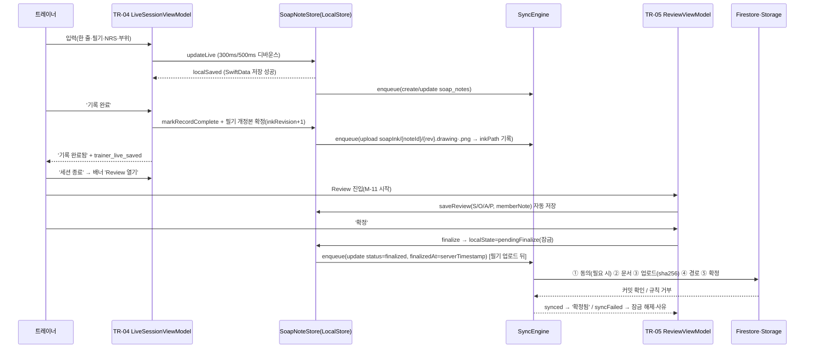
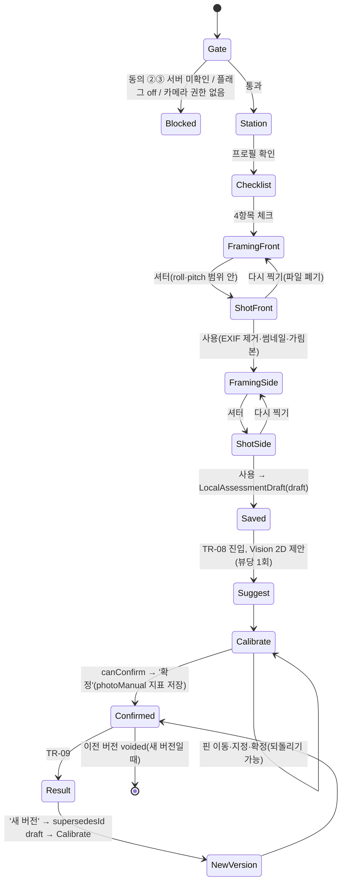
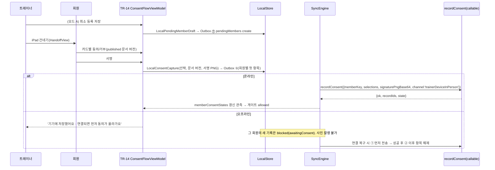

# 트레이너 iPad 앱 상세 명세

| 항목 | 내용 |
|---|---|
| 문서 ID | V1-07 |
| 버전 | v1.0.3 |
| 상태 | 개발 착수 기준(Ready) |
| 작성일 | 2026-09-24 |
| 소유자 | CJH |
| 근거 PRD 절 | §4.2~§4.6(S1·S2·예외), §5.3·§5.5(M-01~M-11, 분석 이벤트), §6.0(공통 규칙·플래그·syncState·C-01~C-06), §6.1(F-ASM-01~06), §6.2(F-BC-01~03), §6.3(F-LIDAR-01~03), §6.4(F-SOAP-01~07), §6.5(F-VIZ-01~07), §6.6(F-LINK-01~05), §6.7(F-PRIV-01~07), §7.1·§7.4·§7.6~§7.8, §8.1·§8.4~§8.6(TR-01~TR-15, AC-IA, AC-A11Y), §9.2·§9.3·§9.5·§9.6, §10.2·§10.3·§10.8(NFR-01~18), 부록 A·B·C |
| 관련 에픽·스토리 | EP-05, EP-06, EP-09, EP-10, EP-11, EP-12, EP-14, EP-15, EP-16, EP-17, EP-19, EP-20, EP-21 / DF-008, DF-012~DF-018, DF-028, DF-039, DF-104, DF-108, DF-110~DF-131, DF-138, DF-140~DF-141, DF-200~DF-226, DF-304, DF-311~DF-313, DF-320~DF-323, DF-325, DF-327~DF-329, DF-382 |
| 변경 규칙 | [문서 변경](01_AGILE_WORKING_AGREEMENT.md#문서-변경) |

## 목차

1. [이 문서의 범위와 읽는 법](#1-이-문서의-범위와-읽는-법)
2. [앱 개요](#2-앱-개요)
3. [앱 구조와 공통 규칙](#3-앱-구조와-공통-규칙)
   - 3.1 모듈·파일 배치 · 3.2 내비게이션 지도 · 3.3 레이아웃 폭 규칙 · 3.4 전역 요소 · 3.5 화면 상태 표준 · 3.6 플래그 게이트 · 3.7 동의 게이트 · 3.8 문구 키·접근성 식별자 · 3.9 분석 이벤트 배치 · 3.10 Preview·UI 테스트 인자 · 3.11 디자인 토큰 기본값 · 3.12 입력 공통(한글·숫자·Pencil)
4. [화면 명세](#4-화면-명세)
   - [4.0 로그인·잠금(FeatureAuth)](#40-로그인잠금featureauth)
   - [4.1 TR-01 오늘(세션 보드)](#41-tr-01-오늘세션-보드)
   - [4.2 TR-02 회원 목록](#42-tr-02-회원-목록)
   - [4.3 TR-03 회원 상세·통합 타임라인](#43-tr-03-회원-상세통합-타임라인)
   - [4.4 TR-04 세션 Live](#44-tr-04-세션-live)
   - [4.5 TR-05 Review](#45-tr-05-review)
   - [4.6 TR-06 Share 미리보기(P2)](#46-tr-06-share-미리보기p2)
   - [4.7 TR-07 체형 촬영](#47-tr-07-체형-촬영)
   - [4.8 TR-08 랜드마크 보정](#48-tr-08-랜드마크-보정)
   - [4.9 TR-09 체형 결과](#49-tr-09-체형-결과)
   - [4.10 TR-10 비교(전후·추이)](#410-tr-10-비교전후추이)
   - [4.11 TR-11 신체조성 입력](#411-tr-11-신체조성-입력)
   - [4.12 TR-12 둘레 입력](#412-tr-12-둘레-입력)
   - [4.13 TR-13 LiDAR 베타(P2)](#413-tr-13-lidar-베타p2)
   - [4.14 TR-14 현장 동의·대기 회원·초대 코드](#414-tr-14-현장-동의대기-회원초대-코드)
   - [4.15 TR-15 설정](#415-tr-15-설정)
5. [흐름 상세](#5-흐름-상세)
   - 5.1 SOAP 편집기(Live→Review→Share) · 5.2 체형 촬영·보정 흐름 · 5.3 현장 동의 흐름 · 5.4 대기 회원→초대→승격 · 5.5 오프라인 시나리오 · 5.6 로그아웃·claim 회수
6. [syncState 표시 규칙](#6-syncstate-표시-규칙)
7. [이식 지도(PORTING MAP)](#7-이식-지도porting-map)
   - 7.1 AppDelegate.swift → 트레이너 앱(모듈별 책임과 이식 원본 줄 범위, 이식 제외 목록) · 7.2 trainer_ios → 트레이너 앱 · 7.3 BodyPath → 트레이너 앱 · 7.4 옮기지 않을 결함
8. [테스트 대응](#8-테스트-대응)
9. [가정(ASM-07-NN)·PRD/스파인 충돌](#9-가정asm-07-nnprd스파인-충돌)
10. [변경 이력](#10-변경-이력)

---

## 1 이 문서의 범위와 읽는 법

### 1.1 정본 관계

- **PRD가 정본이다.** 화면 ID(TR-01~TR-15), 요구사항(F-*), 수용 기준(AC-*), 상태 문구(§6.0.3)는 [PRD](../PRD_V1.md)에서 왔다. 이 문서는 그 요구를 **화면 단위로 구현 가능한 수준**(파일 경로, 뷰 모델 상태, 필드 검증, 상태 매트릭스, 문구 키, 접근성 식별자, 이벤트, 테스트)으로 옮긴다. 충돌하면 PRD가 우선하고, 이 문서에서 찾은 충돌은 [§9.2](#92-prd스파인다른-문서와의-충돌)에 적었다.
- 인접 문서의 정본 범위

  | 주제 | 정본 |
  |---|---|
  | 모듈 계층, 패키지 2분할(TrainerCore·TrainerKit), 조립 지점, Outbox, syncState 계산, 로그인·로그아웃 순서 | [V1-04 아키텍처](04_ARCHITECTURE.md) |
  | 컬렉션 필드·검증식, 규칙, Storage 경로, 로컬 SwiftData 필드 | [V1-05 데이터 모델·규칙](05_DATA_MODEL_AND_RULES.md) |
  | Domain 프로토콜 시그니처, callable 요청·응답, 쿼리 카탈로그 | [V1-06 API 명세](06_API_SPEC.md) |
  | 산식(CVA·기울기·회전), 반올림, BMI, timeOfDayBand, 줄자 평균, seriesBreak, O 후보 선택, elapsed_band, 금지어 매칭 | [V1-09 알고리즘](09_ALGORITHMS_SPEC.md) |
  | 문구 원문(이 문서의 문구 표는 **초안**), 이벤트 레지스트리, 금지어 세트 | [V1-12 문구·분석·린트](12_COPY_ANALYTICS_AND_LINT.md) |
  | 테스트 층, CI job, 실기기 프로토콜 | [V1-10 테스트 계획](10_TEST_PLAN.md) |
  | 스토리 카드(수용 기준 AC-DF-NNN.k) | [V1-02 백로그](02_PRODUCT_BACKLOG.md), [P1b](backlog/P1b.md) 등 |

- 이 문서와 스토리 카드가 다르면 **화면 동작은 이 문서**, 스토리의 범위·점수는 카드를 따른다. 둘을 고치는 PR에서 함께 맞춘다([V1-01 D4](01_AGILE_WORKING_AGREEMENT.md)).

### 1.2 표기

- 화면 ID는 PRD §8.1의 `TR-NN`이다. 로그인 화면은 PRD에 ID가 없어 `로그인(FeatureAuth)`으로 부른다.
- 경로는 `trainer_app/` 기준 **생성 예정 경로**다. 패키지는 V1-04 §6.2에 따라 두 개다.
  - 순수 타깃(TrainerContracts, TrainerDomain, PostureMath, SyncEngine, TrainerAnalytics): `trainer_app/Packages/TrainerCore/Sources/<Target>/`
  - iOS 타깃(LocalStore, FirebaseData, PostureVision, DesignSystem, Feature*): `trainer_app/Packages/TrainerKit/Sources/<Target>/`
  - 조립 지점: `trainer_app/App/` (AppShell, Composition, Resources)
- 문구 키는 `<화면>.<영역>.<의미>`(예 `tr04.action.recordComplete`), 공통은 `common.*`. 문구 원문은 초안이며 V1-12가 정본이다([§3.8](#38-문구-키접근성-식별자)).
- '●'는 필수, '○'는 선택. 'P1a/P1b/P2/P3'는 PRD §12.1 단계.
- 가정은 `ASM-07-NN`(이 문서 범위, [§9.1](#91-가정asm-07-nn))이다. V1-00의 AS-DEV로 올릴 때 새 번호를 받는다.

### 1.3 코드 근거 기준선

- `dfet:경로:줄`은 DFET_Coach 저장소 `feature/integrated-care-2026` 작업 트리(2026-09-24)에서 파일을 직접 열어 확인했다. `dfet:ios/Runner/AppDelegate.swift`는 **작업 트리 9,657줄 기준**이다. DF-039가 2026-09-26 보관 브랜치 `archive/trainer-ui-2026-09` tip `82c6ee9`에서 다시 확인했고 줄 번호가 같았다([§7.1.0](#710-기준선과-읽는-법)). `main`의 AppDelegate(8,800줄)는 줄 번호가 다르므로 이식 원본으로 쓰지 않는다(ASM-07-01).
- `bodypath:경로:줄`은 BodyPath 저장소(`TEhyeok/BodyPath`, 비공개) 2026-09-24 작업 트리 기준이다.
- 개발·테스트·스크린샷 데이터는 모두 합성이다(가상 회원 `synthMember0001` 등, V1-05 §16 시드와 같은 표기). 실데이터, `output/`, `tmp/`, 비밀 파일은 열지 않는다.

---

## 2 앱 개요

| 항목 | 값 | 근거 |
|---|---|---|
| 앱 이름 | D-FET Trainer(`PRODUCT_NAME`, 홈 화면 표시명 같음) | PRD §8.1, D2 |
| 번들 ID | `kr.co.dfet.trainer`(trainer_ios 번들 재사용) | dfet:trainer_ios/project.yml:34, ADR-001 |
| 팀 | MT27Z7369H | NFR-14 |
| 최소 OS | iPadOS 17.0 | NFR-01, AS-DEV-06 |
| 기기 | iPad 전용 `TARGETED_DEVICE_FAMILY "2"`. Q-22(DF-904)에서 iPhone 배포 이력이 확인되면 `"1,2"`로 바꾸고 iPhone은 compact 제한 기능(열람, Live 한 줄)만 제공한다([§3.3](#33-레이아웃-폭-규칙)) | NFR-01, AS-27, Q-22 |
| 방향·멀티태스킹 | 4방향, `UIRequiresFullScreen=false`. Split View·Slide Over·Stage Manager 지원 | NFR-12 |
| 버전 | `MARKETING_VERSION` 0.1(P0) → 0.2(P1a) → 0.3(P1b) → 0.4(P2) → 1.0(P3), 태그 `trainer-vX.Y.Z` | ADR-014 |
| 배포 | P1a~P2 TestFlight 내부 그룹(DF-139, DF-922). P3 채널은 Q-DEV-02 | AS-DEV-08 |
| 권한 문자열 | `NSCameraUsageDescription`(P1b, 문구 키 `infoPlist.camera`: '회원의 자세 사진을 이 앱 안에서만 촬영하고 보관합니다.'). 사진 보관함 저장 권한(`NSPhotoLibraryAddUsageDescription`)은 넣지 않는다. 결과지 사진 가져오기는 `PHPickerViewController`라 권한이 필요 없다 | F-ASM-01.7, F-BC-02.1, V1-04 §6.3 |
| Firebase | Auth, Firestore, Storage, Functions(asia-northeast3 callable), App Check(Release App Attest, DEBUG debug provider). Analytics는 G-09 전 링크하지 않는다 | NFR-02, NFR-09, ADR-015 |
| 로컬 저장 | SwiftData 편집 원본(LocalStore), 트레이너별 파티션, `NSFileProtectionComplete`, 백업 제외 | ADR-002, NFR-17, V1-04 §9 |
| 위젯·App Group | 없음 | AS-DEV-05, NFR-14 |
| 외부 네트워크 | Firebase·Google API·Apple 도메인만. 아바타는 로컬 이니셜 | NFR-11 |
| 운영 모드 | wellnessMode 하나. 진단·질환명·KCD·중재 입력 경로 없음 | D1, §3.4, F-PRIV-06.1 |

### 2.1 단계별 화면 제공 범위

| 단계 | 앱 버전 | 제공 화면(플래그 on 기준) | 비고 |
|---|---|---|---|
| P0 | 0.1 | 로그인, AppShell, TR-02(uid 담당 회원 목록 기초), TR-15(로그아웃·큐 상태) | 기록 작성 없음. 에뮬레이터·합성 데이터 |
| P1a | 0.2 | + TR-01, TR-02(대기 회원), TR-03(목록형 타임라인), TR-04, TR-05(O 자동 불러오기 제외), TR-11, TR-12, TR-14(현장 동의), TR-15(빠른 문구 기본) | `soapV2`, `bodyComposition` |
| P1b | 0.3 | + TR-05 O 자동 불러오기, TR-07~TR-10, TR-15 스테이션 프로필, TR-03 체형 이벤트 | `bodyAssessment` |
| P2 | 0.4 | + TR-06, TR-13(내부 트레이너), TR-14 초대 코드, TR-03 밀도 띠·확장 필터, SceneKit 보조 보기, 맞춤 문구 | `memberShare`, `lidarBeta` |
| P3 | 1.0 | 판정 배지·MDC 밴드 표시(서버 결과), '온라인 필요' 판정 자리 | 정책 G-08 |

---

## 3 앱 구조와 공통 규칙

### 3.1 모듈·파일 배치

화면별 Feature 타깃과 주요 파일이다. 타깃 책임·의존 규칙은 V1-04 §6~§7이 정본이다. 각 화면 파일 첫 줄에 `/// TR-NN` 문서 주석을 단다.

| 화면 | 타깃 | 주요 파일(`trainer_app/Packages/TrainerKit/Sources/<Target>/…`) | 뷰 모델 |
|---|---|---|---|
| 로그인·잠금 | FeatureAuth | `LoginView.swift`, `LockedView.swift` | `LoginViewModel` |
| AppShell | App 타깃 | `trainer_app/App/AppShell/TrainerShellView.swift`, `TrainerRoute.swift`, `SidebarView.swift`, `SessionFlowCover.swift`, `CaptureFlowCover.swift` | `ShellViewModel` |
| TR-01 | FeatureToday | `TodayBoardView.swift`, `TodayListSection.swift`, `ReviewQueueSection.swift`, `DailySessionCountCard.swift`, `ReassessmentDueSection.swift` | `TodayBoardViewModel` |
| TR-02 | FeatureMembers | `List/MemberListView.swift`, `List/MemberRow.swift` | `MemberListViewModel` |
| TR-03 | FeatureMembers | `Detail/MemberDetailView.swift`, `Detail/MemberHeaderView.swift`, `Timeline/TimelineView.swift`, `Timeline/TimelineRow*.swift`, `Timeline/PostureTimelineRow.swift`(P1b), `Timeline/DensityStripView.swift`(P2) | `MemberDetailViewModel`, `TimelineViewModel` |
| TR-04 | FeatureSOAP | `Live/LiveSessionView.swift`, `Live/LiveHeaderBar.swift`, `Live/LiveSideRail.swift`, `Live/LiveBottomBar.swift`, `Live/ConsentBlockCard.swift` | `LiveSessionViewModel` |
| TR-05 | FeatureSOAP | `Review/ReviewView.swift`, `Review/FinalizeChecklistBar.swift`, `Review/SubjectiveCard.swift`, `Review/Objective/ObjectiveTable.swift`, `Review/Objective/ObjectiveRowEditor.swift`, `Review/Objective/AutoLoadPanel.swift`(P1b), `Review/AssessmentCard.swift`, `Review/PlanCard.swift`, `Review/MemberNoteField.swift`, `Review/AddendumSheet.swift`, `Review/InkPreviewPane.swift` | `ReviewViewModel`, `AutoLoadViewModel` |
| TR-06 | FeatureShare | `SharePreviewView.swift`, `InternalRecordPanel.swift`, `MemberPreviewRenderer.swift`, `BodyReportComposer.swift` | `ShareViewModel` |
| TR-07 | FeatureAssessment | `Capture/CaptureView.swift`, `Capture/CaptureGateView.swift`, `Capture/ChecklistPanel.swift`, `Capture/CameraOverlay.swift`, `Capture/ViewPicker.swift` | `CaptureViewModel` |
| TR-08 | FeatureAssessment | `Calibration/CalibrationView.swift`, `Calibration/LandmarkListPanel.swift`, `Calibration/NudgePad.swift`, `Calibration/MetricPreviewStrip.swift` | `CalibrationViewModel` |
| TR-09 | FeatureAssessment | `Result/AssessmentResultView.swift`, `Result/BaselineToggle.swift`, `Result/PhotoDeleteSheet.swift` | `AssessmentResultViewModel` |
| TR-10 | FeatureInsights | `Compare/CompareView.swift`, `Compare/SideBySideView.swift`, `Compare/OverlayCompareView.swift`, `Trend/TrendView.swift`, `Trend/PainTrendView.swift` | `CompareViewModel`, `TrendViewModel` |
| TR-11 | FeatureBodyComposition | `BodyComposition/BodyCompositionFormView.swift`, `BodyComposition/ReportPhotoPane.swift`, `BodyComposition/CorrectionSheet.swift`, `BodyComposition/MiniTrendView.swift` | `BodyCompositionFormViewModel` |
| TR-12 | FeatureBodyComposition | `Circumference/CircumferenceFormView.swift`, `Circumference/TapeRowView.swift`, `Circumference/AddSiteMenu.swift` | `CircumferenceFormViewModel` |
| TR-13 | FeatureLidarBeta | `LidarBetaView.swift`, `ImportFlow/ResultImportView.swift`, `ScanDetailView.swift` | `LidarBetaViewModel` |
| TR-14 | FeatureConsent | `Registration/PendingMemberRegistrationView.swift`, `Handoff/HandoffView.swift`, `Cards/ConsentCardView.swift`, `Signature/SignaturePadView.swift`, `State/ConsentStateView.swift`, `Invite/InviteCodeView.swift`(P2) | `ConsentFlowViewModel`, `InviteViewModel` |
| TR-15 | FeatureSettings | `SettingsView.swift`, `SyncQueueView.swift`, `StationProfiles/StationProfileListView.swift`(P1b), `QuickPhrases/QuickPhraseView.swift`, `DeviceModels/DeviceModelListView.swift`, `Debug/DebugMenuView.swift`(`#if DEBUG`) | `SettingsViewModel` |

공통 컴포넌트는 DesignSystem에 둔다: `SyncStateBadge`, `GlobalSyncBar`, `SourceGradeChip`, `MetricRow`, `ChangeBadge`, `SeriesTrendChart`, `PencilCanvas`, `PencilToolbar`, `PainScale`, `BodyMap`, `EmptyState`, `LoadFailedView`, `ComingSoonLabel`, `CompositionSafeTextField`, `NumericField`, `InitialAvatar`, `ChecklistRow`, `Posture/PostureOverlayCanvas`, `Posture/PostureDeviationTable`(편위 표 렌더러, P1b 결정 G-P1b-5), `ProhibitedTermInlineWarning`.

### 3.2 내비게이션 지도

```
NavigationSplitView (3단: sidebar | content | detail)
┌ sidebar ─────────────┐┌ content ─────────────────┐┌ detail ───────────────────────────────┐
│ 오늘          ───────▶│ TR-01 오늘 목록·Review 대기 ││ (선택 회원 요약 또는 빈 상태)            │
│ 회원          ───────▶│ TR-02 회원 목록            ││ TR-03 회원 상세·타임라인                 │
│                        │                           ││   ├ push: TR-09 체형 결과(P1b)           │
│                        │                           ││   ├ push: TR-10 비교(P1b)               │
│                        │                           ││   ├ push: TR-13 LiDAR 베타(P2, flag)    │
│                        │                           ││   ├ sheet: TR-11 신체조성, TR-12 둘레   │
│                        │                           ││   └ sheet: TR-14 동의·초대              │
│ (하단) 동기화 표시줄   │                           ││                                        │
│ (하단) 설정   ───────▶│ TR-15 설정                 ││ TR-15 하위(큐, 스테이션, 문구 …)         │
└────────────────────────┘└───────────────────────────┘└────────────────────────────────────────┘

fullScreenCover ① 세션 흐름: TR-04 Live ─세션 종료→ (닫고 배너) / 'Review 열기' → TR-05 Review ─(P2)→ TR-06
fullScreenCover ② 촬영 흐름(P1b): TR-07 촬영 ─두 장 완료→ TR-08 보정 ─확정→ (닫고) detail에 TR-09 push
sheet(.large): TR-06 bodyReport 모드(P2, TR-09/10/11에서 '회원 리포트 만들기')
```

- 라우트 정의는 V1-04 §8.3의 `TrainerRoute`를 그대로 쓴다. 각 case와 표시 방식은 다음과 같다.

  | `TrainerRoute` case | 화면 | 표시 방식 | 플래그(없으면 진입점 숨김) |
  |---|---|---|---|
  | `.today` | TR-01 | sidebar → content | `soapV2`(끄면 '오늘' 항목 대신 회원 목록만) |
  | `.members` | TR-02 | sidebar → content | 없음 |
  | `.member(MemberKey)` | TR-03 | detail | 없음 |
  | `.live(NoteID)` | TR-04 | fullScreenCover ① | `soapV2` |
  | `.review(NoteID)` | TR-05 | fullScreenCover ① 안 push 또는 단독 cover | `soapV2`(끄면 기존 draft 열람만, ASM-07-02) |
  | `.share(ShareTarget)` | TR-06 | ①에서 push(soapNote) / sheet(bodyReport) | `memberShare` |
  | `.capture(AssessmentID)` | TR-07 | fullScreenCover ② | `bodyAssessment` |
  | `.landmarks(AssessmentID)` | TR-08 | ② 안 push | `bodyAssessment`(끄면 기존 draft 열람만) |
  | `.result(AssessmentID)` | TR-09 | detail push | 열람은 항상, 생성·수정 버튼만 `bodyAssessment` |
  | `.compare(MemberKey)` | TR-10 | detail push | `bodyAssessment` 또는 `bodyComposition` |
  | `.bodyComposition(MemberKey)` | TR-11 | sheet(.large) | `bodyComposition` |
  | `.circumference(MemberKey)` | TR-12 | sheet(.large) | `bodyComposition` |
  | `.lidar(MemberKey)` | TR-13 | detail push | `lidarBeta` |
  | `.consent(MemberKey?)` | TR-14 | sheet(.large, `interactiveDismissDisabled`) | 없음(항상). 초대 코드 영역만 `memberShare` |
  | `.settings` | TR-15 | sidebar 하단 → content/detail | 없음 |

- 사이드바 항목은 '오늘', '회원', 하단 '설정' 세 개다. Runner의 schedule·program·alerts(dfet:ios/Runner/AppDelegate.swift:7876-7885)는 라우트를 만들지 않는다(AS-21). '추후 추가 예정' 자리 표시도 두지 않는다(ASM-07-03).
- 세션 흐름(①)과 촬영 흐름(②)은 **전체 화면**이다. Live 중에는 사이드바·목록·다른 회원 정보가 보이지 않는다(PRD §8.1). ①② 안에서는 다른 cover를 열지 않는다. TR-14가 필요하면 cover 위에 sheet로 연다(예외: Live의 '동의 필요' 경로).
- 딥링크·URL 스킴은 v1에서 두지 않는다. TR-13의 결과 패키지 가져오기만 문서 유형(UTType) 열기로 진입한다([§4.13](#413-tr-13-lidar-베타p2)).

**진입·이탈 요약**

| 화면 | 주 진입 | 이탈 |
|---|---|---|
| TR-01 | 사이드바 '오늘'(기본 라우트) | 행 탭 → TR-04(또는 이어쓰기 선택), Review 대기 행 → TR-05, 회원명 → TR-03 |
| TR-02 | 사이드바 '회원' | 행 → TR-03, '+ 대기 회원 등록' → TR-14 |
| TR-03 | TR-02 행, TR-01 회원명 | 'Live 시작' → TR-04, 측정 → TR-11/12, 체형 → TR-07, 비교 → TR-10, 동의 → TR-14, 타임라인 항목 → TR-05/09/11/12/13 |
| TR-04 | TR-01 행, TR-03 'Live 시작' | '세션 종료' → 원래 화면 + Review 배너, '다음 회원' → 다음 회원 TR-04, 'Review로' → TR-05 |
| TR-05 | Live 종료 후 배너, TR-01 Review 대기, TR-03 SOAP 항목 | '확정' → 닫기(원래 화면), '확정 후 공유 미리보기'(P2) → TR-06, '닫기' → draft 유지 |
| TR-06 | TR-05(P2), TR-09/10/11 '회원 리포트 만들기'(P2), TR-03 공유 항목 | '공유'·'해제'·'취소' → 이전 화면 |
| TR-07 | TR-03 '체형평가', TR-09 '다시 촬영(새 버전)' | 두 장 완료 → TR-08, '닫기' → draft 유지 |
| TR-08 | TR-07, TR-09 '보정 계속'·'새 버전(재보정)' | '확정' → TR-09, '닫기' → draft 유지 |
| TR-09 | TR-08 확정, TR-03 체형 항목 | '비교' → TR-10, '회원 리포트 만들기'(P2) → TR-06, 편위 표 행 → TR-10 추이 |
| TR-10 | TR-03 '비교', TR-09 | 점 탭 → 원 기록, '회원 리포트 만들기'(P2) → TR-06 |
| TR-11 | TR-03 '측정 입력 > 신체조성' | '저장' → sheet 닫기, '정정' → 새 입력 |
| TR-12 | TR-03 '측정 입력 > 둘레' | '저장' → sheet 닫기 |
| TR-13 | TR-03 'LiDAR(베타)', 파일 열기(결과 패키지) | 목록·상세 |
| TR-14 | TR-02 '+ 대기 회원 등록', TR-03 '동의·초대', TR-04/TR-11/TR-12/TR-07 '동의 필요' 링크 | '완료' → 호출 화면 복귀 |
| TR-15 | 사이드바 '설정', 전역 동기화 표시줄 '실패 n건 보기' | — |

### 3.3 레이아웃 폭 규칙

compact 전환 기준은 방향명이 아니라 **창의 실제 사용 가능 폭**이다(NFR-12, dfet:trainer_ios/design.md:32). 뷰는 `GeometryReader`나 `ViewThatFits`가 아니라 AppShell이 계산해 환경값으로 내려 주는 `LayoutClass`로 분기한다.

```swift
// DesignSystem/Layout/LayoutClass.swift
public enum LayoutClass: Equatable, Sendable {
  case wide     // 창 폭 ≥ 1180pt : 3단, SOAP·보정 작업면 + 우측 패널
  case regular  // 700pt ≤ 폭 < 1180pt : 2단(sidebar 숨김 가능), 우측 패널은 접이식
  case narrow   // 폭 < 700pt : 스택(NavigationStack), 패널은 하단 시트
  public static func from(width: CGFloat) -> LayoutClass
}
extension EnvironmentValues { public var layoutClass: LayoutClass }
```

| 창 상황(대표 기기) | 폭(pt, 대략) | 클래스 | 셸 구성 |
|---|---|---|---|
| 13형 iPad 가로 전체 | 1366 | wide | sidebar + content + detail |
| 11형 가로 전체 | 1194(1180 이상) | wide | 3단 |
| 11형·13형 세로 전체 | 834~1024 | regular | sidebar 접힘(버튼), content + detail |
| 가로 Split View 1/2 | 590~678 | narrow | 스택 |
| 가로 Split View 2/3 | 780~900 | regular | content + detail |
| Split View 1/3, Slide Over | 320~375 | narrow | 스택, 제한 기능 없음(모든 화면 동작해야 함) |

- 홈(TR-01)은 detail 폭 1120pt, SOAP(TR-04·TR-05)는 1180pt 미만이면 compact 구조로 내려간다(dfet:trainer_ios/design.md:32의 시작값). 그 밖 화면은 위 표를 따른다. 최종 값은 Q-10(DF-914)에서 확정하며 700pt 경계는 ASM-07-04다.
- 회전·창 크기 변경 시 입력 중 텍스트, 필기, 선택 상태, 스크롤 위치를 잃지 않는다(NFR-12). 모든 편집 상태는 뷰 모델(@Observable)에 있고 뷰 재생성과 무관하다.
- 모든 TR 화면은 1/3 Split View에서 잘림 없이 동작한다(NFR-12 수용 기준). Live '기록 완료'는 모든 폭에서 스크롤 없이 닿는다.
- Q-22가 Universal로 결정되면 iPhone(compact)에서는 TR-01·TR-02·TR-03 열람과 TR-04의 한 줄 입력·'기록 완료'만 노출하고, 촬영·보정·측정 입력·동의 서명 진입점은 숨긴다(NFR-01, ASM-07-05).

### 3.4 전역 요소

| 요소 | 위치 | 내용 | 근거 |
|---|---|---|---|
| 전역 동기화 표시줄 `GlobalSyncBar` | sidebar 하단(wide·regular), 내비게이션 바 하단 한 줄(narrow). ①② cover 안에서는 헤더 우측 `SyncStateBadge`로 대체 | '동기화 대기 {n}건'(n>0), '동기화 실패 {m}건 · 보기'(m>0, 탭 → TR-15 큐), '오프라인'(네트워크 없음). 모두 0이고 온라인이면 숨김 | NFR-06 '동기화 대기 건수 전역 표시줄', M-G3 |
| 기기 암호 경고 배너 | 로그인 화면, TR-15 상단 | '기기 암호가 설정되지 않아 저장된 기록이 보호되지 않아요' | V1-04 ASM-04-17 |
| 구성 오류 화면 | 앱 전체 | Release에서 plist가 없을 때 '앱 구성 오류 · 관리자에게 문의' (Preview로 대체 금지) | V1-04 §8.1 |
| 로컬 저장소 격리 안내 | 앱 전체 | 저장소를 열 수 없을 때 '기기 저장소를 열 수 없어 안전한 곳으로 옮겼어요' + TR-15 지원 안내 | V1-04 §9.3 |

- '저장됨' 단독 문구, 결과와 무관한 성공 표시, 토스트로만 끝나는 실패 알림은 쓰지 않는다(C-05, 반례 dfet:trainer_ios/DFETTrainer/Domain/TrainerStore.swift:177-191). 실패는 해당 항목의 `SyncStateBadge`와 전역 표시줄 두 곳에 남는다.

### 3.5 화면 상태 표준

모든 목록·상세 뷰 모델은 같은 로드 상태 타입을 쓴다.

```swift
// TrainerDomain/UI/LoadState.swift (UI 비의존 값 타입)
public enum LoadState<Value: Sendable>: Sendable {
  case idle
  case loading(cached: Value?)          // 캐시가 있으면 캐시를 보이며 갱신
  case loaded(Value)
  case empty                            // 쿼리 성공 + 0건
  case failed(UserFacingError, cached: Value?)
}
public struct UserFacingError: Error, Equatable, Sendable {
  public enum Kind: String, Sendable { case permissionDenied, indexMissing, network, notFound, unavailable, unknown }
  public let kind: Kind
  public let code: String               // 로그용 코드(수치·식별자 없음)
}
```

| 상태 | 표시 | 문구 키(초안) | 규칙 |
|---|---|---|---|
| 불러오는 중 | 캐시가 있으면 캐시 + 상단 얇은 진행 표시. 없으면 스켈레톤 행 3개 | — | 스피너 단독 화면 금지. 300ms 안에 끝나면 표시하지 않음 |
| 빈 상태 | `EmptyState`(아이콘, 한 줄 제목, **다음 행동 버튼 하나**) | 화면별 `trNN.empty.*` | 쿼리 성공 0건일 때만(§8.4) |
| 불러오기 실패 | `LoadFailedView`: '불러오기 실패' + 사유 한 줄 + '다시 시도' | `common.state.loadFailed`, `common.error.<kind>`, `common.action.retry` | 권한 거부·인덱스 누락·타임아웃을 빈 상태로 바꾸지 않는다(§9.6, AC-VIZ-05.4). 오류 코드는 `os.Logger`에 `.private` 없이 코드만 |
| 권한 없음 | '불러오기 실패'와 사유 '이 회원 기록을 볼 권한이 없어요(담당이 바뀌었을 수 있어요)' | `common.error.permissionDenied` | 담당 해제 후(AC-LINK-03.1). 재시도 버튼은 두되 목록에서 회원을 빼는 동작은 서버 목록 갱신에 맡긴다 |
| 오프라인 | 캐시·로컬 데이터 + 상단 '오프라인 · 최신이 아닐 수 있어요' | `common.state.offlineStale` | 서버 결과가 필요한 동작(공유, 초대, 판정 표시)은 '온라인 필요' |
| 온라인 필요 | 버튼 비활성 + 보조 문구 | `common.onlineRequired` | TR-06, TR-14 초대, P3 판정 자리, 동의 상태 최초 확인 |
| 동의 없음 | 입력·진입 비활성 + '동의 {번호} 필요 · 현장 동의 열기'(TR-14) | `common.consent.required.<type>`, `common.consent.openTR14` | §8.4 '동의 없음', [§3.7](#37-동의-게이트) |
| 동의 확인 대기 | 기록은 로컬에만, 배지 '동의 확인 대기' | `common.sync.awaitingConsent` | F-PRIV-03.7 |
| 플래그 꺼짐 | **진입점 자체가 없다**. 이미 열려 있던 화면에서 플래그가 꺼지면 편집 비활성 + '이 기능은 지금 사용할 수 없어요' | `common.flag.disabled` | AC-IA-02, AS-18(기존 기록 열람은 유지) |
| 산정 준비 중 | 변화 칸·배지 자리 '산정 준비 중', 수치는 표시 | `common.state.pendingPolicy` | C-03, AC-C-03.1 |
| 판정 불가 | 점선 원 글리프 + '판정 불가 · {사유}' | `common.change.indeterminate`, `common.reason.<reasonCode>` | 사유 없는 표시는 테스트 실패(AC-VIZ-07.4) |
| 추후 추가 예정 | `ComingSoonLabel` | `common.state.comingSoon` | 이식됐지만 미구현인 진입점에만. v1은 해당 진입점이 없도록 설계한다(ASM-07-03) |

화면별 적용(PRD §8.4 매트릭스 + 이 문서가 더한 '불러오는 중'·'불러오기 실패'·'플래그 꺼짐'). O는 스냅샷·UI 테스트 필수 칸이다(AC-IA-01).

| 화면 | 빈 | 동의 없음 | 산정 준비 중 | 판정 불가 | 베타 | 오프라인·동기화 | 동기화 실패 | 추후 추가 예정 | 불러오기 실패 | 플래그 꺼짐 |
|---|---|---|---|---|---|---|---|---|---|---|
| TR-01 | O | — | — | — | — | O | O | O(※) | O | O |
| TR-02 | O | O | — | — | — | O | — | — | O | — |
| TR-03 | O | O | O | O | O | O | — | — | O | O |
| TR-04 | — | O(②) | — | — | — | O | O | — | — | O |
| TR-05 | — | O(②) | O | O | — | O | O | — | O(자동 불러오기) | O |
| TR-06 | — | O(③) | O | O | — | O | O | — | O | O |
| TR-07 | — | O(②③) | — | — | — | O | O | — | — | O |
| TR-08 | — | O(③) | — | — | — | O | O | — | — | — |
| TR-09 | — | O(③) | O | O | — | O | O | — | O | — |
| TR-10 | O | O(③) | O | O | — | O | — | — | O | O |
| TR-11 | O | O(②) | O | O | — | O | O | — | O(미니 추이) | O |
| TR-12 | O | O(②) | O | O | O(대조) | O | O | — | — | O |
| TR-13 | O | O(②③) | — | O(`betaMetric`) | O | O | O | — | O | O |
| TR-14 | — | — | — | — | — | O | O | — | O(문서 버전) | — |
| TR-15 | — | — | — | — | — | O | O | O(※) | — | — |

※ PRD §8.4는 TR-01·TR-15에 '추후 추가 예정'을 O로 두지만 v1 설계에는 해당 진입점이 없다. 스냅샷은 `ComingSoonLabel` 컴포넌트 단위 테스트 하나로 대신한다(ASM-07-03).

### 3.6 플래그 게이트

플래그 값은 `FeatureFlagReader.observeFlags()`(문서·키가 없으면 false)로 읽고, AppShell이 **라우트를 만들기 전에** 진입점을 숨긴다(AC-IA-02, ADR-010). 뷰 모델은 쓰기 직전에 한 번 더 확인한다. 규칙 `featureOn`이 서버에서도 막는다.

| 플래그 | 숨기는 진입점 | 유지되는 것(AS-18) |
|---|---|---|
| `soapV2` | 사이드바 '오늘', TR-03 'Live 시작', TR-01 행의 Live 진입, TR-05 편집·확정 | TR-03 타임라인의 기존 SOAP 열람(읽기 전용 TR-05) |
| `bodyComposition` | TR-03 '측정 입력' 메뉴(TR-11·TR-12), TR-05 자동 불러오기의 신체조성·줄자 후보 | 기존 기록 열람, TR-10 추이 |
| `bodyAssessment` | TR-03 '체형평가', TR-09 '새 버전'·'다시 촬영'·'재검사', TR-10 진입(측정 플래그도 꺼졌을 때) | TR-03 체형 이벤트, TR-09 읽기 전용(ASM-P1b-26) |
| `memberShare` | TR-05 '확정 후 공유 미리보기', TR-09/10/11 '회원 리포트 만들기', TR-14 초대 코드 영역, TR-03 '공유' 동작 | TR-03의 공유·해제 이력 열람 |
| `lidarBeta` | TR-03 'LiDAR(베타)', 타임라인 스캔 이벤트·필터(AC-VIZ-05.1, AC-LIDAR-01.1), TR-05 스캔 후보, TR-12 대조 입력 | 없음(베타 표시 전체 숨김) |

- DEBUG 빌드에서만 TR-15 DEBUG 메뉴의 로컬 오버라이드가 동작한다. Release는 무시한다(ADR-010). 오버라이드는 클라이언트 표시만 바꾸므로 에뮬레이터 `appConfig/features`와 맞춰야 쓰기가 통과한다.
- 플래그 변경은 실시간 반영한다. 편집 중인 화면에서 플래그가 꺼지면 입력을 잠그고 `common.flag.disabled`를 보이되, 이미 입력한 로컬 draft는 지우지 않는다(ASM-07-06).

### 3.7 동의 게이트

동의 판단은 `ConsentService.observeState(member:)`의 서버 파생 상태(`memberConsentStates/{memberKey}`)로만 한다(F-PRIV-01.4). 뷰 모델은 아래 순수 함수를 쓴다.

```swift
// TrainerDomain/Consent/ConsentGate.swift
public enum ConsentRequirement: Sendable { case healthData, bodyImaging, research }
public enum ConsentGateResult: Equatable, Sendable {
  case allowed
  case awaitingConsent                    // 로컬 현장 동의 캡처만 있음(서버 미확인)
  case missing([ConsentType])             // 없는 동의 목록(표시 순서 ②③⑤)
  case unknown                            // 상태를 한 번도 받지 못함(오프라인 첫 진입)
}
public protocol ConsentGate: Sendable {
  func evaluate(member: MemberKey, requires: Set<ConsentRequirement>, allowAwaiting: Bool) -> ConsentGateResult
}
```

| 동작 | 필요 동의 | `allowAwaiting` | 결과별 UI |
|---|---|---|---|
| Live 기록(TR-04), Review 저장(TR-05) | ② | true | `awaitingConsent`: 입력 허용, 배지 '동의 확인 대기'. `missing`: 입력 비활성 + TR-14 링크(AC-SOAP-01.8). `unknown`: 오프라인이면 입력 허용하되 `awaitingConsent`와 같게 로컬 보류, 온라인이면 로딩(ASM-07-07) |
| 신체조성·줄자 저장(TR-11·TR-12), 결과지 첨부 | ② | true | 저장 버튼 비활성 + '건강정보 동의(②) 필요'(AC-PRIV-01.1) |
| 체형 촬영 진입(TR-07), 로컬 사진 생성 | ② **그리고** ③ | **false** | `awaitingConsent`·`unknown`도 차단. 로컬 사진 파일을 만들지 않는다(AC-ASM-01.1, F-PRIV-03.7) |
| 사진 표시·다운로드(TR-08~TR-10, TR-03 썸네일) | ③ | false | '사진 동의 없음' 표시, 좌표 도식도 숨김, 사진 요청 0건(AC-VIZ-02.5) |
| 재검사 모드(TR-07) | ②③⑤ + 연구참여 동의서 기록 | false | 재검사 토글 비활성(AC-ASM-05.1) |
| 대기 회원 키 입력(TR-14 `heightCm`) | ② | false | 키 입력 칸 숨김(F-LINK-01.1) |
| LiDAR 결과 가져오기(TR-13) | ②③, 가입 회원만 | false | 가져오기 거부 사유 표시(F-LINK-01.7) |
| bodyReport 사진 토글(TR-06) | ③ | false | 토글 비활성(AC-SOAP-05.11) |

- 동의 번호 표기: ① 필수(`required`), ② 건강정보(`healthData`), ③ 신체 사진·영상(`bodyImaging`), ④ 인계(`sharing`), ⑤ 연구(`research`). 칩 라벨은 문구 키 `common.consent.short.<type>`.
- 트레이너 앱은 동의 상태를 **표시·게이트에만** 쓰고 분석 이벤트에 넣지 않는다(§5.5 원칙).

### 3.8 문구 키·접근성 식별자

**문구 키**

- 모든 사용자 노출 문자열은 `trainer_app/App/Resources/Localizable.xcstrings`에 키로 둔다(V1-04 §5 배치. V1-01의 `trainer_app/App/Localizable.xcstrings` 표기와 다르며 [§9.2](#92-prd스파인다른-문서와의-충돌) C-07-01). 뷰에서 문자열 리터럴을 직접 쓰지 않는다(copy-lint 대상, ADR-016).
- 키 형식 `<scope>.<area>.<meaning>`. scope는 `common`, `login`, `tr01`~`tr15`, `infoPlist`. 보간은 `%@`/`%lld` 대신 String Catalog의 이름 있는 치환(`{count}` 형태 주석)으로 기록하고, 복수형은 카탈로그 plural 변형을 쓴다.
- 이 문서의 문구는 **초안**이고 V1-12가 정본이다. 초안도 부록 C 트레이너 규칙 세트를 통과하도록 썼다(진단·치료·교정·재활·거북목·정상/비정상·체형 점수 등 없음).

공통 문구 키(초안)

| 키 | 초안 | 근거 |
|---|---|---|
| `common.sync.localSaved` | 기기에 저장됨 | §6.0.3 |
| `common.sync.syncing` | 동기화 중 | §6.0.3 |
| `common.sync.synced` | 동기화됨 | §6.0.3 |
| `common.sync.syncFailed` | 동기화 실패 | §6.0.3 |
| `common.sync.awaitingConsent` | 동의 확인 대기 | §6.0.3 |
| `common.sync.pendingCount` | 동기화 대기 {n}건 | NFR-06 |
| `common.sync.failedCount` | 동기화 실패 {n}건 · 보기 | M-G3 |
| `common.sync.offline` | 오프라인 | — |
| `common.state.offlineStale` | 오프라인 · 최신이 아닐 수 있어요 | §8.4 |
| `common.state.loadFailed` | 불러오기 실패 | §9.6 |
| `common.action.retry` | 다시 시도 | — |
| `common.error.permissionDenied` | 이 회원 기록을 볼 권한이 없어요. 담당이 바뀌었을 수 있어요 | AC-LINK-03.1 |
| `common.error.network` | 네트워크에 연결할 수 없어요 | — |
| `common.error.indexMissing` | 목록을 준비하지 못했어요(관리자 확인 필요) | §9.6 |
| `common.onlineRequired` | 온라인 필요 | ADR-006 |
| `common.state.pendingPolicy` | 산정 준비 중 | C-03, §7.6 |
| `common.state.notMeasured` | 미측정 | F-BC-03 |
| `common.state.notEntered` | 미입력 | F-SOAP-01.2 |
| `common.state.comingSoon` | 추후 추가 예정 | dfet:design.md:258 |
| `common.state.screening` | 스크리닝 | §6.0.3 |
| `common.state.reference` | 참고 | §6.0.3 |
| `common.state.beta` | 관측 단면 · 실측 대조 전 · 베타/참고 | §6.3 |
| `common.change.indeterminate` | 판정 불가 · {reason} | §6.0.3 |
| `common.reason.conditionMismatch` / `deviceChanged` / `protocolChanged` / `noMdc` / `noComparison` / `referenceMetric` / `betaMetric` | 조건 불일치 / 기기 변경 / 프로토콜 변경 / MDC 미확보 / 비교할 측정 없음 / 참고 지표 / 베타 값 | §7, 부록 B.4 |
| `common.sourceGrade.tape` … `derived` | 줄자 실측 / 기기 측정 · {deviceModel} / 사진 측정(확정) / 사진 자동 추정 · 스크리닝 / 관측 단면 · 실측 대조 전 · 베타/참고 / 본인 보고 / 트레이너 관찰 / 계산값 | §7.1 트레이너 UI 라벨 |
| `common.consent.required.healthData` | 건강정보 동의(②) 필요 | AC-PRIV-01.1 |
| `common.consent.required.bodyImaging` | 신체 사진 동의(③) 필요 | AC-ASM-01.1 |
| `common.consent.required.research` | 연구 동의(⑤)와 연구참여 동의서 필요 | AC-ASM-05.1 |
| `common.consent.openTR14` | 현장 동의 열기 | §8.4 |
| `common.consent.unknown` | 동의 상태를 확인하려면 온라인이 필요해요 | ASM-07-07 |
| `common.flag.disabled` | 이 기능은 지금 사용할 수 없어요 | AC-IA-02 |
| `common.badge.pending` | 대기 | TR-02 |
| `common.badge.voided` | 무효 처리됨 | F-VIZ-05.4 |
| `common.badge.sourceChanged` | 원본 변경됨 | F-SOAP-03.6 |
| `common.action.cancel` / `close` / `save` / `done` | 취소 / 닫기 / 저장 / 완료 | — |

**접근성 식별자**

- 형식 `<scope>.<element>`(예 `tr04.recordComplete`, `tr07.shutter`, `tr14.invite.code`). 목록 항목은 `<scope>.row.<index>`가 아니라 합성 ID(`tr02.row.synthMember0001`) — UI 테스트가 순서에 의존하지 않게 한다. 회원 uid를 식별자에 쓰는 것은 테스트 빌드에서만 허용하고 로그에 남기지 않는다(ASM-07-08).
- VoiceOver 수치 문장은 PRD §8.6 A-03 템플릿 하나만 쓴다. DesignSystem `MetricAccessibility.sentence(for:)`가 만든다.

```swift
// DesignSystem/Accessibility/MetricAccessibility.swift
// "{지표 한글명} {값}{단위}, {측면}, 출처 {출처 라벨}, {측정일}, 변화 {상태 문구}[, 사유 {사유}]"
public enum MetricAccessibility {
  public static func sentence(metric: MetricCode, value: Double?, unit: String, side: Side,
                              sourceGrade: SourceGrade, measuredAt: Date,
                              change: ChangeDisplay) -> String
}
public enum ChangeDisplay: Equatable, Sendable {
  case pendingPolicy, beforeConfirm, referenceNoJudgement, betaReference
  case status(ChangeStatus, reason: ReasonCode?)   // P3
}
```

- 값이 없으면 '미측정', 정책이 없으면 '변화 산정 준비 중', 베타는 '실측 대조 전 베타 참고값'을 넣는다(A-03).

### 3.9 분석 이벤트 배치

이벤트명·속성은 `contracts/analytics-events.v1.json`(DF-033) 허용 목록의 생성 enum `TrainerEvent`만 쓴다. G-09 전에는 `DebugSink`(콘솔 기록만)다(ADR-015). 속성에는 건강 수치, 판정 결과, 동의 유형, 이름·이메일, 자유 메모, 경로, 통증 부위, uid를 넣지 않는다(§5.5, NFR-10). `elapsed_band` 구간은 V1-09가 정본이다.

| 이벤트 | 화면 | 보내는 시점 | 속성 | 지표 | 스토리 |
|---|---|---|---|---|---|
| `trainer_live_saved` | TR-04 | '기록 완료' 탭 후 `localSaved` 확인 순간 | `session_id`, `input_method`(text\|ink\|nrs\|mixed), `elapsed_band`(TR-04 첫 표시 → localSaved), `offline` | M-01, M-01b, M-02 | DF-126 |
| `trainer_session_ended` | TR-04 | '세션 종료' 탭(`endTap`), Live 이탈(`leftLive`), '다음 회원'(`nextMember`) 중 먼저 | `session_id`, `source` | M-02 | DF-126 |
| `daily_session_count_reported` | TR-01 | '오늘 세션 수 보내기' 탭(하루 1회) | `count_band` | M-02 보조 | DF-125 |
| `soap_review_finalized` | TR-05 | 확정 로컬 저장 성공(온라인·오프라인 공통) | `elapsed_band`(Review 진입 → 확정), `auto_ref_count_band`(P1b), `queued`(오프라인이면 true) | M-11 | DF-122, DF-217 |
| `soap_addendum_created` | TR-05 | addendum 로컬 저장 성공 | `reason_category`(supplement\|typo\|dataSubjectRequest\|other) | — | DF-123 |
| `posture_capture_started` | TR-07 | 게이트 통과 후 카메라 미리보기 첫 프레임 | `session_id` | M-04a | DF-204 |
| `posture_capture_done` | TR-07 | 정면·측면 두 장 로컬 저장 | `session_id`, `views_count`, `retake_count_band`, `elapsed_band` | M-04a | DF-204 |
| `posture_landmarks_confirmed` | TR-08 | 평가 confirmed 로컬 저장 | `manual_adjust_count_band`, `engine_version`, `elapsed_band`(TR-08 진입 → 확정) | M-04b | DF-208, DF-209 |
| `bodycomp_record_saved` | TR-11 | 로컬 저장 성공 | `source`(manualEntry), `has_report_photo` | — | DF-127 |
| `change_status_rendered` | TR-09·TR-10·TR-05 | 변화 칸이 화면에 처음 그려질 때 | `surface=trainer`(판정 결과 없음) | 노출 빈도 | DF-210, DF-215 |
| `member_summary_shared` / `member_summary_revoked` | TR-06 | callable 성공 응답 | `source_type` | 보조 | DF-311, DF-313 |
| `onboarding_consent_completed` | TR-14 | 서명 제출 로컬 저장 성공(①②③ 선택 완료) | `elapsed_band`(TR-14 등록 시작 → 서명 완료), `channel`(trainerDeviceInPerson) | M-08 | DF-110 |
| `save_failure_shown` | 전 화면 | `syncFailed` 배지가 사용자에게 처음 보일 때(항목당 1회) | `entity_type`(soapNote\|bodyComposition\|circumference\|posture\|consent\|pendingMember\|binary\|localStore), `retry_result`(pending\|succeeded\|failed) | M-G3 | DF-015, DF-018 |

- `session_id`는 TR-04 진입 때 `AnalyticsClient.startSession()`이 만드는 난수이며 noteId·회원 키와 연결하지 않는다. 체형 촬영의 `session_id`는 TR-07 진입마다 새로 만든다.
- 동의 변경은 이벤트로 보내지 않는다(auditLogs `consentChanged`만).

### 3.10 Preview·UI 테스트 인자

`--preview-*` 인자는 DEBUG 빌드에서만 해석하며 Firebase 구성을 건너뛴다(V1-04 §8.1, §19.2; 원 관례 dfet:trainer_ios/DFETTrainer/App/DFETTrainerApp.swift:34-36). 이 문서가 상태 주입 규칙의 정본이다(ASM-P1b-34가 V1-07에 위임).

| 인자 | 값 | 동작 |
|---|---|---|
| `--preview-seed=<name>` | `empty`, `p1a-basic`, `p1b-posture`, `p2-share`, `offline-queue` | `App/Composition/Preview/Seeds/<name>.json`(합성)을 인메모리 저장소에 적재 |
| `--preview-state=<trNN>.<stateKey>` | 예 `tr04.consentMissing`, `tr09.pendingPolicy`, `tr05.pendingFinalize`, `tr11.syncFailed` | 해당 화면을 그 상태로 바로 연다. `stateKey`는 [§8.2](#82-상태-매트릭스-스냅샷-목록)의 목록만 허용 |
| `--preview-flags=<k1,k2>` | `soapV2,bodyComposition,…` | 플래그 on 목록(나머지 false) |
| `--preview-layout=<wide\|regular\|narrow>` | | 스냅샷용 `LayoutClass` 고정 |
| `--preview-network=<online\|offline>` | | `NetworkMonitor` 가짜 값 |
| `--use-emulator`, `--emulator-host=<ip>` | | 에뮬레이터 연결(DEBUG, IntegrationTests) |
| `--reset-local-store` | | 시작 시 LocalStore 파티션 초기화(UITest) |

### 3.11 디자인 토큰 기본값(Q-10 결정 전)

최종 토큰은 Q-10(DF-914)이 정한다. 그 전 기본값은 dfet:design.md와 PRD §8.5를 따른다.

| 토큰 | 기본값·규칙 | 근거 |
|---|---|---|
| 서체 | SF Pro 시스템 서체, Dynamic Type 텍스트 스타일(`.body`, `.headline` …), 수치는 `.monospacedDigit()` | dfet:design.md:48 |
| `color.accent` | 브랜드 블루(선택·포커스·주 행동 전용) | dfet:design.md:111, F-VIZ-07.7 |
| `color.success` | 초록은 **저장·완료 상태(syncState `synced`)에만** | dfet:design.md:112 |
| `color.danger` | 빨강은 오류·파괴적 동작 전용. 통증·바디맵·판정에 쓰지 않음 | dfet:design.md:114, F-VIZ-04.2 |
| `color.neutral.*` | 칩·메타데이터·판정 배지(글리프 + 문구) | PRD §6.5.0 |
| `surface.workDark` | Live 캔버스 주변 어두운 작업면(캔버스 자체는 밝은 종이 + 옅은 줄) | dfet:design.md:38 |
| 바디맵 선택 | 단색 순차 톤 + 빗금(색만으로 구분하지 않음) | F-VIZ-04.2, A-02 |
| 4축 색 | 사용 금지(`DfetAxisPalette` 등 참조 0) | AC-VIZ-07.3 |
| 탭 대상 | 44pt 이상 | A-04 |
| 대비 | 텍스트 4.5:1, 그래픽 3:1 | A-02 |
| 장식 | 그라데이션·글로우·블롭 없음(원본 `NativeStudioBackdrop`·`NativeBlueHeroCard` 폐기) | dfet:design.md:40-41 |

### 3.12 입력 공통(한글·숫자·Pencil)

- **한글 입력.** 한 줄·여러 줄 텍스트는 SwiftUI `TextField`/`TextEditor`를 기본으로 쓴다. 원본의 `NativeCompositionSafeTextField`·`NativeHangulComposer`(dfet:ios/Runner/AppDelegate.swift:3130-3367)는 특정 레이아웃에서 한글 조합이 깨지는 문제를 우회한 것으로 보이며, DF-039 스파이크에서 iPadOS 17 기본 필드로 재현되는지 확인한 뒤에만 `DesignSystem/Input/CompositionSafeTextField`로 이식한다(ASM-07-09). 재현 테스트: '안녕하세요' 입력 중 포커스 이동·회전 시 자모 분리 0건.
- **숫자 입력 `NumericField`.** `keyboardType(.decimalPad)`, 빈칸 = `nil`(미측정), 쉼표는 소수점으로 받음, 그룹 구분자 없음, 범위 밖이면 필드 아래 오류 문구. 규칙은 bodypath:ios/BodyScan/BodyScan/Models/WellnessModels.swift:59-102(`WellnessInput.number`)을 TrainerDomain `NumericInput.parse(_:range:)`로 재구현한다. 0은 범위가 허용할 때만 값이다(`bodyFatPercent`).
- **Apple Pencil.** Live 캔버스는 PencilKit `PKCanvasView`. `drawingPolicy = .default`(시스템 설정 '손가락으로 그리기'를 따름)이며, 원본의 `.anyInput`(dfet:ios/Runner/AppDelegate.swift:5775)을 쓰지 않는다. 손가락은 스크롤·UI 조작에 남긴다(ASM-07-10). TR-08은 Pencil 탭이면 돋보기 오프셋 없이 펜 끝 위치에 핀을 놓는다. TR-14 서명 패드는 `.anyInput`(회원이 손가락으로 서명 가능).
- **하드웨어 키보드 단축키(선택).** TR-04 `⌘⏎` = '기록 완료', TR-05 `⌘S` = draft 저장 표시(자동 저장이므로 동작 없음, 상태 갱신), TR-08 화살표 = 1px 이동. 단축키는 `keyboardShortcut`으로 두고 필수 기능이 아니다.

---

## 4 화면 명세

각 화면은 같은 순서로 적는다: 메타 → 진입·이탈 → 레이아웃 → 컴포넌트 → 필드·검증 → 상태 → 상호작용 → 문구 키 → 분석 이벤트 → 접근성 → 수용 기준·테스트 대응.

### 4.0 로그인·잠금(FeatureAuth)

| 항목 | 내용 |
|---|---|
| 목적 | trainer claim 계정만 들어오게 한다(NFR-02). claim 회수 시 잠근다(NFR-08) |
| 단계 | P0 |
| 스토리 | DF-012(로그인·잠금), DF-034(plist), DF-903(콘솔 등록) |
| PRD | NFR-02, NFR-08, NFR-09, G-02 |
| 파일 | `FeatureAuth/LoginView.swift`, `FeatureAuth/LockedView.swift`, `FeatureAuth/LoginViewModel.swift` |
| 이식 | 흐름 dfet:trainer_ios/DFETTrainer/Features/Login/LoginView.swift:226-249(claim 확인 후 즉시 signOut :236-241), UI 참고 :1-225 |

**레이아웃.** 가운데 정렬 카드(폭 최대 440pt): 로고(원본 `NativeDFETLogoMark` dfet:ios/Runner/AppDelegate.swift:847-871 참고), 이메일, 비밀번호, '로그인' 버튼, 오류 문구 영역, 하단 앱 버전·짧은 고지(§3.1 사용목적 문구). 모든 폭에서 스크롤 가능.

**필드·검증**

| 필드 | 타입 | 검증 | 오류 문구 키 |
|---|---|---|---|
| 이메일 | `.emailAddress` 키보드, 자동 대문자 끔 | 비어 있지 않음, `@` 포함 | `login.error.emailInvalid` |
| 비밀번호 | `SecureField` | 비어 있지 않음 | `login.error.passwordEmpty` |

**상태와 동작**

| 상태 | 표시 | 동작 |
|---|---|---|
| 입력 | 버튼 활성(두 필드 모두 값) | — |
| 로그인 중 | 버튼 진행 표시, 필드 잠금 | `AuthService.signIn` |
| claim 없음 | '트레이너 권한이 없는 계정입니다. 관리자에게 권한 부여를 요청하세요.'(`login.error.notTrainer`, 원문 LoginView.swift:239 유지) | `AuthError.notTrainer` → 이미 signOut됨 |
| 인증 실패 | `login.error.invalidCredentials`('이메일 또는 비밀번호가 맞지 않아요') | 계정 존재 여부를 구분하지 않는다 |
| 네트워크 없음 | `common.error.network` | 캐시 세션 없이 오프라인 로그인은 불가 |
| 구성 오류 | 구성 오류 화면([§3.4](#34-전역-요소)) | — |
| 잠금(claim 회수) | `LockedView`: '트레이너 권한이 확인되지 않아 잠겼어요'(`login.locked.title`) + '다시 로그인' + '로그아웃' | 로컬 파티션은 유지(V1-04 §12.2) |

- 로그인 성공 뒤 AppShell은 LocalStore 파티션을 열고 SyncEngine을 시작한 다음 기본 라우트 `.today`(soapV2 off면 `.members`)로 간다.
- '게스트 모드'·데모 로그인은 없다(반례 dfet:trainer_ios/DFETTrainer/Domain/TrainerStore.swift:153-158, 원본 설정 화면 '모드: 게스트' dfet:ios/Runner/AppDelegate.swift:5059).

**접근성 식별자** `login.email`, `login.password`, `login.submit`, `login.error`, `locked.relogin`, `locked.logout`.

**테스트** UI: claim 없는 에뮬레이터 계정 → 오류 문구와 `currentUser == nil`(NFR-02). 통합: 토큰 갱신 시 claim 제거 → `LockedView`(NFR-08).

---

### 4.1 TR-01 오늘(세션 보드)

| 항목 | 내용 |
|---|---|
| 목적 | 오늘 볼 회원을 고르고, 기록·Review·동기화 대기 상태를 한눈에 본다 |
| 단계·플래그 | P1a, `soapV2`(꺼지면 사이드바 '오늘' 숨김) |
| 스토리 | DF-125(보드), DF-126(이벤트), DF-141(스냅샷), DF-017(셸) |
| PRD | TR-01, AC-IA-05, M-02, AS-21, Q-11, F-SOAP-01, F-SOAP-04 |
| 파일 | `FeatureToday/TodayBoardView.swift` 외 §3.1 |
| 데이터 | `TodayListStore`(로컬 `TodayListEntry`), `SoapNoteStore.observeNotes`(로컬 draft 포함), `SyncStatusProvider`, `MemberDirectory`(표시명) |
| 이식 | 레이아웃 참고 `NativeTrainerSessionBoardDetail` dfet:ios/Runner/AppDelegate.swift:906-1238(`quickRecordPanel` :1067, `recentNotesPanel` :1134), `NativeTrainerSummaryDetail` :1879-2039. 일정 패널(:1012-1066)·알림 패널(:1094-1133)은 옮기지 않는다 |

**진입·이탈.** 로그인 후 기본 라우트. 행 탭 → TR-04(같은 날 draft가 있으면 '이어쓰기/새 세션' 선택, [§4.4](#44-tr-04-세션-live)), 행의 회원명 탭 → TR-03, Review 대기 행 → TR-05.

**레이아웃**

| 클래스 | 구성 |
|---|---|
| wide | content 열: ① '오늘' 목록 ② 'Review 대기' ③ '재평가 예정' ④ '오늘 세션 수 보고' 카드. detail 열: 선택 회원 TR-03 요약(최근 지표 3~5개, 최근 노트 3줄) 또는 빈 상태 |
| regular | content 한 열에 ①~④를 섹션으로 쌓고, 행 탭 시 detail 대신 바로 TR-04 |
| narrow | 같은 섹션 스택, 섹션 머리글 접기 가능 |

**컴포넌트**

| 영역 | 내용 |
|---|---|
| 헤더 | '오늘' 제목, 날짜(기기 달력일), '+ 회원 추가' 버튼(TR-02 선택 시트, 대기 회원 포함) |
| ① 오늘 목록 | `TodayListEntry` 순서대로. 행: `InitialAvatar`(표시명 첫 글자, NFR-11), 표시명, '대기' 배지(대기 회원), 동의 칩(①②③ 상태 요약), 오늘 노트 상태('작성 중' / '확정 대기' / '확정됨' / 없음), 항목 `SyncStateBadge`, '어제에서 이월' 표식. 스와이프로 목록에서 빼기(기록은 지우지 않음), 길게 눌러 순서 이동 |
| ② Review 대기 | 로컬·원격의 `status=draft` 노트 중 '기록 완료'가 한 번 이상 눌린 것, 세션일 내림차순. 행: 표시명, 세션일, quickNote 첫 줄(최대 40자), `SyncStateBadge`. '확정 대기'(오프라인 확정) 노트는 별도 묶음 '확정 대기 n건' |
| ③ 재평가 예정 | TR-15 '재평가 주기'가 설정된 경우만(Q-11 기본값 '트레이너 설정', 기본 꺼짐). 마지막 confirmed 체형평가 또는 active 신체조성 측정일 + 주기 ≤ 오늘인 담당 회원. 행 탭 → TR-03(ASM-07-11) |
| ④ 오늘 세션 수 보고 | 스테퍼(0~30) + '보내기' 버튼. 하루 1회만 전송, 보낸 뒤 '오늘 {n}회 보고함'으로 잠김(다음 날 초기화). 이벤트 `daily_session_count_reported` |
| 동기화 | 전역 동기화 표시줄([§3.4](#34-전역-요소)) |

**로컬 '오늘' 목록 규칙**(AC-IA-05, AS-21)

- 서버 예약·일정 엔터티는 없다. `TodayListEntry {id, trainerUid, memberKey, dayKey(yyyy-MM-dd, Asia/Seoul), order, addedAt, carriedOverFromDayKey: String?}`(필드 정본 V1-05 §12.2)만 쓴다.
- 앱 시작·포그라운드 진입으로 새 `dayKey`에 처음 열릴 때 전날 항목 중 확정되지 않은 회원을 새 행으로 복사하고 `carriedOverFromDayKey`를 채운다(이월). "어제에서 이월" 표식은 `carriedOverFromDayKey != nil`(ASM-07-37). 트레이너가 빼기 전까지 남는다. 14일 넘게 이월만 된 항목은 자동으로 뺀다(ASM-07-12).
- 담당에서 빠진 회원(목록 조회에 없음)의 항목은 '담당 아님'으로 흐리게 표시하고 Live 진입을 막는다.

**상태**

| 상태 | 표시 | 문구 키(초안) |
|---|---|---|
| 빈(오늘 목록 0건) | '오늘 볼 회원을 추가해 주세요' + '회원 추가' 버튼 | `tr01.empty.title`, `tr01.empty.action` |
| Review 대기 0건 | 섹션 숨김 | — |
| 오프라인·동기화 대기 | 전역 표시줄 '동기화 대기 n건', 행 배지 | `common.sync.pendingCount` |
| 동기화 실패 | 해당 행 배지 '동기화 실패' + 전역 '실패 m건 · 보기' | `common.sync.failedCount` |
| 표시명 불러오기 실패 | 행에 '회원 정보를 불러오지 못했어요' + 재시도(목록 자체는 로컬이므로 유지) | `tr01.row.memberLoadFailed` |

**상호작용**

- 행 탭: 그 회원의 같은 날 draft가 없으면 새 노트로 TR-04. 있으면 행 아래 인라인 선택 '이어쓰기'/'새 세션'(모달 아님, F-SOAP-01.8).
- Review 대기 행 탭 → TR-05. 스와이프 '삭제'는 두지 않는다(draft 삭제는 TR-05 안에서만).
- 동의 칩 탭 → TR-14 상태 보기.

**문구 키(초안)**: `tr01.title`('오늘'), `tr01.action.addMember`('회원 추가'), `tr01.section.today`('오늘 목록'), `tr01.section.reviewQueue`('Review 대기'), `tr01.section.pendingFinalize`('확정 대기 {n}건'), `tr01.section.reassessDue`('재평가 예정'), `tr01.row.carriedOver`('어제에서 이월'), `tr01.row.notAssigned`('담당 아님'), `tr01.choice.continue`('이어쓰기'), `tr01.choice.newSession`('새 세션'), `tr01.sessionCount.title`('오늘 세션 수 보고'), `tr01.sessionCount.send`('보내기'), `tr01.sessionCount.sent`('오늘 {n}회 보고함'), `tr01.noteState.draft`('작성 중'), `tr01.noteState.pendingFinalize`('확정 대기'), `tr01.noteState.finalized`('확정됨').

**접근성** `tr01.addMember`, `tr01.row.<memberKey>`, `tr01.reviewRow.<noteId>`, `tr01.sessionCount.stepper`, `tr01.sessionCount.send`. 행 VoiceOver: '{표시명}, {대기 회원}, 동의 {요약}, 오늘 노트 {상태}, {syncState}'.

**수용 기준·테스트**: AC-IA-05(재시작 유지·이월, 서버 예약 엔터티 없음) — `TodayListStoreTests.test_AC_IA_05_carryOverNextDay()`(시계 주입), UI `test_tr01_listPersistsAfterRelaunch()`. M-02 이벤트 — `TrainerAnalyticsTests.test_dailySessionCountOncePerDay()`. 스냅샷 `tr01.empty`, `tr01.populated`, `tr01.offlinePending`, `tr01.syncFailed`.

---

### 4.2 TR-02 회원 목록

| 항목 | 내용 |
|---|---|
| 목적 | uid 담당 회원과 대기 회원을 찾는다 |
| 단계·플래그 | P0(uid 로드), P1a(대기 회원·동의 칩·검색). 플래그 없음 |
| 스토리 | DF-013(P0), DF-113(P1a), DF-108(등록 진입), DF-138(이전 작업공간 가져오기 진입) |
| PRD | TR-02, F-LINK-01.2, F-LINK-03.2, F-LINK-03.3, NFR-11, §8.4 |
| 파일 | `FeatureMembers/List/MemberListView.swift`, `MemberRow.swift` |
| 데이터 | `MemberDirectory.observeAssignedMembers()`(trainers/{uid} 리스너 + users 10개 청크), `observePendingMembers()`(`pendingMembers where trainerId==uid && status=='pending'`), `ConsentService.observeState` |
| 이식 | UI 참고 `NativeTrainerMembersDetail` dfet:ios/Runner/AppDelegate.swift:2040-2561(`memberListButton` :2519). 데이터 dfet:trainer_ios/DFETTrainer/Data/FirebaseTrainerRepository.swift:158-220. 로컬 UUID 회원 모델 :7923-8303(`member-UUID` :8117)과 아바타(:2474-2504)는 옮기지 않는다 |

**레이아웃.** content 열 목록(wide·regular), 스택(narrow). 상단 검색 필드, 세그먼트 '전체 / 담당 회원 / 대기 회원', 우측 상단 '+ 대기 회원 등록'.

**행 구성**: `InitialAvatar`, 표시명(가입 회원은 `users.displayName` 또는 이름 필드, 대기 회원은 `pendingMembers.displayName`), '대기' 배지, 동의 칩(`common.consent.short.*` 요약: 예 '①②③', '② 필요', '동의 확인 대기'), 마지막 기록일(원격 목록 쿼리 결과가 있을 때만. P1a는 표시하지 않아도 된다, ASM-07-13). 이메일·연락처는 표시하지 않는다(NFR-10, 목록 스냅샷에 개인 연락처 없음).

**검색**: 로컬 필터(표시명 부분 일치, 한글 초성 검색은 하지 않음). 서버 검색 쿼리를 보내지 않는다.

**상태**

| 상태 | 표시 | 문구 키(초안) |
|---|---|---|
| 불러오는 중 | 스켈레톤 행 | — |
| 빈(담당·대기 0명) | '아직 담당 회원이 없어요' + '대기 회원 등록' 버튼. 관리자 배정 안내 한 줄 | `tr02.empty.title`, `tr02.empty.hint`('가입한 회원은 관리자가 배정해요'), `tr02.empty.action` |
| 검색 결과 0 | '검색 결과가 없어요' | `tr02.search.noResult` |
| 불러오기 실패 | `LoadFailedView`(권한 거부·네트워크 구분) | `common.state.loadFailed` |
| 오프라인 | 캐시 목록 + `common.state.offlineStale`. 대기 회원 신규 등록은 오프라인 허용(Outbox 0단계, V1-04 ASM-04-05) | — |
| 동의 없음 | 행 칩 '② 필요' | `common.consent.short.missing` |

- 11명 이상 담당도 10개씩 청크로 모두 불러온다(DF-013 AC). 청크 하나가 실패하면 전체를 '불러오기 실패'로 올린다(부분 목록을 조용히 보이지 않는다).
- 담당 해제된 회원은 다음 리스너 갱신에서 사라진다. 그 회원 화면이 열려 있으면 TR-03이 '권한 없음'으로 바뀐다.

**상호작용**: 행 탭 → TR-03. '+ 대기 회원 등록' → TR-14(등록 모드). 행 길게 누르기 → '오늘 목록에 추가'. 목록 하단(대기 회원 0명이고 `trainerWorkspaces` 가져오기 대상이 있을 때만, P1a DF-138) '이전 작업공간에서 회원 이름 가져오기' 링크 → TR-15 가져오기 화면([§4.15](#415-tr-15-설정)).

**문구 키(초안)**: `tr02.title`('회원'), `tr02.segment.all`('전체'), `tr02.segment.assigned`('담당 회원'), `tr02.segment.pending`('대기 회원'), `tr02.search.placeholder`('이름으로 찾기'), `tr02.action.registerPending`('대기 회원 등록'), `tr02.action.addToToday`('오늘 목록에 추가'), `tr02.legacyImport.link`('이전 작업공간에서 회원 이름 가져오기').

**접근성** `tr02.search`, `tr02.segment`, `tr02.registerPending`, `tr02.row.<memberKey>`. 행 문장: '{표시명}, {대기 회원|가입 회원}, 동의 {요약}'.

**수용 기준·테스트**: DF-013(청크 11명+, 오류 시 '불러오기 실패', 로컬 UUID 경로 0), AC-LINK-03.3(static-guards `member-`+UUID 0건), F-LINK-01.2(대기 배지). 통합 테스트 `MemberDirectoryIT.test_elevenMembersLoadInTwoChunks()`, `test_queryErrorSurfacesAsFailure()`. 스냅샷 `tr02.empty`, `tr02.populated`, `tr02.loadFailed`, `tr02.offline`.

---

### 4.3 TR-03 회원 상세·통합 타임라인

| 항목 | 내용 |
|---|---|
| 목적 | 한 회원의 기록을 측정 시각 순으로 보고 다음 행동으로 들어간다 |
| 단계·플래그 | P1a(목록형 타임라인), P1b(체형 이벤트), P2(밀도 띠·확장 필터·승격 표식·스캔·공유 이벤트). 이벤트별 플래그는 원 기능 플래그 |
| 스토리 | DF-114(헤더·타임라인), DF-115(`logRecordAccess`), DF-225(체형 이벤트, P1b), DF-328(히트맵, P2), DF-329(밀도 띠·필터·표식, P2), 추가 제안 DF-336(스캔·공유 이벤트, P2, [V1-02-P2P3 §2](backlog/P2_P3.md)) |
| PRD | TR-03, F-VIZ-05.1~05.7, F-VIZ-04.3(P2), F-SOAP-04.5, F-PRIV-05.1·05.3, AC-VIZ-05.1~05.4, C-01, AC-C-01.2 |
| 파일 | `FeatureMembers/Detail/*`, `FeatureMembers/Timeline/*` |
| 데이터 | `RecordReader`(원격 목록 + 로컬 미동기 병합, `TimelineMerger.merge(local:remote:)`, V1-04 §8.2), `CallableClient.call(.logRecordAccess)` |
| 이식 | 헤더·패널 참고 `memberHeader` dfet:ios/Runner/AppDelegate.swift:2147, `profileRail` :2185, `managementPanel` :2327, `memberTimelinePanel` :2395. `evaluationPanel`·`assessmentRow`(:2271, :2543)는 결과 색 배지를 쓰므로 옮기지 않는다. 잔디 뷰 `NativeMemberSoapGrassView` :6883-6946은 P2 밀도 띠의 출발점(초록 금지) |

**진입·이탈.** TR-02 행, TR-01 회원명. 진입할 때마다(뷰가 나타날 때, 같은 회원을 30초 안에 다시 열면 생략) `logRecordAccess({memberKey, surface:'TR-03'})`를 한 번 호출한다. 실패해도 화면을 막지 않고 오류 코드만 로그에 남긴다(DF-115, F-PRIV-05.3은 Data Access 로그가 1차 증빙). 오프라인이면 호출을 Outbox에 넣지 않고 생략한다(ASM-07-14).

**레이아웃**

```
┌ 헤더 ─────────────────────────────────────────────────────────────────────┐
│ [이니셜] 표시명  [대기|앱 연결됨(P2)]  동의 ①②③ 칩   담당: 나                 │
│ [Live 시작] [측정 입력 ▾ 신체조성 / 둘레] [체형평가] [비교] [동의·초대] [LiDAR β]│
├ 최근 지표(MetricRow 3~5) ─────────────────────────────────────────────────┤
│ 체중 62.4kg · 기기 측정 InBody 570 · 12-07 │ 허리둘레 78.4cm · 줄자 실측 · 12-14 │
│ CVA 48.2° · 사진 측정(확정) · 01-18 (P1b)  │ 통증 NRS 3 · 본인 보고 · 12-18       │
├ (P2) 밀도 띠: 최근 12주 날짜별 기록 존재(단색 명도) ─────────────────────────┤
├ 필터: [SOAP][체형][신체조성][둘레][LiDAR β][공유]  (P2: 기간·출처·기준선만·공유만)│
├ 타임라인(측정 시각 내림차순, 날짜 머리글) ──────────────────────────────────┤
│ 2027-01-18                                                               │
│  ● SOAP  확정됨 · addendum 1 · "오른쪽 어깨 불편 …"      동기화됨            │
│  ● 체형평가  [가림 썸네일] 기준선 · CVA 48.2° · 어깨 2.9° L   동기화됨        │
│ ─ 추이 끊김: 기기 변경 InBody 570 → InBody 270 ─                            │
│ 2026-12-07                                                               │
│  ● 신체조성  체중 62.4 · 체지방률 24.1 · 골격근량 25.3 · InBody 570          │
│  ● 둘레  2개 부위 · 허리 78.4(평균) · 줄자 실측                               │
│ [더 불러오기]                                                              │
└───────────────────────────────────────────────────────────────────────────┘
```

- wide: detail 열 전체. regular: 헤더 행동 버튼은 두 줄로 접힌다. narrow: 행동 버튼은 헤더의 '작업' 메뉴 하나로 모은다(Live 시작은 항상 첫 버튼으로 노출).

**헤더 행동 버튼과 게이트**

| 버튼 | 대상 | 보이는 조건 | 비활성 조건과 문구 |
|---|---|---|---|
| Live 시작 | TR-04 | `soapV2` | ② `missing` → 비활성 + `common.consent.required.healthData` |
| 측정 입력 ▾ | TR-11, TR-12 | `bodyComposition` | ② `missing` → 메뉴 항목 비활성 |
| 체형평가 | TR-07 | `bodyAssessment` | ②③ 중 하나라도 서버 미확인 → 비활성 + 없는 동의 표시(AC-ASM-01.1) |
| 비교 | TR-10 | `bodyAssessment` 또는 `bodyComposition` | 비교할 기록이 없어도 활성(화면에서 빈 상태) |
| 동의·초대 | TR-14 | 항상 | — |
| LiDAR β | TR-13 | `lidarBeta` && 가입 회원 | 대기 회원이면 숨김(F-LINK-01.7) |

**타임라인 이벤트**

```swift
// TrainerDomain/Timeline/TimelineEvent.swift
public enum TimelineEventKind: String, CaseIterable, Sendable {
  case soap, posture, bodyComposition, circumference, bodyScan, summary, seriesBreak, promotion
}
public struct TimelineEvent: Identifiable, Equatable, Sendable {
  public let id: String                 // "<kind>:<docId>" (circumference는 같은 측정 묶음 키)
  public let kind: TimelineEventKind
  public let measuredAt: Date           // sessionDate / capturedAt / measuredAt / takenAt / sharedAt
  public let status: RecordStatusLabel  // draft, pendingFinalize, finalized, confirmed, active, voided, shared, revoked
  public let syncState: SyncState?      // 로컬 미동기 항목만 값이 있음
  public let isVoided: Bool
  public let supersedesId: String?
  public let summary: TimelineSummary   // 종류별 표시 값(아래 표)
}
```

| 종류 | 원천 | 행 표시 | 탭 이동 | 플래그 | 단계 |
|---|---|---|---|---|---|
| SOAP | `soap_notes`(+ 로컬 `LocalSoapDraft`) | 상태 라벨('작성 중'/'확정 대기'/'확정됨'), addendum 수, quickNote 첫 줄(최대 60자), syncState | TR-05(확정본은 읽기 전용 + addendum) | `soapV2`(끄면 열람만) | P1a |
| 체형평가 | `postureAssessments` | 가림 썸네일(동의 ③일 때만, 없으면 '사진 동의 없음' 자리), '기준선' 칩, 주요 지표 2개(CVA, 어깨 높이차), `supersedesId` 새 버전은 이전 버전과 한 행에 묶음('이전 버전 1') | TR-09 | `bodyAssessment`(끄면 열람만) | P1b |
| 신체조성 | `bodyCompositionRecords` | 체중·체지방률·골격근량(있는 값만, 없는 값은 생략), 기기 모델, 결과지 첨부 아이콘 | TR-11(보기 모드) | `bodyComposition` | P1a |
| 둘레 | `circumferenceMeasurements`(같은 `measuredAt` 묶음) | 부위 수, 대표값(허리 우선, 반복 평균), `tape` 칩 | TR-12(보기 모드) | `bodyComposition` | P1a |
| LiDAR 스캔 | `bodyScans` | 썸네일, '베타/참고' 칩 | TR-13 상세 | `lidarBeta` | P2 |
| 공유·해제 | `memberSummaries` | '요약 공유함'/'공유 해제함', 시각, sourceType | TR-06(해제된 것은 묘비 안내) | `memberShare` | P2 |
| 추이 끊김 | 파생(`SeriesSegmenter`, V1-09) | 구분선 + 사유 '기기 변경: {이전} → {이후}' 등 | 없음 | — | P1b |
| 앱 연결됨 | `pendingMembers.promotedAt` | '앱 연결됨' 표식 | 없음 | `memberShare` | P2 |

- 정렬: 측정 시각 내림차순(AC-C-01.2). 저장 시각(`createdAt`)으로 정렬하지 않는다.
- 페이지: 종류별 쿼리에 커서(`startAfter`) 25건씩, 병합 뒤 가장 오래된 시각까지만 보여 준다(k-way 병합, `TimelineMerger`). '더 불러오기'는 각 종류의 다음 25건을 가져온다(§9.6, ASM-07-15).
- 모든 쿼리는 `trainerId == uid`와 회원 키(`memberUid` 또는 `pendingMemberId`)를 함께 건다. 한 종류라도 실패하면 그 종류 필터 칩에 경고 표시와 '불러오기 실패 · 다시 시도' 행을 목록 맨 위에 둔다. 빈 상태 문구로 대신하지 않는다(AC-VIZ-05.4).
- voided는 기본 숨김. 필터 메뉴 '무효 처리된 기록 보기'를 켜면 취소선 + '무효 처리됨'(F-VIZ-05.4).
- 대기 회원 시기 기록은 승격 뒤에도 같은 타임라인에 이어진다(`pendingMemberId` 기록에 서버가 `memberUid`를 채우므로 `memberUid` 쿼리에 포함). 승격 시점에 '앱 연결됨' 표식(P2, AC-VIZ-05.3).
- 필터 상태는 기기 로컬(`FilterPreference`)에 회원별이 아닌 전역으로 기억한다(F-VIZ-05.2).

**최근 지표 영역.** 원 기록 종류별 최신 active/confirmed 값 3~5개를 `MetricRow`로 보인다(값·단위·출처 칩·측정일, C-01). 값이 없으면 행을 만들지 않는다. 판정 칸은 '산정 준비 중'(P3 전). 통증 NRS는 finalized 노트의 `painNrs`(본인 보고)만.

**상태**

| 상태 | 표시 | 문구 키(초안) |
|---|---|---|
| 빈(기록 0건) | '아직 기록이 없어요' + 'Live 시작'(soapV2) 또는 '측정 입력' 버튼 하나 | `tr03.empty.title`, `tr03.empty.action.live` |
| 동의 없음 | 헤더 칩 강조 + 버튼 비활성 사유 | `common.consent.required.*` |
| 산정 준비 중 | 최근 지표 변화 칸 | `common.state.pendingPolicy` |
| 판정 불가(P3) | 서버 결과의 `indeterminate`와 사유 | `common.change.indeterminate` |
| 베타(P2) | 스캔 행 칩 | `common.state.beta` |
| 오프라인 | 캐시 + 로컬 미동기 항목(행 배지) | `common.state.offlineStale` |
| 불러오기 실패·권한 없음 | 목록 맨 위 실패 행, 권한 거부면 헤더 행동 전부 비활성 | `common.error.permissionDenied` |

**P2 확장(DF-328, DF-329)**

- 밀도 띠: 최근 12주 날짜 칸, 기록이 있으면 단색 명도 한 단계(종류 구분 없음), 초록 금지. 칸 탭 → 해당 날짜로 스크롤.
- 확장 필터: 기간(최근 4주/12주/전체/직접), 출처 등급, '기준선만', '공유된 것만'.
- 기간 통증 히트맵(F-VIZ-04.3): 2D 바디맵에 선택된 세션 수를 단색 순차 척도로, 범례 '선택된 세션 수(n/N)', 라벨 '통증 부위(도식)'. 부위별 강도처럼 칠하지 않는다.

**문구 키(초안)**: `tr03.action.startLive`('Live 시작'), `tr03.action.measure`('측정 입력'), `tr03.action.measure.bodyComposition`('신체조성'), `tr03.action.measure.circumference`('둘레'), `tr03.action.posture`('체형평가'), `tr03.action.compare`('비교'), `tr03.action.consent`('동의·초대'), `tr03.action.lidar`('LiDAR(베타)'), `tr03.filter.showVoided`('무효 처리된 기록 보기'), `tr03.timeline.loadMore`('더 불러오기'), `tr03.timeline.soap`('SOAP'), `tr03.timeline.posture`('체형평가'), `tr03.timeline.bodyComposition`('신체조성'), `tr03.timeline.circumference`('둘레'), `tr03.timeline.scan`('LiDAR 스캔'), `tr03.timeline.summaryShared`('요약 공유함'), `tr03.timeline.summaryRevoked`('공유 해제함'), `tr03.timeline.seriesBreak.device`('기기 변경: {from} → {to}'), `tr03.timeline.seriesBreak.protocol`('프로토콜 변경'), `tr03.timeline.seriesBreak.condition`('조건 불일치: {condition}'), `tr03.timeline.promoted`('앱 연결됨'), `tr03.timeline.previousVersions`('이전 버전 {n}'), `tr03.timeline.photoConsentMissing`('사진 동의 없음'), `tr03.timeline.addendumCount`('addendum {n}').

**접근성** `tr03.startLive`, `tr03.measureMenu`, `tr03.posture`, `tr03.compare`, `tr03.consent`, `tr03.lidar`, `tr03.filter.<kind>`, `tr03.timeline.row.<eventId>`, `tr03.loadMore`. 지표 행은 A-03 문장. 타임라인 행: '{날짜}, {종류}, {상태}, {요약}, {syncState}'.

**수용 기준·테스트**: AC-VIZ-05.1(lidarBeta=false면 스캔 이벤트·필터 없음), AC-VIZ-05.2(같은 날 SOAP·체형 모두), AC-VIZ-05.3(승격 전 기록 연속, P2 E2E), AC-VIZ-05.4(권한 오류 → '불러오기 실패', 빈 문구 없음), AC-PRIV-05.2(`logRecordAccess` 1건). 단위 `TimelineMergerTests`(정렬·병합·voided 필터·supersedes 묶음), UI `test_AC_VIZ_05_4_permissionErrorShowsFailure()`. 스냅샷 `tr03.empty`, `tr03.populated`, `tr03.consentMissing`, `tr03.loadFailed`, `tr03.offline`, `tr03.pendingPolicy`, `tr03.flagOff`(P2: `tr03.beta`).

---

### 4.4 TR-04 세션 Live

| 항목 | 내용 |
|---|---|
| 목적 | 세션 중 종이처럼 적는다. 입력은 자동 저장되고 '기록 완료' 한 번으로 끝난다 |
| 단계·플래그 | P1a, `soapV2` |
| 스토리 | DF-116(Live 본체), DF-117(NRS·바디맵), DF-118(필기 Storage), DF-119(동의 게이트·핵심 지표·예약 칩), DF-126(이벤트), DF-111(동의 확인 대기), DF-328(P2 SceneKit 보조 보기는 TR-05에만) |
| PRD | TR-04, §6.4.1(M1), F-SOAP-01.1~01.12, F-VIZ-04.1·04.2·04.5, AC-SOAP-01.1~01.10, AC-IA-03, AC-VIZ-04.4, M-01, M-02, NFR-04~06, NFR-12, NFR-15 |
| 파일 | `FeatureSOAP/Live/*`, DesignSystem `PencilCanvas`, `PencilToolbar`, `PainScale`, `BodyMap` |
| 데이터 | `SoapNoteStore`(LocalStore 구현: `startLiveSession`, `updateLive`, `markRecordComplete`), `ConsentGate`, `SyncStatusProvider`, 직전 노트 요약(`RecordReader`) |
| 이식 | 레이아웃 출발점 `NativeSoapWorkspaceView` dfet:ios/Runner/AppDelegate.swift:8325-9432(`topToolbar` :8467, `handwritingWorkspace` :8670-8704, `pencilToolbar` :8910, 빠른 추가 :9049-9083), `NativeTrainerSoapDetail`의 필기 패널 :4063-4092·도구 막대 :4576-4614, 캔버스 `NativeTrainerPencilCanvasView` :5765-5827, 종이 줄 `NativePaperLines` :5828-5847, NRS `NativePainScaleView` :5126-5156. **옮기지 않음**: 위험도(`riskLevel` :3548, `riskLevelForPain` :3899), 시각화 패널 :4780-4815, 공유 패널 :4752-4779, `syncPayload` :3835-3861 |

**진입.** TR-01 행, TR-03 'Live 시작'. 진입 순서:

1. 같은 회원·같은 달력일(기기 시간대)에 `status=draft` 노트가 있으면 TR-01/TR-03에서 '이어쓰기'/'새 세션'을 먼저 고른다(F-SOAP-01.8). '새 세션'은 새 자동 ID로 별도 문서가 된다(AC-SOAP-01.6).
2. `SoapNoteStore.startLiveSession(member:sessionDate:mode:)`가 로컬 `LocalSoapDraft`를 만든다(서버 쓰기는 첫 저장 뒤 Outbox). `sessionDate`는 진입 시각, `createdAt`은 서버 시각으로 따로 기록된다.
3. `AnalyticsClient.startSession()`으로 `session_id`를 만들고 M-01 시계를 시작한다(TR-04 첫 표시 시각, 단조 시계).
4. `ConsentGate.evaluate(member, requires:[.healthData], allowAwaiting:true)`로 게이트를 정한다([§3.7](#37-동의-게이트)).

**레이아웃(가로, wide)**

```
┌ 헤더 56pt (어두운 작업면) ──────────────────────────────────────────────────────┐
│ ◀ 닫기   표시명 [대기]  2026-12-07(월)  [잠금 아이콘 '트레이너 전용']   SyncStateBadge │
│                                              [다음 회원 ▾] [Review로] [세션 종료]   │
├─────────────────────────────────────────────────────────────┬ 오른쪽 레일 280pt ──┤
│                                                             │ 핵심 지표 3~5        │
│                  Pencil 캔버스 (밝은 종이, 옅은 줄)            │ · 최근 NRS 5 (12-03) │
│                  캔버스 위에 조작 요소를 겹치지 않는다            │ · 통증 부위 목·어깨R  │
│                                                             │ · 다음 계획 "…"      │
│                                                             │ · 최근 체형 01-18    │
│                                                             │ · 최근 신체조성 12-07│
│                                                             │ 이전 노트 (최대 3줄)  │
│                                                             │ 통증 NRS 0 1 … 10    │
│                                                             │ [미입력]             │
│                                                             │ 바디맵 칩 (앞/뒤)     │
│                                                             │ 빠른 추가: 통증 ROM   │
│                                                             │           MMT 운동   │
├ 필기 도구 막대(하단 고정, 캔버스 영역 밖) ─────────────────────┴─────────────────────┤
│ 펜 형광펜 지우개 되돌리기 다시하기 │ 한 줄 입력 [오늘 한 줄 메모……………] [기록 완료] │
└───────────────────────────────────────────────────────────────────────────────────┘
```

| 클래스·방향 | 캔버스 | 오른쪽 레일 | 하단 막대 |
|---|---|---|---|
| wide 가로(11형 1194×834, 13형 1366×1024) | 폭 − 280pt(13형 300pt), 높이 − 헤더 56 − 하단 72. 11형 약 914×706(화면의 약 65%), 13형 약 1066×896(약 68%) | 고정 | 도구 + 한 줄 입력 + '기록 완료' |
| regular 세로(834~1024 폭) | 전체 폭, 높이 − 헤더 − 하단 − 접힌 레일 44 | 하단 접이식 서랍(펼치면 240pt, 캔버스를 가리지 않고 캔버스 높이를 줄임) | 같음 |
| narrow(Split View 1/2·1/3) | 전체 폭 | '지표·NRS' 버튼 → 하단 시트(`.medium`) | 도구는 한 줄 입력 위 별도 줄. '기록 완료'는 항상 보임 |

- 캔버스 면적 60% 이상(F-SOAP-01.1, AC-SOAP-01.1)은 12.9·13형과 11형 **전체 화면 가로**에서 검증한다. 레이아웃 상수는 `LiveLayout.minimumCanvasAreaRatio = 0.6`으로 두고 단위 테스트가 두 기기 크기에서 계산한다.
- 어두운 작업면은 헤더·레일 배경에만 쓴다. 캔버스는 밝은 종이 + 옅은 줄(`NativePaperLines` 참고)이며 작은 잠금 라벨 '트레이너 전용'을 헤더에 둔다(dfet:design.md:38, :284).
- 차트, 공유 설정, SOAP 전체, 조밀한 표, 체형 촬영 진입은 두지 않는다(§6.4.1, dfet:design.md:171-177). 뷰 트리에 차트 컴포넌트 인스턴스가 없어야 한다(AC-VIZ-04.4).

**컴포넌트·필드**

| 요소 | 저장 필드(로컬 → `soap_notes`) | 동작·검증 |
|---|---|---|
| Pencil 캔버스 | 로컬 `ink/<noteId>/<inkRevision>.drawing` → Storage `soapInk/{noteId}/{inkRevision}.drawing`와 `.png` 미리보기, 문서 `inkPath`, `inkRevision` | `canvasViewDrawingDidChange` 후 500ms 디바운스로 로컬 파일에 덮어쓴다(같은 로컬 개정본). 업로드 개정본은 '기록 완료'·세션 종료·Review 진입·앱 백그라운드 때 하나 올린다(`inkRevision += 1`, ASM-07-16). base64·Bytes 인라인 금지(F-SOAP-01.7) |
| 한 줄 입력 | `quickNote`(≤1,000자) | 변경 300ms 디바운스 자동 저장. 줄바꿈 입력 시 줄바꿈 대신 '기록 완료'로 동작하지 않는다(여러 줄 허용하되 한 줄 높이로 보임, 필드 높이 최대 3줄). 카운터는 900자부터 표시 |
| NRS 빠른 입력 | `subjective.painNrs`(0~10 정수 \| `null`), `sourceGrade=selfReport` | 탭 1회로 선택. 선택된 값을 다시 탭하면 '미입력'(`null`)으로 되돌린다. 기본은 '미입력'이며 0과 다르게 보인다(AC-SOAP-01.7) |
| 바디맵 칩 | `subjective.painRegions`(regionCode 배열, 부록 A.7) | 앞·뒤 전환 2D 실루엣에서 부위 탭 또는 칩 목록에서 토글. 좌우는 대상자 기준(앞면 보기에서 대상자 오른쪽이 화면 왼쪽). 빨강 없이 단색 톤 + 빗금(F-VIZ-04.2). 증상('두통' 등)은 부위가 아니므로 칩에 없다 |
| 빠른 추가 칩 | 로컬 `LocalSoapDraft.reservedSlots`(Firestore에 쓰지 않음) | '통증' → Review S 카드의 통증 부위 영역 강조, 'ROM' → O `romDeg` 빈 행 예약, 'MMT' → O `mmtGrade` 빈 행 예약, '운동' → P `homeExercise` 입력 강조(ASM-07-17). 값 없는 예약은 측정값으로 표시·저장하지 않는다(F-SOAP-01.4) |
| 핵심 지표(읽기 전용) | — | 최근 NRS(직전 finalized 노트), 통증 부위, 다음 계획(직전 노트 `plan.nextSession`), 최근 체형평가 기록일, 최근 신체조성 기록일. 3~5개, 값이 없는 항목은 숨김. '고위험' 같은 위험도 라벨 없음(F-SOAP-01.11) |
| 이전 노트 | — | 직전 finalized 노트의 quickNote·`plan.nextSession` 최대 3줄, 읽기 전용 |
| '기록 완료' | 로컬 `liveCompletedAt` | [상호작용](#tr-04-상호작용) 참조 |

**저장 모델(요지, 필드 정본 V1-05 §12)**

```swift
// TrainerDomain/SOAP/LiveInput.swift
public struct LiveInput: Equatable, Sendable {
  public var quickNote: String?          // nil·빈 문자열은 '미입력'
  public var painNrs: Int?               // 0...10, nil = 미입력
  public var painRegions: [RegionCode]   // 부록 A.7
  public var reservedSlots: [ReservedSlot]
}
public enum ReservedSlot: String, Codable, Sendable { case pain, rom, mmt, exercise }

// FeatureSOAP/Live/LiveSessionViewModel.swift
@Observable @MainActor
public final class LiveSessionViewModel {
  public enum Phase: Equatable { case editing, completed(at: Date), blocked(ConsentGateResult), flagDisabled }
  public private(set) var phase: Phase
  public var input: LiveInput                       // didSet → debounced store.updateLive
  public private(set) var syncState: SyncState?     // SyncStatusProvider.syncState(for: .soap(noteId))
  public private(set) var keyIndicators: [KeyIndicator]
  public private(set) var previousNoteLines: [String]   // 최대 3
  public func recordComplete() async                 // F-SOAP-01.2
  public func endSession(source: SessionEndSource) async   // endTap | leftLive | nextMember
  public func goToReview() async
}
```

**상태**

| 상태 | 조건 | 표시 | 문구 키(초안) |
|---|---|---|---|
| 편집 | 게이트 `allowed` | 모든 입력 활성, `SyncStateBadge` | — |
| 동의 확인 대기 | 게이트 `awaitingConsent`(오프라인 현장 동의 직후) 또는 `unknown`+오프라인 | 입력 활성, 배지 '동의 확인 대기'. 서버 쓰기 보류(F-PRIV-03.7) | `common.sync.awaitingConsent` |
| 동의 없음 | 게이트 `missing([.healthData])` | 캔버스·입력 비활성, 캔버스 자리에 `ConsentBlockCard`: '건강정보 동의(②)가 없어 기록을 저장할 수 없어요' + '현장 동의 열기'(TR-14 sheet). 모달 아님 | `tr04.consent.blocked`, `common.consent.openTR14` |
| 기기에 저장됨 | 로컬 저장 성공, 전송 대기(오프라인) | 배지 '기기에 저장됨' + 헤더 보조 '동기화 대기'(AC-IA-03) | `common.sync.localSaved` |
| 동기화 중 / 동기화됨 | V1-04 §11 계산 | 배지 | — |
| 동기화 실패 | 규칙 거부, 재시도 한도 초과 | 배지 '동기화 실패' + 탭하면 사유 한 줄과 '다시 시도'(헤더 안 팝오버, 모달 아님). 로컬 원본 유지 | `common.sync.syncFailed`, `tr04.sync.failedReason.<code>` |
| 기록 완료됨 | '기록 완료' 뒤 로컬 저장 확인 | 버튼이 '기록 완료됨'(체크 심볼)으로 바뀌고 내용 변경 시 다시 '기록 완료'로 돌아감 | `tr04.action.recordComplete`, `tr04.action.recordCompleted` |
| 플래그 꺼짐 | 세션 중 `soapV2`가 false로 바뀜 | 입력 잠금, '이 기능은 지금 사용할 수 없어요'. 로컬 draft 유지 | `common.flag.disabled` |

- **M1**: Live 중 Review·Share로 자동 전환하지 않고 모달을 띄우지 않는다. 예외는 저장 실패·동의 부재 안내이며, 이 둘도 **모달이 아닌 인라인**으로 보인다(ASM-07-18).

<a id="tr-04-상호작용"></a>
**상호작용**

| 동작 | 결과 | 비고 |
|---|---|---|
| '기록 완료' 탭 | ① 현재 입력·필기를 즉시 로컬 저장(디바운스 무시) ② `liveCompletedAt` 기록 ③ 필기 개정본 업로드 Outbox 등록 ④ `localSaved` 확인 즉시 버튼 '기록 완료됨' ⑤ `trainer_live_saved` 전송 | 확인창·필수 입력 검사 없음. 빈 항목은 '미입력'(F-SOAP-01.2, AC-SOAP-01.2). 목표: 탭 → `localSaved` p95 ≤ 300ms(NFR-15) |
| '세션 종료' 탭 | 로컬 저장 → `trainer_session_ended(endTap)` → cover 닫기 → 원래 화면(TR-01/TR-03) 상단에 인라인 배너 'Review로 정리할까요?' [Review 열기] [나중에] | 모달 아님. '나중에'는 draft 유지(M2) |
| 닫기(◀) | '세션 종료'와 같되 `source=leftLive` | 스와이프 닫기 제스처는 막는다(실수 방지) |
| '다음 회원 ▾' | 오늘 목록 회원 선택 → 현재 노트 저장 → `trainer_session_ended(nextMember)` → 새 회원 TR-04 | 새 `session_id` |
| 'Review로' | 저장 → `trainer_session_ended(endTap)` → TR-05 push | M2(트레이너 행동으로만) |
| 앱 백그라운드·강제 종료 | 디바운스 대기분 즉시 저장. 재실행 시 TR-01 'Review 대기'에 그대로 있음 | AC-SOAP-01.3 |
| 회전·창 크기 변경 | 입력·필기·도구 선택 유지 | NFR-12 |

- Pencil 도구 막대: 펜(굵기 2단계), 형광펜, 지우개(획 단위), 되돌리기, 다시하기. `PKToolPicker`(시스템 팔레트)는 쓰지 않는다(캔버스를 가림). 도구 막대는 캔버스 **밖** 하단에 고정한다(dfet:design.md:153, :285 '필기 경로에 조작 요소를 겹치지 않는다').
- 캔버스는 세로로 무한 확장하지 않는다. 한 화면 크기 고정이며 '새 페이지'는 v1에 없다(ASM-07-19).
- 손가락 두 개 스와이프는 되돌리기로 쓰지 않는다(필기 중 오작동 방지).

**분석 이벤트**: `trainer_live_saved`(`input_method` 계산: 필기 획 있음 → ink, quickNote만 → text, NRS만 → nrs, 둘 이상 → mixed; `offline`은 네트워크 상태), `trainer_session_ended`. 속성에 회원·값을 넣지 않는다.

**문구 키(초안)**: `tr04.header.trainerOnly`('트레이너 전용'), `tr04.action.close`('닫기'), `tr04.action.nextMember`('다음 회원'), `tr04.action.toReview`('Review로'), `tr04.action.endSession`('세션 종료'), `tr04.quickNote.placeholder`('오늘 한 줄 메모'), `tr04.action.recordComplete`('기록 완료'), `tr04.action.recordCompleted`('기록 완료됨'), `tr04.nrs.title`('통증 점수(NRS 0–10)'), `tr04.nrs.notEntered`('미입력'), `tr04.bodyMap.title`('통증 부위'), `tr04.bodyMap.front`('앞'), `tr04.bodyMap.back`('뒤'), `tr04.quickAdd.title`('빠른 추가'), `tr04.quickAdd.pain`('통증'), `tr04.quickAdd.rom`('ROM'), `tr04.quickAdd.mmt`('MMT'), `tr04.quickAdd.exercise`('운동'), `tr04.keyIndicators.title`('핵심 지표'), `tr04.keyIndicators.lastNrs`('최근 NRS'), `tr04.keyIndicators.nextPlan`('다음 계획'), `tr04.keyIndicators.lastPosture`('최근 체형평가'), `tr04.keyIndicators.lastBodyComposition`('최근 신체조성'), `tr04.previousNote.title`('이전 노트'), `tr04.consent.blocked`('건강정보 동의(②)가 없어 기록을 저장할 수 없어요'), `tr04.banner.reviewPrompt`('Review로 정리할까요?'), `tr04.banner.openReview`('Review 열기'), `tr04.banner.later`('나중에'), `tr04.tool.pen`/`highlighter`/`eraser`/`undo`/`redo`, 부위 라벨 `common.region.<regionCode>`(예 `common.region.shoulderRight`='오른쪽 어깨').

**접근성**: 식별자 `tr04.canvas`, `tr04.quickNote`, `tr04.recordComplete`, `tr04.endSession`, `tr04.toReview`, `tr04.nextMember`, `tr04.nrs.<0...10>`, `tr04.nrs.clear`, `tr04.bodyMap.<regionCode>`, `tr04.quickAdd.<slot>`, `tr04.syncBadge`. 한 줄 입력만으로 기록을 끝낼 수 있다(키보드·받아쓰기, A-04). 바디맵 부위는 버튼 트레이트와 '선택됨' 상태를 가진다. 캔버스 접근성 라벨 '필기 영역, 트레이너 전용'.

**수용 기준·테스트**

| AC | 테스트 | 종류 |
|---|---|---|
| AC-SOAP-01.1 캔버스 ≥60% | `LiveLayoutTests.test_AC_SOAP_01_1_canvasRatio_11in_13in()` + 스냅샷 `tr04.wide.11in`, `tr04.wide.13in` | 단위·스냅샷 |
| AC-SOAP-01.2 탭 1회·확인창 없음 | UI `test_AC_SOAP_01_2_oneTapComplete()`(알림·시트 없음 확인) | XCUITest |
| AC-SOAP-01.3 / AC-IA-03 비행기 모드·강제 종료 | 통합 `LiveOfflineIT` + 실기기 V1-T09(DF-140) | 통합·실기기 |
| AC-SOAP-01.4 실패 시 syncFailed | `trainer-app-emulator-it` 규칙 거부 주입(DF-107) | 통합 |
| AC-SOAP-01.5 필기 Storage·inkRevision | 통합 `InkUploadIT`(DF-118) | 통합 |
| AC-SOAP-01.6 같은 날 두 세션 = 문서 2개 | `SoapNoteStoreTests.test_AC_SOAP_01_6_secondSessionNewDocument()` | 단위 |
| AC-SOAP-01.7 NRS 미입력 ≠ 0 | `LiveInputTests.test_AC_SOAP_01_7_nrsNilNotZero()` | 단위 |
| AC-SOAP-01.8 동의 ② 없음 | 스냅샷 `tr04.consentMissing` + 규칙 R-01 | 스냅샷·규칙 |
| AC-SOAP-01.9 로컬 UUID 경로 없음 | static-guards(DF-011) | CI |
| AC-SOAP-01.10 M-01 | DebugSink 로그 집계(자체 사용 2주, DF-927) | 측정 |
| AC-VIZ-04.4 차트 없음 | `LiveViewTreeTests.test_AC_VIZ_04_4_noChartInstances()` | 단위(뷰 검사) |
| NFR-15 300ms | `os_signpost` `LiveRecordComplete` 실기기 측정(DF-140) | 실기기 |

---

### 4.5 TR-05 Review

| 항목 | 내용 |
|---|---|
| 목적 | 세션 뒤 필기를 보며 S/O/A/P로 구조화하고 확정 최소 요건만 채워 확정한다 |
| 단계·플래그 | P1a(구조화·확정·addendum·이어쓰기), P1b(O 자동 불러오기), P2('확정 후 공유 미리보기', 맞춤 문구, SceneKit 보조 보기). `soapV2` |
| 스토리 | DF-120(S/A/P·회원 한 줄·금지어), DF-121(O 행), DF-122(확정·확정 대기), DF-123(addendum·삭제·감사), DF-124(이어쓰기·기본 문구), DF-217(O 자동 불러오기), DF-218(원본 변경됨·재불러오기), DF-312(P2), DF-327(P2), DF-328(P2 보조 보기) |
| PRD | TR-05, §6.4.1~§6.4.4, F-SOAP-02.1~02.10, F-SOAP-03.1~03.9, F-SOAP-04.1~04.9, F-SOAP-06.2, F-SOAP-07.1~07.3, AC-SOAP-02.*, AC-SOAP-03.*, AC-SOAP-04.*, AC-SOAP-06.2·06.3, AC-SOAP-07.1·07.2, M-11, AS-23, AS-26 |
| 파일 | `FeatureSOAP/Review/*` |
| 데이터 | `SoapNoteStore`(`saveReview`, `finalize`, `addAddendum`, `deleteDraft`, `continueFromPrevious`, `loadObjectiveCandidates`, `applySnapshots`), `TrainerContracts`(카탈로그, A.5~A.7, 금지어), `ConsentGate` |
| 이식 | `NativeTrainerSoapDetail` dfet:ios/Runner/AppDelegate.swift:3529-4946의 `structuredSoapPanel` :4093-4163, `selectedSoapEditor` :4702-4742, `metricInspector` :4816-4904, `NativeSoapTextBox` :5541, `NativeChecklistRow` :5157-5181. **옮기지 않음**: 문구 '임상 판단·위험도'(:4318, :4327, :4716-4717, :8716), 'special test'(:4317, :4326, :4707-4708), '치료계획'(:4319, :4328, :4725-4726, :8717), '진단/이슈' 입력(:8958), 문자열 ROM/MMT 목록 `NativeMetricEntryList` :5720-5764 |

**진입.** Live '세션 종료' 뒤 배너 'Review 열기', Live 'Review로', TR-01 'Review 대기', TR-03 SOAP 항목. finalized 노트를 열면 **읽기 전용 보기 + addendum** 모드다. Review 진입 시각을 M-11 시계 시작으로 기록한다.

**레이아웃(wide)**

```
┌ 헤더: ◀ 닫기  표시명 · 세션일  상태 라벨[작성 중|확정 대기|확정됨]  SyncStateBadge  ⋯(draft 삭제) ┐
├ 확정 체크리스트 막대 ─────────────────────────────────────────────────────────────────────────┤
│ ✓ 회원  ✓ 세션 날짜  ○ 오늘 기록(한 줄 또는 오늘 불편·요청)  ○ 다음 계획 │ A 권장 │ O 미완성 1행 │ 경고 2 │
├──────────────────────────────┬──────────────────────────────────────────────────────────────┤
│ 필기 미리보기(40%)             │ S 카드  오늘 불편·요청 / quickNote 후보 [S에 넣기] / NRS / 부위  │
│ (읽기 전용, 확대 가능)          │ O 카드  O 표(typed 행) [+ ROM] [+ MMT]                          │
│ quickNote 원문                │         (P1b) 자동 불러오기 패널                                 │
│                              │ A 카드  운동 관점 평가(선택, '권장')                               │
│                              │ P 카드  다음 세션(필수) / 집에서 할 운동                           │
│                              │ 회원에게 남길 한 줄(선택, 200자)                                   │
├──────────────────────────────┴──────────────────────────────────────────────────────────────┤
│ [이전 노트 이어쓰기]  빠른 문구 칩            [닫기(작성 중 유지)] [확정] [확정 후 공유 미리보기(P2)] │
└──────────────────────────────────────────────────────────────────────────────────────────────┘
```

- regular: 필기 미리보기는 상단 접이식 영역(기본 접힘, 높이 200pt). narrow: 카드만 세로 스택, 필기는 '필기 보기' 버튼 → 전체 화면 미리보기.
- 오른쪽 인스펙터는 Review에서 펼친다(dfet:design.md:151).

**카드별 필드와 검증**(필드 정본 §9.3, V1-05 §5)

| 카드 | UI 라벨 | 필드 | 검증·규칙 |
|---|---|---|---|
| S | 오늘 불편·요청 | `subjective.chiefComplaint`(≤2,000자) | 자유 텍스트. quickNote는 'S 후보'로 위에 보이고 '[S에 넣기]'는 원문을 **복사**한다(quickNote는 지우지 않음, F-SOAP-02.2) |
| S | 통증 점수(NRS) | `subjective.painNrs`(0~10 \| null) | Live와 같은 컴포넌트. 미입력 유지 가능 |
| S | 통증 부위 | `subjective.painRegions`(≤64, regionCode) | 2D 바디맵 칩. (P2) '도식 보기' 보조 SceneKit 뷰(라벨 '통증 부위(도식)', '근육' 표현 없음) |
| O | O 표 | `objective.metrics[]`(≤60) | 아래 'O 행' 규칙 |
| O | 자동 불러오기(P1b) | `objective.refs`, `objective.snapshots[]` | 아래 'O 자동 불러오기' |
| A | 운동 관점 평가 | `exerciseAssessment.summary`(≤4,000), `observations[]`(≤20, 각 ≤500) | **선택**. 비어 있으면 체크리스트에 '권장' 배지만(확정 비차단, F-SOAP-02.7). 진단명·질환명·KCD·원인 단정 입력란 없음. 금지어 인라인 경고 |
| P | 다음 세션 | `plan.nextSession`(≤2,000) | **확정 필수**(1자 이상, 공백만은 불가) |
| P | 집에서 할 운동 | `plan.homeExercise`(≤2,000) | 선택. 자동 처방·난이도 조정 없음 |
| — | 회원에게 남길 한 줄 | `memberNote`(≤200) | 선택. 카운터 표시. 금지어 경고(회원 규칙 세트도 적용, P2 공유 재료) |

**O 행(DF-121)**

- 추가 버튼은 카탈로그에서 `allowedSourceGrades`에 `trainerObserved`가 있는 코드만 만든다: `romDeg`, `mmtGrade`(부록 A.2). 다른 metricCode는 수기 O 행으로 만들 수 없고 자동 불러오기 스냅샷으로만 들어온다(ASM-07-20). `specialTestResult`와 PROM은 선택지에 없다(AC-SOAP-02.6, Q-14, Q-23).

| 행 | 필드 | 입력 방식 | 필수(미완성 판정) |
|---|---|---|---|
| `romDeg` | `joint`(A.5), `motion`(A.5, 확정된 허용 조합 표로 필터), `side`(left\|right\|bilateral), `activeOrPassive`(`active` 고정, UI 'AROM' 표시만), `value`(deg, 0~360(제안값, ASM-07-34), 소수 1자리), `unit`='deg', `sourceGrade`='trainerObserved', `note`(≤500) | 관절 → 방향 → 측면 → 값 순서의 한 줄 행 편집기 | joint, motion, side, value |
| `mmtGrade` | `muscleGroup`(A.6), `side`, `value`(0~5 정수, 세그먼트 6칸), `unit`='grade', `sourceGrade`='trainerObserved', `note` | 근육군 → 측면 → 등급 | muscleGroup, side, value |

- 값 칸은 숫자만 받는다. '45도 정도', '좋음'처럼 숫자로 해석할 수 없는 입력이 붙여넣어지면 행을 저장하지 않고 '숫자만 입력할 수 있어요. 설명은 메모로 옮겨 주세요' + [메모로 옮기기] 버튼을 보인다(AC-SOAP-02.3, F-SOAP-02.5).
- 필수 칸이 빈 행은 '미완성' 표식. 미완성 행은 확정을 막지 않고 **확정 시 metrics에서 제외**하며 제외 목록을 확정 확인 영역에 한 줄로 알린다(AC-SOAP-02.4).
- 레거시·알 수 없는 코드(`legacy.metricsRaw`, 카탈로그 밖 코드)는 '해석 불가 지표' 읽기 전용 행으로 원문을 보인다. 저장 시 원문을 그대로 보존한다(F-SOAP-06.2, AC-SOAP-06.2). 데모 문장으로 채우지 않는다(AC-SOAP-06.3).
- Live 빠른 추가 예약 칩은 해당 빈 행으로 미리 만들어져 있다(값 없음 → 미완성).

**O 자동 불러오기(P1b, DF-217·DF-218)**

| 규칙 | 내용 | 근거 |
|---|---|---|
| 후보 | 같은 회원의 `postureAssessments`(confirmed), `bodyCompositionRecords`(active), `circumferenceMeasurements`(tape, active). `lidarBeta`면 bodyScans·observedSection 추가. 로컬 미동기 기록도 syncState 칩과 함께 포함 | F-SOAP-03.1, ASM-P1b-21 |
| 기본 선택 | `sessionDate`와 같은 달력일(기기 시간대) 측정 기록 | F-SOAP-03.2, ASM-P1b-23 |
| 이전 기록 | 종류별 최근 1건만 후보, 기본 미선택. 줄자는 '가장 최근 측정일 묶음' | AS-23, ASM-P1b-22 |
| 저장 | '적용' → `objective.refs`(ID)와 `objective.snapshots[]`(§7.8 필드). 스냅샷 `changeStatus=pendingPolicy`, `reasonCode/policyVersion/mdcSource=null`(P3 전). 사진·원문 복사 없음 | F-SOAP-03.3·03.4 |
| 표시 | 스냅샷 행은 원본 출처 라벨 유지('스크리닝', 베타 라벨). 출처 없는 값은 후보에서 제외 | F-SOAP-03.5 |
| 원본 변경 | 원본이 새 버전·voided·갱신되면 '원본 변경됨' 칩 + 원본 열기. 스냅샷 값 불변. draft만 '스냅샷 다시 불러오기' | F-SOAP-03.6·03.7 |
| 없음 | '불러올 기록 없음', O에 아무것도 채우지 않음 | F-SOAP-03.8 |
| 실패 | '불러오기 실패' + 재시도(권한 오류를 빈 목록으로 두지 않음) | F-SOAP-03.9, AC-SOAP-03.7 |
| 판정 자리 | '산정 준비 중'. P3부터 서버 결과, 오프라인이면 '온라인 필요' | ADR-009 |

**확정 최소 요건 체크리스트(§6.4.4, AS-26)**

| # | 항목 | 충족 조건(`FinalizeRequirements.evaluate`) | 성격 | UI |
|---|---|---|---|---|
| 1 | 회원 | memberUid 또는 pendingMemberId | 필수 | 항상 ✓(노트 생성 조건) |
| 2 | 세션 날짜 | `sessionDate` 있음 | 필수 | 날짜 선택기(과거만, 미래 5분 초과 불가) |
| 3 | 오늘 기록 | `quickNote` 또는 `chiefComplaint`가 공백 아님 | 필수 | ○ → 탭하면 S 카드로 스크롤 |
| 4 | 다음 계획 | `plan.nextSession` 공백 아님 | 필수 | ○ → P 카드로 스크롤 |
| 5 | 운동 관점 평가 | `exerciseAssessment.summary` | 권장 | '권장' 배지 |
| 6 | O 미완성 행 | 있으면 개수 | 비차단 | 'O 미완성 {n}행 · 확정 시 제외' |
| 7 | 금지어 경고 | A·P·memberNote·chiefComplaint 경고 수 | 비차단 | '경고 {n}' → 첫 위치로 스크롤 |
| 8 | 동기화 | 오프라인 | 비차단 | '오프라인 · 확정 대기로 저장돼요' |

- '확정' 버튼은 1~4가 모두 충족될 때만 활성(F-SOAP-04.2). 순수 함수 `FinalizeRequirements.evaluate(_:) -> FinalizeChecklist`(TrainerDomain)로 구현하고 단위 테스트한다.

**확정 흐름(DF-122)**

1. '확정' 탭 → 확인 영역(시트 `.medium`, Review이므로 허용): '확정하면 원문을 수정할 수 없고 addendum으로만 보완해요.' + (있으면) '미완성 O {n}행은 제외돼요: ROM 어깨 굴곡(오른쪽)…' + (있으면) '금지어 경고 {n}건이 남아 있어요(원 기록은 트레이너 전용)' → [확정] [취소].
2. 로컬: 노트를 잠그고 상태 라벨 '확정 대기', `metrics`에서 미완성 행 제거, `soap_review_finalized` 전송(`queued`=오프라인 여부).
3. SyncEngine이 `status=finalized`, `finalizedAt=serverTimestamp()` update를 보낸다(필기 개정본이 올라간 뒤, V1-04 §10.3 순서). 서버 확인 → 라벨 '확정됨', 배지 '동기화됨'.
4. 규칙 거부 → 배지 '동기화 실패' + 사유, **잠금 해제**(편집 가능), 라벨 '작성 중'으로 복귀(F-SOAP-04.2).

- 확정 후 원문 필드(S/O/A/P, quickNote, memberNote, ink, refs, snapshots)는 읽기 전용이다. 삭제 메뉴가 없다(AC-SOAP-04.3).
- `createdAt`은 첫 create 때 한 번만 쓰고 이후 `updatedAt`만 갱신한다(F-SOAP-04.8, AC-SOAP-04.6).

**addendum(DF-123)**

| 필드 | UI | 검증 |
|---|---|---|
| `reason` | 사유 선택: '내용 보완'(supplement), '오기 정정'(typo), '정보주체 정정 요구'(dataSubjectRequest), '기타'(other, 직접 입력) + 설명 | 1~500자 필수. 비면 저장 버튼 비활성(AC-SOAP-04.2) |
| `text` | 추가·정정 내용 | 1~4,000자 |
| `changedFields` | 정정 대상 다중 선택(S 주호소, NRS, 부위, O 행, A, P 다음 세션, P 홈 운동, 회원 한 줄) | 선택(≤20) |
| `previousValues` | 선택한 필드의 현재 값 자동 사본 | 자동 |

- finalized 노트에서만 '추가 기록(addendum)' 버튼이 보인다. 현재 담당 트레이너만 쓸 수 있다(규칙). 오프라인이면 Outbox에 넣고 부모가 서버에서 finalized여야 전송된다.
- 노트 보기에서 원문 아래 addendum을 시간순으로 보인다(F-SOAP-04.5). 이벤트 `soap_addendum_created(reason_category)`.

**draft 삭제**: 헤더 ⋯ → '작성 중 노트 삭제' → 확인 → 로컬 삭제 + Outbox delete(문서, `soapInk/{noteId}/` 개정본 전부). 작성 트레이너·draft만(F-SOAP-04.6, AC-SOAP-04.4).

**이전 노트 이어쓰기·빠른 문구(DF-124)**

- '이전 노트 이어쓰기': 같은 회원의 직전 finalized 노트에서 S `chiefComplaint`, A `summary`, P `nextSession`·`homeExercise` 텍스트와 O 행 구성(metricCode, side, joint, motion, muscleGroup)을 현재 draft에 복사한다. O 값·painNrs·스냅샷은 복사하지 않고 행 옆에 '지난 값 {값}'으로만 보인다(AC-SOAP-07.1). 이미 입력한 칸은 덮어쓰지 않는다(빈 칸만 채움, ASM-07-21). Live에서 새 세션을 '이어쓰기로 시작'하는 경우 새 자동 ID(AC-SOAP-07.2).
- 기본 빠른 문구 칩 3~5개(S·A·P별, `contracts`의 기본 문구 목록이 아니라 V1-12 문구 키 `tr05.phrase.<area>.<n>`). 탭하면 커서 위치에 삽입. 약어는 허용 목록(SOAP, ROM, AROM, PROM, MMT, NRS, MDC)만 경고 없음(F-SOAP-07.3). (P2) TR-15 맞춤 문구가 칩 뒤에 붙는다.

**금지어 인라인 경고(DF-120)**: `ProhibitedTermMatcher`(TrainerDomain, contracts 트레이너 규칙 세트)가 입력 디바운스 300ms마다 검사한다. 걸린 구간 아래 점선 밑줄 + 필드 아래 한 줄 '"{표현}" 대신 "{대체어}"를 써 주세요' + [바꾸기]. 예: '진단'→'관찰', '교정'→'자세 균형 운동', '재활'→'컨디션 관리 운동', '치료계획'→'운동 계획'(부록 C.1, AC-SOAP-02.8). 원 기록은 트레이너 전용이라 확정을 막지 않는다(§6.4.4 #7).

**상태**

| 상태 | 표시 | 문구 키(초안) |
|---|---|---|
| 작성 중 | 편집 가능, 자동 저장(300ms) | `tr05.state.draft` |
| 확정 대기 | 편집 잠금, 라벨 '확정 대기', 배지 '기기에 저장됨'/'동기화 중' | `tr05.state.pendingFinalize` |
| 확정됨 | 읽기 전용 + addendum 버튼 | `tr05.state.finalized` |
| 동의 없음(②) | 편집 비활성 + TR-14 링크(저장된 draft는 보임) | `common.consent.required.healthData` |
| 산정 준비 중 | 스냅샷 변화 칸 | `common.state.pendingPolicy` |
| 판정 불가(P3) | 스냅샷 `indeterminate` + 사유 | `common.change.indeterminate` |
| 동기화 실패 | 배지 + 사유 + 재시도, 확정 대기였다면 잠금 해제 | `tr05.sync.finalizeRejected`('확정이 서버에서 거부됐어요. 내용을 확인하고 다시 확정해 주세요') |
| 자동 불러오기 실패 | 패널 안 '불러오기 실패' + 재시도 | `common.state.loadFailed` |
| 레거시 노트 | '레거시 원문 보기'(읽기 전용, `legacy.diagnosisRaw` 등은 이 보기에서만) | `tr05.legacy.view` |

**문구 키(초안)**: `tr05.checklist.member`('회원'), `tr05.checklist.sessionDate`('세션 날짜'), `tr05.checklist.todayNote`('오늘 기록(한 줄 또는 오늘 불편·요청)'), `tr05.checklist.nextPlan`('다음 계획'), `tr05.checklist.assessmentRecommended`('운동 관점 평가 · 권장'), `tr05.checklist.incompleteRows`('O 미완성 {n}행 · 확정 시 제외'), `tr05.checklist.warnings`('경고 {n}'), `tr05.checklist.offlineQueued`('오프라인 · 확정 대기로 저장돼요'), `tr05.s.title`('S · 오늘 불편·요청'), `tr05.s.quickNoteCandidate`('Live 한 줄'), `tr05.s.insertQuickNote`('S에 넣기'), `tr05.o.title`('O · 관찰·측정'), `tr05.o.addRom`('ROM 추가'), `tr05.o.addMmt`('근력 등급(MMT 0–5) 추가'), `tr05.o.arom`('AROM'), `tr05.o.incomplete`('미완성'), `tr05.o.numericOnly`('숫자만 입력할 수 있어요. 설명은 메모로 옮겨 주세요'), `tr05.o.moveToNote`('메모로 옮기기'), `tr05.o.uninterpretable`('해석 불가 지표'), `tr05.o.lastValue`('지난 값 {value}'), `tr05.autoload.title`('기록 불러오기'), `tr05.autoload.sameDay`('오늘 측정'), `tr05.autoload.recent`('최근 기록'), `tr05.autoload.apply`('O에 넣기'), `tr05.autoload.none`('불러올 기록 없음'), `tr05.autoload.reload`('스냅샷 다시 불러오기'), `tr05.a.title`('A · 운동 관점 평가'), `tr05.a.recommended`('권장'), `tr05.p.nextSession`('다음 세션'), `tr05.p.homeExercise`('집에서 할 운동'), `tr05.memberNote.title`('회원에게 남길 한 줄'), `tr05.action.finalize`('확정'), `tr05.action.finalizeAndPreview`('확정 후 공유 미리보기'), `tr05.action.keepDraft`('닫기(작성 중 유지)'), `tr05.action.deleteDraft`('작성 중 노트 삭제'), `tr05.confirm.finalizeBody`('확정하면 원문을 수정할 수 없고 addendum으로만 보완해요'), `tr05.confirm.excludedRows`('미완성 O {n}행은 제외돼요: {list}'), `tr05.confirm.warningsRemain`('금지어 경고 {n}건이 남아 있어요'), `tr05.addendum.action`('추가 기록(addendum)'), `tr05.addendum.reason.supplement`('내용 보완'), `tr05.addendum.reason.typo`('오기 정정'), `tr05.addendum.reason.dataSubjectRequest`('정보주체 정정 요구'), `tr05.addendum.reason.other`('기타'), `tr05.continuePrevious`('이전 노트 이어쓰기'), `tr05.warning.replace`('"{term}" 대신 "{replacement}"를 써 주세요').

**접근성**: 식별자 `tr05.finalize`, `tr05.finalizeAndPreview`, `tr05.checklist.<item>`, `tr05.s.chiefComplaint`, `tr05.o.addRom`, `tr05.o.addMmt`, `tr05.o.row.<index>.<field>`, `tr05.autoload.apply`, `tr05.a.summary`, `tr05.p.nextSession`, `tr05.memberNote`, `tr05.addendum`, `tr05.deleteDraft`, `tr05.continuePrevious`. 체크리스트 항목은 '충족됨/필요' 상태를 읽는다. 스냅샷 행은 A-03 문장(변화 '산정 준비 중').

**수용 기준·테스트**

| AC | 테스트 |
|---|---|
| AC-SOAP-02.1 ink 불변 | `ReviewStoreTests.test_AC_SOAP_02_1_editDoesNotTouchInk()` |
| AC-SOAP-02.2 카탈로그 일치 | `ObjectiveRowTests.test_AC_SOAP_02_2_onlyCatalogCodes()` |
| AC-SOAP-02.3 비숫자 거부 | `NumericInputTests.test_AC_SOAP_02_3_textValueRejected()` + UI |
| AC-SOAP-02.4 미완성 제외 | `FinalizeRequirementsTests.test_AC_SOAP_02_4_incompleteRowsExcluded()` |
| AC-SOAP-02.5 diagnosis 없음 | `SoapCodecTests.test_AC_SOAP_02_5_noDiagnosisKey()` + R-04 |
| AC-SOAP-02.6 PROM·특수검사 없음 | UI 스냅샷 `tr05.o.addMenu` |
| AC-SOAP-02.7 regionCode만 | `LiveInputTests.test_AC_SOAP_02_7_regionCodesOnly()` |
| AC-SOAP-02.8 금지어 경고 | `ProhibitedTermMatcherTests.test_AC_SOAP_02_8_trainerSet()` |
| AC-SOAP-03.1~03.7 | `ObjectiveCandidateSelectorTests`(V1-09 규칙), 통합 `AutoLoadIT` |
| AC-SOAP-04.1~04.6 | 규칙 R-08·R-09·R-13, 통합 `FinalizeOfflineIT`, `SoapNoteStoreTests.test_AC_SOAP_04_6_createdAtOnce()` |
| AC-SOAP-06.2·06.3 | 교차 픽스처 테스트(DF-009) |
| AC-SOAP-07.1·07.2 | `ContinuePreviousTests` |
| 스냅샷 | `tr05.draft`, `tr05.pendingFinalize`, `tr05.finalized`, `tr05.consentMissing`, `tr05.pendingPolicy`, `tr05.syncFailed`, `tr05.autoloadFailed`, `tr05.flagOff` |

---

### 4.6 TR-06 Share 미리보기(P2)

| 항목 | 내용 |
|---|---|
| 목적 | 회원에게 보일 요약을 회원 화면 그대로 미리 보고, 명시적으로 공유하거나 해제한다 |
| 단계·플래그 | P2, `memberShare`(soapV2 전제) |
| 스토리 | DF-311(soapNote), DF-312('확정 후 공유 미리보기'), DF-313(bodyReport), DF-309·DF-310·DF-314(서버) |
| PRD | TR-06, §6.4.1, F-SOAP-05.1~05.15, F-LINK-05.2·05.3, F-VIZ-06, F-PRIV-06.2, AC-SOAP-05.1~05.12, AC-SOAP-07.3, AS-24, AS-25 |
| 파일 | `FeatureShare/*` |
| 데이터 | `CallableClient`: `createMemberSummary`, `revokeMemberSummary`. 미리보기 렌더러는 회원 앱 MB-04·MB-02 규칙을 Swift로 재현한 `MemberPreviewRenderer`(렌더 규칙 정본 [V1-08](08_MEMBER_APP_AND_ADMIN_SPEC.md)) |
| 원칙 근거 | dfet:design.md:192-208(내부 기록 잠금, 회원 요약 기본 공유물, 필기 원본은 트레이너 전용) |

**진입.** soapNote 모드: finalized 노트의 TR-05 '확정 후 공유 미리보기'(DF-312) 또는 TR-03 SOAP 항목 ⋯ '회원 요약 만들기'. bodyReport 모드: TR-09·TR-10·TR-11 '회원 리포트 만들기'(sheet .large).

**공유 가능 조건(M3)**: 원 기록이 확정 상태(SOAP finalized, 체형 confirmed, 측정 active)이고 회원이 `memberUid`로 식별될 때만. draft·대기 회원이면 진입 버튼이 비활성이고 사유를 보인다('확정 후 공유할 수 있어요', '앱에 연결된 회원만 공유할 수 있어요')(AC-SOAP-05.3). 온라인일 때만 '공유'가 켜진다(`common.onlineRequired`, Outbox에 넣지 않음).

**레이아웃(wide)**: 왼쪽 '내부 기록'(잠금 아이콘, 읽기 전용, 원문 S/O/A/P·필기 미리보기, 회원에게 가지 않는다는 라벨) | 가운데 편집(제목 ≤100자, 본문 ≤8,000자, 다음 계획 ≤1,000자, highlights 선택) | 오른쪽 '회원 화면 미리보기'(회원 앱 폭 390pt 프레임). regular: 편집과 미리보기를 탭으로 전환. narrow: 세로 스택.

**soapNote 모드 초안 템플릿(F-SOAP-05.3)**: `memberNote` + `plan.nextSession` + `plan.homeExercise` + 트레이너가 고른 highlights 0~3개. A 원문은 복사하지 않는다. 약어는 부록 B.8 회원 표현으로 자동 치환 제안(ROM → '관절이 움직이는 범위(스스로 움직인 범위)').

**bodyReport 모드(F-SOAP-05.15, DF-313)**: 원천 여러 건 선택(`sourceIds`), 주요 지표 3~5개 자동 제안(트레이너 조정), 전후 사진 한 쌍 제안. 사진 토글은 동의 ③ 유효 + 트레이너가 켤 때만, 얼굴 가림 썸네일(`maskedThumbPath`)이 기본(AC-SOAP-05.11).

**후보 제외 규칙(두 모드 공통, 서버가 재확인)**: 필기, quickNote, 트레이너 note·observations 원문, addendum 사유, 결과지 사진, `photoAuto`·`observedSection`·`modelEstimate`·`aiAppearance` 값, `painNrs` 값과 변화(AC-SOAP-05.4, AC-SOAP-05.12, AC-BC-02.1, AC-LIDAR-01.5). 후보 목록에 아예 나타나지 않는다.

**금지어·약어 검사**: 회원 규칙 세트(부록 C.3: '개선', '악화', '판정', '의미 있는' + 방향 포함)와 약어 허용 목록 밖 약어가 있으면 '공유' 비활성 + 위치 표시 + 대체어 제안(AC-SOAP-05.5, AC-SOAP-07.3). 서버가 `failed-precondition {violations[]}`로 거부하면 같은 위치 표시를 서버 결과로 갱신한다.

**공유·해제 동작**

| 동작 | 처리 | 결과 |
|---|---|---|
| '공유' | 확인 한 번('회원 앱에 이 요약이 보여요') → `createMemberSummary` | 성공: '공유함 {시각}', `member_summary_shared`. 실패: 오류 사유와 재시도(`syncFailed` 아님, 온라인 동작) |
| '공유 해제' | 확인 한 번 → `revokeMemberSummary` | 묘비(내용 비움). 회원 앱에서 즉시 사라짐 |
| '수정 후 다시 공유' | 기존 요약 해제 + 새 요약 생성(AS-25) | 두 callable을 순서대로. 첫 단계 실패 시 중단 |
| addendum 있는 원 기록 | 상단 안내 '원 기록에 추가 기록이 있어요'(F-SOAP-05.10) | 자동 반영 없음 |

**상태**: 동의 ③ 없음(bodyReport 사진 토글 비활성), 산정 준비 중(highlight 배지 없음, 미리보기 하단 한 줄 '변화 비교 기준을 준비하고 있어요'), 판정 불가(P3, 회원 규칙대로), 오프라인('온라인 필요'), 서버 거부(위반 위치), 불러오기 실패(원 기록·후보 로드).

**문구 키(초안)**: `tr06.panel.internal`('내부 기록 · 회원에게 보이지 않아요'), `tr06.panel.preview`('회원 화면 미리보기'), `tr06.field.title`('제목'), `tr06.field.body`('본문'), `tr06.field.nextPlan`('다음 계획'), `tr06.highlights.title`('주요 수치'), `tr06.photo.toggle`('전후 사진 넣기(얼굴 가림)'), `tr06.share.action`('공유'), `tr06.share.confirm`('회원 앱에 이 요약이 보여요. 공유할까요?'), `tr06.share.done`('공유함 {time}'), `tr06.revoke.action`('공유 해제'), `tr06.revoke.confirm`('회원 앱에서 이 요약을 숨길까요?'), `tr06.reshare.action`('수정 후 다시 공유'), `tr06.blocked.notFinalized`('확정 후 공유할 수 있어요'), `tr06.blocked.pendingMember`('앱에 연결된 회원만 공유할 수 있어요'), `tr06.blocked.violations`('회원 문구 규칙에 맞지 않는 표현 {n}곳'), `tr06.addendumNotice`('원 기록에 추가 기록이 있어요'), `tr06.footer.pendingPolicy`('변화 비교 기준을 준비하고 있어요').

**접근성** `tr06.share`, `tr06.revoke`, `tr06.photoToggle`, `tr06.highlight.<index>`, `tr06.violation.<index>`.

**수용 기준·테스트**: AC-SOAP-05.2(미리보기를 거치지 않는 공유 경로 0: `ShareEntryPointTests`), 05.3, 05.4(서버 필드 검사 e2e), 05.5(클라이언트 비활성 + 서버 거부), 05.9, 05.10~05.12, AC-SOAP-07.3. 스냅샷 `tr06.soapNote`, `tr06.bodyReport`, `tr06.consentMissing`, `tr06.offline`, `tr06.violations`, `tr06.pendingPolicy`.

---

### 4.7 TR-07 체형 촬영

| 항목 | 내용 |
|---|---|
| 목적 | 정면·측면 정지 사진을 같은 조건으로 찍는다 |
| 단계·플래그 | P1b, `bodyAssessment` |
| 스토리 | DF-203(스테이션·체크리스트), DF-204(촬영·게이트), DF-205(EXIF·가림·폐기), DF-206(오프라인·업로드 큐), DF-212(재검사 태깅) |
| PRD | TR-07, F-ASM-01.1~01.10, F-ASM-05.1~05.3, AC-ASM-01.1~01.7, AC-ASM-05.1·05.2, AC-PRIV-01.2, §7.4, M-04a, NFR-12, NFR-17 |
| 파일 | `FeatureAssessment/Capture/*`, PostureVision `Capture/CameraSession.swift`, `Capture/MotionLevelMonitor.swift`, `Capture/PersonCountDetector.swift`, `Capture/LightingEstimator.swift`, `Privacy/ExifStripper.swift`, `Privacy/FaceMasker.swift` |
| 데이터 | `AssessmentStore.createDraft/attachPhoto`, `LocalSettingsStore`(StationProfile), `ConsentGate`, `contracts/posture-protocol.v1.json` 생성 상수(ASM-P1b-05) |
| 이식 | 원본 코드 없음(신규). 조명·준비 판정 개념만 dfet:lib/services/pose_detection_service.dart:93-363 참고. BodyPath `CaptureController` 계층은 가져오지 않는다(PRD §10.2.1) |

**진입 게이트(촬영 화면을 열기 전, `CaptureGateView`)**

| 검사 | 통과 조건 | 실패 표시 |
|---|---|---|
| 플래그 | `bodyAssessment == true` | 진입점 없음 |
| 동의 | ②·③ 모두 서버 확인(`allowAwaiting=false`) | '신체 사진 동의(③) 필요' 등 없는 동의 목록 + '현장 동의 열기'. **로컬 사진 파일을 만들지 않는다**(AC-ASM-01.1) |
| 동의 상태 모름 | 한 번도 받지 못함 + 오프라인 | `common.consent.unknown` |
| 카메라 권한 | `AVCaptureDevice.authorizationStatus(for: .video) == .authorized`(없으면 요청) | '카메라 권한이 필요해요' + 설정 열기 |
| 멀티태스킹 | 카메라 중단 알림(`AVCaptureSession.InterruptionReason.videoDeviceNotAvailableWithMultipleForegroundApps`) 없음 | '전체 화면에서 촬영할 수 있어요'(ASM-P1b-40) |
| 재검사 모드(선택) | ⑤ + 연구참여 동의서 기록 | 토글 비활성(AC-ASM-05.1) |

**흐름(상태 기계, `CaptureViewModel.Phase`)**

```
gate ─통과→ station(프로필 선택·확인) → checklist(4항목) → framing(front) ─셔터→ reviewShot(front)
   ─'사용'→ framing(side) ─셔터→ reviewShot(side) ─'사용'→ done ─→ TR-08(landmarks)
reviewShot ─'다시 찍기'→ framing(같은 뷰)   (교체 사진은 기기에서 폐기, 업로드 안 함)
어느 단계든 '닫기' → draft 유지(사진이 있으면), 없으면 draft 폐기
```

```swift
// FeatureAssessment/Capture/CaptureViewModel.swift
@Observable @MainActor
public final class CaptureViewModel {
  public enum Phase: Equatable {
    case gate(ConsentGateResult), station, checklist, framing(PostureView), reviewShot(PostureView), done
  }
  public enum ShutterBlock: Equatable { case checklistIncomplete, rollOutOfRange(Double), pitchOutOfRange(Double), cameraNotReady }
  public private(set) var phase: Phase
  public var stationProfileID: StationProfileID?
  public var checklist: CaptureChecklist            // clothing, barefoot, markersPlaced, verbalConsentCheck
  public var sideView: PostureView                  // .sagittalLeft | .sagittalRight
  public private(set) var level: LevelReading        // rollDeg, pitchDeg (30Hz)
  public private(set) var guides: CaptureGuides      // personCount, lighting
  public var shutterBlocks: [ShutterBlock] { get }   // 비어 있어야 셔터 활성
  public var isRetestMode: Bool                      // DF-212
  public func capture() async                        // 셔터
  public func useShot() async; public func retake()
}
```

**① 스테이션 프로필 단계(DF-203)**: 목록에서 선택(기본: 이 기기에서 마지막으로 쓴 프로필). 프로필이 없으면 '프로필 만들기'(TR-15 스테이션 화면과 같은 폼). 선택하면 값 요약('카메라 높이 100cm · 거리 3.0m · 발 위치 표시 있음')을 보이고 '이 설정으로 촬영' 확인. 프로필 필드: 이름(≤40), `cameraHeightCm`(프로토콜 허용 범위, 기본 90~110), `cameraDistanceM`(기본 2.5~3.5), 발 위치 표시 여부, 배경·조명 메모(≤200), 기기 모델(자동). 범위 밖 값은 저장 불가(ASM-P1b-05). 세션마다 다시 입력하지 않는다(F-ASM-01.2).

**② 회차 체크리스트(F-ASM-01.3, AC-ASM-01.2)**

| 항목 | 입력 | 저장 필드 | 셔터 조건 |
|---|---|---|---|
| 복장 | 선택: '몸에 붙는 옷'(`fitted`) / '일반 운동복'(`regular`) / '확인 안 됨'(`unknown`) | `captureConditions.clothing` | 선택해야 함(`unknown`도 선택으로 인정, 대신 경고 '비교 조건이 불일치할 수 있어요', ASM-07-22) |
| 맨발 | 토글 | `barefoot` | true |
| 머리카락·귀·마커 | 토글 '이주와 귀가 보이고 C7·ASIS에 마커를 붙였어요' | `markersPlaced` | true |
| 회원 확인 | 토글 '분리된 공간이고, 촬영 직전 회원에게 다시 확인했어요' | `verbalConsentCheck` | true |

- 체크리스트 아래에 표준 자세 안내 문구 카드 '편하게 서 주세요'(트레이너가 읽는 문구, 교정 지시 없음, F-ASM-01.3)를 둔다.

**③ 촬영 화면 레이아웃**: 전체 화면 카메라 미리보기(세로 방향 권장, 가로면 상단에 '세로로 세우면 전신이 더 크게 담겨요' 안내). 오버레이는 미리보기 위 가장자리에만 둔다.

```
┌──────────────────────────────────────────────┐
│ [정면 ●][측면 ○ 왼쪽 측면 ▾]    재검사 모드 ○    ✕ │ ← 상단 막대
│  ┆  (세로 중심선, 점선)                         │
│  ┌ ─ ─ ─ ─ ─ ─ ─ ─ ─ ─ ┐  전신 프레이밍 상자     │
│  ┆      실루엣 가이드     ┆  (높이 90%, 발 기준선) │
│  ━━━━━━━━━━━━━━━━━━━━━━━  수평선(roll에 따라 회전)│
│  ┆                      ┆                      │
│  └ ─ ─ ─ ─ ─ ─ ─ ─ ─ ─ ┘                      │
│ 준비 칩: [수평 0.4° ✓][앞뒤 기울기 −0.8° ✓][인물 1명 ✓][조명 적정]│
│ 체크리스트 4/4 ✓ · 스테이션: 1번 방                ( ◉ 셔터 ) │
└──────────────────────────────────────────────┘
```

| 가이드 | 구현 | 게이트 여부 |
|---|---|---|
| roll(`levelDeg`) | CoreMotion `CMDeviceMotion.gravity`를 30Hz로 읽어 현재 인터페이스 방향 기준 기울기 계산. 수평선이 기울기만큼 회전, 허용 범위 안이면 실선·체크, 밖이면 점선·값 강조 | **예**. 기본 ±1.0°(ASM-P1b-05). 범위 밖이면 셔터 비활성(AC-ASM-01.2) |
| pitch(`pitchDeg`) | 같은 gravity에서 카메라 광축 앞뒤 기울기. 원 안의 점(버블) | **예**. 기본 ±2.0° |
| 전신 프레이밍 | 고정 상자(미리보기 높이 90%), 발 기준선 | 아니요(안내) |
| 인물 1명 | `VNDetectHumanRectanglesRequest`를 미리보기 프레임에 2Hz로 실행 | 아니요. 0명·2명 이상이면 칩 경고(ASM-07-23) |
| 조명 | 미리보기 프레임 평균 휘도·역광(가장자리 대비 중심 휘도) 추정 | 아니요. '어두움'/'역광' 경고 |
| 체크리스트 | ② 4항목 | **예** |

- 카메라: 후면 광각 1배(줌 고정 1.0), `.photo` 프리셋, 4:3, 플래시 끔, 초점·노출 연속 자동. 셔터를 누를 때의 `levelDeg`·`pitchDeg`를 기록한다(`captureConditions`). 선택 기능으로 2초 지연 셔터(기기 흔들림 방지, 기본 끔).
- 측면 방향: 첫 기준선에서 정하고 이후 그 방향이 기본값(F-ASM-01.1). 기준선과 다른 방향을 고르면 '기준선과 방향이 달라 비교할 수 없어요(조건 불일치)' 경고를 보이고 촬영은 허용한다.
- 촬영 순서는 정면 → 측면이 기본이며, 상단 막대에서 뷰를 바꿔 어느 쪽이든 먼저 찍을 수 있다. `capturedAt`은 **첫 셔터 시각**(ASM-P1b-35).

**④ 사진 처리(셔터 직후, DF-205)**

1. `AVCapturePhoto` → `CGImage`, EXIF 방향을 픽셀에 적용해 '위쪽이 위'인 이미지로 만든다(랜드마크 좌표 규약의 기준, §9.2).
2. `ExifStripper`가 ImageIO로 메타데이터 없이 JPEG(품질 0.85, 긴 변 ≤ 4032px, ≤ 10MB) 재인코딩: GPS·EXIF·TIFF 사전 제거(AC-ASM-01.4). 원본 HEIC는 저장하지 않는다(ASM-04-10).
3. 썸네일(긴 변 480px, 품질 0.7)과 얼굴 가림 썸네일(`FaceMasker`: `VNDetectFaceRectanglesRequest` 사각형을 30% 넓혀 단색 채움, 못 찾으면 확정 시점 귀·이주 기준 머리 상자, ASM-P1b-13)을 만든다.
4. 파일은 `Binaries/posture/<assessmentId>/<view>.jpg` 등 앱 컨테이너에만(`NSFileProtectionComplete`, 백업 제외). 카메라 롤·공유 시트로 내보내지 않는다(F-ASM-01.7).
5. '다시 찍기'로 교체된 사진은 즉시 파일 삭제, 업로드 큐에 넣지 않는다. 이미 올라간 경우 Storage 삭제 작업을 넣는다(draft라 허용, AC-ASM-01.6, ASM-P1b-15).

**⑤ 저장·업로드(DF-206)**: 두 장이 모두 '사용'되면 `LocalAssessmentDraft`(status draft, protocolVersion, stationProfileId, device, captureConditions, views[사진 파일 참조, `imageRotationDeg` = 셔터 시점 `levelDeg`에서 계산, V1-09]) 저장 → Outbox: 부모 create → 뷰별 사진·썸네일 업로드(sha256 메타) → 경로 기록. 오프라인이면 '기기에 저장됨'(AC-ASM-01.5). 이벤트 `posture_capture_done`.

**재검사 모드(DF-212)**: 토글을 켜면 첫 촬영 때 `retestGroupId`(UUID)를 만들고, 같은 날 안에서 '재검사 계속'으로 이어 찍으면 같은 묶음이 된다. 날짜가 바뀌거나 '재검사 종료'를 누르면 닫힌다(ASM-P1b-37). 토글 옆에 '참여를 거절해도 운동 지도에 불이익이 없어요' 고지(F-ASM-05.2).

**상태**: 동의 없음(게이트), 오프라인(촬영 가능 — 서버 확인된 동의만), 동기화 실패(TR-09·TR-03 배지), 멀티태스킹 중단, 카메라 권한 없음, 플래그 꺼짐(진입점 없음, 촬영 중 꺼지면 '닫기'만 활성).

**문구 키(초안)**: `tr07.gate.consentMissing`('촬영하려면 건강정보(②)와 신체 사진(③) 동의가 모두 필요해요'), `tr07.gate.cameraPermission`('카메라 권한이 필요해요'), `tr07.gate.openSettings`('설정 열기'), `tr07.gate.multitasking`('전체 화면에서 촬영할 수 있어요'), `tr07.station.title`('촬영 스테이션'), `tr07.station.useThis`('이 설정으로 촬영'), `tr07.station.create`('프로필 만들기'), `tr07.checklist.title`('촬영 전 확인'), `tr07.checklist.clothing`('복장'), `tr07.checklist.clothing.fitted`('몸에 붙는 옷'), `tr07.checklist.clothing.regular`('일반 운동복'), `tr07.checklist.clothing.unknown`('확인 안 됨'), `tr07.checklist.barefoot`('맨발'), `tr07.checklist.markers`('이주와 귀가 보이고 C7·ASIS에 마커를 붙였어요'), `tr07.checklist.verbalConsent`('분리된 공간이고, 촬영 직전 회원에게 다시 확인했어요'), `tr07.instruction.stance`('편하게 서 주세요'), `tr07.view.front`('정면'), `tr07.view.sagittalLeft`('왼쪽 측면'), `tr07.view.sagittalRight`('오른쪽 측면'), `tr07.view.baselineMismatch`('기준선과 방향이 달라 비교할 수 없어요(조건 불일치)'), `tr07.guide.roll`('수평 {value}°'), `tr07.guide.pitch`('앞뒤 기울기 {value}°'), `tr07.guide.person.one`('인물 1명'), `tr07.guide.person.none`('사람이 보이지 않아요'), `tr07.guide.person.many`('여러 사람이 보여요'), `tr07.guide.light.ok`('조명 적정'), `tr07.guide.light.dark`('어두워요'), `tr07.guide.light.backlit`('역광이에요'), `tr07.guide.portraitHint`('세로로 세우면 전신이 더 크게 담겨요'), `tr07.shutter.blocked.checklist`('촬영 전 확인 4항목을 먼저 체크해 주세요'), `tr07.shutter.blocked.level`('기기를 수평으로 맞춰 주세요'), `tr07.review.use`('사용'), `tr07.review.retake`('다시 찍기'), `tr07.retest.toggle`('재검사 모드'), `tr07.retest.voluntary`('참여를 거절해도 운동 지도에 불이익이 없어요'), `tr07.retest.end`('재검사 종료').

**접근성**: `tr07.shutter`, `tr07.view.front`, `tr07.view.side`, `tr07.checklist.<item>`, `tr07.retestToggle`, `tr07.station.use`, `tr07.review.use`, `tr07.review.retake`. 수평·기울기 칩은 VoiceOver로 값과 '범위 안/밖'을 읽는다. 셔터 버튼이 비활성일 때 이유를 힌트로 읽는다('기기를 수평으로 맞춰 주세요').

**수용 기준·테스트**: AC-ASM-01.1(`CaptureGateTests` + 파일 시스템 검사: 게이트 실패 시 `Binaries/posture/` 파일 0), 01.2(`ShutterGateTests` roll/pitch/체크리스트 조합표), 01.3(`AssessmentMapperTests` 필수 필드), 01.4(`ExifStripperTests` GPS 태그 0), 01.5(실기기 비행기 모드, V1-T09), 01.6(통합 `RetakeIT` Storage 0), AC-ASM-05.1. 스냅샷 `tr07.consentMissing`, `tr07.checklist`, `tr07.levelOut`, `tr07.ready`, `tr07.multitasking`. 실기기 촬영 프로토콜(DF-223).

---

### 4.8 TR-08 랜드마크 보정

| 항목 | 내용 |
|---|---|
| 목적 | 자동 제안을 확인하고 필수 랜드마크를 지정·확정한다 |
| 단계·플래그 | P1b, `bodyAssessment`(꺼지면 기존 draft 열람만) |
| 스토리 | DF-207(Vision 제안 어댑터), DF-208(보정 UI), DF-209(확정) |
| PRD | TR-08, F-ASM-02.1~02.7, F-ASM-03.5, F-ASM-04.2, F-VIZ-02.2·02.8, AC-ASM-02.1~02.5, AC-VIZ-02.1·02.2, A-04, M-04b, 부록 A.3 |
| 파일 | `FeatureAssessment/Calibration/*`, DesignSystem `Posture/PostureOverlayCanvas.swift`, PostureVision `Landmarks/VisionLandmarkSuggester.swift`, PostureMath `Requirements/Confirmability.swift` |
| 데이터 | `AssessmentStore.suggestLandmarks/setLandmark/computeMetrics/confirm` |

**레이아웃(wide)**: 왼쪽 사진 작업면(약 70%, 확대·이동 가능), 오른쪽 패널(30%): 뷰 탭(정면/측면), 랜드마크 목록(지표별 묶음), 선택한 랜드마크의 미세 이동 패드, 지표 미리보기. 하단 막대: '되돌리기', '다시하기', '골반 기울기 계산'(기본 꺼짐) 토글, '확정'. regular: 패널이 하단 서랍. narrow: 패널은 시트, 작업면 전체 화면.

**랜드마크 목록**(부록 A.3)

| 뷰 | 지표 | 랜드마크 | 제안 | 수동 필수 |
|---|---|---|---|---|
| 측면 | CVA | `tragusLeft`(왼쪽 옆면) 또는 `tragusRight`, `c7` | 이주: 귀 관절점, C7: 제안 없음 | C7 **예** |
| 정면 | 머리 기울기(참고) | `earLeft`, `earRight` | 귀 관절점 | 아니요(확정 필요) |
| 정면 | 어깨 높이차 | `acromionLeft`, `acromionRight` | 어깨 관절점(초기 위치로만) | **예** |
| 정면 | 골반 기울기(참고, 켤 때만) | `asisLeft`, `asisRight` | 없음 | **예** |

- 목록 행: 코드의 한글 라벨('왼쪽 이주', 'C7', '오른쪽 견봉' …), 상태('지정 필요' / '자동 제안' / '확정' / '수동 확정'), 선택 버튼. 좌우는 **대상자의 해부학적 좌우**다(정면 사진에서 대상자 오른쪽이 화면 왼쪽). 라벨 옆에 작은 도식으로 방향을 한 번 더 보인다(F-ASM-02.7).

**랜드마크 상태와 모양(F-VIZ-02.2, AC-VIZ-02.1)**

| 상태 | 모양 | 라벨 | 저장 |
|---|---|---|---|
| `origin=auto, confirmed=false` | 속이 빈 점선 원 | '자동 제안' | `{origin:auto, confirmed:false}` |
| `origin=auto, confirmed=true` | 속이 찬 원 | '확정' | 수동 필수 코드에는 **허용하지 않음** |
| `origin=manual, confirmed=true` | 속이 찬 원 + 작은 핀 | '수동 확정' | 옮겼으면 원 제안을 `suggested{x,y,confidence}`에 보존 |
| 필수 미지정 | 목록의 빈 슬롯 | '지정 필요' | 없음 |

**상호작용**

| 동작 | 입력 | 결과 |
|---|---|---|
| 확대·이동 | 핀치 1~6배, 두 손가락 이동, 두 번 탭 2배 토글 | 좌표는 항상 원본 정규화 좌표로 저장 |
| 랜드마크 선택 | 목록 행 탭 또는 사진의 핀 탭 | 선택 핀 강조, 이동 패드 활성 |
| 끌어 옮기기(손가락) | 핀 드래그 | 손가락 위 60pt에 원형 돋보기(3배)와 십자선. 놓으면 `origin=manual, confirmed=false`(아직 확정 아님) |
| Pencil 배치 | 선택 상태에서 Pencil 탭 | 펜 끝 위치에 바로 놓음(돋보기 오프셋 없음) |
| 빈 슬롯 지정 | '지정 필요' 행 선택 → 사진 탭 | 그 위치에 `manual` 핀 생성 |
| 미세 이동 | 이동 패드 ↑↓←→ 한 번 = **원본 이미지 1px**, 길게 누르면 초당 10px 반복. 하드웨어 화살표 키 같음 | F-VIZ-02.8 |
| '이 위치로 지정' | 선택한 자동 제안 핀에서 | `origin=manual, confirmed=true`(수동 필수 코드도 이 버튼으로 확정 가능, F-ASM-02.3) |
| '확정' | 수동 필수가 아닌 코드(이주·귀)의 자동 제안에서 | `origin=auto, confirmed=true` |
| '원래 제안으로' | 옮긴 핀에서 | `suggested` 위치로 되돌리고 `origin=auto, confirmed=false` |
| 되돌리기·다시하기 | 막대 버튼 | 랜드마크 편집 이력 단위(최대 50단계, 세션 안) |
| 골반 기울기 계산 | 토글 | 켜면 ASIS 슬롯 표시. ASIS를 못 지정하면 '미산출'로 두고 확정 가능(F-ASM-04.2) |

- 자동 제안은 TR-08 첫 진입 때 뷰마다 한 번 실행한다(`LandmarkSuggester`, Vision 2D). 신뢰도 0.3 미만은 제안하지 않고 '지정 필요'로 둔다(ASM-P1b-33). 사람을 못 찾아도 모든 랜드마크를 수동으로 지정해 확정할 수 있다(AC-ASM-02.2). 엔진 정보 `landmarkEngine {name:'appleVision2D', version:'iOS17.4-r1'}`(ASM-P1b-04)를 기록한다.
- 지표 미리보기: 편집할 때마다 `PostureMath.computeMetrics`로 다시 계산해 하단에 보인다(CVA, 어깨 높이차, 머리 기울기(참고), 켜면 골반 기울기(참고)). 계산에 쓴 랜드마크가 하나라도 미확정이면 그 값에 '스크리닝' 칩과 점선 테두리(F-ASM-03.5, F-VIZ-01.4). 판정 칸은 두지 않는다.
- 오버레이: 수평 보정(`imageRotationDeg`)을 적용한 좌표계로 그린다. CVA는 이주–C7 선, 수평선, 각도 호. 어깨·귀·골반은 좌우 점 연결선과 수평 기준선. 미확정 랜드마크가 들어간 선은 점선(F-VIZ-02.3). '원본 보기' 토글은 보정 전 사진과 보정각('수평 보정 0.4°')을 보인다(F-VIZ-02.1).

**확정(DF-209)**: 하단 '확정' 버튼은 `Confirmability.canConfirm`일 때만 활성(AC-ASM-02.1, AC-ASM-04.1, AC-VIZ-02.2). 비활성이면 버튼 위에 막는 항목 목록('C7 지정 필요', '오른쪽 견봉: 자동 제안 상태 · 이 위치로 지정 필요'). 확정하면 지표를 저장(모두 `photoManual`, ASM-P1b-07), `status=confirmed`, 기준선 기본값(회원 × 측면 방향 첫 확정이면 켬, ASM-P1b-08), `supersedesId`가 있으면 이전 문서를 `voided`로 바꾸는 작업을 함께 큐에 넣고, 이벤트 `posture_landmarks_confirmed` 후 TR-09로 간다. 오프라인이면 '확정 대기 · 동기화 중'(AC-ASM-04.5).

**상태**: 동의 ③ 철회(사진·좌표 도식 숨김, '사진 동의 없음', 편집 불가), 제안 실패('자동 제안을 만들지 못했어요 · 직접 지정해 주세요'), 동기화 실패(헤더 배지), 확정됨(읽기 전용, '새 버전 만들기'만).

**문구 키(초안)**: `tr08.title`('랜드마크 보정'), `tr08.tab.front`('정면'), `tr08.tab.side`('측면'), `tr08.landmark.<code>`(예 `tr08.landmark.acromionRight`='오른쪽 견봉', `tr08.landmark.c7`='C7(제7경추 극돌기)'), `tr08.state.needed`('지정 필요'), `tr08.state.auto`('자동 제안'), `tr08.state.confirmed`('확정'), `tr08.state.manual`('수동 확정'), `tr08.action.pinHere`('이 위치로 지정'), `tr08.action.confirmPoint`('확정'), `tr08.action.revertSuggestion`('원래 제안으로'), `tr08.action.undo`('되돌리기'), `tr08.action.redo`('다시하기'), `tr08.pelvic.toggle`('골반 기울기 계산(참고)'), `tr08.pelvic.notComputed`('미산출'), `tr08.suggest.failed`('자동 제안을 만들지 못했어요 · 직접 지정해 주세요'), `tr08.confirm.action`('확정'), `tr08.confirm.blocked`('확정하려면: {list}'), `tr08.overlay.original`('원본 보기'), `tr08.overlay.rotation`('수평 보정 {value}°'), `tr08.side.subjectNote`('좌우는 회원 기준이에요').

**접근성(A-04)**: 식별자 `tr08.canvas`, `tr08.landmark.<code>`, `tr08.nudge.up/down/left/right`, `tr08.pinHere`, `tr08.confirmPoint`, `tr08.confirm`, `tr08.pelvicToggle`. 각 핀은 `accessibilityAdjustableAction`(증가=오른쪽 1px, 감소=왼쪽 1px)과 커스텀 동작 '위로 1픽셀', '아래로 1픽셀', '이 위치로 지정', '원래 제안으로'를 가진다. 드래그 없이 모든 조작이 가능하다. 핀 문장: '{라벨}, {상태}, 가로 {x}%, 세로 {y}%'.

**수용 기준·테스트**: AC-ASM-02.1(`ConfirmabilityTests`), 02.2(UI 사람 미검출 픽스처로 수동 확정), 02.3(DF-207 합성 이미지 좌우 매핑), 02.4·02.5(PostureMath 벡터), AC-VIZ-02.1(흑백 골든 `tr08.shapes.grayscale`), AC-VIZ-02.2. 스냅샷 `tr08.suggested`, `tr08.blocked`, `tr08.allConfirmed`, `tr08.consentWithdrawn`.

---

### 4.9 TR-09 체형 결과

| 항목 | 내용 |
|---|---|
| 목적 | 지표를 확인하고 기준선을 지정한다. 새 버전·사진 삭제·(P2) 회원 리포트로 이어진다 |
| 단계·플래그 | P1b(배지 P3). 열람은 항상, 생성·수정 버튼은 `bodyAssessment` |
| 스토리 | DF-209(확정·버전·기준선), DF-210(결과 화면·편위 표), DF-211(사진 한 장 삭제), DF-313(P2 리포트 진입), DF-382(P3 배지) |
| PRD | TR-09, F-ASM-03.7, F-ASM-04.1~04.6, F-ASM-01.9, F-VIZ-01.1~01.6, F-VIZ-02.1~02.3, AC-ASM-03.5, AC-ASM-04.2~04.4, AC-ASM-01.7, AC-VIZ-01.1~01.5, AC-C-03.1, AC-A11Y-02 |
| 파일 | `FeatureAssessment/Result/*`, DesignSystem `Posture/PostureDeviationTable.swift`, TrainerDomain `Posture/DeviationRowBuilder.swift`(ASM-P1b-38) |

**레이아웃(wide)**: 위 절반 오버레이(정면·측면 나란히, 탭하면 크게), 아래 절반 자세 편위 표. 헤더에 상태 라벨('확정 전' / '확정됨' / '무효 처리됨'), 촬영 시각(`capturedAt`), 프로토콜 버전, 기기, 엔진, syncState. 오른쪽 위 행동: '기준선' 토글, '비교', ⋯(새 버전·다시 촬영·사진 삭제·회원 리포트 만들기). regular: 오버레이와 표를 세로로. narrow·최대 글자 크기: 표가 카드형 세로 배치로 바뀐다(A-01, AC-A11Y-02).

**자세 편위 표(F-VIZ-01)**

| 열 | 내용 | 규칙 |
|---|---|---|
| 지표 | 한글명 + 보기 방향(예 '두개척추각(CVA) · 측면') | 부록 A 가용성 v1·v1(참고)만. 카탈로그 밖 코드는 행 없음(개발 빌드 경고 로그, 수치 제외, AC-VIZ-01.1) |
| 값 | 등폭 숫자, 0.1° | 미산출이면 '미산출' |
| 단위 | ° | — |
| 측면 | CVA `none`(생략), 기울기 지표는 '왼쪽 높음' 등 부록 A 규칙 | 머리 기울기 = 낮은 쪽, 어깨·골반 = 높은 쪽 |
| 출처 | `SourceGradeChip`('사진 측정(확정)' / '스크리닝' 점선 테두리) | photoAuto 행은 Δ 비움 |
| 신뢰 등급 | '참고' 칩(머리·골반), tier1은 칩 없음 | AC-VIZ-01.2 |
| MDC | (P3) 'MDC ±{값}{단위} · 문헌값, 자체 재검사 전' / 'MDC 미확보' | P3 전 열 숨김 |
| 비교 기준과 Δ | 기준선 대비 Δ(같은 조건일 때만). draft면 비움 | 조건 불일치면 '판정 불가 · {사유}' |
| 변화 | draft '확정 전', P3 전 '산정 준비 중', 참고 지표 '참고 지표 · 판정하지 않음', P3 서버 결과 | F-VIZ-01.3 |

- 합계, 평균, '체형 점수', 등급, 진단성 라벨('거북목', '측만', '골반 틀어짐')을 쓰지 않는다. 관찰 문구만: '머리 전방 자세 관찰', '어깨 좌우 높이 차이 관찰', '골반 좌우 높이 차이 관찰'(F-ASM-03.7, F-VIZ-01.6). 정상 범위·규준 없음.
- 행 탭 → TR-10 추이(해당 metricCode·sourceGrade, F-VIZ-01.5).

**행동**

| 행동 | 조건 | 결과 |
|---|---|---|
| '보정 계속' | draft | TR-08 |
| '기준선' 토글 | confirmed | 회원 × 측면 방향당 하나. 켜면 같은 방향의 기존 기준선이 꺼진다(앱이 두 update를 한 Outbox 묶음으로). 기준선을 바꿔도 저장된 SOAP 스냅샷은 그대로(F-ASM-04.4) |
| '새 버전 만들기(재보정)' | confirmed, `bodyAssessment` | `supersedesId`가 채워진 새 draft(랜드마크 복사) → TR-08. 새 버전 확정 시 이전 문서 `voided`(AC-ASM-04.3). 사진은 새 assessmentId 경로로 다시 올림(ASM-P1b-10) |
| '다시 촬영(새 버전)' | confirmed | TR-07(supersedes) |
| '사진 한 장 삭제(회원 요청)' | confirmed 또는 draft | 확인 시트('이 사진을 지워도 지표 값은 남아요') → 확정본이면 사진 없는 새 버전(지표·좌표 유지, ASM-P1b-36), 이전 버전 사진 삭제 요청. 규칙 보강 전에는 '서버 삭제 대기' 표시(ASM-P1b-11, AC-ASM-01.7) |
| '비교' | confirmed 기록 2건 이상 | TR-10 |
| '회원 리포트 만들기' | P2, `memberShare`, confirmed, memberUid | TR-06 bodyReport |

- confirmed 문서의 지표·랜드마크를 바꾸는 경로는 UI에 없다(규칙도 거부, AC-ASM-04.2). voided 문서는 읽기 전용이며 '무효 처리됨' 표시(AC-ASM-04.4는 TR-10·TR-05 후보에서 제외).

**상태**: 산정 준비 중(모든 변화 칸, 수치는 보임, AC-VIZ-01.3), 판정 불가(P3), 동의 ③ 없음(오버레이 자리 '사진 동의 없음', 표는 보임 — 각도는 ② 범위), 확정 대기·동기화 실패(헤더 배지), 불러오기 실패.

**문구 키(초안)**: `tr09.state.draft`('확정 전'), `tr09.state.confirmed`('확정됨'), `tr09.state.voided`('무효 처리됨'), `tr09.state.pendingFinalize`('확정 대기 · 동기화 중'), `tr09.table.metric`('지표'), `tr09.table.value`('값'), `tr09.table.side`('측면'), `tr09.table.source`('출처'), `tr09.table.tier`('신뢰 등급'), `tr09.table.delta`('기준 대비'), `tr09.table.change`('변화'), `tr09.change.beforeConfirm`('확정 전'), `tr09.change.referenceOnly`('참고 지표 · 판정하지 않음'), `tr09.side.leftHigh`('왼쪽 높음'), `tr09.side.rightHigh`('오른쪽 높음'), `tr09.side.leftLow`('왼쪽 낮음'), `tr09.side.rightLow`('오른쪽 낮음'), `tr09.observation.forwardHead`('머리 전방 자세 관찰'), `tr09.observation.shoulderHeight`('어깨 좌우 높이 차이 관찰'), `tr09.observation.pelvisHeight`('골반 좌우 높이 차이 관찰'), `tr09.baseline.toggle`('기준선'), `tr09.action.continueCalibration`('보정 계속'), `tr09.action.newVersion`('새 버전 만들기(재보정)'), `tr09.action.recapture`('다시 촬영(새 버전)'), `tr09.action.deletePhoto`('사진 한 장 삭제(회원 요청)'), `tr09.deletePhoto.confirm`('이 사진을 지워도 지표 값은 남아요'), `tr09.deletePhoto.pendingServer`('서버 삭제 대기'), `tr09.action.compare`('비교'), `tr09.action.memberReport`('회원 리포트 만들기'), `tr09.metric.notComputed`('미산출'), `tr09.photoConsentMissing`('사진 동의 없음').

**접근성**: `tr09.baselineToggle`, `tr09.table.row.<metricCode>`, `tr09.newVersion`, `tr09.deletePhoto`, `tr09.compare`, `tr09.memberReport`. 표 행은 A-03 문장('두개척추각 48.2도, 측면, 출처 사진 측정(확정), 2027년 1월 18일, 변화 산정 준비 중').

**수용 기준·테스트**: AC-VIZ-01.1~01.5(`DeviationRowBuilderTests`, 금지어 린트), AC-ASM-03.5(copy-lint), AC-ASM-04.2(R 규칙), 04.3(`AssessmentLifecycleTests.test_AC_ASM_04_3_newVersionVoidsPrevious()`), 04.4, AC-ASM-01.7(통합), AC-A11Y-02(최대 글자 크기 스냅샷 `tr09.a11yXXXL`). 스냅샷 `tr09.draft`, `tr09.confirmed.pendingPolicy`, `tr09.consentWithdrawn`, `tr09.syncFailed`, `tr09.voided`.

---

### 4.10 TR-10 비교(전후·추이)

| 항목 | 내용 |
|---|---|
| 목적 | 두 시점 사진 비교와 지표 추이를 본다 |
| 단계·플래그 | P1b(값·seriesBreak), P3(MDC 밴드·배지 표시). `bodyAssessment`(체형), `bodyComposition`(신체조성·둘레 추이) |
| 스토리 | DF-214(나란히·겹쳐), DF-215(추이), DF-216(seriesBreak 공통 규칙), DF-219(NRS 추이), DF-382(P3 밴드·배지) |
| PRD | TR-10, F-VIZ-02.1~02.7, F-VIZ-03.1~03.10, F-VIZ-04.4, F-ASM-05.3, F-ASM-04.6, AC-VIZ-02.3~02.5, AC-VIZ-03.1~03.8, AC-VIZ-04.3, C-02, C-04, §7.4 |
| 파일 | `FeatureInsights/Compare/*`, `FeatureInsights/Trend/*`, DesignSystem `SeriesTrendChart` |
| 이식 | 레이아웃 참고 `NativeTrainerReportsDetail` dfet:ios/Runner/AppDelegate.swift:4947-5048. `NativeLineChart` :7593-7742(순번 x축·통증/완료율 혼합)는 Swift Charts로 대체, `NativeSoapAnalytics` :7743-7875는 쓰지 않는다(값이 없을 때 '0' 반환 :7787). 축 분리 패턴만 dfet:trainer_ios/DFETTrainer/DesignSystem/ChartsAndPencil.swift:28 참고, 하드코딩 x축 :20-26 폐기 |

**레이아웃**: 상단 세그먼트 '나란히 / 겹쳐 / 추이', 비교 기준 선택('기준선'(기본) / '직전 기록' / '날짜 선택'), (재검사 묶음이 있으면) '재검사 묶음 보기'. wide: 비교 영역 + 오른쪽 기록 선택 목록. narrow: 스택.

**나란히 보기(F-VIZ-02.4)**: 같은 view의 두 confirmed 세션을 좌우에. 각 사진 위에 `capturedAt`, `protocolVersion`, 기기 모델, 오버레이. 아래에 지표 값 두 개와 Δ(같은 조건일 때만). 조건 불일치(§7.4)면 나란히 보기는 허용하되 '판정 불가 · {사유}' 배너, Δ 숨김(F-VIZ-02.6, AC-VIZ-02.3).

**겹쳐 보기(F-VIZ-02.5)**: 불투명도 슬라이더 0~100%. 기준 랜드마크 하나(기본 C7/정면은 어깨 중점)와 신체 높이 비율로 맞추는 **표시 전용** 정렬. '정렬은 보기용이에요' 문구. 정렬을 바꿔도 `metrics[]`는 그대로(AC-VIZ-02.4).

**추이(F-VIZ-03)**

| 규칙 | 구현 |
|---|---|
| x축 | 측정 시각 실제 날짜 척도(`capturedAt`/`measuredAt`/`sessionDate`). 불규칙 간격이 날짜에 비례(AC-VIZ-03.2) |
| 한 차트 = metricCode 하나 · sourceGrade 하나 | 등급이 섞인 입력은 렌더 거부(F-VIZ-07.2). tape와 observedSection 허리둘레를 같은 plot에 그리지 않는다(AC-VIZ-03.6) |
| seriesBreak | `SeriesSegmenter`(V1-09)가 conditionKey 변경 지점에서 세그먼트를 나눈다. Swift Charts `LineMark(series: .value("segment", segmentID))`로 선을 끊고 세로 점선 `RuleMark` + 사유 라벨('기기 변경: InBody 570 → InBody 270', '프로토콜 변경', '조건 불일치: 공복 여부'). 세그먼트가 다른 두 점 사이 Δ·판정 없음(AC-VIZ-03.1) |
| 누락 | 점 없음, 보간·0 채우기·이동평균 없음, 곡선 보간 없음(`.interpolationMethod(.linear)`). 도움말 '점 사이 직선은 표시일 뿐이에요'(AC-VIZ-03.3) |
| y축 | 데이터(와 P3 밴드)를 포함하는 자동 범위, 0 강제 포함 없음. NRS는 0~10 고정. 이중 y축 금지(F-VIZ-03.7) |
| 좌우 지표 | 둘레(허벅지·상완·종아리)는 실선·점선 두 선 + 끝 라벨 'L'·'R'. 기울기 지표는 부호 한 선(오른쪽=+) + 0 기준선(ASM-P1b-17) |
| 점 탭 툴팁 | 값, 단위, 측정 시각, 출처 등급, 기기·프로토콜 버전, (P3) 기준 대비 Δ와 변화 상태 또는 사유, '원 기록 열기'(F-VIZ-03.9) |
| 점 1개 | '비교할 측정이 없습니다 · 판정 불가(noComparison)'(F-VIZ-03.10) |
| 재검사 묶음 | 묶음의 첫 확정 기록만 추이에 넣는다(AC-ASM-05.2). '재검사 묶음 보기'에서만 묶음 전체를 목록으로 |
| 밴드·배지 | P3 전 없음 + 차트 머리에 '산정 준비 중' 칩(AC-VIZ-03.5). P3: 서버 결과로 기준 세그먼트 구간에만 밴드(AC-VIZ-03.8), 'MDC ±{값} · 문헌값, 자체 재검사 전' 문구 없으면 밴드도 없음(AC-VIZ-03.4) |

- 선택 가능한 추이: 체형(CVA, 어깨 높이차, 머리 기울기(참고), 골반 기울기(참고)), 신체조성(체중, 체지방률, 골격근량, 체지방량, 내장지방 레벨, 체수분, BMI(계산값)), 둘레(부위·측면별), 통증 NRS(DF-219: finalized 노트의 `painNrs`, x축 `sessionDate`, 0~10 고정축, 어떤 정책에서도 배지 없음, AC-VIZ-04.3, ASM-P1b-25).

```swift
// DesignSystem/Charts/SeriesTrendChart.swift
public struct SeriesPoint: Identifiable, Equatable, Sendable {
  public let id: String; public let measuredAt: Date; public let value: Double
  public let unit: String; public let side: Side; public let sourceGrade: SourceGrade?   // nil이면 렌더하지 않음
  public let segmentID: String; public let refId: String
}
public struct SeriesBreakMark: Equatable, Sendable { public let at: Date; public let reason: SeriesBreakReason }
public struct SeriesTrendChart: View {
  public init(points: [SeriesPoint], breaks: [SeriesBreakMark], yDomain: YDomain = .auto,
              band: MdcBand? = nil /* P3, 서버 결과만 */, policyChip: PolicyChip = .pendingPolicy,
              onSelect: (SeriesPoint) -> Void)
}
```

- `sourceGrade == nil`인 점은 그리지 않고, 입력에 등급이 둘 이상이면 차트 대신 '출처가 다른 값은 한 차트에 그릴 수 없어요'를 보인다(F-VIZ-07.1·07.2, AC-C-01.1, AC-C-02.1).

**동의 ③**: 철회된 회원이면 나란히·겹쳐 보기 자리에 '사진 동의 없음'이고 사진 요청이 발생하지 않는다(AC-VIZ-02.5). 추이는 보인다.

**문구 키(초안)**: `tr10.segment.sideBySide`('나란히'), `tr10.segment.overlay`('겹쳐'), `tr10.segment.trend`('추이'), `tr10.base.baseline`('기준선'), `tr10.base.previous`('직전 기록'), `tr10.base.pickDate`('날짜 선택'), `tr10.overlay.opacity`('불투명도'), `tr10.overlay.alignNotice`('정렬은 보기용이에요'), `tr10.banner.indeterminate`('판정 불가 · {reason}'), `tr10.trend.lineHelp`('점 사이 직선은 표시일 뿐이에요'), `tr10.trend.singlePoint`('비교할 측정이 없습니다 · 판정 불가(noComparison)'), `tr10.trend.mixedSources`('출처가 다른 값은 한 차트에 그릴 수 없어요'), `tr10.trend.break.device`('기기 변경: {from} → {to}'), `tr10.trend.break.protocol`('프로토콜 변경'), `tr10.trend.break.condition`('조건 불일치: {condition}'), `tr10.retest.view`('재검사 묶음 보기'), `tr10.empty.title`('비교할 기록이 아직 없어요'), `tr10.tooltip.openRecord`('원 기록 열기'), `tr10.pain.title`('통증 점수(NRS) 추이 · 참고').

**접근성**: 차트는 Swift Charts 오디오 그래프(`accessibilityChartDescriptor`)와 요약 문장('{지표} 추이, {기간}, 점 {n}개, 최소 {min}, 최대 {max}, 끊김 {k}곳, 변화 산정 준비 중'). 식별자 `tr10.segment`, `tr10.base`, `tr10.chart.<metricCode>`, `tr10.point.<refId>`, `tr10.opacitySlider`.

**수용 기준·테스트**: AC-VIZ-02.3~02.5, AC-VIZ-03.1~03.3·03.5·03.6(스냅샷 `SeriesTrendChartSnapshotTests`, 회색조 골든), AC-VIZ-04.3, AC-ASM-05.2, AC-A11Y-03(회색조에서 seriesBreak·L/R 구분). 스냅샷 `tr10.empty`, `tr10.sideBySide`, `tr10.overlay`, `tr10.trend.deviceBreak`, `tr10.trend.pendingPolicy`, `tr10.consentWithdrawn`, `tr10.loadFailed`.

---

### 4.11 TR-11 신체조성 입력

| 항목 | 내용 |
|---|---|
| 목적 | 결과지 값과 측정 메타를 입력하고, 결과지 사진으로 전사를 대조한다 |
| 단계·플래그 | P1a, `bodyComposition` |
| 스토리 | DF-127(입력·검증·BMI), DF-128(결과지·정정·기기 변경), DF-130(미니 추이), DF-313(P2 리포트 진입) |
| PRD | TR-11, F-BC-01.1~01.4, F-BC-02.1~02.3, F-BC-03.1~03.5, AC-BC-01.1~01.5, AC-BC-03.1~03.5, AC-PRIV-01.1, §7.4, AC-A11Y-02 |
| 파일 | `FeatureBodyComposition/BodyComposition/*` |
| 데이터 | `MeasurementStore.saveBodyComposition/attachReportPhoto/voidAndPrefill/observeSeries`, `LocalSettingsStore`(기기 모델 목록), `MemberDirectory`(대기 회원 `heightCm`) |
| 이식 | 규칙 출처 bodypath:ios/BodyScan/BodyScan/Models/WellnessModels.swift:59-102(빈칸=미측정, 쉼표 소수점, 범위, '한 가지 이상'). UI는 신규 |

**표시 방식**: TR-03에서 sheet(.large). 모드 두 가지: '새 입력'(기본), '보기'(타임라인에서 기존 기록을 열 때, 읽기 전용 + '정정').

**레이아웃(wide)**: 왼쪽 값 폼(60%), 오른쪽 결과지 사진 패널(40%, 첨부 전에는 '결과지 사진 첨부' 버튼). 하단: 교차 경고 영역, '저장'. 폼 아래 미니 추이(체중·체지방률·골격근량 중 선택, 최근 12개월). regular: 사진 패널이 폼 위 접이식. narrow: 한 열 스택, 사진은 '결과지 보기' 버튼.

**필드와 검증**(필드 정본 V1-05 §4.7, 범위 제안값 ASM-05-07)

| 영역 | 필드 | UI | 필수 | 검증(앱) | 오류 문구 키 |
|---|---|---|---|---|---|
| 메타 | `deviceModel` | 기기 목록 선택(이 iPad의 목록, 기본값 최근 사용, '기기 추가'), 1~64자 | ● | 비어 있지 않음 | `tr11.error.deviceRequired` |
| 메타 | `measuredAt` | 날짜·시각 선택, 기본 '지금'(편집 가능) | ● | 미래 5분 초과 불가 | `tr11.error.futureTime` |
| 메타 | `fasting` | 세그먼트 '공복 예'(`yes`) / '공복 아니요'(`no`). **기본값 없음**. `unknown`은 ⋯ 메뉴 '모름'에만 | ● | 선택해야 저장 | `tr11.error.fastingRequired` |
| 메타 | `timeOfDayBand` | 읽기 전용 표시('오전' / '낮' / '저녁'), `measuredAt` 현지 시각에서 자동(경계 V1-09) | 자동 | — | — |
| 메타 | `source`, `sourceGrade`, `enteredBy` | 표시 안 함(`manualEntry`, `device`, 로그인 uid) | 자동 | — | — |
| 값 | `weightKg` | `NumericField` kg | ○ | 0.1~600 | `tr11.error.range`('{label}은 {min}–{max} 범위로 입력해 주세요') |
| 값 | `bodyFatPercent` | % | ○ | 0~100(0 허용) | 같음(AC-BC-03.2: 120 → '0–100 범위') |
| 값 | `skeletalMuscleMassKg` | kg | ○ | 0.1~300 | 같음 |
| 값 | `bodyFatMassKg` | kg | ○ | 0.1~600(제안) | 같음 |
| 값 | `visceralFatLevel` | level(선택 항목 접힘) | ○ | 1~100(제안) | 같음 |
| 값 | `totalBodyWaterL` | L(선택 항목 접힘) | ○ | 0.1~300(제안) | 같음 |
| BMI | 키(cm, 트레이너 입력) | `NumericField`, 기본값: 대기 회원 `heightCm`(② 이후 입력분) 또는 이 회원의 직전 `derived.heightCmUsed` | ○ | 100~250 | 같음 |
| BMI | `derived.bmi` | 읽기 전용 계산값(`weightKg`와 키가 모두 있을 때만, V1-09), 칩 '계산값' | 자동 | — | 키가 없으면 '미측정'(AC-BC-01.5) |

- **저장 조건**: 값 1개 이상 + 필수 메타 전부(F-BC-01.1). 빈칸은 키 자체를 만들지 않는다(0 저장 금지, AC-BC-03.1). 쉼표는 소수점으로 받는다(F-BC-03.1).
- `users.height`·`users.weight`(회원이 편집하는 값)는 읽지도 기본값으로 쓰지도 않는다(F-BC-01.3·01.4, AC-BC-01.3).
- **교차 일관성 경고**(저장 허용, F-BC-03.3, AC-BC-03.4): `bodyFatMassKg > weightKg`, `skeletalMuscleMassKg ≥ weightKg`, `|bodyFatPercent − bodyFatMassKg/weightKg×100| > 5%p`(제안값, ASM-07-24). 경고는 폼 하단 목록에 한 줄씩, 저장 버튼은 활성.
- **기기 변경 경고**(F-BC-03.4, AC-BC-03.3): 이 회원의 직전 active 기록과 `deviceModel`이 다르면 기기 선택 아래 '기기가 바뀌어 이전 기록과 비교할 수 없습니다'. 저장은 허용하고 미니 추이에 끊김 표식이 생긴다.
- **동의 ②**: 없으면 저장 버튼 비활성 + '건강정보 동의(②) 필요' + TR-14 링크(AC-PRIV-01.1). 오프라인 현장 동의 직후면 '동의 확인 대기'로 로컬 저장.

**결과지 사진(DF-128, F-BC-02)**: '결과지 사진 첨부' → 앱 안 카메라 촬영 또는 사진 선택(`PHPickerViewController`, 보관함 권한 없음). EXIF 제거 후 JPEG로 로컬 저장, 기록이 서버에 반영된 뒤 `bodyCompositionRecords/{recordId}/report.jpg` 업로드 → `reportPhotoPath` 1회 설정(ASM-07-25: 사진 선택 허용). 첨부하면 오른쪽 패널에 사진을 확대 가능하게 보이며 입력값과 나란히 대조한다. OCR 없음(F-BC-02.3). 회원 공유에서 항상 제외(F-BC-02.2). 저장된 기록에는 사진을 한 번만 붙일 수 있다(교체는 '정정').

**정정(F-BC-03.5, AC-BC-03.5)**: 보기 모드의 '정정' → 사유 입력 시트(1~200자, 필수) → 원 기록 `status=voided`, `voidedAt`, `voidReason` + 같은 값으로 미리 채운 새 입력 폼이 열린다(새 자동 ID). 원 기록 결과지 사진은 새 기록에 자동으로 옮기지 않는다(다시 첨부, ASM-07-26). voided 기록은 추이에서 빠지고 TR-03에서 기본 숨김.

**미니 추이(DF-130)**: `SeriesTrendChart`로 선택 지표 한 개, 출처 칩 '기기 측정 · {deviceModel}', 기기 변경 끊김 표식, 변화 칸 '산정 준비 중'. 점 1개면 '비교할 측정이 없습니다'.

**상태**: 빈(이 회원 첫 입력, 미니 추이 자리 '첫 기록이에요'), 동의 없음, 산정 준비 중(추이), 판정 불가(P3), 오프라인('기기에 저장됨'), 동기화 실패(저장 뒤 배지, 폼 닫힌 후 TR-03 행 배지), 미니 추이 불러오기 실패, 플래그 꺼짐(진입점 없음).

**문구 키(초안)**: `tr11.title`('신체조성 입력'), `tr11.meta.device`('측정 기기'), `tr11.meta.addDevice`('기기 추가'), `tr11.meta.measuredAt`('측정 일시'), `tr11.meta.fasting`('공복 여부'), `tr11.meta.fasting.yes`('공복 예'), `tr11.meta.fasting.no`('공복 아니요'), `tr11.meta.fasting.unknown`('모름'), `tr11.meta.timeOfDay.morning`('오전'), `tr11.meta.timeOfDay.midday`('낮'), `tr11.meta.timeOfDay.evening`('저녁'), `tr11.value.weightKg`('체중'), `tr11.value.bodyFatPercent`('체지방률'), `tr11.value.skeletalMuscleMassKg`('골격근량'), `tr11.value.bodyFatMassKg`('체지방량'), `tr11.value.visceralFatLevel`('내장지방 레벨'), `tr11.value.totalBodyWaterL`('체수분'), `tr11.value.more`('항목 더 보기'), `tr11.height.label`('키(트레이너 측정)'), `tr11.bmi.label`('BMI · 계산값'), `tr11.error.atLeastOne`('측정한 항목을 한 가지 이상 입력해 주세요'), `tr11.warning.fatMassOverWeight`('체지방량이 체중보다 커요. 결과지를 다시 확인해 주세요'), `tr11.warning.muscleOverWeight`('골격근량이 체중 이상이에요. 결과지를 다시 확인해 주세요'), `tr11.warning.percentMismatch`('체지방률과 체지방량이 서로 맞지 않아요'), `tr11.warning.deviceChanged`('기기가 바뀌어 이전 기록과 비교할 수 없습니다'), `tr11.photo.attach`('결과지 사진 첨부'), `tr11.photo.fromCamera`('촬영'), `tr11.photo.fromLibrary`('사진에서 선택'), `tr11.photo.excludedNotice`('결과지 사진은 회원에게 공유되지 않아요'), `tr11.action.save`('저장'), `tr11.action.correct`('정정'), `tr11.correct.reason`('정정 사유'), `tr11.trend.title`('최근 추이'), `tr11.trend.firstRecord`('첫 기록이에요').

**분석 이벤트**: `bodycomp_record_saved(source, has_report_photo)`.

**접근성**: `tr11.device`, `tr11.measuredAt`, `tr11.fasting`, `tr11.value.<key>`, `tr11.height`, `tr11.save`, `tr11.correct`, `tr11.attachPhoto`. 최대 글자 크기에서 값·단위가 잘리지 않는다(AC-A11Y-02): 값 필드는 라벨 위·값 아래 세로 배치로 바뀐다. 오류는 필드와 연결된 접근성 값으로 읽힌다.

**수용 기준·테스트**: AC-BC-01.1(`BodyCompositionValidatorTests` 메타 누락 조합 + R-17), 01.2(`measuredAt` 어제 → 추이 x축 어제), 01.3, 01.4(R-14), 01.5, AC-BC-03.1~03.5(`BodyCompositionValidatorTests`, 통합 `CorrectionIT`), AC-PRIV-01.1. 스냅샷 `tr11.empty`, `tr11.filled`, `tr11.consentMissing`, `tr11.rangeError`, `tr11.crossWarning`, `tr11.deviceChanged`, `tr11.syncFailed`, `tr11.a11yXXXL`.

---

### 4.12 TR-12 둘레 입력

| 항목 | 내용 |
|---|---|
| 목적 | 줄자 둘레를 부위별로 반복 입력한다 |
| 단계·플래그 | P1a(`tape`, `bodyComposition`), P2(베타 세션 `referenceTapeCm` 대조, `lidarBeta`) |
| 스토리 | DF-129(입력), DF-322(P2 대조) |
| PRD | TR-12, F-ASM-06.1~06.6, F-LIDAR-03.1·03.2, AC-ASM-06.1~06.5, AC-LIDAR-03.1, R-26, R-29 |
| 파일 | `FeatureBodyComposition/Circumference/*` |
| 데이터 | `MeasurementStore.saveTapeRow/voidMeasurement/observeSeries` |
| 이식 | 부위 안내 문구 bodypath:ios/BodyScan/BodyScan/Storage/MeasurementRecord.swift:6-26(`waistMidpoint`, `hipMaximum`, `custom` 안내) |

**레이아웃**: sheet(.large). 상단 메타(측정 일시 기본 '지금', 측정 조건 메모 선택), 부위 행 목록, 하단 '부위 추가' 메뉴와 '저장'. 모든 행 옆에 `tape` 칩 '줄자 실측'.

**부위 행**

| 부위 | metricCode | protocolId | side | 기준점 메모 | 기본 표시 |
|---|---|---|---|---|---|
| 허리 | `waistCircumference` | `waistMidpoint` | `none` | 안내 문구 고정(갈비뼈 하단–장골능 중간점, 호기 말, 가장 가는 곳·배꼽 대체 금지) | ● 기본 |
| 엉덩이 | `hipCircumference` | `hipMaximum` | `none` | 안내 고정(최대 둔부 둘레) | ● 기본 |
| 허벅지 | `thighCircumference` | `custom` | `left`\|`right` **필수** | `landmarkNote` **필수**(1~500자) | '부위 추가' |
| 상완 | `upperArmCircumference` | `custom` | `left`\|`right` 필수 | 필수 | '부위 추가' |
| 종아리 | `calfCircumference` | `custom` | `left`\|`right` 필수 | 필수 | '부위 추가' |
| 가슴 | `chestCircumference` | `custom` | `none` | 필수 | '부위 추가' |

- 좌우 부위는 '부위 추가'에서 '왼쪽'·'오른쪽'·'양쪽(행 2개)'을 고른다. 좌우는 다른 시리즈다(F-ASM-06.3). side 없이 저장하려 하면 행 오류(AC-ASM-06.1).
- `custom` 행은 기준점 메모 입력 칸(예시 placeholder '예: 슬개골 위 15cm')이 필수이며 비면 행 저장 불가(AC-ASM-06.4, R-26). 직전 기록의 메모를 기본값으로 채운다(ASM-07-27).

**반복 입력(F-ASM-06.4)**: 행마다 숫자 칸 2개(1회, 2회). 두 값의 차이가 1.0cm 이상이면(제안값) 3회째 칸이 열린다. 차이가 1.0 미만이면 3회째 칸은 열리지 않는다(AC-ASM-06.2). 행 오른쪽에 평균(같은 세션 반복값 평균, V1-09 반올림)과 개별값을 함께 보인다. 값은 0.1cm 단위, 1~400cm(F-ASM-06.5). **빈 칸은 문서를 만들지 않는다**(AC-ASM-06.3): 1회만 입력하면 문서 1개(`trialIndex=1`).

```swift
// TrainerDomain/Measurement/TapeRow.swift
public struct TapeRow: Identifiable, Equatable, Sendable {
  public let id: UUID
  public var metricCode: MetricCode
  public var side: Side                  // none | left | right
  public var protocolId: TapeProtocol    // waistMidpoint | hipMaximum | custom
  public var landmarkNote: String?       // custom이면 필수
  public var trials: [Double?]           // 길이 2 또는 3, nil = 빈 칸
  public var showsThirdTrial: Bool { get }             // |t1 - t2| >= 1.0
  public var mean: Double? { get }                     // 입력된 값만 평균
  public func validate() -> [TapeRowIssue]             // sideRequired, landmarkNoteRequired, outOfRange
}
```

- 저장: 행마다 입력된 trial 수만큼 `circumferenceMeasurements` 문서(`trialIndex` 1~3, `sourceGrade=tape`, `validationStatus=validated`, `isBeta=false`, `protocolVersion` 생성 상수). 저장된 값은 수정할 수 없고 보기 모드에서 '무효 처리'(사유) 후 재입력한다.
- 동의 ② 없음, 플래그 꺼짐(`bodyComposition=false`면 TR-12 진입과 tape create 차단, AC-ASM-06.5)은 TR-11과 같다.

**P2 대조(DF-322)**: LiDAR 가져오기(TR-13) 확인 단계에서 같은 부위 줄자값을 입력하면 이 행 컴포넌트를 재사용해 `referenceTapeCm`을 함께 쓰고 tape 시리즈에도 기록한다. 스캔값은 바뀌지 않는다(AC-LIDAR-03.1). '스캔 − 줄자' 차이는 트레이너 화면 참고용이다.

**문구 키(초안)**: `tr12.title`('둘레 입력'), `tr12.site.waist`('허리'), `tr12.site.hip`('엉덩이'), `tr12.site.thigh`('허벅지'), `tr12.site.upperArm`('상완'), `tr12.site.calf`('종아리'), `tr12.site.chest`('가슴'), `tr12.protocol.waistMidpoint`('갈비뼈 하단과 장골능 사이 중간점, 숨을 내쉰 끝에서 재요. 가장 가는 곳이나 배꼽 높이로 대신하지 않아요'), `tr12.protocol.hipMaximum`('둔부가 가장 크게 나온 높이에서 재요'), `tr12.addSite`('부위 추가'), `tr12.side.left`('왼쪽'), `tr12.side.right`('오른쪽'), `tr12.side.both`('양쪽'), `tr12.landmarkNote.label`('기준점 메모'), `tr12.landmarkNote.placeholder`('예: 슬개골 위 15cm'), `tr12.trial.n`('{n}회'), `tr12.trial.thirdOpened`('두 값 차이가 1cm 이상이라 한 번 더 재 주세요'), `tr12.mean`('평균 {value}cm'), `tr12.conditionsNote`('측정 조건 메모(선택)'), `tr12.error.sideRequired`('왼쪽·오른쪽을 골라 주세요'), `tr12.error.landmarkNoteRequired`('기준점 메모를 적어 주세요'), `tr12.action.void`('무효 처리'), `tr12.reference.title`('줄자 대조값(참고)').

**접근성**: `tr12.row.<index>.trial.<n>`, `tr12.row.<index>.side`, `tr12.row.<index>.landmarkNote`, `tr12.addSite`, `tr12.save`. 3회째 칸이 열리면 VoiceOver 공지.

**수용 기준·테스트**: AC-ASM-06.1~06.5(`TapeRowTests`, R-26·R-29), AC-LIDAR-03.1(P2). 스냅샷 `tr12.default`, `tr12.thirdTrial`, `tr12.customMissingNote`, `tr12.consentMissing`, `tr12.syncFailed`, `tr12.beta`(P2).

---

### 4.13 TR-13 LiDAR 베타(P2)

| 항목 | 내용 |
|---|---|
| 목적 | BodyPath에서 온 관측 단면 결과를 참고용으로 본다 |
| 단계·플래그 | P2, `lidarBeta`, 내부 트레이너만(G-07a 뒤 DF-935) |
| 스토리 | DF-320(가져오기·검증·기록), DF-321(2D 윤곽·나란히), DF-322(대조), DF-323(MIG-10), DF-319(`linkMemberAlias`) |
| PRD | TR-13, §6.3, F-LIDAR-01.1~01.6, F-LIDAR-02.1~02.3, F-LIDAR-03.1·03.2, AC-LIDAR-01.1~01.5, AC-LIDAR-02.1, AC-LIDAR-03.1·03.2, NFR-13, NFR-18, F-LINK-01.7, F-LINK-04 |
| 파일 | `FeatureLidarBeta/*`(P2에 `BodyPathResult`, `BodyPathCoreUI` 의존 추가) |
| 이식 | `MeasurementSectionPlot` bodypath:ios/BodyScan/BodyScan/Views/BodyMeasurementView.swift:322-357 → BodyPathCoreUI(닫히지 않은 윤곽 주황 규칙 유지, 색 주입) |

**진입**: TR-03 'LiDAR(베타)'(가입 회원만), 또는 공유 시트·파일 앱에서 결과 패키지 파일을 열 때(앱이 문서 유형으로 등록, 형식은 zip `result.json`+`thumb.jpg` ≤5MB, 정본 BodyPath `docs/RESULT_PACKAGE_V1.md`, V1-04 ASM-04-09).

**가져오기 흐름**

1. 파일 수신 → `ResultPackageDecoder.decode` → `ResultPackageValidator.validate`. 거부: `isSynthetic=true`, `takenAt` 없음, 알 수 없는 스키마·알고리즘 버전, 미확정 단면(`landmarkConfirmed`·`contourConfirmed` false), `captureMode != cameraOrbit`, `meshSHA256` 없음(AC-LIDAR-01.3). 거부 사유를 목록으로 보이고 아무것도 저장하지 않는다.
2. 회원 확인: `Subject.code`에 로컬 매핑 캐시가 있으면 그 회원을 제안, 없으면 '회원 연결 필요' 대기열에 두고 트레이너가 담당 회원을 고른다. 이름·코드로 자동 추정 매칭하지 않는다(F-LIDAR-01.2, AC-LIDAR-01.4). 대기 회원은 선택지에 없다.
3. 동의 ②③(서버 확인) 검사. 없으면 거부(AC-PRIV-02.4 전제).
4. (선택) 같은 부위 줄자 대조값 입력(TR-12 행 컴포넌트, DF-322).
5. 온라인일 때 `linkMemberAlias` → `bodyScans` create(`measuredAt`=`takenAt`, AC-LIDAR-01.2) → 썸네일 업로드 → `circumferenceMeasurements`(observedSection, `isBeta=true`, `validationStatus=unvalidated`).

**화면**: 스캔 목록(촬영 시각 내림차순, 썸네일, 베타 칩), 스캔 상세: 2D 단면 윤곽(`MeasurementSectionPlot`, 어느 기기에서나), 부위별 둘레 값, 같은 부위 이전 스캔과 **나란히 보기만**(변화·판정 없음, 결과는 항상 `indeterminate(betaMetric)`). 3D는 메시 원본이 이 기기에 있을 때만이며 기본 경로에서는 '3D 원본은 촬영 기기에만 있습니다'(F-LIDAR-02.2, AC-LIDAR-02.1). 메시·깊이 업로드 요청은 어떤 경우에도 발생하지 않는다.

**라벨 규칙**: 모든 값 옆에 '관측 단면 · 실측 대조 전 · 베타/참고'. '측정값'이라는 문자열을 쓰지 않는다(AC-LIDAR-03.2, 부록 C.1). 체지방·부피 추정 표시 없음.

**문구 키(초안)**: `tr13.title`('LiDAR 관측 단면(베타)'), `tr13.import.action`('결과 가져오기'), `tr13.import.rejected`('가져올 수 없는 결과예요'), `tr13.import.reason.synthetic`('합성 데이터예요'), `tr13.import.reason.noTakenAt`('촬영 시각이 없어요'), `tr13.import.reason.unconfirmed`('확정되지 않은 단면이 있어요'), `tr13.import.reason.unsupported`('지원하지 않는 형식이에요'), `tr13.link.needed`('회원 연결 필요'), `tr13.link.choose`('이 결과의 회원을 골라 주세요'), `tr13.label.beta`('관측 단면 · 실측 대조 전 · 베타/참고'), `tr13.3d.unavailable`('3D 원본은 촬영 기기에만 있습니다'), `tr13.compare.sideBySide`('같은 부위 나란히 보기').

**수용 기준·테스트**: AC-LIDAR-01.1~01.5, 02.1, 03.1, 03.2(copy-lint '측정값' 0건). 결과 패키지 픽스처 4종(정상·합성·takenAt 없음·미확정)으로 `ResultImportTests`. 스냅샷 `tr13.empty`, `tr13.list`, `tr13.rejected`, `tr13.linkNeeded`, `tr13.consentMissing`.

---

### 4.14 TR-14 현장 동의·대기 회원·초대 코드

| 항목 | 내용 |
|---|---|
| 목적 | 앱 미가입 회원을 최소 정보로 등록하고, 대기·가입 회원이 트레이너 iPad에서 **직접** 동의·서명하게 한다. (P2) 초대 코드를 발급한다 |
| 단계·플래그 | P1a(등록·현장 동의·철회), P2(초대 코드, `memberShare`). 동의는 플래그와 무관하게 항상 |
| 스토리 | DF-108(대기 회원 등록), DF-110(동의 카드·서명), DF-111(오프라인 동의), DF-112(현장 철회), DF-109(서버 `recordConsent`), DF-304(초대 코드 발급 UI, P2) |
| PRD | TR-14, F-LINK-01.1~01.8, F-LINK-02.1~02.3(P2), F-PRIV-01.1~01.5, F-PRIV-02.1~02.3, F-PRIV-03.1~03.7, AC-LINK-01.2·01.6, AC-PRIV-01.3·01.4, AC-PRIV-03.1~03.3, M-08, AS-22, AS-32, Q-05 |
| 파일 | `FeatureConsent/*` |
| 데이터 | `MemberDirectory.createPendingMember/updatePendingMember/cancelPendingMember`, `ConsentService.publishedDocuments/observeState/captureInPerson/withdraw`, `CallableClient(.issueInviteCode)`(P2) |
| 이식 | UI 참고만 `NativeMemberRegistrationSheet` dfet:ios/Runner/AppDelegate.swift:2562-3129. 옮기지 않음: 등록 시 SOAP·프로그램·부위 입력(:2808-2848, :2856-2858 '자세 교정'·'재활 트레이닝'·'체형 교정', :2910-2998), 로컬 UUID 회원 생성 `save()` :3027-3077, 아바타·연락처 사진(:2697-2785, :3078-3128) |

**모드**

| 모드 | 진입 | 단계 |
|---|---|---|
| A. 신규 대기 회원 | TR-02 '+ 대기 회원 등록' | ① 최소 등록 → ② 회원에게 건네기 → ③ 동의 카드 ①②③(④⑤ 나중에) → ④ 서명 → ⑤ 완료(키 입력 선택) |
| B. 기존 회원 동의 추가·재동의 | TR-03 '동의·초대', 각 화면 '현장 동의 열기' | 상태 보기 → ② 건네기 → ③ 필요한 카드만 → ④ 서명 → ⑤ 완료 |
| C. 현장 철회 | B의 상태 보기에서 유형별 '철회' | 결과 안내 → 회원 확인 → 서명 → 완료 |
| D. 초대 코드(P2) | B의 상태 보기 하단(대기 회원만) | 발급 → 원문 1회 표시 → 만료 표시 |

**① 최소 등록(DF-108, F-LINK-01.1)**

| 필드 | UI | 검증 | 저장 |
|---|---|---|---|
| 표시명 | 텍스트(1~40자) | 비어 있지 않음. 연락처처럼 보이는 입력(숫자 9자리 이상, `@`)은 경고 '연락처는 저장하지 않아요'(ASM-07-28) | `displayName` |
| 성별 | 세그먼트 '여성'/'남성'/'선택 안 함' | 필수 | `sex` = female\|male\|unspecified |
| 출생연도 | 연도 선택(1900~현재 연도) | `birthYear ≤ 현재 연도 − 14`. 넘으면 차단 문구 '만 14세 미만은 등록할 수 없어요(법정대리인 동의 절차 미지원)'(F-LINK-01.8, AC-LINK-01.6) | `birthYear` |
| 만 14세 이상 확인 | 체크 '만 14세 이상임을 확인했어요' | 필수 true | `ageConfirmed14` |

- 연락처(전화·이메일) 칸은 없다(F-LINK-01.4, AC-LINK-01.2). 키(`heightCm`)는 ② 동의가 서버에서 확인된 뒤 ⑤ 완료 단계에서만 입력할 수 있다(F-LINK-01.1, Q-05).
- 저장: `LocalPendingMemberDraft` → Outbox 0단계 `pendingMembers` create(status `pending`, V1-04 ASM-04-05). 오프라인 허용.
- 이 단계 시작 시각이 M-08 시계 시작이다.

**② 회원에게 건네기(`HandoffView`)**: 전체 화면 안내 '이제 회원님이 직접 읽고 선택해 주세요' + [시작하기]. 트레이너가 대신 체크하는 입력 경로는 없다(F-PRIV-03.1). 이 화면부터 ④까지 뒤로 가기·sheet 닫기 제스처를 막고, 오른쪽 위 작은 '트레이너에게 돌려주기'(취소)만 둔다. 동의 화면 글자는 기본보다 한 단계 크게(`.title3` 본문) 보인다(ASM-07-29).

**③ 동의 카드(DF-110, F-PRIV-01)**

- 카드 내용은 `consentDocumentVersions`의 **published** 버전을 그대로 보인다: 제목, 목적, 항목, 보유기간(구체 기간), 거부권, 거부 시 불이익, (④) 수령자, 문서 버전, 처리방침 버전(F-PRIV-01.2, AC-PRIV-01.3). 문서를 불러오지 못하면(온라인 첫 사용 전 캐시 없음) 진행할 수 없고 '동의 문서를 불러오려면 온라인이 필요해요'.
- 순서와 기본 노출: ① 필수, ② 건강정보, ③ 신체 사진·영상. ④ 인계, ⑤ 연구는 '나중에 선택할 수 있어요' 접힌 영역(M-08, F-PRIV-01.1).
- 카드마다 두 버튼 '동의해요' / '동의하지 않아요'. **기본 선택 없음, 묶음 동의 없음**('모두 동의' 버튼 없음). 모든 노출 카드에 답해야 다음으로 간다.
- ① 거부 → '필수 동의를 하지 않으면 등록할 수 없어요' 안내 후 등록 취소(대기 회원 `status=cancelled`, F-LINK-01.5). ② 거부 → 기록 작성 불가 안내만(등록은 유지). ③ 거부 → 촬영 불가 안내('사진 없이 SOAP는 가능해요', PRD §4.6).
- 모드 B에서 문서 개정이 있으면 해당 유형 카드에 '문서가 바뀌었어요 · 다시 확인이 필요해요' 머리표(F-PRIV-01.3).

**④ 서명**: `SignaturePadView`(PencilKit, `drawingPolicy=.anyInput`, 흰 배경, '지우기'), 서명 아래 '{표시명}님 · {오늘 날짜}'. 획이 없으면 '제출' 비활성. PNG(긴 변 ≤ 1200px, ≤1MB)로 로컬 `signatures/<captureId>.png`에 저장한다. 서명 PNG는 `recordConsent` 요청에만 쓰고 앱은 Storage에 직접 올리지 않는다(`consentSignatures/`는 Functions만 쓴다).

**⑤ 제출과 완료**

| 상황 | 처리 | 표시 |
|---|---|---|
| 온라인 | `ConsentService.captureInPerson` → 로컬 `LocalConsentCapture` 저장 → Outbox 첫 항목 → `recordConsent`(channel `trainerDeviceInPerson`) | '동의가 기록됐어요' + 유형별 결과. 이벤트 `onboarding_consent_completed`(모드 A만, M-08) |
| 오프라인 | 로컬 캡처 저장, Outbox **첫 항목**, 그 회원의 이후 기록은 `awaitingConsent` | '기기에 저장했어요 · 연결되면 먼저 동의가 올라가요'. 사진 촬영은 서버 확인 뒤에만(F-PRIV-03.7, AC-PRIV-03.3) |
| 7일 동안 서버 미확인 | 로컬 캡처와 `awaitingConsent` draft 파기, 트레이너 알림(TR-01 상단 한 줄) | AS-32, V1-04 §9.4 |
| 서버 거부(문서 버전 불일치 등) | `syncFailed` + '동의를 다시 받아야 해요' | 해당 회원 TR-03 헤더 칩 |

- 완료 화면(트레이너에게 돌아온 뒤): 결과 요약, (모드 A, ② 서버 확인 시) '키 입력(선택)' 칸(100~250cm, `heightCm`+`heightMeasuredAt`), [완료]. 오프라인이면 키 입력은 다음에(② 서버 미확인).

**상태 보기(`ConsentStateView`)**: 유형별 행 '①~⑤ · 동의함/동의 안 함/기록 없음 · 문서 버전 · 기록 시각 · 경로(현장/회원 앱)', '동의 확인 대기' 표시, '현장 동의 받기', 유형별 '철회'. 동의 상태는 분석 이벤트로 보내지 않는다.

**현장 철회(DF-112, F-PRIV-02.3·03.3)**: '철회' → 결과 안내 시트(유형별, PRD 철회 처리표 요약: ② '새 기록을 만들 수 없고 기존 기록은 트레이너 화면에서 사라지며 5영업일 안에 파기돼요', ③ '촬영·업로드가 멈추고 사진·랜드마크 좌표가 5영업일 안에 파기돼요(각도 값은 남아요)' 등) → 회원에게 건네기 → 확인·서명 → `withdraw`. 온라인이면 즉시 반영. 오프라인이면 로컬에서 즉시 해당 입력을 막고 Outbox 첫 항목으로 둔다(ASM-07-30). ③ 철회를 관측하면 다음 동기화 때 그 회원의 로컬 사진을 지운다(NFR-17).

**초대 코드(P2, DF-304)**: 대기 회원 상태 보기 하단. '초대 코드 발급' → `issueInviteCode`(온라인 필요) → 코드 원문 8자리 큰 글씨 + QR + '만료 {날짜}' + '이 화면을 닫으면 코드를 다시 볼 수 없어요'. 닫았다 다시 열면 원문 없이 '만료 {날짜}'와 '새 코드 발급'만(재발급하면 이전 코드 해지). 코드 원문은 로그·스크린샷 테스트 픽스처·분석에 남기지 않는다(NFR-10).

**문구 키(초안)**: `tr14.register.title`('대기 회원 등록'), `tr14.register.displayName`('표시 이름'), `tr14.register.sex`('성별'), `tr14.register.sex.female`('여성'), `tr14.register.sex.male`('남성'), `tr14.register.sex.unspecified`('선택 안 함'), `tr14.register.birthYear`('출생연도'), `tr14.register.age14`('만 14세 이상임을 확인했어요'), `tr14.register.under14`('만 14세 미만은 등록할 수 없어요(법정대리인 동의 절차 미지원)'), `tr14.register.noContact`('연락처는 저장하지 않아요'), `tr14.handoff.title`('이제 회원님이 직접 읽고 선택해 주세요'), `tr14.handoff.start`('시작하기'), `tr14.handoff.returnToTrainer`('트레이너에게 돌려주기'), `tr14.card.purpose`('목적'), `tr14.card.items`('수집 항목'), `tr14.card.retention`('보유 기간'), `tr14.card.right`('동의하지 않을 권리'), `tr14.card.disadvantage`('동의하지 않으면'), `tr14.card.recipient`('받는 사람'), `tr14.card.version`('문서 버전 {version}'), `tr14.card.agree`('동의해요'), `tr14.card.disagree`('동의하지 않아요'), `tr14.card.later`('나중에 선택할 수 있어요'), `tr14.card.revised`('문서가 바뀌었어요 · 다시 확인이 필요해요'), `tr14.required.refused`('필수 동의를 하지 않으면 등록할 수 없어요'), `tr14.signature.title`('서명'), `tr14.signature.clear`('지우기'), `tr14.signature.submit`('제출'), `tr14.done.online`('동의가 기록됐어요'), `tr14.done.offline`('기기에 저장했어요 · 연결되면 먼저 동의가 올라가요'), `tr14.done.height`('키 입력(선택)'), `tr14.docs.onlineRequired`('동의 문서를 불러오려면 온라인이 필요해요'), `tr14.state.granted`('동의함'), `tr14.state.denied`('동의 안 함'), `tr14.state.none`('기록 없음'), `tr14.withdraw.action`('철회'), `tr14.withdraw.result.healthData`, `tr14.withdraw.result.bodyImaging`, `tr14.withdraw.result.sharing`, `tr14.withdraw.result.research`, `tr14.expired.notice`('7일 동안 확인되지 않은 현장 동의와 기록을 지웠어요'), `tr14.invite.issue`('초대 코드 발급'), `tr14.invite.reissue`('새 코드 발급'), `tr14.invite.expiresOn`('만료 {date}'), `tr14.invite.oneTimeNotice`('이 화면을 닫으면 코드를 다시 볼 수 없어요').

**접근성**: `tr14.register.displayName`, `tr14.register.birthYear`, `tr14.register.age14`, `tr14.handoff.start`, `tr14.card.<type>.agree`, `tr14.card.<type>.disagree`, `tr14.signature.pad`, `tr14.signature.submit`, `tr14.withdraw.<type>`, `tr14.invite.code`. 서명 패드는 VoiceOver 사용자를 위해 '서명 대신 이름 입력' 대체 경로를 둔다(이름 텍스트를 PNG로 렌더, ASM-07-31).

**수용 기준·테스트**: AC-LINK-01.2(연락처 필드 없음, `heightCm`은 ② 뒤), AC-LINK-01.6(`BirthYearRuleTests`, R-31), AC-PRIV-01.3(문서 다섯 항목 표시 스냅샷), AC-PRIV-03.1~03.3(통합 `ConsentOfflineIT`), F-PRIV-01.1(묶음·기본 체크 없음 UI 테스트). 스냅샷 `tr14.register`, `tr14.under14`, `tr14.cards`, `tr14.signature`, `tr14.doneOffline`, `tr14.state`, `tr14.withdrawConfirm`, `tr14.docsLoadFailed`, (P2) `tr14.inviteIssued`.

---

### 4.15 TR-15 설정

| 항목 | 내용 |
|---|---|
| 목적 | 계정·동기화·현장 설정을 관리한다 |
| 단계 | P0(로그아웃·큐 상태), P1a(빠른 문구 기본·기기 목록·이전 작업공간 가져오기), P1b(스테이션 프로필·재평가 주기), P2(맞춤 문구) |
| 스토리 | DF-018, DF-012, DF-138(작업공간 가져오기), DF-203(스테이션), DF-327(P2 맞춤 문구) |
| PRD | TR-15, NFR-06, NFR-08, F-SOAP-07.1, F-ASM-01.2, MIG-08, F-LINK-03.3, Q-11 |
| 파일 | `FeatureSettings/*` |
| 이식 | `NativeTrainerSettingsDetail`·`NativeSettingsRow` dfet:ios/Runner/AppDelegate.swift:5049-5125(행 구성만. '모드: 게스트' :5059 같은 고정 값 폐기). 반례 Firebase signOut 미호출 dfet:trainer_ios/DFETTrainer/Domain/TrainerStore.swift:160-165 |

**섹션**

| 섹션 | 항목 | 동작 |
|---|---|---|
| 계정 | 표시명, 로그인 이메일(가운데 가림 `ab***@…`), 역할 '트레이너' | 읽기 전용 |
| 동기화 | 동기화 대기 n건, 실패 m건, 마지막 동기화 시각 | '업로드 큐 보기' → `SyncQueueView` |
| 업로드 큐(`SyncQueueView`) | 항목별: 종류(SOAP·필기·체형 사진·신체조성·둘레·동의·대기 회원), 회원 표시명, 상태(queued/inFlight/failed/blocked-동의 확인 대기), 마지막 오류 코드(사유 한 줄), 시도 횟수 | 항목 '다시 시도', 전체 '모두 다시 시도'. 삭제 동작은 없다(로컬 원본 보호) |
| 현장 설정 | 스테이션 프로필(P1b), 신체조성 기기 목록(추가·이름 변경·숨기기), 재평가 주기(주 단위, 기본 꺼짐, Q-11) | 로컬 설정(`LocalSettingsStore`) |
| 빠른 문구 | P1a: 기본 문구 목록(읽기 전용). P2: 맞춤 문구 추가·편집(등록 시 금지어 검사, AC-SOAP-07.4) | — |
| 데이터 | '이전 작업공간에서 회원 이름 가져오기'(P1a, DF-138, 대상이 있을 때만): `trainerWorkspaces`의 **표시명만** 후보로 보이고 트레이너가 고른 이름으로 대기 회원 등록(TR-14 모드 A)을 시작한다. 건강정보 필드는 가져오지 않는다 | MIG-08, Q-06 |
| 정보 | 앱 버전·빌드, 짧은 고지(§3.1 사용목적 문구), 오픈소스 고지 | — |
| 로그아웃 | [§5.6](#56-로그아웃claim-회수) | — |
| DEBUG(`#if DEBUG`) | 플래그 로컬 오버라이드, 에뮬레이터 연결 정보, 상태 강제(`--preview-state`와 같은 목록), 로컬 저장소 초기화 | Release 빌드에는 코드가 없다 |

**문구 키(초안)**: `tr15.title`('설정'), `tr15.account.title`('계정'), `tr15.sync.title`('동기화'), `tr15.sync.queue`('업로드 큐 보기'), `tr15.sync.lastSynced`('마지막 동기화 {time}'), `tr15.queue.retry`('다시 시도'), `tr15.queue.retryAll`('모두 다시 시도'), `tr15.queue.state.queued`('대기'), `tr15.queue.state.inFlight`('보내는 중'), `tr15.queue.state.failed`('실패'), `tr15.queue.state.blockedConsent`('동의 확인 대기'), `tr15.station.title`('촬영 스테이션'), `tr15.devices.title`('신체조성 기기'), `tr15.reassess.title`('재평가 주기'), `tr15.reassess.off`('사용 안 함'), `tr15.phrases.title`('빠른 문구'), `tr15.legacyImport.title`('이전 작업공간에서 회원 이름 가져오기'), `tr15.legacyImport.namesOnly`('이름만 가져와요. 기록은 가져오지 않아요'), `tr15.about.notice`(사용목적 문구, V1-12), `tr15.logout.action`('로그아웃'), `tr15.logout.unsynced`('동기화되지 않은 기록 {n}건이 있어요'), `tr15.logout.syncFirst`('동기화 후 로그아웃'), `tr15.logout.discard`('미동기 {n}건 삭제하고 로그아웃'), `tr15.passcodeWarning`('기기 암호가 설정되지 않아 저장된 기록이 보호되지 않아요').

**접근성**: `tr15.queue`, `tr15.queue.retryAll`, `tr15.logout`, `tr15.logout.syncFirst`, `tr15.logout.discard`, `tr15.debug.*`.

**수용 기준·테스트**: NFR-08(로그아웃 후 `currentUser == nil`, 리스너 0, 파티션 삭제 — 통합 `LogoutIT`), NFR-06(큐 상태가 실제 Outbox와 같음), DF-138(건강정보 필드 0). 스냅샷 `tr15.default`, `tr15.queueFailed`, `tr15.logoutUnsynced`, `tr15.offline`.

---

## 5 흐름 상세

### 5.1 SOAP 편집기(Live → Review → Share)

**노트 상태와 로컬 상태의 대응**(PRD §6.4.2, V1-04 §9.1)

| 사용자에게 보이는 라벨 | `LocalSoapDraft.localState` | 서버 `status` | 편집 | 전이 |
|---|---|---|---|---|
| (없음) | — | — | — | Live 진입 → `draft` 생성(로컬 먼저) |
| 작성 중 | `draft` | `draft`(동기화 뒤) | Live·Review 모두 가능 | '확정' → `pendingFinalize` |
| 확정 대기 | `pendingFinalize` | `draft` | 잠금 | 서버 확인 → `finalized` / 거부 → `draft`(잠금 해제, `syncFailed`) |
| 확정됨 | `finalized` | `finalized` | 원문 잠금, addendum만 | — |
| (삭제) | 로컬 삭제 | 문서·개정본 삭제 | — | draft만, 작성자만 |

**데이터 흐름(시퀀스)**



**편집 규칙**

- 자동 저장: 텍스트 300ms, 필기 500ms 디바운스, 화면 이탈·백그라운드·'기록 완료'·'확정' 때 즉시 저장. 저장 실패(SwiftData 오류)는 `save_failure_shown(localStore)`과 화면 배지 '동기화 실패'가 아닌 '기기에 저장하지 못했어요'(`common.error.localSaveFailed`)로 구분해 보이고 입력을 유지한다(ASM-07-32).
- Live와 Review는 같은 `LocalSoapDraft`를 편집한다. Review에서 quickNote를 고쳐도 Live 원문 칸이 그 값이 된다(한 필드). 필기는 Review에서 읽기 전용이다.
- 필기 개정본: 로컬 파일은 디바운스마다 덮어쓰고, 업로드 개정본(`inkRevision`)은 '기록 완료'·세션 종료·Review 진입·앱 백그라운드 때만 +1한다. 새 개정본 업로드가 성공하면 이전 개정본 삭제 작업을 큐에 넣는다(PRD §9.5 필기 revision). finalized 뒤에는 업로드하지 않는다(ASM-07-16).
- `trainer_live_saved`는 '기록 완료' 탭마다 보내며 같은 `session_id`의 첫 이벤트만 M-01에 쓴다(집계 규칙 V1-12, ASM-07-33).
- 금지어 검사: 트레이너 규칙 세트는 S·A·P·memberNote에 경고만(비차단). `memberNote`는 P2 회원 요약의 재료라 회원 규칙 세트('개선', '악화', '판정' 등)도 경고로 함께 보인다(ASM-07-34).
- Share(P2)는 온라인 callable이며 Outbox를 거치지 않는다. 공유 후 addendum이 생기면 TR-06과 TR-03 공유 행에 '원 기록에 추가 기록 있음'.

### 5.2 체형 촬영·보정 흐름



| 단계 | 로컬 저장 | Outbox(순서) | 서버 상태 |
|---|---|---|---|
| 두 장 '사용' | `LocalAssessmentDraft`(views 파일 참조, captureConditions, stationProfileId, capturedAt) | ⓪(대기 회원이면) → ① 동의는 이미 서버 확인 → ② `postureAssessments` create(draft) → ③ 뷰별 사진·썸네일·가림본 업로드(sha256 메타) → ④ `views[].photoPath` 등 기록 | draft |
| 보정 중 | 랜드마크 편집 이력(로컬만) | 없음(확정 때 한 번에 씀, 지표는 확정 때만 저장 ASM-P1b-06) | draft |
| '확정' | status confirmed, metrics(photoManual), isBaseline | ⑤ update(landmarks, metrics, status=confirmed) + (새 버전이면) 이전 문서 voided update | confirmed |
| 기준선 변경 | 두 문서 isBaseline | 같은 묶음의 update 두 건 | — |

- 오프라인: 동의 ②③이 서버에서 확인된 회원만 촬영·보정·확정할 수 있다. 확정본은 모든 업로드가 끝나야 '동기화됨'이고, 그 전에는 '확정 대기 · 동기화 중'(AC-ASM-04.5).
- 측정 시간: `posture_capture_started`(미리보기 첫 프레임) → `posture_capture_done`(두 장 저장) = M-04a. TR-08 진입 → 확정 저장 = M-04b.

### 5.3 현장 동의 흐름



- 서명 PNG base64는 callable 요청 본문에만 싣고(요청 ≤1MB), Firestore 문서·로그에 남기지 않는다. 서버가 `consentSignatures/{recordId}.png`에 저장한다(PRD §9.5).
- 동의 문서 버전은 제출 시점에 화면에 보인 버전을 그대로 보낸다. 서버가 더 새 published 버전을 요구하면 `failed-precondition` → '동의를 다시 받아야 해요'.

### 5.4 대기 회원 → 초대 → 승격

| 단계 | 화면 | 기록 키 | 비고 |
|---|---|---|---|
| 1 등록 | TR-14 A | `pendingMemberId` | 최소 정보만, 연락처 없음 |
| 2 현장 동의 ①②③ | TR-14 | `memberConsentStates/{pendingMemberId}` | ② 뒤 키 입력 가능 |
| 3 기록 | TR-04·05·07·11·12 | 원 기록 `pendingMemberId`, `memberUid=null` | 공유(TR-06)·LiDAR(TR-13) 불가 |
| 4 초대 코드(P2) | TR-14 D | `inviteCodes/{codeHash}`(서버) | 원문 1회 표시, 7일 만료(제안값) |
| 5 회원 가입·코드 입력 | 회원 앱 MB-05 | — | 트레이너 앱 동작 없음 |
| 6 승격(서버) | — | 기록에 `memberUid` 채움, 동의 상태 병합 | TR-02에서 '대기' 배지가 사라지고 가입 회원으로 보임. TR-03 타임라인은 끊기지 않고 '앱 연결됨' 표식(P2) |

- 앱의 `MemberKey`는 승격 뒤 `.uid`로 바뀐다. 로컬에 남은 `.pending` 키 draft는 SyncEngine 재조정이 서버 문서의 `memberUid`를 읽어 로컬 키를 갱신한다(ASM-07-35). TR-01 오늘 목록 항목도 같은 규칙으로 갱신한다.

### 5.5 오프라인 시나리오

V1-04 §10.8 표에 화면 동작을 더한다.

| 시나리오 | 화면 동작 | 배지·문구 | 검증 |
|---|---|---|---|
| Live 한 줄·필기 → 강제 종료 → 재실행 | TR-01 'Review 대기'에 그대로 | '기기에 저장됨' | NFR-04, AC-SOAP-01.3 |
| 오프라인 확정 | TR-05 잠금, 라벨 '확정 대기', TR-01 '확정 대기 n건' | '기기에 저장됨' → 복구 시 '동기화 중' → '동기화됨' | AC-SOAP-04.5 |
| 확정 대기 중 서버 거부 | 잠금 해제, 라벨 '작성 중' | '동기화 실패' + 사유 | F-SOAP-04.2 |
| 대기 회원 등록 + 현장 동의 + Live(모두 오프라인) | TR-02에 대기 회원 표시(로컬), Live 입력 가능 | 기록 배지 '동의 확인 대기' | AC-PRIV-03.3 |
| 오프라인 현장 동의 직후 TR-07 | 게이트 차단 | '신체 사진 동의(③) 필요'가 아니라 `common.consent.unknown`/'동의 확인 대기 중에는 촬영할 수 없어요'(`tr07.gate.awaitingConsent`) | F-PRIV-03.7 |
| 서버 확인된 회원의 오프라인 촬영 | 촬영·보정·확정 가능 | '기기에 저장됨' / '확정 대기 · 동기화 중' | AC-ASM-01.5, 04.5 |
| 오프라인 신체조성·둘레 | 저장 가능, 결과지 사진은 로컬 대기 | '기기에 저장됨' | NFR-04 |
| 오프라인 TR-03 | 캐시 + 로컬 항목 | '오프라인 · 최신이 아닐 수 있어요' | §8.4 |
| 오프라인 공유·초대·판정(P2·P3) | 버튼 비활성 | '온라인 필요' | ADR-006, ADR-009 |
| 동의 문서 캐시 없음 + 오프라인 | TR-14 진행 불가 | '동의 문서를 불러오려면 온라인이 필요해요' | F-PRIV-01.2 |
| 7일 미확인 현장 동의 | 로컬 파기, TR-01 상단 안내 한 줄 | `tr14.expired.notice` | AS-32 |

### 5.6 로그아웃·claim 회수

로그아웃 순서의 정본은 V1-04 §12.2다. 화면 동작만 정한다.

1. TR-15 '로그아웃' → 미동기 0건이면 확인 한 번('로그아웃할까요?').
2. 미동기 n건이면 시트: '동기화되지 않은 기록 {n}건이 있어요' + [동기화 후 로그아웃](온라인일 때만 활성, 큐가 비면 자동 진행, 진행률 표시) / [미동기 {n}건 삭제하고 로그아웃](파괴적, 두 번 확인) / [취소].
3. 진행 중 화면을 닫을 수 없다. 끝나면 로그인 화면.
4. claim 회수: 토큰 갱신에서 `trainer`가 사라지면 현재 화면을 `LockedView`로 덮는다. Live 입력 중이면 먼저 로컬 저장한다. 로컬 파티션은 지우지 않는다.

---

## 6 syncState 표시 규칙

계산은 V1-04 §11 `SyncStateCalculator`가 정본이다. 이 절은 **어디에 어떻게 보이는지**만 정한다. 문구는 PRD §6.0.3 다섯 개뿐이고 '저장됨' 단독 문구는 없다.

| 위치 | 대상 | 형태 |
|---|---|---|
| TR-04·TR-05 헤더 | 현재 노트 | `SyncStateBadge`(아이콘 + 문구), 탭하면 사유 팝오버(실패일 때) |
| TR-01 행, TR-03 타임라인 행 | 각 기록 | 작은 배지. `synced`면 배지를 숨긴다(목록 소음 줄이기, ASM-07-36). 단 TR-04·TR-05 헤더에서는 '동기화됨'을 보인다(AC-IA-03) |
| TR-07~TR-09 헤더 | 평가 | 배지 + 확정 대기면 '확정 대기 · 동기화 중' |
| TR-11·TR-12 저장 직후 | 저장한 기록 | sheet 닫기 전 1초 동안 저장 결과 배지를 보이고 닫는다. 실패는 TR-03 행에 남는다 |
| 전역 | 전체 | `GlobalSyncBar`('동기화 대기 n건', '실패 m건 · 보기') |

| syncState | 아이콘(SF Symbol, 제안) | 색 | 문구 |
|---|---|---|---|
| `localSaved` | `internaldrive` | 중립 | 기기에 저장됨 |
| `syncing` | `arrow.triangle.2.circlepath`(동작 줄이기면 정지) | 중립 | 동기화 중 |
| `synced` | `checkmark.circle` | 초록(완료 상태 전용) | 동기화됨 |
| `syncFailed` | `exclamationmark.triangle` | 오류색 | 동기화 실패 |
| `awaitingConsent` | `hourglass` | 중립 | 동의 확인 대기 |

- 색만으로 구분하지 않는다(아이콘 + 문구, A-02). VoiceOver: '저장 상태 {문구}[, 사유 {사유}]'.
- `syncFailed` 사유 문구(키 `common.syncFailure.<code>`): `permissionDenied`('권한이 없어 서버가 거부했어요. 담당·동의 상태를 확인해 주세요'), `consentMissing`('동의가 없어 서버가 거부했어요'), `validation`('저장 형식이 맞지 않아 거부됐어요(관리자 확인 필요)'), `uploadMismatch`('파일 전송을 확인하지 못했어요'), `retryExhausted`('여러 번 시도했지만 보내지 못했어요'), `featureDisabled`('기능이 꺼져 있어 저장할 수 없어요'). 오류 코드 매핑은 V1-06.
- 규칙 거부 뒤에도 로컬 원본은 지우지 않는다(C-05). 사용자가 입력을 고치면 새 편집으로 `localSaved`부터 다시 시작한다.

---

## 7 이식 지도(PORTING MAP)

이식 기준선은 MIG-01 보관 브랜치 `archive/trainer-ui-2026-09`의 tip 커밋 `82c6ee9b4c95e9622fc1c44111ddc20ee9f68941`이다([V1-00 이식 기준선](00_README.md#이식-기준선)). §7.1과 §7.4의 `dfet:ios/Runner/AppDelegate.swift` 줄 번호는 DF-039가 2026-09-26 이 tip에서 다시 확인했다. '처리' 값: **유지**(구조를 거의 그대로 옮김), **재작성**(동작·레이아웃만 참고하고 새로 씀), **참고**(개념·문구만), **폐기**(옮기지 않음).

### 7.1 dfet:ios/Runner/AppDelegate.swift → 트레이너 앱(모듈별 책임과 이식 원본 줄 범위)

#### 7.1.0 기준선과 읽는 법

| 항목 | 값 |
|---|---|
| 보관 브랜치 / tip | `archive/trainer-ui-2026-09` / `82c6ee9b4c95e9622fc1c44111ddc20ee9f68941`(로컬 전용, 원격에 없음. DEC-09) |
| 확인 일자 | 2026-09-26(DF-039) |
| 파일 길이 | 9,657줄. 2026-09-24 작업 트리 판과 줄 번호가 같다(G-01: 스냅샷과 tip의 차이는 `.gitignore`·`tool/*.py`뿐). 최상위 선언 줄(`@main`·`@objc class`·타입·프로토콜·확장) 99개를 추출했고, 카드 DF-039에 적힌 작업 트리 시작 줄 23개와 이 절의 이전 판(2026-09-24 작업 트리) 시작 줄이 모두 tip과 일치했다 |
| 경계 추출 | `git show 82c6ee9b:ios/Runner/AppDelegate.swift \| grep -n "^private struct \|^private enum \|^struct \|^enum "`(카드 명령). `private final class`·`extension`·`@objc class`도 함께 셌다 |
| 원본 읽기 | `git show 82c6ee9b:ios/Runner/AppDelegate.swift \| sed -n '8325,9431p'`처럼 표의 범위만 읽는다. 9,657줄 전체를 읽지 않는다 |
| 범위 표기 | `:시작-끝`. 끝은 타입·멤버를 닫는 `}` 줄이다(뒤 빈 줄 제외). 이전 문서·카드의 `:8325-9432`처럼 끝이 한 줄 큰 값은 뒤 빈 줄을 포함한 같은 범위다 |
| 쓰지 않는 판 | `main`의 `ios/Runner/AppDelegate.swift`(8,800줄, 동결)는 이식 원본이 아니다. 규제 문구 수정(DF-028)만 `main` 줄 번호를 쓴다([V1-11](11_MIGRATION_RUNBOOK.md)) |

아래 모듈별 표(§7.1.1~§7.1.7)가 이식 PR의 원본 범위다. 표에 없는 타입은 §7.1.8 전체 처리표와 §7.1.9 이식 제외 목록을 본다. 반례는 §7.4, 이식 스토리별 '필독 원본 줄 범위' 블록은 [V1-13 §6.1](13_DEV_ENVIRONMENT_AND_AGENT_PLAYBOOK.md#61-이식-스토리-필독-원본-줄-범위df-039)에 있다.

#### 7.1.1 DesignSystem

| 원본 타입 | tip 기준 줄 범위 | 대상 TrainerKit 파일 | 가져올 것 | 바꿀 것 | 관련 F-/AC- |
|---|---|---|---|---|---|
| `DfetSemanticColor`, `DfetColor`, `Color`·`UIColor` hex 확장 | :9602-9657 | `DesignSystem/Tokens/TrainerColor.swift` | 의미 색 4종(primary·success·warning·danger) 구조, hex 초기화 확장 | 값은 Q-10 전 기본값(중립 회색·브랜드 블루, DEC-21). success(초록)는 `synced`·완료 표시 전용, danger는 오류 텍스트 전용 | F-VIZ-07.7, AC-DF-016.2 |
| `NativeHealthColor` | :8304-8323 | `DesignSystem/Tokens/TrainerColor.swift`(참고) | 중립 텍스트·경계선 계열 값 | `green`을 '저장됨'에 쓰던 용도(:3707-3708)와 `red` 선택 표시(:5324-5327)를 옮기지 않음 | AC-DF-016.2, F-VIZ-04.2 |
| `NativeEmptyState` | :872-904 | `DesignSystem/Components/EmptyState.swift` | 제목·설명·SF Symbol 세로 배치 | 행동 버튼 슬롯 1개, 문구는 키로 | §8.4 빈 상태, AC-DF-113.3, AC-DF-125.6 |
| `NativeStatusCapsule`, `NativeLegend` | :7507-7546 | `DesignSystem/Components/SyncStateBadge.swift`(참고) | 캡슐 모양·범례 배치 | 문구·색은 syncState 5상태(`sync.*` 키) | AC-DF-016.1, F-SOAP-01.6 |
| `saveStatusLabel`·`saveStatusColor`(`NativeTrainerSoapDetail` 안) | :3682-3716 | `DesignSystem/Components/SyncStateBadge.swift` | 로컬/서버를 나눠 보여 주는 상태 목록 | '로컬 저장됨'(:3688-3689)·초록 '저장됨'(:3707-3708) → '기기에 저장됨'·'동기화 중'·'동기화됨'·'동기화 실패'·'동의 확인 대기' | AC-DF-016.1, AC-SOAP-01.4, C-05 |
| `NativeChecklistRow` | :5157-5180 | `DesignSystem/Components/ChecklistRow.swift` | 행 구조 | — | TR-05 확정 체크리스트 |
| `NativeSegmentedPicker` | :5509-5539 | `DesignSystem/Components/SegmentedPicker.swift` | 구현 | 중복 구현 `SegmentedPicker`(:9518-9550)는 옮기지 않고 하나로 | — |
| `NativeFieldRow` | :5695-5718 | `DesignSystem/Components/FieldRow.swift` | 구현 | — | — |
| `NativeSoapTextBox`, `NativeSoapStepCard` | :5541-5652 | `DesignSystem/Components/SectionCard.swift` | 카드 외곽·제목 배치 | 부제·자리표시 문구는 가져오지 않음(§7.4 #22) | §3.4, 부록 C |
| `NativeCompositionSafeTextField`, `NativeHangulComposer`, `String` 확장 | :3130-3366 | `DesignSystem/Input/CompositionSafeTextField.swift`(조건부) | `UITextField` 래퍼, 조합 중(marked text) 커밋 보류 | 기본은 SwiftUI `TextField`. iPadOS 17에서 조합 깨짐이 재현될 때만 이식(ASM-07-09) | F-SOAP-01.2, AC-DF-116.8 |
| `NativePainScaleView` | :5126-5155 | `DesignSystem/Pain/PainScale.swift` | 0–10 버튼 행 | `let value: Int`(:5127) → `Binding<Int?>`, 선택 값을 다시 누르면 미입력 | F-SOAP-01.3, AC-SOAP-01.7, AC-DF-117.1 |
| `NativeBodyMapView` | :5203-5349 | `DesignSystem/BodyMap/BodyMapView.swift`, `BodyMapRegionShapes.swift` | 2D 실루엣 `bodySilhouette`(:5257-5301, 현재 호출되지 않음)를 앞면 출발점으로 | SceneKit 내장(:5218-5220) 제거, '3D 근육 통증 맵'(:5228)·'근육 세그먼트를 빨간색'(:5233) 폐기, 빨강 배지(:5324-5327) → 중립 순차 톤+빗금, 키는 contracts `regionCode` | F-VIZ-04.1, F-VIZ-04.2, AC-VIZ-04.1, AC-DF-117.2~117.5 |
| `NativeTrainerPencilCanvasView` | :5765-5826 | `DesignSystem/Pencil/PencilCanvas.swift` | `PKCanvasView` 래퍼, 도구 적용 | `drawingPolicy = .anyInput`(:5775) → `.default`(ASM-07-10), 도면을 뷰 모델 저장에 바인딩 | F-SOAP-01.1, F-SOAP-01.5, AC-DF-116.3 |
| `NativePaperLines` | :5828-5846 | `DesignSystem/Pencil/PaperLines.swift` | 그대로 | — | F-SOAP-01.1 |
| `handwritingToolBar`(SOAP 상세), `pencilToolbar`(워크스페이스) | :4576-4613, :8910-8932 | `DesignSystem/Pencil/PencilToolbar.swift` | 펜·형광펜·지우개·되돌리기 구성 | 캔버스 밖 하단, 캔버스 위 겹침 0 | AC-SOAP-01.1, AC-DF-116.1 |
| `NativeDFETLogoMark` | :847-870 | `DesignSystem/Brand/DFETLogoMark.swift` | 로고 도형 | — | 로그인(FeatureAuth) |

#### 7.1.2 FeatureSOAP

| 원본 타입 | tip 기준 줄 범위 | 대상 TrainerKit 파일 | 가져올 것 | 바꿀 것 | 관련 F-/AC- |
|---|---|---|---|---|---|
| `NativeSoapWorkspaceView` | :8325-9431 | `FeatureSOAP/Live/LiveSessionView.swift`, `Review/ReviewView.swift` | 캔버스 중심 레이아웃(아래 세부) | Live·Review 분리, diagnosis 없음 | F-SOAP-01.1, AC-DF-116.1 |
| ├ `topToolbar` | :8467-8531 | `Live/LiveHeaderBar.swift` | 회원·날짜·상태 배치 | 상태는 `SyncStateBadge` | AC-IA-03, AC-DF-116.6 |
| ├ `sidebar`, `workspace`, `workspaceContent` | :8533-8668 | App `AppShell/SessionFlowCover.swift`(참고) | 분할 비율 | Live 안에 회원 목록 사이드바를 두지 않음 | TR-04 |
| ├ `handwritingWorkspace` | :8670-8703 | `Live/LiveSessionView.swift` 캔버스 영역 | 캔버스·줄지 배치 | 캔버스 면적 60% 이상, 컨트롤 겹침 0 | AC-SOAP-01.1, AC-DF-116.1 |
| ├ `inspector` | :8934-9022 | `Live/LiveSideRail.swift` | 오른쪽 좁은 패널 | '진단/이슈' 입력(:8958) 폐기, NRS·바디맵·지표는 빈 슬롯 | AC-DF-116.2, §3.4 |
| ├ 빠른 추가 `addPainMarker` … `addExerciseEntry` | :9049-9082 | Review 빈 행 예약(참고) | 버튼 착상 | 값 없는 라벨 삽입 대신 Review O 행 예약 | F-SOAP-02 |
| `NativeTrainerSoapDetail` | :3529-4945 | `FeatureSOAP/Live/`, `Review/` | 아래 세부 | 위험도·UserDefaults 초안·`syncPayload` 폐기 | F-SOAP-01~05 |
| ├ 상태 변수 | :3530-3555 | `LiveSessionModel`, `ReviewViewModel` | 필드 목록 착상 | `riskLevel`(:3548) 폐기 | F-SOAP-01.11 |
| ├ `soapWorkspace`, `soapDateBar` | :3934-4061 | `Review/ReviewView.swift`(세션일 선택) | 날짜 막대 | 날짜 = `sessionDate`, 같은 날 여러 세션 허용 | F-SOAP-01.8 |
| ├ `handwritingPanel` | :4063-4091 | `Live/LiveSessionView.swift` | 캔버스 패널 | — | F-SOAP-01.1 |
| ├ `structuredSoapPanel`, `selectedSoapEditor`, 부제·자리표시 | :4093-4162, :4702-4741, :4315-4331 | `Review/SubjectiveCard.swift`, `Review/Objective/ObjectiveTable.swift`, `Review/AssessmentCard.swift`, `Review/PlanCard.swift` | S/O/A/P 전환 구조 | 'special test'·'임상 판단, 위험도'·'치료계획'(:4317-4328, :4707-4726) 폐기, O는 typed 행 | §3.4, 부록 C, F-SOAP-02 |
| ├ `painAndRestrictionPanel` | :4653-4685 | `Live/PainQuickInputPanel.swift` | NRS·부위 배치 | `PainScale`·`BodyMapView` 재사용(Live·Review 공용) | AC-DF-117.7 |
| ├ `metricInspector` | :4816-4903 | `Review/Objective/ObjectiveRowEditor.swift`(참고) | 입력 흐름 | 문자열 ROM/MMT 목록 → typed O 행 | F-SOAP-06, AC-SOAP-06.2 |
| ├ `saveSession` | :4905-4917 | `LiveSessionModel`(참고) | 상태 전이 순서('서버 동기화 중' :4911) | 실패 시 '저장됨'(:4914) 폐기 → `syncFailed` | C-05, AC-SOAP-01.4 |
| `NativeMusclePainSceneView` | :5351-5507 | `Review/PainSchematicAuxView.swift`(P2, DF-328) | SceneKit 절차 도형(`SCNCapsule` :5444) | '통증 부위(도식)', 해부학 모델 아님. P1a에 없음 | F-VIZ-04.1 |

#### 7.1.3 FeatureMembers

| 원본 타입 | tip 기준 줄 범위 | 대상 TrainerKit 파일 | 가져올 것 | 바꿀 것 | 관련 F-/AC- |
|---|---|---|---|---|---|
| `NativeTrainerMembersDetail` | :2040-2560 | `FeatureMembers/List/MemberListView.swift`, `Detail/MemberDetailView.swift` | 목록+상세 2단 구조(아래 세부) | 데이터는 `MemberDirectory`(`trainers/{uid}`·`users` 청크·`pendingMembers`) | TR-02, TR-03, F-LINK-03.2 |
| ├ `memberListButton` | :2519-2541 | `List/MemberRow.swift` | 행 레이아웃 | 아바타 → `InitialAvatar`, '대기' 배지·동의 칩 추가 | AC-DF-113.1, AC-DF-113.2, NFR-11 |
| ├ `memberHeader` | :2147-2183 | `Detail/MemberHeaderView.swift` | 헤더 배치 | '프로그램 · 부위' 부제 대신 표시명·'대기' 배지·동의 칩·`tr03.startSession` | AC-DF-113.8 |
| ├ `profileRail` | :2185-2269 | `Detail/MemberDetailView.swift`(참고) | 정보 칸 배치 | 프로그램·위험도 표시 없음 | F-SOAP-01.11 |
| ├ `memberTimelinePanel`, `datesWithDrafts` | :2395-2436, :2447-2459 | `Timeline/TimelineView.swift`(DF-114) | 날짜별 목록 착상 | UserDefaults 초안 키·`avatarSeed` 키 폐기, 원 기록 쿼리는 `trainerId == uid` | F-VIZ-05, AC-LINK-03.3 |
| ├ `evaluationPanel`, `assessmentRow` | :2271-2325, :2543-2560 | — | — | 결과 색 배지 폐기(앱은 판정하지 않음) | ADR-009 |
| ├ `managementPanel` | :2327-2388 | — | — | program 관리 폐기 | AS-21 |
| ├ `updateSelectedMemberAvatar`, `autoAssignSelectedMemberAvatar` | :2474-2503 | — | — | 폐기 | NFR-11, AC-DF-113.4 |
| `NativeMemberSoapGrassView` | :6883-6945 | `Timeline/DensityStripView.swift`(P2) | 날짜 칸 격자 | 날짜별 존재 여부만, 단색 명도, 초록 금지 | F-VIZ-05.3 |

#### 7.1.4 FeatureToday

| 원본 타입 | tip 기준 줄 범위 | 대상 TrainerKit 파일 | 가져올 것 | 바꿀 것 | 관련 F-/AC- |
|---|---|---|---|---|---|
| `NativeTrainerSessionBoardDetail` | :906-1237 | `FeatureToday/TodayBoardView.swift` | 보드 골격(아래 세부) | 일정·알림·위험도 계산 폐기 | TR-01, AC-IA-05 |
| ├ `dashboardHeader` | :988-1010 | `TodayBoardView.swift` 헤더 | 날짜·요약 배치 | 요약 수치는 '동기화 대기 n건'·'Review 미확정' 수 | AC-DF-125.2 |
| ├ `todayScheduleItems`, `completedScheduleCount`, `todaySchedulePanel` | :924-932, :1012-1065 | `TodayListSection.swift`(참고) | 목록 행 배치 | 일정 모델 폐기 → 기기 로컬 '오늘' 목록(이월) | AS-21, AC-DF-125.1 |
| ├ `quickRecordPanel`, `quickRecordButton` | :1067-1081, :1182-1237 | `TodayBoardView.swift` 세션 시작 | 회원 탭 → 기록 착상 | `onStartSession(MemberKey)` → TR-04 시작 흐름(DF-116) | AC-DF-125.7 |
| ├ `recentNotesPanel` | :1134-1180 | `ReviewQueueSection.swift` | 최근 노트 행 | 'Review 미확정' 목록(로컬·서버 draft 병합) | AC-DF-125.3 |
| ├ `progressPanel` | :1083-1092 | — | — | 완료율 폐기 | — |
| ├ `alertsPanel`, `reevaluationCount`, `alertCount` | :1094-1132, :934-946 | — | — | 알림·위험도 기반 재평가 수 폐기. 재평가 칸은 '추후 추가 예정' | AS-21, AC-DF-125.5 |
| `NativeTrainerSummaryDetail` | :1879-2038 | `DailySessionCountCard.swift`(참고) | 카드 배치 | 완료율·평균 통증 대시보드(`NativeLineChart` :1957) 폐기 | M-02, AC-DF-125.4 |

#### 7.1.5 FeatureSettings

| 원본 타입 | tip 기준 줄 범위 | 대상 TrainerKit 파일 | 가져올 것 | 바꿀 것 | 관련 F-/AC- |
|---|---|---|---|---|---|
| `NativeTrainerSettingsDetail` | :5049-5106 | `FeatureSettings/SettingsView.swift` | 섹션 목록 구조, 로그아웃 버튼 자리(:5072) | '모드: 게스트'(:5059) 등 고정 값 행 폐기. 로그아웃은 signOut·리스너 해제·캐시 삭제 순서, 동기화 대기열 진입 추가 | NFR-08, AC-DF-018.1~018.3, TR-15 |
| `NativeSettingsRow` | :5108-5124 | `FeatureSettings/SettingsView.swift` 안 행 뷰 | 제목·값 행 | — | TR-15 |
| `logoutToLoginButton`(`NativeTrainerHomeView` 안) | :755-786 | `SettingsView.swift`(참고) | 버튼 배치 | MethodChannel `nativeTrainerLogout`(:146) 폐기 | NFR-08 |

#### 7.1.6 FeatureConsent

| 원본 타입 | tip 기준 줄 범위 | 대상 TrainerKit 파일 | 가져올 것 | 바꿀 것 | 관련 F-/AC- |
|---|---|---|---|---|---|
| `NativeMemberRegistrationSheet` | :2562-3128 | `FeatureConsent/Registration/PendingMemberRegistrationView.swift` | 시트 폼 구조(`body` :2585-2695) | 입력은 V1-05 §4.3 대기 회원 필드(표시명·성별·출생연도·만 14세 확인)만 | TR-14, AC-DF-108.1 |
| ├ `registrationField` | :2999-3024 | `Registration/` 입력 행 | 라벨+필드 | — | AC-DF-108.6 |
| ├ `save()` | :3027-3075 | — | — | 로컬 UUID 회원 생성 폐기 → `pendingMembers/{자동ID}` create(Outbox) | F-LINK-03.3, AC-DF-108.3 |
| ├ `programOptions`, `programPicker` | :2856-2858, :2868-2908 | — | — | '자세 교정'·'재활 트레이닝'·'체형 교정'(:2857) 폐기, program 없음 | §3.4, AS-21 |
| ├ `bodyRegionPicker` | :2910-2989 | — | — | 등록 때 부위를 받지 않음 | F-LINK-01.1 |
| ├ `selectedRegistrationSoapEditor`, `soapCompletionPercent` | :2808-2854 | — | — | 등록 때 SOAP 입력 폐기(동의 ② 전 건강정보 없음) | F-PRIV-01.1, AC-PRIV-03.2 |
| ├ `avatarPickerCard`, `autoAssignAvatarForRegistration`, `resolvedAvatarImageDataForSave` | :2697-2784, :3078-3128 | — | — | 폐기(연락처·사진 접근 없음) | NFR-11 |
| (동의 카드·서명 패드) | 원본 없음 | `Consent/ConsentFlowView.swift`, `ConsentCardView.swift`, `SignaturePadView.swift` | 서명 패드는 `PencilCanvas` 구성 참고 | 서명 패드만 `.anyInput`(§3.12) | F-PRIV-01~03, AC-DF-110.1~110.9 |

#### 7.1.7 AppShell(App 타깃, 참고)

| 원본 타입 | tip 기준 줄 범위 | 대상 파일 | 가져올 것 | 바꿀 것 | 관련 F-/AC- |
|---|---|---|---|---|---|
| `NativeTrainerHomeView` | :371-845 | `trainer_app/App/AppShell/TrainerShellView.swift` | NavigationSplitView 골격(`sidebar` :617-672, `detail` :674-753) | compact 분기 760pt(:412) → [§3.3](#33-레이아웃-폭-규칙), UserDefaults 로드(:403-405)·워크스페이스 채널 동기화(:443-525) 폐기 | AC-IA-02, NFR-12 |
| `NativeTrainerRoute` | :7876-7921 | `trainer_app/App/AppShell/TrainerRoute.swift` | 라우트 enum 형태 | 9개(:7877-7885) 중 schedule·program·alerts(:7880, :7882, :7884) 없음. V1-04 §8.3 라우트 | AS-21, AC-DF-017(TC-DF017-03) |

#### 7.1.8 전체 타입 처리표(tip)

| 원본 타입·영역 | tip 줄 | 대상(타깃/파일) | 처리 | 비고·결함 |
|---|---|---|---|---|
| `AppDelegate` 채널 구성, 표시 함수, MethodChannel 동기화(`loadNativeTrainerWorkspace`, `saveNativeTrainerWorkspace`, `saveNativeTrainerSoapNote`) | :10-369 (채널 이름 :31, :66, 동기화 클로저 :159-199) | App `DFETTrainerApp.swift`, `AppDelegate.swift` | 폐기 | MethodChannel 저장 경로 폐기(PRD §10.2.1). 새 앱은 FirebaseData 직접 |
| `NativeTrainerHomeView` | :371-845 | App `AppShell/TrainerShellView.swift` | 재작성 | §7.1.7 |
| `NativeDFETLogoMark` | :847-870 | DesignSystem `Brand/DFETLogoMark.swift` | 참고 | 로그인 화면 |
| `NativeEmptyState` | :872-904 | DesignSystem `Components/EmptyState.swift` | 유지 | 행동 버튼 하나 추가 |
| `NativeTrainerSessionBoardDetail` | :906-1237 | FeatureToday `TodayBoardView.swift` | 재작성 | §7.1.4 |
| `NativeTrainerScheduleStatus`/`Item`/`Detail`/`Form` | :1239-1528 | — | 폐기 | AS-21. TR-01 로컬 목록으로 대체 |
| `NativeTrainerProgramDetail`/`Form` | :1530-1727 | — | 폐기 | AS-21 |
| `NativeTrainerAlert`/`AlertsDetail` | :1729-1877 | — | 폐기 | AS-21 |
| `NativeTrainerSummaryDetail` | :1879-2038 | FeatureToday(참고) | 참고 | 완료율·평균 통증 대시보드는 v1 지표 아님 |
| `NativeTrainerMembersDetail` | :2040-2560 | FeatureMembers `List/`, `Detail/` | 재작성 | §7.1.3 |
| `NativeMemberRegistrationSheet` | :2562-3128 | FeatureConsent `Registration/` | 참고(UI만) | §7.1.6 |
| `NativeCompositionSafeTextField`, `NativeHangulComposer`, `String` 확장 | :3130-3366 | DesignSystem `Input/CompositionSafeTextField.swift` | 검토 후 유지 | iPadOS 17 기본 필드로 조합 문제가 재현될 때만(ASM-07-09) |
| `NativeSoapDailyDraft`/`Payload`/`DraftStore` | :3368-3527 | LocalStore `LocalSoapDraft` | 폐기 | UserDefaults 초안(§7.1.9), riskLevel(:3371), 문자열 ROM/MMT 목록(:3377-3378) |
| `NativeTrainerSoapDetail` | :3529-4945 | FeatureSOAP `Live/`, `Review/` | 재작성 | §7.1.2. `persistCurrentDraft`·`loadActiveDraft`(:3776-3818), `syncPayload`(:3835-3861), `riskLevelForPain`(:3899-3903), `sharePanel`(:4752-4778, P2 참고), `visualizationPanel`(:4780-4814, Live 차트 금지 AC-VIZ-04.4)은 옮기지 않음 |
| `NativeTrainerReportsDetail` | :4947-5047 | FeatureInsights `Compare/`(레이아웃 참고) | 참고 | `NativeLineChart` 사용(:5010) |
| `NativeTrainerSettingsDetail`, `NativeSettingsRow` | :5049-5124 | FeatureSettings | 재작성 / 행 유지 | §7.1.5 |
| `NativePainScaleView` | :5126-5155 | DesignSystem `Pain/PainScale.swift` | 유지 | 미입력(nil) 추가 |
| `NativeChecklistRow` | :5157-5180 | DesignSystem `Components/ChecklistRow.swift` | 유지 | TR-05 체크리스트 |
| `NativePainBodyRegionCatalog` | :5182-5201 | — | 폐기 | 한글 키·증상 혼합('두통' :5184). contracts `regionCode`(A.7) |
| `NativeBodyMapView` | :5203-5349 | DesignSystem `BodyMap/BodyMapView.swift` | 재작성 | §7.1.1 |
| `NativeMusclePainSceneView` | :5351-5507 | FeatureSOAP `Review/PainSchematicAuxView.swift`(P2, DF-328) | 재작성 | '통증 부위(도식)' 라벨, 해부학 모델 아님 |
| `NativeSegmentedPicker` | :5509-5539 | DesignSystem `Components/SegmentedPicker.swift` | 유지 | 중복 `SegmentedPicker` :9518-9550과 통합 |
| `NativeSoapTextBox`, `NativeSoapStepCard` | :5541-5652 | DesignSystem `Components/SectionCard.swift` | 재작성 | — |
| `NativeShareLine` | :5653-5668 | FeatureShare(P2, 참고) | 참고 | — |
| `NativeProgressMetric` | :5670-5693 | — | 폐기 | 완료율·목표 진행 지표는 v1 범위 밖 |
| `NativeFieldRow` | :5695-5718 | DesignSystem `Components/FieldRow.swift` | 유지 | — |
| `NativeMetricEntryList` | :5720-5763 | — | 폐기 | 문자열 목록 → typed O 행 |
| `NativeTrainerPencilCanvasView` | :5765-5826 | DesignSystem `Pencil/PencilCanvas.swift` | 유지 | `drawingPolicy = .default`(ASM-07-10), 도면 바인딩을 뷰 모델 저장과 연결(반례 trainer_ios 미연결) |
| `NativePaperLines` | :5828-5846 | DesignSystem `Pencil/PaperLines.swift` | 유지 | — |
| `NativeStudioBackdrop`, `NativeBlueHeroCard` | :5848-5935 | — | 폐기 | 장식 그라데이션(dfet:design.md:41) |
| 아바타·Memoji·이미지 선택(`NativeMemojiAvatar` … `NativeContactImagePicker`) | :5937-6881 | DesignSystem `Components/InitialAvatar.swift`(신규) | 폐기 | §7.1.9 |
| `NativeMemberSoapGrassView` | :6883-6945 | FeatureMembers `Timeline/DensityStripView.swift`(P2) | 재작성 | 날짜별 존재만, 단색 명도, 초록 금지(F-VIZ-05.3) |
| 대시보드 카드(`NativeHeroMetric` :6947 … `NativeModeCard` :7572) | :6947-7591 | — | 대부분 폐기 | `NativeRiskItem`(:7308-7350) 위험도 금지, `NativeStatusCapsule`(:7507)·`NativeLegend`(:7532)는 `SyncStateBadge`·차트 범례 참고 |
| `NativeLineChart` | :7593-7741 | DesignSystem `SeriesTrendChart`(Swift Charts) | 폐기 | 순번 x축, 통증·완료율 혼합 |
| `NativeSoapAnalytics` | :7743-7874 | — | 폐기 | 값이 없을 때 평균 통증 '0' 반환(:7785-7790) → C-04 위반. NRS 추이는 finalized 노트 쿼리로 |
| `NativeTrainerRoute` | :7876-7921 | App `AppShell/TrainerRoute.swift` | 재작성 | §7.1.7 |
| `NativeTrainerMember`(`registeredFromSoap` :8097-8136), `NativeTrainerMemberPayload` | :7923-8302 (`member-UUID` :8117, subtitle '프로그램 · 부위' :8112) | — | **폐기** | §7.1.9 |
| `NativeHealthColor` | :8304-8323 | DesignSystem `Tokens/`(참고) | 참고 | Q-10 전 기본값만 |
| `NativeSoapWorkspaceView` | :8325-9431 | FeatureSOAP `Live/`·`Review/` 레이아웃 출발점 | 재작성 | §7.1.2. `legacySoapFields`(:8713-8721, 'A. 평가 … 임상 판단, 위험도' :8716, 'P … 치료/운동 계획' :8717), `shareWorkspace`·`visualizationWorkspace`(:8854-8908), `save()`(:9024-9047, 필기 base64 :9026·:9044, diagnosis :9031)는 옮기지 않음 |
| `PencilCanvasView`, `CanvasLines`, `SegmentedPicker`, `StatusPill`, `PrimaryButtonStyle`, `SecondaryButtonStyle` | :9433-9600 | DesignSystem | 폐기(중복) | 위 유지 컴포넌트 하나로 통합 |
| `DfetSemanticColor`, `DfetColor`, `Color`/`UIColor` hex 확장 | :9602-9657 | DesignSystem `Tokens/` | 참고 | Q-10 전 기본값 |

#### 7.1.9 이식 제외 목록(tip)

V1-04 §6.4 반례 열과 같은 목록이다. 이식 PR은 아래 범위를 새 앱으로 옮기지 않는다. 보관 브랜치의 같은 코드는 고치지 않는다(병합하지 않는다).

| 대상 | tip 줄 | 이유 | 막는 수단 |
|---|---|---|---|
| 아바타·멤모지·이미지 선택 | 타입 :5937-6881(`NativeMemojiAvatar` … `NativeContactImagePicker`). 사용처 :2474-2503(회원 상세), :2697-2784·:3078-3128(등록 시트) | NFR-11. 연락처·사진 보관함 접근과 외부 아바타 없음. 로컬 이니셜만 | static-guards G7 `tapback.co`(TC-X-GUARD-06), AC-DF-113.4 |
| program | `NativeTrainerProgramDetail`/`Form` :1530-1727, 라우트 `case program` :7882, 등록 선택지 :2856-2908, `managementPanel` :2327-2388 | AS-21, 규제 문구(§7.4 #22) | TC-DF017-03(금지 라우트 없음), copy-lint C1-05·C1-06 |
| alerts | `NativeTrainerAlert`/`AlertsDetail` :1729-1877, 라우트 `case alerts` :7884, `alertsPanel` :1094-1132, `alertCount` :940-946 | AS-21 | TC-DF017-03, TC-125-06 |
| schedule | `NativeTrainerSchedule*` :1239-1528(UserDefaults 키 :1310), 라우트 `case schedule` :7880, `todaySchedulePanel` :1012-1065 | AS-21(TR-01 로컬 '오늘' 목록으로 축소) | TC-DF017-03 |
| 로컬 UUID 회원 | `NativeTrainerMember`·`NativeTrainerMemberPayload` :7923-8302(`registeredFromSoap` :8097-8136, `member-\(UUID…)` :8117, UserDefaults 저장 :8138-8150, 키 :8173), 등록 `save()` :3027-3075, `syncPayload` memberId :3839 | F-LINK-03.3, AC-SOAP-01.9 | static-guards G3(TC-X-GUARD-04) |
| UserDefaults 초안 | `NativeSoapDailyDraft` … `NativeSoapDraftStore` :3368-3527(키 접두 :3472), `draftStoragePrefix` :3565, `persistCurrentDraft`·`loadActiveDraft` :3776-3818 | ADR-002(편집 원본은 SwiftData `LocalSoapDraft`) | 리뷰 체크(가드 없음. V1-01 DoD 이식 항목) |
| 채널 동기화 | `AppDelegate` :10-369(채널 :31·:66, 동기화 클로저 :159-199), `NativeTrainerHomeView` 워크스페이스 동기화 :443-525, `syncPayload` :3835-3861, 워크스페이스 `save()` :9024-9047 | PRD §10.2.1(MethodChannel 저장 폐기), NFR-05, NFR-07 | static-guards G4 `native_`·G5 `inkDataBase64`(TC-X-GUARD-04), TC-116-06 |

### 7.2 trainer_ios → 트레이너 앱

| 원본 | 줄 | 대상 | 처리 | 비고 |
|---|---|---|---|---|
| `DFETTrainerApp.swift` 미리보기 인자 판정, App Check | dfet:trainer_ios/DFETTrainer/App/DFETTrainerApp.swift:31-55 (`isPreviewLaunch` :34-36, provider :45-51) | App `Composition/LaunchConfiguration.swift`, FirebaseData `FirebaseBootstrap` | 유지 | Release는 `--preview-*` 무시(V1-04 §8.1) |
| `TrainerRootView.swift` | dfet:trainer_ios/DFETTrainer/App/TrainerRootView.swift:1-106 | App `AppShell/` | 참고 | NavigationSplitView 골격 |
| 로그인 흐름 | dfet:trainer_ios/DFETTrainer/Features/Login/LoginView.swift:226-249 | FeatureAuth, FirebaseData `AuthService` | 유지 | `signInDemoTrainer`(:244) 이름·게스트 경로 폐기 |
| memberIds → users 10개 청크 | dfet:trainer_ios/DFETTrainer/Data/FirebaseTrainerRepository.swift:158-220 | FirebaseData `Members/MemberDirectoryFirestore.swift` | 유지 | 오류 print(:163, :183, :215)는 `failed` 상태로 |
| SOAP 매퍼 | FirebaseTrainerRepository.swift:224-360 | — | 폐기 | `isSharedWithMember: true`(:94), createdAt 덮어쓰기(:95), print만 하는 오류(:104), 알 수 없는 metric 버림(:263-266) |
| `TrainerRepository` 프로토콜 | dfet:trainer_ios/DFETTrainer/Domain/TrainerRepository.swift:4-15 | TrainerDomain 프로토콜(async) | 참고 | 동기·`AnyPublisher` → `async throws`·`AsyncStream` |
| `SoapModels.swift` | :4-8(한글 rawValue), :111-119(데모 문장) | — | 폐기 | F-SOAP-06 |
| `TrainerStore.swift` | :37(Preview 기본 저장소), :160-165(signOut 미호출), :177-191(결과 무관 '저장됨'), :263-266(데모 문장 교체) | — | 폐기 | NFR-03, NFR-08, NFR-06, NFR-07 |
| `ChartsAndPencil.swift` | :28(`PainCompletionChart`, 축 분리 패턴), :20-26(하드코딩 x축), :444(`PencilCanvas`), :507(`PencilToolbar`) | DesignSystem | 참고 / :20-26 폐기 | 필기 미저장 반례 dfet:trainer_ios/DFETTrainer/Features/SOAP/SOAPWorkspaceView.swift:11 |
| `TrainerTheme.swift` | 전체 | DesignSystem `Tokens/`(참고) | 참고 | Q-10 |
| `TrainerMember.swift` | :43-49(tapback.co 아바타 URL) | — | 폐기 | NFR-11 |
| 위젯·`ProductivityTrainerExampleView.swift` | — | — | 폐기 | AS-DEV-05, 데모 보드 |
| `SoapNoteFirestoreCompatTests.swift` | — | TrainerCore `TrainerDomainTests`(교차 픽스처) | 재작성 | Swift→Swift만 확인하던 테스트를 contracts 픽스처 교차 테스트로(DF-009) |

### 7.3 BodyPath → 트레이너 앱

| 원본 | 줄 | 대상 | 처리 | 비고 |
|---|---|---|---|---|
| `WellnessInput.number`, `BodyRecordValues.validated` | bodypath:ios/BodyScan/BodyScan/Models/WellnessModels.swift:59-102 | TrainerDomain `Measurement/NumericInput.swift`, `BodyCompositionValidator` | 재작성(규칙) | 빈칸=미측정, 쉼표 소수점, 범위, 한 가지 이상 |
| `BodyMeasurementProtocol` 안내 문구 | bodypath:ios/BodyScan/BodyScan/Storage/MeasurementRecord.swift:6-26 | TR-12 문구(`tr12.protocol.*`) | 참고 | 스캔은 WHO 줄자 검사가 아니라는 주석(:4-5) 유지 |
| `BodyMeasurementRecord` | MeasurementRecord.swift:28-47 | BodyPathResult DTO 청사진(P2) | 참고 | takenAt·Subject 연결 없음(:28-41) → G-07a |
| `MeasurementSectionPlot` | bodypath:ios/BodyScan/BodyScan/Views/BodyMeasurementView.swift:322-357 | BodyPathCoreUI(P2) → TR-13 | 유지(추출) | 색 주입, 닫히지 않은 윤곽 주황(:342) 유지 |

### 7.4 옮기지 않을 결함(PRD §10.3·§6.4.6 + 이 문서 추가)

근거 줄은 이식 기준선 tip `82c6ee9`에서 2026-09-26 다시 확인했다(DF-039). `dfet:trainer_ios/**`는 tip과 `main`이 같은 파일이다. `dfet:lib/**`는 MIG-01에서 `main` 쪽이 바뀌어 `main` 줄 번호를 괄호에 함께 적었다(동결 경로 수정·기준선 가드는 `main` 줄 번호로 읽는다). '막는 수단'의 G1~G9는 `tool/lint/static-guards.sh` 가드 ID(DF-011)이고 괄호 안은 V1-10 §16.2 테스트 ID다. 'PRD 행' 열은 PRD 표의 행 번호다(§10.3은 # 열, §6.4.6은 위에서부터 센 순번).

| # | PRD 행 | 결함 | tip 기준 근거 | 새 앱 규칙 | 막는 수단(가드·테스트 ID) |
|---|---|---|---|---|---|
| 1 | §10.3 #1, §6.4.6 7행 | 결과와 무관한 '저장됨'(450ms 뒤), 오류 print만 | dfet:trainer_ios/DFETTrainer/Domain/TrainerStore.swift:177-191; dfet:trainer_ios/DFETTrainer/Data/FirebaseTrainerRepository.swift:104 | NFR-06, C-05 | G8 `print(`(TC-X-GUARD-07), TC-X-SYNC-02, TC-X-SYNC-07, TC-DF016-03('저장됨' 단독 키 0) |
| 2 | §10.3 #2, §6.4.6 8행 | 지표가 비면 데모 문장 초안으로 교체 | TrainerStore.swift:263-266(PRD §6.4.6의 :263-264는 같은 블록의 앞 두 줄) | NFR-07 | TC-X-XC-05, TC-DF009-05(데모 문장 리터럴 0) |
| 3 | §10.3 #3, §6.4.6 10행 | 저장마다 createdAt 덮어쓰기 | FirebaseTrainerRepository.swift:95 | NFR-07, AC-SOAP-04.6 | TC-X-SYNC-13 |
| 4 | §10.3 #4 | signOut이 Firebase signOut 미호출 | TrainerStore.swift:160-165 | NFR-08 | TC-DF018-01, TC-DF018-03 |
| 5 | §10.3 #5 | uid seed로 tapback.co 외부 아바타 | dfet:trainer_ios/DFETTrainer/Domain/TrainerMember.swift:43-49(URL :48) | NFR-11 | G7 `tapback.co`(TC-X-GUARD-06), AC-DF-113.4 |
| 6 | §10.3 #6, §6.4.6 6행 | isSharedWithMember true 고정 | FirebaseTrainerRepository.swift:94; dfet:lib/widgets/shells/trainer_shell.dart:565(`main` :381) | D9, §9.3, AC-SOAP-05.8 | G6 `isSharedWithMember…true`(TC-X-GUARD-05). `lib/` 쪽은 동결 경로이며 DF-387에서 제거 |
| 7 | §10.3 #7, §6.4.6 5행 | 필기가 초안에 연결되지 않아 미저장(`@State drawing`) | dfet:trainer_ios/DFETTrainer/Features/SOAP/SOAPWorkspaceView.swift:11 | F-SOAP-01, NFR-05, AC-SOAP-01.5 | TC-116-03(재실행 후 필기 유지), TC-X-SYNC-01 |
| 8 | §10.3 #8, §6.4.6 4행 | 필기 base64 문서 인라인(`inkDataBase64`) | dfet:ios/Runner/AppDelegate.swift:3858 | NFR-05, §9.2 | G5 inline ink key(TC-X-GUARD-04), TC-116-06 |
| 9 | §10.3 #9, §6.4.6 2행 | `native_<seed>_<date>` 같은 날 덮어쓰는 ID와 `set` 저장 | AppDelegate.swift:3838; dfet:lib/services/firestore_service.dart:660(`main` :657) | NFR-07, AC-SOAP-01.6 | G4 `"native_`(TC-X-GUARD-04), R-24, TC-X-SYNC-14, TC-116-06 |
| 10 | §10.3 #10, §6.4.6 1행 | diagnosis에 회원 부제목('프로그램 · 부위') 자동 채움 | AppDelegate.swift:3844(부제 생성 :8112) | §3.4, F-PRIV-06, AC-SOAP-02.5 | R-04(diagnosis create·update 거부), TC-116-06(금지 키 거부) |
| 11 | §10.3 #11, §6.4.6 3행 | 회원 식별자로 로컬 UUID seed(`member-\(UUID…)`) | AppDelegate.swift:3839, :8117 | F-LINK-03, AC-SOAP-01.9 | G3 member-UUID(TC-X-GUARD-04) |
| 12 | §10.3 #12 | enum rawValue 한글·대문자 | dfet:trainer_ios/DFETTrainer/Domain/SoapModels.swift:4-8, :34-36 | F-SOAP-06 | TC-DF009-04(한글 rawValue 미사용), TC-X-XC-08(contracts 생성 enum 드리프트 0) |
| 13 | §10.3 #13 | 기본 저장소 PreviewTrainerRepository | TrainerStore.swift:37 | NFR-03 | TC-DF017-01(Release에서 preview 무시), TC-X-FLAG-05 |
| 14 | §10.3 #14 | 차트 x축 프리뷰 날짜 하드코딩 | dfet:trainer_ios/DFETTrainer/DesignSystem/ChartsAndPencil.swift:20-26(라벨 :21) | F-VIZ-03 | TC-130-03(날짜 비례 x축 스냅샷) |
| 15 | §6.4.6 9행 | 알 수 없는 metric type을 조용히 버림 | FirebaseTrainerRepository.swift:263-266 | F-SOAP-06.2, AC-SOAP-06.2 | TC-X-XC-03, TC-X-XC-04 |
| 16 | §6.4.6 11행 | 하드코딩 예시 문장으로 미리 채움 | SoapModels.swift:111-119 | AC-SOAP-06.3 | TC-X-XC-05, TC-DF009-05 |
| 17(추가) | — | 두 번째 SOAP 편집기도 필기 base64·diagnosis 저장 | AppDelegate.swift:9026, :9031, :9044 | NFR-05, F-PRIV-06 | G5(TC-X-GUARD-04), R-04, TC-116-06. PRD §10.3에는 :3858·:3844만 있음 |
| 18(추가) | — | 위험도 라벨(안정/주의/고위험) | AppDelegate.swift:3548, :3899-3903; `NativeRiskItem` :7308-7350 | F-SOAP-01.11 | TC-119-04(위험도 라벨 없음, MVP 뒤), 리뷰 체크. '고위험'은 copy-lint 규칙에 없음 |
| 19(추가) | — | 값이 없을 때 평균 통증 '0' | AppDelegate.swift:7785-7790 | C-04 | TC-130-01(등급 없는 점 제외), TC-130-03(누락 무점) |
| 20(추가) | — | 서버 동기화 실패 시 '저장됨' 표시 | AppDelegate.swift:4914 | C-05 | #1과 같음(TC-X-SYNC-02) |
| 21(추가) | — | 바디맵 빨강·'근육' 표현 | AppDelegate.swift:5228, :5233, :5324-5327 | F-VIZ-04.2, AC-VIZ-04.1 | TC-117-03(copy-lint `region.*`·`bodyMap.*`), TC-117-05(빨강 없음 스냅샷) |
| 22(추가) | — | 규제 문구(special test, 임상 판단, 치료계획, 자세 교정, 재활 트레이닝, 체형 교정, 진단/이슈) | AppDelegate.swift:2857, :4317-4328, :4707-4726, :8716-8717, :8958 | §3.4, 부록 C | copy-lint C1-01(진단), C1-03(치료), C1-05(교정), C1-06(재활) 차단 모드(DF-040). 'special test'·'임상 판단'은 규칙에 없어 리뷰 체크. Runner 쪽 수정은 DF-028(`main` 줄 번호) |
| 23(추가) | — | Pencil `drawingPolicy = .anyInput` | AppDelegate.swift:5775 | [§3.12](#312-입력-공통한글숫자pencil) | 리뷰 체크(`PencilCanvas` 기본값 단위 테스트는 DF-116 카드에 아직 없음) |
| 24(추가) | — | 2D 실루엣이 호출되지 않고 SceneKit만 표시 | AppDelegate.swift:5218-5220, :5257-5301 | F-VIZ-04.1(P1a 2D) | TC-117-04(TR-04 뷰 트리 검사), 리뷰 체크(SceneKit 뷰 0) |

---

## 8 테스트 대응

### 8.1 화면별 테스트 층

| 화면 | 순수 로직(swift test, TrainerCore) | 시뮬레이터 단위·스냅샷(TrainerKit) | XCUITest(UITests) | 에뮬레이터 통합(IntegrationTests) | 실기기(V1-T09) |
|---|---|---|---|---|---|
| 로그인 | — | `LoginViewModelTests` | claim 없는 계정 | 토큰 갱신 잠금 | — |
| TR-01 | `TodayListCarryOver` | 스냅샷 4종 | 재시작 유지 | — | — |
| TR-02 | — | 스냅샷 4종 | 검색·등록 진입 | 11명 청크, 쿼리 오류 | — |
| TR-03 | `TimelineMerger`, `SeriesSegmenter` | 스냅샷 7종 | 권한 오류 표시 | `logRecordAccess`, 승격 연속(P2) | — |
| TR-04 | `LiveInput`, `LiveLayout` 비율 | 스냅샷(11·13형, 동의 없음) | 탭 1회 완료 | 비행기 모드 복구, 규칙 거부 | 300ms, 4방향, Split View, 비행기 모드 |
| TR-05 | `FinalizeRequirements`, `ObjectiveRow`, `ProhibitedTermMatcher`, `ObjectiveCandidateSelector` | 스냅샷 8종 | 확정·addendum | 오프라인 확정·거부, 자동 불러오기 | — |
| TR-06(P2) | — | 스냅샷 6종 | 공유 진입점 단일 | 서버 거부 위치 | — |
| TR-07 | `ShutterGate`(roll/pitch/체크리스트) | `ExifStripper`, `CaptureGate`, 스냅샷 5종 | 게이트 | 재촬영 Storage 0 | 촬영 프로토콜(DF-223) |
| TR-08 | `Confirmability`, PostureMath 벡터 | 흑백 골든 | VoiceOver 조정 | — | 제안 지연 2초 |
| TR-09 | `DeviationRowBuilder`, `AssessmentLifecycle` | 스냅샷 5종 + XXXL | — | 새 버전 voided, 사진 삭제 | — |
| TR-10 | `SeriesSegmenter` 벡터 | `SeriesTrendChart` 스냅샷(끊김·불규칙 간격·회색조) | — | — | — |
| TR-11 | `BodyCompositionValidator`, `NumericInput`, BMI, timeOfDayBand | 스냅샷 8종 | 저장 비활성 조건 | 정정 흐름 | — |
| TR-12 | `TapeRow` | 스냅샷 5종 | 3회째 칸 | — | — |
| TR-13(P2) | `ResultPackageValidator`(BodyPath 패키지) | 스냅샷 5종 | 파일 열기 | 가져오기 거부·기록 | 메시 없는 iPad |
| TR-14 | `BirthYearRule`, `ConsentGate` | 스냅샷 9종 | 묶음·기본 체크 없음 | 오프라인 동의 순서 | 서명 입력 |
| TR-15 | — | 스냅샷 4종 | 로그아웃 3선택 | `LogoutIT` | — |

### 8.2 상태 매트릭스 스냅샷 목록

`--preview-state=<키>`가 받는 값이며 스냅샷 테스트 이름과 같다(AC-IA-01). 스냅샷은 wide 가로(11형)와 narrow(1/3 Split View) 두 크기로 찍고, 굵게 표시한 것은 회색조 골든도 찍는다(AC-A11Y-03).

| 화면 | 상태 키 |
|---|---|
| TR-01 | `tr01.empty`, `tr01.populated`, `tr01.offlinePending`, `tr01.syncFailed`, `tr01.flagOff` |
| TR-02 | `tr02.empty`, `tr02.populated`, `tr02.loadFailed`, `tr02.offline`, `tr02.consentMissing` |
| TR-03 | `tr03.empty`, `tr03.populated`, `tr03.consentMissing`, `tr03.loadFailed`, `tr03.offline`, `tr03.pendingPolicy`, `tr03.flagOff`, (P3) `tr03.indeterminate`, (P2) `tr03.beta` |
| TR-04 | `tr04.wide.11in`, `tr04.wide.13in`, `tr04.consentMissing`, `tr04.awaitingConsent`, `tr04.localSaved`, `tr04.syncFailed`, `tr04.recordCompleted`, `tr04.flagOff` |
| TR-05 | `tr05.draft`, `tr05.pendingFinalize`, `tr05.finalized`, `tr05.consentMissing`, `tr05.pendingPolicy`, `tr05.syncFailed`, `tr05.autoloadFailed`, `tr05.flagOff`, `tr05.o.addMenu` |
| TR-06 | `tr06.soapNote`, `tr06.bodyReport`, `tr06.consentMissing`, `tr06.offline`, `tr06.violations`, `tr06.pendingPolicy` |
| TR-07 | `tr07.consentMissing`, `tr07.checklist`, `tr07.levelOut`, `tr07.ready`, `tr07.multitasking`, `tr07.syncFailed` |
| TR-08 | `tr08.suggested`, **`tr08.shapes.grayscale`**, `tr08.blocked`, `tr08.allConfirmed`, `tr08.consentWithdrawn`, `tr08.syncFailed` |
| TR-09 | `tr09.draft`, `tr09.confirmed.pendingPolicy`, `tr09.consentWithdrawn`, `tr09.syncFailed`, `tr09.voided`, `tr09.a11yXXXL`, (P3) **`tr09.indeterminate`** |
| TR-10 | `tr10.empty`, `tr10.sideBySide`, `tr10.overlay`, **`tr10.trend.deviceBreak`**, `tr10.trend.pendingPolicy`, `tr10.consentWithdrawn`, `tr10.loadFailed`, (P3) **`tr10.trend.band`** |
| TR-11 | `tr11.empty`, `tr11.filled`, `tr11.consentMissing`, `tr11.rangeError`, `tr11.crossWarning`, **`tr11.deviceChanged`**, `tr11.syncFailed`, `tr11.a11yXXXL`, `tr11.flagOff` |
| TR-12 | `tr12.default`, `tr12.thirdTrial`, `tr12.customMissingNote`, `tr12.consentMissing`, `tr12.syncFailed`, (P2) `tr12.beta` |
| TR-13 | `tr13.empty`, `tr13.list`, `tr13.rejected`, `tr13.linkNeeded`, `tr13.consentMissing`, `tr13.syncFailed` |
| TR-14 | `tr14.register`, `tr14.under14`, `tr14.cards`, `tr14.signature`, `tr14.doneOffline`, `tr14.state`, `tr14.withdrawConfirm`, `tr14.docsLoadFailed`, (P2) `tr14.inviteIssued` |
| TR-15 | `tr15.default`, `tr15.queueFailed`, `tr15.logoutUnsynced`, `tr15.offline` |
| 공통 | `common.comingSoonLabel`(컴포넌트 단위), **`common.syncBadges`**(다섯 상태) |

### 8.3 접근성 감사

- XCUITest `XCUIApplication().performAccessibilityAudit()`(iOS 17)를 화면마다 한 번 실행한다. 허용 예외는 없다(DF-141, DF-226).
- 모든 수치 요소의 접근성 라벨에 출처 등급과 변화 상태(또는 '산정 준비 중')가 있는지 검사한다(AC-A11Y-01): `MetricAccessibilityTests`가 `MetricRow`·편위 표 행·차트 요약 문장을 확인한다.
- 가장 큰 접근성 글자 크기(`.accessibility5`)에서 TR-09·TR-11 수치가 말줄임되지 않는다(AC-A11Y-02): 스냅샷 `tr09.a11yXXXL`, `tr11.a11yXXXL`와 `XCUIElement.label`에 '…' 없음.
- 동작 줄이기 켜짐: `syncing` 아이콘 회전 정지, 화면 전환 페이드(A-05).

### 8.4 실기기 수동 프로토콜

[V1-T09 실기기 테스트 기록](templates/DEVICE_TEST_RECORD.md) 양식으로 남긴다(합성 참여자만). 항목: ① 비행기 모드 Live·확정·강제 종료·복구(DF-140) ② 4방향 회전·Split View 1/3·1/2·2/3·Stage Manager에서 TR-01~TR-15 잘림 없음(NFR-12) ③ '기록 완료' → localSaved p95(NFR-15, `os_signpost`) ④ 프록시로 관찰한 도메인이 Firebase·Google·Apple뿐(NFR-11) ⑤ 촬영 프로토콜·제안 지연·조명(DF-223) ⑥ Pencil 필기·손가락 스크롤 분리.

---

## 9 가정(ASM-07-NN)·PRD/스파인 충돌

### 9.1 가정(ASM-07-NN)

이 문서 범위의 가정이다. 채택되면 V1-00의 AS-DEV로 올리고, PRD로 올릴 때는 PRD §13.4에 따라 AS-34부터 새 번호를 받는다.

| ID | 가정 | 관련 PRD Q-/AS- | 틀리면 |
|---|---|---|---|
| ASM-07-01 | AppDelegate.swift 줄 번호는 보관 브랜치 tip `82c6ee9`(9,657줄) 기준이다. DF-039(2026-09-26)가 작업 트리 판과 같음을 확인했다. 이식 PR은 §7.1 표의 tip 범위를 쓴다 | §0.2, MIG-01 #7, RISK-03 | 이 문서 §7.1 줄 번호만 고친다 |
| ASM-07-02 | `soapV2=false`여도 기존 SOAP은 TR-05 읽기 전용으로 열린다 | AS-18 | TR-03 SOAP 행에서 원문 보기만 |
| ASM-07-03 | v1에는 '추후 추가 예정' 진입점을 두지 않는다(schedule·program·alerts는 라우트 자체가 없음). §8.4의 TR-01·TR-15 'O'는 컴포넌트 단위 스냅샷으로 대신한다 | AS-21, §8.4 | 진입점을 두고 화면 스냅샷 추가 |
| ASM-07-04 | narrow 경계는 창 폭 700pt, SOAP·보정 wide 경계는 1180pt, 홈 1120pt | NFR-12, Q-10 | `LayoutClass.from(width:)` 상수만 조정 |
| ASM-07-05 | Q-22가 Universal이면 iPhone은 TR-01~TR-03 열람과 Live 한 줄·'기록 완료'만 | NFR-01, Q-22, AS-27 | 범위 재정의(PRD 개정) |
| ASM-07-06 | 편집 중 플래그가 꺼지면 입력을 잠그되 로컬 draft는 지우지 않는다(Outbox 전송도 유지, 규칙이 막으면 `syncFailed`) | AS-18, §12.4 | 전송을 보류하고 플래그 재개방 때 재시도 |
| ASM-07-07 | 동의 상태를 한 번도 받지 못한 회원(오프라인)의 Live는 로컬 `awaitingConsent`처럼 보류해 입력을 허용한다. 사진 촬영은 막는다 | F-PRIV-03.7, AS-32 | Live도 막고 '온라인 필요' |
| ASM-07-08 | 접근성 식별자에 회원 키가 필요한 목록은 Release에서 키 해시 앞 8자, DEBUG·UITest에서 합성 키 원문을 쓴다 | NFR-10 | 순서 기반 식별자 |
| ASM-07-09 | 한글 조합 우회 입력은 DF-039에서 재현될 때만 이식한다 | — | 모든 텍스트 입력에 우회 필드 적용 |
| ASM-07-10 | Live 캔버스 `drawingPolicy = .default`(시스템 설정 따름) | F-SOAP-01.1 | `.pencilOnly` 고정 + 손가락 필기 토글 |
| ASM-07-11 | '재평가 예정'은 TR-15 재평가 주기(기본 꺼짐)와 마지막 확정·active 측정일로 계산한다 | Q-11 | 서버 설정으로 이동 |
| ASM-07-12 | 오늘 목록 이월 항목은 14일 넘게 이월만 되면 자동으로 뺀다 | AC-IA-05 | 수동 삭제만 |
| ASM-07-13 | TR-02 '마지막 기록일'은 P1a에서 생략 가능(회원별 추가 쿼리 비용) | F-LINK-03.2 | 서버 집계 필드 추가 |
| ASM-07-14 | `logRecordAccess`는 온라인일 때만 호출하고 오프라인 진입은 Outbox에 넣지 않는다(1차 증빙은 Data Access 로그). 30초 안 재진입은 생략 | F-PRIV-05.3 | Outbox에 넣어 나중에 전송 |
| ASM-07-15 | 타임라인 페이지는 종류별 25건 커서 후 병합한다 | §9.6 | 서버 통합 타임라인 뷰(함수) |
| ASM-07-16 | 필기 업로드 개정본은 '기록 완료'·세션 종료·Review 진입·백그라운드 때만 +1 | F-SOAP-01.7, §9.5 | 주기 업로드(예 60초) 추가 |
| ASM-07-17 | 빠른 추가 칩: 통증 → S 부위 영역 강조, ROM·MMT → O 빈 행, 운동 → P 홈 운동 강조(운동은 O metricCode가 없음) | F-SOAP-01.4 | '운동' 칩 제거 또는 부록 A에 코드 추가(PRD 개정) |
| ASM-07-18 | M1 예외(저장 실패·동의 부재)도 모달이 아닌 인라인으로 보인다 | §6.4.1 M1 | 해당 두 경우만 시트 허용 |
| ASM-07-19 | Live 캔버스는 한 화면 크기 한 장이다(여러 페이지 없음) | F-SOAP-01.1 | 페이지 추가 시 inkRevision 파일 구조 확장 |
| ASM-07-20 | 수기 O 행은 `trainerObserved`가 허용된 `romDeg`·`mmtGrade`만. 다른 지표는 자동 불러오기 스냅샷으로만 | F-SOAP-02.4, 부록 A.2 | 카탈로그에 수기 허용 지표 추가 |
| ASM-07-21 | '이전 노트 이어쓰기'는 빈 칸만 채운다 | F-SOAP-07.2 | 덮어쓰기 확인 추가 |
| ASM-07-22 | 복장 '확인 안 됨'도 체크리스트 선택으로 인정하되 조건 불일치 경고 | F-ASM-01.3, §7.4 | `unknown`이면 셔터 비활성 |
| ASM-07-23 | 인물 수·조명은 셔터를 막지 않는 안내다(PRD는 roll·pitch만 게이트로 명시) | F-ASM-01.4, AC-ASM-01.2 | 인물 1명을 게이트로 추가 |
| ASM-07-24 | 체지방률과 체지방량/체중 불일치 경고 기준 5%p(제안값) | F-BC-03.3 | 기준만 조정 |
| ASM-07-25 | 결과지 사진은 촬영 외에 사진 선택(PHPicker)도 허용 | F-BC-02.1 | 촬영만 |
| ASM-07-26 | '정정'은 결과지 사진을 새 기록으로 옮기지 않는다 | F-BC-03.5 | 서버 복사 또는 재업로드 |
| ASM-07-27 | custom 둘레 기준점 메모는 같은 부위 직전 기록 메모를 기본값으로 채운다 | F-ASM-06.2 | 빈 칸 시작 |
| ASM-07-28 | 표시명 입력이 연락처처럼 보이면 경고만 한다(차단 없음) | F-LINK-01.4 | 저장 차단 |
| ASM-07-29 | 회원에게 건넨 동의 화면은 본문 글자를 한 단계 크게 보인다 | F-PRIV-03.1 | 기본 크기 |
| ASM-07-30 | 오프라인 현장 철회는 즉시 로컬에서 해당 입력을 막고 Outbox 첫 항목으로 둔다 | F-PRIV-02.3, F-PRIV-03.3 | 철회는 온라인 전용 |
| ASM-07-31 | VoiceOver 사용 회원을 위한 '이름 입력 서명' 대체 경로를 둔다. 법적 효력은 G-04에서 확인 | F-PRIV-03.2, G-04, Q-04 | 대체 경로 제거, 구두 동의 기록 절차로 대신 |
| ASM-07-32 | 로컬 저장 실패는 syncState가 아니라 별도 문구 '기기에 저장하지 못했어요'로 보인다 | §6.0.3, C-05 | syncFailed로 합침 |
| ASM-07-33 | `trainer_live_saved`는 탭마다 보내고 세션의 첫 이벤트만 M-01에 쓴다 | M-01, M-02 | 세션당 1회 전송 |
| ASM-07-34 | Review의 `memberNote`에는 회원 규칙 세트 경고도 보인다(비차단). ROM 값 입력 범위 0~360°(제안값) | F-SOAP-02.10, 부록 C.3, F-SOAP-02.4 | 트레이너 세트만 / 범위 조정 |
| ASM-07-35 | 승격 뒤 로컬 `.pending` 키 draft는 SyncEngine 재조정이 서버 `memberUid`로 갱신한다 | F-LINK-02.4 | 승격 전 draft를 먼저 모두 동기화하도록 안내 |
| ASM-07-36 | 목록 행에서는 `synced` 배지를 숨긴다(헤더에서는 보임) | NFR-06, AC-IA-03 | 모든 곳에 표시 |
| ASM-07-37 | 로컬 엔티티 이름·필드는 V1-05 §12.2를 따른다(R5) | AC-IA-05, AS-21 | 이 문서의 엔티티 표기를 V1-05 §12.4 대응표로 다시 맞춘다 |

### 9.2 PRD·스파인·다른 문서와의 충돌

| # | 내용 | 근거 | 이 문서의 처리 | 제안 |
|---|---|---|---|---|
| C-07-01 | 문자열 카탈로그 경로: V1-01은 `trainer_app/App/Localizable.xcstrings`, V1-04는 `trainer_app/App/Resources/Localizable.xcstrings` | V1-01 작업 규약(`trainer_app/App/Localizable.xcstrings`), V1-04 §5 배치도 | V1-04 경로를 쓴다 | V1-01 한 줄 수정 |
| C-07-02 | PRD §4.3 S2 3단계는 '회차별 3항목 확인', F-ASM-01.3은 4항목 | PRD §4.3, F-ASM-01.3 | 4항목(요구사항 절이 정본) | PRD §4.3 문구 수정 |
| C-07-03 | PRD F-VIZ-04.2는 빨간 채움 위치를 ':5227 부근'이라 하지만 실제 빨강은 부위 배지 :5324-5327이고 :5228은 '3D 근육 통증 맵' 제목이다. 또 `NativeBodyMapView`(:5203)는 SceneKit 뷰(:5218-5220)를 품고 있고 2D 실루엣 함수(:5257-5302)는 호출되지 않는다. PRD §6.4.5·§8.1은 :5203을 '2D 바디맵' 이식 원본으로 적는다 | dfet:ios/Runner/AppDelegate.swift:5203-5350 | P1a 2D 바디맵은 실루엣 함수를 출발점으로 **재작성**하고 SceneKit은 P2 보조 보기로 분리 | PRD §6.4.5·F-VIZ-04.2 줄 번호 정정 |
| C-07-04 | PRD §8.4는 TR-01·TR-15에 '추후 추가 예정'을 O로 두지만 v1 설계에 해당 진입점이 없다 | §8.4, AS-21 | 컴포넌트 스냅샷으로 대신(ASM-07-03) | §8.4 매트릭스 주석 |
| C-07-05 | dfet:design.md Live 핵심 지표에 'risk'가 있으나 F-SOAP-01.11은 위험도 라벨을 금지한다 | dfet:design.md:166, F-SOAP-01.11 | PRD를 따른다(위험도 없음) | design.md 개정은 Q-10과 함께 |
| C-07-06 | V1-02-P1b는 PostureMath 등 순수 타깃 경로를 `Packages/TrainerKit/Sources/…`로, V1-04는 `Packages/TrainerCore/Sources/…`로 적는다 | V1-04 §6.2·§25.2 | V1-04 경로를 쓴다 | P1b 카드 경로 일괄 치환 → 해소(정합 패스 2): P1b 경로 규칙을 TrainerCore(순수)·TrainerKit(iOS)로 고침(R4) |
| C-07-07 | 스파인 `trainerModules`는 F-VIZ-01 편위 표 렌더러를 FeatureInsights에 두지만 TR-09(FeatureAssessment)가 import할 수 없다 | 기술 스파인, V1-02-P1b G-P1b-5 | DesignSystem `Posture/PostureDeviationTable` + TrainerDomain 행 조립 | 스파인 주석 갱신 |
| C-07-08 | PRD §10.3 결함 표에 두 번째 SOAP 편집기(`NativeSoapWorkspaceView.save()`)의 base64·diagnosis(:9026, :9031, :9044)가 빠져 있다 | dfet:ios/Runner/AppDelegate.swift:9024-9048 | §7.4 #15로 추가, static-guards 대상 | PRD §10.3·MIG-04 목록 보강(DF-028 범위 확인) |
| C-07-09 | F-SOAP-01.4 빠른 추가 칩 '운동'에 대응하는 O metricCode가 부록 A에 없다 | F-SOAP-01.4, 부록 A.1 | P 홈 운동 강조로 해석(ASM-07-17) | PRD 문구를 'Review에서 채울 자리(O 행 또는 P)'로 |
| C-07-10 | PRD §6.4.1 Live '나가기: 세션 종료 → Review 제안'의 표시 방식이 정해지지 않았다(M1은 Live 중 모달 금지) | §6.4.1 | Live를 닫은 뒤 원래 화면의 인라인 배너 | — |
| C-07-11 | 스파인 `clientContracts.SoapNoteStore.markRecordComplete`는 반환값 `Date`만 있고 필기 개정본 확정 시점이 없다 | 스파인, F-SOAP-01.7 | 이 문서 §5.1의 업로드 개정본 규칙(ASM-07-16) | V1-06 시그니처에 주석 |
| C-07-12 | V1-04 §9.1 `LocalSoapDraft` 상태는 `draft → pendingFinalize → finalized`인데 PRD §6.4.2는 로컬 잠금 '확정 대기'를 노트 상태 라벨로만 정의한다 | V1-04 §9.1, §6.4.2 | 로컬 상태 `pendingFinalize` = 라벨 '확정 대기'(§5.1 표) | — |

---

## 10 변경 이력

| 버전 | 날짜 | 변경 요지 | PR | PRD 영향 |
|---|---|---|---|---|
| v1.0 | 2026-09-24 | 최초 작성(TR-01~TR-15, 로그인, 흐름, syncState 표시, 이식 지도, 테스트 대응) | — | C-07-02·C-07-03·C-07-08·C-07-09는 PRD 정정 후보 |
| v1.0(정합 패스 2) | 2026-09-24 | TodayListEntry 필드를 V1-05 §12.2에 맞춤(R5), C-07-06 해소 | — | — |
| v1.0.1 | 2026-09-24 | 교차 정합성 조정: TodayListEntry 필드·이월 규칙을 V1-05 §12.2로 정렬(R5), ASM-07-37 추가, C-07-06 해소(R4) | — | — |
| v1.0.2 | 2026-09-25 | Sprint 01 문서 후속(PR #104): TR-07 측면 라벨을 문구 덱(V1-12, contracts `labelsKo` 정본)에 맞춰 '왼쪽 옆면' → '왼쪽 측면'(`tr07.view.sagittalLeft`·`sagittalRight`, 상단 막대) | #113 | 없음 |
| v1.0.3 | 2026-09-26 | DF-039: §7.1을 보관 브랜치 tip `82c6ee9` 기준 '모듈별 책임과 이식 원본 줄 범위'로 재구성(§7.1.0 기준선, 모듈 6개+AppShell 대응표, 전체 처리표, 이식 제외 목록). 범위 끝을 닫는 `}` 줄로 정정. §7.4를 PRD §10.3 14행·§6.4.6 11행과 대응시키고 가드·테스트 ID 연결. §1.3·ASM-07-01 갱신 | — | 없음(PRD 줄 번호는 tip과 같음. §6.4.6 :263-264 → :263-266 표기 차이만) |
