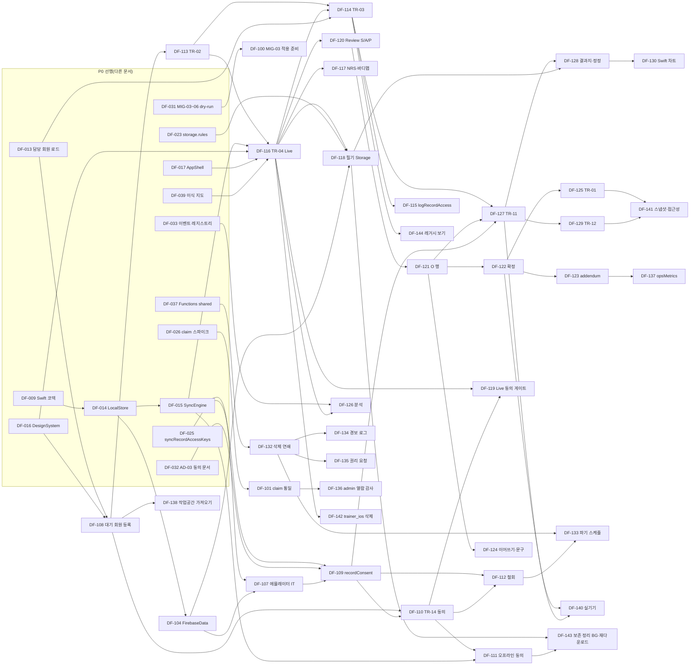

# P1a 백로그: 알파-기록

| 항목 | 내용 |
|---|---|
| 문서 ID | V1-02-P1a |
| 버전 | v1.1 |
| 상태 | 개발 착수 기준(Ready) |
| 작성일 | 2026-09-24 |
| 소유자 | CJH |
| 근거 PRD 절 | §5.3·§5.5, §6.0(C-01~C-06, §6.0.2 플래그, §6.0.3 syncState), §6.1 F-ASM-06, §6.2 F-BC-01~03, §6.4 F-SOAP-01·02·04·07(§6.4.4, §6.4.5, §6.4.6), §6.5 F-VIZ-04·05·07, §6.6 F-LINK-01·03, §6.7 F-PRIV-01~05·07, §8.1·§8.4·§8.6, §9.1~§9.7, §10.2·§10.6·§10.7·§10.8(NFR-01~17), §11 MIG-03~08·MIG-11, §12.1~§12.5, §13.2·§13.3 |
| 관련 에픽·스토리 | EP-01, EP-04, EP-05, EP-08, EP-09, EP-10, EP-11, EP-12, EP-13 / DF-100~DF-144(추가 제안 DF-143·DF-144 포함) |
| 변경 규칙 | [문서 변경](../01_AGILE_WORKING_AGREEMENT.md#문서-변경) |

## 목차

1. [이 문서의 범위와 읽는 법](#1-이-문서의-범위와-읽는-법)
2. [추가 제안](#2-추가-제안)
3. [단계 목표·진입·종료](#3-단계-목표진입종료)
4. [스프린트 배치와 의존 순서](#4-스프린트-배치와-의존-순서)
5. [P1a 카드 공통 규약](#5-p1a-카드-공통-규약)
6. [요구사항 → 스토리 추적 요약](#6-요구사항--스토리-추적-요약)
7. [스토리 카드](#7-스토리-카드)
8. [P1a 소유자 행동(참조)](#8-p1a-소유자-행동참조)
9. [가정(ASM-P1a-NN)](#9-가정asm-p1a-nn)
10. [스파인·PRD와의 충돌·확인 필요](#10-스파인prd와의-충돌확인-필요)
11. [변경 이력](#11-변경-이력)

---

## 1 이 문서의 범위와 읽는 법

- 이 문서는 **P1a 알파-기록** 단계의 스토리 카드 전문이다. 키 대역은 DF-100~199이며, 백로그 스파인이 정한 키·제목·점수·스프린트·의존을 그대로 쓴다. 스파인에 없는 필요 작업은 [§2 추가 제안](#2-추가-제안)에 다음 빈 키(DF-143, DF-144)로 올렸다.
- P0 키이지만 P1a 스프린트(S06~S07)에 배치된 DF-014·015·016·018·026·032·033·039는 [P0 백로그](P0.md)에 카드가 있다. 여기서는 의존 대상으로만 인용한다.
- 소유자 행동(DF-9xx)은 [소유자 행동·외부 게이트 트랙](OWNER_ACTIONS_AND_GATES.md)이 정본이다. P1a에 걸린 항목은 [§8](#8-p1a-소유자-행동참조)에 요약만 둔다.
- **정본 관계.** PRD([docs/PRD_V1.md](../../PRD_V1.md))가 정본이다. 필드·규칙은 [V1-05](../05_DATA_MODEL_AND_RULES.md), callable 계약은 [V1-06](../06_API_SPEC.md), 화면은 [V1-07](../07_TRAINER_APP_SPEC.md)·[V1-08](../08_MEMBER_APP_AND_ADMIN_SPEC.md), 계산 규칙은 [V1-09](../09_ALGORITHMS_SPEC.md), 테스트 운영은 [V1-10](../10_TEST_PLAN.md), 이관은 [V1-11](../11_MIGRATION_RUNBOOK.md), 문구·이벤트는 [V1-12](../12_COPY_ANALYTICS_AND_LINT.md)가 정본이다. 카드는 이 문서들을 **절 번호로** 가리키고 내용을 되풀이하지 않는다. 다만 에이전트가 질문 없이 착수할 수 있도록 파일 경로, 타입·시그니처, 문서 필드, 문구 키, 테스트 ID는 카드에 직접 적는다. 카드와 명세 문서가 어긋나면 명세 문서가 우선하고, 어긋남은 [V1-01 문서 변경](../01_AGILE_WORKING_AGREEMENT.md#문서-변경) 절차로 고친다.
- **코드 근거**는 2026-09-24 작업 트리를 직접 열어 확인했다. `dfet:ios/Runner/AppDelegate.swift` 줄 번호는 작업 트리 9,657줄 기준이며, 이식 작업은 DF-039가 기록하는 보관 브랜치 tip(이식 기준선)의 줄 번호로 다시 확인한다(PRD §0.2).
- **가정 ID.** 이 문서가 새로 둔 가정은 `ASM-P1a-NN`(문서 범위 ID)이다. V1-01의 ASM-01-NN, V1-05의 ASM-05-NN과 겹치지 않는다. PRD로 올릴 때는 PRD §13.4에 따라 AS-34부터 새 번호를 받는다.

## 2 추가 제안

스파인 스토리만으로는 PRD P1a 요구 두 가지가 담당 없이 남는다. 다음 빈 키로 제안한다. 소유자가 다듬기(목요일)에서 받아들이면 `tool/backlog/issues.json`에 같은 키로 넣는다.

| 키 | 제목 | 점수 | 우선순위 | 제안 스프린트 | 빠진 요구 | 카드 |
|---|---|---|---|---|---|---|
| DF-143 | 로컬 보존 정리의 백그라운드 실행과 파기된 바이너리 재다운로드를 구현한다 | 1 | must | S15 | NFR-17 '업로드 확인 후 로컬 원본은 7일 안에 지운다'. 파기 규칙은 P0 DF-014(`LocalRetention.purge`), 앱 활성화 시 호출은 DF-111이 맡지만, 앱을 오래 열지 않는 기기의 정기 실행과 파기 뒤 재다운로드 경로를 맡은 스토리가 없다 | [DF-143](#df-143-로컬-보존-정리의-백그라운드-실행과-파기된-바이너리-재다운로드를-구현한다) |
| DF-144 | 이관 문서(migratedFrom)의 읽기 전용 표시와 '레거시 원문 보기'를 구현한다 | 1 | must | S14 | PRD §9.3 '레거시 원문 보기에서만 읽기 전용', MIG-04 수용 기준 '어느 화면에도 diagnosis 값이 기본 표시되지 않는다'. MIG-03 적용(DF-924, S09) 뒤 타임라인에 이관 문서가 나타나지만 이를 그리는 스토리가 없다 | [DF-144](#df-144-이관-문서migratedfrom의-읽기-전용-표시와-레거시-원문-보기를-구현한다) |

- **배치 영향.** S14 약속량은 스파인 기준 13점(용량 16, 약속 한도 14)이다. 권장안은 DF-144(1점)를 S14에 넣고(14점), DF-143(1점)을 S15에 넣는 것이다(S15는 17점 → 18점 = 약속 한도). 결정은 소유자 몫이며 [§10](#10-스파인prd와의-충돌확인-필요) CF-11에 기록했다.
- 그 밖에 스파인 카드 범위 안에서 **하위 세부**로 흡수한 공백(새 키 없음)은 다음과 같다.
  - `save_failure_shown` 이벤트(M-G3) → DF-126, `soap_addendum_created` → DF-123, `bodycomp_record_saved` → DF-127.
  - TR-15의 기본 빠른 문구 목록 → DF-124(§3.1 짧은 고지는 P0 DF-018이 이미 담당).
  - 대기 회원 등록 취소 UI(F-LINK-01.5 트레이너 취소) → DF-113, ① 거부 시 취소 → DF-110.
  - 대기 회원 키로 조회하는 타임라인·시리즈 인덱스(§9.6 누락) → DF-024(V1-05 §10.2.1), 부위 무관 둘레 목록 인덱스 2개 → DF-114(V1-05 §10.2.2).
  - 신체조성·줄자의 P1a seriesBreak(AC-BC-03.3) → DF-128이 P1b DF-216의 API로 먼저 구현, DF-130이 렌더(DF-216은 확장).
  - ② 철회 뒤 재정렬(`syncRecordAccessKeysCore`)이 `trainerId`를 되살리지 않는지 확인하는 테스트 → DF-112(조건은 DF-025 `resolveAccessKey`에 이미 있다).

## 3 단계 목표·진입·종료

**목표.** 트레이너 1명(소유자)이 합성 회원과, G-04·G-09 뒤에는 실회원과 함께 **세션 기록 루프(S1 1~6단계)와 현장 온보딩(S2 1~2단계), 신체조성·줄자 입력**을 끊김 없이 쓰고, 동의·삭제·권리 행사·감사가 규칙과 서버에서 강제되는 상태. 회원 공유는 없다(PRD §12.1).

| 구분 | 내용 | 근거 |
|---|---|---|
| 진입(코딩) | P0 종료 검토(DF-926, S05). P1a 스토리의 합성 데이터 개발은 외부 게이트와 무관하게 S06부터 시작한다 | PRD §12.1, [V1-01 게이트가 막는 것과 막지 않는 것](../01_AGILE_WORKING_AGREEMENT.md#게이트가-막는-것과-막지-않는-것) |
| 진입(실데이터·플래그) | G-04 + G-09(동의 5종·보존·처리방침), G-05a 제출, MIG-03 적용(DF-924), G-03 → `soapV2`·`bodyComposition` 개방(DF-925, 목표 S09) | PRD §12.2, §12.3 순서 1 |
| 종료 | M-01(텍스트) 평균 10초 미만과 30초 초과 비율 보고, M-02·M-08·M-11 측정, 데이터 유실 0·알리지 않은 저장 실패 0·금지어 노출 0, 2주 이상 자체 사용, `trainer-app-emulator-it` 초록, trainer_ios 삭제, NFR-15 P1a 측정 제출 → P1a 종료 검토(DF-927, S15, [V1-T06](../templates/PHASE_EXIT_REVIEW.md)) | PRD §12.1, §12.7 |
| 플래그 | `soapV2`(TR-04·TR-05), `bodyComposition`(TR-11·TR-12)만 P1a에 연다. `bodyAssessment`·`memberShare`·`lidarBeta`는 false 유지. F-PRIV-*·F-LINK-01·03은 플래그와 무관하게 항상 적용 | PRD §6.0.1, §6.0.2 |
| 버전 | 트레이너 앱 0.2(`trainer-v0.2.x`), TestFlight 내부 그룹(DF-139, S11) | ADR-014 |

**점수 합계.** 스파인 P1a 스토리 39개 = 121점, 추가 제안 2개 = 2점, P1a 소유자 행동 = 3점(DF-912·924·931 각 1점). 스파인의 'P1a 125점'과 1점 차이는 [§10](#10-스파인prd와의-충돌확인-필요) CF-10에 적었다.

## 4 스프린트 배치와 의존 순서

### 4.1 스프린트별 약속 항목

| 스프린트 | 기간(작업일) | P1a 스토리(점수) | 같은 스프린트의 P0 키·소유자 행동 | 합계 |
|---|---|---|---|---|
| S06 | 11-02~11-06(5) | DF-104(3) | DF-032(3), DF-033(2), DF-039(2), DF-026(1), DF-014(3), DF-016(3), DF-912(1), DF-914(0) | 18 |
| S07 | 11-09~11-13(5) | DF-107(3), DF-108(3), DF-109(5) | DF-015(5), DF-018(2) | 18 |
| S08 | 11-16~11-20(5) | DF-110(5), DF-100(3), DF-113(2), DF-116(5), DF-126(2) | DF-931(1), DF-922(0), DF-932(0) | 18 |
| S09 | 11-23~11-27(5) | DF-111(3), DF-117(3), DF-118(3), DF-119(2), DF-120(3), DF-101(3) | DF-924(1), DF-925(0) | 18 |
| S10 | 11-30~12-04(5) | DF-121(5), DF-122(5), DF-123(3), DF-112(3), DF-124(2) | — | 18 |
| S11 | 12-07~12-11(5) | DF-125(3), DF-127(5), DF-128(3), DF-114(3), DF-115(2), DF-139(2) | — | 18 |
| S12 | 12-14~12-18(5) | DF-129(5), DF-130(3), DF-131(2), DF-132(5), DF-134(1) | DF-200(2, P1b 스파이크), DF-933(0) | 18 |
| S13 | 12-21~12-24(4) | DF-135(5), DF-133(3), DF-136(2), DF-140(2), DF-142(1) | DF-915(1) | 14 |
| S14 | 12-28~12-31(4) | DF-137(3), DF-138(3), DF-141(2), (제안) DF-144(1) | DF-201(5, P1b) | 13(+1 제안) |
| S15 | 2027-01-04~01-08(5) | (제안) DF-143(1) | P1b 키 17점(P1b 백로그), DF-927(0, P1a 종료 검토) | 17(+1 제안) |

### 4.2 같은 스프린트 안의 순차 의존(위험)

| 스프린트 | 순서 | 완화 |
|---|---|---|
| S06 | DF-014 → DF-104 | DF-104는 `FirebaseData` 타깃만 건드린다. DF-014의 `LocalBinary` 모델 PR을 1일차에 먼저 병합하고 DF-104는 2일차부터 착수 |
| S07 | DF-015 → DF-107 | DF-107의 워크플로·에뮬레이터 하네스(야간 스케줄, 시드)는 DF-015와 무관하게 먼저 만들고, Outbox 시나리오 테스트는 DF-015 병합 뒤 붙인다 |
| S07 | DF-107(시드 데이터) → DF-109(e2e) | DF-107을 두 PR로 나눈다. 1일차에 시드 데이터 PR(`emulator-seed.v1.json` P1a 추가분, 변형 파일 2개, `firebase.json` 에뮬레이터 항목)을 먼저 병합하고, DF-109는 단위 테스트(`deriveConsentState`, `validateRequest`)부터 시작해 2일차 이후 e2e를 붙인다 |
| S07 | DF-108 ↔ DF-109 | 서로 의존하지 않는다(앱 등록 화면 / 서버 callable). 병렬 배정 |
| S08 | DF-113 → DF-116(UI 경로) | DF-116의 도메인·Live 화면(`SessionStartCoordinator`, `QuickNoteLimit`, AC-DF-116.4 a)은 1일차부터 병렬. DF-113의 TR-03 셸(`MemberDetailView`, `onStartSession`) PR을 3일차까지 먼저 병합하고, DF-116은 그 뒤 AppShell 연결과 TC-116-12를 붙인다 |
| S10 | DF-121 → DF-122 → DF-123 | DF-122의 순수 도메인 부분(`FinalizeRequirements`)은 DF-009 모델만 필요하므로 1일차부터 병렬로 시작한다. DF-121 의존은 '미완성 행 자동 제외' UI 통합뿐이다. DF-123은 DF-122 병합 뒤 착수 |
| S11 | DF-127 → DF-128, DF-114 → DF-115, DF-114 → DF-127(진입점) | DF-128은 3일차 이후 착수. DF-115의 callable(Functions)은 DF-114와 무관하게 먼저 만들고 앱 호출부만 DF-114 뒤에 붙인다. DF-127은 검증기·Store·시트를 먼저 병합하고, TR-03 헤더 `tr03.measureMenu` 추가는 DF-114 병합 뒤 작은 PR로 붙인다 |
| S12 | DF-132 → DF-134 | DF-134는 1점. DF-132 병합 뒤 반나절 |

### 4.3 의존 그래프(요약)



## 5 P1a 카드 공통 규약

카드마다 반복하지 않는 규칙이다. 모든 P1a 스토리의 DoD는 [V1-01 공통 DoD D1~D12와 영역별 DoD](../01_AGILE_WORKING_AGREEMENT.md#완료-정의dod)에 이 절을 더한 것이다.

### 5.1 경로 뿌리

| 영역 | 뿌리 | 비고 |
|---|---|---|
| 트레이너 앱 순수 타깃 | `trainer_app/Packages/TrainerCore/Sources/{TrainerContracts,TrainerDomain,SyncEngine,TrainerAnalytics}/` | macOS `swift test --package-path trainer_app/Packages/TrainerCore` |
| 로컬 저장 | `trainer_app/Packages/TrainerKit/Sources/LocalStore/` | iPad 시뮬레이터 `xcodebuild test`(V1-04 §6.1) |
| 트레이너 앱 Feature·UI | `trainer_app/Packages/TrainerKit/Sources/{DesignSystem,Feature*}/` | Firebase import 금지(NFR-03, static-guards) |
| Firebase 구현 | `trainer_app/Packages/TrainerKit/Sources/FirebaseData/` | Firebase import 허용 타깃은 이것과 App 타깃뿐 |
| 조립 | `trainer_app/App/AppShell/` | 의존성 주입, 라우트 |
| 단위 테스트 | 순수 타깃 `trainer_app/Packages/TrainerCore/Tests/<Target>Tests/`, iOS 타깃 `trainer_app/Packages/TrainerKit/Tests/<Target>Tests/` | 테스트 이름에 AC ID(V1-01 DoD) |
| 통합 테스트 | `trainer_app/IntegrationTests/` | 에뮬레이터 연동(DF-107) |
| UI 테스트 | `trainer_app/UITests/` | `--preview-*` 인자 |
| 문자열 | `trainer_app/App/Localizable.xcstrings` | 사용자 노출 문자열은 여기만(ADR-016) |
| Functions | `functions/src/<domain>/<functionName>.js`, `functions/src/shared/*.js` | handler와 순수 core 분리(ADR-017) |
| Functions 테스트 | `functions/test/unit/<domain>/*.test.js`, `functions/test/e2e/*.e2e.test.js`, `functions/test/rules/<collection>.rules.test.js` | 스크립트 확장은 DF-037(V1-01 ASM-01-08) |
| 계약 | `contracts/*.v1.json` → `tool/contracts/generate.mjs` | 생성물은 손으로 고치지 않는다 |

### 5.2 공통 타입(선행 스토리가 정의, P1a 카드가 사용)

아래 이름은 [P0 백로그](P0.md)의 DF-009·DF-014·DF-015 카드가 정한 것이다. P1a 카드는 이 이름을 그대로 쓰고, 바꿔야 하면 막힘으로 보고한다(DoR R6).

```swift
// TrainerDomain — DF-009(JSONValue), DF-015(원격 I/O 프로토콜)
public enum JSONValue: Equatable, Sendable { case null, bool(Bool), number(Double), string(String),
  array([JSONValue]), object([String: JSONValue]), timestamp(Date), serverTimestamp }
public struct WriteAck: Sendable { public let serverCommitted: Bool }
public struct UploadReceipt: Sendable { public let path: String; public let size: Int; public let sha256: String; public let verified: Bool }
public protocol RemoteWriter: Sendable {
  func createIfAbsent(path: String, fields: JSONValue) async throws -> WriteAck   // 서버 조회로 이미 있으면 성공
  func update(path: String, fields: JSONValue) async throws -> WriteAck
  func delete(path: String) async throws -> WriteAck                              // P1a 추가(DF-104): draft 삭제(DF-123)
}
public protocol BinaryUploader: Sendable {
  func upload(localURL: URL, path: String, contentType: String, sha256: String) async throws -> UploadReceipt
  func delete(path: String) async throws                                          // P1a 추가(DF-104): 이전 필기 개정 삭제(DF-118)
}
public protocol BinaryDownloader: Sendable {                                      // P1a 추가(DF-104): SDK 바이트 다운로드, getDownloadURL 금지
  func download(path: String, to localURL: URL) async throws
}
public protocol CallableClient: Sendable { func call<T: Decodable & Sendable>(_ name: String, _ payload: JSONValue) async throws -> T }
public enum RemoteError: Error, Equatable { case permissionDenied, failedPrecondition, invalidArgument, notFound,
  alreadyExists, unavailable, deadlineExceeded, protectedDataUnavailable, unknown(String) }

// P1a 카드에서 쓰는 회원 키 표현(OutboxItem.memberKey 문자열 "uid:<v>" | "pending:<v>"와 1:1)
public enum MemberKey: Hashable, Codable, Sendable { case uid(String), pending(String)
  public var documentID: String { switch self { case .uid(let v), .pending(let v): v } } }   // memberConsentStates 문서 ID
```

- **Outbox.** `OutboxItem.kind`는 V1-05 §12.2 값(`callConsent | createDocument | updateDocument | deleteDocument | uploadBinary | deleteBinary | recordBinaryPath | finalize | callFunction`)이고 `stage`는 0~5다. 순서는 회원별 `sequence`와 `dependsOn`으로 표현한다(DF-015). NFR-05 순서(① 동의 ② 부모 ③ Storage ④ 경로 → 확정)는 DF-015가 보장한다. 대기 회원 등록은 stage 0 `pendingMembers` `createDocument` 항목이며 같은 회원의 `callConsent`가 이 항목을 `dependsOn`으로 가리킨다([ASM-P1a-01](#9-가정asm-p1a-nn)).
- **syncFailed 사유.** DF-015는 사유를 `OutboxItem.lastErrorCode` 문자열로 둔다. 이 문서의 `syncFailed(.rulesDenied)`, `(.consentRejected)`, `(.uploadMismatch)`, `(.fileTooLarge)` 표기는 각각 `lastErrorCode` `permission-denied`, `consent-rejected`, `upload-mismatch`, `file-too-large`를 뜻한다. 사용자 문구는 덱의 `sync.reason.*` 키다: `permission-denied` → `sync.reason.ruleDenied`, `upload-mismatch` → `sync.reason.uploadMismatch`, 네트워크 → `sync.reason.network`, 재시도 한도 → `sync.reason.retryLimit`, `consent-rejected` → `sync.reason.consentRejected`, `file-too-large` → `sync.reason.fileTooLarge`(뒤 둘은 덱 추가 필요, §5.3 표).
- **LocalStore 모델.** DF-014가 `LocalSoapDraft`(`lockState: editable|pendingFinalize` 포함), `LocalMeasurementDraft`, `LocalConsentCapture`, `OutboxItem`, `LocalBinary`, `TodayListEntry`(`dayKey`), `StationProfile`, `QuickPhrase`, `FilterPreference`와 `LocalRetention.purge(now:)`(업로드 확인 7일·미확인 동의 7일 파기)를 만든다. P1a 카드가 더하는 속성·엔터티(`liveCompletedAt`, `reservedRows`, `objectiveRowDrafts`, `reviewEnteredAt`, `LocalPendingMemberDraft`(DF-108, `LocalStoreSchemaV1_1`), `DeviceModelEntry`, `DailySessionReport`, `WorkspaceImportState`)는 모두 옵셔널이거나 기본값이 있어 SwiftData 경량 이관으로 처리한다. 처음 추가하는 PR(DF-108)이 `LocalStoreSchemaV1_1`과 `LocalStoreMigrationPlan` 단계를 만들고, 이후 카드는 같은 방식으로 버전을 올린다([ASM-P1a-47](#9-가정asm-p1a-nn)).
- 날짜는 모두 `Date`(UTC)로 들고 다니고, 표시·`timeOfDayBand`·'당일' 계산만 `Asia/Seoul`로 한다([ASM-P1a-26](#9-가정asm-p1a-nn)).

### 5.3 문구 키·접근성 식별자

- **정본.** 문구 키와 값의 정본은 [문구 덱 `data/copy_ko.json`](../data/copy_ko.json)(V1-12-D3)이다. 키 문법·대상·플레이스홀더·새 문구 절차는 [V1-12 §4](../12_COPY_ANALYTICS_AND_LINT.md)를 따른다. 카드의 '문구 키' 줄은 **키 이름만** 나열한다. 값은 덱에서 읽고, 카드 본문에 인용한 한국어 문장은 이해를 돕는 예시일 뿐이다(덱과 다르면 덱이 이긴다).
- **접근성 식별자.** 문구 키 문자열을 그대로 접근성 식별자로 쓴다(예: 키 `tr04.recordComplete` = 식별자 `tr04.recordComplete`). XCUITest는 덱 키로만 요소를 찾는다.
- **플레이스홀더.** 덱 표기 `{name}`를 쓴다(예: `sync.pendingCount` = '동기화 대기 {count}건'). `Localizable.xcstrings`로 옮길 때 `{count}`·`{n}`·`{selected}`·`{total}`은 `%lld`, 나머지는 `%@`, 인자가 둘 이상이면 위치 지정(`%1$@`)으로 바꾼다(V1-12 §4.3). 카드와 코드 주석에 `%d`·`%@`를 새로 쓰지 않는다.
- **DoR 추가 조건(P1a 전 카드).** 카드가 인용하는 문구 키는 착수 전에 덱에 모두 있어야 한다. 아래 '덱 추가 요청' 표의 키는 P1a 다듬기(S05 목요일)에서 소유자가 한 docs PR로 덱(`data/copy_ko.json`, `audience: trainer`, `phase: P1a`, `prdRefs`, `screens` 필수)과 V1-12 §4.9 표에 함께 넣는다. 구현 중 새로 필요한 키는 V1-12 §4.7 절차대로 **그 스토리 PR의 첫 커밋에서** 덱에 먼저 더한다. 덱에 없는 키를 코드(`Localizable.xcstrings`, `String(localized:)`)에 두면 DoD 미충족이다.
- **검사.** PR마다 `node tool/lint/prohibited-terms.mjs --check-deck` 보고에서 이 PR이 더한 키의 '카탈로그에만 있는 키'·'문장 불일치'가 0건이어야 한다(v1 CI는 경고만, ASM-12-22 — P1a는 DoD로 강제). 백로그 카드의 인용 키가 덱에 있는지 자동으로 검사하는 기능(`docs-and-backlog` job)은 [§10](#10-스파인prd와의-충돌확인-필요) CF-21로 제안했다.
- **공통 상태 문구(덱 키).** syncState(PRD §6.0.3)는 DF-016의 `SyncStateBadge`가 가진다: `sync.localSaved`, `sync.syncing`, `sync.synced`, `sync.syncFailed`, `sync.awaitingConsent`, 대기 건수 `sync.pendingCount`, 실패 사유 `sync.reason.*`. '저장됨' 단독 문구는 쓰지 않는다(동작 버튼은 `common.saveAction`). 그 밖의 공통 문구: `common.loadFailed`, `common.retry`, `common.comingSoon`, `common.unmeasured`, `common.notEntered`, `common.onlineRequired`, `common.offlineStale`, 판정 자리 `change.pendingPolicy`('산정 준비 중'), 무효 기록 `record.voided`, 동의 상태 `consent.state.*`·`consent.needed.*`, 지표 이름 `metric.<metricCode>.name`, 출처 칩 `sourceGrade.*`, 추이 끊김 `series.break.device`·`series.break.protocol`·`series.break.condition`.

**덱 추가 요청(P1a 카드가 쓰지만 덱에 없던 키).** 모두 `audience: trainer`, `phase: P1a`. 값은 제안이며 V1-12 원칙(§2)으로 소유자가 다듬는다.

> 반영 기록(v1.0.1, 2026-09-24 정합 패스 2): 아래 표의 32개 키는 이번 패스에서 `data/copy_ko.json`에 추가됐다(해당 파일의 변경 참조). 이 표는 추적용으로 남기며, 값이 덱과 다르면 덱이 이긴다([CF-20](#10-스파인prd와의-충돌확인-필요)).

| 키 | 제안 값(`{name}` 표기) | args | 카드 | 근거 |
|---|---|---|---|---|
| `tr01.syncFailed` | 동기화 실패 {count}건 | count | DF-125 | TR-01, §6.0.3 |
| `tr01.remove` | 오늘 목록에서 빼기 | — | DF-125 | TR-01 |
| `tr02.menu.addToday` | 오늘 목록에 추가 | — | DF-125 | TR-01·TR-02 |
| `tr02.import.menu` | 이전 작업공간 가져오기 | — | DF-138 | MIG-08 ③ |
| `tr02.import.title` | 이전 작업공간의 회원 이름 | — | DF-138 | MIG-08 ③ |
| `tr02.import.notice` | 이름만 가져와요. 건강 기록은 가져오지 않아요. | — | DF-138 | MIG-08 ③ |
| `tr02.import.linkExisting` | 기존 회원과 연결 | — | DF-138 | MIG-08 ③ |
| `tr02.import.registerPending` | 대기 회원으로 등록 | — | DF-138 | MIG-08 ③, F-LINK-01 |
| `tr02.import.skip` | 건너뛰기 | — | DF-138 | MIG-08 ③ |
| `tr02.import.done` | 가져오기 끝내기 | — | DF-138 | MIG-08 ③ |
| `tr02.import.unreadable` | 이전 작업공간을 읽을 수 없어요 | — | DF-138 | MIG-08 ③ |
| `tr03.migrated` | 이관 | — | DF-144 | §9.3, MIG-03 |
| `tr03.measureMenu` | 측정 입력 | — | DF-127 | TR-03 |
| `tr03.measureMenu.bodyComposition` | 신체조성 | — | DF-127 | TR-03, TR-11 |
| `tr03.measureMenu.circumference` | 둘레(줄자) | — | DF-129 | TR-03, TR-12 |
| `tr04.quickNote.counter` | {count}/1000 | count | DF-116 | F-SOAP-01.2, §9.3 |
| `tr05.continueFromPrevious.none` | 이어쓸 확정 기록이 없어요 | — | DF-124 | F-SOAP-07.2 |
| `tr05.addendum.reason.supplement` | 내용 보완 | — | DF-123 | F-SOAP-04.4 |
| `tr05.addendum.reason.other` | 기타 | — | DF-123 | F-SOAP-04.4 |
| `tr05.addendum.text` | 추가 내용 | — | DF-123 | F-SOAP-04.4 |
| `tr05.legacy.show` | 이전 형식 원문 보기 | — | DF-144 | §9.3 |
| `tr11.more` | 추가 항목 | — | DF-127 | F-BC-01.1 |
| `tr11.deviceModel.add` | 기기 추가 | — | DF-127 | F-BC-01.2 |
| `tr11.reportPhoto.add` | 결과지 촬영 | — | DF-128 | F-BC-02.1 |
| `tr11.correct.confirm` | 이 기록을 무효 처리하고 고쳐 입력할까요? | — | DF-128 | F-BC-03.5 |
| `tr11.deviceChanged` | 기기가 바뀌어 이전 기록과 비교할 수 없습니다 | — | DF-128 | F-BC-03.4(PRD 문구 그대로) |
| `chart.rejected.mixedSource` | 출처가 다른 값은 한 차트에 그리지 않아요 | — | DF-130 | F-VIZ-07.2, C-02 |
| `chart.summary` | {metricName} 추이, 기록 {count}개, 최소 {min}, 최대 {max}, 끊김 {breaks}, 출처 {source} | metricName, count, min, max, breaks, source | DF-130 | A-03, AC-A11Y-02 |
| `chart.legend.left` | 왼쪽 | — | DF-130 | F-VIZ-07, A-02 |
| `chart.legend.right` | 오른쪽 | — | DF-130 | F-VIZ-07, A-02 |
| `sync.reason.consentRejected` | 동의 기록이 거부돼 서버가 저장을 받지 않았어요. | — | DF-111 | F-PRIV-03.7, §6.0.3 |
| `sync.reason.fileTooLarge` | 필기 파일이 너무 커서 올리지 못했어요. | — | DF-118 | §9.5, §6.0.3 |

### 5.4 테스트 ID와 합성 데이터

- 테스트 케이스 ID는 `TC-<DF 번호>-NN`이다(예: TC-116-03). PRD의 판정 벡터 T01~T25와 섞이지 않게 접두를 붙였다. 테스트 함수 이름에는 V1-01 규칙대로 AC ID를 넣는다(예: `func test_AC_SOAP_01_6_secondSessionCreatesSecondDocument()`).
- 합성 데이터만 쓴다. 에뮬레이터 시드는 [V1-10 §5.4](../10_TEST_PLAN.md)가 정본이며 경로·파일·ID를 한 벌로 쓴다([ASM-P1a-48](#9-가정asm-p1a-nn)).

| 항목 | 값 | 만드는 스토리 |
|---|---|---|
| 적재 스크립트 | `functions/scripts/dev/seed-emulator.js --seed <파일>`(에뮬레이터 환경변수 `FIRESTORE_EMULATOR_HOST`·`FIREBASE_AUTH_EMULATOR_HOST`가 없으면 exit 2) | P0 시드 스토리(DF-042 제안 채택 시 DF-042, 미채택 시 DF-012). **P1a 카드는 이 스크립트가 S04 이전에 있다고 전제한다** |
| 기본 시드 파일 | `functions/test/fixtures/emulator-seed.v1.json`: 트레이너 claim 계정 `synthTrainerA`·`synthTrainerB`(`synthTrainerA@example.invalid`), 관리자 `synthAdmin`, 가입 회원 `synthMember0001`~`0003`(`synthTrainerA`가 0001·0002 담당, `trainers/{uid}.memberIds`·`users.trainerId` 일치), `appConfig/features` 8키 | P0 시드 스토리(위와 같음) |
| P1a 추가분(같은 파일) | 대기 회원 `SYNTHpending00000001`(`synthTrainerA` 소유), published 동의 문서 5종(`{type}--1.0`, V1-05 §4.13 형식), `synthMember0001`의 ①②③ `memberConsentStates`, `soapV2`·`bodyComposition` true | DF-107 |
| 오류 주입 변형 | `functions/test/fixtures/emulator-seed.<변형>.v1.json`(`no-consent`: 대상 회원 `memberConsentStates` 없음, `consent-fail`: retired 문서만 있어 `recordConsent`가 `failed-precondition`) | DF-107 |
| 문서 ID·표시명 | 문서 ID는 `SYNTH` 접두 20자, 표시명은 '가상회원 가/나/다', 이메일 도메인은 `example.invalid`만([V1-10 §5.2](../10_TEST_PLAN.md)) | — |

- 이 문서의 JSON·예시 ID(`synthTrainerA`, `synthMember0001`, `SYNTHpending00000001`)는 위 시드 ID와 같다. 읽을 때 바꿀 필요가 없다.
- 에뮬레이터 포트·프로젝트 ID는 [V1-10 §4.2](../10_TEST_PLAN.md)·[V1-04 §19.1](../04_ARCHITECTURE.md)(ASM-04-09)를 따른다: Firestore 18080, Storage 19199, **Auth 19099, Functions 5001**. 현재 `firebase.json`의 `emulators`에는 firestore 18080·storage 19199·`ui`·`singleProjectMode`만 있다(dfet:firebase.json:37-50). auth·functions 항목은 P0 시드 스토리가 추가하고, DF-107이 없으면 추가한다(AC-DF-107.7).
- 에뮬레이터 프로젝트 ID: 규칙 테스트 `dfet-rules-test`, Functions e2e·이관 `dfet-e2e`(dfet:.github/workflows/ci.yml:53, :55), **트레이너 앱 통합 테스트·로컬 개발 `demo-dfet`**(`demo-` 접두는 실제 리소스에 닿지 않는다).

### 5.5 라벨 규칙

- 모든 카드: `type/*`, `area/*`, `phase/P1a`, `prio/*`, `size/*`(1=XS, 2=S, 3=M, 5=L).
- 해당 시: `flag/soapV2`, `flag/bodyComposition`, `rules-change`, `schema-change`, `privacy-impact`, `regulatory`, `needs-device-test`, `freeze-exception`.
- `agent/*` 라벨은 스프린트 계획([V1-T04](../templates/SPRINT_PLAN.md))에서 붙인다. 카드의 '에이전트 브리프'는 [V1-T08 작업 지시서](../templates/AGENT_BRIEF.md)의 1·3·4절 초안이다.

## 6 요구사항 → 스토리 추적 요약

| PRD 요구·수용 기준 | 스토리 |
|---|---|
| F-SOAP-01.1·01.2·01.5·01.6·01.8·01.9, AC-SOAP-01.1~01.3·01.6·01.9, AC-IA-03 | DF-116 |
| F-SOAP-01.3, AC-SOAP-01.7 / F-VIZ-04.1·04.2·04.5, AC-VIZ-04.1·04.4 | DF-117 |
| F-SOAP-01.7, AC-SOAP-01.5 | DF-118 |
| F-SOAP-01.4·01.10·01.11, AC-SOAP-01.8 | DF-119 |
| F-SOAP-01.12, AC-SOAP-01.10, M-01·M-01b·M-02, NFR-10 | DF-126 |
| AC-SOAP-01.4, C-05, AC-C-05.1, NFR-04~06 | DF-015(P0), DF-104, DF-107 |
| F-SOAP-02.1~02.3·02.7·02.8·02.10, AC-SOAP-02.1·02.7·02.8 | DF-120, DF-117 |
| F-SOAP-02.4~02.6, AC-SOAP-02.2~02.6 | DF-121 |
| F-SOAP-02.9, F-SOAP-04.1·04.2, §6.4.4, AC-SOAP-04.5, M-11 | DF-122 |
| F-SOAP-04.3~04.8, AC-SOAP-04.1~04.4·04.6, F-PRIV-07.3 | DF-123 |
| F-SOAP-07.1(P1a)·07.2·07.3, AC-SOAP-07.1·07.2 | DF-124 |
| TR-01, AC-IA-05, M-02 보조 | DF-125 |
| F-LINK-01.1·01.2·01.4·01.8, AC-LINK-01.2·01.6, TR-14 | DF-108 |
| F-LINK-01.5, AC-LINK-01.4·01.5 | DF-133 |
| F-PRIV-01.1~01.3, F-PRIV-03.1·03.6, AC-PRIV-01.3·03.2, M-08 | DF-110 |
| F-PRIV-01.4, F-PRIV-02.1·02.2, F-PRIV-03.2·03.3, AC-PRIV-02.1·03.1, R-28 | DF-109 |
| F-PRIV-03.7, AC-PRIV-03.3 | DF-111 |
| F-PRIV-02.3(즉시), AC-PRIV-02.2(1분) | DF-112 |
| F-PRIV-02.3(5영업일), AC-PRIV-02.2·02.3(파기) | DF-133 |
| F-PRIV-04.1~04.4, AC-PRIV-04.1 | DF-132, DF-134 |
| F-PRIV-05.1(트레이너)·05.3, AC-PRIV-05.2 | DF-115, DF-932 |
| F-PRIV-05.1(관리자)·05.2·05.4, AC-PRIV-05.1 | DF-136 |
| F-PRIV-07.1·07.2·07.4, AC-PRIV-07.1 | DF-135 |
| F-BC-01.1~01.4, F-BC-03.1~03.3, AC-BC-01.1~01.5, AC-BC-03.1·03.2·03.4, AC-PRIV-01.1 | DF-127 |
| F-BC-02.1·02.3, F-BC-03.4·03.5, AC-BC-03.3·03.5 | DF-128 |
| F-ASM-06.1~06.6, AC-ASM-06.1~06.5 | DF-129 |
| F-VIZ-07.1~07.9, C-01~C-04, AC-VIZ-07.1~07.5, A-02, A-03 | DF-130, DF-131 |
| F-VIZ-05.1·05.2(P1a)·05.4·05.6·05.7, AC-VIZ-05.1·05.2·05.4, TR-02·TR-03 | DF-113, DF-114 |
| AC-IA-01, AC-A11Y-01~03, §8.4 | DF-141 |
| NFR-04·11·12·15, M-G3 실기기 | DF-140 |
| NFR-17(7일 삭제) | DF-014(P0: 파기 규칙), DF-111(앱 활성화 시 실행), DF-143(제안: 백그라운드 실행·재다운로드) |
| §9.3 레거시 읽기 호환, MIG-04 표시 수용 기준 | DF-144(제안) |
| MIG-03·MIG-11, R-21 | DF-100, DF-924 |
| MIG-08(1) | DF-100, DF-924 |
| MIG-08(2~3), F-LINK-03.3 | DF-138 |
| §9.4 isAdmin 통일, §10.7, R-23 | DF-101 |
| §5.3 opsMetrics, M-03 | DF-137 |
| ADR-001 trainer_ios 정리 | DF-142 |
| ADR-014 TestFlight | DF-139 |

P1a 범위에서 의도적으로 다음 단계로 넘긴 것: AC-PRIV-02.4(bodyScans, P2 DF-320에서 DF-133 확장), AC-BC-02.1(P2 DF-313), F-SOAP-04.9(P2 DF-312), F-PRIV-01.3·03.8의 회원 앱 부분(P2 DF-307·308), F-VIZ-05.2 P2 필터·05.3·05.5(P2 DF-329), F-VIZ-04.3(P2 DF-328).

---

## 7 스토리 카드

카드는 키 순서다. 각 카드의 '수용 기준'은 PRD AC를 인용한 것과 스토리 전용 `AC-DF-NNN.k`를 한 목록으로 묶었다. 괄호의 `←`는 추적 대상 PRD ID다.

### DF-100 MIG-03 적용 준비: v1 쓰기 영구 차단 규칙 PR과 롤백 리허설(MIG-11)

| 항목 | 값 |
|---|---|
| Epic | EP-13 이관 |
| Type | story |
| Phase | P1a |
| Sprint | S08 (2026-11-16~11-20) |
| Points | 3 |
| Priority | must |
| Area | functions |
| Labels | `type/story` `area/functions` `area/rules` `phase/P1a` `prio/must` `size/M` `rules-change` `schema-change` |
| Depends on | DF-031, DF-022 |
| PRD refs | MIG-03, MIG-11, MIG-08(1), R-21, R-08, §9.3 '레거시 쓰기 차단과 읽기 호환', §11.4, §11.12 |

**사용자 스토리** — 소유자로서, v1 SOAP 쓰기를 영구히 막는 규칙 변경과 이관 적용·롤백을 **규칙과 데이터를 함께** 에뮬레이터에서 한 번에 연습해 두고 싶다. 그래서 P1a 진입 때 운영 전환(DF-924)을 체크리스트대로 한 번에, 되돌릴 수 있는 상태로 실행한다.

**배경·맥락**
- PRD §9.3: v1 쓰기 차단은 `soapV2`와 분리하며 MIG-03 적용 시점에 **영구 false**로 배포한다. 플래그를 꺼도 다시 열리지 않는다(R-21). MIG-11: 규칙 롤백은 이전 태그 재배포이되 **v1 쓰기 차단 규칙은 되돌리지 않는다.**
- P0에서 이미 된 것(중복 구현 금지)
  - DF-020: v1 경로를 스위치 함수 `legacyV1WritesOpen()`(`// @mig03-switch`) 뒤에 두었다. 주석대로 'DF-100에서 false로 바꾸고 v1 분기 삭제'가 이 스토리의 몫이다.
  - DF-022: 스위치를 false로 바꾼 **메모리 사본**으로 R-21을 검증한다.
  - DF-031: `mig03_06.js`(dry-run·에뮬레이터 apply), `mig03_06_rollback.js`, 적용 → 롤백 → 재적용 리허설(TC-DF031-06), 대상 가드 `lib/target.js`(DF-030).
- 이 스토리가 더하는 것: ① 스위치를 실제로 끄고 v1 분기를 지우는 **draft PR** ② **규칙 전환과 데이터 이관을 묶은 컷오버 리허설**(규칙은 롤백하지 않는 MIG-11 조건 포함) ③ 운영 `--apply`의 추가 확인 장치 ④ 운영 체크리스트와 실행 기록 양식 연결.
- 절차 정본: [V1-11 MIG-03·MIG-11](../11_MIGRATION_RUNBOOK.md).

**수용 기준**
1. **AC-DF-100.1** (← R-21, §9.3) Given draft PR의 `firestore.rules`(`legacyV1WritesOpen()` 제거, v1 create·update 분기 삭제), When 담당 트레이너 A가 v1 형태(`schemaVersion` 없음, `structured` 맵) `soap_notes`를 create·update하면, Then `soapV2=false`·`true` 모두 거부되고, v2 create(R-01)는 허용된다. DF-022의 사본 테스트는 실제 규칙 파일을 읽는 테스트로 바뀐다. *(규칙 에뮬레이터)*
2. **AC-DF-100.2** (← MIG-11, §11.12) Given 레거시 픽스처를 시드하고 draft PR 규칙을 로드한 에뮬레이터, When `mig03_06.js --apply` → `mig03_06_rollback.js --run-id <id>` → `mig03_06.js --apply` 순서로 실행하면, Then ① 1차 결과가 `expected_v2`와 같고 ② 롤백 뒤 문서가 시드 원본과 같되 **v1 쓰기는 여전히 거부**되며(규칙은 롤백하지 않음) 트레이너 읽기는 허용되고 ③ 재적용 결과가 ①과 같다. *(migrations CI, 에뮬레이터)*
3. **AC-DF-100.3** (← MIG-03 수용 기준, R-08) Given 이관돼 `status=finalized`인 문서, When 트레이너가 `exerciseAssessment`를 update하면 거부되고 addendum create는 허용된다. 이관된 draft 문서의 v2 update는 허용된다. *(규칙 에뮬레이터)*
4. **AC-DF-100.4** (← §11 원칙 ②⑤) Given 에뮬레이터가 아닌 대상, When `mig03_06.js --apply`에 `--confirm-run-id`가 없거나 직전 dry-run 보고서의 runId와 다르면, Then 쓰기 없이 종료 코드 2로 끝난다. `lib/target.js`(DF-030)의 기존 가드는 그대로 두고 이 조건만 더한다. *(단위)*
5. **AC-DF-100.5** (← MIG-03 '공지', MIG-09) [V1-11 MIG-03 절](../11_MIGRATION_RUNBOOK.md)에 컷오버 체크리스트가 있다: ① 관리형 내보내기 백업 ② 동결 Runner 트레이너 사용자에게 SOAP 쓰기 종료 공지 ③ draft PR 병합 ④ 규칙 배포 태그 `rules-YYYYMMDD-N` ⑤ dry-run(`runId` 기록) ⑥ `--apply --confirm-run-id` ⑦ 검증(보고서 수량·샘플 읽기) ⑧ 태그 `mig03-apply-YYYYMMDD` ⑨ [V1-T10](../templates/MIGRATION_RUN_RECORD.md) 기록. 롤백 절차에는 '규칙은 되돌리지 않는다'가 굵게 적혀 있다. *(문서)*
6. **AC-DF-100.6** draft PR(`mig/DF-100-v1-write-block`)은 규칙 변경과 R-21 테스트 갱신만 담고, 병합은 DF-924 체크리스트 ③단계에서 소유자가 한다. 이 스토리의 본 PR에는 `firestore.rules` 변경이 없다. *(수동: PR 링크)*
7. **AC-DF-100.7** (← MIG-08 ①) Given 스위치 규칙, Then 트레이너의 `trainerWorkspaces/{uid}` create·update·delete가 거부되고 본인·관리자 read는 허용된다(`functions/test/rules/trainerWorkspaces.rules.test.js` 3케이스, V1-11 §10.1). *(규칙 에뮬레이터)*

**구현 노트**
- 본 PR
  - `functions/test/migrations/mig03_cutover_rehearsal.e2e.test.js` — 규칙 문자열을 draft PR 기준(스위치 제거본)으로 만들어 로드한 뒤 AC-DF-100.2·100.3 흐름을 돈다. 규칙 문자열 생성은 DF-022의 사본 도우미를 재사용한다.
  - `functions/scripts/migrations/lib/confirmRunId.js` + `functions/test/unit/migrations/confirmRunId.test.js` — AC-DF-100.4. `mig03_06.js`의 `--apply` 경로에 한 줄 연결.
  - `docs/v1/11_MIGRATION_RUNBOOK.md` MIG-03 절 — AC-DF-100.5 체크리스트.
- draft PR: `firestore.rules`에서 `legacyV1WritesOpen()`과 `|| (legacyV1WritesOpen() && ...)` v1 분기 삭제, `functions/test/rules/soap_notes.rules.test.js`의 R-21을 실제 파일 기준으로. 같은 draft PR에 `firestore.rules` `trainerWorkspaces` 블록(`allow read: if (isTrainer() && isOwner(trainerId)) || isAdmin(); allow create, update, delete: if false;`, V1-11 §10.1 hunk)과 `functions/test/rules/trainerWorkspaces.rules.test.js`(본인 read 허용, 타인 read 거부, 본인 create·update·delete 거부)를 넣는다(AC-DF-100.7, V1-11 CF-11-11).
- 관련 문서: [V1-05 §5 SOAP 스키마 v2](../05_DATA_MODEL_AND_RULES.md), [V1-10 이관 리허설](../10_TEST_PLAN.md), ADR-005, ADR-014.

**테스트**

| ID | 종류 | 검증 |
|---|---|---|
| TC-100-01 | 규칙 에뮬레이터 | 스위치 제거본에서 R-21(soapV2 false·true), R-01 허용(AC-DF-100.1) |
| TC-100-02 | e2e(migrations) | 규칙+데이터 컷오버: 적용 → 롤백(v1 쓰기 여전히 거부) → 재적용(AC-DF-100.2) |
| TC-100-03 | 규칙 에뮬레이터 | 이관 finalized 원문 update 거부·addendum 허용, 이관 draft v2 update 허용(AC-DF-100.3) |
| TC-100-04 | 단위 | `confirmRunId`: 없음·불일치 → 종료 코드 2, 에뮬레이터는 면제(AC-DF-100.4) |
| TC-100-05 | 규칙 에뮬레이터 | `trainerWorkspaces` 본인 read 허용·타인 read 거부·본인 쓰기 3종 거부(AC-DF-100.7) |

**비고·가정** — 롤백 결과가 원본과 다르면 DF-031의 `legacy.flat`·`legacy.structured` 보존 범위 결함이다. 이 스토리는 막힘으로 보고하고 DF-031 후속 버그를 연다([CF-16](#10-스파인prd와의-충돌확인-필요)).

**DoR** — [x] R1 [x] R2 [x] R3 DF-031(S05)·DF-022(S04) [x] R4 [x] R5 [x] R6 본 PR: `functions/test/migrations/**`, `functions/scripts/migrations/lib/confirmRunId.js`, `mig03_06.js` 한 줄, V1-11 절 / draft PR: `firestore.rules`(v1 분기 삭제, `trainerWorkspaces` 블록), 규칙 테스트 2파일(`soap_notes.rules.test.js`, `trainerWorkspaces.rules.test.js`) [x] R7 rules-change·schema-change [x] R8 레거시 픽스처(DF-005) [ ] R9 작업 지시서 [x] R10 운영 실행은 DF-924

**에이전트 브리프** — DF-020·DF-022·DF-031 카드와 PR을 먼저 읽고, 이미 있는 롤백·리허설 도구를 새로 만들지 않는다. 컷오버 리허설 테스트(TC-100-02)를 먼저 써서 규칙+데이터 조합이 통과하는지 확인하고, `confirmRunId` 가드를 더한다. 스위치 변경은 별도 draft PR로만 연다. 운영 프로젝트를 가리키는 명령을 실행하지 않는다.

---

### DF-101 관리자 판정을 custom claim admin으로 통일한다(규칙·Storage·callable·admin_web)

| 항목 | 값 |
|---|---|
| Epic | EP-04 접근 키·식별 백엔드 |
| Type | story |
| Phase | P1a |
| Sprint | S09 (2026-11-23~11-27) |
| Points | 3 |
| Priority | must |
| Area | rules |
| Labels | `type/story` `area/rules` `area/storage` `area/functions` `area/admin-web` `phase/P1a` `prio/must` `size/M` `rules-change` `privacy-impact` |
| Depends on | DF-026 |
| PRD refs | §9.4 'isAdmin 통일 과제', §10.7 '역할 판정 통일', R-23, ADR-018 |

**사용자 스토리** — 소유자로서, 관리자 판정이 네 곳에서 같은 의미(`admin == true` claim)를 갖기를 원한다. 그래서 역할을 추가하거나 회수할 때 한 곳을 빠뜨려 권한이 새는 일이 없다.

**배경·맥락**
- 현재 네 벌이다(모두 확인함).
  - Firestore 규칙 `isAdmin()`: `admin`·`super_admin` claim, `admins/{uid}` approved, `users.role=='admin'` 대체 경로(dfet:firestore.rules:5-20).
  - callable `verifyAdmin`: `token.admin`만(dfet:functions/index.js:79).
  - admin_web `readRole`: `claims.admin === true || claims.role === 'admin'`(dfet:admin_web/lib/auth.ts:18-19).
  - Storage `isAdmin()`: `admin`·`super_admin` claim(dfet:storage.rules:4-9).
- DF-026(P0 스파이크)이 차이표와 제거 순서를 정했고, MIG-02 실사(DF-907)가 운영 관리자 전원의 `admin` claim 보유 여부를 수량으로 확인했다. 이 스토리는 그 결정대로 코드를 바꾼다.
- `admins` 컬렉션은 승인 메타데이터로만 남는다(V1-05 §4.19).

**수용 기준**
1. **AC-DF-101.1** (← §9.4 목표) Given 규칙 에뮬레이터, When `admin: true` claim 토큰으로 관리자 전용 경로(`auditLogs` read, `opsMetrics` read)를 읽으면 허용되고, `admins/{uid}` 문서만 approved인 토큰·`users/{uid}.role=='admin'`만 있는 토큰·`super_admin`만 있는 토큰은 거부된다. *(규칙 에뮬레이터)* — `super_admin` 처리는 DF-026 결정을 따르며, 결정이 '유지'면 이 항목의 `super_admin` 케이스를 '허용'으로 바꾼다.
2. **AC-DF-101.2** (← R-23) Given `admin: true` 토큰, When 원 기록(`soap_notes`, `bodyCompositionRecords`, `circumferenceMeasurements`, `postureAssessments`)을 클라이언트에서 get하면, Then 거부된다. *(규칙 에뮬레이터)*
3. **AC-DF-101.3** (← §10.7) Given Storage 규칙, When `admin: true` 토큰으로 `clinical-ingest/**`를 읽으면 허용되고 `super_admin`만 있는 토큰은 AC-DF-101.1과 같은 결정을 따른다. *(Storage 에뮬레이터)*
4. **AC-DF-101.4** (← §10.7) Given admin_web `readRole`, When 클레임이 `{role:'admin'}`뿐이면 `null`(접근 불가), `{admin:true}`이면 `'admin'`이다. *(admin-web 단위)*
5. **AC-DF-101.5** (← ADR-018) callable 관리자 검사는 `functions/src/shared/auth.js`의 `requireAdmin(context)` 하나로 모이고 `functions/index.js`의 `verifyAdmin`은 이를 호출한다(이름·리전 불변, NFR-16). *(단위)*
6. **AC-DF-101.6** 배포 순서가 PR 본문과 [V1-11](../11_MIGRATION_RUNBOOK.md)에 적혀 있다: ① DF-907 보고서에서 claim 미보유 관리자 0 확인(또는 소유자가 `setAdminClaim`으로 부여) → ② 규칙·Storage 규칙 배포 → ③ admin_web 배포. *(수동: 문서)*

**구현 노트**
- 수정
  - `firestore.rules` — `isAdmin()`을 `request.auth != null && request.auth.token.admin == true`로 바꾼다(`admins`·`users` get 제거로 쓰기 요청당 조회 수도 줄어든다, PRD §9.4 '4건 이내').
  - `storage.rules` — `isAdmin()` 같은 식.
  - `functions/src/shared/auth.js` — `requireAdmin(context)` 추가(DF-037이 만든 파일). `functions/index.js`의 `verifyAdmin`(dfet:functions/index.js:68-87)은 `requireAdmin`을 호출하도록 바꾼다.
  - `admin_web/lib/auth.ts` — `readRole`에서 `claims.role === 'admin'` 대체 경로 제거. `trainer`·`lab_operator` 판정은 이 스토리 범위 밖(변경 없음).
  - `functions/test/rules/admin.rules.test.js`(신규), `functions/test/rules/storage.rules.test.js`(케이스 추가), `admin_web` 테스트(`lib/auth.test.ts` 신규 또는 기존 위치).
- `users.role` 대체 경로를 쓰던 운영 관리자가 있으면 ① 단계에서 claim을 먼저 준다. 이 스토리는 운영 데이터를 건드리지 않는다.
- 관련 문서: [V1-05 §7 규칙 초안 '관리자 판정 통일'](../05_DATA_MODEL_AND_RULES.md), ADR-018.

**테스트**

| ID | 종류 | 검증 |
|---|---|---|
| TC-101-01 | 규칙 에뮬레이터 | admin claim 허용, `admins` 문서만·`users.role`만 거부 |
| TC-101-02 | 규칙 에뮬레이터 | R-23 원 기록 get 거부(4개 컬렉션) |
| TC-101-03 | Storage 에뮬레이터 | `clinical-ingest` 관리자 읽기 판정 |
| TC-101-04 | admin-web 단위 | `readRole` 표(4개 입력) |
| TC-101-05 | Functions 단위 | `requireAdmin`: 인증 없음 → unauthenticated, admin 없음 → permission-denied |
| TC-101-06 | 규칙 에뮬레이터(회귀) | 기존 `firestore-rules.test.js` 관리자 케이스 전부 통과 |

**비고·가정** — `super_admin` claim의 처리(흡수·제거)는 DF-026 결정에 따른다. 결정 문서가 없으면 이 스토리는 DoR R3 미충족이다.

**DoR** — [x] R1 [x] R2 [ ] R3 DF-026 결정 문서(S06) 필요 [x] R4 [x] R5 [x] R6 규칙 2파일·auth 2파일·테스트 [x] R7 rules-change·privacy-impact [x] R8 합성 토큰 [ ] R9 [x] R10 claim 부여는 소유자 행동

**에이전트 브리프** — DF-026 결정 문서와 V1-05 §7의 관리자 절을 먼저 읽는다. 규칙 테스트(TC-101-01~03)를 먼저 추가해 현재 규칙에서 실패하는 것을 확인한 뒤 `firestore.rules`·`storage.rules`의 `isAdmin()`만 바꾼다. 다른 헬퍼(`isTrainer`, `isAssignedTrainer`)나 컬렉션 규칙은 건드리지 않는다. 운영 claim 부여·배포는 하지 않는다.

---

### DF-104 FirebaseData RemoteWriter·BinaryUploader·CallableClient와 퍼시스턴스 설정을 구현한다

| 항목 | 값 |
|---|---|
| Epic | EP-05 트레이너 앱 기반 |
| Type | story |
| Phase | P1a |
| Sprint | S05(MVP 계획, DEC-22, [03 MVP 계획](../03_RELEASE_AND_SPRINT_PLAN.md#mvp-계획dec-22)). 원래 계획: S06 (2026-11-02~11-06) |
| Points | 3 |
| Priority | must |
| Area | trainer-app |
| Labels | `type/story` `area/trainer-app` `phase/P1a` `prio/must` `size/M` `scope/mvp` |
| Depends on | DF-014 |
| PRD refs | §10.2.3, NFR-04, NFR-05, NFR-06, NFR-07, F-SOAP-04.8, AC-SOAP-04.6, §9.5 '링크 정책', ADR-002, ADR-007 |

**사용자 스토리** — 트레이너 앱 개발자(에이전트)로서, SyncEngine이 쓰는 원격 I/O 프로토콜의 Firebase 구현이 서버 커밋·업로드 무결성을 정직하게 알려 주기를 원한다. 그래서 '동기화됨'이 실제 서버 반영 뒤에만 표시된다.

**배경·맥락**
- SwiftData가 편집 원본이고 Firestore 쓰기는 투영이다(PRD §10.2.3, ADR-002). SyncEngine(DF-015)은 TrainerDomain의 `RemoteWriter`·`BinaryUploader`·`CallableClient`와 `JSONValue`·`RemoteError`만 안다([§5.2](#52-공통-타입선행-스토리가-정의-p1a-카드가-사용)). 이 스토리는 `FirebaseData` 타깃에 구현을 만들고, P1a에 필요한 `RemoteWriter.delete`, `BinaryUploader.delete`, `BinaryDownloader`를 프로토콜에 더한다.
- 반례: trainer_ios는 오류를 print만 하고(dfet:trainer_ios/DFETTrainer/Data/FirebaseTrainerRepository.swift:103-105) 저장마다 `createdAt`을 덮어쓴다(:95). 저장 결과와 무관하게 '저장됨'을 표시한다(dfet:trainer_ios/DFETTrainer/Domain/TrainerStore.swift:177-191).
- Firestore 퍼시스턴스·캐시 크기는 기본값에 기대지 않고 코드에서 명시한다(NFR-04). `getDownloadURL()`은 어느 앱에서도 쓰지 않는다(PRD §9.5).
- `createIfAbsent`는 DF-015의 중복 방지(AC-DF-015.5)가 기대는 계약이다: 서버에 이미 있으면 다시 쓰지 않고 성공으로 돌려준다.

**수용 기준**
1. **AC-DF-104.1** (← NFR-04) Given 앱 시작, When `FirestoreConfigurator.configure()`가 호출되면, Then `FirestoreSettings.cacheSettings`가 `PersistentCacheSettings(sizeBytes: 104_857_600)`로 설정된 뒤에만 첫 Firestore 인스턴스가 만들어진다([ASM-P1a-31](#9-가정asm-p1a-nn)). *(단위: 설정 값 검사)*
2. **AC-DF-104.2** (← F-SOAP-04.8, AC-SOAP-04.6, NFR-07) `createIfAbsent`는 `createdAt`·`updatedAt`에 서버 시각을 쓰고, `update` 페이로드에서 `createdAt` 키가 있으면 거부한다(`RemoteError.invalidArgument`). 3회 update 뒤에도 `createdAt`은 처음 값이다. *(단위 + DF-107 통합)*
3. **AC-DF-104.3** (← AC-DF-015.5, ADR-002) Given 이미 서버에 커밋된 문서, When 같은 경로로 `createIfAbsent`가 다시 불리면, Then `getDocument(source: .server)`로 존재를 확인하고 `authorUid`(또는 `enteredBy`, `trainerId`)가 본인이면 쓰지 않고 `WriteAck(serverCommitted: true)`를 돌려준다. 본인이 아니면 `RemoteError.alreadyExists`다. *(단위: 가짜 어댑터 / 통합: DF-107)*
4. **AC-DF-104.4** (← NFR-05) Given 업로드 완료, When 서버 메타데이터의 `size`·`md5Hash`가 로컬 파일의 크기·MD5와 다르면, Then `UploadReceipt.verified == false`이고, 같으면 `true`다([ASM-P1a-07](#9-가정asm-p1a-nn)). `customMetadata.sha256`에 로컬 SHA-256을 기록한다. *(단위)*
5. **AC-DF-104.5** (← NFR-06) `WriteAck.serverCommitted`는 Firestore 쓰기 completion이 오류 없이 호출됐을 때만 `true`다. `FirestoreErrorCode`·`StorageErrorCode`·`FunctionsErrorCode`는 `RemoteError`로 매핑된다(`permissionDenied`, `unavailable`, `deadlineExceeded`, `alreadyExists`, `failedPrecondition`, `invalidArgument`, `notFound`, 그 밖 `unknown(code)`). *(단위: 매핑 표)*
6. **AC-DF-104.6** (← §9.5 링크 정책, NFR-10) `FirebaseData` 타깃에 `getDownloadURL`·`downloadURL(`·`print(` 0건(static-guards). 다운로드는 `write(toFile:)`만 쓴다. 로그는 `os.Logger`와 `privacy: .private`만. *(CI static-guards)*
7. **AC-DF-104.7** (← NFR-16) `CallableClient`는 `Functions.functions(region: "asia-northeast3")`로만 호출한다. *(단위)*
8. **AC-DF-104.8** (← §9.5, DF-118·DF-123 전제) `RemoteWriter.delete`, `BinaryUploader.delete`, `BinaryDownloader.download`가 구현돼 있고 가짜 구현(테스트 지원 타깃)에도 같은 메서드가 있다. *(단위)*

**구현 노트**
- 생성(`trainer_app/Packages/TrainerKit/Sources/FirebaseData/`)
  - `FirestoreConfigurator.swift` — `static func configure(app: FirebaseApp, emulator: EmulatorHosts? = nil)`; 퍼시스턴스·캐시 크기, IntegrationTests용 에뮬레이터 호스트 주입.
  - `FirestoreRemoteWriter.swift` — `createIfAbsent`(존재 확인 → `setData(fields, merge: false)` + completion), `update`(`updateData`), `delete`.
  - `JSONValueFirestoreMapper.swift` — `JSONValue` ↔ Firestore 값. `.timestamp(Date)` → `Timestamp(date:)`, `.serverTimestamp` → `FieldValue.serverTimestamp()`. (DF-009는 매핑을 범위 밖으로 두었다.)
  - `RemoteErrorMapper.swift` — 세 SDK 오류 코드 → `RemoteError`.
  - `PendingWritesObserver.swift` — 문서 스냅샷 `metadata.hasPendingWrites`를 `AsyncStream<Bool>`로 노출(PRD §9.6 `synced` 판정 보조).
  - `StorageBinaryUploader.swift` — `putFileAsync(from:metadata:)`, `StorageMetadata(contentType:)` + `customMetadata = ["sha256": sha256]`, 완료 뒤 `size`·`md5Hash`를 `Insecure.MD5`(CryptoKit, base64)와 비교해 `verified` 결정. `delete(path:)`.
  - `StorageBinaryDownloader.swift` — `write(toFile:)`로 받은 파일에 `completeFileProtection`·백업 제외 설정(DF-014 `LocalBinaryStore` 규칙과 같음).
  - `FunctionsCallableClient.swift` — `CallableClient` 구현(`JSONValue` ↔ callable 데이터 변환).
- 수정: `TrainerDomain`의 DF-015 프로토콜 파일에 `delete`·`BinaryDownloader` 추가, DF-015 가짜 구현(테스트 지원)에도 추가. `trainer_app/App/DFETTrainerApp.swift`(또는 AppDelegate) — `FirebaseApp.configure()` 직후 `FirestoreConfigurator.configure`. `--preview-*` 인자면 Firebase 초기화를 건너뛰는 동작 유지(dfet:trainer_ios/DFETTrainer/App/DFETTrainerApp.swift:32-43 참고).
- 테스트: `Tests/FirebaseDataTests/{JSONValueFirestoreMapperTests, RemoteErrorMapperTests, UploadIntegrityTests, CreateIfAbsentTests, ConfiguratorTests}.swift`(iPad 시뮬레이터, 네트워크 없이 SDK 호출부를 작은 어댑터 프로토콜 뒤에 두고 가짜로 교체).
- 계약: [V1-06 트레이너 앱 Domain 프로토콜](../06_API_SPEC.md), [V1-04 로컬 우선 저장·바이너리 흐름](../04_ARCHITECTURE.md).

**테스트**

| ID | 종류 | 검증 |
|---|---|---|
| TC-104-01 | 단위(시뮬레이터) | 퍼시스턴스 설정 값(AC-DF-104.1) |
| TC-104-02 | 단위 | create는 서버 시각 두 필드, update의 `createdAt` 거부(AC-DF-104.2) |
| TC-104-03 | 단위 | createIfAbsent 재호출: 본인 문서 → 쓰기 0·성공, 타인 → alreadyExists(AC-DF-104.3) |
| TC-104-04 | 단위 | md5·size 불일치 → verified false, 일치 → true, sha256 메타(AC-DF-104.4) |
| TC-104-05 | 단위 | 오류 매핑 표 전 항목(AC-DF-104.5) |
| TC-104-06 | static-guards | `getDownloadURL`·`print(` 0건(AC-DF-104.6) |
| TC-104-07 | 단위 | callable 리전 고정(AC-DF-104.7) |
| TC-104-08 | 단위 | delete·download 구현과 가짜 구현 존재(AC-DF-104.8) |

**비고·가정** — ASM-P1a-07(무결성 대조를 MD5+size로), ASM-P1a-31(캐시 100MB). 서버 측 통합 확인은 DF-107이 맡는다.

**DoR** — [x] R1 [x] R2 [x] R3 DF-014 같은 스프린트 앞순서(§4.2), DF-015 프로토콜 파일은 S07이므로 이 스토리가 프로토콜 파일을 먼저 만들 수 있음(DF-015 PR과 파일 충돌 주의 — 같은 주에 소유자가 병합 순서 조정) [x] R4 [x] R5 [x] R6 `FirebaseData/**`, TrainerDomain 프로토콜 파일, 앱 진입 1파일 [x] R7 영향 없음 [x] R8 가짜 어댑터 [ ] R9 [x] R10 해당 없음

**에이전트 브리프** — P0 DF-015 카드의 프로토콜 정의를 그대로 옮겨 쓰고 시그니처를 바꾸지 않는다(추가 메서드 3개만). SDK 호출부를 어댑터 뒤에 두고 매핑·무결성·createIfAbsent 테스트부터 작성한다. `FirebaseData` 밖은 프로토콜 파일과 앱 진입 1곳만 고친다. `getDownloadURL`을 쓰지 않는다.

### MVP 범위(DEC-22)

- MVP 스프린트: S05(원래 계획 S06). 상태: 할 일
- 왜 필요한가: FirebaseData RemoteWriter·BinaryUploader·CallableClient. 동기화의 원격 쪽
- 지금 만든다: 카드 전체 범위

---

### DF-107 trainer-app-emulator-it CI와 오류 주입 하네스를 만든다

| 항목 | 값 |
|---|---|
| Epic | EP-01 저장소 기준선·CI·백로그 도구 |
| Type | story |
| Phase | P1a |
| Sprint | S06(MVP 계획, DEC-22, [03 MVP 계획](../03_RELEASE_AND_SPRINT_PLAN.md#mvp-계획dec-22)). 원래 계획: S07 (2026-11-09~11-13) |
| Points | 3 |
| Priority | must |
| Area | ci |
| Labels | `type/story` `area/ci` `area/trainer-app` `phase/P1a` `prio/must` `size/M` `scope/mvp` |
| Depends on | DF-015, DF-104 |
| PRD refs | §12.5 '트레이너 앱 단위·UI', NFR-04, NFR-05, NFR-06, C-05, AC-C-05.1, AC-SOAP-01.3, AC-SOAP-01.4, M-G3, ADR-013 |

**사용자 스토리** — 소유자로서, 트레이너 앱의 동기화 약속(순서, 규칙 거부 시 실패 표시, 오프라인 복구, 중복 0)이 매 PR과 매일 밤 실제 에뮬레이터에서 자동으로 검증되기를 원한다. 그래서 '알리지 않은 저장 실패 0'(M-G3)을 사람 기억이 아니라 CI로 지킨다.

**배경·맥락**
- ADR-013 테스트 층 ⑤: 시뮬레이터 + Firebase 에뮬레이터에 연결해 규칙 거부와 네트워크 오류를 주입한다. 스테이징 프로젝트는 없다(AS-DEV-02).
- DF-015(P0)는 가짜 원격으로 순서·백오프·syncState를 검증했다. 이 스토리는 **실제 FirebaseData 구현(DF-104)과 실제 규칙**으로 같은 약속을 다시 확인한다.
- 에뮬레이터 포트는 Firestore 18080, Storage 19199, Auth 19099, Functions 5001이고 트레이너 통합 테스트 프로젝트 ID는 `demo-dfet`다([§5.4](#54-테스트-id와-합성-데이터), V1-10 ASM-10-03, V1-04 ASM-04-09). 현재 `firebase.json`에는 firestore 18080·storage 19199만 있다(dfet:firebase.json:37-50). auth·functions 항목은 P0 시드 스토리가 넣는 것이 원칙이고, 이 스토리 착수 시점에 없으면 이 스토리가 넣는다(AC-DF-107.7).
- 적재 스크립트 `functions/scripts/dev/seed-emulator.js`와 기본 시드 `functions/test/fixtures/emulator-seed.v1.json`(트레이너·회원·담당 관계·플래그)은 P0 시드 스토리(DF-042 제안 채택 시 DF-042, 미채택 시 DF-012)의 산출물이다. 이 스토리는 스크립트를 새로 만들지 않고, 같은 시드 파일에 P1a 데이터를 더하고 오류 주입 변형 파일을 만든다([§5.4](#54-테스트-id와-합성-데이터) 표, [V1-10 §5.3·§5.4](../10_TEST_PLAN.md)). P0 시드 스토리가 S04까지 병합되지 않았으면 이 스토리는 막힘이다(DoR R3).
- 이 하네스는 이후 P1a 스토리(DF-111, DF-118, DF-122 등)가 시나리오를 추가하는 기반이다.

**수용 기준**
1. **AC-DF-107.1** (← AC-C-05.1, NFR-06, AC-SOAP-01.4) Given 규칙이 거부하도록 준비한 시드(해당 회원의 `memberConsentStates` 없음), When 앱 도메인 계층이 SOAP draft를 저장·동기화하면, Then 엔티티 syncState 스트림은 `localSaved → syncing → syncFailed`(`lastErrorCode == "permission-denied"`)이고 `synced`는 한 번도 방출되지 않으며 로컬 원본은 남는다. *(통합)*
2. **AC-DF-107.2** (← NFR-05) Given 한 회원의 Outbox에 동의 캡처·부모 문서·바이너리·경로 기록이 있을 때, When 동기화하면, Then 서버 쪽 관찰 순서가 `recordConsent` → 부모 create 커밋 → Storage 업로드 완료 → 경로 update 커밋이다. *(통합)*
3. **AC-DF-107.3** (← NFR-04, AC-SOAP-01.3) Given `Firestore.disableNetwork()` 상태에서 저장(`localSaved`) 후 SyncEngine을 폐기·재생성(앱 재시작 흉내), When 네트워크를 켜면, Then 문서는 서버에 정확히 1건이고 syncState는 `synced`다. *(통합)*
4. **AC-DF-107.4** (← NFR-05, AC-DF-015.2 실환경) Given `recordConsent`가 `failed-precondition`으로 거부되는 시드, When 동기화하면, Then 그 회원의 부모 문서 create 요청이 에뮬레이터에 한 건도 도달하지 않는다. *(통합)*
5. **AC-DF-107.5** (← ADR-013) `trainer-app-emulator-it` job이 경로 트리거(`trainer_app/**`, `firestore.rules`, `storage.rules`, `functions/src/**`)의 PR과 매일 KST 03:00(`cron: '0 18 * * *'`)에 돈다. *(CI 설정 검토)*
6. **AC-DF-107.6** `node functions/scripts/dev/seed-emulator.js --seed functions/test/fixtures/emulator-seed.v1.json`(그리고 각 변형 파일)은 P0 스크립트의 에뮬레이터 가드를 그대로 쓰고(`FIRESTORE_EMULATOR_HOST`·`FIREBASE_AUTH_EMULATOR_HOST` 없으면 exit 2), 두 번 실행해도 결과가 같다. 적재 뒤 `consentDocumentVersions`의 published 문서가 5종(`required--1.0`, `healthData--1.0`, `bodyImaging--1.0`, `sharing--1.0`, `research--1.0`)이다. *(단위)*
7. **AC-DF-107.7** `firebase.json`의 `emulators`에 `"auth": {"host": "127.0.0.1", "port": 19099}`와 `"functions": {"host": "127.0.0.1", "port": 5001}`가 있고, 기존 firestore 18080·storage 19199·`ui.enabled=false`·`singleProjectMode=true`는 그대로다. `firebase emulators:exec --only auth,firestore,storage,functions --project demo-dfet "true"`가 exit 0이다. *(CI 설정 검토 + 스모크)*

**구현 노트**
- 생성
  - `.github/workflows/trainer-app.yml`에 job `trainer-app-emulator-it`(macos-15): checkout → setup-node 22 → setup-java 21 → `npm ci --prefix functions` → `npm i -g firebase-tools` → `xcodegen generate --spec trainer_app/project.yml` → `firebase emulators:exec --only auth,firestore,storage,functions --project demo-dfet "node functions/scripts/dev/seed-emulator.js --seed functions/test/fixtures/emulator-seed.v1.json && xcodebuild test -project trainer_app/DFETTrainer.xcodeproj -scheme DFETTrainer -testPlan Integration -destination 'platform=iOS Simulator,name=iPad Pro 13-inch (M4)' CODE_SIGNING_ALLOWED=NO"`. 전체 YAML은 [V1-10 §CI trainer-app-emulator-it](../10_TEST_PLAN.md)의 예시를 그대로 쓴다.
  - `trainer_app/IntegrationTests/Support/EmulatorHarness.swift` — plist 없이 `FirebaseOptions(googleAppID:gcmSenderID:)`와 `projectID = "demo-dfet"`로 앱을 구성하고 Auth 19099·Firestore 18080·Storage 19199·Functions 5001에 연결(`FirestoreConfigurator.configure(emulator:)`, DF-104). 시드 트레이너 계정으로 로그인.
  - `trainer_app/IntegrationTests/Support/FaultInjection.swift` — `NetworkFault.offline()/online()`(`disableNetwork/enableNetwork`), `SeedVariant.use(_:)`(에뮬레이터를 초기화한 뒤 변형 파일 `emulator-seed.no-consent.v1.json`·`emulator-seed.consent-fail.v1.json`을 적재), `EngineRelaunch.simulate()`(SyncEngine 인스턴스 폐기 후 LocalStore에서 재적재).
  - `trainer_app/IntegrationTests/Scenarios/{RulesRejectionIT, OutboxOrderIT, OfflineRecoveryIT, ConsentFirstIT}.swift`.
- 수정
  - `functions/test/fixtures/emulator-seed.v1.json`에 P1a 데이터 추가: published 동의 문서 5종(`{type}--1.0`, V1-05 §4.13 형식), 대기 회원 `SYNTHpending00000001`(`synthTrainerA` 소유), `synthMember0001`의 `memberConsentStates`(①②③ granted), `appConfig/features`의 `soapV2=true`·`bodyComposition=true`.
  - `firebase.json` `emulators`에 auth 19099·functions 5001(없을 때만, AC-DF-107.7).
- 생성(시드 변형): `functions/test/fixtures/emulator-seed.no-consent.v1.json`(`synthMember0002`의 `memberConsentStates` 없음 → 규칙 거부), `functions/test/fixtures/emulator-seed.consent-fail.v1.json`(published 문서 대신 retired 문서만 → `recordConsent` `failed-precondition`).
- 서버 측 순서 관찰: 클라이언트 권한으로 각 문서의 `createdAt`/`updatedAt`(서버 시각), Storage 메타데이터 `timeCreated`, `recordConsent` 응답 `recordIds`로 만든 레코드의 `recordedAt`을 읽어 비교한다(테스트 전용 서버 함수를 만들지 않는다).
- DF-122가 `PendingFinalizeIT`를, DF-111이 `AwaitingConsentIT`를, DF-118이 `InkUploadIT`를 이 하네스 위에 더한다.
- 관련 문서: [V1-10 에뮬레이터 시드·오류 주입](../10_TEST_PLAN.md), [V1-13 테스트 명령](../13_DEV_ENVIRONMENT_AND_AGENT_PLAYBOOK.md), [V1-05 §16 에뮬레이터 합성 시드](../05_DATA_MODEL_AND_RULES.md).

**테스트**

| ID | 종류 | 검증 |
|---|---|---|
| TC-107-01 | 통합 | 규칙 거부 → syncFailed(permission-denied), synced 미방출, 로컬 유지(AC-DF-107.1) |
| TC-107-02 | 통합 | Outbox 순서(AC-DF-107.2) |
| TC-107-03 | 통합 | 오프라인 저장 → 재적재 → 복구 → 서버 1건(AC-DF-107.3) |
| TC-107-04 | 통합 | 동의 실패 시 부모 문서 요청 0(AC-DF-107.4) |
| TC-107-05 | 단위(Node) | 시드·변형 파일 적재 가드·멱등, published 문서 5종(AC-DF-107.6) |
| TC-107-06 | CI | 경로 트리거·야간 스케줄 설정(AC-DF-107.5) |
| TC-107-07 | CI 스모크 | `firebase.json` auth 19099·functions 5001, `demo-dfet`로 에뮬레이터 기동(AC-DF-107.7) |

**비고·가정** — macOS 러너 시간이 길다. PR에서는 경로 트리거로만 돌고 필수 체크는 경로 해당 PR에만 건다(V1-01 DoD D2). 에뮬레이터용 `FirebaseOptions` 값은 가짜이며 비밀이 아니다. 시드 ID는 [§5.4](#54-테스트-id와-합성-데이터)와 같다(`synthTrainerA`, `synthMember0001`, `SYNTHpending00000001`).

**DoR** — [x] R1 [x] R2 [x] R3 DF-104(S06), DF-015 같은 스프린트(§4.2), P0 시드 스토리(DF-042 또는 DF-012, S04까지 병합) [x] R4 [x] R5 [x] R6 `.github/workflows/trainer-app.yml`, `trainer_app/IntegrationTests/**`, `functions/test/fixtures/emulator-seed*.v1.json`, `firebase.json`(`emulators`만) [x] R7 영향 없음 [x] R8 P1a 시드 데이터와 변형 파일이 이 스토리 산출물 [ ] R9 [x] R10 해당 없음

**에이전트 브리프** — 먼저 `firebase.json`에 auth·functions 에뮬레이터 항목이 있는지 확인하고(없으면 추가), 시드 파일에 P1a 데이터와 변형 파일을 더한 뒤 `firebase emulators:exec --project demo-dfet`로 적재를 확인한다. `seed-emulator.js` 자체는 고치지 않는다(필요하면 막힘으로 보고). 그다음 `EmulatorHarness`와 `FaultInjection`을 만들고 `RulesRejectionIT` 하나를 초록으로 만든 뒤 나머지 시나리오를 더한다. 운영 프로젝트 ID나 실제 plist를 쓰지 않는다. `trainer_app/App/**`와 `TrainerKit/Sources/**`는 고치지 않는다(테스트 전용 훅이 필요하면 막힘으로 보고).

### MVP 범위(DEC-22)

- MVP 스프린트: S06(원래 계획 S07). 상태: 할 일
- 왜 필요한가: trainer-app 에뮬레이터 통합 CI. '에뮬레이터로 동기화' 증빙
- 지금 만든다: 통합 CI job, P1a 시드 추가분(게시된 테스트 동의 문서, 대기 회원), 동기화 정상 경로와 오류 주입

---

### DF-108 TR-14 대기 회원 최소 등록(만 14세 확인)을 구현한다

| 항목 | 값 |
|---|---|
| Epic | EP-09 대기 회원 |
| Type | story |
| Phase | P1a |
| Sprint | S05(MVP 계획, DEC-22, [03 MVP 계획](../03_RELEASE_AND_SPRINT_PLAN.md#mvp-계획dec-22)). 원래 계획: S07 (2026-11-09~11-13) |
| Points | 3 |
| Priority | must |
| Area | trainer-app |
| Labels | `type/story` `area/trainer-app` `phase/P1a` `prio/must` `size/M` `privacy-impact` `scope/mvp` |
| Depends on | DF-013, DF-016 |
| PRD refs | F-LINK-01.1, F-LINK-01.2, F-LINK-01.4, F-LINK-01.8, AC-LINK-01.2, AC-LINK-01.6, TR-14, AS-22, §9.2 `pendingMembers`, R-30, R-31 |

**사용자 스토리** — 트레이너로서, 앱에 아직 가입하지 않은 회원을 현장에서 표시명·성별·출생연도와 만 14세 확인만으로 등록하고 곧바로 동의 단계로 넘어가고 싶다. 그래서 첫 세션부터 uid가 아니라도 규칙이 인정하는 회원 키로 기록을 시작할 수 있다.

**배경·맥락**
- F-LINK-01.1: 등록 입력은 `displayName`, `sex`, `birthYear`, 만 14세 확인뿐이다. `heightCm`은 동의 ② 이후에만(F-BC-01.3, R-30). 연락처는 저장하지 않는다(F-LINK-01.4).
- F-LINK-01.8: `birthYear ≥ (현재 연도 − 14)`이면 등록과 동의를 차단하고 '법정대리인 동의 절차 미지원'을 안내한다. 규칙(§9.4, R-31)은 `birthYear ≤ 현재연도 − 14`까지 허용한다. 경계 1년 차이는 [ASM-P1a-02](#9-가정asm-p1a-nn)로 처리한다(앱은 PRD 요구대로 더 엄격하게).
- UI 참고만: `NativeMemberRegistrationSheet`(dfet:ios/Runner/AppDelegate.swift:2562-3129). 이 시트는 이메일·프로그램·첫 SOAP·멤모지 아바타를 받고 로컬 UUID 회원을 만든다(:2566-2582, :8116-8117) — **이식하지 않는다**(AC-LINK-03.3).
- 서버 문서 형식은 [V1-05 §4.3](../05_DATA_MODEL_AND_RULES.md).

**수용 기준**
1. **AC-DF-108.1** (← F-LINK-01.1, F-LINK-01.4, AC-LINK-01.2) Given TR-14 등록 화면, Then 입력 요소는 표시명(1~40자), 성별(`female`·`male`·`unspecified`, 기본 선택 없음), 출생연도, '만 14세 이상 확인' 체크 4개뿐이고 전화·이메일·주소 입력이 없다. 생성 페이로드 키는 `trainerId, displayName, sex, birthYear, ageConfirmed14, status, schemaVersion, createdAt, updatedAt`와 정확히 같다. *(UI 테스트 + 단위: 페이로드 키 집합)*
2. **AC-DF-108.2** (← AC-LINK-01.6, F-LINK-01.8) Given 2026년, When 출생연도 2013을 고르면, Then 저장 버튼이 비활성이고 `tr14.register.under14Blocked` 문구가 보인다. 2012도 차단(ASM-P1a-02), 2011은 허용된다. 만 14세 확인을 체크하지 않으면 저장 비활성이다. *(단위: `AgeGate` 경계, UI)*
3. **AC-DF-108.3** (← F-LINK-01.2) Given 저장, Then `pendingMembers/{자동ID}`가 `trainerId == 본인 uid`, `status == 'pending'`, `ageConfirmed14 == true`, `schemaVersion == 1`로 만들어진다(규칙 R-31·R-30이 허용·거부를 확인). *(통합: DF-107 하네스)*
4. **AC-DF-108.4** (← F-LINK-01.1) Given 저장 성공(로컬), When 화면이 닫히면, Then 같은 `MemberKey.pending(id)`로 동의 단계 라우트(`TrainerRoute.consent(member:)`)가 열린다. *(UI 테스트)*
5. **AC-DF-108.5** (← NFR-04, ASM-P1a-01) Given 오프라인, When 등록하면, Then 로컬에 저장되고 Outbox에 stage 0 `pendingMembers` `createDocument` 항목이 생기며, 이후 만드는 동의 캡처가 이 항목을 `dependsOn`으로 가리켜 복구 시 등록 문서가 먼저 서버에 반영된다. *(통합)*
6. **AC-DF-108.6** (← A-03, A-04) 모든 입력에 VoiceOver 라벨이 있고 탭 대상은 44pt 이상이다. *(XCUITest 접근성 감사)*

**구현 노트**
- 생성
  - `TrainerDomain/Members/PendingMemberDraft.swift` — `struct PendingMemberDraft { var displayName: String; var sex: Sex?; var birthYear: Int?; var ageConfirmed14: Bool }`, `enum Sex: String { case female, male, unspecified }`(contracts 생성 enum이 있으면 그것을 쓴다).
  - `TrainerDomain/Members/AgeGate.swift` — `static func isEligible(birthYear: Int, now: Date, calendar: Calendar) -> Bool`(Asia/Seoul 연도 기준 `birthYear <= year - 15`), `static let minimumBirthYear = 1900`.
  - `FeatureConsent/Registration/PendingMemberRegistrationView.swift`(`/// TR-14`), `PendingMemberRegistrationModel.swift`(@Observable).
  - `FirebaseData/FirestoreMemberDirectory+Pending.swift` — `createPendingMember`는 서버를 기다리지 않고 `LocalPendingMemberDraft` 저장 + Outbox stage 0 `createDocument`(`pendingMembers/{id}`) 등록 후 ID를 돌려준다.
  - `LocalStore/Models/LocalPendingMemberDraft.swift` — `LocalStoreSchemaV1_1`과 `LocalStoreMigrationPlan` 단계를 같은 PR에서 추가(V1-05 §12.1·§12.2, ASM-05-38).
- 수정: `TrainerDomain/Members/MemberDirectory.swift`(프로토콜에 `createPendingMember(_:) async throws -> PendingMemberID`가 없으면 추가), `App/AppShell/TrainerRoute.swift`에 `.pendingRegistration`, `.consent(member: MemberKey)`.
- 온보딩 시간 측정 시작점: 등록 화면 표시 시각을 `OnboardingSession.startedAt`(메모리 + LocalStore)에 둔다. DF-110이 M-08 이벤트에 쓴다.
- 문구 키(덱 [copy_ko.json](../data/copy_ko.json)이 값의 정본, [§5.3](#53-문구-키접근성-식별자) 규칙): `tr14.register.title`, `tr14.register.displayName`, `tr14.register.sex`, `tr14.register.sex.female`, `tr14.register.sex.male`, `tr14.register.sex.unspecified`, `tr14.register.birthYear`, `tr14.register.age14Confirm`, `tr14.register.under14Blocked`, `tr14.register.next`.
- 플래그: 없음(F-LINK-01은 기반 기능, PRD §6.0.1). 진입점은 TR-02 '대기 회원 추가'(DF-113)와 TR-01.
- 관련 문서: [V1-07 TR-14](../07_TRAINER_APP_SPEC.md), ADR-003.

**테스트**

| ID | 종류 | 검증 |
|---|---|---|
| TC-108-01 | 단위 | `AgeGate` 2011 허용, 2012·2013 차단, 1899 차단(AC-DF-108.2) |
| TC-108-02 | 단위 | 생성 페이로드 키 집합 일치, 연락처·`heightCm` 없음(AC-DF-108.1) |
| TC-108-03 | UI | 입력 요소 4개, 연락처 필드 없음, 기본 성별 선택 없음 |
| TC-108-04 | 통합 | 온라인 저장 → 서버 문서 필드(AC-DF-108.3) |
| TC-108-05 | 통합 | 오프라인 등록 → `dependsOn` 연결 → 복구 순서(AC-DF-108.5) |
| TC-108-06 | UI | 저장 뒤 동의 라우트 진입(AC-DF-108.4) |
| TC-108-07 | UI(접근성) | 접근성 감사 통과(AC-DF-108.6) |

**비고·가정** — ASM-P1a-01, ASM-P1a-02.

**DoR** — [x] R1 [x] R2 [x] R3 DF-013(S05)·DF-016(S06) [x] R4 [x] R5 [x] R6 `FeatureConsent/Registration/**`, `TrainerDomain/Members/**`, `FirebaseData/FirestoreMemberDirectory+Pending.swift`, `LocalStore/Models/LocalPendingMemberDraft.swift`·`LocalStoreSchemaV1_1`, 라우트 1파일 [x] R7 privacy-impact [x] R8 시드 트레이너 A [ ] R9 [x] R10 해당 없음

**에이전트 브리프** — `AgeGate`와 페이로드 키 테스트부터 작성한다(순수 타깃, macOS `swift test`). 이어서 등록 화면을 만들고 동의 라우트로 넘기되, 동의 화면 자체는 DF-110 범위이므로 라우트 대상이 없으면 `common.comingSoon` 자리 표시로 둔다. `NativeMemberRegistrationSheet`의 이메일·아바타·첫 SOAP·`member-UUID` 경로는 옮기지 않는다. 같은 스프린트의 DF-109(Functions)·DF-015(SyncEngine) 경로를 건드리지 않는다.

### MVP 범위(DEC-22)

- MVP 스프린트: S05(원래 계획 S07). 상태: 할 일
- 왜 필요한가: TR-14 대기 회원 최소 등록(만 14세 확인). MVP의 테스트 회원 생성 경로
- 지금 만든다: 카드 전체 범위

---

### DF-109 recordConsent와 memberConsentStates 파생·서명 저장을 구현한다

| 항목 | 값 |
|---|---|
| Epic | EP-08 동의·개인정보 핵심 |
| Type | story |
| Phase | P1a |
| Sprint | S06(MVP 계획, DEC-22, [03 MVP 계획](../03_RELEASE_AND_SPRINT_PLAN.md#mvp-계획dec-22)). 원래 계획: S07 (2026-11-09~11-13) |
| Points | 5 |
| Priority | must |
| Area | functions |
| Labels | `type/story` `area/functions` `area/privacy` `phase/P1a` `prio/must` `size/L` `privacy-impact` `scope/mvp` |
| Depends on | DF-025, DF-032, DF-107(같은 스프린트: P1a 시드 데이터 PR만 선행, §4.2) |
| PRD refs | F-PRIV-01.4, F-PRIV-02.1, F-PRIV-02.2, F-PRIV-03.2, F-PRIV-03.3, F-PRIV-03.6, AC-PRIV-02.1, AC-PRIV-03.1, AC-PRIV-03.2, R-20, R-28, §9.2 `consentRecords`·`memberConsentStates`, §9.5 `consentSignatures`, §9.7 `consentChanged`, §10.6 |

**사용자 스토리** — 트레이너(와 P2부터 회원)로서, 현장에서 받은 유형별 동의·철회와 서명이 서버에 위조 불가능한 이력으로 남고 현재 동의 상태가 즉시 규칙에 반영되기를 원한다. 그래서 동의가 있는 회원에게만 건강 기록이 저장된다.

**배경·맥락**
- `consentRecords`는 append-only이고 `recordConsent`만 쓴다(F-PRIV-02.1). `memberConsentStates/{memberKey}`는 유형별 최신 레코드로 결정적으로 파생하며 같은 시각이면 철회가 이긴다(F-PRIV-02.2). 규칙 `hasConsent`가 이 문서를 get한다(PRD §9.4).
- 가입 회원도 TR-14에서 현장 동의할 수 있고, 호출자는 `isAssignedTrainer(uid)`여야 한다(F-PRIV-03.6).
- 동의 변경은 분석 이벤트로 보내지 않고 `auditLogs.consentChanged`에만 남긴다(PRD §5.5, ADR-011).
- 필드 정본은 [V1-05 §4.11·§4.12](../05_DATA_MODEL_AND_RULES.md)(`clientCaptureId`, `reconfirmOf` 포함), 요청·응답 정본은 [V1-06 recordConsent](../06_API_SPEC.md).

**수용 기준**
1. **AC-DF-109.1** (← AC-PRIV-02.1, R-20) Given 규칙 에뮬레이터, When 어떤 클라이언트가 `consentRecords`·`memberConsentStates`에 쓰면, Then 거부되고, 같은 내용을 `recordConsent`로 보내면 서버가 작성한다. *(e2e + 규칙)*
2. **AC-DF-109.2** (← AC-PRIV-03.1, F-PRIV-03.2) Given 대기 회원 생성자 A의 현장 동의(①②③ grant, 서명 PNG), When 호출하면, Then 레코드 3건이 `channel='trainerDeviceInPerson'`, `recordedBy=A`, `pendingMemberId=p`, `subjectUid=null`, 같은 `signaturePath='consentSignatures/{첫 recordId}.png'`로 생기고 Storage에 PNG가 있다. *(e2e)*
3. **AC-DF-109.3** (← F-PRIV-02.2) Given 유형별 레코드 목록, When 상태를 파생하면, Then 유형마다 `recordedAt` 최신이 이기고 같은 시각이면 `withdraw`가 이긴다. 레코드가 없는 유형은 키가 없다. *(단위: `deriveConsentState` 표 테스트)*
4. **AC-DF-109.4** (← F-PRIV-03.6, R-28, AC-PRIV-03.2) Given 가입 회원 m을 담당하는 A와 담당하지 않는 B, When B가 m으로 호출하면 `permission-denied`, A가 ② grant를 기록하면 이후 A의 `soap_notes` v2 create(R-01)가 허용된다. *(e2e + 규칙)*
5. **AC-DF-109.5** (← F-PRIV-01.2) Given `status != 'published'`이거나 `consentType`이 선택과 다른 `documentVersion`, When 호출하면, Then `failed-precondition`이고 레코드·상태·서명 파일이 하나도 생기지 않는다. *(e2e)*
6. **AC-DF-109.6** (← ADR-017 멱등, ASM-P1a-04) Given 같은 `clientCaptureId`로 두 번 호출, Then 레코드는 한 벌이고 두 응답의 `recordIds`가 같다. *(e2e)*
7. **AC-DF-109.7** (← §9.7 auditLogs, F-PRIV-05.1) Given 레코드 N건, Then `auditLogs`에 `action='consentChanged'` N건이 `targetCollection='consentRecords'`, `targetId=recordId`, `metadata={consentType, action, channel}`만으로 생기고 건강 수치·이름이 없다. *(e2e)*
8. **AC-DF-109.8** (← F-PRIV-01.5, ADR-003) Given ④ `sharing` grant, Then `syncRecordAccessKeysCore({db, memberKey, reason})`(DF-025, V1-06 §6.1)가 해당 회원 키로 호출된다(트리거 `syncRecordAccessKeysOnConsent`와 중복 호출은 멱등). ② 또는 ③ `withdraw`가 있으면 `applyWithdrawal`(DF-112)이 호출된다(DF-112 병합 전에는 no-op 스텁). *(단위: 호출 스파이)*
9. **AC-DF-109.9** (← NFR-16) `recordConsent`는 `asia-northeast3` v2 onCall로 export된다. *(단위: export 메타)*

**구현 노트**
- 생성
  - `functions/src/consent/recordConsent.js` — `exports.handler = callable(core, {region})`(DF-037 `shared/callable.js`), `exports.core = async (db, storage, auth, data, now) => {...}`.
  - `functions/src/consent/core/deriveConsentState.js` — 순수 함수 `derive(prevState, newRecords) -> nextState`.
  - `functions/src/consent/core/validateRequest.js` — 스키마 검증(아래 계약).
  - `functions/src/consent/core/applyWithdrawal.js` — DF-112 전까지 `async () => ({skipped: true})` 스텁.
  - `functions/test/unit/consent/deriveConsentState.test.js`, `functions/test/unit/consent/validateRequest.test.js`, `functions/test/e2e/recordConsent.e2e.test.js`.
- 수정: `functions/index.js` — `exports.recordConsent = require('./src/consent/recordConsent').handler`. `contracts/audit-actions.v1.json`에 `consentChanged` metadataKeys(`consentType`, `action`, `channel`)가 없으면 추가(DF-033 형식).
- 요청·응답 계약(요지, 정본 V1-06)

```json
// 요청
{
  "memberKey": {"pendingMemberId": "SYNTHpending00000001"},
  "selections": [
    {"consentType": "required",    "action": "grant", "documentVersion": "required--1.0"},
    {"consentType": "healthData",  "action": "grant", "documentVersion": "healthData--1.0"},
    {"consentType": "bodyImaging", "action": "grant", "documentVersion": "bodyImaging--1.0"}
  ],
  "signaturePngBase64": "<≤1MB PNG>",
  "channel": "trainerDeviceInPerson",
  "clientCaptureId": "cap_SYNTH_0001",
  "reconfirmOf": null
}
// 응답
{"ok": true, "recordIds": ["…","…","…"],
 "state": {"required": {"granted": true, "documentVersion": "required--1.0"}, "healthData": {…}, "bodyImaging": {…}}}
```

- 처리 순서
  1. 인증 확인 → `validateRequest`(선택 1~5개, 유형 중복 없음, `action ∈ {grant, withdraw}`, `channel ∈ {trainerDeviceInPerson, memberApp}`, 서명은 grant가 하나라도 있고 `trainerDeviceInPerson`이면 필수, PNG 시그니처 `89 50 4E 47` 확인, 디코딩 후 1MB 이하 — ASM-P1a-03).
  2. 주체 확인: `memberUid`면 `trainers/{caller}.memberIds`에 포함(현장) 또는 `caller == memberUid`(`memberApp`, P2). `pendingMemberId`면 `pendingMembers/{p}.trainerId == caller && status == 'pending'`.
  3. 문서 버전 확인: 선택마다 `consentDocumentVersions/{documentVersion}`가 존재·published·유형 일치.
  4. 멱등 확인: `consentRecords where clientCaptureId == X limit 1`이 있으면 기존 결과를 돌려준다.
  5. 레코드 ID를 미리 만들고(`db.collection('consentRecords').doc()`), 서명이 있으면 Storage `consentSignatures/{첫 ID}.png`에 업로드(`contentType: image/png`).
  6. 트랜잭션: 멱등 재확인 → `memberConsentStates/{memberKey}` 읽기 → 레코드 N건 create(`recordedAt = 트랜잭션 시작 시각 Timestamp` 하나로 통일) → `derive` 결과 set → `auditLogs` N건 create(`at`, `actorUid`, `actorRole='trainer'|'member'`, `memberUid`(대기 회원이면 null), `schemaVersion: 1`).
  7. 트랜잭션 실패 시 5단계 파일 삭제. 성공 뒤 AC-DF-109.8 후속 호출(실패해도 응답은 성공, 구조화 로그 `event:'consentPostProcessFailed'`로 남기고 DF-134가 집계).
- 오류 코드: `unauthenticated`, `invalid-argument`, `permission-denied`, `failed-precondition`. 성공은 `{ok: true, ...}`(ADR-017).
- ① `required` 철회(가입 회원)는 탈퇴 절차 전환이다(ASM-P1a-05): P1a에서는 `rightsRequests`에 `type='erasure', channel='trainer'` 요청을 만들고 응답에 `followUp: 'erasureRequested'`를 넣는다(DF-135가 요청 처리). 대기 회원의 ① 철회는 `pendingMembers.status='cancelled'`, `cancelledAt`을 쓴다.
- 관련 문서: ADR-011, [V1-04 인증·권한 흐름](../04_ARCHITECTURE.md).

**테스트**

| ID | 종류 | 검증 |
|---|---|---|
| TC-109-01 | 단위 | derive: 유형별 최신, 없는 유형 키 없음 |
| TC-109-02 | 단위 | derive: 같은 시각 grant·withdraw → withdraw(AC-DF-109.3) |
| TC-109-03 | 단위 | validateRequest: 중복 유형·잘못된 channel·PNG 아님·1MB 초과 → invalid-argument |
| TC-109-04 | 단위 | validateRequest: withdraw만 있으면 서명 선택 |
| TC-109-05 | e2e | 대기 회원 ①②③ grant → 레코드 3·상태·서명·감사(AC-DF-109.2·109.7) |
| TC-109-06 | e2e | 비담당 B → permission-denied, 담당 A → 허용 후 R-01 허용(AC-DF-109.4) |
| TC-109-07 | e2e | 미게시·유형 불일치 버전 → failed-precondition, 부작용 0(AC-DF-109.5) |
| TC-109-08 | e2e | 같은 `clientCaptureId` 2회 → 한 벌(AC-DF-109.6) |
| TC-109-09 | 규칙 | 클라이언트의 두 컬렉션 쓰기 거부(AC-DF-109.1) |
| TC-109-10 | 단위 | ④ grant → syncRecordAccessKeysCore 호출, ②·③ withdraw → applyWithdrawal 호출(AC-DF-109.8) |
| TC-109-11 | e2e | 가입 회원 ① withdraw → erasure 요청 생성(ASM-P1a-05) |

**비고·가정** — ASM-P1a-03(서명 규칙), ASM-P1a-04(`clientCaptureId` 멱등), ASM-P1a-05(① 철회 처리). 분석 이벤트를 보내지 않는다.

**DoR** — [x] R1 [x] R2 [x] R3 DF-025(S05)·DF-032(S06)·DF-107 시드 데이터 PR(S07 1일차, §4.2) [x] R4 5점 [x] R5 [x] R6 `functions/src/consent/**`, `functions/test/**/consent*`, `functions/index.js` export 1줄, `contracts/audit-actions.v1.json` [x] R7 privacy-impact [x] R8 시드 동의 문서 5종·`consent-fail` 변형(DF-107, `functions/test/fixtures/emulator-seed*.v1.json`) [ ] R9 [x] R10 해당 없음

**에이전트 브리프** — `deriveConsentState`와 `validateRequest` 단위 테스트부터 작성한다(Node `node:test`). 이어서 e2e 테스트를 DF-107 시드 위에 쓰고 handler를 구현한다. `firestore.rules`·`storage.rules`는 고치지 않는다(규칙은 DF-021·DF-023이 이미 클라이언트 쓰기를 막는다). 같은 스프린트의 DF-108(트레이너 앱)·DF-015(SyncEngine) 경로를 건드리지 않는다. 서명 원본이나 base64를 로그에 남기지 않는다.

### MVP 범위(DEC-22)

- MVP 스프린트: S06(원래 계획 S07). 상태: 할 일
- 왜 필요한가: recordConsent와 memberConsentStates 파생. 규칙 hasConsent()가 이 문서를 보므로, 없으면 테스트 회원의 SOAP·측정·사진 쓰기가 모두 거부된다
- 지금 만든다: 대기 회원 대상 recordConsent(①②③ 동의 기록, 상태 파생), 서명 없이 기록(`signaturePath` null, 05 §4.11 허용), 게시된 테스트 동의 문서 버전 검사. 서울용 테스트 동의 문서 게시 스크립트(기본 dry-run, `--apply --project dfetmanage`는 소유자만 실행)
- MVP 뒤로 미룬다: 서명 PNG 저장, uid 회원 경로와 접근 키 동기화(DF-025), 철회(DF-112), 감사 기록 확장
- MVP에서 기다리지 않는 의존: DF-025(uid 회원 접근 키, MVP 밖), DF-032(AD-03 화면 대신 시드·게시 스크립트로 테스트 동의 문서를 만든다)

---

### DF-110 TR-14 동의 카드·유형별 선택·서명 패드를 구현한다(대기·가입 회원)

| 항목 | 값 |
|---|---|
| Epic | EP-08 동의·개인정보 핵심 |
| Type | story |
| Phase | P1a |
| Sprint | S07(MVP 계획, DEC-22, [03 MVP 계획](../03_RELEASE_AND_SPRINT_PLAN.md#mvp-계획dec-22)). 원래 계획: S08 (2026-11-16~11-20) |
| Points | 5 |
| Priority | must |
| Area | trainer-app |
| Labels | `type/story` `area/trainer-app` `area/privacy` `phase/P1a` `prio/must` `size/L` `privacy-impact` `regulatory` `scope/mvp` |
| Depends on | DF-108, DF-109 |
| PRD refs | F-PRIV-01.1, F-PRIV-01.2, F-PRIV-01.3, F-PRIV-03.1, F-PRIV-03.6, AC-PRIV-01.3, AC-PRIV-03.2, F-LINK-01.5, M-08, TR-14, §5.5 `onboarding_consent_completed` |

**사용자 스토리** — 회원(과 이를 안내하는 트레이너)으로서, iPad에서 동의서 다섯 가지를 유형별로 직접 읽고 각각 동의하거나 거부한 뒤 서명하고 싶다. 그래서 필요한 동의만 분명히 주고, 거부한 항목은 기록되지 않는다.

**배경·맥락**
- 다섯 동의를 각각 따로 받는다. 묶음 동의·기본 체크 금지. TR-14 기본 화면은 ①②③만 보이고 ④⑤는 '나중에'다(F-PRIV-01.1, M-08).
- 각 카드는 published 문서 버전의 목적·항목·보유기간·거부권·불이익을 보여 준다(F-PRIV-01.2). 필드 매핑은 V1-05 §4.13(`purpose`, `items`, `retention`, `refusalNotice`).
- 회원이 직접 선택·서명한다. 트레이너가 대신 체크하는 입력 경로를 두지 않는다(F-PRIV-03.1). 기술적으로 완전히 강제할 수 없으므로 P2의 재확인(F-PRIV-03.8)으로 보완한다.
- 동의 문서가 개정되면 재동의를 요청하고, 재동의 전에는 기존 버전이 유효하다(F-PRIV-01.3).
- 이 스토리는 온라인 경로를 완성한다. 오프라인 캡처의 `awaitingConsent` 처리는 DF-111, 철회 UI는 DF-112다.

**수용 기준**
1. **AC-DF-110.1** (← AC-PRIV-01.3, F-PRIV-01.2) Given 시드의 published 문서 5종, When TR-14 동의 단계를 열면, Then ①②③ 카드마다 제목·버전·목적·항목·보유기간·거부할 권리와 불이익이 모두 보이고, ④⑤는 '나중에' 영역에 접혀 있다. *(UI 스냅샷 + XCUITest)*
2. **AC-DF-110.2** (← F-PRIV-01.1) Given 동의 단계 첫 표시, Then 어떤 카드에도 미리 선택된 값이 없고 '모두 동의' 같은 묶음 버튼이 없다. 유형마다 '동의'와 '동의하지 않음'을 각각 눌러야 다음으로 간다(①②③은 필수 응답, ④⑤는 무응답 허용). *(UI)*
3. **AC-DF-110.3** (← F-PRIV-01.2) Given ①②③ 중 published 버전이 없는 유형이 있으면, Then 흐름은 `tr14.consent.documentMissing` 안내로 멈추고 캡처를 만들지 않는다. *(UI: 시드 변형)*
4. **AC-DF-110.4** (← AC-PRIV-03.2, F-PRIV-03.6) Given 가입 회원 m(담당), When ② '동의'와 서명으로 제출하고 동기화되면, Then `memberConsentStates/m.healthData.granted == true`이고 m의 SOAP draft create가 규칙을 통과한다. *(통합: DF-107)*
5. **AC-DF-110.5** (← F-LINK-01.5, F-PRIV-01 표 ①) Given 대기 회원, When ①에 '동의하지 않음'을 고르면, Then 확인 문구 뒤 대기 회원이 `status='cancelled'`로 바뀌고(Outbox update) 흐름이 끝나며 동의 레코드는 만들지 않는다. 가입 회원이 ①을 거부하면 동의 단계만 닫히고 아무것도 기록하지 않는다. *(통합 + UI)*
6. **AC-DF-110.6** (← F-PRIV-01.3) Given 회원 상태의 `healthData.documentVersion`이 최신 published 버전보다 낮으면, Then TR-14와 TR-03 헤더에 `tr14.consent.revised` 배너가 보이고 해당 유형 카드만 다시 받는다. 재동의 전까지 규칙상 기존 동의는 유효하다. *(UI + 단위: `ConsentFlowRules.needsReconsent`)*
7. **AC-DF-110.7** (← M-08, §5.5, NFR-10) Given 대기 회원 등록 화면 표시부터 ①②③ 서명 캡처까지, Then `onboarding_consent_completed{elapsed_band, channel:'trainerDeviceInPerson'}`가 한 번만 기록되고 동의 유형·회원 식별자는 속성에 없다. 가입 회원은 TR-14 동의 단계 표시가 시작점이다. *(단위: DebugSink 캡처)*
8. **AC-DF-110.8** (← F-PRIV-03.2) Given 서명 패드가 비어 있으면 제출 버튼이 비활성이다(grant가 하나라도 있을 때). 서명은 PNG로 1MB 이하가 되도록 축소한다. *(단위 + UI)*
9. **AC-DF-110.9** (← A-03, A-04, AC-A11Y-01) 카드 본문은 VoiceOver로 순서대로 읽히고, '동의'·'동의하지 않음' 버튼 라벨에 유형 이름이 포함된다(예: '건강정보 수집·이용 동의하지 않음'). *(XCUITest 접근성 감사)*

**구현 노트**
- 생성
  - `TrainerDomain/Consent/ConsentType.swift`(contracts 생성 enum 재사용), `ConsentSelection.swift`, `ConsentDocumentVersion.swift`(`id`, `consentType`, `version`, `title`, `purpose`, `items`, `retention`, `recipient?`, `refusalNotice`, `privacyPolicyVersion`, `publishedAt`), `ConsentState.swift`, `ConsentFlowRules.swift`(순수: 필수 유형 `[.required, .healthData, .bodyImaging]`, `canSubmit(selections:signature:)`, `needsReconsent(state:latest:)`, `latestPublished(_ docs:) -> [ConsentType: ConsentDocumentVersion]`).
  - `TrainerDomain/Consent/ConsentService.swift`(프로토콜, 스파인 계약: `publishedDocuments()`, `observeState(member:)`, `captureInPerson(member:selections:signaturePNG:documentVersions:)`, `withdraw(member:type:)`).
  - `FeatureConsent/Consent/ConsentFlowView.swift`(`/// TR-14`), `ConsentCardView.swift`, `SignaturePadView.swift`(PencilKit `PKCanvasView` → `PKDrawing.image(from:scale:)` → PNG), `ConsentFlowModel.swift`.
  - `FirebaseData/FirestoreConsentService.swift` — `publishedDocuments()`: `consentDocumentVersions where status == 'published'` 단일 쿼리 후 유형별 최신 `publishedAt`(ASM-P1a-37). `observeState`: `memberConsentStates/{memberKey}` 문서 리스너(문서 없음 = 모든 유형 미동의).
  - 캡처 제출: `captureInPerson`은 `LocalConsentCapture`(DF-014 모델: 선택, 서명 PNG 파일 참조, 문서 버전, `clientCaptureId=UUID`) 저장 + Outbox `callConsent` 등록(대기 회원이면 등록 `createDocument`에 `dependsOn`). SyncEngine이 `CallableClient.call("recordConsent", payload)`로 보낸다.
- 흐름: ① 회원에게 건네기 화면(`tr14.consent.handToMember`) → ② 카드 ①②③(+ 접힌 ④⑤) → ③ 서명 → ④ 제출 → ⑤ '트레이너에게 돌려주세요' 화면. 트레이너 화면으로 돌아오면 결과 칩을 보인다.
- 문구 키(덱 [copy_ko.json](../data/copy_ko.json)이 값의 정본, [§5.3](#53-문구-키접근성-식별자) 규칙): `tr14.consent.title`, `tr14.consent.handToMember`, `consent.type.required`, `consent.type.healthData`, `consent.type.bodyImaging`, `consent.type.sharing`, `consent.type.research`, `tr14.consent.purpose`, `tr14.consent.items`, `tr14.consent.retention`, `tr14.consent.refusal`, `tr14.consent.version`, `tr14.consent.grant`, `tr14.consent.refuse`, `tr14.consent.later`, `tr14.consent.signature`, `tr14.consent.signatureClear`, `tr14.consent.submit`, `tr14.consent.returnToTrainer`, `tr14.consent.requiredRefusedPending`, `tr14.consent.documentMissing`, `tr14.consent.revised`.
- 분석: `onboarding_consent_completed`(DF-126의 `AnalyticsClient` 사용. DF-126이 같은 스프린트이므로 먼저 병합되지 않았으면 `AnalyticsClient` 프로토콜만 쓰고 DebugSink 주입).
- 관련 문서: [V1-07 TR-14](../07_TRAINER_APP_SPEC.md), [V1-12 동의 카드 문구](../12_COPY_ANALYTICS_AND_LINT.md), ADR-011.

**테스트**

| ID | 종류 | 검증 |
|---|---|---|
| TC-110-01 | 단위 | `ConsentFlowRules.canSubmit`: ①②③ 무응답이면 false, grant 있고 서명 없으면 false |
| TC-110-02 | 단위 | `latestPublished`: 유형별 최신 선택, retired 무시 |
| TC-110-03 | 단위 | `needsReconsent`: 버전 비교(AC-DF-110.6) |
| TC-110-04 | 스냅샷 | 카드 5개 항목 표시, 미선택 상태(AC-DF-110.1·110.2) |
| TC-110-05 | UI | ④⑤ 접힘, 묶음 버튼 없음 |
| TC-110-06 | UI | 문서 누락 시 멈춤(AC-DF-110.3) |
| TC-110-07 | 통합 | 가입 회원 ② → 상태 반영 → SOAP create 허용(AC-DF-110.4) |
| TC-110-08 | 통합 | 대기 회원 ① 거부 → cancelled, 레코드 0(AC-DF-110.5) |
| TC-110-09 | 단위 | M-08 이벤트 1회, 속성 허용 목록(AC-DF-110.7) |
| TC-110-10 | UI(접근성) | 감사 통과, 버튼 라벨에 유형 이름(AC-DF-110.9) |

**비고·가정** — ASM-P1a-03, ASM-P1a-37, ASM-P1a-38. 동의 문서 원문은 합성 시드 문구다(실제 법률 문안은 G-04 뒤 AD-03으로 게시).

**DoR** — [x] R1 [x] R2 [x] R3 DF-108·DF-109(S07) [x] R4 5점 [x] R5 [x] R6 `FeatureConsent/Consent/**`, `TrainerDomain/Consent/**`, `FirebaseData/FirestoreConsentService.swift` [x] R7 privacy-impact·regulatory [x] R8 시드 문서 5종 [ ] R9 [x] R10 실기기 서명 감도는 DF-140에서 확인

**에이전트 브리프** — `ConsentFlowRules`(순수)와 그 단위 테스트부터 만든다. 이어서 `FirestoreConsentService`의 쿼리·리스너를 만들고, 카드·서명 화면을 스냅샷 테스트와 함께 작성한다. 제출은 Outbox 등록까지만 하고 callable 호출은 SyncEngine에 맡긴다(직접 호출 금지). 묶음 동의 버튼이나 기본 선택을 만들지 않는다. 같은 스프린트의 DF-116(FeatureSOAP)·DF-113(FeatureMembers) 경로를 건드리지 않는다.

### MVP 범위(DEC-22)

- MVP 스프린트: S07(원래 계획 S08). 상태: 할 일
- 왜 필요한가: 테스트 회원 등록 때 동의 ①②③을 기록하는 화면
- 지금 만든다: 대기 회원 등록 직후 동의 유형별 선택(①②③)과 recordConsent 호출, 결과 상태 칩
- MVP 뒤로 미룬다: 서명 패드, 가입(uid) 회원 흐름, 동의 문서 전문 표시의 법률 문구(G-04 뒤)

---

### DF-111 오프라인 현장 동의를 Outbox 첫 항목으로 두고 awaitingConsent를 처리한다

| 항목 | 값 |
|---|---|
| Epic | EP-08 동의·개인정보 핵심 |
| Type | story |
| Phase | P1a |
| Sprint | S09 (2026-11-23~11-27) |
| Points | 3 |
| Priority | must |
| Area | trainer-app |
| Labels | `type/story` `area/trainer-app` `area/privacy` `phase/P1a` `prio/must` `size/M` `privacy-impact` `needs-device-test` |
| Depends on | DF-110, DF-015 |
| PRD refs | F-PRIV-03.7, AC-PRIV-03.3, NFR-05, NFR-04, AS-32, §6.0.3 `awaitingConsent`, §4.6 '오프라인 세션' |

**사용자 스토리** — 트레이너로서, 네트워크가 없는 센터에서도 신규 회원의 현장 동의를 받고 첫 세션 메모를 남기고 싶다. 그래서 연결이 돌아오면 동의가 먼저 서버에 기록되고 그다음 기록이 올라가며, 동의가 확인되지 않은 기록은 서버로 새지 않는다.

**배경·맥락**
- F-PRIV-03.7: 오프라인 동의는 로컬에 저장하고 업로드 큐의 **첫 항목**으로 둔다. 해당 회원의 기록 쓰기는 동의가 서버에서 확인될 때까지 `awaitingConsent` 로컬 draft로만 둔다. 사진 촬영은 동의가 서버에서 확인된 뒤에만 가능하다. 7일(가설) 안에 확인되지 않은 로컬 draft는 파기한다(AS-32).
- P0에서 이미 된 것(중복 구현 금지)
  - DF-015: 동의 캡처가 미확인·실패하면 그 회원의 나머지 항목을 `blocked`(`blockedReason = awaitingConsent`)로 두고 원격 호출 0건, 엔티티 syncState `awaitingConsent`(AC-DF-015.2, AC-DF-015.6).
  - DF-014: `LocalRetention.purge(now:)`가 7일 넘은 미확인 동의 캡처와 그 회원의 `awaitingConsent` draft를 함께 파기(AC-DF-014.4).
- 이 스토리가 더하는 것: ① 화면 가드가 읽는 **유효 동의 계산**(`EffectiveConsentResolver`) ② 대기 회원 등록 → 동의 → 기록의 `dependsOn` 연결([ASM-P1a-01](#9-가정asm-p1a-nn)) ③ 앱 활성화 시 `LocalRetention.purge` 호출과 1회 안내 ④ 동의 거부 시 '다시 받기' UX ⑤ 사진 첨부 비활성 ⑥ 실제 에뮬레이터 시나리오(`AwaitingConsentIT`).

**수용 기준**
1. **AC-DF-111.1** (← AC-PRIV-03.3) Given 비행기 모드의 신규 대기 회원, When 등록 → 현장 동의(①②③) → TR-04 한 줄 기록을 하면, Then 기록 배지는 '동의 확인 대기'이고, 네트워크 복구 뒤 서버 관찰 순서는 `pendingMembers` create → `recordConsent` → `soap_notes` create이며 최종 배지는 '동기화됨'이다. *(통합: `AwaitingConsentIT` + 실기기 DF-140)*
2. **AC-DF-111.2** (← F-PRIV-03.7) Given 동의가 로컬에만 있는 회원, Then 사진이 필요한 입력(TR-11 결과지 사진 첨부)은 비활성이고 `consent.awaiting.photoDisabled` 안내가 보인다([ASM-P1a-06](#9-가정asm-p1a-nn)). *(UI)*
3. **AC-DF-111.3** (← NFR-05) Given `recordConsent`가 `failed-precondition`(retired 문서)으로 거부되는 시드, When 동기화하면, Then 동의 캡처는 `syncFailed`(`consent-rejected`)와 `consent.rejected.retake`('동의 다시 받기') 버튼을 보이고, 그 회원의 draft는 계속 '동의 확인 대기'이며 그 회원 기록의 서버 요청은 0건이다. '다시 받기'는 최신 published 문서로 TR-14를 다시 연다. *(통합 + UI)*
4. **AC-DF-111.4** (← AS-32) Given 생성 후 7일(주입 시계)이 지나도록 확인되지 않은 동의 캡처, When 앱이 활성화되면(`scenePhase == .active`), Then `LocalRetention.purge(now:)`가 호출돼 캡처와 그 회원의 `awaitingConsent` draft·로컬 바이너리가 삭제되고, 파기가 1건 이상이면 TR-01에 `tr01.consentExpiredPurged` 안내가 한 번 보인다. *(단위: 주입 시계 + UI)*
5. **AC-DF-111.5** (← §6.0.3) 동의가 서버에서 확인되면 해당 회원 draft들의 syncState가 `awaitingConsent → syncing → synced`로 바뀌고 `awaitingConsent`에서 바로 `synced`로 건너뛰지 않는다. *(통합)*
6. **AC-DF-111.6** (← TR-02 동의 상태 칩) Given 로컬 캡처만 있는 회원, Then TR-02 행과 TR-03 헤더의 동의 칩이 `consent.state.awaiting`('동의 확인 대기')다. *(UI)*
7. **AC-DF-111.7** 화면 가드(DF-119 Live, DF-127 TR-11, DF-129 TR-12, DF-128 사진)는 모두 `EffectiveConsentResolver`만 읽는다(개별 Firestore 조회 없음). *(코드 검토 + 단위)*

**구현 노트**
- 생성
  - `TrainerDomain/Consent/EffectiveConsent.swift` — `enum EffectiveConsentValue { case granted, awaitingConsent, missing, rejected }`, `struct EffectiveConsent { subscript(type: ConsentType) -> EffectiveConsentValue }`.
  - `SyncEngine/EffectiveConsentResolver.swift` — 서버 상태(`ConsentService.observeState`)와 `LocalConsentCapture`(미확인·거부)를 합쳐 회원별 `AsyncStream<EffectiveConsent>`.
  - `App/AppShell/RetentionOnActivate.swift` — `scenePhase` 변화에서 `LocalRetention.purge(now:)` 호출, 결과 수를 TR-01 안내 상태로 전달.
  - `trainer_app/IntegrationTests/Scenarios/AwaitingConsentIT.swift`(DF-107 하네스).
- 수정: `MemberDirectory.createPendingMember`(DF-108)와 `ConsentService.captureInPerson`(DF-110)가 만든 Outbox 항목 사이에 `dependsOn`(동의 캡처 `callConsent` → 대기 회원 `createDocument`)이 걸려 있는지 확인하고 없으면 연결한다. `FeatureBodyComposition`의 사진 버튼 비활성 조건(DF-128이 S11에 쓸 조건 함수를 이 스토리가 `EffectiveConsent.canAttachPhoto`로 먼저 제공).
- 문구 키(덱 [copy_ko.json](../data/copy_ko.json)이 값의 정본, [§5.3](#53-문구-키접근성-식별자) 규칙): `tr01.consentExpiredPurged`, `consent.rejected.retake`, `consent.awaiting.photoDisabled`. **덱 추가 필요**([§5.3 표](#53-문구-키접근성-식별자)): `sync.reason.consentRejected`.
- 관련 문서: [V1-04 Outbox 순서도·syncState 전이](../04_ARCHITECTURE.md), ADR-002, ADR-011.

**테스트**

| ID | 종류 | 검증 |
|---|---|---|
| TC-111-01 | 통합 | 오프라인 등록·동의·기록 → 복구 순서·최종 synced(AC-DF-111.1) |
| TC-111-02 | UI | 로컬 동의만 있을 때 결과지 사진 비활성(AC-DF-111.2) |
| TC-111-03 | 통합 + UI | 동의 거부 → consent-rejected, 회원 요청 0건, 다시 받기(AC-DF-111.3) |
| TC-111-04 | 단위 + UI | 활성화 시 purge 호출·1회 안내(AC-DF-111.4) |
| TC-111-05 | 통합 | 상태 전이 awaitingConsent → syncing → synced(AC-DF-111.5) |
| TC-111-06 | 단위 | `EffectiveConsentResolver` 표(서버 granted/missing × 로컬 캡처 없음/미확인/거부) |
| TC-111-07 | 실기기 | 비행기 모드 시나리오 기록(V1-T09, DF-140에 포함) |

**비고·가정** — ASM-P1a-01, ASM-P1a-06. 7일 상수는 DF-014의 `LocalRetention.window` 하나만 쓴다.

**DoR** — [x] R1 [x] R2 [x] R3 DF-110(S08)·DF-015(S07)·DF-014(S06) [x] R4 [x] R5 [x] R6 `TrainerDomain/Consent/EffectiveConsent.swift`, `SyncEngine/EffectiveConsentResolver.swift`, `App/AppShell/RetentionOnActivate.swift`, IT 1파일 [x] R7 privacy-impact [x] R8 시드 변형(retired 문서) [ ] R9 [x] R10 needs-device-test

**에이전트 브리프** — DF-014·DF-015 카드에서 이미 구현된 게이트와 파기를 먼저 확인하고 새로 만들지 않는다. `EffectiveConsentResolver` 표 테스트부터 쓰고, 활성화 훅과 `AwaitingConsentIT`를 붙인다. Feature 화면은 가드 결과를 읽기만 하게 한다. 같은 스프린트의 DF-117·DF-118(FeatureSOAP·DesignSystem) 경로를 건드리지 않는다.

---

### DF-112 동의 철회 즉시 처리와 현장 철회 UI를 구현한다

| 항목 | 값 |
|---|---|
| Epic | EP-08 동의·개인정보 핵심 |
| Type | story |
| Phase | P1a |
| Sprint | S10 (2026-11-30~12-04) |
| Points | 3 |
| Priority | must |
| Area | functions |
| Labels | `type/story` `area/functions` `area/trainer-app` `area/privacy` `phase/P1a` `prio/must` `size/M` `privacy-impact` |
| Depends on | DF-109, DF-110 |
| PRD refs | F-PRIV-02.3, F-PRIV-03.3, F-PRIV-02 철회 처리표, NFR-17, AC-PRIV-02.2(1분 부분), §9.7 보존 정책 |

**사용자 스토리** — 회원으로서, 현장에서 건강정보나 사진 동의를 철회하면 트레이너가 즉시 내 기록을 볼 수 없고 새 기록도 쌓이지 않기를 원한다. 그래서 철회가 말뿐이 아니라 시스템에서 바로 효력을 가진다.

**배경·맥락**
- 철회 처리표(PRD §6.7 F-PRIV-02): ② 철회 = 새 기록 create 거부, 모든 `memberSummaries` revoked·내용 비움, 기존 기록 비표시(`trainerId=null`). ③ 철회 = 촬영·업로드 거부, 요약 `sharedPhotoPaths` 비움. 5영업일 파기는 DF-133이 한다.
- 새 create 거부는 규칙 `hasConsent`가 이미 한다(DF-020·021). 이 스토리는 **서버 즉시 처리(`applyWithdrawal`)**와 **트레이너 앱의 현장 철회 UI**, **③ 철회 시 로컬 신체 이미지 삭제 훅**을 만든다.
- 접근 키 재정렬(`syncRecordAccessKeysCore`, DF-025)이 나중에 다시 돌아도 ② 미동의 회원의 `trainerId`를 되살리면 안 된다([ASM-P1a-34](#9-가정asm-p1a-nn)).

**수용 기준**
1. **AC-DF-112.1** (← AC-PRIV-02.2 '1분 안') Given 담당 A와 가입 회원 m의 SOAP·신체조성·둘레 기록, When m의 ② 철회가 `recordConsent`로 기록되면, Then 60초 안에 A의 쿼리(`where trainerId == A && memberUid == m`)가 세 컬렉션 모두 0건이다. *(e2e)*
2. **AC-DF-112.2** (← F-PRIV-02.3 ②) Given ② 철회 뒤, When A가 m의 새 SOAP draft를 만들면, Then 규칙이 거부하고 앱은 Live 진입 시 '동의 필요'를 보인다(DF-119 가드). *(규칙 + UI)*
3. **AC-DF-112.3** (← ASM-P1a-34, F-LINK-03.4) Given ② 철회 상태, When `syncRecordAccessKeysCore({memberKey: m})`를 다시 실행하면(담당 재배정 흉내), Then `trainerId`는 null로 남는다. ②를 다시 grant하면 다음 재정렬에서 현재 담당으로 돌아온다(삭제 전인 기록만). *(e2e)*
4. **AC-DF-112.4** (← F-PRIV-02.3 ③, NFR-17) Given ③ 철회가 서버에서 확인되면, Then 트레이너 앱은 다음 동기화 때 그 회원의 로컬 신체 이미지 바이너리(`LocalBinary.kind ∈ {posturePhoto, postureThumb}`)를 지운다. P1a에는 해당 종류가 없어도 훅과 테스트가 있다. *(단위: 합성 LocalBinary)*
5. **AC-DF-112.5** (← F-PRIV-03.3) Given TR-03 헤더 메뉴 '동의 철회', When 회원이 유형을 고르면, Then 유형별 결과 안내(처리표 문구)가 보이고 확인 뒤 `action='withdraw'` 캡처가 Outbox로 간다. 기본 선택된 유형이 없고 여러 유형을 한 번에 고를 수 있다. 오프라인이면 로컬에서 즉시 '철회됨(동기화 대기)'으로 취급해 새 기록 입력을 막는다. *(UI + 단위)*
6. **AC-DF-112.6** (← F-PRIV-02.3 ②, P2 대비) `applyWithdrawal`은 그 회원의 `memberSummaries`를 `status='revoked'`로 바꾸고 `title`·`body`·`highlights`·`sharedPhotoPaths`·`nextPlan`을 비운다(P1a에는 문서가 없으므로 합성 문서로만 테스트). ③만 철회면 `sharedPhotoPaths`만 비운다. *(e2e)*
7. **AC-DF-112.7** (← ADR-017 멱등) 같은 철회에 대해 `applyWithdrawal`을 두 번 실행해도 결과가 같고 추가 쓰기가 없다. *(e2e)*

**구현 노트**
- 생성·수정(Functions)
  - `functions/src/consent/core/applyWithdrawal.js` — DF-109 스텁을 대체. 입력 `{memberKey, types:[…], now}`. ②: `soap_notes`, `postureAssessments`, `bodyCompositionRecords`, `circumferenceMeasurements`, `bodyScans`, `memberSummaries`에서 `memberUid == m`(대기 회원이면 `pendingMemberId == p`) 문서의 `trainerId`를 null로(배치 400건, 멱등: 이미 null이면 건너뜀). `memberSummaries`는 AC-DF-112.6대로 비움. ③: `memberSummaries.sharedPhotoPaths=[]`. 결과 수량을 구조화 로그로(`event:'withdrawalApplied'`, 수량만).
  - `functions/src/access/core.js` `resolveAccessKey`(DF-025, AC-DF-025.3에 ② 미동의 → null이 이미 있다) — 테스트만 추가(`functions/test/unit/access-core.test.js`에 ② 철회 뒤 재정렬 케이스).
  - `functions/test/e2e/withdrawal.e2e.test.js`
- 생성(트레이너 앱)
  - `FeatureConsent/Withdrawal/WithdrawalView.swift`(`/// TR-14`), `WithdrawalModel.swift` — 유형 다중 선택, 처리표 기반 결과 안내, 서명은 선택(ASM-P1a-03).
  - `LocalStore/Janitors/BodyImagePurger.swift` — `purge(member:)`: 지정 종류 `LocalBinary` 파일과 레코드 삭제.
  - `SyncEngine/ConsentEffects.swift` — 서버 상태에서 ③ granted → false 전이를 감지하면 `BodyImagePurger` 호출.
- 수정: `TrainerDomain/Consent/ConsentService.swift`의 `withdraw(member:type:)`를 `withdraw(member:types:signaturePNG:)`로(선행 계약과 다르면 PR 본문에 적는다).
- 문구 키(덱 [copy_ko.json](../data/copy_ko.json)이 값의 정본, [§5.3](#53-문구-키접근성-식별자) 규칙): `tr14.withdraw.title`, `tr14.withdraw.healthData.effect`, `tr14.withdraw.bodyImaging.effect`, `tr14.withdraw.research.effect`, `tr14.withdraw.sharing.effect`, `tr14.withdraw.submit`.
- ① 철회는 DF-109의 ASM-P1a-05 경로(가입 회원 erasure 요청, 대기 회원 cancelled)를 탄다. UI는 ①을 고르면 '탈퇴 절차로 넘어가요' 안내를 붙인다.
- 관련 문서: [V1-05 §11 보존·삭제·접근 키 재정렬](../05_DATA_MODEL_AND_RULES.md), [V1-06 recordConsent](../06_API_SPEC.md), ADR-011.

**테스트**

| ID | 종류 | 검증 |
|---|---|---|
| TC-112-01 | e2e | ② 철회 → 60초 안 트레이너 쿼리 0건(3개 컬렉션)(AC-DF-112.1) |
| TC-112-02 | 규칙 | ② 철회 뒤 create 거부(AC-DF-112.2) |
| TC-112-03 | e2e | 재정렬 재실행에도 null 유지, 재동의 후 복귀(AC-DF-112.3) |
| TC-112-04 | 단위 | ③ 전이 → 로컬 신체 이미지 삭제(AC-DF-112.4) |
| TC-112-05 | UI | 철회 화면: 기본 선택 없음, 유형별 안내, 다중 선택(AC-DF-112.5) |
| TC-112-06 | e2e | 합성 요약 revoked·내용 비움, ③만이면 사진 경로만(AC-DF-112.6) |
| TC-112-07 | e2e | `applyWithdrawal` 2회 → 추가 쓰기 0(AC-DF-112.7) |
| TC-112-08 | 단위 | 오프라인 철회 → 로컬 즉시 입력 차단 |

**비고·가정** — ASM-P1a-03, ASM-P1a-05, ASM-P1a-34, ASM-P1a-43(② 철회 시 기기에 남은 미동기 draft는 자동 삭제하지 않고 `syncFailed(.consentRejected)`와 '기기에서 삭제' 동작을 보인다).

**DoR** — [x] R1 [x] R2 [x] R3 DF-109(S07)·DF-110(S08) [x] R4 [x] R5 [x] R6 `functions/src/consent/core/applyWithdrawal.js`, `functions/test/unit/access-core.test.js`(케이스 추가), `FeatureConsent/Withdrawal/**`, `LocalStore/Janitors/BodyImagePurger.swift`, `SyncEngine/ConsentEffects.swift` [x] R7 privacy-impact [x] R8 합성 기록·요약 [ ] R9 [x] R10 해당 없음

**에이전트 브리프** — 서버 쪽 e2e(TC-112-01·03·06·07)를 먼저 쓰고 `applyWithdrawal`을 구현한다. `resolveAccessKey`(DF-025)는 고치지 않고 ② 철회 케이스 테스트만 더한다(테스트가 실패하면 막힘으로 보고). 그다음 트레이너 앱 철회 화면과 로컬 훅을 만든다. 같은 스프린트의 DF-121·122·123(FeatureSOAP) 경로를 건드리지 않는다.

---

### DF-113 TR-02 회원 목록(대기 배지, 동의 칩, 검색, 대기 회원 추가)을 완성한다

| 항목 | 값 |
|---|---|
| Epic | EP-09 대기 회원 |
| Type | story |
| Phase | P1a |
| Sprint | S07(MVP 계획, DEC-22, [03 MVP 계획](../03_RELEASE_AND_SPRINT_PLAN.md#mvp-계획dec-22)). 원래 계획: S08 (2026-11-16~11-20) |
| Points | 2 |
| Priority | must |
| Area | trainer-app |
| Labels | `type/story` `area/trainer-app` `phase/P1a` `prio/must` `size/S` `scope/mvp` |
| Depends on | DF-108, DF-013 |
| PRD refs | TR-02, F-LINK-01.2, F-LINK-01.5, F-LINK-03.2, §8.4(TR-02 행), NFR-11, AC-IA-02 |

**사용자 스토리** — 트레이너로서, 담당 회원과 내가 등록한 대기 회원을 한 목록에서 찾고 각자의 동의 상태를 한눈에 보고 싶다. 그래서 세션 전에 기록이 가능한 회원인지 바로 안다.

**배경·맥락**
- TR-02: 검색, '대기' 배지, 동의 상태 칩, 대기 회원 추가(→TR-14). 데이터는 `trainers/{uid}` 리스너 + `users` 10개 청크(DF-013), 대기 회원은 `pendingMembers where trainerId == uid && status == 'pending'`(F-LINK-03.2).
- 아바타는 로컬 이니셜만(NFR-11). 반례: uid를 외부 도메인 seed로 보낸 tapback.co 아바타(dfet:trainer_ios/DFETTrainer/Domain/TrainerMember.swift:43-49).
- UI 참고: `NativeTrainerMembersDetail`(dfet:ios/Runner/AppDelegate.swift:2040-2561). 로컬 UUID 회원 모델(:7923-8303)은 이식하지 않는다.
- 대기 회원 등록 취소(F-LINK-01.5 '트레이너 취소')의 진입점을 이 화면 행 메뉴에 둔다([ASM-P1a-38](#9-가정asm-p1a-nn)).

**수용 기준**
1. **AC-DF-113.1** (← TR-02, F-LINK-03.2) Given 담당 회원 2명(시드)과 대기 회원 1명, Then 목록에 3명이 표시명 가나다순으로 보이고 대기 회원에는 `tr02.badge.pending`('대기')이 붙는다. `cancelled`·`promoted` 대기 회원은 보이지 않는다. *(UI 스냅샷)*
2. **AC-DF-113.2** (← §8.4 TR-02 '동의 없음') 행마다 동의 칩이 `EffectiveConsent`(DF-111)에 따라 '동의 ①②③' / '동의 필요' / '동의 확인 대기' / '재동의 필요' 중 하나다. *(스냅샷: 4상태)*
3. **AC-DF-113.3** (← §8.4 빈 상태, §9.6) Given 담당 0명·대기 0명이면 `tr02.empty`와 '대기 회원 추가' 버튼 하나, 권한 오류를 주입하면 `common.loadFailed`와 '다시 시도'가 보이고 빈 상태 문구는 없다. *(UI)*
4. **AC-DF-113.4** (← NFR-11) 아바타는 이니셜 원형이며 이 화면 코드에 외부 URL 생성(`URL(string: "http`)이 없다. *(static-guards + 코드 검색)*
5. **AC-DF-113.5** 검색어(표시명 부분 일치, 대소문자·공백 무시)로 목록이 즉시 걸러진다. *(단위: 필터 함수)*
6. **AC-DF-113.6** (← F-LINK-01.5) Given 대기 회원 행 메뉴 '등록 취소', When 확인하면, Then `pendingMembers/{id}`가 `status='cancelled'`(+`updatedAt`)로 update되고 목록에서 사라진다. 가입 회원 행에는 이 메뉴가 없다. *(통합)*
7. **AC-DF-113.7** (← §8.4 오프라인) 오프라인에서는 캐시된 목록과 `common.offlineStale`('오프라인 · 최신이 아닐 수 있어요')이 보인다. *(UI)*
8. **AC-DF-113.8** (← PRD §6.4.1 'TR-01·TR-03에서 세션 시작', TR-03, [ASM-P1a-49](#9-가정asm-p1a-nn)) 행을 누르면 `TrainerRoute.memberDetail`로 **TR-03 셸**이 열린다: 헤더(표시명, '대기' 배지, 동의 칩)와 `tr03.startSession` 버튼, 본문 자리에 `common.comingSoon`. 버튼은 `soapV2`가 false면 없고, 누르면 주입된 `onStartSession(MemberKey)`를 한 번 부른다(Live 흐름은 DF-116). DF-114가 같은 파일의 본문을 타임라인으로 바꾼다. *(UI + 단위: 클로저 호출 1회, 플래그 off 숨김)*

**구현 노트**
- 생성: `FeatureMembers/List/MemberListView.swift`(`/// TR-02`), `MemberListModel.swift`(@Observable, 두 스트림 결합), `MemberRow.swift`, `MemberSearch.swift`(순수 필터), `ConsentStatusChip.swift`, `FeatureMembers/Detail/MemberDetailView.swift`(`/// TR-03`, 셸: `init(member: MemberKey, flags: FeatureFlags, onStartSession: @escaping (MemberKey) -> Void)`, AC-DF-113.8).
- 수정: `TrainerDomain/Members/MemberDirectory.swift`에 `cancelPendingMember(_:) async throws`(Outbox update: `status`, `updatedAt`만. `cancelledAt`은 서버 필드이므로 쓰지 않는다 — V1-05 §4.3). `FirebaseData/FirestoreMemberDirectory.swift` 구현.
- 동의 칩 데이터: 회원마다 `memberConsentStates/{key}` 문서 리스너(목록 쿼리는 규칙이 증명할 수 없으므로 문서 get/listen만 쓴다, PRD §9.4 `memberConsentStates` read 규칙).
- 문구 키(덱 [copy_ko.json](../data/copy_ko.json)이 값의 정본, [§5.3](#53-문구-키접근성-식별자) 규칙): `tr02.title`, `tr02.search`, `tr02.badge.pending`, `tr02.addPending`, `tr02.empty`, `tr02.consent.ok`, `tr02.consent.needed`, `consent.state.awaiting`, `consent.state.revisedPending`, `tr02.menu.cancelPending`, `tr02.cancelPending.confirm`, `common.offlineStale`, `tr03.startSession`, `common.comingSoon`.
- '오늘에 추가' 행 동작은 DF-125가 붙인다.
- 관련 문서: [V1-07 TR-02](../07_TRAINER_APP_SPEC.md).

**테스트**

| ID | 종류 | 검증 |
|---|---|---|
| TC-113-01 | 스냅샷 | 통합 목록·대기 배지(AC-DF-113.1) |
| TC-113-02 | 스냅샷 | 동의 칩 4상태(AC-DF-113.2) |
| TC-113-03 | UI | 빈 상태 vs 불러오기 실패(AC-DF-113.3) |
| TC-113-04 | 단위 | 검색 필터(AC-DF-113.5) |
| TC-113-05 | 통합 | 대기 회원 취소 → cancelled, 목록 제외(AC-DF-113.6) |
| TC-113-06 | UI | 오프라인 표시(AC-DF-113.7) |
| TC-113-07 | UI + 단위 | 행 → TR-03 셸, '세션 시작' 클로저 1회, `soapV2` off 시 버튼 없음(AC-DF-113.8) |

**비고·가정** — ASM-P1a-38.

**DoR** — [x] R1 [x] R2 [x] R3 DF-108(S07)·DF-013(S05) [x] R4 [x] R5 [x] R6 `FeatureMembers/List/**`, `FeatureMembers/Detail/MemberDetailView.swift`(셸만), MemberDirectory 2파일 [x] R7 영향 없음 [x] R8 시드 [ ] R9 [x] R10 해당 없음

**에이전트 브리프** — 검색 필터와 목록 결합 로직을 순수 함수로 먼저 만들고 단위 테스트한다. TR-03 셸은 헤더와 '세션 시작' 버튼만 두고 타임라인·Metric Row를 만들지 않는다(DF-114). `FeatureSOAP`를 import하지 않고 `onStartSession` 클로저만 받는다. 화면은 DesignSystem 컴포넌트(DF-016)만 쓰고 새 색을 만들지 않는다. 같은 스프린트의 DF-110(FeatureConsent)·DF-116(FeatureSOAP) 경로를 건드리지 않는다.

### MVP 범위(DEC-22)

- MVP 스프린트: S07(원래 계획 S08). 상태: 할 일
- 왜 필요한가: TR-02 회원 목록(대기 배지, 동의 칩, 검색, 대기 회원 추가)
- 지금 만든다: 카드 전체 범위

---

### DF-114 TR-03 회원 상세 헤더와 통합 타임라인 목록(종류 필터, 커서 페이지네이션)을 구현한다

| 항목 | 값 |
|---|---|
| Epic | EP-12 타임라인·공통 시각화 |
| Type | story |
| Phase | P1a |
| Sprint | S08(MVP 계획, DEC-22, [03 MVP 계획](../03_RELEASE_AND_SPRINT_PLAN.md#mvp-계획dec-22)). 원래 계획: S11 (2026-12-07~12-11) |
| Points | 3 |
| Priority | must |
| Area | trainer-app |
| Labels | `type/story` `area/trainer-app` `area/rules` `phase/P1a` `prio/must` `size/M` `flag/soapV2` `flag/bodyComposition` `scope/mvp` |
| Depends on | DF-016, DF-013, DF-113(TR-03 셸), DF-116(세션 시작 흐름) |
| PRD refs | F-VIZ-05.1, F-VIZ-05.2(P1a), F-VIZ-05.4, F-VIZ-05.6, F-VIZ-05.7, AC-VIZ-05.1, AC-VIZ-05.2, AC-VIZ-05.4, TR-03, F-SOAP-04.5, C-01, AC-C-01.2, §9.6, NFR-15 |

**사용자 스토리** — 트레이너로서, 한 회원의 SOAP·신체조성·둘레 기록을 측정 시각 순으로 한 화면에서 보고 원 기록으로 들어가고 싶다. 그래서 세션 전에 지난 흐름을 30초 안에 파악한다.

**배경·맥락**
- F-VIZ-05: P1a는 목록 + 종류 필터, 측정 시각 내림차순, 커서 페이지네이션(25건), voided 기본 숨김, 쿼리 오류는 '불러오기 실패'. 체형평가 이벤트는 P1b(DF-225), 밀도 띠·확장 필터는 P2(DF-329).
- 모든 list 쿼리는 `trainerId == uid`를 포함한다(PRD §9.6 쿼리-규칙 정합). 대기 회원(`pendingMemberId`)으로 조회하는 트레이너 쿼리의 인덱스는 DF-024 소유이고(V1-05 §10.2.1), 부위 무관 둘레 목록 인덱스 2개만 이 스토리가 추가한다(V1-05 §10.2.2, [ASM-P1a-25](#9-가정asm-p1a-nn)).
- 반례: 쿼리 오류를 빈 목록으로 삼킴(dfet:lib/services/firestore_service.dart:588-591, :650-653; dfet:trainer_ios/DFETTrainer/Data/FirebaseTrainerRepository.swift:183-185).

**수용 기준**
1. **AC-DF-114.1** (← AC-VIZ-05.2의 P1a 적용) Given 같은 날 SOAP 1건과 신체조성 1건, Then 두 이벤트가 모두 보이고 측정 시각(`sessionDate`, `measuredAt`) 내림차순이다. `measuredAt`이 어제·`createdAt`이 오늘인 기록은 어제 위치에 있다(AC-C-01.2). *(통합)*
2. **AC-DF-114.2** (← F-VIZ-05.6) Given 60건, Then 첫 화면 25건, '더 보기'마다 25건씩 커서(`start(afterDocument:)`)로 이어지고 중복·누락이 없다. *(통합)*
3. **AC-DF-114.3** (← F-VIZ-05.4) voided 신체조성·둘레는 기본 숨김이고, 필터 '무효 기록 보기'를 켜면 취소선과 `record.voided`('무효 처리됨')로 보인다. 숨김 때문에 한 페이지가 25건보다 적으면 다음 페이지를 이어 불러 채운다. *(통합)*
4. **AC-DF-114.4** (← AC-VIZ-05.4) Given 권한 오류를 주입하면(시드 변형), Then `common.loadFailed`와 '다시 시도'가 보이고 빈 상태 문구는 없다. *(통합 + UI)*
5. **AC-DF-114.5** (← F-VIZ-05.2 P1a) 종류 필터(SOAP, 신체조성, 둘레) 다중 선택이 되고 선택 상태는 기기 로컬(LocalStore `FilterPreference`, 키 `timeline.kinds`, 트레이너 전역·회원별 아님, V1-05 ASM-05-39)에 기억된다. *(단위 + UI)*
6. **AC-DF-114.6** (← F-SOAP-04.5) SOAP 이벤트에 상태(draft/확정/확정 대기), addendum 수, `quickNote` 첫 줄이 보인다. *(스냅샷)*
7. **AC-DF-114.7** (← §9.6, AC-VIZ-05.1 일반화) 모든 쿼리에 `trainerId == uid`와 회원 키가 있고 에뮬레이터 쿼리 테스트가 인덱스 누락 없이 통과한다. 플래그가 꺼진 종류(`soapV2`, `bodyComposition`)는 이벤트와 필터 항목이 모두 없다([ASM-P1a-44](#9-가정asm-p1a-nn)). *(규칙 에뮬레이터 + UI)*
8. **AC-DF-114.8** (← F-VIZ-05.7) 이벤트를 탭하면 SOAP draft → TR-05, SOAP finalized → 읽기 전용 노트 보기, 신체조성 → TR-11 기록 보기, 둘레 → TR-12 기록 보기로 이동한다. *(UI)*
9. **AC-DF-114.9** (← C-01, TR-03 '최근 지표 Metric Row') 헤더에 표시명·담당·동의 칩과 최근 체중·체지방률·골격근량 Metric Row(값·단위·출처 칩·측정일)가 있고 출처 등급이 없는 값은 행을 그리지 않는다. *(스냅샷)*
10. **AC-DF-114.10** (← PRD §6.4.1 'TR-03에서 세션 시작', AC-IA-02) 본문을 타임라인으로 바꾼 뒤에도 헤더의 `tr03.startSession` 버튼이 남아 있고, `soapV2`가 false면 없으며, 누르면 `onStartSession(MemberKey)`로 DF-116의 같은 세션 시작 흐름('이어쓰기'/'새 세션' 선택 포함)에 들어간다. 빈 상태(`tr03.empty`)에서도 같은 버튼 하나만 보인다. *(XCUITest: TR-03 → 세션 시작 → Live)*

**구현 노트**
- 생성
  - `TrainerDomain/Timeline/TimelineEvent.swift` — `enum TimelineEventKind { case soap, bodyComposition, circumference }`, `struct TimelineEvent { id, kind, occurredAt, title, summary, status, isVoided, addendumCount?, refPath }`.
  - `TrainerDomain/Timeline/TimelineMerger.swift` — 종류별 페이지를 `occurredAt` 기준 k-way 병합하는 순수 로직(커서 상태 포함).
  - `TrainerDomain/Timeline/TimelineService.swift`(프로토콜) — `func firstPage(member: MemberKey, kinds: Set<TimelineEventKind>, includeVoided: Bool) async throws -> TimelinePage`, `func nextPage(_ cursor: TimelineCursor) async throws -> TimelinePage`.
  - `FirebaseData/FirestoreTimelineService.swift` — 쿼리(아래), 오류는 `TimelineError.loadFailed(code)`로 던진다.
  - `FeatureMembers/Detail/MemberHeaderView.swift`, `TimelineListView.swift`, `TimelineFilterBar.swift`.
- 수정: `FeatureMembers/Detail/MemberDetailView.swift`(`/// TR-03`, DF-113이 만든 셸) — 본문 `common.comingSoon` 자리를 타임라인으로 바꾸고 헤더를 `MemberHeaderView`로 옮긴다. `onStartSession` 시그니처는 바꾸지 않는다.
- 쿼리(회원 uid 기준, 대기 회원은 `memberUid` 자리에 `pendingMemberId`)
  - SOAP: `soap_notes where trainerId == uid && memberUid == m order by sessionDate desc limit 25`
  - 신체조성: `bodyCompositionRecords where trainerId == uid && memberUid == m order by measuredAt desc limit 25`
  - 둘레: `circumferenceMeasurements where trainerId == uid && memberUid == m order by measuredAt desc limit 25` → 같은 `(metricCode 무관) measuredAt` 묶음을 한 이벤트('둘레 n부위')로 묶는다.
  - addendum 수: `soap_notes/{id}/addenda` `count()` 집계(표시된 SOAP만, 부모 read 규칙 경유).
- 수정: `firestore.indexes.json` — DF-114 소유 인덱스 2개(V1-05 §10.2.2, ASM-P1a-25): `circumferenceMeasurements(trainerId, memberUid, measuredAt↓)`, `circumferenceMeasurements(trainerId, pendingMemberId, measuredAt↓)`. 대기 회원 키 인덱스는 DF-024 소유(V1-05 §10.2.1)이므로 추가하지 않는다. 규칙 쿼리 테스트 `functions/test/rules/timelineQueries.rules.test.js`.
- 문구 키(덱 [copy_ko.json](../data/copy_ko.json)이 값의 정본, [§5.3](#53-문구-키접근성-식별자) 규칙): `tr03.filter.soap`, `tr03.filter.bodyComposition`, `tr03.filter.circumference`, `tr03.filter.showVoided`, `record.voided`, `tr03.loadMore`, `tr03.empty`, `tr03.startSession`, `tr03.circumference.summary`.
- 이관 문서(`migratedFrom` 있음)는 SOAP 이벤트로 나오고 '이관' 태그만 붙인다. 원문 보기는 DF-144.
- 관련 문서: [V1-07 TR-03](../07_TRAINER_APP_SPEC.md), [V1-06 Firestore 쿼리 카탈로그](../06_API_SPEC.md), [V1-05 §10 인덱스](../05_DATA_MODEL_AND_RULES.md).

**테스트**

| ID | 종류 | 검증 |
|---|---|---|
| TC-114-01 | 단위 | `TimelineMerger`: 3개 소스 병합 순서, 커서 이어받기, 중복 0 |
| TC-114-02 | 통합 | 같은 날 SOAP·신체조성 표시, 측정 시각 정렬(AC-DF-114.1) |
| TC-114-03 | 통합 | 60건 페이지네이션(AC-DF-114.2) |
| TC-114-04 | 통합 | voided 숨김·토글·페이지 채움(AC-DF-114.3) |
| TC-114-05 | 통합 | 권한 오류 → 불러오기 실패(AC-DF-114.4) |
| TC-114-06 | 규칙 에뮬레이터 | 쿼리 5종 × (uid·대기) 허용, `trainerId` 없는 쿼리 거부(R-13) |
| TC-114-07 | UI | 플래그 off 종류 없음(AC-DF-114.7) |
| TC-114-08 | 스냅샷 | 헤더 Metric Row·SOAP 이벤트(AC-DF-114.6·114.9) |
| TC-114-09 | 실기기(DF-140) | 최근 12개월 첫 화면 캐시 ≤1.5초·네트워크 ≤3초 기록(NFR-15) |
| TC-114-10 | XCUITest | TR-03 '세션 시작' 유지·플래그 off 숨김·Live 진입(AC-DF-114.10) |

**비고·가정** — ASM-P1a-25, ASM-P1a-44.

**DoR** — [x] R1 [x] R2 [x] R3 DF-016(S06)·DF-013(S05)·DF-113·DF-116(S08) [x] R4 [x] R5 [x] R6 `FeatureMembers/Detail/**`, `TrainerDomain/Timeline/**`, `FirebaseData/FirestoreTimelineService.swift`, `firestore.indexes.json`, 규칙 테스트 1파일 [x] R7 인덱스 변경(rules-change 아님, 소유자 확인) [x] R8 시드 60건 생성 도우미 [ ] R9 [x] R10 성능 측정은 DF-140

**에이전트 브리프** — `TimelineMerger`(순수)와 단위 테스트부터 작성하고, 규칙 쿼리 테스트로 인덱스 목록을 확정한 뒤 `firestore.indexes.json`을 고친다. 화면은 그다음이다. `firestore.rules`는 고치지 않는다(쿼리가 증명되지 않으면 막힘 보고). 같은 스프린트의 DF-127·128(FeatureBodyComposition)·DF-125(FeatureToday) 경로를 건드리지 않는다.

### MVP 범위(DEC-22)

- MVP 스프린트: S08(원래 계획 S11). 상태: 할 일
- 왜 필요한가: 흐름 4: TR-03 회원 상세 헤더와 통합 타임라인
- 지금 만든다: 카드 전체 범위
- 참고: TR-03 진입 감사(DF-115)는 MVP 밖

---

### DF-115 logRecordAccess와 TR-03 진입 감사 기록을 구현한다

| 항목 | 값 |
|---|---|
| Epic | EP-08 동의·개인정보 핵심 |
| Type | story |
| Phase | P1a |
| Sprint | S11 (2026-12-07~12-11) |
| Points | 2 |
| Priority | must |
| Area | functions |
| Labels | `type/story` `area/functions` `area/trainer-app` `area/privacy` `phase/P1a` `prio/must` `size/S` `privacy-impact` |
| Depends on | DF-114, DF-037 |
| PRD refs | F-PRIV-05.1, F-PRIV-05.3, AC-PRIV-05.2, §9.7 auditLogs `healthRecordRead`, NFR-10 |

**사용자 스토리** — 소유자로서, 트레이너가 회원 상세(TR-03)를 열 때마다 앱 수준 열람 기록이 남기를 원한다. 그래서 Data Access 감사 로그(1차 증빙)와 함께 누가 어느 회원 기록을 봤는지 월간 검토할 수 있다.

**배경·맥락**
- F-PRIV-05.3: 민감 컬렉션의 1차 증빙은 Firestore·Storage Data Access 감사 로그(DF-932, 소유자 설정)이고 `logRecordAccess`는 보조 수단이다.
- `auditLogs` 새 이벤트 형식은 V1-05 §4.18(`action`, `actorUid`, `actorRole`, `targetCollection`, `targetId`, `memberUid`, `at`, `metadata`, `schemaVersion`).

**수용 기준**
1. **AC-DF-115.1** (← AC-PRIV-05.2의 트레이너 부분) Given 담당 A가 회원 m의 TR-03을 열면, Then `auditLogs`에 `action='healthRecordRead'`, `actorRole='trainer'`, `targetCollection='users'`, `targetId=m`, `memberUid=m`, `metadata={surface:'TR-03'}` 문서가 1건 생긴다. 대기 회원이면 `targetCollection='pendingMembers'`, `targetId=p`, `memberUid=null`이다. *(e2e + 통합)*
2. **AC-DF-115.2** (← F-PRIV-05.1, NFR-10) 문서에는 위 키 외에 아무것도 없고 건강 수치·표시명·이메일이 없다. *(e2e: 키 집합 검사)*
3. **AC-DF-115.3** 담당이 아닌 B가 m으로 호출하면 `permission-denied`이고 감사 문서가 생기지 않는다. *(e2e)*
4. **AC-DF-115.4** (← PRD F-PRIV-05.3 '보조') 호출이 실패(오프라인·오류)해도 TR-03 표시가 막히지 않고 재시도 큐에 넣지 않으며 `os.Logger`에 오류 코드만 남긴다([ASM-P1a-24](#9-가정asm-p1a-nn)). *(UI: 실패하는 가짜 CallableClient)*
5. **AC-DF-115.5** (← NFR-16) `asia-northeast3` v2 onCall. *(단위)*

**구현 노트**
- 생성: `functions/src/privacy/logRecordAccess.js`(handler + core), `functions/test/e2e/logRecordAccess.e2e.test.js`. `functions/index.js`에 export. `contracts/audit-actions.v1.json`의 `healthRecordRead` metadataKeys에 `surface`가 없으면 추가.
- 요청 `{memberKey: {memberUid?|pendingMemberId?}, surface: 'TR-03'}` → 응답 `{ok: true}`. 권한: `trainers/{caller}.memberIds`에 m 포함, 또는 `pendingMembers/{p}.trainerId == caller`.
- 트레이너 앱: `FeatureMembers/Detail/MemberDetailModel.swift`의 `onAppear`에서 `RecordAccessLogger.log(member:)` 호출(`TrainerDomain/Privacy/RecordAccessLogger.swift` 프로토콜, `FirebaseData`의 callable 구현). 화면 재진입마다 호출한다(디바운스 없음).
- 관련 문서: [V1-06 logRecordAccess](../06_API_SPEC.md), [V1-12 audit action 목록](../12_COPY_ANALYTICS_AND_LINT.md).

**테스트**

| ID | 종류 | 검증 |
|---|---|---|
| TC-115-01 | e2e | uid·대기 회원 각 1건, 필드 값(AC-DF-115.1) |
| TC-115-02 | e2e | 키 집합 화이트리스트(AC-DF-115.2) |
| TC-115-03 | e2e | 비담당 거부, 문서 0(AC-DF-115.3) |
| TC-115-04 | UI | 실패해도 화면 표시(AC-DF-115.4) |
| TC-115-05 | 단위 | 리전(AC-DF-115.5) |

**비고·가정** — ASM-P1a-24.

**DoR** — [x] R1 [x] R2 [x] R3 DF-037(S03), DF-114 같은 스프린트(§4.2) [x] R4 [x] R5 [x] R6 `functions/src/privacy/logRecordAccess.js`, 테스트, 앱 2파일 [x] R7 privacy-impact [x] R8 시드 [ ] R9 [x] R10 Data Access 로그 설정은 DF-932

**에이전트 브리프** — Functions 쪽을 먼저 끝낸다(e2e 3개 → 구현 → export). 앱 호출부는 DF-114가 병합된 뒤 `MemberDetailModel`에 한 줄로 붙인다. 호출 실패를 사용자 오류로 띄우지 않는다.

---

### DF-116 TR-04 Live(캔버스 60% 이상, 한 줄 입력, '기록 완료' 1탭, 이어쓰기·새 세션 선택)를 구현한다

| 항목 | 값 |
|---|---|
| Epic | EP-10 SOAP Live·Review·확정 |
| Type | story |
| Phase | P1a |
| Sprint | S07(MVP 계획, DEC-22, [03 MVP 계획](../03_RELEASE_AND_SPRINT_PLAN.md#mvp-계획dec-22)). 원래 계획: S08 (2026-11-16~11-20) |
| Points | 5 |
| Priority | must |
| Area | trainer-app |
| Labels | `type/story` `area/trainer-app` `phase/P1a` `prio/must` `size/L` `flag/soapV2` `needs-device-test` `scope/mvp` |
| Depends on | DF-015, DF-016, DF-017, DF-039, DF-113(같은 스프린트: TR-03 셸의 '세션 시작' 진입점, §4.2) |
| PRD refs | F-SOAP-01.1, F-SOAP-01.2, F-SOAP-01.5, F-SOAP-01.6, F-SOAP-01.8, F-SOAP-01.9, AC-SOAP-01.1~01.3, AC-SOAP-01.6, AC-SOAP-01.9, AC-IA-03, §6.4.1 M1, NFR-12, NFR-15, TR-04 |

**사용자 스토리** — 트레이너로서, 세션 중에는 종이처럼 필기와 한 줄 메모만 하고 '기록 완료'를 한 번 눌러 끝내고 싶다. 그래서 세션 흐름을 끊지 않고 평균 10초 안에 기록을 남긴다(M-01).

**배경·맥락**
- 원칙: 세션 중에는 종이처럼, 세션 후에는 구조화(dfet:design.md:9, PRD §6.4.0). Live는 캔버스 60% 이상, 필기 경로에 조작 요소를 겹치지 않는다(PRD F-SOAP-01.1; dfet:design.md:278-283).
- 모든 입력은 변경 즉시 로컬 자동 저장, '기록 완료' 1탭, 확인창·필수 입력 검사 없음(F-SOAP-01.2). Live 중 모달 금지(M1, 예외는 저장 실패·동의 부재 안내).
- 문서 ID는 자동 ID. 같은 회원·같은 날 draft가 있으면 '이어쓰기'와 '새 세션' 중 고른다(F-SOAP-01.8). 반례: 같은 날 덮어쓰는 `native_<seed>_<date>` ID와 로컬 UUID memberId(dfet:ios/Runner/AppDelegate.swift:3838-3839), `set` 저장(dfet:lib/services/firestore_service.dart:660).
- 이식 출발점(DF-039 이식표의 기준선 줄 번호를 따른다): `NativeSoapWorkspaceView`(dfet:ios/Runner/AppDelegate.swift:8325-9432) 레이아웃, `NativeTrainerPencilCanvasView`(:5765-5827)와 `NativePaperLines`(:5828-5847), 한글 조합 입력 `NativeCompositionSafeTextField`·`NativeHangulComposer`(:3130-3367, DF-016이 DesignSystem에 옮김), 저장 상태 문구 출발점(:3682-3715, :4905-4916). 옮기지 않음: `syncPayload`(:3835-3860), '진단/이슈' 입력(:8958), UserDefaults 초안(:3368-3528).
- NRS·바디맵(DF-117), 필기 업로드(DF-118), 동의 게이트·핵심 지표·빠른 추가 칩(DF-119), 분석 이벤트(DF-126)는 별도 스토리다. 이 스토리는 그 자리(슬롯)를 만든다.
- **진입점.** PRD §6.4.1은 Live 진입을 'TR-01·TR-03에서 세션 시작'으로 정한다. S08 시점에 TR-03 본 화면(DF-114)과 TR-01(DF-125)은 아직 없으므로(둘 다 S11), 같은 스프린트의 DF-113이 TR-02 행을 누르면 여는 **TR-03 셸**(헤더 + `tr03.startSession` 버튼)을 만들고 이 스토리는 그 버튼이 부르는 세션 시작 흐름(`SessionStartCoordinator`)을 만든다([ASM-P1a-49](#9-가정asm-p1a-nn)). TR-01의 '세션 시작'은 DF-125, TR-03 본 화면의 버튼 유지는 DF-114가 맡는다. 이 스토리의 수용 기준은 TR-01·TR-03 본 화면에 기대지 않는다.

**수용 기준**
1. **AC-DF-116.1** (← AC-SOAP-01.1) Given 12.9형·11형 iPad 가로 전체 화면, Then 캔버스(`tr04.canvas`) 프레임 면적이 창 면적의 60% 이상이고 캔버스 위에 겹친 컨트롤이 없다([ASM-P1a-29](#9-가정asm-p1a-nn)). *(XCUITest: 프레임 계산, 두 기종 시뮬레이터)*
2. **AC-DF-116.2** (← AC-SOAP-01.2, M1) Given Live 진입, When 한 줄 입력 후 '기록 완료'를 누르면, Then 필요한 탭은 '기록 완료' 1회이고 알림창·시트·확인창이 한 번도 뜨지 않는다. *(XCUITest: alert·sheet 수 0)*
3. **AC-DF-116.3** (← AC-SOAP-01.3의 로컬 부분, NFR-04) Given 비행기 모드, When 한 줄·필기를 저장하고 앱을 강제 종료 후 재실행하면, Then draft와 필기(작업 개정본)가 그대로 있고 배지는 '기기에 저장됨'이다. *(XCUITest: terminate/launch + 실기기 DF-140)*
4. **AC-DF-116.4** (← AC-SOAP-01.6, F-SOAP-01.8) 두 경로로 검증한다. (a) 도메인: Given 같은 회원·같은 날(Asia/Seoul) draft 1건, When `SessionStartCoordinator.start(member:on:)`을 부르면, Then 결과가 `.needsChoice(existing: NoteID)`이고, `.new`를 고르면 `startLiveSession(member:sessionDate:mode: .new)`가 새 자동 ID를, `.continueDraft(id)`를 고르면 기존 ID를 돌려주며 `TrainerRoute.live(NoteID)`로 이동한다. draft가 없으면 선택 없이 `.new`로 바로 들어간다. 두 세션을 기록하면 서버(에뮬레이터)에 문서 2개다. *(단위 + 통합)* (b) UI: DF-113 병합 뒤 `--preview-seed=p1a-basic --preview-flags=soapV2`로 실행해 TR-02 행 → TR-03 셸 → `tr03.startSession`을 누르면 `tr04.start.prompt`와 `tr04.start.continue`/`tr04.start.new`가 Live 진입 전에 뜬다(M1 비대상). *(XCUITest)*
5. **AC-DF-116.5** (← AC-SOAP-01.9, F-SOAP-01.9, AC-LINK-03.3) 회원 키는 `MemberKey`만 쓰고, 생성 페이로드에 `memberId`는 `memberUid`와 같은 값일 때만 있으며(대기 회원은 없음), 문서 ID는 `native_`로 시작하지 않는다. static-guards 불변식 통과. *(단위 + CI)*
6. **AC-DF-116.6** (← AC-IA-03, F-SOAP-01.6) 오프라인 기록은 `sync.localSaved` 배지와 '동기화 대기 n건'을 보이고, `sync.synced`는 서버 커밋 확인 뒤에만 보인다. *(통합: DF-107 하네스)*
7. **AC-DF-116.7** (← NFR-15, M-01) '기록 완료' 탭 → `localSaved` 표시까지 p95 ≤ 300ms(시뮬레이터 `measure` 기준선, 실기기 값은 DF-140이 기록). *(성능 단위 테스트)*
8. **AC-DF-116.8** (← F-SOAP-01.2, §9.3 `quickNote ≤ 1,000자`) 빈 항목은 '미입력'이며 저장을 막지 않는다. 한 줄 입력은 **1,000자에서 더 받지 않는다**: 조합이 끝난(확정된) 문자열이 1,000자를 넘으면 앞 1,000자만 남기고(붙여넣기 포함), 900자부터 `tr04.quickNote.counter`('{count}/1000')를 보인다. 한글 조합 중(marked text)에는 자르지 않고 조합 확정 시점에 적용한다. 따라서 자동 저장은 길이 때문에 실패하거나 막히는 일이 없고, 로컬·서버에 저장되는 `quickNote`는 항상 1,000자 이하다. 글자 수는 규칙과 같은 기준으로 센다([ASM-P1a-50](#9-가정asm-p1a-nn)). *(단위)*
9. **AC-DF-116.9** (← NFR-12) 1/3 Split View·세로에서 '기록 완료'가 스크롤 없이 보이고, 회전·창 크기 변경 뒤 입력과 필기가 유지된다. *(XCUITest + 실기기)*
10. **AC-DF-116.10** (← §6.4.1 나가기) '세션 종료'를 누르면 Live를 나와 `tr04.endSession.reviewNow`('지금 Review')와 `tr04.endSession.later`('나중에')를 고르는 화면으로 간다. '나중에'는 draft를 유지하고 Live를 연 화면(S08에는 TR-03 셸)으로 돌아간다. TR-01로 돌아가는 동작은 DF-125가 붙인다. *(UI)*

**구현 노트**
- 생성
  - `FeatureSOAP/Live/LiveSessionView.swift`(`/// TR-04`), `LiveSessionModel.swift`(@Observable), `SessionStartChoiceView.swift`('이어쓰기'/'새 세션'), `EndSessionChoiceView.swift`.
  - `FeatureSOAP/Live/SessionStartCoordinator.swift` — `enum SessionStartOutcome { case started(NoteID), needsChoice(existing: NoteID) }`, `func start(member: MemberKey, on date: Date) throws -> SessionStartOutcome`, `func choose(_ mode: LiveStartMode, member: MemberKey, on date: Date) throws -> NoteID`(`LiveStartMode = .new | .continueDraft(NoteID)`). Feature 모듈끼리는 서로 import하지 않으므로, TR-03 셸(DF-113)·TR-03 본 화면(DF-114)·TR-01(DF-125)은 `onStartSession: (MemberKey) -> Void` 클로저만 받고 AppShell(`App/AppShell/SessionFlowCoordinator.swift`, 이 스토리가 생성)이 이 클로저를 `SessionStartCoordinator`와 `TrainerRoute.live(NoteID)` 전환에 연결한다.
  - `App/Composition/Preview/Seeds/p1a-basic.json`에 같은 날 draft 1건(`synthMember0001`)이 없으면 더한다(TC-116-12용, 합성).
  - `TrainerDomain/SOAP/QuickNoteLimit.swift` — `static let maxLength = 1000`, `static let counterThreshold = 900`, `func clamp(_ committed: String) -> String`, `func length(_ s: String) -> Int`.
  - `DesignSystem/Pencil/PencilCanvas.swift`(PKCanvasView 래퍼, 펜·형광펜·지우개·되돌리기; 원본 :5765-5827), `DesignSystem/Pencil/PaperLines.swift`(:5828-5847). DF-016에 이미 있으면 재사용.
  - `TrainerDomain/SOAP/SoapNoteStore.swift`(프로토콜, 스파인 계약의 Live 부분: `startLiveSession(member:sessionDate:mode:)`, `updateLive(_:quickNote:ink:painNrs:painRegions:)`, `markRecordComplete(_:) -> Date`, `observeNotes(member:)`, `sameDayDraft(member:on:) -> NoteID?`).
  - `SyncEngine/Stores/SoapNoteStoreImpl.swift` — LocalStore `LocalSoapDraft` 저장, Outbox 등록(ASM-P1a-09: 첫 비어 있지 않은 입력에 create, 이후 5초 디바운스 병합 update, '기록 완료'·세션 종료·백그라운드 전환 시 즉시 flush).
- 서버 create 필드(§9.3): `schemaVersion: 2`, `trainerId`, `authorUid`(=uid), `memberUid` 또는 `pendingMemberId`, `memberId`(=memberUid, uid 회원만), `sessionDate`(세션 시작 시각), `status: 'draft'`, `quickNote`, `subjective{painNrs?, painRegions?}`, `legalNature: 'coachingRecord'`, `isSharedWithMember: false`, `createdAt`·`updatedAt`: serverTimestamp. `diagnosis`·`structured`·`drawingData`·`inkDataBase64` 키는 인코더가 거부한다.
- '기록 완료'는 서버 필드가 아니다. `LocalSoapDraft.liveCompletedAt`에 기록하고 M-01 종료점으로 쓴다([ASM-P1a-10](#9-가정asm-p1a-nn)).
- 레이아웃: 가로 전체 화면에서 캔버스 왼쪽(너비 약 68%, 헤더 아래 전체 높이), 오른쪽 좁은 패널(한 줄 입력, NRS·바디맵 슬롯, 핵심 지표 슬롯, '기록 완료'). 가용 폭 1180pt 미만이면 캔버스 위·패널 아래 세로 배치로 바꾼다(시작값 dfet:trainer_ios/design.md:32, 최종 Q-10).
- 플래그: `soapV2` false면 진입점(TR-01·TR-03 '세션 시작', S08에는 TR-03 셸 버튼)이 없다(AC-IA-02, AppShell DF-017).
- 문구 키(덱 [copy_ko.json](../data/copy_ko.json)이 값의 정본, [§5.3](#53-문구-키접근성-식별자) 규칙): `tr04.canvas`, `tr04.quickNote.placeholder`, `tr04.recordComplete`, `tr04.recordComplete.done`, `tr04.endSession`, `tr04.endSession.reviewNow`, `tr04.endSession.later`, `tr04.start.continue`, `tr04.start.new`, `tr04.start.prompt`, `sync.pendingCount`. **덱 추가 필요**([§5.3 표](#53-문구-키접근성-식별자)): `tr04.quickNote.counter`.
- 관련 문서: [V1-07 TR-04](../07_TRAINER_APP_SPEC.md), [V1-04 이식 대응표](../04_ARCHITECTURE.md), ADR-001, ADR-002.

**테스트**

| ID | 종류 | 검증 |
|---|---|---|
| TC-116-01 | XCUITest | 캔버스 면적 ≥ 60%(12.9·11형 가로)(AC-DF-116.1) |
| TC-116-02 | XCUITest | 기록 완료 1탭, alert·sheet 0(AC-DF-116.2) |
| TC-116-03 | XCUITest | 비행기 모드 저장 → 강제 종료 → 재실행 유지(AC-DF-116.3) |
| TC-116-04 | 단위 | 같은 날 draft 탐지(Asia/Seoul 날짜 경계), '새 세션' 새 ID(AC-DF-116.4) |
| TC-116-05 | 통합 | 두 세션 → 서버 문서 2개(AC-SOAP-01.6) |
| TC-116-06 | 단위 | 생성 페이로드 키 집합, 금지 키 거부, `native_` ID 불가(AC-DF-116.5) |
| TC-116-07 | 통합 | 오프라인 localSaved → 복구 후 synced(AC-DF-116.6) |
| TC-116-08 | 성능 단위 | 기록 완료 → localSaved p95(AC-DF-116.7) |
| TC-116-09 | XCUITest | 1/3 Split View·세로 '기록 완료' 가시, 회전 뒤 유지(AC-DF-116.9) |
| TC-116-10 | UI | 세션 종료 선택 흐름(AC-DF-116.10) |
| TC-116-11 | 단위 | `QuickNoteLimit`: 1,000자 초과 붙여넣기 → 1,000자, 조합 중 미적용·확정 시 적용, 900자부터 카운터, 자동 저장 항상 성공(AC-DF-116.8) |
| TC-116-12 | XCUITest | TR-02 행 → TR-03 셸 → '세션 시작' → 선택 → Live(AC-DF-116.4 b) |

**비고·가정** — ASM-P1a-09, ASM-P1a-10, ASM-P1a-29, ASM-P1a-49, ASM-P1a-50. 필기 Storage 업로드는 DF-118이 붙이기 전까지 로컬 작업 개정본만 저장된다(서버 문서에 `inkPath` 없음).

**DoR** — [x] R1 [x] R2 [x] R3 DF-015(S07)·DF-016·DF-039(S06)·DF-017(S03), DF-113(S08, UI 경로 TC-116-12만) [x] R4 5점 [x] R5 [x] R6 `FeatureSOAP/Live/**`, `DesignSystem/Pencil/**`, `TrainerDomain/SOAP/SoapNoteStore.swift`, `TrainerDomain/SOAP/QuickNoteLimit.swift`, `SyncEngine/Stores/SoapNoteStoreImpl.swift`, `App/AppShell/SessionFlowCoordinator.swift`, `App/Composition/Preview/Seeds/p1a-basic.json` [x] R7 영향 없음 [x] R8 시드 회원 [ ] R9 [x] R10 needs-device-test(DF-140)

**에이전트 브리프** — DF-039 이식표에서 TR-04 행과 반례 목록을 먼저 읽는다. `SoapNoteStore` Live 메서드와 `sameDayDraft`를 단위 테스트로 먼저 고정한 뒤, `PencilCanvas`와 Live 화면을 만든다. NRS·바디맵·핵심 지표·빠른 추가 칩은 빈 슬롯 뷰만 두고 구현하지 않는다(DF-117·119). 확인창·시트를 추가하지 않는다. 같은 스프린트의 DF-110(FeatureConsent)·DF-113(FeatureMembers)·DF-126(TrainerAnalytics) 경로를 건드리지 않는다.

### MVP 범위(DEC-22)

- MVP 스프린트: S07(원래 계획 S08). 상태: 할 일
- 왜 필요한가: SOAP 흐름 1: TR-04 Live(Pencil 캔버스, 한 줄 입력, '기록 완료')
- 지금 만든다: 카드 전체 범위
- 참고: 카드대로 NRS·바디맵·핵심 지표·빠른 추가 칩 자리는 빈 슬롯으로 둔다(DF-117·119는 MVP 밖). 분석 이벤트(DF-126)는 MVP 밖

---

### DF-117 NRS 빠른 입력과 2D 바디맵 칩을 이식한다(영문 regionCode, 빨강 제거)

| 항목 | 값 |
|---|---|
| Epic | EP-10 SOAP Live·Review·확정 |
| Type | story |
| Phase | P1a |
| Sprint | S09 (2026-11-23~11-27) |
| Points | 3 |
| Priority | must |
| Area | trainer-app |
| Labels | `type/story` `area/trainer-app` `area/design` `phase/P1a` `prio/must` `size/M` `flag/soapV2` `regulatory` |
| Depends on | DF-116, DF-916 |
| PRD refs | F-SOAP-01.3, F-SOAP-02.3, F-VIZ-04.1, F-VIZ-04.2, F-VIZ-04.5, AC-SOAP-01.7, AC-SOAP-02.7, AC-VIZ-04.1, AC-VIZ-04.4, 부록 A.7, A-02, AC-A11Y-03 |

**사용자 스토리** — 트레이너로서, 세션 중 회원이 말한 통증 점수를 한 번 탭으로, 부위를 몸 그림에서 탭으로 남기고 싶다. 그래서 통증 기록이 자유 텍스트가 아니라 비교 가능한 코드로 쌓인다.

**배경·맥락**
- NRS 0–10 한 번 탭은 `subjective.painNrs`(selfReport)로 저장한다. 미선택은 0과 다른 '미입력'이다(F-SOAP-01.3). 스키마의 `subjective.painNrs`에는 `sourceGrade` 필드가 없으므로 표시할 때는 카탈로그의 `painNrs` 허용 등급(`selfReport`)으로 칩을 그린다.
- 부위는 부록 A.7 영문 `regionCode`만 저장하고 한글은 표시 라벨이다. 기존 네이티브 카탈로그는 한글 키에 '두통' 같은 증상과 '대흉근' 같은 근육명이 섞여 있다(dfet:ios/Runner/AppDelegate.swift:5182-5202) — 부위와 증상을 분리한다(F-SOAP-02.3).
- `NativeBodyMapView`(:5203-5350)는 2D 실루엣과 SceneKit 3D 뷰(`NativeMusclePainSceneView`, :5351)를 함께 그리고 '3D 근육 통증 맵' 라벨을 쓴다. P1a는 **2D 실루엣만** 옮기고 3D는 P2(DF-328)다. 선택 칩의 빨강(:5324, :5327)은 단색 순차 톤과 빗금으로 바꾼다(F-VIZ-04.2; 빨강은 고위험·오류 전용).
- `NativePainScaleView`(:5126-5156)는 0이 기본 선택처럼 보인다 — '미입력'을 추가한다.
- TR-04에서는 바디맵을 빠른 입력 칩으로만 열고 추이·히트맵은 표시하지 않는다(F-VIZ-04.5). Live 중 모달 금지이므로 칩은 오른쪽 패널 안에서 **인라인으로 펼친다**.

**수용 기준**
1. **AC-DF-117.1** (← AC-SOAP-01.7) Given NRS를 누르지 않은 기록, Then 서버 문서의 `subjective.painNrs`가 없거나 null이고 0이 저장되지 않는다. 선택한 값을 다시 누르면 '미입력'으로 돌아간다. *(단위: 인코더 + UI)*
2. **AC-DF-117.2** (← AC-SOAP-02.7) Given 부위 3곳 선택, Then `subjective.painRegions`에는 contracts `regionCode` 값(부록 A.7)만 있고 한글·증상 문자열이 없다. 알 수 없는 코드는 인코더가 거부한다. *(단위)*
3. **AC-DF-117.3** (← AC-VIZ-04.1) 바디맵·부위 라벨 문자열(`region.*`, `bodyMap.*`)에 '근육', '진단', '치료'가 없다. *(copy-lint 범위 테스트)*
4. **AC-DF-117.4** (← AC-VIZ-04.4, F-VIZ-04.5) TR-04 뷰 트리에 차트 컴포넌트(`SeriesTrendChart`, Swift Charts `Chart`)가 인스턴스화되지 않는다. *(UI: 접근성 식별자 `chart.*` 0개)*
5. **AC-DF-117.5** (← F-VIZ-04.2, A-02, AC-A11Y-03) 선택 부위는 색 토큰 `BodyMapTokens.selectedFill`(중립 순차 톤, 문구 키 아님) + 빗금으로 그리고 빨강 토큰을 쓰지 않는다. 회색조 스냅샷에서 선택·비선택이 구분된다. *(스냅샷: 컬러·회색조)*
6. **AC-DF-117.6** (← A-03) 각 부위 버튼의 VoiceOver 라벨은 '{부위}, 선택됨/선택 안 됨'이고, NRS 버튼은 '통증 점수 {n}'이다. *(XCUITest)*
7. **AC-DF-117.7** (← F-SOAP-02.3) Review의 S 카드(DF-120)가 같은 `BodyMapView`와 `PainScale`을 재사용한다(Live·Review 두 곳, 컴포넌트 하나). *(코드 검토)*

**구현 노트**
- 생성
  - `DesignSystem/Pain/PainScale.swift` — `PainScale(value: Binding<Int?>)`, 0–10 버튼 11개 + 선택 해제.
  - `DesignSystem/BodyMap/BodyMapView.swift` — `BodyMapView(selected: Binding<Set<RegionCode>>)`. 정면 실루엣 1개(좌우는 피검자 기준 좌우 라벨 표시), 22개 영역 탭.
  - `DesignSystem/BodyMap/BodyMapRegionShapes.swift` — 영역별 `Path`(정규화 좌표).
  - `FeatureSOAP/Live/PainQuickInputPanel.swift` — NRS 행 + '부위' 칩 → 인라인 펼침 `BodyMapView`.
- 수정: `FeatureSOAP/Live/LiveSessionView.swift`(DF-116의 슬롯 연결), `SoapNoteStoreImpl.updateLive`(painNrs·painRegions 저장).
- 색 토큰(문구 키 아님): `BodyMapTokens.selectedFill`, `BodyMapTokens.hatch`, `BodyMapTokens.outline`을 `DesignSystem/Tokens/BodyMapTokens.swift`에 추가(Q-10 전 기본값: 중립 회색 순차 톤).
- 문구 키(덱 [copy_ko.json](../data/copy_ko.json)이 값의 정본, [§5.3](#53-문구-키접근성-식별자) 규칙): `region.head`, `region.neck`, `region.shoulderLeft`, `region.shoulderRight`, `region.upperBack`, `region.lowerBack`, `region.chest`, `region.abdomen`, `region.elbowLeft`, `region.elbowRight`, `region.wristHandLeft`, `region.wristHandRight`, `region.hipLeft`, `region.hipRight`, `region.thighLeft`, `region.thighRight`, `region.kneeLeft`, `region.kneeRight`, `region.calfLeft`, `region.calfRight`, `region.ankleFootLeft`, `region.ankleFootRight`, `tr04.pain.nrs`, `tr04.pain.regions`, `bodyMap.title`, `common.notEntered`. 최종 코드 목록은 DF-916 확정본(부록 A.7)을 따른다.
- 관련 문서: [V1-07 TR-04·TR-05](../07_TRAINER_APP_SPEC.md), [V1-12 부위 라벨](../12_COPY_ANALYTICS_AND_LINT.md).

**테스트**

| ID | 종류 | 검증 |
|---|---|---|
| TC-117-01 | 단위 | 미입력 → painNrs 키 없음, 재탭 해제(AC-DF-117.1) |
| TC-117-02 | 단위 | regionCode만 인코딩, 알 수 없는 코드 거부(AC-DF-117.2) |
| TC-117-03 | copy-lint | `region.*`·`bodyMap.*`에 금지 단어 0(AC-DF-117.3) |
| TC-117-04 | UI | TR-04 `chart.*` 식별자 0(AC-DF-117.4) |
| TC-117-05 | 스냅샷 | 선택 부위 컬러·회색조(AC-DF-117.5) |
| TC-117-06 | XCUITest | VoiceOver 라벨(AC-DF-117.6) |

**비고·가정** — DF-916(부록 A.5~A.7 확정, S04)이 늦으면 contracts의 초안 코드로 구현하고 확정 뒤 생성물만 갱신한다(코드 목록이 바뀌어도 화면 구조는 같다).

**DoR** — [x] R1 [x] R2 [x] R3 DF-116(S08)·DF-916(S04) [x] R4 [x] R5 [x] R6 `DesignSystem/Pain/**`, `DesignSystem/BodyMap/**`, `FeatureSOAP/Live/PainQuickInputPanel.swift` [x] R7 regulatory(문구) [x] R8 해당 없음 [ ] R9 [x] R10 Pencil 탭 감도는 DF-140

**에이전트 브리프** — 인코더 단위 테스트(TC-117-01·02)를 먼저 쓰고 `PainScale`, `BodyMapView` 순서로 만든다. 원본 `NativeBodyMapView`에서 2D 실루엣 도형만 참고하고 SceneKit·'3D 근육' 라벨·빨강 칩은 옮기지 않는다. 같은 스프린트의 DF-118(Storage 업로드)·DF-119(Live 패널 다른 슬롯)·DF-120(Review) 경로와 겹치지 않게 `LiveSessionView.swift` 수정은 슬롯 연결 한 곳으로 제한한다.

---

### DF-118 필기 개정본을 Storage soapInk에 업로드하고 inkRevision을 기록한다

| 항목 | 값 |
|---|---|
| Epic | EP-10 SOAP Live·Review·확정 |
| Type | story |
| Phase | P1a |
| Sprint | S07(MVP 계획, DEC-22, [03 MVP 계획](../03_RELEASE_AND_SPRINT_PLAN.md#mvp-계획dec-22)). 원래 계획: S09 (2026-11-23~11-27) |
| Points | 3 |
| Priority | must |
| Area | trainer-app |
| Labels | `type/story` `area/trainer-app` `area/storage` `phase/P1a` `prio/must` `size/M` `flag/soapV2` `scope/mvp` |
| Depends on | DF-116, DF-023, DF-104 |
| PRD refs | F-SOAP-01.7, AC-SOAP-01.5, AC-SOAP-02.1, NFR-05, §9.5 `soapInk` 경로·'필기 revision', S-01~S-04, §9.2 '문서 크기와 배열 상한' |

**사용자 스토리** — 트레이너로서, 세션 중 쓴 필기가 원본 그대로 안전하게 서버에 보관되고 문서 크기 한도에 걸리지 않기를 원한다. 그래서 필기가 사라지거나(trainer_ios 반례) 문서가 1MiB를 넘는 일(Runner 반례)이 없다.

**배경·맥락**
- 필기 원본은 Storage `soapInk/{noteId}/{inkRevision}.drawing`과 미리보기 `.png`에 두고 문서에는 `inkPath`·`inkRevision`만 남긴다. base64·Bytes 인라인 금지(F-SOAP-01.7).
- 반례: 필기 base64 인라인(dfet:ios/Runner/AppDelegate.swift:3858), 필기가 초안에 연결되지 않아 미저장(dfet:trainer_ios/DFETTrainer/Features/SOAP/SOAPWorkspaceView.swift:11).
- 순서: 부모 문서 서버 반영 → Storage 업로드 → 크기·해시 대조 → 경로 기록(NFR-05). draft 동안 새 개정본 업로드 성공 뒤 이전 파일을 지우고, finalized 뒤에는 쓰기 거부(PRD §9.5).

**수용 기준**
1. **AC-DF-118.1** (← AC-SOAP-01.5) Given 필기가 있는 노트, When 개정본이 만들어지고 동기화되면, Then Storage에 `soapInk/{noteId}/{n}.drawing`과 `{n}.png`가 있고 문서의 `inkRevision == n`, `inkPath == 'soapInk/{noteId}/{n}.drawing'`이다. *(통합: `InkUploadIT`)*
2. **AC-DF-118.2** (← NFR-05, S-03) 부모 문서가 서버에 커밋되기 전에는 업로드를 시도하지 않고, 업로드 무결성(크기·MD5, [ASM-P1a-07](#9-가정asm-p1a-nn))이 확인된 뒤에만 경로를 기록한다. *(통합: 순서 로그)*
3. **AC-DF-118.3** (← §9.5 필기 revision) Given 개정 n+1의 경로 기록 성공, Then Storage의 개정 n 파일 두 개가 삭제된다. 삭제 실패는 재시도하되 노트 syncState를 실패로 만들지 않는다(고아 파일은 DF-132 삭제 연쇄가 prefix로 지운다). *(통합)*
4. **AC-DF-118.4** (← AC-SOAP-02.1) Review에서 S/O/A/P를 편집해도 `inkPath`·`inkRevision`이 바뀌지 않는다. *(단위: 업데이트 페이로드)*
5. **AC-DF-118.5** (← AC-SOAP-01.3, NFR-05) 업로드 중 앱을 종료하고 재실행하면 업로드가 이어서 완료된다. *(통합: `OutboxReload.simulateRelaunch`)*
6. **AC-DF-118.6** (← §9.2 문서 크기) SOAP 인코더에 `inkDataBase64`·`nativeInkDataBase64`·`drawingData` 키가 없고 static-guards가 통과한다. *(단위 + CI)*
7. **AC-DF-118.7** (← §9.5 크기) `.drawing`이 5MB를 넘으면 업로드하지 않고 `syncFailed`(`file-too-large`)와 안내를 보인다. `.png` 미리보기는 긴 변 2048px로 줄여 5MB 이하로 만든다. *(단위)*

**구현 노트**
- 개정 시점([ASM-P1a-08](#9-가정asm-p1a-nn)): '기록 완료' 탭, Live 이탈, 마지막 획 뒤 30초 무입력 중 먼저 오는 때. 그 사이에는 로컬 `ink/{noteId}/working.drawing`을 덮어쓴다(DF-116).
- 생성
  - `SyncEngine/Ink/InkRevisionManager.swift` — 개정 생성: `working.drawing` 복사 → `{n}.drawing`, `PKDrawing.image(from:scale:)`로 `{n}.png`(흰 배경, 긴 변 ≤ 2048px) → `LocalBinary` 2건(sha256, size) → Outbox: `uploadBinary`×2 → `recordBinaryPath`(`inkPath`, `inkRevision`, `updatedAt`, 두 업로드에 `dependsOn`) → 이전 개정 삭제(`deleteBinary`, `recordBinaryPath`에 `dependsOn`, `BinaryUploader.delete`). 업로드는 `UploadReceipt.verified == true`일 때만 done이다.
  - `trainer_app/IntegrationTests/Scenarios/InkUploadIT.swift`.
- 수정: `lastErrorCode` `file-too-large`와 문구 `sync.reason.fileTooLarge`('필기 파일이 너무 커요') 추가, `FeatureSOAP/Live/LiveSessionModel.swift`의 개정 트리거 연결.
- Storage 메타데이터: `.drawing` → `application/octet-stream`, `.png` → `image/png`, `customMetadata.sha256`.
- Storage 규칙은 DF-023이 부모 `trainerId == uid`·draft일 때 write(삭제 포함)를 허용한다. 삭제가 거부되면 규칙 결함으로 보고한다(이 PR에서 규칙을 고치지 않는다).
- 관련 문서: [V1-05 §8 Storage 경로·규칙](../05_DATA_MODEL_AND_RULES.md), ADR-007.

**테스트**

| ID | 종류 | 검증 |
|---|---|---|
| TC-118-01 | 통합 | 업로드·경로·inkRevision 일치(AC-DF-118.1) |
| TC-118-02 | 통합 | 부모 미커밋 시 업로드 미시도, 무결성 뒤 경로 기록(AC-DF-118.2) |
| TC-118-03 | 통합 | 이전 개정 삭제(AC-DF-118.3) |
| TC-118-04 | 단위 | Review 업데이트 페이로드에 ink 키 없음(AC-DF-118.4) |
| TC-118-05 | 통합 | 업로드 중 재적재 → 완료(AC-DF-118.5) |
| TC-118-06 | 단위 + CI | 인라인 키 0(AC-DF-118.6) |
| TC-118-07 | 단위 | 5MB 초과 → fileTooLarge, PNG 축소(AC-DF-118.7) |

**비고·가정** — ASM-P1a-07, ASM-P1a-08. 로컬 원본의 7일 보존 정리는 DF-143(제안).

**DoR** — [x] R1 [x] R2 [x] R3 DF-116(S08)·DF-023(S04)·DF-104(S06) [x] R4 [x] R5 [x] R6 `SyncEngine/Ink/**`, IT 1파일, Live 모델 1곳 [x] R7 영향 없음 [x] R8 합성 PKDrawing [ ] R9 [x] R10 해당 없음

**에이전트 브리프** — `InkRevisionManager`의 개정 번호·Outbox 항목 생성 단위 테스트부터 작성한다. 그다음 `InkUploadIT`로 순서·삭제·재적재를 확인한다. `storage.rules`와 `FirebaseData`의 업로더(DF-104)는 고치지 않는다. 같은 스프린트의 DF-117(DesignSystem)·DF-119·DF-120 경로를 건드리지 않는다.

### MVP 범위(DEC-22)

- MVP 스프린트: S07(원래 계획 S09). 상태: 할 일
- 왜 필요한가: 필기 개정본을 Storage soapInk에 올리고 inkRevision 기록
- 지금 만든다: 카드 전체 범위

---

### DF-119 Live 동의 게이트, 핵심 지표 3~5개, 빠른 추가 예약 칩을 구현한다

| 항목 | 값 |
|---|---|
| Epic | EP-10 SOAP Live·Review·확정 |
| Type | story |
| Phase | P1a |
| Sprint | S09 (2026-11-23~11-27) |
| Points | 2 |
| Priority | must |
| Area | trainer-app |
| Labels | `type/story` `area/trainer-app` `phase/P1a` `prio/must` `size/S` `flag/soapV2` `privacy-impact` |
| Depends on | DF-116, DF-110 |
| PRD refs | F-SOAP-01.4, F-SOAP-01.10, F-SOAP-01.11, AC-SOAP-01.8, §6.4.1 Live '이전 노트 최대 3줄', §8.4 TR-04 '동의 없음' |

**사용자 스토리** — 트레이너로서, Live 화면에서 이 회원이 기록 가능한 상태인지(동의), 지난번 통증과 다음 계획이 무엇이었는지 한눈에 보고, Review에서 채울 ROM·MMT 자리를 탭 한 번으로 예약하고 싶다.

**배경·맥락**
- 동의 ②가 없는 회원은 Live 기록을 서버에 저장할 수 없고 현장 동의 경로를 보인다(F-SOAP-01.10). 규칙도 같은 조건으로 create를 거부한다.
- 핵심 지표는 3~5개(최근 NRS, 통증 부위, 다음 세션 계획, 최근 평가·신체조성 기록일). '고위험' 같은 위험도 라벨 없음(F-SOAP-01.11). trainer_ios의 위험도 모델(`RiskLevel`, dfet:trainer_ios/DFETTrainer/Domain/TrainerMember.swift:4-18)은 이식하지 않는다.
- 빠른 추가 칩(통증·ROM·MMT·운동)은 Review에서 채울 O 행 자리만 예약하고, 값 없는 예약 행은 측정값으로 표시하지 않는다(F-SOAP-01.4).

**수용 기준**
1. **AC-DF-119.1** (← AC-SOAP-01.8) Given 온라인이고 ②가 없는 회원(`EffectiveConsent.healthData == .missing`), When Live에 들어가면, Then 입력 영역은 비활성이고 비모달 배너 `consent.needed.healthData`('동의 ② 필요 · 현장 동의 열기')와 TR-14로 가는 버튼이 보인다. 강제로 쓰더라도 규칙이 거부한다(R-14 유형 테스트, `soap_notes` create). *(UI + 규칙)*
2. **AC-DF-119.2** (← F-PRIV-03.7) Given `awaitingConsent` 회원, Then Live는 동작하고 배지가 '동의 확인 대기'다(DF-111). *(UI)*
3. **AC-DF-119.3** (← F-SOAP-01.11) 핵심 지표 영역은 3~5칸이며 '최근 통증 점수(본인 보고, 날짜)', '최근 통증 부위', '다음 세션 계획', '최근 신체조성 기록일'을 보인다(체형평가 기록일은 P1b까지 칸 없음). 문자열에 '고위험'·'주의'·'위험' 라벨이 없다. *(스냅샷 + copy-lint)*
4. **AC-DF-119.4** (← §6.4.1) 이전 노트 발췌는 직전 finalized 노트의 `quickNote`·`chiefComplaint` 앞 3줄까지만 보인다. *(단위)*
5. **AC-DF-119.5** (← F-SOAP-01.4) '통증' 칩은 NRS·부위 패널을 펼치고, 'ROM'·'MMT' 칩은 `LocalSoapDraft.reservedRows`에 `romDeg`·`mmtGrade` 예약 행을, '운동' 칩은 P `homeExercise` 예약 줄을 만든다. 예약 행은 서버로 보내지 않고, Review(DF-121)에서 '미완성 예약 행'으로만 보이며 어디서도 측정값처럼 그려지지 않는다. *(단위 + 스냅샷)*
6. **AC-DF-119.6** (← AC-VIZ-04.4) 핵심 지표는 텍스트 칸이며 차트를 쓰지 않는다. *(UI: `chart.*` 0)*

**구현 노트**
- 생성: `FeatureSOAP/Live/LiveConsentBanner.swift`, `FeatureSOAP/Live/KeyIndicatorsPanel.swift`, `FeatureSOAP/Live/QuickAddChips.swift`, `TrainerDomain/SOAP/LiveContextBuilder.swift`(순수: 직전 finalized 노트와 최근 신체조성 기록에서 지표·발췌 계산), `TrainerDomain/SOAP/ReservedRow.swift`(`enum ReservedRow { case romDeg, mmtGrade, homeExercise }`).
- 수정: `LocalStore/Models/LocalSoapDraft`에 `reservedRows: [ReservedRow]`(없으면 추가), `LiveSessionView` 슬롯 연결.
- 데이터: 직전 finalized 노트는 로컬 캐시 우선, 없으면 `soap_notes where trainerId == uid && memberUid == m && status == 'finalized' order by sessionDate desc limit 1`(인덱스 `trainerId, memberUid, status, sessionDate↓` 필요 → [ASM-P1a-25](#9-가정asm-p1a-nn)에 포함). 최근 신체조성은 DF-114 쿼리 재사용(limit 1).
- 문구 키(덱 [copy_ko.json](../data/copy_ko.json)이 값의 정본, [§5.3](#53-문구-키접근성-식별자) 규칙): `consent.needed.healthData`, `tr04.indicator.lastNrs`, `tr04.indicator.lastRegions`, `tr04.indicator.nextPlan`, `tr04.indicator.lastBodyComp`, `tr04.indicator.none`, `tr04.previousNote`, `tr04.chip.pain`, `tr04.chip.rom`, `tr04.chip.mmt`, `tr04.chip.exercise`.
- 관련 문서: [V1-07 TR-04](../07_TRAINER_APP_SPEC.md).

**테스트**

| ID | 종류 | 검증 |
|---|---|---|
| TC-119-01 | UI | ② 없음 → 입력 비활성·배너·TR-14 버튼(AC-DF-119.1) |
| TC-119-02 | 규칙 | ② 없는 회원 키 SOAP create 거부 |
| TC-119-03 | UI | awaitingConsent 배지(AC-DF-119.2) |
| TC-119-04 | 스냅샷 + copy-lint | 지표 칸·위험도 라벨 없음(AC-DF-119.3) |
| TC-119-05 | 단위 | `LiveContextBuilder` 발췌 3줄 제한(AC-DF-119.4) |
| TC-119-06 | 단위 | 예약 행 비전송, Review 표시 형식(AC-DF-119.5) |

**비고·가정** — ASM-P1a-25.

**DoR** — [x] R1 [x] R2 [x] R3 DF-116(S08)·DF-110(S08) [x] R4 [x] R5 [x] R6 `FeatureSOAP/Live/{LiveConsentBanner,KeyIndicatorsPanel,QuickAddChips}.swift`, `TrainerDomain/SOAP/{LiveContextBuilder,ReservedRow}.swift` [x] R7 privacy-impact(동의 게이트) [x] R8 시드 finalized 노트 [ ] R9 [x] R10 해당 없음

**에이전트 브리프** — `LiveContextBuilder`와 예약 행 인코딩 제외 테스트부터 쓴다. 동의 판단은 DF-111의 `EffectiveConsentResolver`만 읽는다(직접 Firestore 조회 금지). 같은 스프린트의 DF-117(패널의 NRS 슬롯)·DF-118·DF-120 파일을 건드리지 않는다.

---

### DF-120 TR-05 Review S/A/P 카드, 회원에게 남길 한 줄, 금지어 인라인 경고를 구현한다

| 항목 | 값 |
|---|---|
| Epic | EP-10 SOAP Live·Review·확정 |
| Type | story |
| Phase | P1a |
| Sprint | S08(MVP 계획, DEC-22, [03 MVP 계획](../03_RELEASE_AND_SPRINT_PLAN.md#mvp-계획dec-22)). 원래 계획: S09 (2026-11-23~11-27) |
| Points | 3 |
| Priority | must |
| Area | trainer-app |
| Labels | `type/story` `area/trainer-app` `phase/P1a` `prio/must` `size/M` `flag/soapV2` `regulatory` `scope/mvp` |
| Depends on | DF-116, DF-010 |
| PRD refs | F-SOAP-02.1, F-SOAP-02.2, F-SOAP-02.3, F-SOAP-02.7, F-SOAP-02.8, F-SOAP-02.10, AC-SOAP-02.1, AC-SOAP-02.5, AC-SOAP-02.8, F-PRIV-06.1, §3.4, 부록 C, TR-05 |

**사용자 스토리** — 트레이너로서, 세션이 끝난 뒤 필기를 옆에 두고 S(오늘 불편·요청), A(운동 관점 평가), P(다음 계획)를 정리하고 회원에게 남길 한 줄을 적고 싶다. 그리고 진단·교정처럼 써서는 안 되는 표현을 적으면 바로 알고 싶다.

**배경·맥락**
- Review는 필기 원본 미리보기와 S/O/A/P 카드를 나란히 보인다. 필기 원본은 바뀌지 않는다(F-SOAP-02.1). Live `quickNote`는 S 후보로 보이며 원문은 지우지 않는다(F-SOAP-02.2).
- A는 '운동 관점 평가'(`exerciseAssessment{summary, observations}`)이고 선택 항목이다. 비어 있으면 '권장' 배지. 진단명·질환명·KCD·원인 단정 입력란 없음(F-SOAP-02.7, §3.4). 반례: Runner '진단/이슈' 입력(dfet:ios/Runner/AppDelegate.swift:8958)과 diagnosis 자동 채움(:3844).
- P는 `nextSession`(확정 필수)과 `homeExercise`(F-SOAP-02.8). `memberNote`는 200자 이하 선택 입력(F-SOAP-02.10).
- 금지어는 contracts `prohibited-terms.v1.json`(DF-010)의 트레이너 규칙 세트로 검사하고 대체어를 제안한다(AC-SOAP-02.8). 매칭 규칙(띄어쓰기 변형 등)은 [V1-09 금지어 매칭](../09_ALGORITHMS_SPEC.md).
- O 행(DF-121)과 확정(DF-122)은 별도 스토리다.

**수용 기준**
1. **AC-DF-120.1** (← AC-SOAP-02.1) Given 필기가 있는 노트, When S/A/P/memberNote를 편집·저장하면, Then 문서의 `inkPath`·`inkRevision`이 바뀌지 않고 필기 미리보기는 읽기 전용이다. *(단위 + UI)*
2. **AC-DF-120.2** (← F-SOAP-02.2) `quickNote`가 S 카드 위에 '한 줄 메모'로 보이고 '오늘 불편·요청에 넣기'를 누르면 `chiefComplaint`에 복사되며 `quickNote`는 그대로다. *(UI + 단위)*
3. **AC-DF-120.3** (← F-SOAP-02.3, §3.4 6번) S 입력 라벨은 '오늘 불편·요청'이고 '주호소'라는 문자열이 앱에 없다. *(copy-lint)*
4. **AC-DF-120.4** (← AC-SOAP-02.5, F-PRIV-06.1) Review 화면과 v2 쓰기 페이로드에 `diagnosis`·KCD·질환명 입력·키가 없다. A가 비면 `tr05.assessment.recommended`('권장') 배지만 보이고 저장·확정을 막지 않는다. *(단위: 인코더 키 집합 + 스냅샷)*
5. **AC-DF-120.5** (← AC-SOAP-02.8) Given A 입력란에 '진단', '교정', '재활'을 입력하면, Then 각 위치 아래 경고와 부록 C 대체 표현(예: '진단' → '운동 관점 평가', '교정' → '자세 정렬 관찰', '재활' → '운동 지도')이 보이고, 대체 표현을 탭하면 치환된다. P·memberNote에도 같은 검사가 걸린다. *(단위: `ProhibitedTermMatcher` + UI)*
6. **AC-DF-120.6** (← F-SOAP-02.10) `memberNote`는 200자에서 입력이 멈추고 글자 수가 보인다. *(UI)*
7. **AC-DF-120.7** (← F-SOAP-02.8) P `nextSession` 입력에 '확정 필수' 표시가 있다(검사는 DF-122). *(스냅샷)*

**구현 노트**
- 생성
  - `FeatureSOAP/Review/ReviewView.swift`(`/// TR-05`), `ReviewModel.swift`, `InkPreviewView.swift`(로컬 개정본 파일 또는 `BinaryDownloader`로 받은 바이트를 `PKCanvasView` 읽기 전용으로), `SubjectiveCard.swift`(`PainScale`·`BodyMapView` 재사용, DF-117), `AssessmentCard.swift`, `PlanCard.swift`, `MemberNoteField.swift`, `ProhibitedTermWarningView.swift`.
  - `TrainerDomain/Copy/ProhibitedTermMatcher.swift` — `func matches(in text: String, ruleSet: RuleSet) -> [TermMatch]`(`range`, `term`, `replacements`), 생성된 `TrainerContracts.ProhibitedTerms` 사용. 순수 로직(macOS `swift test`).
  - `TrainerDomain/SOAP/SoapReviewInput.swift` — `chiefComplaint`, `painNrs`, `painRegions`, `exerciseAssessment{summary, observations}`, `plan{nextSession, homeExercise}`, `memberNote`.
- 수정: `SoapNoteStore`에 `saveReview(_:_:)`(스파인 계약) 구현 — 로컬 저장 + Outbox update(디바운스). 쓰기 필드: `subjective`, `exerciseAssessment`, `plan`, `memberNote`, `updatedAt`.
- 문구 키(덱 [copy_ko.json](../data/copy_ko.json)이 값의 정본, [§5.3](#53-문구-키접근성-식별자) 규칙): `tr05.title`, `tr05.quickNote`, `tr05.quickNote.copyToS`, `tr05.s.chiefComplaint`, `tr05.a.title`, `tr05.a.summary`, `tr05.a.observations`, `tr05.assessment.recommended`, `tr05.p.nextSession`, `tr05.p.homeExercise`, `tr05.p.requiredForFinalize`, `tr05.memberNote`, `tr05.memberNote.counter`, `copy.warning.prohibited`, `copy.warning.replaceWith`.
- 관련 문서: [V1-07 TR-05](../07_TRAINER_APP_SPEC.md), [V1-12 부록 C 구조·트레이너 라벨](../12_COPY_ANALYTICS_AND_LINT.md), ADR-016.

**테스트**

| ID | 종류 | 검증 |
|---|---|---|
| TC-120-01 | 단위 | Review 업데이트 페이로드에 ink 키 없음(AC-DF-120.1) |
| TC-120-02 | 단위 | quickNote → chiefComplaint 복사, 원문 유지(AC-DF-120.2) |
| TC-120-03 | copy-lint | '주호소' 0(AC-DF-120.3) |
| TC-120-04 | 단위 | v2 인코더 키 화이트리스트, diagnosis 거부(AC-DF-120.4) |
| TC-120-05 | 단위 | 금지어 매칭·대체어·띄어쓰기 변형('진 단') |
| TC-120-06 | UI | 경고 표시·대체어 치환(AC-DF-120.5) |
| TC-120-07 | UI | memberNote 200자 제한(AC-DF-120.6) |
| TC-120-08 | 스냅샷 | 카드 레이아웃·A 권장 배지·P 확정 필수 표시 |

**비고·가정** — 없음(매칭 세부 규칙은 V1-09 정본).

**DoR** — [x] R1 [x] R2 [x] R3 DF-116(S08)·DF-010(S02) [x] R4 [x] R5 [x] R6 `FeatureSOAP/Review/**`(O 표·체크리스트 파일 제외), `TrainerDomain/Copy/**`, `TrainerDomain/SOAP/SoapReviewInput.swift` [x] R7 regulatory [x] R8 합성 노트 [ ] R9 [x] R10 해당 없음

**에이전트 브리프** — `ProhibitedTermMatcher`와 인코더 키 테스트부터 작성한다(순수). 그다음 Review 화면 골격을 만들되 O 표와 확정 체크리스트 자리는 빈 슬롯으로 둔다(DF-121·122). diagnosis·'진단/이슈'류 입력을 어떤 형태로도 만들지 않는다. 같은 스프린트의 DF-117(DesignSystem 컴포넌트 수정 금지, 재사용만)·DF-118·DF-119 경로를 건드리지 않는다.

### MVP 범위(DEC-22)

- MVP 스프린트: S08(원래 계획 S09). 상태: 할 일
- 왜 필요한가: SOAP 흐름 1: TR-05 Review S/A/P 카드
- 지금 만든다: S/A/P 카드와 금지어 인라인 경고
- MVP 뒤로 미룬다: '회원에게 남길 한 줄'은 입력칸만 두고 공유 경로는 만들지 않는다(공유는 P2)

---

### DF-121 Review O typed 행(metricCode enum, AROM 기본, MMT, 미완성 행)을 구현한다

| 항목 | 값 |
|---|---|
| Epic | EP-10 SOAP Live·Review·확정 |
| Type | story |
| Phase | P1a |
| Sprint | S08(MVP 계획, DEC-22, [03 MVP 계획](../03_RELEASE_AND_SPRINT_PLAN.md#mvp-계획dec-22)). 원래 계획: S10 (2026-11-30~12-04) |
| Points | 5 |
| Priority | must |
| Area | trainer-app |
| Labels | `type/story` `area/trainer-app` `phase/P1a` `prio/must` `size/L` `flag/soapV2` `regulatory` `scope/mvp` |
| Depends on | DF-120, DF-916 |
| PRD refs | F-SOAP-02.4, F-SOAP-02.5, F-SOAP-02.6, AC-SOAP-02.2, AC-SOAP-02.3, AC-SOAP-02.4, AC-SOAP-02.6, §9.3 `objective.metrics[]`, 부록 A.1·A.2·A.5·A.6, Q-14, Q-23, §3.4 6번 |

**사용자 스토리** — 트레이너로서, Review에서 관절가동범위(AROM)와 근력 등급(MMT)을 정해진 코드와 숫자로 입력하고, 덜 채운 행은 표시만 되고 확정을 막지 않기를 원한다. 그래서 O가 비교 가능한 구조화 값으로 쌓인다.

**배경·맥락**
- O typed 행: `metricCode`(부록 A enum), 숫자 `value`, 고정 `unit`, `side`(none|left|right|bilateral), `sourceGrade`, 선택 `note`(F-SOAP-02.4, §9.3).
  - `romDeg`: `joint`·`motion`(A.5) 필수, `activeOrPassive` 기본 active(UI 'AROM'). PROM 선택지는 Q-23 결론 전까지 숨긴다. `sourceGrade=trainerObserved`.
  - `mmtGrade`: UI '근력 등급(MMT 0–5)', 0–5 정수, 근육군(A.6)·side 필수. 서열 척도라 판정하지 않는다.
- 숫자로 해석할 수 없는 입력은 지표 행으로 저장하지 않고 note나 observations로 옮긴다(F-SOAP-02.5). 특수검사 입력 불가(F-SOAP-02.6, Q-14).
- §9.3 `metrics[]` 원소는 숫자 `value`가 필수이므로, **미완성 행은 서버 문서에 넣지 않고** 로컬(`LocalSoapDraft.objectiveRowDrafts`)에만 두며, 완성 행만 `objective.metrics`로 투영한다. 확정 시 미완성 행 자동 제외와 알림은 DF-122.
- 수동 입력 가능한 metricCode는 카탈로그에서 `allowedSourceGrades`에 `trainerObserved`가 있는 코드(현재 `romDeg`, `mmtGrade`)다([ASM-P1a-12](#9-가정asm-p1a-nn)). 신체조성·둘레 값은 O 자동 불러오기(P1b, DF-217)로만 들어온다.

**수용 기준**
1. **AC-DF-121.1** (← AC-SOAP-02.2) Given O 행 추가, Then metricCode 선택지는 contracts 카탈로그 필터 결과(`romDeg`, `mmtGrade`)와 정확히 같고, 카탈로그 밖 코드는 인코더가 `SoapCodecError.unknownMetricCode`로 거부한다. *(단위)*
2. **AC-DF-121.2** (← AC-SOAP-02.3, F-SOAP-02.5) Given value에 '45도 정도' 또는 '좋음', Then 행을 완성으로 저장할 수 없고 `tr05.o.nonNumeric` 안내와 '관찰로 옮기기' 버튼이 보이며, 누르면 원문이 `exerciseAssessment.observations`에 추가되고 value 칸이 비워진다. 쉼표 소수점('45,5')은 45.5로 받는다. *(단위 + UI)*
3. **AC-DF-121.3** (← AC-SOAP-02.4) Given `romDeg` 행에서 관절이나 운동 방향이 비면, Then 행에 `tr05.o.incomplete`('미완성') 표시가 붙고 draft 저장은 막지 않는다. `mmtGrade`는 근육군·측면이 없으면 미완성이다. *(단위: `ObjectiveRowValidator`)*
4. **AC-DF-121.4** (← AC-SOAP-02.6, Q-14, Q-23) 트레이너 모드에서 특수검사 코드와 PROM(`activeOrPassive=passive`) 선택지가 화면에 없다. 서버에서 읽은 기존 행이 passive여도 값은 보존되고 '수동(PROM)' 읽기 전용 라벨로만 보인다(데이터 손실 없음). *(UI + 단위: 왕복)*
5. **AC-DF-121.5** (← F-SOAP-02.4) `mmtGrade` value는 0~5 정수만(4.5·6 거부), `romDeg` value는 0~360(제안값, ASM-P1a-12). 단위는 카탈로그 고정값(`deg`, `grade`)이고 편집할 수 없다. `sourceGrade`는 `trainerObserved`로 자동이다. *(단위)*
6. **AC-DF-121.6** (← §9.3) 서버 update 페이로드의 `objective.metrics`에는 완성 행만 있고 원소 키는 `metricCode, value, unit, side, sourceGrade, note?, joint?, motion?, activeOrPassive?, muscleGroup?`뿐이다. 60행 상한을 넘으면 추가 버튼이 비활성이다. *(단위)*
7. **AC-DF-121.7** (← F-SOAP-01.4) DF-119의 예약 행(`romDeg`·`mmtGrade`)은 O 표에 미완성 행으로 먼저 나타난다. *(UI)*
8. **AC-DF-121.8** (← A-03) 각 행의 VoiceOver 문장은 '{지표 한글명} {값}{단위}, {측면}, 출처 트레이너 관찰'이다(판정 없음). *(XCUITest)*

**구현 노트**
- 생성
  - `TrainerDomain/SOAP/ObjectiveRowDraft.swift` — `metricCode: MetricCode?`, `valueText: String`, `side: Side?`, `joint: Joint?`, `motion: Motion?`, `activeOrPassive: ActiveOrPassive = .active`, `muscleGroup: MuscleGroup?`, `note: String?`, `origin: .manual | .reserved | .continued`.
  - `TrainerDomain/SOAP/ObjectiveRowValidator.swift` — `func validate(_ row:) -> RowValidation`(`.complete(ObjectiveMetric)`, `.incomplete([MissingField])`, `.nonNumeric`), `NumberParser`(쉼표 → 점, 공백 제거, 단위 문자 제거 금지 — '45도'는 nonNumeric).
  - `FeatureSOAP/Review/ObjectiveTable.swift`, `ObjectiveRowEditor.swift`(관절·방향·근육군 피커는 contracts 생성 enum과 `joint.*`·`motion.*`·`muscleGroup.*` 문구 키).
- 수정: `SoapReviewInput`에 `objectiveRows`, `SoapNoteStoreImpl.saveReview`가 완성 행만 투영.
- 문구 키(덱 [copy_ko.json](../data/copy_ko.json)이 값의 정본, [§5.3](#53-문구-키접근성-식별자) 규칙): `tr05.o.title`, `tr05.o.add`, `metric.romDeg.name`, `metric.mmtGrade.name`, `tr05.o.joint`, `tr05.o.motion`, `tr05.o.muscleGroup`, `tr05.o.side`, `side.left`, `side.right`, `side.bilateral`, `tr05.o.incomplete`, `tr05.o.nonNumeric`, `tr05.o.moveToObservations`, `metric.rom.passive`, `sourceGrade.trainerObserved`. `joint.*`·`motion.*`·`muscleGroup.*` 한글 라벨은 DF-916 확정 코드 기준으로 덱에 둔다.
- 관련 문서: [V1-05 §5 SOAP 스키마 v2](../05_DATA_MODEL_AND_RULES.md), [V1-07 TR-05 O 표](../07_TRAINER_APP_SPEC.md).

**테스트**

| ID | 종류 | 검증 |
|---|---|---|
| TC-121-01 | 단위 | 선택지 = 카탈로그 필터, 미지 코드 거부(AC-DF-121.1) |
| TC-121-02 | 단위 | 숫자 파서: '45', '45,5', '45도 정도', '좋음', '4+' |
| TC-121-03 | UI | 관찰로 옮기기(AC-DF-121.2) |
| TC-121-04 | 단위 | 미완성 판정 표(romDeg·mmtGrade 필수 필드)(AC-DF-121.3) |
| TC-121-05 | UI + 단위 | PROM·특수검사 선택지 없음, passive 왕복 보존(AC-DF-121.4) |
| TC-121-06 | 단위 | 값 범위·정수·단위 고정(AC-DF-121.5) |
| TC-121-07 | 단위 | 페이로드는 완성 행만, 원소 키 집합, 60행 상한(AC-DF-121.6) |
| TC-121-08 | XCUITest | VoiceOver 문장(AC-DF-121.8) |

**비고·가정** — ASM-P1a-12. PROM·MMT의 트레이너 기록 범위는 Q-23(G-05b)에서 바뀔 수 있으며, 바뀌면 PROM 선택지만 켜는 작은 후속 스토리로 처리한다.

**DoR** — [x] R1 [x] R2 [x] R3 DF-120(S09)·DF-916(S04) [x] R4 5점 [x] R5 [x] R6 `FeatureSOAP/Review/{ObjectiveTable,ObjectiveRowEditor}.swift`, `TrainerDomain/SOAP/{ObjectiveRowDraft,ObjectiveRowValidator}.swift` [x] R7 regulatory(PROM 숨김) [x] R8 합성 행 [ ] R9 [x] R10 해당 없음

**에이전트 브리프** — `ObjectiveRowValidator`와 숫자 파서의 표 테스트를 먼저 완성한다(순수, macOS). 그다음 O 표 UI를 DF-120의 빈 슬롯에 붙인다. 같은 스프린트에서 DF-122가 `FinalizeRequirements`를 병렬로 만들므로 `TrainerDomain/SOAP/Finalize*`와 체크리스트 뷰 파일은 건드리지 않는다. PROM 선택지를 만들지 않는다.

### MVP 범위(DEC-22)

- MVP 스프린트: S08(원래 계획 S10). 상태: 할 일
- 왜 필요한가: SOAP 흐름 1: Review O typed 행(AROM 기본, MMT)
- 지금 만든다: 카드 전체 범위
- MVP에서 기다리지 않는 의존: DF-916(부록 A.5~A.7 코드 확정): DEC-21에 따라 부록 초안 코드로 진행하고 소유자 확정은 MVP 뒤

---

### DF-122 확정 최소 요건 체크리스트와 확정·확정 대기를 구현한다

| 항목 | 값 |
|---|---|
| Epic | EP-10 SOAP Live·Review·확정 |
| Type | story |
| Phase | P1a |
| Sprint | S08(MVP 계획, DEC-22, [03 MVP 계획](../03_RELEASE_AND_SPRINT_PLAN.md#mvp-계획dec-22)). 원래 계획: S10 (2026-11-30~12-04) |
| Points | 5 |
| Priority | must |
| Area | trainer-app |
| Labels | `type/story` `area/trainer-app` `phase/P1a` `prio/must` `size/L` `flag/soapV2` `scope/mvp` |
| Depends on | DF-121, DF-015 |
| PRD refs | F-SOAP-02.9, F-SOAP-04.1, F-SOAP-04.2, §6.4.2 상태 모델, §6.4.4, AC-SOAP-04.5, AC-SOAP-02.4, M-11, AS-26, §5.5 `soap_review_finalized`, C-05 |

**사용자 스토리** — 트레이너로서, 회원·날짜·한 줄·다음 계획만 채우면 바로 확정하고, 네트워크가 없으면 '확정 대기'로 잠가 두었다가 연결되면 서버에서 확정되기를 원한다. 그래서 Review가 노트당 1분 안에 끝난다(M-11).

**배경·맥락**
- 확정 최소 요건(§6.4.4): ① 회원 식별 ② 세션 날짜 ③ 오늘 기록(`quickNote` 또는 `chiefComplaint`) ④ 다음 계획(`plan.nextSession`)이 필수. ⑤ A는 권장(배지만), ⑥ O 미완성 행은 확정 시 자동 제외·알림, ⑦ 금지어 경고는 트레이너 확인 후 진행, ⑧ 오프라인은 '확정 대기'로 큐.
- 확정은 draft → finalized, `finalizedAt`은 서버 시각, 되돌릴 수 없다(F-SOAP-04.1). 오프라인이면 로컬 잠금 '확정 대기', 동기화 시 서버에 `status=finalized`, `finalizedAt=serverTimestamp()`. 서버가 거부하면 `syncFailed`와 사유, 잠금 해제(F-SOAP-04.2).
- '확정 대기'는 노트 상태 라벨이며 syncState와 함께 표시한다(§6.0.3).

**수용 기준**
1. **AC-DF-122.1** (← §6.4.4 1~4, F-SOAP-02.9) Given Review, Then 체크리스트가 항상 보이고 '확정' 버튼은 1~4번이 모두 충족될 때만 활성이다. A가 비어도 비활성이 되지 않고 `tr05.assessment.recommended` 배지만 보인다. *(단위: `FinalizeRequirements` 표 + UI)*
2. **AC-DF-122.2** (← AC-SOAP-02.4, §6.4.4 6) Given 미완성 행 2개, When 확정하면, Then 확정 화면에 '미완성 행 2개는 제외돼요: {행 요약}' 한 줄이 보이고 서버 `objective.metrics`에는 완성 행만 있다. *(단위 + 통합)*
3. **AC-DF-122.3** (← §6.4.4 7) Given A·P·memberNote에 금지어 경고가 남아 있으면, Then 확정 전에 한 번 확인 단계(`tr05.finalize.warningsRemain`)가 있고 확인하면 진행한다(차단하지 않음). 이 확인은 Review 화면의 동작이며 Live 모달 금지(M1)와 무관하다. *(UI)*
4. **AC-DF-122.4** (← AC-SOAP-04.5) Given 오프라인, When 확정하면, Then 노트에 '확정 대기' 라벨과 `sync.localSaved`가 보이고 모든 입력이 잠긴다. 온라인 복구 뒤 서버 문서가 `status='finalized'`이고 `finalizedAt`이 서버 시각(`== request.time`)이며 라벨은 '확정됨'·`sync.synced`가 된다. *(통합: `PendingFinalizeIT`)*
5. **AC-DF-122.5** (← F-SOAP-04.2, C-05) Given 서버가 확정 update를 거부하도록 한 시드(② 철회 상태), Then 노트는 `syncFailed`(`permission-denied`)와 사유·'다시 시도'를 보이고 잠금이 풀려 수정할 수 있다. '확정됨'은 표시되지 않는다. *(통합)*
6. **AC-DF-122.6** (← NFR-05) 확정 Outbox 항목(`finalize`)은 같은 노트의 미완료 필기 `uploadBinary`·`recordBinaryPath` 항목에 `dependsOn`으로 걸려 그 뒤에만 실행된다. *(통합)*
7. **AC-DF-122.7** (← M-11, §5.5, NFR-10) 확정 탭 시 `soap_review_finalized{elapsed_band, auto_ref_count_band:'0', queued}`가 1회 기록된다. `elapsed_band`는 그 노트의 Review 첫 진입부터 확정 탭까지([ASM-P1a-40](#9-가정asm-p1a-nn)), `queued`는 오프라인 여부다. 수치·텍스트 속성은 없다. *(단위: DebugSink)*
8. **AC-DF-122.8** (← F-SOAP-04.1) 서버에서 finalized가 확인된 노트에는 '확정 취소' 동작이 없다. *(UI)*

**구현 노트**
- 생성
  - `TrainerDomain/SOAP/FinalizeRequirements.swift` — `struct RequirementResult { id: RequirementID(1...8), kind: .required | .recommended | .nonBlocking, satisfied: Bool }`, `static func evaluate(note:rows:warnings:isOnline:) -> [RequirementResult]`, `var canFinalize: Bool`.
  - `FeatureSOAP/Review/FinalizeChecklistView.swift`, `FinalizeConfirmView.swift`(제외 행 한 줄 + 금지어 확인).
  - `SyncEngine/Stores/SoapNoteStoreImpl+Finalize.swift` — `finalize(_:) -> FinalizeResult`(`.submitted`, `.pendingFinalize`, `.blocked([RequirementID])`). 로컬 `LocalSoapDraft.lockState = "pendingFinalize"`(잠금, DF-014 필드) → Outbox `finalize`: update `{status:'finalized', finalizedAt: serverTimestamp, updatedAt: serverTimestamp, objective.metrics: 완성 행}`. `WriteAck.serverCommitted`에서만 로컬 `status = .finalized`. 거부 시 `lockState = "editable"`.
  - `trainer_app/IntegrationTests/Scenarios/PendingFinalizeIT.swift`.
- 수정: `ReviewModel`에 Review 첫 진입 시각(노트별, LocalStore) 기록.
- 문구 키(덱 [copy_ko.json](../data/copy_ko.json)이 값의 정본, [§5.3](#53-문구-키접근성-식별자) 규칙): `tr05.checklist.title`, `tr05.checklist.member`, `tr05.checklist.date`, `tr05.checklist.todayNote`, `tr05.checklist.nextPlan`, `tr05.checklist.assessment`, `tr05.finalize`, `tr05.finalize.excludedRows`, `tr05.finalize.warningsRemain`, `soap.status.draft`, `soap.status.pendingFinalize`, `soap.status.finalized`.
- 관련 문서: [V1-07 TR-05 상태·syncState 표시 규칙](../07_TRAINER_APP_SPEC.md), [V1-04 syncState 전이](../04_ARCHITECTURE.md).

**테스트**

| ID | 종류 | 검증 |
|---|---|---|
| TC-122-01 | 단위 | `FinalizeRequirements` 표(1~8번 조합)(AC-DF-122.1) |
| TC-122-02 | 단위 + 통합 | 미완성 행 제외·알림(AC-DF-122.2) |
| TC-122-03 | UI | 금지어 경고 확인 단계, 비차단(AC-DF-122.3) |
| TC-122-04 | 통합 | 오프라인 확정 대기 → 복구 → finalized·서버 시각(AC-DF-122.4) |
| TC-122-05 | 통합 | 거부 → syncFailed, 잠금 해제(AC-DF-122.5) |
| TC-122-06 | 통합 | 필기 업로드 뒤 확정 순서(AC-DF-122.6) |
| TC-122-07 | 단위 | 이벤트 속성 허용 목록(AC-DF-122.7) |
| TC-122-08 | UI | 확정 취소 없음(AC-DF-122.8) |

**비고·가정** — ASM-P1a-40. `auto_ref_count_band`는 P1a에 항상 '0'이다(O 자동 불러오기는 P1b).

**DoR** — [x] R1 [x] R2 [x] R3 DF-121 같은 스프린트(§4.2: 순수 도메인 먼저 병렬)·DF-015(S07) [x] R4 5점 [x] R5 [x] R6 `TrainerDomain/SOAP/FinalizeRequirements.swift`, `FeatureSOAP/Review/Finalize*.swift`, `SyncEngine/Stores/SoapNoteStoreImpl+Finalize.swift`, IT 1파일 [x] R7 영향 없음 [x] R8 합성 노트 [ ] R9 [x] R10 해당 없음

**에이전트 브리프** — 1일차에 `FinalizeRequirements`와 표 테스트를 DF-121과 병렬로 만든다(DF-009의 모델만 사용). DF-121이 병합되면 제외 행 연결과 확정 흐름, `PendingFinalizeIT`를 붙인다. 서버 커밋 확인 전에는 로컬에서 '확정됨'으로 바꾸지 않는다. `firestore.rules`는 고치지 않는다.

### MVP 범위(DEC-22)

- MVP 스프린트: S08(원래 계획 S10). 상태: 할 일
- 왜 필요한가: SOAP 흐름 1: 확정 최소 요건과 확정·확정 대기
- 지금 만든다: 카드 전체 범위

---

### DF-123 addendum, draft 삭제, auditSoapFinalized 트리거를 구현한다

| 항목 | 값 |
|---|---|
| Epic | EP-10 SOAP Live·Review·확정 |
| Type | story |
| Phase | P1a |
| Sprint | S09(MVP 계획, DEC-22, [03 MVP 계획](../03_RELEASE_AND_SPRINT_PLAN.md#mvp-계획dec-22)). 원래 계획: S10 (2026-11-30~12-04) |
| Points | 3 |
| Priority | must |
| Area | trainer-app |
| Labels | `type/story` `area/trainer-app` `area/functions` `phase/P1a` `prio/must` `size/M` `flag/soapV2` `privacy-impact` `scope/mvp` |
| Depends on | DF-122 |
| PRD refs | F-SOAP-04.3~04.8, F-PRIV-07.3, AC-SOAP-04.1~04.4, AC-SOAP-04.6, R-08, R-09, §9.3 `addenda`, §9.7 `soapFinalized`, §5.5 `soap_addendum_created` |

**사용자 스토리** — 트레이너로서, 확정한 기록은 원문을 고치지 않고 사유를 남긴 추가 기록(addendum)으로만 보완하고, 아직 확정하지 않은 draft는 필기까지 함께 지울 수 있기를 원한다. 그래서 원문 불변과 정정 이력이 함께 지켜진다.

**배경·맥락**
- finalized 노트의 원문 필드는 직접 수정할 수 없다(F-SOAP-04.3, R-08). 확정 후 수정은 addendum으로만: 작성자, 시각, 사유(필수), 내용, 바뀐 항목, 이전 값(F-SOAP-04.4, §9.3). 정보주체 정정 요구도 addendum(사유 '정보주체 정정 요구')으로 반영한다(F-PRIV-07.3).
- 노트 보기는 원문 아래 addendum을 시간순으로 보인다(F-SOAP-04.5). 삭제는 작성 트레이너가 draft만, 필기 개정본도 함께(F-SOAP-04.6). 확정은 `soapFinalized` 감사를 남긴다(F-SOAP-04.7).
- addenda 규칙: 부모 finalized, 부모 `isAccessTrainer`·`canWriteFor`, `authorUid == uid`, 화이트리스트, `reason` 1–500자, 수정·삭제 거부(PRD §9.4).

**수용 기준**
1. **AC-DF-123.1** (← AC-SOAP-04.1, R-08) finalized 노트 보기에는 원문 편집 수단이 없고, 에뮬레이터에서 `exerciseAssessment`를 직접 update하면 거부된다. *(UI + 규칙)*
2. **AC-DF-123.2** (← AC-SOAP-04.2, R-09) Given finalized 노트, When addendum을 사유와 함께 저장하면, Then `soap_notes/{id}/addenda/{자동ID}`가 생기고 부모 문서의 원문 필드·`createdAt`은 그대로다. 사유가 비면 저장 버튼이 비활성이고 규칙도 거부한다. addendum update는 거부된다. *(통합 + 규칙)*
3. **AC-DF-123.3** (← F-SOAP-04.4, F-PRIV-07.3) 사유 선택지에 `tr05.addendum.reason.subjectRectificationRequest`('정보주체 정정 요구')가 있고, 정정할 항목을 고르면 `changedFields`(필드 경로)와 `previousValues`(그 항목의 원문 값)가 함께 저장된다. *(단위 + UI)*
4. **AC-DF-123.4** (← F-SOAP-04.5) 노트 보기는 원문 아래 addendum을 `createdAt` 오름차순으로 보이고 각 항목에 작성 시각·사유가 있다. *(스냅샷)*
5. **AC-DF-123.5** (← AC-SOAP-04.3) finalized 노트에는 삭제 메뉴가 없고, 규칙에서도 삭제가 거부된다. *(UI + 규칙)*
6. **AC-DF-123.6** (← AC-SOAP-04.4, F-SOAP-04.6) Given 필기 개정본 2개가 올라간 draft, When 작성 트레이너가 삭제하면, Then `soapInk/{noteId}/` 아래 파일이 0개이고 문서가 없다. 한 번도 서버에 올라가지 않은 draft는 로컬에서만 지운다. 작성자가 아닌 트레이너(담당 변경 후)에게는 삭제 메뉴가 없다. *(통합)*
7. **AC-DF-123.7** (← F-SOAP-04.7, §9.7) Given draft → finalized 전환, Then `auditLogs/soapFinalized_{noteId}` 1건이 `action='soapFinalized'`, `actorRole='trainer'`, `targetCollection='soap_notes'`, `targetId=noteId`, `memberUid`(대기 회원이면 null), `metadata={}`로 생긴다. 트리거가 재실행돼도 1건이다. 이관(MIG-03)으로 v1 → v2가 된 문서는 기록하지 않는다(전 상태가 `draft`가 아님). *(e2e)*
8. **AC-DF-123.8** (← §5.5) addendum 저장 시 `soap_addendum_created{reason_category}`만 기록된다(`correction|supplement|dataSubjectRequest|other`). *(단위: DebugSink)*

**구현 노트**
- 생성(트레이너 앱)
  - `FeatureSOAP/Note/NoteDetailView.swift`(`/// TR-05`, 읽기 전용 원문 + addenda 목록), `AddendumComposerView.swift`, `AddendumComposerModel.swift`.
  - `TrainerDomain/SOAP/AddendumDraft.swift` — `enum AddendumReasonCategory { correction, supplement, dataSubjectRequest, other }`, `reasonText: String`(카테고리 라벨 + 선택 상세, 1–500자, [ASM-P1a-45](#9-가정asm-p1a-nn)), `text`(≤4,000), `changedFields: [String]`(≤20), `previousValues: [String: JSONValue]`.
  - `SoapNoteStore.addAddendum(...)` 구현(Outbox create, 오프라인 가능), `deleteDraft(_:)` 구현: ① 로컬 표식 ② Outbox: Storage `soapInk/{id}/` 알려진 개정 파일 삭제(부모가 draft인 동안만 규칙 허용) → 문서 delete. 서버 문서가 없으면 로컬만.
- 생성(Functions): `functions/src/privacy/auditSoapFinalized.js` — `onDocumentUpdated({document: 'soap_notes/{noteId}', region: 'asia-northeast3'})`, 조건 `before.status == 'draft' && after.status == 'finalized'`, 문서 ID `soapFinalized_{noteId}`로 `create()`(이미 있으면 무시). `actorUid`는 `after.trainerId`. `functions/test/e2e/auditSoapFinalized.e2e.test.js`. `functions/index.js` export.
- addendum 읽기: `soap_notes/{id}/addenda order by createdAt asc`(부모 경로 고정 쿼리, 규칙이 부모 get으로 판정).
- 문구 키(덱 [copy_ko.json](../data/copy_ko.json)이 값의 정본, [§5.3](#53-문구-키접근성-식별자) 규칙): `tr05.addendum.title`, `tr05.addendum.reason`, `tr05.addendum.reason.trainerCorrection`, `tr05.addendum.reason.subjectRectificationRequest`, `tr05.addendum.changedFields`, `tr03.event.addendumCount`, `tr05.deleteDraft`, `tr05.deleteDraft.confirm`. **덱 추가 필요**([§5.3 표](#53-문구-키접근성-식별자)): `tr05.addendum.reason.supplement`, `tr05.addendum.reason.other`, `tr05.addendum.text`.
- 관련 문서: [V1-05 §5 addenda](../05_DATA_MODEL_AND_RULES.md), [V1-12 audit action](../12_COPY_ANALYTICS_AND_LINT.md).

**테스트**

| ID | 종류 | 검증 |
|---|---|---|
| TC-123-01 | 규칙 | R-08 finalized update 거부, R-09 addendum create 허용·update 거부 |
| TC-123-02 | 통합 | addendum 저장 → 부모 원문·createdAt 불변(AC-DF-123.2) |
| TC-123-03 | 단위 | 사유 필수·길이, changedFields·previousValues 구성(AC-DF-123.3) |
| TC-123-04 | 스냅샷 | 원문 + addenda 시간순(AC-DF-123.4) |
| TC-123-05 | UI + 규칙 | finalized 삭제 메뉴 없음·거부(AC-DF-123.5) |
| TC-123-06 | 통합 | draft 삭제 → soapInk 0·문서 0, 미동기 draft 로컬 삭제(AC-DF-123.6) |
| TC-123-07 | e2e | soapFinalized 1건, 재실행 1건, 이관 문서 0건(AC-DF-123.7) |
| TC-123-08 | 단위 | 이벤트 속성(AC-DF-123.8) |

**비고·가정** — ASM-P1a-45.

**DoR** — [x] R1 [x] R2 [x] R3 DF-122 같은 스프린트 뒤순서(§4.2) [x] R4 [x] R5 [x] R6 `FeatureSOAP/Note/**`, `TrainerDomain/SOAP/AddendumDraft.swift`, `SoapNoteStoreImpl`의 addendum·delete 메서드, `functions/src/privacy/auditSoapFinalized.js` [x] R7 privacy-impact [x] R8 합성 finalized 노트 [ ] R9 [x] R10 해당 없음

**에이전트 브리프** — Functions 트리거와 e2e(TC-123-07)는 DF-122와 무관하므로 먼저 끝낸다. 앱 쪽은 DF-122 병합 뒤 노트 보기 → addendum 작성 → draft 삭제 순서로 만든다. 삭제는 Storage 파일을 먼저, 문서를 나중에 지운다(부모가 없으면 Storage 규칙이 거부한다). 같은 스프린트의 DF-121·DF-124 파일을 건드리지 않는다.

### MVP 범위(DEC-22)

- MVP 스프린트: S09(원래 계획 S10). 상태: 할 일
- 왜 필요한가: SOAP 흐름 1: addendum과 draft 삭제
- 지금 만든다: addendum, draft 삭제
- MVP 뒤로 미룬다: auditSoapFinalized 감사 트리거(감사는 MVP 밖)

---

### DF-124 이전 노트 이어쓰기와 기본 빠른 문구 칩을 구현한다

| 항목 | 값 |
|---|---|
| Epic | EP-10 SOAP Live·Review·확정 |
| Type | story |
| Phase | P1a |
| Sprint | S10 (2026-11-30~12-04) |
| Points | 2 |
| Priority | should |
| Area | trainer-app |
| Labels | `type/story` `area/trainer-app` `phase/P1a` `prio/should` `size/S` `flag/soapV2` `regulatory` |
| Depends on | DF-121 |
| PRD refs | F-SOAP-07.1(P1a), F-SOAP-07.2, F-SOAP-07.3, AC-SOAP-07.1, AC-SOAP-07.2, TR-15(빠른 문구 P1a 기본), §3.1 앱 UI 짧은 고지 |

**사용자 스토리** — 트레이너로서, 매 세션 비슷한 S·A·P 구조와 ROM·MMT 행 구성을 지난 확정 노트에서 가져오고 자주 쓰는 문구를 칩으로 넣고 싶다. 그래서 Review가 노트당 1분 안에 끝난다(M-11).

**배경·맥락**
- '이전 노트 이어쓰기'는 같은 회원의 직전 finalized 노트에서 S 주호소, A 요약, P 계획 텍스트와 O 행 구성(metricCode, side, ROM 조건, 근육군)을 복사한다. O 값·painNrs·스냅샷은 복사하지 않고 '지난 값'으로만 보여 준다. 복사한 행은 값을 채우기 전까지 미완성 행이다(F-SOAP-07.2).
- 같은 날 draft의 '이어쓰기'(F-SOAP-01.8, DF-116)와 이름이 비슷하지만 다른 기능이다. 이 스토리는 **새 자동 ID draft**를 만든다(AC-SOAP-07.2).
- 기본 빠른 문구 칩 3~5개를 S·A·P에 제공한다(F-SOAP-07.1 P1a). 트레이너 맞춤 문구는 P2(DF-327).
- 약어 허용 목록(트레이너): SOAP, ROM, AROM, PROM, MMT, NRS, MDC. 목록 밖 약어는 원 기록에서는 경고만(F-SOAP-07.3).
- TR-15에는 빠른 문구 목록(P1a 기본)과 §3.1 짧은 고지 문구가 있다(TR-15 행, §3.1). 이 둘을 담당하는 스토리가 스파인에 없어 여기서 함께 처리한다.

**수용 기준**
1. **AC-DF-124.1** (← AC-SOAP-07.1) Given 직전 finalized 노트(romDeg 2행, mmtGrade 1행), When TR-03의 '이전 노트 이어쓰기'로 새 draft를 만들면, Then O 행 3개가 같은 구성(metricCode·side·joint·motion·activeOrPassive·muscleGroup)으로 생기고 모든 value가 비어 '미완성'이며, 각 행 옆에 '지난 값 {값}{단위}'가 별도로 보인다. *(단위 + 스냅샷)*
2. **AC-DF-124.2** (← AC-SOAP-07.2) 새 draft는 새 자동 ID이고 원본 노트는 바뀌지 않는다(원본 `updatedAt` 불변). *(통합)*
3. **AC-DF-124.3** (← F-SOAP-07.2) `subjective.painNrs`, `painRegions`, `objective.snapshots`, `quickNote`, 필기는 복사되지 않는다. S `chiefComplaint`, A `summary`, P `nextSession`·`homeExercise`는 복사된다. *(단위)*
4. **AC-DF-124.4** (← ASM-P1a-18) 직전 finalized 노트는 같은 회원의 `sessionDate` 최신 finalized다. 없으면 메뉴가 비활성이고 `tr05.continueFromPrevious.none`이 보인다. *(단위 + UI)*
5. **AC-DF-124.5** (← F-SOAP-07.1) S·A·P 입력란마다 기본 문구 칩 3~5개가 있고 탭하면 커서 위치에 들어간다. 기본 문구 문자열은 copy-lint(트레이너 세트)를 통과한다. *(UI + copy-lint)*
6. **AC-DF-124.6** (← F-SOAP-07.3) S·A·P·memberNote에 허용 목록 밖 대문자 약어(예: 'ASIS', 'PT')가 있으면 경고만 보이고 저장·확정을 막지 않는다. 허용 목록 약어에는 경고가 없다. *(단위: `ProhibitedTermMatcher.abbreviationWarnings`)*
7. **AC-DF-124.7** (← TR-15) TR-15에 '빠른 문구' 절(기본 문구 읽기 전용 목록)이 있다. §3.1 짧은 고지는 P0 DF-018이 이미 설정 하단에 둔다. *(스냅샷)*

**구현 노트**
- 생성
  - `TrainerDomain/SOAP/ContinueFromPrevious.swift` — 순수: `func makeDraft(from previous: SoapNoteV2, newID: NoteID, sessionDate: Date) -> (SoapReviewInput, [ObjectiveRowDraft], previousValues: [RowKey: MetricValue])`.
  - `SoapNoteStore.continueFromPrevious(member:) throws -> NoteID` 구현(스파인 계약).
  - `TrainerDomain/SOAP/QuickPhrases.swift` — 기본 문구 키 목록(S·A·P 각 3~5개). 문자열은 `Localizable.xcstrings`의 `tr05.quickPhrase.{s,a,p}.{1,2,3}`(덱 키). LocalStore `QuickPhrase` 엔터티(DF-014)에 최초 실행 시 시드(`isDefault = true`).
  - `FeatureSOAP/Review/QuickPhraseChips.swift`, `FeatureSettings/QuickPhrasesSection.swift`.
  - `TrainerDomain/Copy/ProhibitedTermMatcher+Abbreviations.swift` — `[A-Z]{2,}` 토큰 중 contracts `abbreviationAllowlist`(트레이너) 밖 → 경고.
- 수정: TR-03 '세션 시작' 메뉴에 '이전 노트 이어쓰기' 추가(DF-114 파일의 메뉴 한 곳).
- 기본 문구: 덱의 `tr05.quickPhrase.s.1`~`s.3`, `tr05.quickPhrase.a.1`~`a.3`, `tr05.quickPhrase.p.1`~`p.3`(S·A·P 각 3개, 값은 덱). 문구를 늘리려면 먼저 덱에 키를 더한다([§5.3](#53-문구-키접근성-식별자)).
- 문구 키(덱 [copy_ko.json](../data/copy_ko.json)이 값의 정본, [§5.3](#53-문구-키접근성-식별자) 규칙): `tr05.continueFromPrevious`, `tr05.o.previousValue`, `copy.warning.abbreviation`, `tr15.quickPhrases`, `common.disclaimer.short`. **덱 추가 필요**([§5.3 표](#53-문구-키접근성-식별자)): `tr05.continueFromPrevious.none`.
- 관련 문서: [V1-07 TR-05·TR-15](../07_TRAINER_APP_SPEC.md), [V1-12 빠른 문구·약어 허용 목록](../12_COPY_ANALYTICS_AND_LINT.md).

**테스트**

| ID | 종류 | 검증 |
|---|---|---|
| TC-124-01 | 단위 | 행 구성 복사·값 비움·지난 값 맵(AC-DF-124.1) |
| TC-124-02 | 통합 | 새 ID, 원본 불변(AC-DF-124.2) |
| TC-124-03 | 단위 | 복사 제외 항목(AC-DF-124.3) |
| TC-124-04 | 단위 | 직전 finalized 선택, 없음 처리(AC-DF-124.4) |
| TC-124-05 | UI + copy-lint | 칩 삽입, 기본 문구 린트 통과(AC-DF-124.5) |
| TC-124-06 | 단위 | 약어 경고 표(ASIS·PT 경고, ROM·MMT 무경고)(AC-DF-124.6) |
| TC-124-07 | 스냅샷 | TR-15 빠른 문구 절(AC-DF-124.7) |

**비고·가정** — ASM-P1a-18, ASM-P1a-42(기본 문구는 기기 로컬 시드이며 서버 동기화 없음).

**DoR** — [x] R1 [x] R2 [x] R3 DF-121 같은 스프린트(§4.2) [x] R4 [x] R5 [x] R6 `TrainerDomain/SOAP/{ContinueFromPrevious,QuickPhrases}.swift`, `FeatureSOAP/Review/QuickPhraseChips.swift`, `FeatureSettings/QuickPhrasesSection.swift`, matcher 확장 1파일 [x] R7 regulatory(문구) [x] R8 합성 finalized 노트 [ ] R9 [x] R10 해당 없음

**에이전트 브리프** — `ContinueFromPrevious`(순수)와 약어 경고 테스트부터 쓴다. 그다음 칩·설정 절을 만든다. DF-121의 `ObjectiveRowDraft`·`ObjectiveRowValidator`는 읽기만 하고 고치지 않는다. 맞춤 문구 추가·편집 UI는 만들지 않는다(P2).

---

### DF-125 TR-01 오늘 세션 보드(로컬 목록·이월, 동기화 대기, Review 미확정, 세션 수 보고)를 구현한다

| 항목 | 값 |
|---|---|
| Epic | EP-10 SOAP Live·Review·확정 |
| Type | story |
| Phase | P1a |
| Sprint | S11 (2026-12-07~12-11) |
| Points | 3 |
| Priority | must |
| Area | trainer-app |
| Labels | `type/story` `area/trainer-app` `phase/P1a` `prio/must` `size/M` `flag/soapV2` |
| Depends on | DF-116, DF-122 |
| PRD refs | TR-01, AC-IA-05, M-02(보조 분모), AS-21, §8.4(TR-01 행), NFR-15(콜드 스타트), §5.5 `daily_session_count_reported` |

**사용자 스토리** — 트레이너로서, 앱을 열면 오늘 볼 회원 목록, 아직 올라가지 않은 기록 수, 확정하지 않은 Review가 먼저 보이기를 원한다. 그래서 회원을 탭 한 번으로 Live에 들어가고, 하루를 마칠 때 빠진 확정이 없는지 확인한다.

**배경·맥락**
- TR-01 오늘 목록의 원천은 트레이너가 직접 추가하는 **기기 로컬 목록**(최근 순, 전날 목록 이월)이다. 서버 예약 엔터티는 없다(AS-21, AC-IA-05).
- 하루 세션 수 보고(탭 1회)는 M-02의 보조 분모다(§5.3). 재평가 예정은 Q-11 기본값('트레이너 설정')인데 설정 화면이 v1 백로그에 없으므로 '추후 추가 예정'으로 둔다([ASM-P1a-17](#9-가정asm-p1a-nn)).
- UI 참고: `NativeTrainerSessionBoardDetail`(dfet:ios/Runner/AppDelegate.swift:906-1238), `NativeTrainerSummaryDetail`(:1879-2039). 일정(`NativeTrainerScheduleDetail`, :1327-1472)·프로그램(:1530)·알림(:1798)은 이식하지 않는다(AS-21). 반례: 하드코딩 타이머·캘린더(dfet:trainer_ios/DFETTrainer/Features/Summary/ProductivityTrainerExampleView.swift, 데모 보드).

**수용 기준**
1. **AC-DF-125.1** (← AC-IA-05) Given TR-02·TR-03에서 '오늘에 추가'한 회원 3명, Then TR-01 목록에 추가 순서대로 보이고, 앱을 재시작해도 유지되며, 다음 날(주입 시계, Asia/Seoul 자정 경과) 첫 실행에 같은 목록이 이월된다. 트레이너가 지운 회원만 빠진다. *(단위 + UI)*
2. **AC-DF-125.2** (← §8.4 TR-01 '오프라인·동기화') 상단에 `SyncEngine.pendingCount()` 값으로 '동기화 대기 n건'이 보이고, `syncFailed` 항목이 있으면 '동기화 실패 n건'과 TR-15 큐로 가는 버튼이 보인다. *(단위 + 스냅샷)*
3. **AC-DF-125.3** (← TR-01 'Review 미확정 목록') 로컬 draft(Live 완료·세션 종료 포함), '확정 대기' 노트, 서버 draft(`soap_notes where trainerId == uid && status == 'draft' order by sessionDate desc limit 50`)를 합쳐 중복 없이 보이고, 탭하면 TR-05로 간다. *(통합)*
4. **AC-DF-125.4** (← M-02, §5.5) '오늘 세션 수 보고'에서 숫자(0~12, '13 이상') 하나를 탭하면 `daily_session_count_reported{count_band}`가 하루 1회 기록되고, 같은 날에는 '오늘 보고함'으로 바뀌어 다시 보내지 않는다([ASM-P1a-39](#9-가정asm-p1a-nn)). *(단위: DebugSink + 주입 시계)*
5. **AC-DF-125.5** (← AS-21, ASM-P1a-17) 재평가 예정 칸은 `common.comingSoon`('추후 추가 예정')이고 일정·프로그램·알림 진입점이 없다. *(스냅샷 + UI)*
6. **AC-DF-125.6** (← §8.4 TR-01 빈 상태) 오늘 목록이 비면 `tr01.empty`와 '회원 목록에서 추가' 버튼 하나만 보인다. *(스냅샷)*
7. **AC-DF-125.7** (← F-SOAP-01 진입) 오늘 목록의 회원을 탭하면 TR-04 시작 흐름(같은 날 draft 선택 포함, DF-116)으로 간다. `soapV2=false`면 세션 시작 버튼이 없다. *(UI)*
8. **AC-DF-125.8** (← NFR-15) 콜드 스타트 → TR-01 표시(캐시) 2초 이하를 DF-140에서 실기기로 기록한다. 시뮬레이터 기준선은 이 스토리의 UI 테스트가 남긴다. *(성능 UI 테스트)*

**구현 노트**
- 생성
  - `TrainerDomain/Today/TodayList.swift` — 순수: `struct TodayEntry { memberKey, dayKey, order, addedAt, carriedOverFromDayKey }`(V1-05 §12 `TodayListEntry`와 같은 필드), `static func carryOver(entries:today:) -> [TodayEntry]`(가장 최근 `dayKey`의 항목을 오늘 `dayKey`로 옮김).
  - `LocalStore/Stores/TodayListStore.swift` — `TodayListEntry`(DF-014, V1-05 §12: `dayKey`·`order`·`addedAt`·`carriedOverFromDayKey`) CRUD, 순서는 `order`(추가 순서로 부여).
  - `FeatureToday/TodayBoardView.swift`(`/// TR-01`), `TodayBoardModel.swift`, `PendingReviewSection.swift`, `SyncSummaryBar.swift`, `DailySessionCountReporter.swift`.
  - `LocalStore/Models/DailySessionReport.swift` — `{dayKey, reportedAt, countBand}`.
- 수정: TR-02 행 메뉴와 TR-03 헤더에 '오늘에 추가'(DF-113·DF-114 파일의 메뉴 한 곳씩). `firestore.indexes.json`에 `soap_notes(trainerId, status, sessionDate↓)`([ASM-P1a-25](#9-가정asm-p1a-nn)).
- `count_band` 값: `0`, `1to3`, `4to6`, `7to9`, `10plus`([ASM-P1a-11](#9-가정asm-p1a-nn)).
- 문구 키(덱 [copy_ko.json](../data/copy_ko.json)이 값의 정본, [§5.3](#53-문구-키접근성-식별자) 규칙): `tr01.title`, `tr01.empty`, `tr01.addMember`, `sync.pendingCount`, `tr01.reviewPending.title`, `tr01.reassessDue`, `tr01.sessionCount.prompt`, `tr01.sessionCount.done`. **덱 추가 필요**([§5.3 표](#53-문구-키접근성-식별자)): `tr01.syncFailed`, `tr02.menu.addToday`, `tr01.remove`.
- 관련 문서: [V1-07 TR-01](../07_TRAINER_APP_SPEC.md).

**테스트**

| ID | 종류 | 검증 |
|---|---|---|
| TC-125-01 | 단위 | 이월 규칙(자정 경계, 삭제 반영)(AC-DF-125.1) |
| TC-125-02 | UI | 재시작 유지 |
| TC-125-03 | 단위 + 스냅샷 | 대기·실패 건수(AC-DF-125.2) |
| TC-125-04 | 통합 | Review 미확정 병합·중복 제거(AC-DF-125.3) |
| TC-125-05 | 단위 | 세션 수 보고 1일 1회(AC-DF-125.4) |
| TC-125-06 | 스냅샷 | 재평가 '추후 추가 예정', 빈 상태(AC-DF-125.5·125.6) |
| TC-125-07 | UI | 회원 탭 → TR-04 시작 흐름, 플래그 off 버튼 없음(AC-DF-125.7) |
| TC-125-08 | 성능 UI | 콜드 스타트 기준선(AC-DF-125.8) |

**비고·가정** — ASM-P1a-11, ASM-P1a-17, ASM-P1a-25, ASM-P1a-39.

**DoR** — [x] R1 [x] R2 [x] R3 DF-116(S08)·DF-122(S10) [x] R4 [x] R5 [x] R6 `FeatureToday/**`, `TrainerDomain/Today/**`, `LocalStore/Stores/TodayListStore.swift`, `LocalStore/Models/DailySessionReport.swift`, 인덱스 1줄, 메뉴 2곳 [x] R7 인덱스 변경 [x] R8 시드 draft [ ] R9 [x] R10 콜드 스타트 실측은 DF-140

**에이전트 브리프** — 이월 규칙과 세션 수 보고 가드를 주입 시계로 단위 테스트한 뒤 보드 화면을 만든다. 일정·프로그램·알림 화면이나 서버 예약 컬렉션을 만들지 않는다. 같은 스프린트의 DF-114(FeatureMembers)는 메뉴 항목 한 줄만 추가하고, DF-127·128 경로는 건드리지 않는다.

---

### DF-126 TrainerAnalytics 허용 목록 전송기와 M-01·M-02 이벤트를 구현한다(DebugSink)

| 항목 | 값 |
|---|---|
| Epic | EP-10 SOAP Live·Review·확정 |
| Type | story |
| Phase | P1a |
| Sprint | S08 (2026-11-16~11-20) |
| Points | 2 |
| Priority | must |
| Area | analytics |
| Labels | `type/story` `area/analytics` `area/trainer-app` `phase/P1a` `prio/must` `size/S` `privacy-impact` |
| Depends on | DF-033, DF-116 |
| PRD refs | §5.5, NFR-10, F-SOAP-01.12, M-01, M-01b, M-02, M-G3, AC-SOAP-01.10, AS-19, G-09, ADR-015 |

**사용자 스토리** — 소유자로서, Live 기록 시간(M-01)과 세션 후 30초 내 기록 비율(M-02)을 개인정보 없이 측정하고 싶다. 그래서 v0 KPI(평균 10초 미만)가 지켜지는지 P1a 종료 검토에서 판단할 수 있다.

**배경·맥락**
- 이벤트명과 속성은 contracts `analytics-events.v1.json` 허용 목록(DF-033)만 보낸다. 시간은 `elapsed_band`로만, `session_id`는 회원과 연결되지 않는 난수다. 건강 수치·판정·동의 유형·이름·자유 메모·경로·uid는 보내지 않는다(§5.5, NFR-10).
- 분석 SDK는 국외 처리를 가정하며(AS-19) G-09 처리방침 공개 전에는 전송하지 않는다. 그 전에는 DebugSink만 쓴다(ADR-015, [ASM-P1a-30](#9-가정asm-p1a-nn)).
- Firebase import는 `FirebaseData`와 App 타깃에만 허용된다(NFR-03). 따라서 `FirebaseAnalyticsSink`는 `FirebaseData`에 두고 App이 주입한다.

**수용 기준**
1. **AC-DF-126.1** (← NFR-10) 이벤트는 contracts에서 생성된 타입(`TrainerEvent`)으로만 만들 수 있고, 딕셔너리 싱크에 들어가기 전 런타임 검증기가 허용 목록 밖 이벤트·속성을 거부한다. 허용 목록 밖 속성을 넣은 테스트 이벤트는 단위 테스트에서 실패로 잡힌다. *(단위)*
2. **AC-DF-126.2** (← §5.5) 시간 속성은 `elapsed_band` 문자열만 있고 초·밀리초 원값이 어떤 이벤트에도 없다. *(단위)*
3. **AC-DF-126.3** (← §5.5) `session_id`는 TR-04 진입마다 새 UUID이고 메모리에만 있으며 회원 키·노트 ID와 함께 저장되지 않는다. *(단위: LocalStore에 저장 경로 없음 검사)*
4. **AC-DF-126.4** (← M-01, M-01b, AC-SOAP-01.10) '기록 완료' 탭마다 `trainer_live_saved{session_id, input_method, elapsed_band, offline}`이 1회 기록되고, `elapsed_band`는 TR-04 화면 표시부터 '기록 완료' 뒤 `localSaved` 확인까지다. `input_method`는 텍스트만 바뀌면 `text`, 필기만 `ink`, NRS·부위만 `nrs`, 둘 이상이면 `mixed`다. *(단위)*
5. **AC-DF-126.5** (← M-02) `trainer_session_ended{session_id, source}`가 종료 탭(`endTap`), TR-04 이탈(`leftLive`), 다른 회원 Live 시작(`nextMember`) 중 먼저 일어난 하나로 세션당 1회 기록된다. *(단위)*
6. **AC-DF-126.6** (← M-G3) `SyncStateBadge`가 항목의 `syncFailed`를 처음 표시할 때 `save_failure_shown{entity_type, retry_result}`가 1회 기록되고, 재시도 결과가 나오면 `retry_result`(`succeeded|failed`)로 한 번 더 기록된다. *(단위)*
7. **AC-DF-126.7** (← G-09, ADR-015) 릴리스 빌드의 기본 싱크는 DebugSink이며 네트워크 전송이 없다. `TrainerAnalytics` 타깃에 Firebase import가 없다. *(단위 + static-guards)*

**구현 노트**
- 생성(`trainer_app/Packages/TrainerCore/Sources/TrainerAnalytics/`)
  - `AnalyticsClient.swift` — 스파인 계약 `track(_ event: TrainerEvent)`, `startSession() -> SessionID`, `elapsedBand(from:to:) -> ElapsedBand`.
  - `AnalyticsSink.swift`(프로토콜), `DebugSink.swift`(`os.Logger`, 이벤트명은 `.public`, 속성은 `.private`, DEBUG에서 검증 실패 시 `assertionFailure`), `EventValidator.swift`(생성된 허용 목록 대조).
  - `LiveSessionTracker.swift` — TR-04 표시·입력 종류·기록 완료·세션 종료를 받아 M-01·M-02 이벤트를 만든다.
- 생성(`FirebaseData/FirebaseAnalyticsSink.swift`) — 구현만 두고 App 조립에서 쓰지 않는다(G-09 뒤 DF-909 후속 PR에서 전환). 이 파일은 `FirebaseAnalytics` 제품 의존성이 필요하므로 `project.yml`에 의존성을 추가하지 않았다면 생략하고 PR 본문에 적는다.
- 수정: `FeatureSOAP/Live/LiveSessionModel.swift`(트래커 호출 3곳), `DesignSystem/SyncStateBadge.swift`(첫 실패 표시 콜백 — Environment 값으로 AnalyticsClient 주입), `App/AppShell/Composition.swift`(DebugSink 주입).
- `elapsed_band` 구간(ASM-P1a-11, 정본 DF-033·V1-09): `lt5s`, `5to10s`, `10to20s`, `20to30s`, `30to60s`, `1to3m`, `3to10m`, `gt10m`.
- 관련 문서: [V1-12 분석 이벤트 레지스트리](../12_COPY_ANALYTICS_AND_LINT.md), ADR-015.

**테스트**

| ID | 종류 | 검증 |
|---|---|---|
| TC-126-01 | 단위 | 허용 목록 밖 속성 거부(AC-DF-126.1) |
| TC-126-02 | 단위 | 원시 시간값 없음, band 경계(4.9s·5.0s·10.0s·30.0s)(AC-DF-126.2) |
| TC-126-03 | 단위 | session_id 새로 발급·비저장(AC-DF-126.3) |
| TC-126-04 | 단위 | live_saved 1회·input_method 판정 표(AC-DF-126.4) |
| TC-126-05 | 단위 | session_ended 3경로·1회(AC-DF-126.5) |
| TC-126-06 | 단위 | save_failure_shown 첫 표시·재시도 결과(AC-DF-126.6) |
| TC-126-07 | static-guards + 단위 | TrainerAnalytics에 Firebase import 0, 기본 싱크 DebugSink(AC-DF-126.7) |

**비고·가정** — ASM-P1a-11, ASM-P1a-30.

**DoR** — [x] R1 [x] R2 [x] R3 DF-033(S06), DF-116 같은 스프린트(트래커는 LiveSessionModel 병합 뒤 연결) [x] R4 [x] R5 [x] R6 `TrainerAnalytics/**`, Live 모델 3곳, 배지 1곳, 조립 1곳 [x] R7 privacy-impact [x] R8 해당 없음 [ ] R9 [x] R10 해당 없음

**에이전트 브리프** — `EventValidator`와 `elapsedBand`, `LiveSessionTracker`를 순수 로직으로 먼저 만들고 표 테스트로 고정한다. 화면 연결은 DF-116이 병합된 뒤 세 곳에만 한다. 이벤트에 회원 키·노트 ID·텍스트·수치를 넣지 않는다. Firebase Analytics를 켜지 않는다.

---

### DF-127 TR-11 신체조성 입력(값 폼, 필수 메타, 범위·교차 검증, BMI 파생)을 구현한다

| 항목 | 값 |
|---|---|
| Epic | EP-11 신체조성·줄자 둘레 |
| Type | story |
| Phase | P1a |
| Sprint | S09(MVP 계획, DEC-22, [03 MVP 계획](../03_RELEASE_AND_SPRINT_PLAN.md#mvp-계획dec-22)). 원래 계획: S11 (2026-12-07~12-11) |
| Points | 5 |
| Priority | must |
| Area | trainer-app |
| Labels | `type/story` `area/trainer-app` `phase/P1a` `prio/must` `size/L` `flag/bodyComposition` `privacy-impact` `scope/mvp` |
| Depends on | DF-109, DF-016, DF-104, DF-121(`NumberParser`, S10), DF-114(같은 스프린트: TR-03 헤더에 진입점 추가, §4.2) |
| PRD refs | F-BC-01.1~01.4, F-BC-03.1~03.3, AC-BC-01.1~01.5, AC-BC-03.1, AC-BC-03.2, AC-BC-03.4, AC-PRIV-01.1, R-14, R-17, R-27, §9.2 `bodyCompositionRecords`, §5.5 `bodycomp_record_saved`, TR-11 |

**사용자 스토리** — 트레이너로서, 체성분 결과지의 값을 빈칸은 미측정으로 두고 입력하되 기기·측정 시각·공복 여부를 반드시 함께 남기고 싶다. 그래서 같은 기기·같은 조건의 기록끼리만 추이로 이어진다.

**배경·맥락**
- 입력 항목: 주요 `weightKg`, `bodyFatPercent`, `skeletalMuscleMassKg`, `bodyFatMassKg`, 선택 `visceralFatLevel`, `totalBodyWaterL`. 저장 조건은 측정값 1개 이상과 필수 메타 전체(F-BC-01.1).
- 필수 메타: `source=manualEntry`(자동), `deviceModel`(목록 선택, 기본 최근 기기), `measuredAt`(기본 지금, 편집 가능, 저장 시각과 분리), `fasting`(기본값 없음, yes/no 필수, unknown은 보조 메뉴), `timeOfDayBand`(자동: 11:00 전 morning, 11:00–17:00 전 midday, 17:00 이후 evening), `enteredBy`, `sourceGrade=device`(F-BC-01.2).
- `bmi`는 트레이너가 입력한 키가 있을 때만 파생(`derived{bmi, heightCmUsed, heightMeasuredAt, sourceGrade:'derived'}`). 회원이 편집하는 `users.height`·`users.weight`는 쓰지 않는다(F-BC-01.3·01.4; dfet:firestore.rules:84-90).
- 빈칸은 미측정, 쉼표 소수점 허용(bodypath:ios/BodyScan/BodyScan/Models/WellnessModels.swift:65-77). 범위: 체중 0.1–600, 체지방률 0–100, 골격근량 0.1–300(:93-95), 새 필드 범위는 [V1-05 §4.7](../05_DATA_MODEL_AND_RULES.md)의 제안값(ASM-05-07). 교차 일관성은 경고만(F-BC-03.3).
- 결과지 사진·정정·기기 변경 경고는 DF-128, 미니 추이는 DF-130.

**수용 기준**
1. **AC-DF-127.1** (← AC-BC-01.1, R-17) `deviceModel`, `measuredAt`, `fasting` 중 하나라도 없으면 저장 버튼이 비활성이다. 규칙도 빈 `deviceModel`·`weightKg == 0`·빈 `values`를 거부한다(R-17). *(UI + 규칙)*
2. **AC-DF-127.2** (← AC-BC-01.2) Given `measuredAt`을 어제로 입력해 오늘 저장, Then 서버 `measuredAt`은 어제, `createdAt`은 서버 시각이고 TR-03·미니 추이 위치는 어제다. *(통합)*
3. **AC-DF-127.3** (← AC-BC-01.3) Given 에뮬레이터에서 `users/{m}.height`·`.weight`를 바꿔도, Then TR-11의 BMI와 값 표시가 바뀌지 않는다(코드가 `users.height`·`users.weight`를 읽지 않음). *(통합 + 코드 검색)*
4. **AC-DF-127.4** (← AC-BC-01.4, AC-PRIV-01.1, R-14) Given ②가 없는 회원, Then 저장 버튼이 비활성이고 `tr11.consentNeeded`('건강정보 동의 필요')가 보인다. 규칙도 create를 거부한다. `awaitingConsent`면 로컬 저장만 된다(DF-111). *(UI + 규칙)*
5. **AC-DF-127.5** (← AC-BC-01.5, F-BC-01.3) 트레이너가 키를 입력하지 않은 회원은 `derived`가 없고 BMI 칸이 `common.unmeasured`('미측정')다. 키를 입력하면 `bmi = weightKg / (heightCm/100)^2`를 소수 1자리로 반올림해 저장한다. *(단위)*
6. **AC-DF-127.6** (← AC-BC-03.1, F-BC-03.1) 체중만 입력하면 `values`에 `weightKg` 키 하나만 있고 0 값이나 빈 키가 없다. '62,4'는 62.4로 저장된다. *(단위)*
7. **AC-DF-127.7** (← AC-BC-03.2) 체지방률 120 입력 시 저장되지 않고 `tr11.range.generic`(`{min}`=0, `{max}`=100, `{unit}`=%로 '0~100% 사이로 입력하세요')가 보인다. 체지방률 0은 허용된다(R-27). *(단위 + UI)*
8. **AC-DF-127.8** (← AC-BC-03.4, F-BC-03.3) `bodyFatMassKg > weightKg`, `skeletalMuscleMassKg ≥ weightKg`, `|bodyFatPercent − 100×bodyFatMassKg/weightKg| > 5.0`(ASM-P1a-13) 중 하나면 경고가 보이지만 저장은 된다. *(단위 + UI)*
9. **AC-DF-127.9** (← F-BC-01.2) `timeOfDayBand`는 `measuredAt`의 Asia/Seoul 시각으로 자동 계산되고(10:59 morning, 11:00 midday, 16:59 midday, 17:00 evening), 사용자가 직접 고칠 수 없다. `fasting`은 기본 선택이 없고 'unknown'은 보조 메뉴에만 있다. *(단위 + UI)*
10. **AC-DF-127.10** (← §5.5) 저장 시 `bodycomp_record_saved{source:'manualEntry', has_report_photo:false}`가 1회 기록된다. *(단위)*
11. **AC-DF-127.11** (← AC-IA-02, TR-03 '측정 입력') DF-114가 만든 TR-03 헤더에 `tr03.measureMenu`('측정 입력') 메뉴와 `tr03.measureMenu.bodyComposition`('신체조성') 항목을 더하고, 누르면 TR-11 시트가 열린다. `bodyComposition=false`면 항목과(항목이 하나뿐이면) 메뉴가 없다. *(UI)*

**구현 노트**
- 생성
  - `TrainerDomain/BodyComposition/BodyCompositionDraft.swift` — `values: [BodyCompositionKey: String]`(입력 텍스트), `deviceModel`, `measuredAt`, `fasting: Fasting?`, `heightCmInput: String?`, `heightMeasuredAt: Date?`.
  - `TrainerDomain/BodyComposition/BodyCompositionValidator.swift` — 범위·필수 메타·교차 경고(`[ValidationIssue]`, `.error`/`.warning`), `NumberParser` 재사용(DF-121이 `TrainerDomain/SOAP/ObjectiveRowValidator.swift`에 만든 것. 이 스토리는 새로 만들지 않고, 공용으로 쓰기 위해 `TrainerDomain/Common/NumberParser.swift`로 옮기는 것만 허용한다).
  - `TrainerDomain/BodyComposition/TimeOfDayBand.swift`, `BMICalculator.swift`.
  - `TrainerDomain/Measurement/MeasurementStore.swift`(프로토콜, 스파인 계약의 신체조성 부분), `SyncEngine/Stores/MeasurementStoreImpl.swift`(`saveBodyComposition` → LocalStore `LocalMeasurementDraft` + Outbox create).
  - `LocalStore/Models/DeviceModelEntry.swift` — `{name, lastUsedAt}`([ASM-P1a-14](#9-가정asm-p1a-nn)).
  - `FeatureBodyComposition/Entry/BodyCompositionEntryView.swift`(`/// TR-11`, 시트), `BodyCompositionEntryModel.swift`, `DeviceModelPicker.swift`, `HeightInputRow.swift`.
- 서버 create 필드(V1-05 §4.7): 회원 키, `trainerId`, `enteredBy`, `source:'manualEntry'`, `sourceGrade:'device'`, `deviceModel`, `measuredAt`, `fasting`, `timeOfDayBand`, `values`, `derived?`, `reportPhotoPath:null`, `status:'active'`, `legalNature`, `schemaVersion:1`, `createdAt`, `updatedAt`([ASM-P1a-15](#9-가정asm-p1a-nn)).
- 키 입력([ASM-P1a-41](#9-가정asm-p1a-nn)): ② 동의가 있을 때만 '키(cm)' 행이 보인다. 가입 회원은 기록 문서의 `derived.heightCmUsed`·`heightMeasuredAt`에만 스냅샷한다. 대기 회원은 추가로 `pendingMembers/{p}`에 `heightCm`·`heightMeasuredAt` update(R-30이 ② 확인). 다음 입력 때 최근 키와 측정일을 기본값으로 보인다.
- 문구 키(덱 [copy_ko.json](../data/copy_ko.json)이 값의 정본, [§5.3](#53-문구-키접근성-식별자) 규칙): `tr11.title`, `metric.weightKg.name`, `metric.bodyFatPercent.name`, `metric.skeletalMuscleMassKg.name`, `metric.bodyFatMassKg.name`, `metric.visceralFatLevel.name`, `metric.totalBodyWaterL.name`, `tr11.deviceModel`, `tr11.measuredAt`, `tr11.fasting`, `tr11.fasting.yes`, `tr11.fasting.no`, `tr11.fasting.unknown`, `tr11.timeOfDayBand`, `timeOfDay.morning`, `timeOfDay.midday`, `timeOfDay.evening`, `tr11.height`, `metric.bmi.name`, `tr11.consentNeeded`, `tr11.range.generic`, `tr11.cross.fatMassOverWeight`, `tr11.cross.muscleOverWeight`, `tr11.cross.fatPercentMismatch`, `common.saveAction`. **덱 추가 필요**([§5.3 표](#53-문구-키접근성-식별자)): `tr11.more`, `tr11.deviceModel.add`, `tr03.measureMenu`, `tr03.measureMenu.bodyComposition`.
- 관련 문서: [V1-07 TR-11](../07_TRAINER_APP_SPEC.md), [V1-09 timeOfDayBand·BMI·범위](../09_ALGORITHMS_SPEC.md).

**테스트**

| ID | 종류 | 검증 |
|---|---|---|
| TC-127-01 | 단위 | 필수 메타 누락 → 저장 불가(AC-DF-127.1) |
| TC-127-02 | 규칙 | R-17(빈 deviceModel, weightKg 0, 빈 values) 거부, R-27 체지방률 0 허용 |
| TC-127-03 | 통합 | 어제 measuredAt, 서버 createdAt(AC-DF-127.2) |
| TC-127-04 | 통합 + 코드 검색 | users.height·weight 무관(AC-DF-127.3) |
| TC-127-05 | UI + 규칙 | ② 없음 비활성·R-14 거부(AC-DF-127.4) |
| TC-127-06 | 단위 | BMI 파생·미측정(AC-DF-127.5) |
| TC-127-07 | 단위 | values 키 최소화·쉼표 소수점(AC-DF-127.6) |
| TC-127-08 | 단위 | 범위 오류 문구·체지방률 0 허용(AC-DF-127.7) |
| TC-127-09 | 단위 | 교차 경고 3종, 저장 허용(AC-DF-127.8) |
| TC-127-10 | 단위 | timeOfDayBand 경계·fasting 기본 없음(AC-DF-127.9) |
| TC-127-11 | 단위 | 이벤트(AC-DF-127.10) |
| TC-127-12 | UI | 플래그 off 진입점 없음(AC-DF-127.11) |

**비고·가정** — ASM-P1a-13, ASM-P1a-14, ASM-P1a-15, ASM-P1a-41.

**DoR** — [x] R1 [x] R2 [x] R3 DF-109(S07)·DF-016·DF-104(S06)·DF-121(S10), DF-114(S11, 진입점 PR만 뒤에) [x] R4 5점 [x] R5 [x] R6 `FeatureBodyComposition/Entry/**`, `TrainerDomain/BodyComposition/**`, `FeatureMembers/Detail/MemberDetailView.swift`(헤더 `tr03.measureMenu`만), `TrainerDomain/Common/NumberParser.swift`(이동만), `TrainerDomain/Measurement/MeasurementStore.swift`, `SyncEngine/Stores/MeasurementStoreImpl.swift`, `LocalStore/Models/DeviceModelEntry.swift` [x] R7 privacy-impact [x] R8 합성 회원·기록 [ ] R9 [x] R10 해당 없음

**에이전트 브리프** — `BodyCompositionValidator`, `TimeOfDayBand`, `BMICalculator` 표 테스트를 먼저 완성한다(순수, macOS). 그다음 Store와 입력 시트를 만든다. `users` 문서를 읽는 코드를 만들지 않는다. 결과지 사진·정정·추이는 만들지 않는다(DF-128·130). 같은 스프린트의 DF-125 경로를 건드리지 않고, DF-114 경로는 DF-114 병합 뒤 `MemberDetailView.swift` 헤더의 `tr03.measureMenu` 추가만 한다(별도 작은 PR).

### MVP 범위(DEC-22)

- MVP 스프린트: S09(원래 계획 S11). 상태: 할 일
- 왜 필요한가: 흐름 2: TR-11 신체조성 수기 입력
- 지금 만든다: 카드 전체 범위

---

### DF-128 결과지 사진 첨부, '정정', 기기 변경 경고를 구현한다

| 항목 | 값 |
|---|---|
| Epic | EP-11 신체조성·줄자 둘레 |
| Type | story |
| Phase | P1a |
| Sprint | S09(MVP 계획, DEC-22, [03 MVP 계획](../03_RELEASE_AND_SPRINT_PLAN.md#mvp-계획dec-22)). 원래 계획: S11 (2026-12-07~12-11) |
| Points | 3 |
| Priority | must |
| Area | trainer-app |
| Labels | `type/story` `area/trainer-app` `area/storage` `phase/P1a` `prio/must` `size/M` `flag/bodyComposition` `privacy-impact` `scope/mvp` |
| Depends on | DF-127, DF-118 |
| PRD refs | F-BC-02.1, F-BC-02.3, F-BC-03.4, F-BC-03.5, AC-BC-03.3, AC-BC-03.5, §7.4 신체조성 조건 키, §9.5 `bodyCompositionRecords/{recordId}/report.*` |

**사용자 스토리** — 트레이너로서, 결과지 사진을 입력값 옆에 두고 전사 오류를 대조하고, 잘못 입력한 기록은 지우지 않고 '정정'으로 무효 처리한 뒤 같은 값을 고쳐 다시 넣고 싶다. 그리고 기기가 바뀌면 이전 기록과 비교할 수 없다는 사실을 바로 알고 싶다.

**배경·맥락**
- 결과지 사진 1장을 원문 근거로 첨부하고 TR-11에서 입력값과 나란히 보인다. 동의 ② 필요. OCR 없음(F-BC-02.1·02.3). 회원 공유 제외(F-BC-02.2)는 P2(DF-313).
- 저장된 기록은 수정할 수 없다. '정정'은 기존 기록을 `voided`(사유)로 만들고 같은 값으로 미리 채운 새 입력을 연다. 무효 기록은 추이에서 제외(F-BC-03.5).
- 직전 기록과 `deviceModel`이 다르면 '기기가 바뀌어 이전 기록과 비교할 수 없습니다'를 안내하고 추이선을 끊는다(F-BC-03.4). 신체조성 조건 키는 `fasting`, `timeOfDayBand`(unknown은 항상 불일치), 기기 키는 `deviceModel`이다(§7.4).
- 추이선 분할 규칙은 P1b의 DF-216이 자세·Dart까지 일반화한다. P1a에는 P1b DF-216 카드가 정의한 API(`SeriesFamily`, `ConditionSnapshot`, `SeriesPoint`, `SeriesIdentity`, `BreakReason`, `BreakDetail`, `SeriesSegment`, `SeriesSegmenter.segment`·`compare`)를 **그대로** 이 스토리가 먼저 만들되 `bodyComposition`·`tape`·`pain` 계열만 구현하고, DF-130이 그린다. DF-216은 새로 만들지 않고 `posture`·`lidar` 계열, 허용 범위, `seriesKey`, 공유 벡터, Dart를 더한다([ASM-P1a-32](#9-가정asm-p1a-nn), [CF-07](#10-스파인prd와의-충돌확인-필요)).

**수용 기준**
1. **AC-DF-128.1** (← F-BC-02.1) Given 저장된 active 기록, When '결과지 사진'으로 촬영하면, Then 부모 문서 커밋 뒤 `bodyCompositionRecords/{id}/report.jpg`가 올라가고 `reportPhotoPath`가 한 번 설정되며, TR-11 기록 보기에서 값과 사진이 나란히 보인다. *(통합)*
2. **AC-DF-128.2** (← §9.4 update 규칙) 사진이 이미 있는 기록에는 첨부 버튼이 없고, 두 번째 `reportPhotoPath` 설정은 규칙이 거부한다. *(UI + 규칙)*
3. **AC-DF-128.3** (← §9.5, NFR-17, ASM-P1a-36) 업로드 이미지에 EXIF GPS·기기 정보가 없고(ImageIO 속성 검사), 카메라 롤에 저장되지 않으며, JPEG 품질 0.8·긴 변 3000px 이하·10MB 이하다. *(단위)*
4. **AC-DF-128.4** (← F-PRIV-03.7, ASM-P1a-06) 동의가 로컬에만 있는(`awaitingConsent`) 회원은 사진 첨부가 비활성이다. *(UI)*
5. **AC-DF-128.5** (← AC-BC-03.5, F-BC-03.5) '정정' → 사유(1~200자) 입력 → 확인하면, Then 원 기록이 `status='voided'`, `voidedAt`(서버 시각), `voidReason`으로 바뀌고, 같은 값·메타로 미리 채운 새 입력이 새 ID로 열린다. 새 기록을 저장하지 않아도 원 기록의 무효 처리는 유지된다. *(통합 + UI)*
6. **AC-DF-128.6** (← AC-BC-03.3 데이터 부분, F-BC-03.4) Given 기기 A로 2회, B로 1회 입력한 active 기록, Then `SeriesSegmenter.segment`는 한 시리즈에 세그먼트 2개([A 2점], [B 1점])를 만들고 두 번째 세그먼트의 `breakBefore.reason`은 `.deviceChanged`, `detail`은 `.device(from:to:)`다. `fasting`이 다르면 `conditionMismatch`, `unknown`이면 항상 끊긴다. voided 기록은 입력에서 빠진다. *(단위)*
7. **AC-DF-128.7** (← F-BC-03.4) 입력 화면에서 직전 active 기록과 다른 기기를 고르면 `tr11.deviceChanged`('기기가 바뀌어 이전 기록과 비교할 수 없습니다')가 저장 전에 보인다(저장은 막지 않음). *(UI)*
8. **AC-DF-128.8** (← F-BC-02.3) OCR·자동 채움 기능이 없다. *(코드 검토)*

**구현 노트**
- 생성
  - `TrainerDomain/Media/ImageSanitizer.swift` — ImageIO로 메타데이터 없는 JPEG 재인코딩(`kCGImagePropertyGPSDictionary`, `kCGImagePropertyExifDictionary`, `kCGImagePropertyTIFFDictionary` 제외), 방향은 픽셀에 반영, 품질·크기 제한([ASM-P1a-36](#9-가정asm-p1a-nn)). macOS에서도 테스트 가능. P1b DF-205가 재사용한다.
  - `TrainerDomain/Series/{SeriesTypes,SeriesSegmenter}.swift` — P1b DF-216 카드의 선언을 그대로 옮긴다. P1a 구현 범위: `bodyComposition`(시리즈 metricCode·sourceGrade·source, 조건 fasting·timeOfDayBand(`unknown`은 항상 불일치), 기기 `deviceKey = deviceModel`), `tape`(시리즈 metricCode·sourceGrade·side, 조건 protocolId·protocolVersion), `pain`(조건 없음). 사유 우선순위는 프로토콜 → 기기 → 조건(§7.5). `posture`·`lidar` 계열 입력은 P1a에서 쓰지 않으며 들어오면 빈 결과(`[:]`)를 돌려준다(DF-216이 구현). 판정·MDC 없음(ADR-009).
  - `FeatureBodyComposition/Record/BodyCompositionRecordView.swift`(`/// TR-11`, 기록 보기: 값 + 사진 나란히, '정정'), `ReportPhotoCaptureView.swift`(`UIImagePickerController`·`.camera`, 저장 옵션 없음), `VoidAndCorrectView.swift`.
  - `MeasurementStoreImpl`: `attachReportPhoto(_:image:)`(LocalBinary + Outbox upload 3 → pathWrite 4: `reportPhotoPath`, `updatedAt`), `voidAndPrefill(_:reason:) -> BodyCompositionDraft`(Outbox update: `status`, `voidedAt`, `voidReason`, `updatedAt`).
- 사진 다운로드는 `write(toFile:)`로 로컬 캐시에만(`getDownloadURL` 금지, DF-104).
- 문구 키(덱 [copy_ko.json](../data/copy_ko.json)이 값의 정본, [§5.3](#53-문구-키접근성-식별자) 규칙): `tr11.reportPhoto`, `tr11.correct`, `tr11.correct.reason`, `record.voided`, `series.break.device`, `series.break.condition`, `series.break.protocol`. **덱 추가 필요**([§5.3 표](#53-문구-키접근성-식별자)): `tr11.reportPhoto.add`, `tr11.correct.confirm`, `tr11.deviceChanged`.
- 관련 문서: [V1-09 conditionKey·seriesBreak](../09_ALGORITHMS_SPEC.md), [V1-05 §8 Storage](../05_DATA_MODEL_AND_RULES.md).

**테스트**

| ID | 종류 | 검증 |
|---|---|---|
| TC-128-01 | 통합 | 사진 업로드·경로 1회·나란히 표시(AC-DF-128.1) |
| TC-128-02 | 규칙 + UI | 두 번째 경로 설정 거부, 버튼 없음(AC-DF-128.2) |
| TC-128-03 | 단위 | EXIF·GPS 제거, 품질·크기(AC-DF-128.3) |
| TC-128-04 | UI | awaitingConsent 사진 비활성(AC-DF-128.4) |
| TC-128-05 | 통합 | 정정 → voided·미리 채운 새 입력(AC-DF-128.5) |
| TC-128-06 | 단위 | 세그먼트 표(기기·공복·unknown·voided)(AC-DF-128.6) |
| TC-128-07 | UI | 기기 변경 안내(AC-DF-128.7) |

**비고·가정** — ASM-P1a-06, ASM-P1a-32, ASM-P1a-36.

**DoR** — [x] R1 [x] R2 [x] R3 DF-127 같은 스프린트 앞순서(§4.2)·DF-118(S09) [x] R4 [x] R5 [x] R6 `FeatureBodyComposition/Record/**`, `TrainerDomain/{Media,Series}/**`, `MeasurementStoreImpl` 2메서드 [x] R7 privacy-impact [x] R8 합성 결과지 이미지(텍스트만 있는 가짜 이미지) [ ] R9 [x] R10 카메라 실기기 확인은 DF-140

**에이전트 브리프** — `ImageSanitizer`와 `SeriesSegmenter` 표 테스트부터 작성한다(순수). 그다음 기록 보기·정정·사진 첨부를 만든다. 합성 테스트 이미지에 실제 결과지나 개인정보를 쓰지 않는다. `storage.rules`는 고치지 않는다. 추이 차트 렌더링은 DF-130 범위다.

### MVP 범위(DEC-22)

- MVP 스프린트: S09(원래 계획 S11). 상태: 할 일
- 왜 필요한가: 흐름 2: 결과지 사진 첨부·정정·기기 변경 경고
- 지금 만든다: 카드 전체 범위

---

### DF-129 TR-12 줄자 둘레(기본 허리·엉덩이, 부위 추가, 반복 3회, side·landmarkNote 규칙)를 구현한다

| 항목 | 값 |
|---|---|
| Epic | EP-11 신체조성·줄자 둘레 |
| Type | story |
| Phase | P1a |
| Sprint | S10(MVP 계획, DEC-22, [03 MVP 계획](../03_RELEASE_AND_SPRINT_PLAN.md#mvp-계획dec-22)). 원래 계획: S12 (2026-12-14~12-18) |
| Points | 5 |
| Priority | must |
| Area | trainer-app |
| Labels | `type/story` `area/trainer-app` `phase/P1a` `prio/must` `size/L` `flag/bodyComposition` `scope/mvp` |
| Depends on | DF-127 |
| PRD refs | F-ASM-06.1~06.6, AC-ASM-06.1~06.5, R-26, R-29, §9.2 `circumferenceMeasurements`, 부록 A.1(둘레 코드·side 규칙), TR-12 |

**사용자 스토리** — 트레이너로서, 허리·엉덩이 둘레를 한 행에 두세 번 재서 입력하고 필요하면 허벅지·상완·종아리·가슴을 추가하고 싶다. 그래서 반복 측정값이 모두 남고 대표값(평균)으로 추이를 본다.

**배경·맥락**
- 기본 부위는 허리(`protocolId=waistMidpoint`)·엉덩이(`hipMaximum`). 허벅지·상완·종아리·가슴은 '부위 추가'로 열고 `protocolId=custom`, `landmarkNote` 필수(F-ASM-06.1·06.2). 부위 정의 문구는 BodyPath 프로토콜을 따른다(bodypath:ios/BodyScan/BodyScan/Storage/MeasurementRecord.swift:6-26 — 허리 '갈비뼈 하단과 장골능 사이 중간점, 가장 가는 곳이나 배꼽으로 대체하지 않음', 엉덩이 '최대 둔부 둘레').
- 허벅지·상완·종아리는 `side=left|right` 필수, 허리·엉덩이·가슴은 `none`(F-ASM-06.3).
- 기본 2회, 한 행에 최대 3개. 두 값 차이가 1cm 이상(제안값)이면 3회째 칸을 연다. 반복값은 `trialIndex`로 각각 저장하고 대표값은 같은 세션 평균, 개별값은 지우지 않는다(F-ASM-06.4). 0.1cm 단위, 빈칸 미측정, 범위 1–400cm(F-ASM-06.5).
- 한 문서 = 부위 1개 × 반복 1회. 필드 정본 [V1-05 §4.8](../05_DATA_MODEL_AND_RULES.md)(`protocolVersion: 'circ-v1'`, tape는 `validationStatus: 'validated'`, `isBeta: false` — ASM-05-08).

**수용 기준**
1. **AC-DF-129.1** (← AC-ASM-06.1) 허벅지·상완·종아리 행은 측면을 고르기 전 저장할 수 없고, 규칙도 `side` 없이(또는 `none`으로) 저장하면 거부한다. *(UI + 규칙)*
2. **AC-DF-129.2** (← AC-ASM-06.2) 허리에 78.4·78.9(차이 0.5)를 입력하면 3회째 칸이 열리지 않고, 저장하면 문서 2개가 `trialIndex` 1·2로 생기며 행에 평균 78.7과 개별값 78.4·78.9가 함께 보인다. 78.4·79.6(차이 1.2)이면 3회째 칸이 열린다. *(단위 + 통합)*
3. **AC-DF-129.3** (← AC-ASM-06.3) 빈 입력칸은 문서를 만들지 않는다(1회만 입력하면 문서 1개). *(단위)*
4. **AC-DF-129.4** (← AC-ASM-06.4, R-26) `custom` 부위를 `landmarkNote` 없이 저장하려 하면 UI가 막고, 규칙도 거부한다. *(UI + 규칙)*
5. **AC-DF-129.5** (← AC-ASM-06.5, R-29) TR-03 `tr03.measureMenu`(DF-127)에 `tr03.measureMenu.circumference`('둘레(줄자)') 항목을 더해 TR-12를 연다. `bodyComposition=false`면 이 항목이 없고 tape create가 규칙에서 거부된다. *(UI + 규칙)*
6. **AC-DF-129.6** (← F-ASM-06.5) 값은 1–400, 소수 1자리까지만 받는다(78.45는 오류). 쉼표 소수점을 받는다. 측정 조건 메모(`conditionsNote`, ≤500자)는 선택이다. *(단위)*
7. **AC-DF-129.7** (← F-ASM-06.2, ASM-P1a-16) 한 행의 반복값 문서는 같은 `measuredAt`을 공유하고, 대표값은 (회원, metricCode, side, measuredAt) 묶음의 평균이다. 모든 문서에 `sourceGrade:'tape'`, `protocolId`, `protocolVersion:'circ-v1'`, `validationStatus:'validated'`, `isBeta:false`가 있다. *(단위: 페이로드)*
8. **AC-DF-129.8** (← F-ASM-06.6, C-02) 행과 추이에 `tape` 출처 칩('줄자 실측')이 붙고, 다른 출처 등급과 한 차트에 섞지 않는다(DF-130 규칙 사용). *(스냅샷)*
9. **AC-DF-129.9** 저장된 행을 무효 처리하면 그 행의 모든 반복 문서가 `voided`(사유)로 바뀐다. *(통합)*
10. **AC-DF-129.10** (← §8.4 TR-12 '동의 없음') ②가 없으면 입력이 비활성이고 '건강정보 동의 필요'가 보인다. *(UI)*

**구현 노트**
- 생성
  - `TrainerDomain/Circumference/TapeRowDraft.swift` — `metricCode`, `side?`, `trialTexts: [String]`(최대 3), `landmarkNote?`, `conditionsNote?`; `CircumferenceSite` 표(metricCode → protocolId, sideRule, 기본 표시 여부).
  - `TrainerDomain/Circumference/TapeRowValidator.swift` — 범위·정밀도·side·landmarkNote, `shouldOpenThirdTrial(t1:t2:) -> Bool`(|Δ| ≥ 1.0), `representative(trials:) -> Double`(평균, 0.1 반올림).
  - `MeasurementStoreImpl.saveTapeRow(member:metricCode:side:trials:protocolId:landmarkNote:conditionsNote:measuredAt:)`(스파인 계약), `voidMeasurement(_:reason:)`, 행 단위 무효화 도우미.
  - `FeatureBodyComposition/Tape/TapeEntryView.swift`(`/// TR-12`, 시트), `TapeRowView.swift`, `AddSiteMenu.swift`, `SiteGuideView.swift`(부위 정의 문구).
- 수정: `firestore.indexes.json` 해당 없음(DF-114가 추가). `TrainerContracts` 둘레 코드 사용.
- 문구 키(덱 [copy_ko.json](../data/copy_ko.json)이 값의 정본, [§5.3](#53-문구-키접근성-식별자) 규칙): `tr12.title`, `tr12.addSite`, `metric.waistCircumference.name`, `metric.hipCircumference.name`, `metric.thighCircumference.name`, `metric.upperArmCircumference.name`, `metric.calfCircumference.name`, `metric.chestCircumference.name`, `tr12.protocol.waistMidpoint`, `tr12.protocol.hipMaximum`, `tr12.landmarkNote`, `tr12.landmarkNote.required`, `tr12.conditionsNote`, `tr12.trial`, `tr12.average`, `tr12.sideRequired`, `sourceGrade.tape`. **덱 추가 필요**([§5.3 표](#53-문구-키접근성-식별자)): `tr03.measureMenu.circumference`.
- 관련 문서: [V1-07 TR-12](../07_TRAINER_APP_SPEC.md), [V1-09 줄자 반복·평균](../09_ALGORITHMS_SPEC.md).

**테스트**

| ID | 종류 | 검증 |
|---|---|---|
| TC-129-01 | UI + 규칙 | 사지 side 필수(AC-DF-129.1) |
| TC-129-02 | 단위 | 3회째 칸 개방 경계(0.9·1.0·1.2), 평균·개별값(AC-DF-129.2) |
| TC-129-03 | 통합 | 2회 입력 → 문서 2개 trialIndex 1·2 |
| TC-129-04 | 단위 | 빈 칸 문서 없음(AC-DF-129.3) |
| TC-129-05 | UI + 규칙 | custom landmarkNote 필수, R-26(AC-DF-129.4) |
| TC-129-06 | UI + 규칙 | 플래그 off 진입점 없음, R-29(AC-DF-129.5) |
| TC-129-07 | 단위 | 범위·정밀도·쉼표(AC-DF-129.6) |
| TC-129-08 | 단위 | 페이로드 필드·measuredAt 공유(AC-DF-129.7) |
| TC-129-09 | 스냅샷 | tape 칩(AC-DF-129.8) |
| TC-129-10 | 통합 | 행 무효화(AC-DF-129.9) |
| TC-129-11 | UI | ② 없음 비활성(AC-DF-129.10) |

**비고·가정** — ASM-P1a-16. 1cm 임계는 PRD 제안값이며 상수 한 곳(`TapeRowValidator.thirdTrialThresholdCm`)에 둔다.

**DoR** — [x] R1 [x] R2 [x] R3 DF-127(S11) [x] R4 5점 [x] R5 [x] R6 `FeatureBodyComposition/Tape/**`, `FeatureMembers/Detail/MemberDetailView.swift`(`tr03.measureMenu.circumference` 항목만), `TrainerDomain/Circumference/**`, `MeasurementStoreImpl` 둘레 메서드 [x] R7 영향 없음 [x] R8 합성 값 [ ] R9 [x] R10 해당 없음

**에이전트 브리프** — `TapeRowValidator` 표 테스트(경계값 포함)를 먼저 쓰고, 페이로드 생성과 Store를 만든 뒤 시트 UI를 붙인다. LiDAR 관측 단면(`observedSection`)·`referenceTapeCm` 연결은 만들지 않는다(P2 DF-322). 같은 스프린트의 DF-130(DesignSystem 차트)·DF-132(Functions) 경로를 건드리지 않는다.

### MVP 범위(DEC-22)

- MVP 스프린트: S10(원래 계획 S12). 상태: 할 일
- 왜 필요한가: 흐름 2: TR-12 줄자 둘레 반복 입력
- 지금 만든다: 카드 전체 범위

---

### DF-130 Swift 공통 차트 규칙(SeriesTrendChart, 출처 칩, '산정 준비 중', 보간 금지)과 TR-11 미니 추이를 구현한다

| 항목 | 값 |
|---|---|
| Epic | EP-12 타임라인·공통 시각화 |
| Type | story |
| Phase | P1a |
| Sprint | S10(MVP 계획, DEC-22, [03 MVP 계획](../03_RELEASE_AND_SPRINT_PLAN.md#mvp-계획dec-22)). 원래 계획: S12 (2026-12-14~12-18) |
| Points | 3 |
| Priority | must |
| Area | design |
| Labels | `type/story` `area/design` `area/trainer-app` `phase/P1a` `prio/must` `size/M` `flag/bodyComposition` `scope/mvp` |
| Depends on | DF-016, DF-128 |
| PRD refs | F-VIZ-07.1~07.9, C-01~C-04, AC-VIZ-07.1~07.5, AC-C-01.1, AC-C-02.1, AC-C-03.1, AC-C-03.2, AC-C-04.1, AC-BC-03.3(렌더 부분), A-02, A-03, AC-A11Y-03, §6.5.0 |

**사용자 스토리** — 트레이너로서, 모든 추이 차트가 같은 규칙(출처 칩, 날짜 비례 x축, 끊김 표식, 누락 보간 없음, 정책 전 '산정 준비 중')을 따르기를 원한다. 그래서 차트를 보고 근거 없는 변화를 읽어 내지 않는다.

**배경·맥락**
- 트레이너 앱(Swift)과 회원 앱(Flutter)에 공통 컴포넌트를 하나씩 두고 모든 수치 표시가 이를 거친다(F-VIZ-07). Flutter 쪽은 DF-131.
- 규칙: sourceGrade 없는 점은 그리지 않는다(C-01), 한 차트에 등급이 섞이면 렌더를 거부(F-VIZ-07.2), 판정 불가에는 사유(C-03), 활성 정책이 없으면 배지·밴드 없이 '산정 준비 중'(F-VIZ-07.4, 기존 문구 dfet:lib/design_system/d_fet_evidence.dart:83), 레이더 금지(F-VIZ-07.5), 누락을 0으로 채우지 않음(C-04, F-VIZ-07.6), 4축 식별색 차용 금지·초록은 완료 상태 전용(F-VIZ-07.7).
- 반례: 프리뷰 날짜 하드코딩 x축(dfet:trainer_ios/DFETTrainer/DesignSystem/ChartsAndPencil.swift:20-26), 곡선 보간(dfet:lib/screens/blood/components/blood_trend_chart.dart:101). 축 분리 패턴만 참고(ChartsAndPencil.swift:28-406).
- 분할 데이터는 DF-128의 `SeriesSegmenter`가 만든다. 이 스토리는 렌더링과 TR-11 미니 추이다.

**수용 기준**
1. **AC-DF-130.1** (← AC-VIZ-07.1, AC-C-01.1) 원 기록 → `SeriesPoint` 변환에서 `sourceGrade`가 없는 기록은 제외되고(`SeriesPoint.sourceGrade`는 비옵셔널, DF-216 타입), 차트에 그 점이 없다. *(단위: 변환 + 점 수)*
2. **AC-DF-130.2** (← F-VIZ-07.2, AC-C-02.1) 한 차트 입력에 `sourceGrade`가 둘 이상이면 차트 대신 `chart.rejected.mixedSource`('출처가 다른 값은 한 차트에 그리지 않아요')가 보인다. 줄자 허리둘레와 관측 단면 허리둘레는 한 선으로 이어지지 않는다. *(단위 + 스냅샷)*
3. **AC-DF-130.3** (← AC-C-04.1, F-VIZ-07.6) 날짜가 1일·2일·10일인 점은 x축에서 날짜 비례 위치에 있고, 빠진 날짜에는 점이 없으며, 세그먼트 사이에는 선이 이어지지 않는다(`LineMark(series:)` 세그먼트 ID별). *(스냅샷 + 단위)*
4. **AC-DF-130.4** (← AC-BC-03.3 렌더 부분) Given 기기 A 2회·B 1회, Then 두 구간이 끊겨 그려지고 B 첫 점에 점선 세로선과 '기기 변경' 표식이 있다. *(스냅샷)*
5. **AC-DF-130.5** (← AC-C-03.1, F-VIZ-07.4) 활성 bodyChange 정책이 없는 P1a에서는 모든 배지 자리에 `change.pendingPolicy`('산정 준비 중')가 보이고 수치는 보인다. 밴드는 그리지 않는다. *(스냅샷)*
6. **AC-DF-130.6** (← AC-VIZ-07.4, AC-C-03.2) 판정 불가 배지는 사유(`ReasonCode`)가 없으면 만들 수 없다(비옵셔널 인자). 사유 없는 판정 불가를 만드는 테스트가 컴파일되지 않거나 실패한다. *(단위)*
7. **AC-DF-130.7** (← AC-VIZ-07.2, F-VIZ-07.5) 체형·신체조성 화면 뷰 트리에 레이더 차트가 없다. *(UI: 식별자 검사)*
8. **AC-DF-130.8** (← AC-VIZ-07.3, F-VIZ-07.7) 차트 컴포넌트가 4축 색 토큰을 참조하지 않고, 초록 토큰은 syncState `synced` 표시에만 쓰인다. *(static-guards 규칙 추가)*
9. **AC-DF-130.9** (← AC-VIZ-07.5, AC-A11Y-03, A-02) 좌우 시리즈는 실선·점선과 L/R 라벨로, 끊김은 점선과 텍스트로 구분되어 회색조 스냅샷에서 구별된다. *(스냅샷: 회색조)*
10. **AC-DF-130.10** (← A-03) 차트에 오디오 그래프 설명(`AXChartDescriptor`)과 요약 문장(기간, 점 개수, 최소·최대, 끊김 수, 출처, '산정 준비 중')이 있다. *(단위)*
11. **AC-DF-130.11** (← TR-11 '미니 추이') TR-11 기록 보기에 체중·체지방률·골격근량 최근 12개월 미니 추이가 있고 voided 기록은 빠진다. *(통합 + 스냅샷)*

**구현 노트**
- 생성(`DesignSystem/Charts/`)
  - `SeriesTrendChart.swift` — `SeriesTrendChart(model: SeriesChartModel)`. `SeriesChartModel { metricCode, unit, sourceGrade?, segments: [SeriesSegment], badge: ChangeBadgeState }`. 내부 `ChartRejectedView`.
  - `ChangeBadge.swift` — `enum ChangeBadgeState { case pendingPolicy; case indeterminate(ReasonCode) }`(P1a는 `.pendingPolicy`만 쓴다. 4상태는 P3 DF-382).
  - `SourceGradeChip.swift`(DF-016에 있으면 재사용), `SeriesBreakMarker.swift`, `ChartAccessibility.swift`(`AXChartDescriptorRepresentable`).
- 생성: `FeatureBodyComposition/Record/BodyCompositionMiniTrend.swift` — `MeasurementStore.observeSeries(member:metricCode:sourceGrade:)`(스파인 계약) → `SeriesSegmenter` → 차트. 쿼리: `bodyCompositionRecords where trainerId == uid && memberUid == m && measuredAt >= now−12개월 order by measuredAt`(기존 인덱스, 대기 회원은 DF-114 인덱스).
- 수정: `tool/lint/static-guards.sh` — `DesignSystem/Charts`에서 `axis`·4축 토큰 이름 참조 0건 규칙 추가.
- 문구 키(덱 [copy_ko.json](../data/copy_ko.json)이 값의 정본, [§5.3](#53-문구-키접근성-식별자) 규칙): 덱에 있는 키 없음. **덱 추가 필요**([§5.3 표](#53-문구-키접근성-식별자)): `chart.rejected.mixedSource`, `chart.summary`, `chart.legend.left`, `chart.legend.right`.
- 관련 문서: [V1-07 디자인 토큰·차트](../07_TRAINER_APP_SPEC.md), [V1-09 seriesBreak](../09_ALGORITHMS_SPEC.md), ADR-009.

**테스트**

| ID | 종류 | 검증 |
|---|---|---|
| TC-130-01 | 단위 | sourceGrade nil 점 제외(AC-DF-130.1) |
| TC-130-02 | 스냅샷 | 등급 혼합 거부 화면(AC-DF-130.2) |
| TC-130-03 | 스냅샷 | 불규칙 간격 날짜 비례·누락 무점·세그먼트 끊김(AC-DF-130.3) |
| TC-130-04 | 스냅샷 | 기기 변경 표식(AC-DF-130.4) |
| TC-130-05 | 스냅샷 | '산정 준비 중'·밴드 없음(AC-DF-130.5) |
| TC-130-06 | 단위 | 사유 없는 판정 불가 생성 불가(AC-DF-130.6) |
| TC-130-07 | UI | 레이더 없음(AC-DF-130.7) |
| TC-130-08 | static-guards | 4축 토큰 참조 0(AC-DF-130.8) |
| TC-130-09 | 스냅샷(회색조) | L/R·끊김 구분(AC-DF-130.9) |
| TC-130-10 | 단위 | 오디오 그래프·요약 문장(AC-DF-130.10) |
| TC-130-11 | 통합 + 스냅샷 | TR-11 미니 추이, voided 제외(AC-DF-130.11) |

**비고·가정** — ASM-P1a-32.

**DoR** — [x] R1 [x] R2 [x] R3 DF-016(S06)·DF-128(S11) [x] R4 [x] R5 [x] R6 `DesignSystem/Charts/**`, `FeatureBodyComposition/Record/BodyCompositionMiniTrend.swift`, static-guards 규칙 1개 [x] R7 영향 없음 [x] R8 합성 시계열 [ ] R9 [x] R10 해당 없음

**에이전트 브리프** — 차트 모델 변환(`SeriesChartModel` 만들기)과 거부 규칙을 단위 테스트로 먼저 고정한 뒤 Swift Charts 뷰와 스냅샷을 만든다. 판정·MDC 값·밴드를 코드에 두지 않는다(ADR-009). 같은 스프린트의 DF-129(Tape)·DF-131(Flutter)·DF-132(Functions) 경로를 건드리지 않는다.

### MVP 범위(DEC-22)

- MVP 스프린트: S10(원래 계획 S12). 상태: 할 일
- 왜 필요한가: 흐름 4: Swift 공통 차트 규칙(출처 칩, '산정 준비 중', 보간 금지)과 신체조성·둘레 미니 추이
- 지금 만든다: 카드 전체 범위

---

### DF-131 Flutter source_grade_chip과 series_trend_chart 공통 규칙을 구현한다

| 항목 | 값 |
|---|---|
| Epic | EP-12 타임라인·공통 시각화 |
| Type | story |
| Phase | P1a |
| Sprint | S12 (2026-12-14~12-18) |
| Points | 2 |
| Priority | should |
| Area | member-app |
| Labels | `type/story` `area/member-app` `area/design` `phase/P1a` `prio/should` `size/S` |
| Depends on | DF-004 |
| PRD refs | F-VIZ-07.1, F-VIZ-07.2, F-VIZ-07.6, F-VIZ-07.7, AC-VIZ-07.1, AC-VIZ-07.3, §6.5.8 재사용 매핑표, §7.1 회원 UI 라벨 |

**사용자 스토리** — 회원 앱 개발자로서, P2 리포트(MB-01·MB-02)가 쓸 출처 칩과 추이 차트가 미리 F-VIZ-07 규칙대로 준비되기를 원한다. 그래서 P2에서 화면만 조립하면 된다.

**배경·맥락**
- 회원 앱은 fl_chart 0.69를 쓴다(dfet:pubspec.yaml:42). 기존 `BloodTrendChart`는 x축이 인덱스이고(dfet:lib/screens/blood/components/blood_trend_chart.dart:97-99) 곡선 보간을 켠다(:101). 참조 범위 주석(:53-61)은 단일 세그먼트에만 쓸 수 있다(§6.5.8). 이 스토리는 새 위젯을 만들고 기존 차트는 바꾸지 않는다.
- 회원 앱 라벨은 §7.1 '회원 UI 라벨'(`tape`='줄자로 잰 값', `device`='체성분계 측정', `photoManual`='사진으로 확인한 값', `selfReport`='직접 알려 준 값', `trainerObserved`='트레이너 확인', `derived`='계산한 값')이며 `photoAuto`·`observedSection`·`modelEstimate`·`aiAppearance`는 표시하지 않는다(F-VIZ-06.4).
- 4축 색(`DfetAxisPalette`, dfet:lib/design_system/d_fet_axis_icon.dart:6)을 참조하지 않는다(AC-VIZ-07.3).

**수용 기준**
1. **AC-DF-131.1** (← AC-VIZ-07.1) `sourceGrade`가 null인 점은 `SeriesTrendChart`에 그려지지 않는다. *(위젯 테스트: 스폿 수)*
2. **AC-DF-131.2** (← F-VIZ-07.2) 등급이 섞인 입력은 차트 대신 '출처가 다른 값은 함께 보여 주지 않아요' 문구를 보인다. *(위젯 테스트)*
3. **AC-DF-131.3** (← F-VIZ-07.6, C-04) x축은 날짜 비례(밀리초), `isCurved: false`, 세그먼트 사이는 `FlSpot.nullSpot`으로 끊긴다. *(위젯 테스트 + 골든)*
4. **AC-DF-131.4** (← §7.1, F-VIZ-06.4) `SourceGradeChip`은 회원 라벨 6종만 렌더하고, 비렌더 등급은 빈 위젯을 반환하며 `AppLogger`에 등급 이름만 남긴다(수치 없음). *(위젯 테스트)*
5. **AC-DF-131.5** (← AC-VIZ-07.3) 두 파일에 `DfetAxisPalette`·`DfetAxis` 참조가 0건이다. *(static-guards 규칙)*
6. **AC-DF-131.6** (← A-01, AC-A11Y-01) 차트에 요약 `Semantics`(기간, 점 개수, 최소·최대, 끊김 수, 출처)가 있고 `textScaler` 2.0에서 라벨이 잘리지 않는다. *(위젯 테스트 `meetsGuideline`)*

**구현 노트**
- 생성: `lib/widgets/clinical/source_grade_chip.dart`(`SourceGradeChip(grade: SourceGrade)`), `lib/widgets/clinical/series_trend_chart.dart`(`SeriesTrendChart({required List<SeriesSegmentData> segments, required String unit})`, `SeriesPointData{DateTime at, double value, SourceGrade? grade, Side? side}`), 테스트 `test/widgets/clinical/source_grade_chip_test.dart`, `test/widgets/clinical/series_trend_chart_test.dart`, 골든 `test/goldens/series_trend_chart_segments.png`.
- enum은 `lib/contracts/generated/`(DF-004)의 `SourceGrade`·`Side`를 쓴다.
- 화면에 연결하지 않는다(P2 DF-316). 새 pub 의존성 없음.
- 수정: `tool/lint/static-guards.sh`에 두 파일의 4축 참조 금지 규칙.
- 관련 문서: [V1-08 회원 앱 공통 컴포넌트](../08_MEMBER_APP_AND_ADMIN_SPEC.md), [V1-12 회원 라벨](../12_COPY_ANALYTICS_AND_LINT.md).

**테스트**

| ID | 종류 | 검증 |
|---|---|---|
| TC-131-01 | 위젯 | null 등급 점 제외(AC-DF-131.1) |
| TC-131-02 | 위젯 | 등급 혼합 문구(AC-DF-131.2) |
| TC-131-03 | 위젯 + 골든 | 날짜 비례·곡선 없음·nullSpot 끊김(AC-DF-131.3) |
| TC-131-04 | 위젯 | 칩 라벨 6종·비렌더 4종(AC-DF-131.4) |
| TC-131-05 | static-guards | 4축 참조 0(AC-DF-131.5) |
| TC-131-06 | 위젯 | Semantics·textScaler 2.0(AC-DF-131.6) |

**비고·가정** — 회원 문구는 회원 규칙 세트(부록 C.3)를 통과해야 한다('개선'·'악화'·'판정' 금지).

**DoR** — [x] R1 [x] R2 [x] R3 DF-004(S01) [x] R4 [x] R5 [x] R6 `lib/widgets/clinical/{source_grade_chip,series_trend_chart}.dart`, 테스트·골든, static-guards 1규칙 [x] R7 영향 없음 [x] R8 합성 시계열 [ ] R9 [x] R10 해당 없음

**에이전트 브리프** — 위젯 테스트부터 쓰고 fl_chart로 구현한다. `BloodTrendChart`와 기존 화면은 고치지 않는다. 회원 앱의 4탭·라우트에 아무것도 연결하지 않는다. Codex 클라우드에서도 `flutter test`로 끝낼 수 있는 스토리다.

---

### DF-132 deleteMemberCascade 통합 삭제 루틴으로 두 삭제 경로를 합친다

| 항목 | 값 |
|---|---|
| Epic | EP-08 동의·개인정보 핵심 |
| Type | story |
| Phase | P1a |
| Sprint | S12 (2026-12-14~12-18) |
| Points | 5 |
| Priority | must |
| Area | functions |
| Labels | `type/story` `area/functions` `area/privacy` `phase/P1a` `prio/must` `size/L` `privacy-impact` |
| Depends on | DF-037, DF-021 |
| PRD refs | F-PRIV-04.1~04.4, §9.7 삭제 연쇄 범위표, AC-PRIV-04.1, §9.5 '삭제 연쇄', NFR-16 |

**사용자 스토리** — 회원(과 관리자)으로서, 탈퇴하거나 삭제를 요청하면 새 컬렉션과 사진·필기까지 한 번에 지워지고, 실패한 부분은 자동으로 다시 시도되기를 원한다. 그래서 지웠다고 알린 데이터가 어딘가에 남는 일이 없다.

**배경·맥락**
- 현재 관리자 삭제(`deleteUserData`)는 meals·workouts·프로필·Auth만 지운다(dfet:functions/index.js:330-371). 회원 탈퇴(`deleteOwnAccount`)는 더 넓지만 `soap_notes`를 `memberId`로만(:399), posts 이미지를 `.jpg`만(:423-433) 지운다. 둘은 코드를 공유하지 않는다.
- F-PRIV-04: 두 경로가 하나의 서버 루틴을 공유하고, §9.7 범위표의 새 대상(새 컬렉션, Storage prefix, 별칭, 대기 회원, 동의 상태)을 더하며, `clinical-ingest` 원문은 전문가본 `rawPath`로 먼저 지운다. 파기 기한은 5영업일, 실패는 재시도, 기한 초과 시 관리자 알림.
- `consentRecords`·`consentSignatures`·`rightsRequests`·`rightsExports`는 증빙 보존 기간(Q-07) 동안 남기고, `auditLogs`는 최소 2년 보존한다(§9.7).

**수용 기준**
1. **AC-DF-132.1** (← AC-PRIV-04.1) Given §9.7 범위표의 모든 대상에 합성 데이터를 가진 테스트 계정, When `deleteOwnAccount`를 호출하면, Then 범위표 '목표' 열의 삭제 대상이 모두 0건이고 `consentRecords`·`consentSignatures`·`rightsRequests`·`auditLogs`는 남는다. `deleteUserData`(관리자)도 같은 결과다. *(e2e)*
2. **AC-DF-132.2** (← F-PRIV-04.1) 두 callable이 `deleteMemberCascade` 하나를 호출한다(각 경로의 권한 검사·응답 형식·이름·리전은 그대로: `deleteUserData` 기본 리전, `deleteOwnAccount` asia-northeast3, NFR-16). *(단위: 스파이 + export 메타)*
3. **AC-DF-132.3** (← F-PRIV-04.3) `soap_notes`는 `memberUid == m`과 레거시 `memberId == m` 둘 다(하위 `addenda` 포함 recursiveDelete), posts 이미지는 `_{uid}.jpg|jpeg|png|webp` 4종, `clinical-ingest` 원문은 `gutReportExperts`·`bloodReportExperts`의 `rawPath` 파일을 전문가본 문서보다 먼저 지운다. *(e2e)*
4. **AC-DF-132.4** (← §9.5 삭제 연쇄) 새 컬렉션 문서마다 Storage prefix(`soapInk/{id}/`, `postureAssessments/{id}/`, `bodyCompositionRecords/{id}/`, `bodyScans/{id}/`)를 문서보다 먼저 지운다. *(e2e)*
5. **AC-DF-132.5** (← §9.7 범위표 '대기 회원') 승격된 대기 회원(`pendingMembers.promotedUid == m`)의 `pendingMemberId` 키 기록, `pendingMembers` 문서, `inviteCodes`(`pendingMemberId`), `memberConsentStates/{p}`도 지운다. `memberAliases`는 `memberUid`와 레거시 `userId` 두 키로 지운다. *(e2e)*
6. **AC-DF-132.6** (← F-PRIV-04.4, ASM-P1a-21) Given 한 대상 삭제가 실패하도록 주입, Then 나머지는 진행되고 `auditLogs.dataDeleted`에 `metadata.result='partial'`, `pendingTargets`(컬렉션·prefix 이름만)가 남는다. 같은 회원으로 다시 실행하면 남은 대상만 지워지고 `result='complete'` 기록이 추가된다(멱등). *(e2e)*
7. **AC-DF-132.7** (← §9.7 'dataDeleted') 완료 기록에는 대상별 건수(`counts`)와 `trigger`(`ownAccount|adminDelete|pendingCancelled|pendingExpired|erasureRequest|consentWithdrawal|retention`), 요청 주체 역할만 있고 이름·이메일·값이 없다. *(e2e)*
8. **AC-DF-132.8** `trainerWorkspaces` 안 회원 데이터는 이 루틴 대상이 아니며(MIG-08, DF-330) 코드 주석과 [V1-11](../11_MIGRATION_RUNBOOK.md)에 그 사실이 적혀 있다. *(검토)*

**구현 노트**
- 생성
  - `functions/src/privacy/deleteMemberCascade.js` — `async function deleteMemberCascade(ctx, {memberUid, pendingMemberId, scope = 'account', trigger, requestedBy, deleteAuthUser})` → `{counts, failed, result}`. `scope`: `'account'`(탈퇴 전체), `'healthData'`(② 철회 파기, DF-133), `'bodyImaging'`(③ 철회 파기, DF-133), `'pending'`(대기 회원 파기, DF-133).
  - `functions/src/privacy/deletionTargets.js` — §9.7 범위표를 선언형 목록으로(`{name, kind: 'query'|'doc'|'storagePrefix'|'storageGlob', key, scopes[], order}`). 순서: Storage(부모별) → 하위 컬렉션 → 문서 → `trainers.memberIds` arrayRemove → `users/{uid}` recursiveDelete → Auth.
  - `functions/test/e2e/deleteMemberCascade.e2e.test.js`, `functions/test/unit/privacy/deletionTargets.test.js`(범위표 행 수·순서 검사).
- 수정: `functions/index.js`의 `deleteUserData`(:330-371)와 `deleteOwnAccount`(:378-444) 본문을 코어 호출로 교체. 응답: `deleteUserData`는 기존 `{success, message}`, `deleteOwnAccount`는 `{success: true, pending: <남은 대상 수>}`.
- 재시도: 부분 실패는 DF-133의 스케줄 함수가 `auditLogs where action == 'dataDeleted' && metadata.result == 'partial'`을 읽어 5영업일 안에 다시 실행한다. 기한 초과 경보는 DF-134.
- 배치 한도: 쿼리 결과 400건 단위로 나눠 지우고, `recursiveDelete`는 문서 단위로 쓴다.
- 관련 문서: [V1-05 §11 삭제 범위](../05_DATA_MODEL_AND_RULES.md), [V1-06 deleteOwnAccount·deleteUserData](../06_API_SPEC.md).

**테스트**

| ID | 종류 | 검증 |
|---|---|---|
| TC-132-01 | e2e | 탈퇴: 범위표 대상 0건, 보존 대상 유지(AC-DF-132.1) |
| TC-132-02 | e2e | 관리자 삭제: 같은 결과 |
| TC-132-03 | 단위 | 두 callable → 코어 1개, 이름·리전 불변(AC-DF-132.2) |
| TC-132-04 | e2e | soap 두 키·posts 4확장자·rawPath 선삭제(AC-DF-132.3) |
| TC-132-05 | e2e | Storage prefix 선삭제(AC-DF-132.4) |
| TC-132-06 | e2e | 승격 대기 회원·별칭 두 키(AC-DF-132.5) |
| TC-132-07 | e2e | 부분 실패 → partial → 재실행 complete(AC-DF-132.6) |
| TC-132-08 | e2e | dataDeleted 메타 화이트리스트(AC-DF-132.7) |
| TC-132-09 | 단위 | 범위표 선언 목록 순서·행 수 |

**비고·가정** — ASM-P1a-21. Q-07(동의 증빙·권리 요청 보존 기간) 결정 전에는 해당 대상을 보존한다.

**DoR** — [x] R1 [x] R2 [x] R3 DF-037(S03)·DF-021(S03) [x] R4 5점 [x] R5 [x] R6 `functions/src/privacy/{deleteMemberCascade,deletionTargets}.js`, `functions/index.js` 두 함수 본문, 테스트 [x] R7 privacy-impact [x] R8 전 대상 합성 시드(테스트 안에서 생성) [ ] R9 [x] R10 해당 없음

**에이전트 브리프** — `deletionTargets.js`를 PRD §9.7 표와 한 행씩 대조해 먼저 쓰고, 합성 데이터로 모든 대상을 채우는 e2e 픽스처 도우미를 만든 뒤 코어를 구현한다. 기존 두 callable의 이름·리전·권한 검사는 바꾸지 않고 본문만 교체한다. 실제 운영 계정이나 데이터로 테스트하지 않는다. 같은 스프린트의 DF-134(같은 폴더 다른 파일)와 파일이 겹치지 않게 한다.

---

### DF-133 purgeExpiredRecords(철회 파기, 대기 회원 취소·만료, 보유기간 경과)를 구현한다

| 항목 | 값 |
|---|---|
| Epic | EP-08 동의·개인정보 핵심 |
| Type | story |
| Phase | P1a |
| Sprint | S13 (2026-12-21~12-24) |
| Points | 3 |
| Priority | must |
| Area | functions |
| Labels | `type/story` `area/functions` `area/privacy` `phase/P1a` `prio/must` `size/M` `privacy-impact` |
| Depends on | DF-132, DF-112 |
| PRD refs | §9.7 보존 정책, F-PRIV-02.3(5영업일), F-LINK-01.5, AC-LINK-01.4, AC-LINK-01.5, AC-PRIV-02.2(파기 부분), AC-PRIV-02.3, Q-24, Q-07 |

**사용자 스토리** — 소유자로서, 철회·취소·보유기간 경과로 파기해야 하는 기록이 사람이 챙기지 않아도 매일 자동으로 5영업일 안에 파기되기를 원한다. 그래서 보존 약속을 운영 습관이 아니라 코드로 지킨다.

**배경·맥락**
- §9.7: ② 철회 → 원 기록·첨부·요약 5영업일 안 파기, ③ 철회 → 사진·썸네일·랜드마크 좌표·스캔 윤곽·메시 해시 파기(각도 지표·둘레 수치 유지), 대기 회원 취소·보유기간 경과 → 대기 회원 문서·연결 기록·Storage·동의 상태 파기(동의 증빙은 Q-07), `trainerId=null`로 남은 기록은 마지막 세션 또는 담당 종료 후 N개월(Q-24) 뒤 파기.
- 보유기간 N(Q-24)과 대기 회원 보유기간은 G-04에서 정해진다. 결정 전에는 해당 분기를 비활성으로 둔다([ASM-P1a-19](#9-가정asm-p1a-nn)).
- 파기 실행은 DF-132의 `deleteMemberCascade`를 `scope`별로 호출한다.

**수용 기준**
1. **AC-DF-133.1** (← AC-LINK-01.4) Given `status='cancelled'`인 대기 회원과 그 키의 SOAP·신체조성·둘레·필기·결과지, When 스케줄이 실행되면, Then 연결 기록·Storage 파일·`memberConsentStates/{p}`·`pendingMembers/{p}`가 0건이고 `consentRecords`는 남는다. *(e2e)*
2. **AC-DF-133.2** (← AC-LINK-01.5) Given `PENDING_MEMBER_RETENTION_DAYS=30`(테스트 값)이고 `createdAt`이 31일 전인 `pending` 대기 회원, Then 실행 뒤 `status='expired'`·`expiredAt`이 기록되고 같은 실행(또는 다음 실행)에서 연결 데이터가 0건이 된다. 값이 설정되지 않으면 이 분기는 건너뛰고 `event:'retentionNotConfigured'` 로그를 남긴다. *(e2e)*
3. **AC-DF-133.3** (← AC-PRIV-02.2 파기 부분, F-PRIV-02.3) Given `healthData.granted=false`로 철회된 회원, Then 실행 뒤 그 회원의 원 기록 6개 컬렉션·Storage prefix·요약이 0건이다(계정·동의 증빙은 남음). *(e2e)*
4. **AC-DF-133.4** (← AC-PRIV-02.3) Given `bodyImaging.granted=false`로 철회된 회원의 합성 `postureAssessments`(사진 경로·랜드마크·각도 지표), Then 실행 뒤 사진·썸네일 파일이 없고 `views[].photoPath`·`thumbPath`는 null, `landmarks`는 빈 배열이며 `metrics`의 각도 값은 그대로다. *(e2e: P1b 전이지만 합성 문서로 검증)*
5. **AC-DF-133.5** (← Q-24, §9.7) Given `RETENTION_MONTHS` 미설정, Then `trainerId=null` 기록 파기 분기는 실행되지 않는다. 설정(테스트 값 1개월) 시 마지막 측정·세션 시각이 기준보다 오래된 `trainerId=null` 기록만 파기된다. *(e2e)*
6. **AC-DF-133.6** (← F-PRIV-04.4, ASM-P1a-21) 지난 5영업일 안의 `dataDeleted(result='partial')` 대상은 다시 실행된다. *(e2e)*
7. **AC-DF-133.7** (← §9.7) 분기마다 `dataDeleted` 감사 1건(`trigger`, `counts`)이 남고 로그는 건수만 담는다. 두 번 연속 실행하면 두 번째는 0건이다(멱등). *(e2e)*
8. **AC-DF-133.8** (← NFR-16) `onSchedule({schedule: '30 3 * * *', timeZone: 'Asia/Seoul', region: 'asia-northeast3'})`. *(단위: export 메타)*

**구현 노트**
- 생성
  - `functions/src/privacy/purgeExpiredRecords.js` — 스케줄 handler + `runPurge(ctx, {now, params})` 코어(테스트는 코어를 직접 호출).
  - `functions/src/shared/businessDays.js` — `addBusinessDays(date, n)`, `isOverdue(start, n, now)`. 한국 공휴일 목록(2026–2027, 대체공휴일 포함)을 상수로 두고 연 1회 갱신([ASM-P1a-20](#9-가정asm-p1a-nn)).
  - `functions/test/e2e/purgeExpiredRecords.e2e.test.js`, `functions/test/unit/shared/businessDays.test.js`.
- 분기(한 실행에서 순서대로)
  1. 대기 회원 만료 전환(D): `pendingMembers where status == 'pending' && createdAt < now − PENDING_MEMBER_RETENTION_DAYS` → `status='expired'`, `expiredAt`.
  2. 대기 회원 파기(C): `status in ['cancelled','expired']` → `deleteMemberCascade({pendingMemberId, scope:'pending'})`.
  3. ② 철회 파기(A): `memberConsentStates where healthData.granted == false` → `scope:'healthData'`.
  4. ③ 철회 파기(B): `memberConsentStates where bodyImaging.granted == false` → `scope:'bodyImaging'`(문서 갱신: 사진 경로 null, `landmarks=[]`, `suggested` 제거; `bodyScans`의 `thumbnailPath`·`contour2dMm`·`meshSHA256` null은 P2 DF-320에서 대상 추가).
  5. 보유기간 파기(E): `RETENTION_MONTHS` 설정 시, 6개 컬렉션 `where trainerId == null` 중 측정 시각이 기준 이전.
  6. 부분 실패 재시도(F).
- 매개변수: `defineInt('RETENTION_MONTHS')`, `defineInt('PENDING_MEMBER_RETENTION_DAYS')` — 기본값 없음(미설정 = 비활성).
- 필요한 인덱스: `pendingMembers(status, createdAt)`, 원 기록 컬렉션 `(trainerId, measuredAt|sessionDate)` 단일·복합 — 서버 전용 쿼리이며 에뮬레이터 테스트로 확정해 `firestore.indexes.json`에 추가한다.
- 관련 문서: [V1-05 §11 보존·삭제](../05_DATA_MODEL_AND_RULES.md), [V1-11 운영 매개변수 설정](../11_MIGRATION_RUNBOOK.md).

**테스트**

| ID | 종류 | 검증 |
|---|---|---|
| TC-133-01 | e2e | 취소 대기 회원 파기(AC-DF-133.1) |
| TC-133-02 | e2e | 만료 전환·파기, 미설정 시 건너뜀(AC-DF-133.2) |
| TC-133-03 | e2e | ② 철회 파기(AC-DF-133.3) |
| TC-133-04 | e2e | ③ 철회: 사진·좌표 파기, 각도 유지(AC-DF-133.4) |
| TC-133-05 | e2e | 보유기간 분기 on/off(AC-DF-133.5) |
| TC-133-06 | e2e | partial 재시도(AC-DF-133.6) |
| TC-133-07 | e2e | 감사·멱등(AC-DF-133.7) |
| TC-133-08 | 단위 | 영업일 계산(성탄절·신정·주말 경계) |
| TC-133-09 | 단위 | 스케줄 메타(AC-DF-133.8) |

**비고·가정** — ASM-P1a-19, ASM-P1a-20, ASM-P1a-21. 운영 매개변수 값 설정은 G-04 뒤 소유자가 한다(DF-908 후속).

**DoR** — [x] R1 [x] R2 [x] R3 DF-132(S12)·DF-112(S10) [x] R4 [x] R5 [x] R6 `functions/src/privacy/purgeExpiredRecords.js`, `functions/src/shared/businessDays.js`, 테스트, 인덱스 [x] R7 privacy-impact [x] R8 합성 시드 [ ] R9 [x] R10 운영 매개변수는 소유자

**에이전트 브리프** — `businessDays` 단위 테스트와 `runPurge` 분기별 e2e를 먼저 쓴다. 파기는 반드시 `deleteMemberCascade`를 거치고 이 파일에서 직접 문서를 지우지 않는다(③ 문서 갱신 제외). 보유기간 값을 코드에 하드코딩하지 않는다. 같은 스프린트의 DF-135(같은 폴더 다른 파일)와 파일이 겹치지 않게 한다.

---

### DF-134 alertOverdueObligations 구조화 로그를 구현한다

| 항목 | 값 |
|---|---|
| Epic | EP-08 동의·개인정보 핵심 |
| Type | chore |
| Phase | P1a |
| Sprint | S12 (2026-12-14~12-18) |
| Points | 1 |
| Priority | should |
| Area | functions |
| Labels | `type/chore` `area/functions` `area/privacy` `phase/P1a` `prio/should` `size/XS` |
| Depends on | DF-132 |
| PRD refs | F-PRIV-04.4, F-PRIV-07.4, F-LINK-03.5, AS-DEV-13 |

**사용자 스토리** — 소유자로서, 기한을 넘긴 권리 요청과 끝나지 않은 삭제가 있으면 매일 아침 이메일로 알고 싶다. 그래서 5영업일·10일 기한을 놓치지 않는다.

**배경·맥락**
- 기한을 넘기면 관리자에게 알린다(F-PRIV-04.4, F-PRIV-07.4). 접근 키 재정렬이 계속 실패해도 알린다(F-LINK-03.5).
- 알림 수단은 Cloud Logging 로그 기반 알림(이메일)이며 새 컬렉션을 만들지 않는다(AS-DEV-13). 알림 정책 설정은 소유자 행동 DF-933이다.
- 이 함수는 **식별자 없이 건수만** 남긴다. 어떤 요청인지는 소유자가 관리자 도구·스크립트로 확인한다.

**수용 기준**
1. **AC-DF-134.1** (← F-PRIV-07.4) Given `status ∈ {received, inProgress}`이고 `dueAt < now`인 합성 권리 요청 2건, When 실행하면, Then `severity=ERROR`, `jsonPayload={event:'obligationOverdue', kind:'rightsRequest', count:2}` 로그 1줄이 남는다. *(단위: 로거 스파이)*
2. **AC-DF-134.2** (← F-PRIV-04.4) Given 5영업일이 지났는데 같은 회원의 `result='complete'` 기록이 뒤따르지 않은 `dataDeleted(result='partial')` 1건, Then `kind:'deletion', count:1` ERROR 로그가 남는다. *(e2e)*
3. **AC-DF-134.3** 대상이 없으면 ERROR 로그가 없고 `event:'obligationCheck', overdue:0` INFO 로그만 남는다. 어떤 로그에도 uid·요청 ID·이름이 없다. *(단위)*
4. **AC-DF-134.4** (← F-LINK-03.5) 접근 키 재정렬 실패(`event:'accessKeySyncFailed'`, DF-025)와 동의 후처리 실패(`event:'consentPostProcessFailed'`, DF-109)는 이 함수가 아니라 DF-933의 로그 알림 필터가 직접 잡는다는 사실이 코드 주석과 [V1-13 운영 알림](../13_DEV_ENVIRONMENT_AND_AGENT_PLAYBOOK.md)에 적혀 있다. *(검토)*
5. **AC-DF-134.5** (← NFR-16) `onSchedule({schedule: '0 9 * * *', timeZone: 'Asia/Seoul', region: 'asia-northeast3'})`. *(단위)*

**구현 노트**
- 생성: `functions/src/ops/alertOverdueObligations.js`(handler + `checkOverdue(db, now)` 코어), `functions/test/unit/ops/alertOverdueObligations.test.js`, `functions/test/e2e/alertOverdueObligations.e2e.test.js`. `functions/index.js` export.
- 로그: `firebase-functions/logger`의 `error`/`info`(구조화 JSON). 영업일 판정은 `shared/businessDays.js`(DF-133이 S13에 만들므로, DF-133 전이면 이 스토리가 먼저 만들고 DF-133이 재사용한다).
- 관련 문서: [V1-06 스케줄 계약](../06_API_SPEC.md), [V1-13 운영 알림](../13_DEV_ENVIRONMENT_AND_AGENT_PLAYBOOK.md).

**테스트**

| ID | 종류 | 검증 |
|---|---|---|
| TC-134-01 | 단위 | 권리 요청 기한 초과 ERROR 1줄(AC-DF-134.1) |
| TC-134-02 | e2e | partial 삭제 5영업일 초과(AC-DF-134.2) |
| TC-134-03 | 단위 | 대상 없음 INFO만, 식별자 없음(AC-DF-134.3) |
| TC-134-04 | 단위 | 스케줄 메타(AC-DF-134.5) |

**비고·가정** — ASM-P1a-20, ASM-P1a-21.

**DoR** — [x] R1 [x] R2 [x] R3 DF-132 같은 스프린트 앞순서(§4.2) [x] R4 [x] R5 [x] R6 `functions/src/ops/alertOverdueObligations.js`, 테스트 [x] R7 영향 없음 [x] R8 합성 요청 [ ] R9 [x] R10 알림 정책은 DF-933

**에이전트 브리프** — 코어 함수와 단위 테스트를 먼저 쓰고 스케줄 export를 붙인다. 로그에 문서 ID를 넣지 않는다. 같은 스프린트의 DF-132 파일(`functions/src/privacy/**`)을 건드리지 않는다.

---

### DF-135 submitRightsRequest와 exportMemberData(열람 내보내기)를 구현한다

| 항목 | 값 |
|---|---|
| Epic | EP-08 동의·개인정보 핵심 |
| Type | story |
| Phase | P1a |
| Sprint | S13 (2026-12-21~12-24) |
| Points | 5 |
| Priority | must |
| Area | functions |
| Labels | `type/story` `area/functions` `area/privacy` `phase/P1a` `prio/must` `size/L` `privacy-impact` |
| Depends on | DF-132 |
| PRD refs | F-PRIV-07.1, F-PRIV-07.2, F-PRIV-07.3, F-PRIV-07.4, AC-PRIV-07.1, §9.2 `rightsRequests`, §9.5 `rightsExports`, S-07 |

**사용자 스토리** — 회원(을 대신하는 소유자)으로서, 열람·정정·삭제·처리정지 요청을 접수하면 기한과 함께 기록되고, 열람 요청에는 내 원 기록 전체를 파일 하나로 받고 싶다. 그래서 정보주체 권리를 10일 안에 이행할 수 있다.

**배경·맥락**
- P1a에는 트레이너·관리자를 통한 접수(서면·구두 기록)로 요청을 받는다. `submitRightsRequest`가 `rightsRequests/{id}`를 만든다(F-PRIV-07.1). 회원 본인 요청 화면(MB-06)은 P2(DF-307).
- 열람: 관리자가 회원의 원 기록 전체(addenda, 사진, 동의 기록 포함, §9.7 삭제 범위표의 모든 대상)를 파일로 내보내 10일 안에 제공한다(F-PRIV-07.2). 파일은 `rightsExports/{requestId}.zip`이며 클라이언트 직접 읽기는 거부하고 만료 서명 URL로만 준다(§9.5, S-07).
- 정정은 addendum(DF-123), 삭제·처리정지는 ②③ 철회 처리(DF-112·133)와 같은 절차다(F-PRIV-07.3). 접수와 완료를 `rightsRequestHandled`로 남긴다(F-PRIV-07.4).
- 자유 텍스트 사유 필드는 두지 않는다(§9.2). 필드 정본은 [V1-05 §4.15](../05_DATA_MODEL_AND_RULES.md).

**수용 기준**
1. **AC-DF-135.1** (← AC-PRIV-07.1) Given §9.7 범위표 대상 전부에 합성 데이터를 가진 회원의 열람 요청, When `exportMemberData`를 실행하면, Then zip의 `manifest.json`에 대상별 건수가 있고 시드한 모든 컬렉션(`soap_notes`와 `addenda`, `bodyCompositionRecords`, `circumferenceMeasurements`, `pendingMembers`, `memberConsentStates`, `consentRecords`, `memberAliases`, `rightsRequests` 등)과 Storage 파일(필기, 결과지, 서명)이 들어 있다. 요청 접수와 완료가 `auditLogs.rightsRequestHandled`에 각 1건 있다. *(e2e)*
2. **AC-DF-135.2** (← F-PRIV-07.1, §9.2) `submitRightsRequest({memberUid, type})`는 `status='received'`, `receivedAt`, `dueAt = receivedAt + 10일`, `channel`(`admin`·`trainer`)로 문서를 만들고, 요청 페이로드에 사유 텍스트 키가 있으면 `invalid-argument`다. 같은 회원·같은 유형의 미완료 요청이 있으면 새로 만들지 않고 그 ID를 돌려준다. *(e2e)*
3. **AC-DF-135.3** 권한: `exportMemberData`는 `admin` claim만(아니면 `permission-denied`). `submitRightsRequest`는 관리자, 또는 그 회원의 담당 트레이너(`channel='trainer'`)만. *(e2e)*
4. **AC-DF-135.4** (← §9.5, S-07) zip은 `rightsExports/{requestId}.zip`(`application/zip`)에 저장되고 응답의 v4 서명 URL은 72시간 뒤 만료된다([ASM-P1a-22](#9-가정asm-p1a-nn)). URL은 Firestore에 저장하지 않는다. 클라이언트의 직접 읽기·쓰기는 Storage 규칙이 거부한다. *(e2e + Storage 규칙)*
5. **AC-DF-135.5** zip은 표준 도구로 열리는 유효한 ZIP(STORE 방식)이고 `data/<collection>.json`(Timestamp는 ISO 8601 문자열), `files/<원래 Storage 경로>`, `manifest.json` 구조다. *(e2e: 테스트 안의 최소 ZIP 판독기로 중앙 디렉터리·CRC 검증)*
6. **AC-DF-135.6** 완료된 요청에 `exportMemberData`를 다시 부르면 파일을 다시 만들지 않고 기존 파일의 새 서명 URL만 돌려준다. *(e2e)*
7. **AC-DF-135.7** (← F-PRIV-07.4, §9.7) 감사 `metadata`는 `{type, phase:'received'|'completed'}`만 담는다. *(e2e)*
8. **AC-DF-135.8** (← ASM-P1a-23) 소유자용 스크립트 `functions/scripts/rights/{submit-request,export-member-data,complete-request}.js`가 기본 dry-run이고, 운영 대상은 `--project`와 `--i-am-owner`가 있어야 실행된다. `complete-request`는 정정·삭제·처리정지 요청을 사람이 처리한 뒤 `status='completed'`와 감사 기록만 남긴다. *(단위: 가드)*

**구현 노트**
- 생성
  - `functions/src/privacy/submitRightsRequest.js`, `functions/src/privacy/exportMemberData.js`(handler + core). 내보내기 대상 목록은 DF-132의 `deletionTargets.js`에서 `scope:'account'` 대상과 보존 대상(`consentRecords`, `consentSignatures`, `rightsRequests`)을 합쳐 읽는다(`auditLogs`는 제외 — 회원 원 기록이 아님).
  - `functions/src/shared/zipStore.js` — 의존성 없는 STORE 방식 ZIP 스트림 작성기(로컬 헤더, 중앙 디렉터리, `zlib.crc32` 누적, 4GB 미만 가정). GCS `createWriteStream`에 바로 쓴다([ASM-P1a-22](#9-가정asm-p1a-nn)). 새 npm 의존성이 없어 ADR이 필요 없다.
  - `functions/scripts/rights/*.js`(AC-DF-135.8), `functions/test/e2e/rightsRequests.e2e.test.js`, `functions/test/unit/shared/zipStore.test.js`.
- 수정: `functions/index.js` export 2개. `contracts/audit-actions.v1.json`의 `rightsRequestHandled` metadataKeys(`type`, `phase`).
- `dueAt`은 달력 10일(PRD '10일 안에', 법률 검토 대상).
- 관련 문서: [V1-06 submitRightsRequest·exportMemberData](../06_API_SPEC.md), [V1-11 권리 요청 처리 절차](../11_MIGRATION_RUNBOOK.md).

**테스트**

| ID | 종류 | 검증 |
|---|---|---|
| TC-135-01 | e2e | 전 대상 내보내기·manifest·감사 2건(AC-DF-135.1) |
| TC-135-02 | e2e | 접수 필드·dueAt·사유 키 거부·중복 방지(AC-DF-135.2) |
| TC-135-03 | e2e | 권한 3역할(AC-DF-135.3) |
| TC-135-04 | e2e + Storage | 서명 URL 만료·미저장·클라이언트 거부(AC-DF-135.4) |
| TC-135-05 | 단위 | ZIP 작성기: 파일 0·1·N개, CRC, 한글 파일명(UTF-8 플래그) |
| TC-135-06 | e2e | zip 구조(AC-DF-135.5) |
| TC-135-07 | e2e | 재실행 시 재생성 없음(AC-DF-135.6) |
| TC-135-08 | 단위 | 스크립트 가드(AC-DF-135.8) |

**비고·가정** — ASM-P1a-22, ASM-P1a-23.

**DoR** — [x] R1 [x] R2 [x] R3 DF-132(S12) [x] R4 5점 [x] R5 [x] R6 `functions/src/privacy/{submitRightsRequest,exportMemberData}.js`, `functions/src/shared/zipStore.js`, `functions/scripts/rights/**`, 테스트 [x] R7 privacy-impact [x] R8 전 대상 합성 시드(DF-132 도우미 재사용) [ ] R9 [x] R10 운영 이행은 소유자

**에이전트 브리프** — `zipStore` 단위 테스트와 최소 판독기부터 만든다. 이어 `submitRightsRequest` e2e → 구현, `exportMemberData` e2e → 구현 순서로 진행한다. 새 npm 패키지(archiver 등)를 추가하지 않는다. 서명 URL이나 파일 내용을 로그에 남기지 않는다. 같은 스프린트의 DF-133(`purgeExpiredRecords.js`)·DF-136(admin_web) 파일을 건드리지 않는다.

---

### DF-136 admin_web 원 기록 열람 감사(recordHealthRead)와 감사 로그 내보내기 스크립트를 구현한다

| 항목 | 값 |
|---|---|
| Epic | EP-08 동의·개인정보 핵심 |
| Type | story |
| Phase | P1a |
| Sprint | S13 (2026-12-21~12-24) |
| Points | 2 |
| Priority | must |
| Area | admin-web |
| Labels | `type/story` `area/admin-web` `area/privacy` `phase/P1a` `prio/must` `size/S` `privacy-impact` |
| Depends on | DF-101 |
| PRD refs | F-PRIV-05.1, F-PRIV-05.2, F-PRIV-05.4, AC-PRIV-05.1, §9.2 `auditLogs`, §10.7 '열람 감사' |

**사용자 스토리** — 소유자로서, 관리자 콘솔에서 회원 상세를 열어 코칭 기록을 볼 때마다 열람 기록이 남고, 한 달치 감사 로그를 파일로 뽑아 월간 검토하고 싶다. 그래서 관리자 열람도 감사 대상이 된다.

**배경·맥락**
- 관리자는 원 기록을 admin_web 서버로만 열람하고 매번 `healthRecordRead`를 남긴다. 현재 회원 상세는 비공유 SOAP까지 조회하면서 기록을 남기지 않는다(F-PRIV-05.2; dfet:admin_web/app/(console)/users/[uid]/page.tsx:23-31 — `soap_notes where memberId == uid` 조회).
- 기존 `writeAudit`은 `target` 맵과 `createdAt`을 쓴다(dfet:admin_web/lib/audit.ts:6-21). 새 이벤트는 `targetCollection`, `targetId`, `memberUid`, `at` 형식이다(V1-05 §4.18). 기존 함수는 유지한다.
- auditLogs는 최소 2년 보존, 월 1회 검토. P1a는 내보내기 스크립트, P2부터 AD-06(F-PRIV-05.4).
- 관리자 판정은 DF-101 뒤 `admin` claim만 쓴다.

**수용 기준**
1. **AC-DF-136.1** (← AC-PRIV-05.1) Given 관리자 세션, When `/users/{uid}` 페이지를 열면, Then `auditLogs`에 `action='healthRecordRead'`, `actorRole='admin'`, `targetCollection='users'`, `targetId=uid`, `memberUid=uid`, `metadata={surface:'admin.users.detail'}`, `at`(서버 시각) 문서 1건이 생기고 건강 수치·이름·이메일이 없다. *(admin-web 단위: Admin SDK 가짜)*
2. **AC-DF-136.2** (← §10.7) 트레이너 역할(memberIds 범위, dfet:admin_web/lib/member-scope.ts)로 같은 페이지를 열면 `actorRole='trainer'`로 같은 형식이 기록된다. *(단위)*
3. **AC-DF-136.3** (← F-PRIV-05.2) 감사 기록 쓰기가 실패하면 원 기록 영역(SOAP 목록)을 렌더하지 않고 '열람 기록을 남기지 못해 표시하지 않습니다'를 보인다(fail-closed, [ASM-P1a-46](#9-가정asm-p1a-nn)). *(단위)*
4. **AC-DF-136.4** (← F-PRIV-05.4) `functions/scripts/audit/export-audit-logs.js --month 2026-12 --out <저장소 밖 경로>`가 해당 월(KST)의 `auditLogs`를 JSON Lines로 쓰고(`at` 또는 기존 `createdAt` 기준), 액션별 건수 요약을 표준 출력에 낸다. `--out`이 저장소 안이면 거부한다. 기본은 dry-run(건수만). *(단위)*
5. **AC-DF-136.5** admin_web lint·typecheck·test·build가 통과한다. *(CI)*

**구현 노트**
- 수정: `admin_web/lib/audit.ts` — `export async function recordHealthRead(actor: ConsoleUser, input: {memberUid: string; targetCollection: string; targetId: string; surface: string})`. `admin_web/app/(console)/users/[uid]/page.tsx` — 데이터 조회 전에 `await recordHealthRead(...)`, 실패 시 원 기록 조회·렌더 생략.
- 생성: `admin_web/lib/audit.test.ts`(또는 기존 테스트 위치), `functions/scripts/audit/export-audit-logs.js`, `functions/test/unit/scripts/exportAuditLogs.test.js`.
- `surface` 값과 `healthRecordRead` metadataKeys는 contracts `audit-actions.v1.json`(DF-033)에 맞춘다.
- 관련 문서: [V1-08 AD 감사](../08_MEMBER_APP_AND_ADMIN_SPEC.md), ADR-018.

**테스트**

| ID | 종류 | 검증 |
|---|---|---|
| TC-136-01 | admin-web 단위 | 관리자 열람 1건·필드(AC-DF-136.1) |
| TC-136-02 | admin-web 단위 | 트레이너 역할 기록(AC-DF-136.2) |
| TC-136-03 | admin-web 단위 | 감사 실패 시 원 기록 미렌더(AC-DF-136.3) |
| TC-136-04 | Functions 단위 | 월 경계(KST)·저장소 안 경로 거부·dry-run(AC-DF-136.4) |

**비고·가정** — ASM-P1a-46.

**DoR** — [x] R1 [x] R2 [x] R3 DF-101(S09) [x] R4 [x] R5 [x] R6 `admin_web/lib/audit.ts`, `admin_web/app/(console)/users/[uid]/page.tsx`, 스크립트 1개, 테스트 [x] R7 privacy-impact [x] R8 합성 [ ] R9 [x] R10 월간 검토 실행은 소유자

**에이전트 브리프** — `recordHealthRead` 단위 테스트부터 쓰고 페이지 연결은 한 곳만 바꾼다. 기존 `writeAudit` 시그니처와 호출부는 고치지 않는다. 내보내기 스크립트는 운영 데이터를 저장소 안에 쓰지 않게 막는다. 같은 스프린트의 Functions 스토리(DF-133·135) 파일을 건드리지 않는다.

---

### DF-137 aggregateOpsMetrics 주간 집계(M-03, M-05 자리, M-06·07·09·10 자리)를 구현한다

| 항목 | 값 |
|---|---|
| Epic | EP-08 동의·개인정보 핵심 |
| Type | story |
| Phase | P1a |
| Sprint | S14 (2026-12-28~12-31) |
| Points | 3 |
| Priority | should |
| Area | analytics |
| Labels | `type/story` `area/analytics` `area/functions` `phase/P1a` `prio/should` `size/M` |
| Depends on | DF-123 |
| PRD refs | §5.3(M-03, 서버 주간 집계 원칙), §9.2 `opsMetrics`, M-03, M-05 |

**사용자 스토리** — 소유자로서, 당일 Review 확정률(M-03)을 회원 식별자 없이 주 단위 숫자로 보고 싶다. 그래서 구조화 부담이 기록 습관을 해치는지 단계 종료 검토에서 판단한다.

**배경·맥락**
- 회원 단위 결합이 필요한 지표(M-03, M-05, M-06, M-07, M-09, M-10)는 분석 이벤트가 아니라 서버 주간 집계(`opsMetrics/{isoWeek}`, 건수와 비율만)로 계산한다(§5.3).
- M-03 = 세션일 자정(센터 현지)까지 finalized된 SOAP 비율. P1a에 계산한다. M-05는 P1b(DF-224), M-06·07·09·10은 P2라 null이다.
- 문서 형식은 [V1-05 §4.16](../05_DATA_MODEL_AND_RULES.md)(ASM-05-16).

**수용 기준**
1. **AC-DF-137.1** (← M-03) Given 한 주에 `sessionDate`가 있는 SOAP 10건 중 7건이 세션일 KST 자정 전에 `finalizedAt`을 가짐, Then `opsMetrics/{YYYY-Www}.m03 = {denominator:10, numerator:7, rate:0.7}`이다. 자정 이후 확정·미확정은 분자에서 빠진다. *(e2e)*
2. **AC-DF-137.2** (← §5.3) 문서에는 건수·비율·`isoWeek`·`computedAt`·`schemaVersion`만 있고 uid·트레이너 ID·문서 ID·건강 값이 없다. *(e2e: 키 집합)*
3. **AC-DF-137.3** `m05`는 0으로 채운 골격(P1b에서 채움), `m06`·`m07`·`m09`·`m10`은 null이다. *(e2e)*
4. **AC-DF-137.4** ISO 주 경계는 KST 기준이다(일요일 23:59는 그 주, 월요일 00:00은 다음 주). *(단위)*
5. **AC-DF-137.5** 같은 주를 다시 계산하면 같은 값으로 덮어쓴다(멱등). 소유자 스크립트 `functions/scripts/ops/recompute-week.js --week 2026-W50`이 기본 dry-run으로 값만 출력한다. *(e2e + 단위)*
6. **AC-DF-137.6** (← NFR-16) `onSchedule({schedule: '0 4 * * 1', timeZone: 'Asia/Seoul', region: 'asia-northeast3'})`, 직전 ISO 주를 계산한다. 관리자만 읽을 수 있다(규칙 기존). *(단위 + 규칙)*

**구현 노트**
- 생성: `functions/src/ops/aggregateOpsMetrics.js`(handler + `computeWeek(db, isoWeek)`), `functions/src/shared/isoWeek.js`, `functions/scripts/ops/recompute-week.js`, 테스트(`functions/test/unit/shared/isoWeek.test.js`, `functions/test/e2e/aggregateOpsMetrics.e2e.test.js`).
- 쿼리: `soap_notes where sessionDate >= weekStart && sessionDate < weekEnd`(서버, 단일 필드 인덱스). 이관 문서(`migratedFrom`)는 분모에서 제외한다(과거 기록이 주간 지표를 왜곡하지 않게, [ASM-P1a-26](#9-가정asm-p1a-nn)).
- 관련 문서: [V1-06 스케줄 계약](../06_API_SPEC.md), [V1-T06 단계 종료 검토](../templates/PHASE_EXIT_REVIEW.md).

**테스트**

| ID | 종류 | 검증 |
|---|---|---|
| TC-137-01 | e2e | M-03 계산(AC-DF-137.1) |
| TC-137-02 | e2e | 키 집합(AC-DF-137.2) |
| TC-137-03 | e2e | P1b·P2 자리(AC-DF-137.3) |
| TC-137-04 | 단위 | ISO 주 KST 경계, 연말(2026-W53 여부) |
| TC-137-05 | e2e | 재계산 멱등, 스크립트 dry-run(AC-DF-137.5) |
| TC-137-06 | 단위 + 규칙 | 스케줄 메타, 관리자 읽기(AC-DF-137.6) |

**비고·가정** — ASM-P1a-26.

**DoR** — [x] R1 [x] R2 [x] R3 DF-123(S10) [x] R4 [x] R5 [x] R6 `functions/src/ops/aggregateOpsMetrics.js`, `functions/src/shared/isoWeek.js`, 스크립트, 테스트 [x] R7 영향 없음 [x] R8 합성 노트 [ ] R9 [x] R10 해당 없음

**에이전트 브리프** — `isoWeek` 경계 테스트부터 쓰고 `computeWeek`를 에뮬레이터 e2e로 검증한다. 문서에 식별자를 넣지 않는다. 같은 스프린트의 DF-138(규칙·앱) 경로를 건드리지 않는다.

---

### DF-138 trainerWorkspaces 신규 쓰기 중단과 1회용 '이전 작업공간 가져오기'를 구현한다

| 항목 | 값 |
|---|---|
| Epic | EP-13 이관 |
| Type | story |
| Phase | P1a |
| Sprint | S14 (2026-12-28~12-31) |
| Points | 3 |
| Priority | should |
| Area | trainer-app |
| Labels | `type/story` `area/trainer-app` `area/rules` `phase/P1a` `prio/should` `size/M` `rules-change` `privacy-impact` |
| Depends on | DF-108 |
| PRD refs | MIG-08(2~3), F-LINK-03.3, MIG-07, Q-05, Q-06, AS-21, §9.4 `trainerWorkspaces` 행 |

**사용자 스토리** — 트레이너로서, 예전 Runner 트레이너 화면에 등록해 둔 회원 이름을 새 앱으로 한 번 가져와 기존 회원과 연결하거나 대기 회원으로 등록하고 싶다. 그리고 옛 작업공간에는 더 이상 새 데이터가 쌓이지 않기를 원한다.

**배경·맥락**
- MIG-08: ① 신규 쓰기 중단 ② 새 앱의 1회용 '이전 작업공간 가져오기'가 `membersJson` 회원을 대기 회원 후보로 보여 주고 트레이너가 한 명씩 확인해 기존 uid 회원과 연결하거나 `pendingMembers`를 만든다(최소 정보와 만 14세 확인, TR-14 흐름) ③ 가져오는 것은 표시명뿐이고 건강정보·`scheduleItemsJson`은 가져오지 않는다. 제거는 P2(DF-330).
- 현재 규칙: 트레이너 본인 create·update·delete 허용(dfet:firestore.rules:112-135, 미커밋 B분류 — DF-901 뒤 main 기준 줄 번호 재확인). Runner 페이로드 원소는 `name`, `email`, `program`, `subjective` 등을 가진다(dfet:ios/Runner/AppDelegate.swift:8283-8303).
- 규칙 변경 뒤 동결된 Runner의 작업공간 저장은 실패한다. 동결 정책상 Runner를 고치지 않는다([ASM-P1a-28](#9-가정asm-p1a-nn)). 사용자 공지는 DF-924 체크리스트에 있다.

**수용 기준**
1. **AC-DF-138.1** (← MIG-08 ① 전제) 가져오기는 DF-100의 read 전용 규칙(DF-924 배포)을 전제로 하며 규칙을 바꾸지 않는다. *(검토)*
2. **AC-DF-138.2** (← MIG-08 ③, Q-05) Given 합성 `membersJson`(원소에 `name`과 `subjective`·`email`·`program` 포함), When 가져오기 화면을 열면, Then 후보 목록에는 표시명만 보이고, 디코딩 타입이 `name` 하나만 가져 다른 필드가 메모리·LocalStore·서버 어디에도 들어가지 않는다. `scheduleItemsJson`은 읽지 않는다. *(단위: 디코더 + UI)*
3. **AC-DF-138.3** (← MIG-08 수용 기준) 후보마다 '기존 회원과 연결'(uid 담당 회원 선택, 서버 쓰기 없음, 로컬 처리 표시), '대기 회원으로 등록'(DF-108 화면을 표시명만 미리 채워 열기 — 성별·출생연도·만 14세 확인은 새로 입력), '건너뛰기'가 있다. 트레이너가 확인한 항목만 생성되고 자동 생성은 0건이다. *(UI + 통합)*
4. **AC-DF-138.4** (← MIG-08 수용 기준) 가져오기로 만든 `pendingMembers` 문서의 키 집합은 DF-108과 같고 건강정보 필드가 0개다. *(통합)*
5. **AC-DF-138.5** 작업공간 문서가 없거나 가져오기를 끝냈으면(LocalStore `WorkspaceImportState.completedAt`) 메뉴가 보이지 않는다. JSON이 깨졌으면 `tr02.import.unreadable`을 보이고 앱이 멈추지 않는다. *(단위 + UI)*

**구현 노트**
- 생성: `TrainerDomain/Migration/LegacyWorkspaceCandidate.swift`(`struct { let name: String }`만, `Decodable`), `LegacyWorkspaceParser.swift`(순수), `FirebaseData/LegacyWorkspaceReader.swift`(`trainerWorkspaces/{uid}` 1회 get, `membersJson`만 읽음), `FeatureMembers/Import/LegacyWorkspaceImportView.swift`(`/// TR-02`), `LocalStore/Models/WorkspaceImportState.swift`.
- 문구 키(덱 [copy_ko.json](../data/copy_ko.json)이 값의 정본, [§5.3](#53-문구-키접근성-식별자) 규칙): 덱에 있는 키 없음. **덱 추가 필요**([§5.3 표](#53-문구-키접근성-식별자)): `tr02.import.menu`, `tr02.import.title`, `tr02.import.linkExisting`, `tr02.import.registerPending`, `tr02.import.skip`, `tr02.import.done`, `tr02.import.unreadable`, `tr02.import.notice`.
- 관련 문서: [V1-11 MIG-08](../11_MIGRATION_RUNBOOK.md), [V1-05 §4.20](../05_DATA_MODEL_AND_RULES.md).

**테스트**

| ID | 종류 | 검증 |
|---|---|---|
| TC-138-01 | 검토 | PR에 `firestore.rules` 변경 없음, DF-100 규칙 배포(DF-924) 확인(AC-DF-138.1) |
| TC-138-02 | 단위 | 디코더가 name만 보존, 나머지 무시(AC-DF-138.2) |
| TC-138-03 | UI | 후보 3동작, 자동 생성 0(AC-DF-138.3) |
| TC-138-04 | 통합 | 생성 문서 키 집합(AC-DF-138.4) |
| TC-138-05 | 단위 + UI | 메뉴 숨김, 깨진 JSON 처리(AC-DF-138.5) |

**비고·가정** — ASM-P1a-27, ASM-P1a-28.

**DoR** — [x] R1 [x] R2 [x] R3 DF-108(S07) [x] R4 [x] R5 [x] R6 `TrainerDomain/Migration/**`, `FirebaseData/LegacyWorkspaceReader.swift`, `FeatureMembers/Import/**` [x] R7 rules-change·privacy-impact [x] R8 합성 membersJson [ ] R9 [x] R10 규칙은 DF-100(스위치 PR)·DF-924(배포) 소유, 이 스토리는 규칙을 바꾸지 않음

**에이전트 브리프** — 디코더 테스트(TC-138-02)를 먼저 쓴다. 디코더 타입에 `name` 외 필드를 절대 추가하지 않는다. `firestore.rules`는 고치지 않는다(작업공간 read 규칙은 DF-100 소유, 배포 전이면 막힘으로 보고). Runner(`ios/Runner/**`)와 Flutter `firestore_service.dart`는 동결 대상이므로 고치지 않는다.

---

### DF-139 trainer-testflight 수동 워크플로와 0.2 릴리스 체크리스트를 만든다

| 항목 | 값 |
|---|---|
| Epic | EP-01 저장소 기준선·CI·백로그 도구 |
| Type | chore |
| Phase | P1a |
| Sprint | S11 (2026-12-07~12-11) |
| Points | 2 |
| Priority | must |
| Area | ci |
| Labels | `type/chore` `area/ci` `area/trainer-app` `phase/P1a` `prio/must` `size/S` |
| Depends on | DF-922 |
| PRD refs | §12.1(P1a 참여 인원·배포), NFR-09, ADR-014, ADR-019, AS-DEV-08 |

**사용자 스토리** — 소유자로서, 태그 하나를 고르고 버튼을 누르면 트레이너 앱이 비밀 값 노출 없이 TestFlight 내부 그룹에 올라가기를 원한다. 그래서 P1a 자체 사용 빌드(0.2)를 매번 같은 방법으로 배포한다.

**배경·맥락**
- P1a~P2 트레이너 앱은 TestFlight 내부 그룹으로 배포하고, 배포는 소유자가 수동으로 한다. CI는 자동 배포하지 않는다(ADR-014).
- 릴리스는 App Attest, DEBUG는 Debug provider(NFR-09; dfet:trainer_ios/DFETTrainer/App/DFETTrainerApp.swift:45-51 패턴).
- `GoogleService-Info.plist`는 저장소에서 추적하지 않고 CI 시크릿에서 주입한다(ADR-019, DF-034). 서명·App Store Connect API 키는 DF-922에서 시크릿으로 등록된다.

**수용 기준**
1. **AC-DF-139.1** (← ADR-014) 워크플로는 `workflow_dispatch`로만 실행되고 `environment: testflight`(필수 검토자 = 소유자)를 쓴다. push·PR로는 실행되지 않는다. *(설정 검토)*
2. **AC-DF-139.2** 입력 `tag`가 `trainer-v*` 형식이 아니거나 `project.yml`의 `MARKETING_VERSION`과 다르면 빌드 전에 실패한다. *(워크플로 단계 스크립트 단위 테스트)*
3. **AC-DF-139.3** (← ADR-019) plist는 시크릿(base64)에서 파일로만 풀고 출력하지 않으며(`cat`·`echo` 금지, `::add-mask::`), 빌드 뒤 지운다. 업로드 아티팩트에 plist가 없다. *(설정 검토 + 로그 확인)*
4. **AC-DF-139.4** 빌드 번호는 `github.run_number`, 서명은 App Store Connect API 키 기반 자동 서명(`-allowProvisioningUpdates -authenticationKey*`)이다. *(설정 검토)*
5. **AC-DF-139.5** (← NFR-09) Release 구성의 App Check 공급자가 App Attest이고 Release 엔타이틀먼트의 `com.apple.developer.devicecheck.appattest-environment`가 `production`이다. *(빌드 설정 검사 스크립트)*
6. **AC-DF-139.6** 입력 `upload=false`면 archive·export까지만 하고 업로드하지 않는다(리허설). *(수동 1회 실행 기록)*
7. **AC-DF-139.7** 0.2 릴리스 체크리스트를 [V1-T14](../templates/RELEASE_CHECKLIST.md) 형식으로 [V1-03 릴리스 열차](../03_RELEASE_AND_SPRINT_PLAN.md) 절에 추가한다(항목: 태그, 규칙·Functions 배포 태그 확인, 플래그 상태, 금지어 린트, 에뮬레이터 IT 초록, 실기기 체크, 알려진 문제). *(문서)*

**구현 노트**
- 생성: `.github/workflows/trainer-testflight.yml`(macos-15; 단계: checkout(`ref: inputs.tag`) → 태그·버전 검사 → `xcodegen generate` + diff → plist 주입(`TRAINER_GOOGLE_SERVICE_INFO_PLIST_B64`) → API 키 파일 주입(`ASC_KEY_ID`, `ASC_ISSUER_ID`, `ASC_KEY_P8_B64`) → `xcodebuild archive -configuration Release CURRENT_PROJECT_VERSION=${{ github.run_number }}` → `xcodebuild -exportArchive -exportOptionsPlist trainer_app/Config/ExportOptions-TestFlight.plist`(`method: app-store-connect`, `destination: upload` 또는 `export`) → 정리), `trainer_app/Config/ExportOptions-TestFlight.plist`, `tool/ci/check_release_settings.sh`(AC-DF-139.2·139.5).
- 시크릿 이름은 [V1-13](../13_DEV_ENVIRONMENT_AND_AGENT_PLAYBOOK.md)과 ADR-019의 목록에 맞춘다(다르면 그쪽을 따른다).
- 관련 문서: ADR-014, ADR-019.

**테스트**

| ID | 종류 | 검증 |
|---|---|---|
| TC-139-01 | 단위(셸) | 태그 형식·버전 불일치 실패(AC-DF-139.2) |
| TC-139-02 | 단위(셸) | Release 설정 검사(AC-DF-139.5) |
| TC-139-03 | 수동 | `upload=false` 리허설 1회, 로그에 plist·키 값 없음(AC-DF-139.3·139.6) |

**비고·가정** — 실제 업로드 1회는 소유자가 0.2 태그로 실행한다(S11 데모 기준).

**DoR** — [x] R1 [x] R2 [x] R3 DF-922(S08) [x] R4 [x] R5 [x] R6 워크플로 1, 설정 plist 1, 검사 스크립트 1, V1-03 절 [x] R7 영향 없음 [x] R8 해당 없음 [ ] R9 [x] R10 서명·업로드는 소유자

**에이전트 브리프** — 검사 스크립트와 그 테스트를 먼저 만들고 워크플로를 작성한다. 시크릿 값을 추측하거나 예시 값으로 채우지 않는다(이름만 참조). 워크플로를 직접 실행하지 않는다(소유자 실행).

---

### DF-140 P1a 실기기 수동 프로토콜(비행기 모드, 4방향, Split View, 프록시 도메인)과 NFR-15 측정을 수행한다

| 항목 | 값 |
|---|---|
| Epic | EP-12 타임라인·공통 시각화 |
| Type | chore |
| Phase | P1a |
| Sprint | S13 (2026-12-21~12-24) |
| Points | 2 |
| Priority | must |
| Area | trainer-app |
| Labels | `type/chore` `area/trainer-app` `phase/P1a` `prio/must` `size/S` `needs-device-test` |
| Depends on | DF-122, DF-127 |
| PRD refs | NFR-04, NFR-11, NFR-12, NFR-15, M-G3, AC-SOAP-01.3, AC-PRIV-03.3, §12.5 'iPad 실기기', §12.7 |

**사용자 스토리** — 소유자로서, 시뮬레이터로는 확인할 수 없는 오프라인 복구, 회전·멀티태스킹, 외부 전송 도메인, 실제 응답 시간을 실기기에서 한 번에 확인하고 기록하고 싶다. 그래서 P1a 종료 검토에 측정값을 제출한다.

**배경·맥락**
- NFR-04(오프라인 기록·강제 종료 후 복구·중복 0), NFR-11(외부 전송 금지: 관찰 도메인이 Firebase·Google API·Apple뿐), NFR-12(4방향·Split View·Slide Over·Stage Manager, 1/3 Split View 잘림 없음), NFR-15(가설 목표: '기록 완료' → localSaved p95 ≤ 300ms, 콜드 스타트 → TR-01 ≤ 2초, 타임라인 첫 화면 캐시 ≤ 1.5초·네트워크 ≤ 3초).
- 합성 참여자·가상 회원만 쓴다. 실회원 데이터·얼굴·결과지를 쓰지 않는다.
- 측정을 위해 `OSSignposter` 구간 3개를 코드에 넣는다(작은 코드 변경 포함).

**수용 기준**
1. **AC-DF-140.1** (← §12.5) 시나리오별 [V1-T09](../templates/DEVICE_TEST_RECORD.md) 기록이 있다: ① S1 루프(TR-01 → TR-04 → TR-05 확정) 온라인 ② 같은 루프 비행기 모드 + 강제 종료 + 복구 ③ 오프라인 신규 회원 등록·현장 동의·기록(AC-PRIV-03.3) ④ TR-11·TR-12 입력과 결과지 촬영 ⑤ 4방향 회전·Split View(1/3, 1/2)·Slide Over·Stage Manager ⑥ 프록시 관찰. *(수동)*
2. **AC-DF-140.2** (← NFR-04, AC-SOAP-01.3) ②에서 재실행 후 draft·필기가 그대로이고, 복구 뒤 서버 문서가 정확히 1건이며 배지가 '동기화됨'이 된다. *(수동)*
3. **AC-DF-140.3** (← NFR-11) ⑥에서 관찰된 도메인 목록이 `*.googleapis.com`, `*.firebaseio.com`, `*.firebaseapp.com`, `*.gstatic.com`, `*.apple.com`, `*.icloud.com` 범위 안이다(목록 밖 도메인은 버그로 등록). *(수동: 프록시 캡처 요약, 요청 본문은 저장하지 않음)*
4. **AC-DF-140.4** (← NFR-12) P1a 화면(TR-01~05, TR-11, TR-12, TR-14, TR-15)이 1/3 Split View에서 잘리지 않고 '기록 완료'가 스크롤 없이 보이며, 회전·창 크기 변경 뒤 입력·필기가 유지된다. *(수동: 스크린샷)*
5. **AC-DF-140.5** (← NFR-15) Instruments(signpost)로 측정한 '기록 완료 → localSaved' p95(30회), 콜드 스타트 → TR-01(10회 중앙값), 타임라인 첫 화면(캐시·네트워크 각 10회 중앙값)을 기록한다. 목표 미달이어도 실패가 아니라 값을 제출한다(가설 목표, §12.7). *(수동)*
6. **AC-DF-140.6** (← M-G3) 시나리오 전체에서 '동기화 실패'를 표시하지 않은 저장 실패가 0건이다(실패는 모두 배지로 보였다). *(수동)*
7. **AC-DF-140.7** 발견한 결함은 버그 이슈([V1-T13](../templates/BUG_REPORT.md))로 등록하고 기록에 링크한다. 기록 요약은 P1a 종료 검토(DF-927) 입력이 된다. *(수동)*

**구현 노트**
- 코드(작은 변경): `TrainerDomain/Diagnostics/Signposts.swift`(`OSSignposter(subsystem: "kr.co.dfet.trainer", category: "perf")`), 구간 `recordComplete`(LiveSessionModel), `coldStartToToday`(App 시작 → TodayBoardView 첫 표시), `timelineFirstPage`(MemberDetailModel). 구간 이름 외에 메타데이터를 넣지 않는다.
- 기기·OS: 소유자 보유 iPad(모델명·iPadOS 버전을 기록에 적는다). 12.9형·11형 중 없는 기종은 시뮬레이터 결과로 대체하고 그 사실을 적는다.
- 기록 보관: 이슈 첨부와 요약표. 저장소에는 요약(수치·통과 여부)만 남기고 캡처 원본·스크린샷 속 합성 이름 외 정보가 없게 한다.
- 관련 문서: [V1-10 실기기 수동 프로토콜](../10_TEST_PLAN.md).

**테스트**

| ID | 종류 | 검증 |
|---|---|---|
| TC-140-01 | 수동 | 시나리오 ①~⑥ 기록(AC-DF-140.1) |
| TC-140-02 | 수동 | 오프라인 복구·중복 0(AC-DF-140.2) |
| TC-140-03 | 수동 | 도메인 목록(AC-DF-140.3) |
| TC-140-04 | 수동 | Split View·회전(AC-DF-140.4) |
| TC-140-05 | 수동 | NFR-15 측정값(AC-DF-140.5) |
| TC-140-06 | 단위 | signpost 구간 이름·메타 없음 |

**비고·가정** — 없음.

**DoR** — [x] R1 [x] R2 [x] R3 DF-122(S10)·DF-127(S11) [x] R4 [x] R5 [x] R6 signpost 파일 1, 호출 3곳 [x] R7 영향 없음 [x] R8 가상 회원·합성 결과지 이미지 [x] R9 해당 없음(소유자 수행) [x] R10 needs-device-test

**에이전트 브리프** — 에이전트는 signpost 코드와 그 단위 테스트만 만든다. 실기기 수행과 기록은 소유자가 한다. 에이전트는 V1-T09 기록 초안(빈 표)을 이슈 코멘트로 준비할 수 있다.

---

### DF-141 P1a 화면 상태 매트릭스 스냅샷과 접근성 감사를 추가한다

| 항목 | 값 |
|---|---|
| Epic | EP-12 타임라인·공통 시각화 |
| Type | story |
| Phase | P1a |
| Sprint | S14 (2026-12-28~12-31) |
| Points | 2 |
| Priority | must |
| Area | trainer-app |
| Labels | `type/story` `area/trainer-app` `area/design` `phase/P1a` `prio/must` `size/S` |
| Depends on | DF-125, DF-129 |
| PRD refs | AC-IA-01, AC-A11Y-01, AC-A11Y-02, AC-A11Y-03, §8.4 화면별 적용 매트릭스, §8.6 A-01~A-05 |

**사용자 스토리** — 소유자로서, P1a 화면마다 빈 상태·동의 없음·오프라인·동기화 실패 같은 상태가 모두 설계대로 그려지고 접근성 감사를 통과하는지 CI가 매번 확인하기를 원한다.

**배경·맥락**
- AC-IA-01: 각 화면의 스냅샷 테스트가 §8.4 매트릭스의 O 칸을 모두 포함한다. P1a 대상 화면은 TR-01~05, TR-11, TR-12, TR-14, TR-15다.
- AC-A11Y-01: 모든 수치 요소 라벨에 출처 등급과 변화 상태(P1a는 '산정 준비 중')가 있다. AC-A11Y-02: 가장 큰 글자 크기에서 TR-11 수치가 잘리지 않는다(TR-09는 P1b DF-226). AC-A11Y-03: 회색조에서 배지·seriesBreak·L/R·선택 부위가 구분된다.
- 스냅샷 도구는 swift-snapshot-testing(테스트 타깃 전용, ADR-013). 상태 주입은 `--preview-state=<화면>.<상태>` 실행 인자와 가짜 저장소.

**수용 기준**
1. **AC-DF-141.1** (← AC-IA-01, §8.4) 아래 O 칸 각각에 스냅샷이 1개 이상 있다. P1a에 해당 상태가 존재하지 않는 칸(TR-03·05·11·12의 '판정 불가', TR-12의 '베타')은 'P1b·P2 대상'으로 표에 표시하고 DF-226·DF-321에서 채운다. *(스냅샷)*

   | 화면 | P1a 스냅샷 상태 |
   |---|---|
   | TR-01 | 빈 상태, 오프라인·동기화, 동기화 실패, 추후 추가 예정 |
   | TR-02 | 빈 상태, 동의 없음, 오프라인·동기화 |
   | TR-03 | 빈 상태, 동의 없음, 산정 준비 중, 오프라인·동기화 |
   | TR-04 | 동의 없음(②), 오프라인·동기화, 동기화 실패 |
   | TR-05 | 동의 없음(②), 산정 준비 중, 오프라인·동기화, 동기화 실패 |
   | TR-11 | 빈 상태, 동의 없음(②), 산정 준비 중, 오프라인·동기화, 동기화 실패 |
   | TR-12 | 빈 상태, 동의 없음(②), 산정 준비 중, 오프라인·동기화, 동기화 실패 |
   | TR-14 | 오프라인·동기화, 동기화 실패 |
   | TR-15 | 오프라인·동기화, 동기화 실패, 추후 추가 예정 |

2. **AC-DF-141.2** (← AC-A11Y-01) XCUITest `performAccessibilityAudit()`가 위 화면에서 통과하고, 식별자 접두 `metric.`인 모든 요소의 라벨에 출처 라벨과 '산정 준비 중'이 들어 있다. *(XCUITest)*
3. **AC-DF-141.3** (← AC-A11Y-02) 가장 큰 접근성 글자 크기에서 TR-11 수치가 말줄임 없이 카드형 세로 배치로 바뀐다. *(스냅샷)*
4. **AC-DF-141.4** (← AC-A11Y-03) 회색조 스냅샷에서 바디맵 선택 부위, 줄자 L/R 선, seriesBreak 표식, syncState 배지가 구분된다. *(스냅샷)*
5. **AC-DF-141.5** (← A-04) P1a 화면의 모든 탭 대상이 44pt 이상이다(감사 규칙). *(XCUITest)*

**구현 노트**
- 생성: `trainer_app/UITests/StateMatrix/StateMatrixSnapshotTests.swift`(화면·상태 표 기반 파라미터 테스트), `trainer_app/UITests/Accessibility/P1aAccessibilityAuditTests.swift`, `App/AppShell/PreviewStateRouter.swift`(DEBUG 전용: `--preview-state` → 가짜 저장소 상태), 스냅샷 기준 이미지 `trainer_app/UITests/__Snapshots__/`.
- `project.yml`의 UI 테스트 타깃에 swift-snapshot-testing 패키지 의존성(테스트 타깃 전용, ADR-013)이 없으면 추가한다.
- 관련 문서: [V1-10 상태 매트릭스](../10_TEST_PLAN.md), [V1-07 상태 표시 규칙](../07_TRAINER_APP_SPEC.md).

**테스트**

| ID | 종류 | 검증 |
|---|---|---|
| TC-141-01 | 스냅샷 | 매트릭스 칸 전체(AC-DF-141.1) |
| TC-141-02 | XCUITest | 접근성 감사·수치 라벨(AC-DF-141.2) |
| TC-141-03 | 스냅샷 | 최대 글자 크기 TR-11(AC-DF-141.3) |
| TC-141-04 | 스냅샷 | 회색조 구분(AC-DF-141.4) |
| TC-141-05 | XCUITest | 44pt(AC-DF-141.5) |

**비고·가정** — 없음.

**DoR** — [x] R1 [x] R2 [x] R3 DF-125(S11)·DF-129(S12) [x] R4 [x] R5 [x] R6 `trainer_app/UITests/**`, `App/AppShell/PreviewStateRouter.swift`, `project.yml` 테스트 의존성 [x] R7 영향 없음 [x] R8 가짜 저장소 [ ] R9 [x] R10 해당 없음

**에이전트 브리프** — `PreviewStateRouter`와 상태 표를 먼저 만들고 스냅샷을 생성한다. 스냅샷 기준 이미지는 소유자가 PR에서 직접 보고 승인한다. `PreviewStateRouter`는 `#if DEBUG` 안에만 둔다(릴리스 기본 저장소가 Preview가 되면 안 된다, NFR-03).

---

### DF-142 trainer_ios를 삭제하고 archive/trainer_ios-final 태그로 보존한다

| 항목 | 값 |
|---|---|
| Epic | EP-13 이관 |
| Type | chore |
| Phase | P1a |
| Sprint | S13 (2026-12-21~12-24) |
| Points | 1 |
| Priority | should |
| Area | trainer-app |
| Labels | `type/chore` `area/trainer-app` `area/docs` `phase/P1a` `prio/should` `size/XS` |
| Depends on | DF-116, DF-013 |
| PRD refs | §10.2.1, ADR-001, D2 |

**사용자 스토리** — 소유자로서, 이식이 끝난 옛 `trainer_ios/`를 저장소에서 지우되 이력은 태그로 남기고 싶다. 그래서 에이전트가 옛 데모 코드를 기준선으로 착각하지 않는다.

**배경·맥락**
- trainer_ios는 2026-05-27 초기 커밋 뒤 바뀌지 않은 데모 기반이다(데모 보드, 하드코딩 x축 dfet:trainer_ios/DFETTrainer/DesignSystem/ChartsAndPencil.swift:20-26, Preview 기본 저장소 dfet:trainer_ios/DFETTrainer/Domain/TrainerStore.swift:37). 필요한 부분(claim 로그인, 청크 조회, App Check, `--preview-*`)은 DF-008·012·013에서 옮겼다.
- 기존 스키마 문서가 trainer_ios 테스트를 가리킨다(dfet:docs/firestore_schema.md:167). 교차 호환 테스트는 DF-009가 새 앱으로 옮겼다.
- 태그 생성·푸시는 에이전트 금지 행동이므로 소유자가 한다.

**수용 기준**
1. **AC-DF-142.1** 소유자가 삭제 PR 병합 직전의 main 커밋에 `archive/trainer_ios-final` 태그를 만들고 PR 본문에 태그 이름·커밋 해시가 있다. *(수동)*
2. **AC-DF-142.2** `trainer_ios/` 폴더가 없고 `git grep -n "trainer_ios/"` 결과가 `docs/PRD_V1.md`, `docs/PRD.md`, 그리고 태그 경로 표기(`archive/trainer_ios-final:trainer_ios/...`)를 쓰는 문서 줄뿐이다. *(CI 스크립트 또는 수동)*
3. **AC-DF-142.3** `docs/firestore_schema.md`의 변경 절차가 새 교차 테스트 경로(DF-009 산출물)를 가리킨다. 루트 `README.md`의 trainer_ios 설명이 `trainer_app/`으로 바뀐다. *(문서)*
4. **AC-DF-142.4** 필수 CI가 모두 초록이다(어떤 job도 trainer_ios를 참조하지 않는다). *(CI)*

**구현 노트**
- 삭제: `trainer_ios/**`. 수정: `README.md`, `docs/firestore_schema.md`(:164-169 절), `docs/v1/**` 중 trainer_ios 파일 경로를 적은 곳을 태그 경로 표기로(인용 근거 `dfet:trainer_ios/...` 표기는 역사적 근거라 그대로 두고, '태그 archive/trainer_ios-final 기준'이라는 문장을 V1-00에 한 줄 추가).
- `docs/PRD_V1.md`는 고치지 않는다(PRD 개정은 소유자 별도 PR).

**테스트**

| ID | 종류 | 검증 |
|---|---|---|
| TC-142-01 | 수동 | 태그 존재·PR 기록(AC-DF-142.1) |
| TC-142-02 | 스크립트 | grep 결과 허용 목록만(AC-DF-142.2) |
| TC-142-03 | CI | 전 job 초록(AC-DF-142.4) |

**비고·가정** — DF-009가 호환 테스트를 옮기지 않았다면 DoR R3 미충족으로 보고한다.

**DoR** — [x] R1 [x] R2 [x] R3 DF-116(S08)·DF-013(S05), DF-009 이전 확인 [x] R4 [x] R5 [x] R6 `trainer_ios/**` 삭제, 문서 3곳 [x] R7 영향 없음 [x] R8 해당 없음 [ ] R9 [x] R10 태그는 소유자

**에이전트 브리프** — 먼저 `git grep`으로 참조 목록을 만들어 PR 본문에 붙이고, 태그가 만들어졌다는 소유자 확인을 받은 뒤 삭제 커밋을 만든다. 태그를 직접 만들거나 푸시하지 않는다.

---

### DF-143 로컬 보존 정리의 백그라운드 실행과 파기된 바이너리 재다운로드를 구현한다

> 추가 제안(§2). 스파인에 없는 키다. 소유자 승인 전에는 스프린트에 넣지 않는다.

| 항목 | 값 |
|---|---|
| Epic | EP-05 트레이너 앱 기반 |
| Type | story |
| Phase | P1a |
| Sprint | S15 (2027-01-04~01-08) 제안 |
| Points | 1 |
| Priority | must |
| Area | trainer-app |
| Labels | `type/story` `area/trainer-app` `area/privacy` `phase/P1a` `prio/must` `size/XS` `privacy-impact` |
| Depends on | DF-118, DF-111 |
| PRD refs | NFR-17, ADR-002, §9.5 '트레이너 읽기(SDK 바이트 다운로드와 로컬 캐시)' |

**사용자 스토리** — 소유자로서, 서버 업로드가 확인된 필기·결과지·서명 원본이 iPad에 7일 넘게 남지 않고, 지워진 뒤에도 트레이너가 필요할 때 다시 볼 수 있기를 원한다. 그래서 기기 분실 시 노출 범위가 줄고 사용성은 유지된다.

**배경·맥락**
- NFR-17: 업로드 확인 후 로컬 원본은 7일(가설) 안에 지운다. 파기 로직 `LocalRetention.purge(now:)`는 P0 DF-014가 만들었고, 앱 활성화 시 호출은 DF-111이, 로그아웃 시 `purgeSynced`는 DF-018이 붙였다.
- 남은 공백: ① 앱을 오래 열지 않는 기기에서도 정리가 돌도록 하는 **백그라운드 실행** ② 지워진 필기·결과지를 다시 볼 때의 **재다운로드 경로**(TR-05 필기 미리보기 DF-120, TR-11 결과지 DF-128). 다운로드는 SDK 바이트 다운로드와 로컬 캐시만 쓴다(`getDownloadURL` 금지, §9.5).

**수용 기준**
1. **AC-DF-143.1** (← NFR-17) 앱이 `BGProcessingTask`(`kr.co.dfet.trainer.localPurge`)를 하루 1회 요청하고, 실행되면 `LocalRetention.purge(now:)`를 호출한다. 실행 결과는 건수만 `os.Logger`에 남긴다. *(단위: 스케줄러 가짜)*
2. **AC-DF-143.2** (← §9.5) Given 로컬 원본이 파기된 필기 개정본·결과지, When TR-05 미리보기나 TR-11 기록 보기를 열면, Then `BinaryDownloader.download(path:to:)`(DF-104)로 받아 보이고 `getDownloadURL`을 쓰지 않는다. 오프라인이면 `common.onlineRequired`를 보인다. *(통합 + UI)*
3. **AC-DF-143.3** (← NFR-17) 다시 받은 캐시 파일은 NSFileProtectionComplete·백업 제외 속성을 가지며, 7일 규칙을 다시 적용받는다(`LocalBinary.uploadedAt` 유지, 캐시 생성 시각 기록). *(단위)*

**구현 노트**
- 생성: `App/AppShell/BackgroundTasks.swift`(`BGTaskScheduler.register`, `Info.plist` `BGTaskSchedulerPermittedIdentifiers`), `SyncEngine/BinaryCache.swift`(`func localURL(for binary: LocalBinary) async throws -> URL` — 있으면 로컬, 없으면 다운로드).
- 수정: DF-120 `InkPreviewView`, DF-128 `BodyCompositionRecordView`의 파일 접근을 `BinaryCache` 경유로.
- 관련 문서: [V1-05 §12 로컬 SwiftData 스키마](../05_DATA_MODEL_AND_RULES.md), ADR-002.

**테스트**

| ID | 종류 | 검증 |
|---|---|---|
| TC-143-01 | 단위 | BG 작업 등록·요청·purge 호출(AC-DF-143.1) |
| TC-143-02 | 통합 + UI | 파기 후 재다운로드 표시, 오프라인 안내(AC-DF-143.2) |
| TC-143-03 | 단위(시뮬레이터) | 캐시 파일 보호 속성(AC-DF-143.3) |

**비고·가정** — ASM-P1a-33.

**DoR** — [x] R1 [x] R2 [x] R3 DF-118(S09)·DF-111(S09) [x] R4 [x] R5 [ ] 소유자 승인 전 [x] R6 `App/AppShell/BackgroundTasks.swift`, `SyncEngine/BinaryCache.swift`, 화면 2곳 [x] R7 privacy-impact [x] R8 합성 파일 [ ] R9 [x] R10 BG 실행 실기기 확인은 DF-140에 한 줄 추가

**에이전트 브리프** — `BinaryCache`와 스케줄러 가짜 테스트부터 쓴다. `LocalRetention`의 파기 규칙은 고치지 않는다(DF-014 범위). `getDownloadURL`을 쓰지 않는다.

---

### DF-144 이관 문서(migratedFrom)의 읽기 전용 표시와 '레거시 원문 보기'를 구현한다

> 추가 제안(§2). 스파인에 없는 키다. 소유자 승인 전에는 스프린트에 넣지 않는다.

| 항목 | 값 |
|---|---|
| Epic | EP-13 이관 |
| Type | story |
| Phase | P1a |
| Sprint | S14 (2026-12-28~12-31) 제안 |
| Points | 1 |
| Priority | must |
| Area | trainer-app |
| Labels | `type/story` `area/trainer-app` `phase/P1a` `prio/must` `size/XS` `regulatory` |
| Depends on | DF-114, DF-123 |
| PRD refs | §9.3 '레거시 쓰기 차단과 읽기 호환'·'diagnosis·KCD 처리', MIG-03, MIG-04 수용 기준, F-SOAP-06.2, §3.4 2번 |

**사용자 스토리** — 트레이너로서, 예전 앱에서 쓴 SOAP가 이관된 뒤에도 새 앱에서 읽을 수 있고, 새 형식으로 옮기지 못한 원문은 따로 접어서 확인하고 싶다.

**배경·맥락**
- MIG-03이 변환한 문서는 `schemaVersion=2`, `migratedFrom`을 갖는 v2 문서다. 파싱에 실패한 metric은 `legacy.metricsRaw`에 보존된다(§9.3). 이관 뒤 finalized는 addendum만, draft는 v2 편집이 가능하다.
- `diagnosis` 레거시 값은 `legacy.diagnosisRaw`로 옮겨지며, §9.3은 '레거시 원문 보기에서만 읽기 전용'이라 하고 §3.4 2번은 '레거시 값은 트레이너 UI에 표시하지 않는다'고 한다. MIG-04 수용 기준은 '어느 화면에도 diagnosis 값이 **기본** 표시되지 않는다'다. 가장 보수적인 해석으로 `diagnosisRaw`는 **표시하지 않는다**([ASM-P1a-35](#9-가정asm-p1a-nn), [§10](#10-스파인prd와의-충돌확인-필요) CF-08).
- 알 수 없는 metricCode나 레거시 표기는 '해석 불가 지표'로 원문을 보존·표시한다(F-SOAP-06.2, DF-009 코덱).

**수용 기준**
1. **AC-DF-144.1** (← MIG-03) `migratedFrom`이 있는 문서는 TR-03 타임라인에 `tr03.migrated`('이관') 태그가 붙는다. *(스냅샷)*
2. **AC-DF-144.2** (← §9.3, F-SOAP-06.2) 노트 보기의 `legacy` 영역은 기본 접힘이고, '레거시 원문 보기'를 펼치면 `legacy.metricsRaw` 원소를 '해석 불가 지표'로 텍스트 행(원래 type·label·value·unit 문자열)으로, `legacy.completedCategories`를 한 줄로 보인다. 편집 수단이 없다. *(스냅샷 + UI)*
3. **AC-DF-144.3** (← MIG-04 수용 기준, §3.4 2번, ASM-P1a-35) `legacy.diagnosisRaw`는 어떤 화면에도 표시되지 않는다(펼친 영역 포함). 뷰 코드에 `diagnosisRaw` 바인딩이 없다. *(UI: 합성 diagnosisRaw 문자열이 화면 텍스트에 없음 + 코드 검색)*
4. **AC-DF-144.4** (← §9.3) 이관된 finalized 문서에는 addendum 동작만, 이관된 draft에는 v2 편집(Review)이 열린다. 클라이언트 쓰기 페이로드에 `legacy`·`migratedFrom` 키가 없다. *(UI + 단위)*

**구현 노트**
- 생성: `FeatureSOAP/Note/LegacyOriginalSection.swift`(`/// TR-05`). 수정: `NoteDetailView`(DF-123)에 섹션 연결, `TimelineEvent`에 `isMigrated`(DF-114).
- 문구 키(덱 [copy_ko.json](../data/copy_ko.json)이 값의 정본, [§5.3](#53-문구-키접근성-식별자) 규칙): `tr05.legacy.unparsedMetric`, `tr05.legacy.readOnly`. **덱 추가 필요**([§5.3 표](#53-문구-키접근성-식별자)): `tr03.migrated`, `tr05.legacy.show`.
- 관련 문서: [V1-11 MIG-03·MIG-04](../11_MIGRATION_RUNBOOK.md).

**테스트**

| ID | 종류 | 검증 |
|---|---|---|
| TC-144-01 | 스냅샷 | 이관 태그(AC-DF-144.1) |
| TC-144-02 | 스냅샷 + UI | 접힘·펼침·읽기 전용(AC-DF-144.2) |
| TC-144-03 | UI + 코드 검색 | diagnosisRaw 미표시(AC-DF-144.3) |
| TC-144-04 | 단위 | 쓰기 페이로드에 legacy·migratedFrom 없음(AC-DF-144.4) |

**비고·가정** — ASM-P1a-35.

**DoR** — [x] R1 [x] R2 [x] R3 DF-114(S11)·DF-123(S10) [x] R4 [x] R5 [ ] 소유자 승인 전 [x] R6 `FeatureSOAP/Note/LegacyOriginalSection.swift`, 2파일 연결 [x] R7 regulatory [x] R8 합성 이관 문서(DF-005 레거시 픽스처 변환본) [ ] R9 [x] R10 해당 없음

**에이전트 브리프** — 합성 이관 문서 픽스처로 스냅샷 테스트를 먼저 만든다. `diagnosisRaw`를 읽는 코드를 어디에도 쓰지 않는다. `legacy` 블록을 쓰는 경로를 만들지 않는다.

---

## 8 P1a 소유자 행동(참조)

정본은 [소유자 행동·외부 게이트 트랙](OWNER_ACTIONS_AND_GATES.md)이다. 외부 게이트는 **단계 전환·실데이터·플래그 개방만 막고 합성 데이터 코딩은 막지 않는다.**

| 키 | 내용 | 스프린트 | 점수 | 막는 P1a 스토리·일 |
|---|---|---|---|---|
| DF-908 | 법률 자문(G-04: Q-04, Q-05, Q-07, Q-21, Q-24) | S01 발송, 목표 S08 | 1 | DF-925(플래그 개방), DF-133 운영 매개변수 값(Q-24), DF-132·135 보존 대상 결정(Q-07) |
| DF-909 | 처리방침·리전(G-09) | S03, 목표 S08 | 1 | DF-925, DF-126의 실제 분석 전송 전환 |
| DF-910 | 식약처 사전 확인 제출(G-05a) | S05 | 1 | DF-925 |
| DF-912 | 자세 재검사 IRB 신청(G-06 시작 조건) | S06 | 1 | 없음(P1b 연구 트랙) |
| DF-914 | Q-10 디자인 토큰 결정 | S06 | 0 | 없음(결정 전 기본 토큰으로 진행, DF-117·130 토큰만 교체) |
| DF-922 | TestFlight·App Store Connect 설정 | S08 | 0 | DF-139 |
| DF-931 | 규칙·Storage 규칙·인덱스·Functions 태그 배포 | S08 | 1 | 운영에서의 P1a 기능 동작 전체(개발은 에뮬레이터) |
| DF-932 | Firestore·Storage Data Access 감사 로그 켜기 | S08 | 0 | AC-PRIV-05.2의 1차 증빙(DF-115는 보조) |
| DF-924 | MIG-03~06 적용·MIG-07 기기 확인 | S09 | 1 | DF-925, DF-100 스위치 PR 병합 |
| DF-925 | `soapV2`·`bodyComposition` 개방 | S09 | 0 | 실사용 시작(자체 사용 2주 계산 시작점) |
| DF-933 | 로그 기반 알림 정책(이메일) | S12 | 0 | DF-134 경보 수신 |
| DF-927 | P1a 단계 종료 검토 | S15 | 0 | P1b 플래그 개방(DF-929) |

## 9 가정(ASM-P1a-NN)

| ID | 가정 | 관련 PRD·개발 가정 | 틀리면 |
|---|---|---|---|
| ASM-P1a-01 | 대기 회원의 현장 동의 캡처(`callConsent`)는 그 회원의 stage 0 `pendingMembers` `createDocument` 항목을 `dependsOn`으로 가리켜, NFR-05 순서 ① 앞에 '등록 문서'가 오게 한다. `recordConsent`가 `isPendingOwner`를 서버에서 확인하기 때문이다 | NFR-05, F-PRIV-03.7 | 등록을 `recordConsent` 안에서 서버가 대신 만드는 방식으로 바꾼다(API 변경) |
| ASM-P1a-02 | 출생연도 경계: 앱은 F-LINK-01.8대로 `birthYear ≥ 올해 − 14`를 차단(2026년 2012 차단), 규칙은 §9.2·§9.4·R-31대로 `birthYear ≤ 올해 − 14` 허용. 앱이 1년 더 엄격하다 | F-LINK-01.8, R-31, AS-22 | G-04에서 경계를 정하면 `AgeGate` 상수 하나와 규칙 한 줄을 맞춘다 |
| ASM-P1a-03 | 현장 동의 서명은 grant가 하나라도 있으면 필수, withdraw만 있으면 선택. 한 번의 캡처에 서명 파일 하나(`consentSignatures/{첫 recordId}.png`)를 두고 같은 캡처의 레코드가 같은 경로를 가리킨다(V1-05 ASM-05-13과 같음). PNG 1MB 이하 | F-PRIV-03.2, §9.5 | 레코드마다 파일을 복제한다 |
| ASM-P1a-04 | `recordConsent` 멱등은 요청의 `clientCaptureId`(로컬 캡처 UUID)로 한다. 서버는 같은 값의 레코드가 있으면 기존 결과를 돌려준다(V1-05 ASM-05-12 필드) | ADR-017 | 결정적 문서 ID 방식으로 바꾼다 |
| ASM-P1a-05 | ① 필수 동의 철회: 가입 회원은 `rightsRequests(type='erasure', channel='trainer')` 접수로 전환하고 관리자가 삭제를 이행한다. 대기 회원은 `status='cancelled'` | F-PRIV-02 표 ① '탈퇴 절차로 전환' | G-04에서 즉시 삭제로 정하면 `deleteMemberCascade` 직접 호출로 바꾼다 |
| ASM-P1a-06 | 동의가 로컬에만 있는(`awaitingConsent`) 동안 결과지 사진 첨부도 막는다. F-PRIV-03.7의 '사진 촬영은 서버 확인 뒤'를 결과지 사진에도 적용 | F-PRIV-03.7, AS-32 | 결과지 사진만 허용(② 범위)으로 완화 |
| ASM-P1a-07 | 업로드 무결성은 Storage가 계산한 `md5Hash`·`size`를 로컬 MD5·크기와 비교해 확인하고, SHA-256은 `customMetadata.sha256`과 `LocalBinary`에 기록만 한다. Storage는 SHA-256을 계산하지 않는다 | NFR-05 '크기와 SHA-256 대조' | 업로드 뒤 재다운로드 해시 비교(비용 증가) |
| ASM-P1a-08 | 필기 개정(`inkRevision`)은 '기록 완료' 탭, Live 이탈, 마지막 획 뒤 30초 무입력 중 먼저 오는 때 만든다. 그 사이는 로컬 작업 파일을 덮어쓴다 | F-SOAP-01.7, §9.5 필기 revision | 트리거 시점만 조정 |
| ASM-P1a-09 | 서버 draft 문서는 첫 비어 있지 않은 입력의 로컬 저장 직후 create하고, 이후 update는 5초 디바운스로 합치며 '기록 완료'·세션 종료·백그라운드 전환 때 즉시 보낸다 | F-SOAP-01.5, NFR-04 | 디바운스 값만 조정 |
| ASM-P1a-10 | '기록 완료'는 서버 필드가 아니라 로컬 표식(`LocalSoapDraft.liveCompletedAt`)과 M-01 종료점이다(§9.3 필드 목록에 없음) | F-SOAP-01.2, M-01 | 서버 필드가 필요하면 §9.3 개정(PRD AS-34 이후) |
| ASM-P1a-11 | `elapsed_band` 기본 구간 `lt5s, 5to10s, 10to20s, 20to30s, 30to60s, 1to3m, 3to10m, gt10m`, `count_band` `0, 1to3, 4to6, 7to9, 10plus`. DF-033·V1-09가 확정하면 그 값을 따른다 | §5.5 | contracts 값으로 교체(코드는 생성물 사용) |
| ASM-P1a-12 | O 수동 입력 metricCode = 카탈로그에서 `allowedSourceGrades`에 `trainerObserved`가 있는 코드(`romDeg`, `mmtGrade`). `romDeg` 값 범위 0–360(제안값), `mmtGrade` 0–5 정수 | F-SOAP-02.4, 부록 A.2 | 카탈로그 변경 시 필터가 자동 반영. 범위는 V1-09 확정값 |
| ASM-P1a-13 | 체지방률·체지방량 교차 불일치 임계 `|bodyFatPercent − 100×bodyFatMassKg/weightKg| > 5.0%p`(경고만). 새 필드 범위는 V1-05 ASM-05-07 | F-BC-03.3 '큰 불일치' | 임계 상수만 조정 |
| ASM-P1a-14 | 신체조성 기기 목록은 기기 로컬(`DeviceModelEntry`)과 직접 입력으로 운영한다. 센터 공용 목록은 P3 이후 Q-DEV 후보 | F-BC-01.2 '센터 등록 목록' | 서버 컬렉션(관리자 편집) 추가 |
| ASM-P1a-15 | `bodyCompositionRecords`·`circumferenceMeasurements`에도 `updatedAt`(서버 시각)을 쓰고 update 화이트리스트에 넣는다(V1-05 ASM-05-06) | §9.1·§9.2 공통 필드 규약 | 두 컬렉션에서 `updatedAt` 제거 |
| ASM-P1a-16 | 줄자 한 행의 반복값은 같은 `measuredAt`을 공유하고, '같은 세션' = (회원, metricCode, side, measuredAt) 묶음이다. `protocolVersion='circ-v1'`, tape `validationStatus='validated'`(V1-05 ASM-05-08) | F-ASM-06.4 | 세션 묶음 ID 필드 추가(§9.2 개정) |
| ASM-P1a-17 | TR-01 '재평가 예정'은 P1a에 '추후 추가 예정'으로 둔다. Q-11 기본값(트레이너 설정)의 설정 화면이 v1 백로그에 없다 | TR-01, Q-11 | 트레이너 설정 스토리 추가(P1b) |
| ASM-P1a-18 | '이전 노트 이어쓰기'의 원본 = 같은 회원의 `sessionDate` 최신 finalized 노트 | F-SOAP-07.2 | 선택 UI 추가 |
| ASM-P1a-19 | 보유기간 N(`RETENTION_MONTHS`)과 대기 회원 보유기간(`PENDING_MEMBER_RETENTION_DAYS`)은 Functions 매개변수이고, 미설정이면 해당 파기 분기는 실행하지 않는다 | Q-24, F-LINK-01.5, §9.7 | G-04 뒤 소유자가 값 설정 |
| ASM-P1a-20 | 영업일은 `functions/src/shared/businessDays.js`의 한국 공휴일 목록(2026–2027, 대체공휴일 포함)으로 계산하고 매년 갱신한다 | §9.7 '5영업일' | 공휴일 API 도입(외부 전송 검토 필요) |
| ASM-P1a-21 | 삭제 연쇄의 부분 실패·재시도 상태는 `auditLogs.dataDeleted`의 `metadata.result`·`pendingTargets`로 추적한다(새 컬렉션 없음) | F-PRIV-04.4 | 서버 전용 작업 컬렉션 추가 |
| ASM-P1a-22 | 열람 내보내기 zip은 의존성 없는 STORE 방식 작성기(Node 22 `zlib.crc32`)로 만들고, 서명 URL은 72시간 뒤 만료한다 | F-PRIV-07.2, §9.5 | ADR로 zip 라이브러리 도입, 만료 시간 조정 |
| ASM-P1a-23 | P1a 권리 요청 접수·이행은 소유자(관리자)가 스크립트·callable로 대행하고, 트레이너 앱 접수 UI는 두지 않는다(소유자 1인 운영) | F-PRIV-07.1 | P1a에 TR-15 접수 화면 추가 |
| ASM-P1a-24 | `logRecordAccess`는 TR-03 진입마다 1건(디바운스 없음)이고, 실패하면 재시도 큐 없이 로그만 남긴다(1차 증빙은 Data Access 로그) | F-PRIV-05.3 | 재시도 큐 추가 |
| ASM-P1a-25 | §9.6 표에 없는 복합 인덱스는 V1-05 §10.2 목록이 유일한 정본이며 소유를 나눈다: DF-024가 대기 회원 키 4개(`soap_notes(trainerId, pendingMemberId, sessionDate↓)`, `postureAssessments(trainerId, pendingMemberId, capturedAt↓)`, `bodyCompositionRecords(trainerId, pendingMemberId, measuredAt↓)`, `circumferenceMeasurements(trainerId, pendingMemberId, metricCode, measuredAt↓)`, V1-05 §10.2.1), DF-114가 둘레 2개(`circumferenceMeasurements(trainerId, memberUid, measuredAt↓)`, `circumferenceMeasurements(trainerId, pendingMemberId, measuredAt↓)`), DF-119가 2개(`soap_notes(trainerId, memberUid, status, sessionDate↓)`, `soap_notes(trainerId, pendingMemberId, status, sessionDate↓)`), DF-125가 1개(`soap_notes(trainerId, status, sessionDate↓)`)를 넣는다(V1-05 §10.2.2). 소유 스토리 PR만 `firestore.indexes.json`에 추가한다 | §9.6, V1-05 §10.2 | 쿼리를 바꿔 기존 인덱스에 맞춘다 |
| ASM-P1a-26 | 날짜 표시·`timeOfDayBand`·'당일'·ISO 주는 Asia/Seoul 기준이다. M-03 분모에서 이관 문서(`migratedFrom`)는 뺀다 | §5.3 '센터 현지', F-BC-01.2 | 센터 시간대 설정 추가(다중 센터, V2) |
| ASM-P1a-27 | 이전 작업공간 가져오기의 표시명 = `membersJson` 원소의 `name`(dfet:ios/Runner/AppDelegate.swift:8287). 완료 표식은 기기 로컬 | MIG-08 ③ | 서버 표식으로 바꾼다 |
| ASM-P1a-28 | `trainerWorkspaces` 쓰기 차단 뒤 동결된 Runner의 저장 실패는 Runner를 고치지 않고 둔다(동결). 사용자 공지는 DF-924 | MIG-08 ①, MIG-09 | 동결 예외로 Runner 저장 경로를 끈다 |
| ASM-P1a-29 | 캔버스 60%는 TR-04 전체 화면 창 면적 대비 `PKCanvasView` 프레임 면적으로 잰다 | AC-SOAP-01.1 | 측정 기준만 바꾼다 |
| ASM-P1a-30 | 분석은 G-09 전까지 DebugSink(외부 전송 없음)만 쓴다. `FirebaseAnalyticsSink`는 `FirebaseData`에 두고 G-09 뒤 App 조립에서 바꾼다(AS-DEV-07) | §5.5, AS-19, G-09 | 자체 수집(Q-DEV-01) |
| ASM-P1a-31 | Firestore 퍼시스턴스 캐시 크기는 100MB(104,857,600바이트)로 명시한다 | NFR-04, §10.2.3 | 실기기 측정(DF-140) 뒤 조정 |
| ASM-P1a-32 | DF-128이 P1b DF-216 카드의 `SeriesSegmenter` API를 그대로 먼저 만들되 `bodyComposition`·`tape`·`pain` 계열만 구현한다. DF-216은 새로 만들지 않고 `posture`·`lidar`, 허용 범위, `seriesKey`, 공유 벡터, Dart를 더한다 | §7.4, ADR-009 | DF-216 범위를 앞당긴다 |
| ASM-P1a-33 | `LocalRetention.purge`(DF-014)는 앱 활성화 시(DF-111)와 하루 1회 `BGProcessingTask`(DF-143)로 실행한다 | NFR-17 | 실행 시점만 조정 |
| ASM-P1a-34 | `syncRecordAccessKeysCore`(DF-025 `resolveAccessKey`, AC-DF-025.3)는 `memberConsentStates.healthData.granted`가 true가 아닌 회원 기록의 `trainerId`를 null로 둔다(② 철회 뒤 재정렬이 접근을 되살리지 않게) | F-PRIV-02 표 ②, F-LINK-03.4 | DF-025 설계를 바꿔 철회 상태를 별도 필드로 막는다 |
| ASM-P1a-35 | 이관 문서의 `legacy.diagnosisRaw`는 어떤 화면에도 표시하지 않는다(§3.4 2번과 §9.3이 다르게 읽혀 가장 보수적인 쪽을 택함) | §3.4, §9.3, MIG-04 | 소유자가 §9.3 해석을 택하면 '레거시 원문 보기' 안에만 표시 |
| ASM-P1a-36 | 결과지 사진은 ImageIO로 메타데이터를 제거해 JPEG 품질 0.8, 긴 변 3000px 이하로 저장하며 카메라 롤에 저장하지 않는다. `ImageSanitizer`는 `TrainerDomain/Media`에 두고 P1b(DF-205)가 재사용한다 | F-BC-02.1, §9.5, NFR-17 | 규격만 조정 |
| ASM-P1a-37 | TR-14 동의 문서 조회는 `consentDocumentVersions where status == 'published'` 단일 필드 쿼리 뒤 유형별 최신 `publishedAt`을 고른다(복합 인덱스 불필요) | F-PRIV-01.2 | 유형별 쿼리로 바꾼다 |
| ASM-P1a-38 | 대기 회원 등록 취소 UI는 TR-02 행 메뉴와 TR-14 ① 거부 두 곳에 둔다 | F-LINK-01.5 | TR-03 헤더에도 추가 |
| ASM-P1a-39 | 하루 세션 수 보고는 0~12와 '13 이상' 버튼, 하루 1회만 전송한다(같은 날 다시 보내지 않음) | M-02 보조 분모 | 수정 재전송 허용(분석 측 중복 제거 필요) |
| ASM-P1a-40 | M-11 시작점 = 노트별 TR-05 첫 표시 시각 | M-11 | 시작점 정의만 바꾼다 |
| ASM-P1a-41 | 키 입력은 ② 동의 뒤 TR-11에서만 받는다. 가입 회원은 기록 문서의 `derived.heightCmUsed`로만 남기고, 대기 회원은 `pendingMembers.heightCm`도 갱신한다 | F-BC-01.3, F-LINK-01.1 | 회원 프로필성 키 입력 화면 추가 |
| ASM-P1a-42 | 기본 빠른 문구는 앱 번들 문자열을 기기 로컬(`QuickPhrase`)에 시드하고 서버와 동기화하지 않는다 | F-SOAP-07.1(P1a) | P2 맞춤 문구에서 서버 동기화 검토 |
| ASM-P1a-43 | ② 철회 뒤 기기에 남은 그 회원의 미동기 draft는 자동 삭제하지 않고 `syncFailed(.consentRejected)`와 '기기에서 삭제' 동작을 보인다 | F-PRIV-02 표 ②, NFR-17 | 자동 삭제로 바꾼다 |
| ASM-P1a-44 | 플래그가 꺼진 종류는 TR-03 타임라인 이벤트와 필터에서 숨긴다(AC-VIZ-05.1의 일반화). 기존 기록 열람 유지(AS-18)는 규칙 읽기 허용으로 충족한다 | AC-VIZ-05.1, AS-18 | 플래그 off 종류도 읽기 전용으로 보이게 한다 |
| ASM-P1a-45 | addendum `reason`은 선택한 사유 라벨(+ 선택 상세)을 문자열로 저장하고, 사유 분류는 분석 이벤트에만 쓴다(§9.3 화이트리스트에 분류 필드 없음) | F-SOAP-04.4, §9.3 | 분류 필드 추가(§9.3 개정) |
| ASM-P1a-46 | admin_web에서 열람 감사 기록을 쓰지 못하면 원 기록을 렌더하지 않는다(fail-closed) | F-PRIV-05.2 | 렌더 후 비동기 기록(fail-open) |
| ASM-P1a-47 | P1a가 LocalStore에 더하는 속성·엔터티는 모두 옵셔널이거나 기본값이 있어 SwiftData 경량 이관으로 처리하고, 첫 추가 PR(DF-108)이 `LocalStoreSchemaV1_1`과 `LocalStoreMigrationPlan` 단계를 만든다(V1-05 §12.1) | NFR-04, ADR-002 | 사용자 정의 이관 단계 추가 |
| ASM-P1a-48 | 에뮬레이터 시드는 V1-10 §5.2~§5.4 한 벌을 쓴다: 스크립트 `functions/scripts/dev/seed-emulator.js`, 파일 `functions/test/fixtures/emulator-seed.v1.json`(+`emulator-seed.<변형>.v1.json`), ID `synthTrainerA`·`synthMember0001`·`SYNTHpending00000001`, Auth 19099·Functions 5001, 트레이너 통합 프로젝트 `demo-dfet`. 스크립트·기본 시드·`firebase.json` auth/functions 항목은 P0 시드 스토리(DF-042 채택 시 S03, 미채택 시 DF-012 S04)가 만들고 DF-107이 P1a 데이터·변형을 더한다 (R2 결정 2026-09-24) | ADR-013, AS-DEV-02, V1-10 ASM-10-03, V1-04 ASM-04-09 | 소유자가 다른 경로·ID 체계를 고르면 §5.4 표와 DF-107 경로만 바꾼다 |
| ASM-P1a-49 | S08~S10 동안 Live 진입점은 DF-113이 만드는 TR-03 셸(헤더 + `tr03.startSession`)이다. PRD §6.4.1의 'TR-03에서 세션 시작'을 앞당겨 제공하는 것이며 TR-02에 새 진입점을 만들지 않는다. TR-03 본 화면(DF-114)과 TR-01(DF-125)은 S11에 같은 `onStartSession` 클로저를 쓴다 | §6.4.1, TR-03, AC-IA-02 | DF-114를 S08로 당기거나(스파인 변경) S08~S10에는 DEBUG 진입만 둔다 |
| ASM-P1a-50 | `quickNote` 1,000자는 유니코드 스칼라 수(`unicodeScalars.count`)로 세며, 규칙 `quickNote.size() <= 1000`(V1-05 soap_notes 필드표)과 같은 기준이라고 본다. 한글 완성형 음절은 1자다 | §9.3, F-SOAP-01.2 | 규칙 에뮬레이터 테스트(DF-020·022)에서 다르게 세는 것으로 확인되면 `QuickNoteLimit.length`만 바꾼다 |
| ASM-P1a-51 | 로컬 엔티티·Outbox kind·FilterPreference·인덱스 소유는 V1-05 §10.2·§12(R5)를 따른다: `LocalPendingMemberDraft`(DF-108, `LocalStoreSchemaV1_1`), Outbox `kind`·`stage`·`blockedReason` 값, `FilterPreference` 키 `timeline.kinds`(트레이너 전역), 인덱스 소유 분담(ASM-P1a-25). 이 문서와 다르면 V1-05가 이긴다 | R5 결정 2026-09-24, V1-05 §10.2·§12, ASM-05-38·39 | V1-05 §12·§10.2가 바뀌면 이 문서 표기를 같은 PR에서 맞춘다 |

## 10 스파인·PRD와의 충돌·확인 필요

`CF-NN`은 이 문서 범위 ID다(PRD 공통 규칙 `C-NN`과 다르다).

| ID | 내용 | 이 문서의 처리 | 결정 필요 |
|---|---|---|---|
| CF-01 | 출생연도 경계: F-LINK-01.8(`≥ 올해−14` 차단)과 §9.2·§9.4·R-31(`≤ 올해−14` 허용)이 1년 어긋난다 | ASM-P1a-02(앱이 더 엄격) | G-04(AS-22) |
| CF-02 | 공통 필드 규약(§9.1·§9.2 서두: 모든 원 기록에 `updatedAt`)과 `bodyCompositionRecords`·`circumferenceMeasurements` 표·§9.4 update 화이트리스트(`updatedAt` 없음)가 다르다 | ASM-P1a-15, V1-05 ASM-05-06과 같게 `updatedAt` 사용 | DF-021 규칙 PR에서 반영 확인 |
| CF-03 | §9.6 인덱스 표에 대기 회원 키 트레이너 쿼리, 부위 무관 둘레 목록, draft·finalized 상태 쿼리용 인덱스가 없다 | ASM-P1a-25: 대기 회원 키 4개는 DF-024, 둘레 2개는 DF-114, 상태 3개는 DF-119·DF-125 | 해소(V1-05 §10.2) |
| CF-04 | NFR-05 순서(① 동의 ② 부모 ③ Storage ④ 경로)에 대기 회원 등록 문서가 빠져 있다. `recordConsent`는 대기 회원 문서를 먼저 요구한다 | ASM-P1a-01(⓪ 등록 추가) | PRD 개정 시 NFR-05 문구 보완 |
| CF-05 | NFR-05의 'SHA-256 대조'는 Storage가 SHA-256을 계산하지 않아 서버 측 대조가 불가능하다 | ASM-P1a-07(MD5+size 대조, SHA-256 기록) | 소유자 수용 여부 |
| CF-06 | ② 철회 시 `trainerId=null`(F-PRIV-02 표)과 `syncRecordAccessKeys`의 담당 기준 재정렬(F-LINK-03.4)이 충돌할 수 있다 | ASM-P1a-34, DF-112가 `resolveAccessKey` ② 철회 테스트로 확인(조건은 AC-DF-025.3에 있음) | DF-025 구현 확인 |
| CF-07 | AC-BC-03.3(기기 변경 시 추이 분리, P1a)은 seriesBreak 공통 규칙(DF-216, P1b)보다 먼저 필요하다. 그런데 [P1b 백로그](P1b.md)의 DF-216 카드는 `SeriesSegmenter`를 새로 만든다고 적혀 있다 | ASM-P1a-32: DF-128이 DF-216의 API를 그대로 먼저 만들고 DF-216은 확장만 | P1b 문서 DF-216 범위 문구를 '확장'으로 조정 |
| CF-08 | §3.4 2번('레거시 값은 트레이너 UI에 표시하지 않는다')과 §9.3('레거시 원문 보기에서만 읽기 전용')이 `diagnosisRaw` 표시에서 다르게 읽힌다 | ASM-P1a-35(표시하지 않음), DF-144 | 소유자 |
| CF-09 | 스파인은 S10에 DF-121 → DF-122 → DF-123 순차 의존 사슬(13점)을 한 스프린트에 넣었다. S06·S07·S11·S12에도 같은 스프린트 안 의존이 있다 | §4.2 완화책(순수 도메인 병렬 착수) | 속도 보정(S03) 뒤 재배치 검토 |
| CF-10 | 스파인 '달력 판단'의 P1a 약속량 125점과 스토리 합계 121점(+소유자 행동 3점 = 124점)이 1점 다르다 | 표기만 기록 | 없음 |
| CF-11 | 추가 제안 DF-143·DF-144(2점)를 S14에 모두 넣으면 약속 한도(14점)를 넘는다 | §2 권장안(DF-144는 S14, DF-143은 S15) | 소유자 |
| CF-12 | 스파인 DF-124 범위에 TR-15의 기본 빠른 문구 목록이 명시돼 있지 않다(§3.1 고지는 P0 DF-018에 있음) | DF-124 하위 세부로 흡수 | 없음 |
| CF-13 | `recordConsent` 계약(기술 스파인)에 멱등 키가 없다. ADR-017은 멱등 키를 요구한다 | ASM-P1a-04(`clientCaptureId`, V1-05와 같음) | V1-06 계약 반영 확인 |
| CF-14 | 열람 내보내기 zip 생성에 라이브러리가 필요하지만 '새 npm 의존성은 ADR 선행' 규칙이 있다 | ASM-P1a-22(의존성 없는 작성기) | 없음 |
| CF-15 | F-PRIV-07.1의 'P1a 트레이너·관리자 접수'에 대응하는 트레이너 앱 화면이 PRD·스파인 어디에도 없다 | ASM-P1a-23(소유자 대행) | P1a 종료 검토에서 재확인 |
| CF-16 | 스파인 DF-100 제목('롤백 리허설')과 P0 DF-031 범위('롤백 리허설 도구까지')가 겹친다 | DF-100을 규칙 스위치 제거 draft PR, 규칙+데이터 컷오버 리허설, 운영 `--confirm-run-id` 가드, 체크리스트로 좁혔다 | 없음 |
| CF-17 | 스파인상 DF-104(S06)가 원격 I/O 프로토콜을 정의하는 DF-015(S07)보다 먼저다 | DF-104가 P0 DF-015 카드의 프로토콜 선언을 그대로 먼저 만들고 DF-015 PR은 그 파일을 재사용(같은 주 병합 순서 조정) | 소유자(S06 계획) |
| CF-18 | 에뮬레이터 공용 시드·`firebase.json` auth/functions 항목을 맡는 스토리가 P0의 추가 제안(DF-042)뿐이고, DF-042는 02·03·스프린트 계획에 없다. `firebase.json`에는 firestore 18080·storage 19199만 있다(dfet:firebase.json:37-50). DF-012(S04)·DF-107·DF-109가 시드를 전제한다 | §5.4·ASM-P1a-48: P1a 카드는 P0 시드 스토리가 S04까지 병합된다고 전제하고, DF-107은 없으면 `firebase.json` 항목을 더한다(AC-DF-107.7). 권장: DF-042(1점)를 S03에 채택 | 소유자(S03 계획, 10-12): DF-042 채택(S03, 1점) 또는 DF-012 흡수. 어느 쪽이든 경로·파일·ID·포트·프로젝트는 R2 정본으로 이미 통일됨(P0.md·10·13·05 반영 완료) |
| CF-19 | 시드·픽스처 ID 표기가 문서마다 다르다: V1-05·V1-10 `synth…`/`SYNTH…`, P0 DF-042 `tA_1`·`m1_01`, SPRINT_01 ASM-S01-04 픽스처 `fx-` 접두 | 이 문서는 V1-10 §5.2(`synth…`)로 통일했다(ASM-P1a-48). 읽기 변환 규칙은 없앴다 | 해소(R2): 에뮬레이터 시드는 synth ID, 계약 픽스처(`contracts/fixtures`)는 P0 DF-005 규약의 `fx-` 접두로 별개. SPRINT_01 ASM-S01-04 |
| CF-20 | 검토 결과, P1a·P1b 카드가 인용한 문구 키 상당수가 덱(`data/copy_ko.json`)에 없거나 이름이 달랐다(예: `common.pendingPolicy` ↔ 덱 `change.pendingPolicy`) | 이 문서의 키를 덱 이름으로 바꾸고, 덱에 없는 32개를 §5.3 '덱 추가 요청' 표로 모았다. 카드의 키 줄은 값 없이 키만 적는다 | 부분 해소: P1a 키 32개 덱 반영. P1b 정리 남음(00_README K-11) |
| CF-21 | 백로그 카드가 인용한 문구 키가 덱에 있는지 검사하는 자동화가 없다(`--check-deck`은 xcstrings·Dart와 덱만 비교하고 경고만, ASM-12-22) | P1a는 §5.3 DoR·DoD로 수동 강제 | `docs-and-backlog` job(DF-001·DF-010 범위)에 'docs/v1/backlog/*.md의 백틱 키 중 덱 네임스페이스에 속한 키는 덱에 있어야 함' 검사 추가 제안 |
| CF-22 | 이 문서에서 의존을 추가했다: DF-109 ← DF-107, DF-116 ← DF-113, DF-114 ← DF-113·DF-116, DF-127 ← DF-121·DF-114. 점수·스프린트는 바꾸지 않았다(DF-113의 TR-03 셸은 기존 2점 안) | §4.2 같은 스프린트 순서 표에 반영 | 해소(R3): 02 §8 색인과 `tool/backlog/issues.json`(생성물) 반영 |

## 11 변경 이력

| 버전 | 날짜 | 변경 요지 | PR | PRD 영향 |
|---|---|---|---|---|
| v1.0 | 2026-09-24 | 최초 작성: P1a 스토리 39개 카드, 추가 제안 2개(DF-143·DF-144), 가정 ASM-P1a-01~47, 충돌 CF-01~CF-19 | — | 없음(개정 제안은 §10) |
| v1.0(검토 반영) | 2026-09-24 | 시드 경로·ID·에뮬레이터 포트를 V1-10과 통일(§5.4, DF-107, AC-DF-107.7), 문구 키를 덱 이름으로 정리하고 덱 추가 요청 표 신설(§5.3), DF-116 진입점을 TR-03 셸(DF-113)로 바꾸고 입력 한도 규칙 확정(AC-DF-116.4·116.8), DF-114·DF-127·DF-129 진입점 기준 추가, 누락 의존 보강(DF-109·114·116·127), ASM-P1a-48~50, CF-20~22 | — | 없음 |
| v1.0(릴리스 편집) | 2026-09-24 | 이슈 JSON 참조를 `tool/backlog/issues.json`으로, 순수 타깃 경로를 `Packages/TrainerCore`로 고침(LocalStore는 TrainerKit) | — | 없음 |
| v1.0.1(정합 패스 2) | 2026-09-24 | 교차 정합성 조정: Outbox kind·LocalPendingMemberDraft·FilterPreference(R5), DF-114 인덱스 2개, syncRecordAccessKeysCore 호출, MIG-08 ①을 DF-100으로, 경로 표(R4), CF-18·19·20·22 갱신, 가정 ID 참조(R10), ASM-P1a-51 | — | 없음 |
| v1.1 | 2026-09-25 | DEC-22 MVP 범위(소유자 확인 필요, PR #113): MVP 항목 카드에 `scope/mvp` 라벨과 `### MVP 범위(DEC-22)` 절(지금 만들 것, 미룰 것, 기다리지 않는 의존), MVP 계획에 따라 Sprint 값 변경(원래 계획 병기) | #113 | 없음 |
